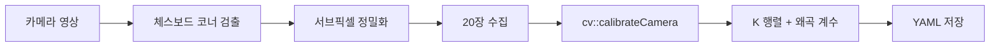

# Camera Calibration (카메라 캘리브레이션)

## 📌 개요

> 🎯 **목표**: 체스보드 패턴으로 카메라 내부 파라미터(K)와 왜곡 계수 추정
> 💻 **언어**: C++ (OpenCV 4.x)
> 🛠️ **하드웨어**: MacBook 내장 카메라 또는 Jetson + ELP Stereo

카메라 캘리브레이션은 Visual SLAM의 첫 단계입니다. 카메라가 세상을 어떻게 투영하는지(초점 거리, 주점, 왜곡)를 알아야 정확한 3D 복원이 가능합니다.

---

## 🔧 프로젝트 구조

```
calibration/
├── CMakeLists.txt
├── include/
│   └── camera_calibration.hpp   # CameraCalibration 클래스
├── src/
│   ├── camera_calibration.cpp   # 체스보드 검출, 캘리브레이션, 저장
│   ├── mono_calib.cpp           # 단일 카메라 캘리브레이션 (main)
│   └── stereo_calib.cpp         # 스테레오 캘리브레이션 (TODO)
└── data/
    └── macbook_calib.yaml       # 캘리브레이션 결과 예시
```

---

## 📋 관련 주차

| 주차 | 주제 | 연결 |
|:----:|------|------|
| W1 | 핀홀 카메라 모델, K 행렬 | 캘리브레이션이 추정하는 대상 |
| W2 | 왜곡 보정 | 왜곡 계수 활용 |

---

## 🚀 빌드 및 실행

```bash
cd calibration
mkdir -p build && cd build
cmake .. && make
./mono_calib 0   # 0: 카메라 ID
```

### 사용법

1. 체스보드(8x6 내부 코너)를 카메라 앞에서 다양한 각도로 보여주기
2. 체스보드가 감지되면 화면에 코너가 표시됨
3. **SPACE**: 현재 프레임 캡처 (최소 10장, 목표 20장)
4. **ESC**: 캡처 종료 → 자동으로 캘리브레이션 수행
5. 결과가 YAML 파일로 저장됨

### 캘리브레이션 품질 기준

| RMS 재투영 오차 | 품질 |
|:-:|:-:|
| < 0.5 px | Great |
| < 1.0 px | Good |
| >= 1.0 px | Poor (재촬영 필요) |

---

## 🏗️ 아키텍처



### CameraCalibration 클래스

| 메서드 | 역할 |
|--------|------|
| `findChessboardCorners` | 체스보드 코너 검출 + 서브픽셀 정밀화 |
| `calibrate` | 3D-2D 대응점으로 K, dist 추정 |
| `saveCalibration` | 결과를 YAML로 저장 |

---

## 📊 캘리브레이션 결과 예시

MacBook 내장 카메라 (1920x1080):

```
fx = 1425.1,  fy = 1425.0
cx = 954.6,   cy = 541.8
k1 = 0.018,   k2 = -0.151,  p1 = -0.003,  p2 = -0.002,  k3 = 0.246
```

---

## 📚 핵심 개념

- **내부 파라미터 K**: 초점 거리(fx, fy) + 주점(cx, cy) — 3D→2D 투영에 필수
- **왜곡 계수**: 방사 왜곡(k1, k2, k3) + 접선 왜곡(p1, p2) — 렌즈 특성 보정
- **RMS 재투영 오차**: 추정된 K로 3D 점을 재투영했을 때 실제 관측과의 거리 — 낮을수록 정확
