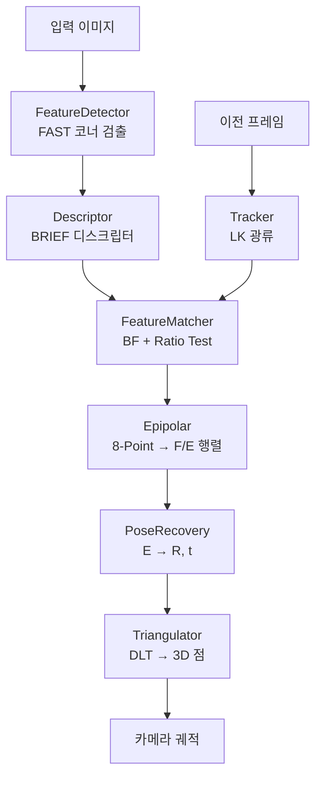
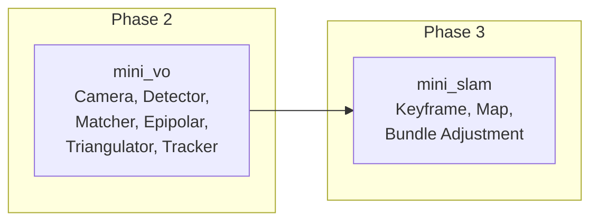

# mini_vo (Visual Odometry 파이프라인)

## [pin] 개요

> [goal] **목표**: Phase 2에서 배운 모듈들을 조합하여 Visual Odometry 파이프라인 구축
> [code] **언어**: C++ 17 (OpenCV 4.x)
> [pkg] **구조**: 주차별로 하나의 모듈을 직접 구현하여 점진적으로 완성

mini_vo는 Phase 2의 **통합 프로젝트**입니다. 각 주차에서 학습한 개념을 하나의 모듈로 구현하고, 최종적으로 이미지 시퀀스에서 카메라 궤적을 추정하는 VO 시스템을 만듭니다.

---

## [tool] 프로젝트 구조

```
mini_vo/
+-- CMakeLists.txt
+-- main.cpp                     # 데모 실행 (주차별 모듈 테스트)
+-- include/
|   +-- camera.h                 # W1-W2: 핀홀 카메라 모델
|   +-- feature_detector.h       # W3: FAST 직접 구현
|   +-- descriptor.h             # W3: BRIEF 직접 구현
|   +-- feature_matcher.h        # W4: BF 매칭 + Ratio Test
|   +-- epipolar.h               # W5: 8-Point Algorithm
|   +-- pose_recovery.h          # W6: E → R, t 분해
|   +-- triangulator.h           # W7: DLT 삼각측량
|   +-- tracker.h                # W8: LK 광류 추적
+-- src/
    +-- camera.cpp
    +-- feature_detector.cpp
    +-- descriptor.cpp
    +-- feature_matcher.cpp
    +-- epipolar.cpp
    +-- pose_recovery.cpp
    +-- triangulator.cpp
    +-- tracker.cpp
```

---

## [list] 주차별 모듈 매핑

| 주차 | 모듈 | 핵심 구현 |
|:----:|------|----------|
| W1-W2 | `Camera` | 핀홀 투영, 정규화 좌표 변환, K 행렬 |
| W3 | `FeatureDetector` | FAST 코너 검출 직접 구현 (브레젠험 원 + NMS) |
| W3 | `Descriptor` | BRIEF 디스크립터 직접 구현 (랜덤 쌍 비교) |
| W4 | `FeatureMatcher` | BF 매칭 + Ratio Test + RANSAC 필터링 |
| W5 | `Epipolar` | 8-Point Algorithm (Hartley 정규화 포함) |
| W6 | `PoseRecovery` | Essential Matrix → R, t 분해 (SVD + Cheirality) |
| W7 | `Triangulator` | DLT 삼각측량 (선형 최소제곱) |
| W8 | `Tracker` | Lucas-Kanade 광류 (AᵀA + 이미지 피라미드) |

---

##  빌드 및 실행

```bash
cd mini_vo
mkdir -p build && cd build
cmake .. && make
./mini_vo                    # 합성 이미지로 테스트
./mini_vo <image_path>       # 실제 이미지로 테스트
```

---

##  파이프라인 아키텍처



### 두 가지 매칭 경로

- **디스크립터 매칭** (W4): 새로운 장면, 루프 클로저 → `FeatureMatcher`
- **광류 추적** (W8): 연속 프레임, 빠른 추적 → `Tracker`

---

## [ref] Phase 3과의 연결

mini_vo의 모든 모듈은 Phase 3의 `mini_slam`에서 재사용됩니다:



mini_slam의 CMakeLists.txt에서 mini_vo의 소스를 직접 참조하므로, mini_vo 모듈을 완성하면 자동으로 mini_slam에도 반영됩니다.
