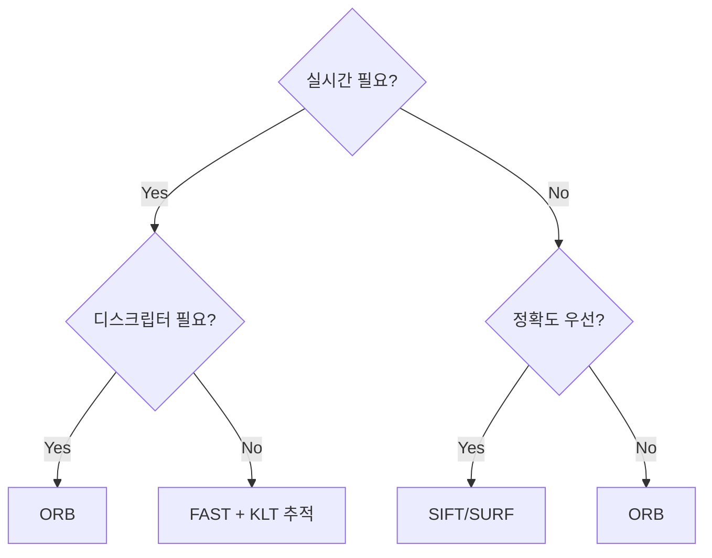

# Week 3: 특징점 검출 (Feature Detection)

## [pin] 개요

> [goal] **목표**: 이미지에서 추적/매칭 가능한 점 검출하기
> [time] **예상 시간**: 이론 2시간 + 실습 3시간

**특징점(Feature)** 은 이미지에서 독특하게 식별 가능한 점입니다. SLAM에서는 이 특징점을 프레임 간에 추적하거나 매칭하여 카메라 움직임을 추정합니다.

### [?] 왜 이걸 배워야 할까요?

**일상 비유**: 낯선 도시에서 길을 찾을 때 뭘 보나요?

- [X] 비슷하게 생긴 건물들 → 헷갈림
- [O] 눈에 띄는 랜드마크 (타워, 특이한 조각상) → 위치 파악 가능!

**SLAM에서도 마찬가지**:
- 평평한 벽 → 추적 불가 (어디가 어딘지 구분 안 됨)
- 모서리, 패턴 → 추적 가능 (고유하게 식별)

**VINS-Fusion에서의 활용**:
- `feature_tracker` 노드가 FAST 코너 검출
- 검출된 특징점을 프레임 간 추적
- 이 정보로 카메라 포즈 추정

---

## [list] 학습 순서

| 순서 | 단계 | 파일 | 연결 퀴즈 |
|:----:|------|------|-----------|
| 1 | 데모 실행 — `./basic` 출력 전체 읽기 | `basic.cpp` | - |
| 2 | 특징점 이론 (Harris, FAST 원리) | `README.md` | **easy 문제 1**: FAST 파라미터, **문제 5**: Harris 응답 |
| 3 | 디스크립터 이론 (BRIEF, ORB) | `README.md` | **easy 문제 2**: ORB 디스크립터 분석 |
| 4 | my_basic Step 1~2 (FAST, ORB 검출) | `my_basic.cpp` | **easy 문제 4**: 검출기 속도 비교 |
| 5 | my_basic Step 3~4 (시각화, 분포 분석) | `my_basic.cpp` | **easy 문제 3**: NMS 효과 분석 |
| 6 | my_basic Step 5~6 (비교, NMS 데모) | `my_basic.cpp` | - |
| 7 | 초급 퀴즈 풀기 | `quiz_easy.cpp` | **easy 문제 1~5** |
| 8 | 중급 퀴즈 풀기 | `quiz_medium.cpp` | **medium 문제 1~5** |
| 9 | 카메라 실습 | [PRACTICE.md](./PRACTICE.md) | 실시간 특징점 검출 |

---

##  Step 1: 먼저 돌려보기

> **이론을 읽기 전에 먼저 코드를 돌려보세요!**

```bash
cd week3 && mkdir build && cd build
cmake .. && make
./basic
```

실행 결과를 관찰한 후, 아래 이론을 읽으며 "아, 이게 이 뜻이었구나" 하고 채워갑니다.

---

## [ref] 핵심 개념

### 1. 좋은 특징점의 조건

#### 특징점이 되려면?

```
[X] 나쁜 특징점 (추적 어려움)           [O] 좋은 특징점 (추적 가능)

+--------------+                   +--------------+
|              |                   |    *--       |
|   (빈 영역)    |                   |   /   \      |
|              |                   |  *     *     |
|              |                   |   \   /      |
|              |                   |    *--       |
+--------------+                   +--------------+
  균일한 영역                         코너/교차점
```

**좋은 특징점의 3가지 조건**:

| 조건 | 설명 | 예시 |
|------|------|------|
| **반복성** (Repeatability) | 다른 뷰에서도 검출 | 같은 코너가 계속 보임 |
| **구별성** (Distinctiveness) | 주변과 구별됨 | 고유한 패턴 |
| **위치 정확도** | 정확한 위치 검출 | 서브픽셀 정밀도 |

---

### 2. Harris Corner Detector

#### 아이디어

윈도우를 이동시킬 때 **모든 방향으로 밝기 변화**가 있으면 코너!

```
    ← → ↑ ↓ 모든 방향으로 이동

  에지 (한 방향만 변화)    코너 (모든 방향 변화)    플랫 (변화 없음)
       ←→                    ->->                    
  +---------+              +--+--+              +---------+
  | | | | | |              |  \  |              |         |
  | | | | | |              |---* |              |         |
  | | | | | |              |  /  |              |         |
  +---------+              +-----+              +---------+
  
  한 방향만 변화            모든 방향 변화         변화 없음
```

#### 수학적 정의

**핵심 아이디어**

> 이미지 위에 작은 창(윈도우)을 올려놓고 아무 방향으로 밀어봤을 때,
> **밝기가 크게 변하면 그곳은 코너**다.

- **평탄한 영역**: 어느 방향으로 밀어도 변화 없음
- **엣지(선)**: 선을 따라 밀면 변화 없고, 선을 가로지르면 변화 있음
- **코너**: 어느 방향으로 밀어도 변화가 큼

**"윈도우를 민다"는 게 뭔가?**

"민다"는 창의 위치를 이동시켜 **다른 픽셀값이 창 안에 들어오게** 하는 것이다.

```
이미지 (각 칸 = 픽셀 밝기값)

     col0  col1  col2  col3
row0 [ 50 | 50 | 50 | 50 ]
row1 [ 50 | 50 | 50 | 50 ]
row2 [ 50 | 50 |200 |200 ]
row3 [ 50 | 50 |200 |200 ]
```

**평탄한 영역 (row0~1, col0~1)에서 밀기:**

```
원래 위치            오른쪽으로 1칸
+--------+          +--------+
| 50  50 |          | 50  50 |   ← 같은 값이 들어옴
| 50  50 |          | 50  50 |     변화 = 0
+--------+          +--------+
```

**코너 근처 (row1~2, col1~2)에서 밀기:**

```
원래 위치            오른쪽으로 1칸
+--------+          +--------+
| 50  50 |          | 50  50 |
| 50 200 |          |200 200 |   ← 50이었던 자리에 200이 들어옴!
+--------+          +--------+
                    변화 = (50-200)² = 22500  ← 큼!
```

→ 주변이 비슷한 밝기면 밀어도 같은 값이 들어와서 변화 없음
→ 코너처럼 밝기가 급변하는 곳은 조금만 밀어도 다른 값이 들어와서 변화 큼

**자기 상관 함수 — "밀어봤더니 얼마나 달라졌나?"**

> **왜 "자기 상관"인가?**
> 일반 상관(correlation)은 **서로 다른 두 신호**를 비교하지만,
> 자기 상관(auto-correlation)은 **같은 신호를 자기 자신**(을 이동시킨 것)과 비교한다.
> 아래 식에서 I(x,y)와 I(x+u, y+v)는 둘 다 **같은 이미지**이고, 
> 하나를 (u,v)만큼 밀어서 "나와 얼마나 달라졌는가"를 측정하는 것이다.
> "auto"는 그리스어로 "자기 자신(self)"이라는 뜻.

```
E(u,v) = Σ w(x,y) [I(x+u, y+v) - I(x, y)]²
           (x,y)
```

| 기호 | 의미 |
|------|------|
| I(x, y) | 원래 위치의 밝기값 (픽셀 밝기) |
| I(x+u, y+v) | 윈도우를 (u,v)만큼 **밀어본 후**의 밝기값 |
| [...]² | 밀기 전후 차이를 제곱 (항상 양수로 만듦) |
| w(x,y) | 가중치 — 윈도우 중심에 가까울수록 더 중요하게 봄 (가우시안) |
| Σ | 윈도우 안의 모든 픽셀에 대해 합산 |

→ E가 크면 "밀었더니 많이 달라졌다" = 그 방향으로 변화가 크다는 뜻

**Structure Tensor M — "미분으로 빠르게 계산하자"**

> M은 **Matrix(행렬)** 의 약자. "이 점 주변의 밝기 변화 정보를 2×2 행렬 하나로 정리한 것"이다.
> - `Σ Ix²` = 가로 방향 변화 → 크면 세로 에지(|)가 있다는 뜻
> - `Σ Iy²` = 세로 방향 변화 → 크면 가로 에지(-)가 있다는 뜻
> - 둘 다 크면 → **코너** (모든 방향 변화)
>
> M 하나로 그 점이 평탄/에지/코너인지 알 수 있어서 "**Structure**(구조) Tensor"라 부른다.

매번 윈도우를 실제로 밀어보면 너무 느리다.
**테일러 전개**(1차 근사)를 사용하면 밀지 않고도 변화량을 예측할 수 있다:

```
I(x+u, y+v) ≈ I(x,y) + Ix·u + Iy·v
```

- Ix = x방향(가로) 밝기 변화율 (그래디언트)
- Iy = y방향(세로) 밝기 변화율 (그래디언트)

이것을 E(u,v)에 대입하면 행렬 형태로 정리된다:

```
E(u,v) ≈ [u, v] · M · [u]
                      [v]

    [ Σ Ix²     Σ IxIy ]
M = [                  ]  (Structure Tensor)
    [ Σ IxIy   Σ Iy²   ]
```

| M의 항목 | 의미 |
|----------|------|
| Σ Ix² | 가로 방향 밝기 변화가 얼마나 강한가 |
| Σ Iy² | 세로 방향 밝기 변화가 얼마나 강한가 |
| Σ IxIy | 가로·세로 변화가 함께 일어나는 정도 |

→ M은 "이 지점 주변에서 밝기가 어떤 방향으로 얼마나 변하는지"를 2×2 행렬 하나로 요약한 것

#### Harris 응답 함수

**고유값 λ₁, λ₂ — "변화의 크기"**

M의 **고유값** λ₁, λ₂는 밝기 변화가 가장 큰 두 방향의 변화량이다:

- λ₁ = 주 변화 방향의 변화 크기
- λ₂ = 그에 수직인 방향의 변화 크기

**R 값 — "고유값을 직접 구하지 않고도 판별하기"**

고유값을 직접 구하는 건 계산 비용이 크다.
Harris는 행렬의 **행렬식(det)** 과 **대각합(trace)** 만으로 판별할 수 있음을 발견했다:

```
R = det(M) - k · trace(M)²
  = λ₁λ₂ - k(λ₁ + λ₂)²

여기서:
- det(M)   = λ₁ × λ₂    ← 두 고유값의 곱
- trace(M) = λ₁ + λ₂    ← 두 고유값의 합
- k: 민감도 파라미터 (보통 0.04~0.06, 클수록 코너 판정이 까다로워짐)
```

**고유값으로 해석**

| λ₁, λ₂ | 해석 | R 값 | 이유 |
|--------|------|------|------|
| 둘 다 작음 | 플랫 영역 | ≈ 0 | 곱(det)도 작고 합(trace)도 작음 |
| 하나만 큼 | 에지 | < 0 | 곱은 작은데 합은 커서 k·trace²가 det을 압도 |
| 둘 다 큼 | **코너** | **>> 0** | 곱(det)이 충분히 커서 양수 유지 |

#### Python 구현 (개념 이해용)

```python
import cv2
import numpy as np

def harris_corners(image, k=0.04, threshold=0.01):
    # 그래디언트 계산
    Ix = cv2.Sobel(image, cv2.CV_64F, 1, 0, ksize=3)
    Iy = cv2.Sobel(image, cv2.CV_64F, 0, 1, ksize=3)
    
    # Structure Tensor 요소
    Ixx = Ix * Ix
    Iyy = Iy * Iy
    Ixy = Ix * Iy
    
    # 가우시안 스무딩
    Ixx = cv2.GaussianBlur(Ixx, (5, 5), 0)
    Iyy = cv2.GaussianBlur(Iyy, (5, 5), 0)
    Ixy = cv2.GaussianBlur(Ixy, (5, 5), 0)
    
    # Harris 응답
    det = Ixx * Iyy - Ixy * Ixy
    trace = Ixx + Iyy
    R = det - k * trace * trace
    
    # 임계값 적용
    corners = R > threshold * R.max()
    
    return R, corners
```

---

### 3. FAST 코너 검출

#### 왜 FAST인가?

**Features from Accelerated Segment Test**

Harris는 모든 픽셀에서 그래디언트 계산 + 행렬 연산을 해야 하므로 느리다.
FAST는 **픽셀 밝기 비교만**으로 코너를 판별하므로 훨씬 빠르다.

| 알고리즘 | 하는 일 | 속도 |
|---------|---------|------|
| Harris | 그래디언트 → 행렬 → 고유값 | 느림 |
| **FAST** | **주변 16개 픽셀 밝기 비교** | **매우 빠름** |

→ 실시간 SLAM(VINS-Fusion)에서 FAST를 쓰는 이유: **1프레임당 수 ms 안에 끝나야 하니까**

#### 알고리즘 원리

**아이디어**: 코너 주변은 밝기가 급격히 변하므로, 중심 픽셀과 주변 픽셀의 밝기를 비교하면 코너인지 알 수 있다.

중심 픽셀(*) 주위 반지름 3의 원 위에 있는 **16개 픽셀**을 검사한다:

```
        1  2  3
     16         4
    15    *     5
    14          6
    13  12 11 10 9
         8  7

* = 코너 후보 (중심 픽셀, 밝기 = Ip)
1~16 = 주변 픽셀 (Bresenham 원)
```

**코너 판별**: 16개 중 **연속 N개**(보통 9~12개)가 중심보다 **모두 밝거나** 또는 **모두 어두우면** 코너로 판정한다.

구체적으로, threshold `t`를 정해놓고:

```
예시: 중심 밝기 Ip = 100, threshold t = 20

  밝은 판정: 주변 픽셀 > 100 + 20 = 120 이상
  어두운 판정: 주변 픽셀 < 100 - 20 = 80 이하

주변 16개 값: [130, 140, 135, 125, 90, 60, 50, 55, 70, 85, 95, 100, 110, 128, 132, 138]
              밝  밝  밝  밝  -   어  어  어  어  -   -   -   -   밝   밝   밝
                                 ↑ 연속 4개 어두움 (N=9 미달 → 이 방향은 탈락)
              ↑ 1번~4번 + 14번~16번 = 연속 7개 밝음 (N=9 미달 → 탈락)

→ 연속 9개 이상 없으므로 코너 아님
```

#### 고속 검사 (High-speed test)

매번 16개를 전부 확인하면 느리다. **먼저 1, 5, 9, 13번 (상하좌우) 4개만 검사**해서 빠르게 걸러낸다:

```
        1

    13   *    5

         9

이 4개 중 최소 3개가 밝거나/어두워야 연속 9개가 가능하다.
3개 미만이면 → 코너일 수 없음 → 나머지 12개 검사 생략 (빠르게 제외!)
```

→ 대부분의 픽셀은 코너가 아니므로, 이 사전 검사만으로 **~80%를 즉시 제외**할 수 있다.

```python
# OpenCV FAST
fast = cv2.FastFeatureDetector_create(threshold=20)  # t = 20
keypoints = fast.detect(gray_image)
```

#### Non-maximum Suppression (NMS)

FAST는 빠른 대신 코너를 **너무 많이** 검출하는 경향이 있다.
인접한 픽셀이 모두 코너로 잡히면 → 그중 **가장 강한 것만** 남긴다.

```
NMS 전 (코너 밀집)         NMS 후 (대표만 남김)

***
*** *  ---------->    *     *
***
                        각 영역에서 가장 강한 1개만 생존
```

> "강한 코너"란? 중심과 주변의 밝기 차이가 가장 큰 점이다.

**왜 중복이 생기는가?**

FAST는 "이 픽셀이 코너인가?"를 **한 픽셀씩 독립적으로** 판단한다.
문제는, 실제 코너 하나의 **주변 픽셀들도** 전부 코너 조건을 통과한다는 것이다:

```
실제 모서리는 1개인데...

  ***
  ***   ← 이 9개 픽셀이 전부 "나 코너야!" 하고 손을 듦
  ***

왜? 서로 1~2픽셀밖에 안 떨어져 있어서 주변 밝기 패턴이 거의 동일하다.
한 픽셀이 코너면 바로 옆 픽셀도 코너 조건을 만족할 가능성이 높다.
```

**NMS 동작 과정 — "같은 동네에서 1등만 살아남는다"**

각 코너 픽셀에는 **점수**가 있다 (중심과 주변 16개 픽셀의 밝기 차이 합).

```
예시: 3x3 영역 안의 코너 점수

  70  85  60
  80 [95] 75    ← 95가 이 동네에서 1등
  65  88  72
```

1. 각 코너 픽셀을 보면서
2. **바로 주변(3×3) 이웃 중 나보다 점수 높은 놈이 있는가?** 확인
3. 있으면 → 탈락
4. 없으면 → 살아남음 (이 동네 1등)

위 예시에서는 **95만 살아남고** 나머지 8개는 전부 제거된다.

```
NMS 전:                    NMS 후:

***
***  ***    ------>     *      *
***  ***
                         덩어리마다 대표 1개
```

→ 실제 모서리 2개에 대해 코너 후보가 15개 나왔지만, NMS 후에는 **진짜 코너 2개만** 남는다.

**NMS의 장점**

| 장점 | 설명 |
|------|------|
| 계산량 감소 | 특징점 1000개 → 200개로 줄면 이후 추적/매칭 연산도 5배 줄어듦 |
| 분포 개선 | 밀집된 덩어리가 대표 1개로 줄어서 특징점이 더 골고루 퍼짐 |
| 매칭 정확도 향상 | 바로 옆에 비슷한 점이 여러 개 있으면 헷갈리는데, 대표만 남기면 혼동 감소 |

**NMS의 단점**

| 단점 | 설명 |
|------|------|
| 약한 코너 손실 | 강한 코너 바로 옆에 있는 **진짜 다른 코너**도 점수가 낮으면 제거됨 |
| 윈도우 크기 민감 | 너무 작으면 중복 제거 효과 미미, 너무 크면 서로 다른 코너까지 합쳐버림 |
| 균일 분포 미보장 | 코너가 원래 한쪽에만 있으면 NMS 후에도 여전히 한쪽에 몰려있음 |

```
윈도우가 너무 크면:

  *A     *B    ← 실제로 다른 코너 2개인데
  +------+
  같은 동네로 취급 → B 탈락 (잘못된 제거)
```

> VINS-Fusion은 NMS의 "균일 분포 미보장" 문제를 보완하기 위해,
> **격자 기반 균일 분포**(이미지를 격자로 나누고 각 칸에서 N개씩 선택)를 추가로 사용한다.

---

### 4. 디스크립터 (Descriptor)

#### 왜 디스크립터가 필요한가?

FAST나 Harris로 특징점 **위치**는 찾았다. 하지만 위치만으로는 **다른 이미지에서 같은 점을 찾을 수 없다**:

```
이미지 1                    이미지 2
   *A (100, 200)               *? (95, 205)
      *B (300, 150)         *? (280, 160)    *? (310, 145)
   *C (120, 400)               *? (115, 395)

좌표가 비슷한 점이 여럿 있으면 → 어떤 점이 어느 점에 대응하는지 모름!
```

**해결**: 각 특징점 **주변 패턴을 숫자로 요약**한다. 이것이 **디스크립터(descriptor)**.

```
이미지 1                          이미지 2
*A → [1,0,1,1,0,0,1,0...]        *? → [1,0,1,1,0,0,1,1...]  ← A와 거의 같음! → 매칭
*B → [0,1,0,0,1,1,0,1...]        *? → [0,1,0,1,0,0,1,0...]  ← B와 다름
                                  *? → [0,1,0,0,1,1,0,1...]  ← B와 같음! → 매칭
```

→ 디스크립터가 비슷하면 = 같은 점

#### BRIEF 디스크립터

**Binary Robust Independent Elementary Features**

가장 단순한 디스크립터. 특징점 주변 패치에서 **픽셀 쌍을 비교**해서 0 또는 1을 만든다:

```
특징점 주변 패치 (밝기값)

+-------------+
| 50  80  120 |    미리 정해둔 픽셀 쌍:
| 90  *  100  |    쌍1: (50, 120) → 50 < 120 → 1
| 60  110  70 |    쌍2: (90, 100) → 90 < 100 → 1
+-------------+    쌍3: (110, 80) → 110 < 80 → 0
                   ...
                   256개 쌍 → [1, 1, 0, ...] = 256비트 = 32바이트
```

**매칭이 빠른 이유**: 두 디스크립터의 차이를 **XOR 연산**(해밍 거리)으로 구한다.
비트 연산이라 덧셈/곱셈보다 훨씬 빠르다.

```
A = [1,0,1,1,0,0,1,0]
B = [1,0,1,0,0,0,1,1]
XOR= [0,0,0,1,0,0,0,1] → 다른 비트 2개 = 해밍 거리 2 (매우 유사)
```

#### ORB = FAST + BRIEF + 회전 불변성

**Oriented FAST and Rotated BRIEF**

BRIEF의 약점: 이미지가 **회전**되면 픽셀 쌍의 위치가 달라져서 디스크립터가 완전히 바뀐다.

```
원본                     90° 회전
+---+                    +---+
| A | → 쌍: (A,B)=1      | C | → 쌍: (C,A)=? → 결과가 달라짐!
| B |                    | A |
+---+                    +---+
```

ORB는 이 문제를 해결한다:

1. **Oriented FAST**: 특징점 주변 밝기의 무게중심으로 **방향**을 계산
2. **Rotated BRIEF**: 계산된 방향에 맞게 BRIEF 패턴을 **회전시켜** 적용

→ 이미지가 회전되어도 **같은 디스크립터**가 나온다.

```python
# OpenCV ORB
orb = cv2.ORB_create(nfeatures=500)
keypoints, descriptors = orb.detectAndCompute(gray_image, None)

# keypoints: 특징점 위치 + 방향
# descriptors: (N, 32) — 특징점 N개, 각각 32바이트(256비트) 이진 디스크립터
```

---

### 5. 특징점 알고리즘 비교

지금까지 배운 알고리즘들을 정리하면:

| 알고리즘 | 하는 일 | 속도 | 디스크립터 | 회전 불변 | 스케일 불변 |
|---------|---------|------|-----------|----------|-----------|
| Harris | 그래디언트 행렬 연산 | 느림 | 없음 | [X] | [X] |
| **FAST** | 16개 픽셀 밝기 비교 | **매우 빠름** | 없음 | [X] | [X] |
| BRIEF | 픽셀 쌍 비교 → 이진 | - | 32바이트 | [X] | [X] |
| **ORB** | FAST + 회전 보정 BRIEF | 빠름 | 32바이트 | [O] | ^ |
| SIFT | 스케일 공간 분석 | 매우 느림 | 128×float | [O] | [O] |

> **회전 불변**: 이미지가 회전되어도 같은 특징점/디스크립터를 검출하는 능력
> **스케일 불변**: 이미지가 확대/축소되어도 같은 특징점을 검출하는 능력

**SLAM에서의 선택 기준**:

```
Q: 같은 점을 어떻게 다음 프레임에서 찾지?

방법 1 — "추적" (Optical Flow)
  연속 프레임에서 같은 점이 어디로 이동했는지 따라감
  → 디스크립터 불필요, 빠름
  → VINS 방식: FAST (검출) + KLT (추적)

방법 2 — "매칭" (Descriptor Matching)
  각 점의 디스크립터를 비교해서 가장 비슷한 점을 찾음
  → 디스크립터 필수, 추적보다 느리지만 루프 클로저에 유리
  → ORB-SLAM 방식: ORB (검출 + 디스크립터)
```

---

### 6. SLAM에서의 활용

#### VINS-Fusion feature_tracker

VINS는 **추적 방식**을 사용한다. 디스크립터 없이, 이전 프레임의 특징점이 **어디로 움직였는지** 직접 따라간다:

```
프레임 1               프레임 2 (0.03초 후)
+----------+          +----------+
|     *A   |          |      *A' |  ← A가 오른쪽으로 이동한 것을 추적
|  *B      |   ---->  |   *B'    |  ← B도 추적
|       *C |          |        [x] |  ← C는 추적 실패 → 제거
|          |          |  *D(new) |  ← 새 특징점 추가 (개수 유지)
+----------+          +----------+
```

```
전체 흐름:
새 프레임 → FAST로 검출 → 기존 특징점 추적(KLT) → 실패한 점 제거 → 새 특징점 추가
```

#### ORB-SLAM3

ORB-SLAM은 **매칭 방식**을 사용한다. 매 프레임마다 디스크립터를 계산하고, 기존 맵의 디스크립터와 비교해서 같은 점을 찾는다:

```
새 프레임에서 ORB 특징점 검출
        ↓
디스크립터 계산: [1,0,1,1,0,...], [0,1,0,0,1,...], ...
        ↓
기존 맵의 디스크립터와 해밍 거리 비교
        ↓
가장 가까운 쌍 = 같은 점 → 카메라 위치 추정(PnP)
```

> **왜 두 방식이 나뉘는가?**
> - 추적(VINS): 연속 프레임에서 빠르게 따라가기 좋음. 하지만 한 번 놓치면 끝
> - 매칭(ORB-SLAM): 오래 전 프레임과도 비교 가능 → **루프 클로저**(한 바퀴 돌아왔을 때 인식)에 유리

---

---

## [chart] 핵심 정리

### 알고리즘 선택 가이드



### 파라미터 가이드

| 파라미터 | 높이면 | 낮추면 |
|---------|--------|--------|
| FAST threshold | 적은 검출, 강한 코너만 | 많은 검출, 약한 코너도 |
| ORB nfeatures | 많은 특징점, 느림 | 적은 특징점, 빠름 |
| NMS 윈도우 | 균일 분포 | 밀집 분포 |

---

## [O] 학습 완료 체크리스트

### 기초 이해 (필수)
- [ ] 좋은 특징점의 조건 3가지 설명 가능
- [ ] Harris와 FAST의 차이 설명 가능
- [ ] 디스크립터가 왜 필요한지 설명 가능

### 실용 활용 (권장)
- [ ] OpenCV로 FAST, ORB 검출 가능
- [ ] 파라미터 튜닝 효과 이해
- [ ] 검출 결과 시각화 가능

### 심화 (선택)
- [ ] Harris 응답 함수 유도 가능
- [ ] NMS 구현 가능
- [ ] VINS feature_tracker 코드 흐름 이해

---

## [link] 다음 단계

### Week 4: 특징점 매칭 (Feature Matching)

검출된 특징점을 다른 이미지에서 찾기:
- Brute-Force / FLANN 매칭
- Lowe's Ratio Test
- RANSAC으로 outlier 제거

---

## [ref] 참고 자료

- OpenCV Feature Detection Tutorial
- ORB 논문: "ORB: an efficient alternative to SIFT or SURF"
- VINS-Fusion feature_tracker 코드

---

## [?] FAQ

**Q1: FAST가 Harris보다 왜 빠른가요?**
A: Harris는 모든 픽셀에서 그래디언트 → 행렬 → 고유값 계산을 해야 합니다.
FAST는 주변 16개 픽셀 밝기만 비교하고, 사전 검사(4개 픽셀)로 ~80%를 즉시 제외합니다.

**Q2: 특징점이 너무 적게 검출되면?**
A: threshold를 낮추면 더 약한 코너도 잡힙니다.
또는 이미지 전처리(히스토그램 균등화)로 밝기 대비를 키워서 코너를 더 뚜렷하게 만들 수 있습니다.

**Q3: ORB vs SIFT, 언제 뭘 쓰나요?**
A: 실시간(SLAM, AR)이면 ORB. 속도가 중요 없는 오프라인 작업(3D 복원, 파노라마)이면 SIFT.
SIFT는 스케일 불변까지 지원해서 더 정확하지만, ORB보다 ~100배 느립니다.

**Q4: VINS에서 ORB 안 쓰는 이유?**
A: VINS는 연속 프레임을 **추적**(Optical Flow)하므로 디스크립터가 필요 없습니다.
"이 점이 다음 프레임에서 어디로 갔나?"만 알면 되기 때문입니다.

---

**[goal] Week 3 핵심 메시지:**

> 특징점 = SLAM의 눈
> 
> **FAST**로 빠르게 검출, **ORB**로 매칭 가능하게!
