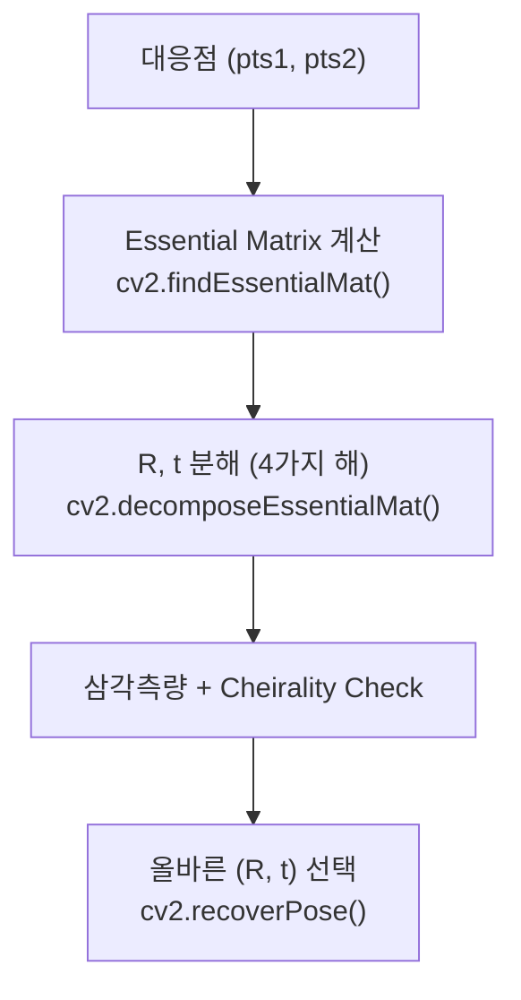
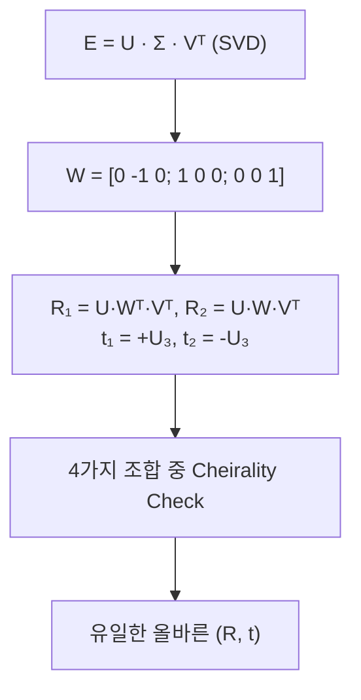

# Week 6: 포즈 추정 (Pose Estimation from E)


## 개요


> **목표**: Essential Matrix에서 카메라 회전(R)과 평행이동(t) 분해하기
> **예상 시간**: 이론 3시간 + 실습 2시간


지난 주에 Essential Matrix를 배웠습니다. 이번 주에는 E에서 **카메라의 상대 포즈 (R, t)**를 복원하는 방법을 배웁니다. 이것이 Visual Odometry의 핵심입니다!


### [?] 왜 이걸 배워야 할까요?


**일상 비유**: 두 사진에서 카메라가 얼마나 움직였는지 알아내기


```
Frame 1 Frame 2
+-----------+ +-----------+
| * * | R, t | * * |
| * | --------> | * |
| * | | * |
+-----------+ +-----------+


E를 알면 -> R, t를 추정할 수 있다!
```


**SLAM에서의 중요성**:
- **Visual Odometry**: 매 프레임 R, t 추정 → 경로 추정
- **초기화**: 첫 두 프레임에서 초기 맵 + 포즈
- **재위치화**: 추적 실패 시 위치 복구


---


## 학습 순서


| 순서 | 활동 | 연결 퀴즈 |
|:----:|------|:--------:|
| 1 | `./basic` 실행, 삼각측량 파이프라인 출력 전체 읽기 | - |
| 2 | Stereo Depth / 삼각측량 이해 (README §1-2 + basic 출력 대조) | **easy 1**: Stereo Depth, **easy 2**: 삼각측량 기하학 |
| 3 | 재투영 오차 / Baseline 이해 | **easy 3**: 재투영 오차, **easy 4**: Baseline 정확도 |
| 4 | `my_basic.cpp` Step 1~4 (depth, cheirality, reproj, triangulate) | **easy 5**: 회전 행렬 검증, **easy 6**: 스케일 모호성 |
| 5 | `my_basic.cpp` Step 5~9 (multi, avg, eval, vis, pipeline) | - |
| 6 | 중급 퀴즈 | **medium 1**: 삼각측량 구현, **medium 2**: Bundle Adjustment, **medium 3**: Stereo Matching, **medium 4**: E 분해 + Cheirality, **medium 5**: 실패 사례 |
| 7 | 삼각측량 실습 | [PRACTICE.md](./PRACTICE.md) |


---


## Step 1: 먼저 돌려보기


> **이론을 읽기 전에 먼저 코드를 돌려보세요!**


```bash
cd week6 && mkdir build && cd build
cmake .. && make
./basic
```


실행 결과를 관찰한 후, 아래 이론을 읽으며 "아, 이게 이 뜻이었구나" 하고 채워갑니다.


---


## 핵심 개념


### 1. E에서 R, t 분해 원리


#### E = [t]× R 복습


```
E = [t]× · R


여기서:
- [t]×: t의 반대칭 행렬 (3×3, rank 2)
- R: 회전 행렬 (3×3)
```


**목표**: E가 주어졌을 때, [t]×와 R 분리!


#### SVD 분해


```
E = U · Σ · Vᵀ


여기서:
- U: 3×3 직교 행렬
- Σ = diag(σ, σ, 0): 두 특이값이 같고 하나는 0
- Vᵀ: 3×3 직교 행렬
```


**핵심 행렬 W**:


```
     [ 0 -1 0 ]
W = [ 1 0 0 ] (90° Z축 회전)
     [ 0 0 1 ]
```


---


### 2. 4가지 가능한 해


#### R, t 분해 공식


```
R₁ = U · Wᵀ · Vᵀ t₁ = +U₃ (U의 3번째 열)
R₂ = U · Wᵀ · Vᵀ t₂ = -U₃


R₃ = U · W · Vᵀ t₃ = +U₃
R₄ = U · W · Vᵀ t₄ = -U₃
```


즉, **4가지 (R, t) 조합** 가능:
1. (R₁, +t)
2. (R₁, -t)
3. (R₂, +t)
4. (R₂, -t)


**왜 4가지?**


```
Camera Front Camera Back
     P * * P'
      \ /
       \ /
        *----------------------*
       C1 C2


P와 P'는 같은 이미지 좌표를 생성!
-> 기하학적으로 구분 필요 (Cheirality Check)
```


---


### 3. Cheirality Check (깊이 양수 검사)


#### 올바른 해 선택 기준


**3D 점이 두 카메라 모두의 앞에 있어야!**


```
Correct: Incorrect:


    * P C1 *-------* P
   / \ \
  / \ \
 * * *
C1 C2 C2


Z > 0 (두 카메라 앞) Z < 0 (카메라 뒤)
```


**검사 방법**:
1. 각 (R, t) 조합으로 3D 점 삼각측량
2. 삼각측량된 점의 Z 좌표 확인
3. **두 카메라 기준 모두 Z > 0**인 해 선택


```python
def cheirality_check(R, t, pts1, pts2, K):
    """
    Cheirality Check: Z > 0인 점 비율 반환
    """
    P1 = K @ np.eye(3, 4) # [I|0]
    P2 = K @ np.hstack([R, t.reshape(3, 1)]) # [R|t]
    

    count = 0
    for p1, p2 in zip(pts1, pts2):
        # 삼각측량
        X = triangulate(P1, P2, p1, p2)
        

        # 카메라 1에서 Z > 0?
        if X[2] > 0:
            # 카메라 2에서 Z > 0?
            X_cam2 = R @ X + t
            if X_cam2[2] > 0:
                count += 1
    

    return count / len(pts1)
```


---


### 4. 전체 포즈 추정 파이프라인





#### OpenCV recoverPose


```python
import cv2
import numpy as np


# Essential Matrix 계산
E, mask = cv2.findEssentialMat(pts1, pts2, K,
                                method=cv2.RANSAC,
                                prob=0.999,
                                threshold=1.0)


# R, t 복원 (자동으로 Cheirality Check)
_, R, t, mask_pose = cv2.recoverPose(E, pts1, pts2, K)


print(f"R:\n{R}")
print(f"t: {t.flatten()}")
```


---


### 5. 스케일 모호성


#### 중요한 한계


```
E에서 얻은 t는 방향만 정확!
크기(스케일)는 알 수 없음!


실제 이동: t = [0.5, 0, 0.1]m
E에서 복원: t' = [0.98, 0, 0.19] (단위 벡터)
```


**이유**:
- E = [t]× R 에서 t를 λt로 바꿔도 같은 E
- 단일 카메라(Monocular)의 근본적 한계


**해결 방법**:


| 방법 | 설명 |
|------|------|
| **Stereo** | 베이스라인 알려짐 → 절대 스케일 |
| **IMU 융합** | 가속도로 스케일 추정 (VINS) |
| **알려진 물체** | 물체 크기로 스케일 추정 |
| **연속 프레임** | 상대 스케일만 (drift 발생) |


---


### 6. 회전 행렬 검증


#### R이 올바른지 확인


```python
def is_valid_rotation(R):
    """회전 행렬 검증"""
    # 1. 직교성: RᵀR = I
    orthogonal = np.allclose(R.T @ R, np.eye(3), atol=1e-6)
    

    # 2. 행렬식: det(R) = 1
    det = np.linalg.det(R)
    proper = np.isclose(det, 1.0, atol=1e-6)
    

    return orthogonal and proper
```


**주의**: det(R) = -1이면 반사 행렬 (잘못된 해)


---


### 7. 실전 고려사항


#### 포즈 추정 실패 케이스


| 케이스 | 설명 | 해결 |
|--------|------|------|
| 순수 회전 | t ≈ 0 | E 정의 안 됨, 다른 프레임 사용 |
| 공면 점들 | 모든 점이 평면 위 | Homography 사용 |
| 적은 매칭 | < 5점 | 더 많은 특징점 필요 |
| 많은 outlier | RANSAC 실패 | threshold 조정 |


#### VINS-Fusion에서의 사용


```
sfm.cpp / initial_sfm.cpp:


1. KLT로 특징점 추적
2. 5-point RANSAC으로 E 계산
3. recoverPose로 R, t 분해
4. 삼각측량으로 초기 맵 생성
5. IMU 사전적분과 결합하여 스케일 추정
```


---


## 실습 파일


| 파일 | 내용 | 난이도 |
|------|------|--------|
| `quiz_easy.cpp` | 깊이 계산, 삼각측량, 회전 검증, 스케일 | |
| `quiz_medium.cpp` | 삼각측량 구현, E 분해, Cheirality, 실패 사례 | |


---


## 핵심 정리


### E → R, t 분해 요약





### 공식 요약


| 단계 | 공식 |
|------|------|
| E 정의 | E = [t]× R |
| SVD | E = U Σ Vᵀ |
| R 후보 | R = U W(ᵀ) Vᵀ |
| t 후보 | t = ± U₃ |
| 검증 | det(R) = 1, Rᵀ R = I |


---


## 학습 완료 체크리스트


### 기초 이해 (필수)
- [ ] E에서 왜 4가지 해가 나오는지 설명 가능
- [ ] Cheirality Check 원리 설명 가능
- [ ] 스케일 모호성 이해


### 실용 활용 (권장)
- [ ] cv2.recoverPose() 사용 가능
- [ ] 회전 행렬 검증 가능
- [ ] 4가지 해 중 올바른 해 선택 이해


### 심화 (선택)
- [ ] SVD 분해 유도 이해
- [ ] W 행렬의 기하학적 의미 이해
- [ ] VINS 초기화 코드 분석


---


## 다음 단계


### Week 7: 삼각측량과 PnP


R, t를 알면:
- **삼각측량**: 2D 점들 → 3D 점 복원
- **PnP**: 3D-2D 대응 → 새 프레임 포즈 추정


---


## 참고 자료


- Multiple View Geometry (Hartley & Zisserman) - Chapter 9.6
- OpenCV recoverPose documentation
- VINS-Fusion initial_sfm.cpp


---


## [?] FAQ


**Q1: det(R) = -1이 나오면?**
A: R에 -1을 곱하면 됩니다. 또는 U나 V의 부호 조정.


**Q2: 모든 해에서 Cheirality 실패하면?**
A: E 추정이 잘못됐거나, 순수 회전인 경우. 다른 프레임 사용.


**Q3: t의 크기는 어떻게 정하나요?**
A: Monocular는 못 정함. 첫 프레임 t=1로 설정하고 상대 스케일만.


**Q4: OpenCV가 자동으로 해주는 건?**
A: `recoverPose()`가 4가지 해 테스트 + Cheirality Check를 자동 수행.


---


** Week 6 핵심 메시지:**


> E → R, t 분해 = Visual Odometry의 핵심
>
> **4가지 해 중 Cheirality Check로 올바른 해 선택!**
