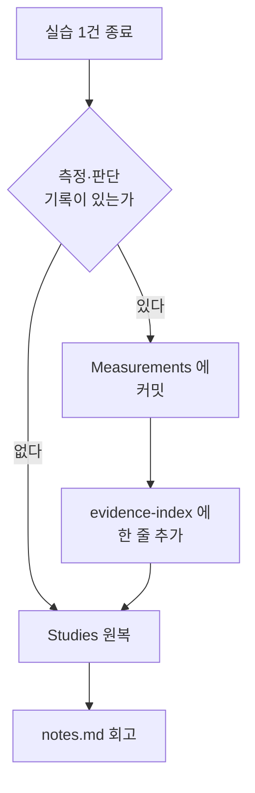

# Measurements — 실측 증거 보존 공간

> 원칙: **정답은 지우고, 증거는 남긴다.**
> `Studies/` 는 언제든 처음부터 다시 풀 수 있는 상태로 유지하고 (완성 코드 원복), 실측·판단 기록은 여기에 보존한다 (원복 금지). 전자는 나의 재학습을 위한 것이고, 후자는 나 이외의 검증자 (채용 담당자, 미래의 나) 를 위한 것이다 — 목적이 달라 충돌하지 않는다.

---

## 0. 이 디렉터리를 처음 보는 사람에게

### 0.1 한 문장으로

> `Studies/` 는 **연습장**이고 여기는 **실험 노트**다. 연습장은 다시 풀 수 있게 답을 지워 두고, 실험 노트는 "내가 이런 조건에서 이런 수치를 얻고 이런 판단을 내렸다" 를 남에게 보여 주기 위해 지우지 않는다.

### 0.2 왜 두 공간을 나누는가

같은 파일이 두 목적을 동시에 만족시킬 수 없기 때문이다.

| 공간 | 독자 | 좋은 상태 | 나쁜 상태 |
|---|---|---|---|
| `Studies/` | 미래의 나 (복습하는 사람) | 빈칸이 비어 있어 다시 풀 수 있다 | 답이 채워져 있어 읽고 넘어가게 된다 |
| `Measurements/` | 제 3자 (채용 담당자, 미래의 나) | 조건·수치·판단이 다 적혀 있다 | 수치만 있고 조건이 없어 검증이 안 된다 |

두 요구가 정면으로 충돌하므로 **위치로 분리**한다. 복습할 때 학습 디렉터리에서 답이 보이지 않으면 되고, 검증할 때 실험 디렉터리에 기록이 남아 있으면 된다.

### 0.3 "증거" 가 무슨 뜻인가

여기서 증거란 **제 3자가 같은 결론에 도달할 수 있게 만드는 기록**이다. "OpenVLA 를 4070 에서 돌려 봤다" 는 주장이고, 아래 셋이 갖춰지면 증거가 된다.

| 갖춰야 할 것 | 없으면 생기는 반박 |
|---|---|
| 조건 (무엇을 어떻게 재었는가) | "그 300 ms 는 전처리를 포함한 건가요?" |
| 원본 수치 (가공 전 데이터) | "평균만 있으면 꼬리 지연을 알 수 없는데요" |
| 판단과 그 근거 (왜 그 선택인가) | "int8 은 왜 안 써 봤나요?" |

세 반박에 그 자리에서 답할 수 있는 상태가 목표다. 실제 사례는 [`openvla-rtx4070-int4/`](openvla-rtx4070-int4/) 에서 볼 수 있다.

### 0.4 자주 나오는 용어

| 용어 | 뜻 |
|---|---|
| **실측**(measurement) | 문헌 수치를 인용한 것이 아니라 내 장비에서 직접 재어 얻은 값 |
| **raw 데이터** | 통계로 가공하기 전의 원본 배열. 평균만 남기면 되돌릴 수 없어 원본을 따로 둔다 |
| **재현**(reproducibility) | 같은 조건을 다시 세워 같은 수치가 나오는지 확인할 수 있는 상태 |
| **warm-up** | 본 측정 전에 버리는 예비 실행. 첫 호출에는 초기화 비용이 섞여 들어간다 |
| **p50 / p95 / p99** | 값을 정렬했을 때 하위 50% / 95% / 99% 지점. p50 은 중앙값, p95·p99 는 "느린 쪽 꼬리" 를 본다 |
| **VRAM peak** | 실행 중 GPU 메모리 사용량의 최댓값. 평균이 아니라 최댓값이 OOM 여부를 결정한다 |
| **OOM**(out of memory) | 메모리 부족으로 실행이 죽는 것 |
| **commit 식별자** | 그 측정을 수행한 코드의 git 버전. 코드가 바뀌면 수치도 바뀌므로 함께 적는다 |
| **`.npy` / `.csv`** | numpy 배열 / 표 형식의 원본 데이터 파일 |
| **`.rrd`** | Rerun (로봇 시각화 도구) 의 기록 파일. 센서·상태 시계열을 재생할 수 있다 |
| **rosbag** | ROS 메시지를 시간과 함께 통째로 녹화한 파일 |
| **experiment-id** | 실험 하나를 가리키는 디렉터리 이름. 예: `openvla-rtx4070-int4` |

---

## 1. 저장하지 않는 것 (원복 대상 — 여기 두지 않는다)

- quiz 정답
- PRACTICE 완성 코드 (빈칸·문제 상태로 되돌림)
- 단계별 solution, 그대로 복사해 쓸 수 있는 최종 구현
- 튜토리얼을 따라 친 수준의 코드 (재작성 비용이 낮고 재작성 자체가 학습인 것)

**판정 기준**: "다음 복습 때 이것이 남아 있으면 문제를 다시 푸는 대신 답을 베끼게 되는가?" → 그렇다면 지운다.

이 기준이 왜 필요한지 구체적으로: 답이 옆에 있으면 사람은 반드시 본다. 그리고 답을 보고 "아 맞아, 이거였지" 하는 감각은 **다시 풀 수 있는 능력과 다르다.** 면접에서 요구되는 것은 후자이므로, 복습 시점의 나에게서 답을 빼앗는 것이 목적이다.

## 2. 반드시 저장하는 것

- **측정 데이터와 조건**: benchmark 원본 (`.npy`, `.csv` 등 raw), 측정 조건 (warm-up 횟수, batch size, 입력 해상도, CPU/GPU 동기화 방식, preprocessing 포함 여부), 결과 통계 (평균·표준편차, p50/p95/p99, VRAM peak), 시스템 지표 (성공/실패 횟수, frame drop 등)
- **환경과 재현 정보**: OS·driver·CUDA·Python·핵심 dependency 버전, 사용 hardware, 재현 명령어 또는 스크립트, commit 식별자, 측정 날짜
- **판단 기록**: 오류 유형과 원인, 선택한 해결 방법과 이유, 배제한 대안과 배제 근거 (예: int8 배제 사유), 그래프·결과 표
- **시각·재생 자료**: 스크린샷, 영상, Rerun 기록 (`.rrd`), rosbag 등 (용량이 크면 대표 구간만)

**판정 기준**: "이것이 있으면 내가 이 작업을 수행했고 이 판단을 내렸다는 사실을 제 3자가 검증할 수 있는가?" → 그렇다면 남긴다.

네 항목이 각각 다른 반박을 막는다.

| 항목 | 없을 때 무너지는 것 |
|---|---|
| 측정 조건 | 수치의 의미. 전처리 포함 여부 하나로 300 ms 가 다른 값이 된다 |
| 환경·버전 | 재현 가능성. 라이브러리 한 버전 차이로 로드 자체가 실패할 수 있다 |
| 판단 기록 | 실력의 증거. 수치는 장비가 냈고, 판단은 사람이 냈다 |
| 시각 자료 | 동작했다는 사실 자체. 표만으로는 "정말 움직였나" 를 못 보인다 |

세 번째 줄이 이 디렉터리의 핵심이다. **수치는 누구나 같은 장비를 사면 얻지만, "왜 int8 을 배제했는가" 는 그 사람이 무엇을 검토했는지를 드러낸다.** 배제한 대안까지 적어 두는 이유가 여기 있다.

## 3. 경계 사례 판정

두 기준이 동시에 걸리는 경우 (예: 측정 스크립트가 곧 실습 정답인 경우):

1. **측정 스크립트는 남긴다.** 벤치마크 재현성이 학습 반복보다 우선한다. 단, `Studies/` 가 아니라 `Measurements/<실험명>/scripts/` 에 둔다 — 복습 시 학습 디렉토리에서 정답이 보이지 않게 하는 것이 목적이므로, 위치 분리로 두 목적을 모두 달성한다.
2. **실습 코드 일부가 판단 기록에 필요한 경우** (예: 특정 workaround), 전체 정답이 아니라 해당 스니펫만 `findings.md` 에 인용한다.
3. **애매하면 남긴다.** 지운 증거는 복구 불가능하지만, 남긴 정답은 나중에 지울 수 있다. 비대칭이 크므로 보존 쪽으로 기운다.

3번의 비대칭을 한 번 더 짚는다. 잘못 지운 증거는 그 실험을 다시 돌려야 복구되고, 장비·시간이 없으면 아예 복구되지 않는다. 반대로 잘못 남긴 정답은 발견한 날 지우면 끝이다. **손실의 크기가 다르므로 판단이 애매한 구간에서는 보존이 정답이다.**

## 4. 실험 디렉터리 표준 구조

```text
Measurements/
+-- <experiment-id>/          <- 예: openvla-rtx4070-int4
    +-- environment.md        <- 환경·버전·hardware
    +-- methodology.md        <- 측정 조건·절차
    +-- raw/                  <- 원본 데이터
    +-- summary.csv           <- 통계 요약
    +-- plots/                <- 그래프
    +-- scripts/              <- 재실행 스크립트
    +-- findings.md           <- 결과 해석·판단 근거·배제한 대안
```

네 개의 md 가 답하는 질문이 서로 다르다. 이 분리를 지키면 문서가 서로를 중복 설명하지 않는다.

| 파일 | 답하는 질문 | 넣지 않는 것 |
|---|---|---|
| `environment.md` | 어떤 장비·어떤 버전에서 재었는가 | 수치 해석 |
| `methodology.md` | 무엇을 어떻게 재었는가 (조건·절차·결과 수치) | 왜 그 값인지의 해석 |
| `findings.md` | 그 수치가 무엇을 뜻하고 어떤 판단을 낳았는가 | 측정 조건의 원본 |
| `raw/` + `summary.csv` | 가공 전 값은 무엇이었는가 | 서술 |

**수치의 원본은 `methodology.md`, 해석은 `findings.md`** — 이 한 줄이 두 문서를 가르는 기준이다. 같은 수치를 두 곳에 적으면 나중에 한쪽만 고쳐 어긋난다.

실제 예시는 [`openvla-rtx4070-int4/`](openvla-rtx4070-int4/) 하나뿐이므로, 새 실험을 시작할 때 그 디렉터리를 본보기로 삼는다.

## 5. 워크플로우 (실습 1건 종료 시)

1. 측정·판단 기록이 발생했는가? → 발생분을 `Measurements/<experiment-id>/` 에 커밋 (**원복 전에 먼저**)
2. [`Portfolio/evidence-index.md`](../Portfolio/evidence-index.md) 에 한 줄 추가 (실험명, 날짜, 입증 역량)
3. `Studies/` 의 완성 코드를 문제 상태로 원복
4. `notes.md` 에 회고 기록 (정답 코드 제외)



순서가 중요하다 — **증거 보존이 원복보다 먼저다.** 원복 후 증거를 남기려 하면 이미 지워진 상태다. 원복은 `git checkout` 한 번으로 끝나므로, 순서를 어기면 되돌릴 기회 없이 사라진다.

2번의 `evidence-index.md` 는 "무엇을 어디서 보였는지" 의 색인이다. 증거가 디렉터리 안에만 있으면 남이 찾지 못하므로, 한 줄 요약과 위치를 목록에 남긴다.

## 6. 소급 적용

- Phase 4 OpenVLA 실측은 `openvla-rtx4070-int4/` 로 이관 완료. 부족한 방법론 항목은 2026.08 내 재측정으로 보완한다 (4070 은 보유 지속이나 휴직 중 장애 시 현장 방문 필요).
- Phase 0-2 의 단순 실습은 소급 보존하지 않는다 — 판정 기준 (제 3자 검증 필요성) 에 미달한다.

두 번째 줄의 판단 근거: 튜토리얼을 따라 친 결과물은 누가 해도 같은 값이 나오므로 그 사람에 대해 알려 주는 것이 없다. 반대로 "12GB GPU 에 7B 모델을 올려 3.33 Hz 를 얻고 그 수치를 첫 원리로 설명했다" 는 기록은 제 3자가 검증할 대상이 된다. **보존 여부의 기준은 작업의 난이도가 아니라 검증 가치다.**
