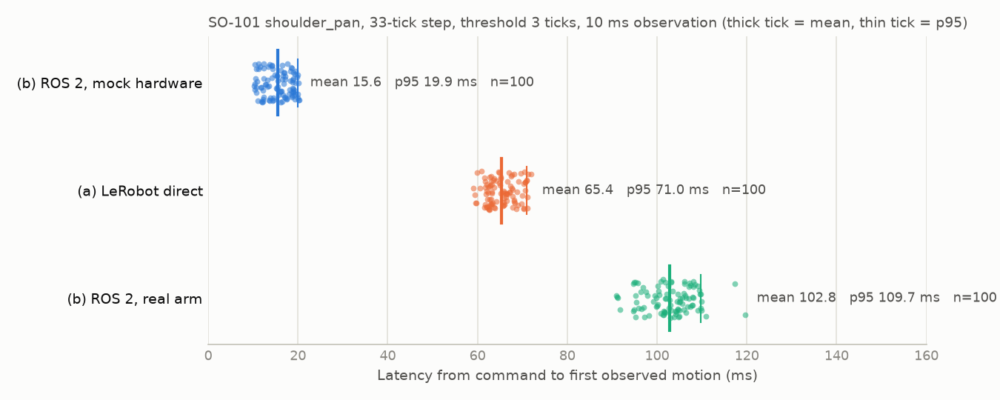

# 결과 해석 — so101-dual-latency

> 수치가 무엇을 뜻하고 어떤 판단을 낳았는가. 수치의 원본은 [`methodology.md`](methodology.md) §5, 환경은 [`environment.md`](environment.md).
> 결론 (2026-09-25): **(b)-(a) = 37.5 ms.** 그중 메커니즘으로 설명되는 것은 10 ms 안팎이고, 나머지 25-30 ms 가 어디서 드는지는 아직 모른다. 이 수치를 "ROS 2 통합 오버헤드" 로 최종 보고하지 않는다 — §3.

## 0. 이 문서가 답하는 질문

> **"ROS 2 를 거치면 얼마나 느려지고, 그 시간은 어디에 드는가."**

## 1. 한눈에

| 실행 | mean | p95 | std | 뜻 |
|---|---|---|---|---|
| (b) ROS 2 경유, mock | 15.6 ms | 19.9 | 3.0 | 서보 · 시리얼이 없는 "DDS + 제어 주기 대기" |
| (a) LeRobot 직결 | 65.4 ms | 71.0 | 3.3 | 시리얼 + 서보가 움직이기 시작하는 시간 (스택 없음) |
| (b) ROS 2 경유, 실제 팔 | 102.8 ms | 109.7 | 5.3 | 위 둘의 합이어야 하는데 그보다 크다 |
| **(b)-(a)** | **37.5 ms** | | | 측정된 통합 오버헤드. 95% 신뢰구간 ±1.3 ms |

점 하나가 반복 1회다. 굵은 눈금이 mean, 가는 눈금이 p95. 세 분포가 겹치지 않고, 어느 실행에도 꼬리가 없다 (p99 와 max 의 차이가 mock 0.1 ms, (a) 0.7 ms, (b) 2.4 ms).

## 2. 시간이 어디에 드는가

### 2.1 (b) mock — DDS 는 0.3 ms, 나머지는 전부 제어 주기 대기

10.30-20.22 ms 에 고르게 퍼진다. 메커니즘 그대로다.

1. 명령이 제어 주기 (10 ms) 의 아무 위상에나 떨어져 다음 주기 시작까지 0-10 ms 를 기다린다.
2. 그 주기의 `update()` 에서 컨트롤러가 명령을 하드웨어 명령 인터페이스에 쓰고, `write()` 가 mock 에 넘긴다.
3. mock 은 받은 명령을 **그다음 주기의** `read()` 에서 현재 위치로 돌려준다. 여기서 주기 하나 (10 ms) 가 더 붙는다.

그래서 10 ms + [0, 10) ms. 최솟값 10.30 ms 에서 10 ms 를 빼면 DDS 전송 + 구독 콜백 + 버퍼 전달이 0.3 ms 라는 뜻이다. **ROS 2 의 토픽 통신 자체는 이 측정에서 무시할 만하다. 비용은 "다음 주기까지 기다리는 것" 이다.**

### 2.2 (a) — 65 ms 의 대부분은 서보

(a) 에는 스택이 없다. 시리얼 쓰기 (0.3 ms 안팎), 10 ms 격자 읽기의 늦음 (평균 5 ms), 읽기 자체 (0.4 ms) 를 빼면 **서보가 명령을 받고 4틱을 넘어 움직이는 데 약 59 ms** 가 든다. `Acceleration` 50 (5000 tick/s^2) 으로 정지에서 4틱을 가는 이론값은 40 ms 이므로, 서보 안에서 명령을 처리하고 움직이기 시작하기까지 15-20 ms 가 더 있거나 가속도 단위가 가정과 다르다. 어느 쪽이든 이 시간은 두 경로에 똑같이 들어가야 하는 항이다 — 그것이 정말 같았는지가 §2.3 의 문제다.

### 2.3 (b) 실제 팔 — 회계가 맞지 않는다

(b) 실제 팔은 (b) mock 의 메커니즘에 서보 · 시리얼을 더한 것이어야 한다.

| 항 | 예상 | 근거 |
|---|---|---|
| DDS + 콜백 | 0.3 ms | §2.1 |
| 다음 주기까지 대기 | 평균 5 ms | §2.1 |
| 주기 안에서 `read()` 뒤에 `write()` | 2-6 ms | 드라이버가 서보 6개의 위치 · 속도를 읽은 뒤에 쓴다 |
| 시리얼 쓰기 + 서보가 4틱 넘게 움직이기까지 | 약 59 ms | §2.2 와 같아야 한다 |
| 다음 `read()` 까지의 늦음 | 0-10 ms | 상태는 주기 경계에서만 읽힌다 |
| **합** | **67-80 ms** | |
| **실측** | **102.8 ms** | |

**23-36 ms 가 설명되지 않는다.** 측정된 오버헤드 37.5 ms 중 메커니즘이 설명하는 것은 제어 주기 대기 5 ms + 주기 안의 read 선행 2-6 ms + DDS 0.3 ms, 합쳐 10 ms 안팎이다. 나머지가 어디서 드는지 모르는 채로는 "ROS 2 를 거치는 대가가 37 ms" 라고 말할 수 없다. 37 ms 가 ROS 2 의 대가인지, 이 드라이버 구현의 대가인지, 측정 조건의 비대칭인지가 갈리지 않았기 때문이다.

### 2.4 부수 통계가 가리키는 것

| 관찰 | 값 | 읽는 법 |
|---|---|---|
| (b) 실제 팔의 방향 비대칭 | +33틱 100.7 ms (std 6.2) vs -33틱 105.0 ms (std 3.0) | (a) 에는 없다 (65.7 vs 65.0). 서보 · 중력이 아니라 ROS 2 경로 쪽의 현상이다. (b) 는 드라이버의 `write()` 가 주기 안의 거의 같은 위상에서 나가므로, 서보 시작 시각이 주기 경계에 걸리면 관측이 앞뒤 주기로 갈려 한쪽 방향의 std 만 커질 수 있다 (§5 한계 1) |
| (b) 실제 팔의 시간에 따른 감소 | 처음 10회 105.1 → 마지막 10회 101.6 ms | (a) 는 평평하다 (64.9 → 64.8). (b) 실제 팔이 그날 첫 실행이라 서보가 데워지며 마찰이 줄었을 수 있다. 3.5 ms 라 §2.3 의 공백을 메우지는 못하지만, "같은 날 같은 자세" 만으로는 조건이 같지 않다는 신호다 |
| 값을 10 ms 로 나눈 나머지 | (b) 21 / 11 / 26 / 23 / 19, (a) 24 / 28 / 16 / 17 / 15 | 둘 다 균등에서 크게 벗어나지 않는다 (칸당 기대 20 ± 4). 위상 잠김이 있다면 (b) 가 한 칸에 몰려야 하는데 그렇지 않다 — 서보 시작 시각의 흔들림 (std 3 ms) 이 잠김을 지운 것으로 보인다 |

## 3. 판단

1. **측정 파이프라인은 검증됐다.** mock 이 메커니즘 예측 (10 + [0, 10) ms) 과 소수점까지 맞고, 실패가 없고, 세 분포의 std 가 3-5 ms 로 좁다. t0 · t1 의 시계, 위상 난수화, 문턱 판정이 의도대로 동작한다.
2. **37.5 ms 는 재현될 숫자지만 분해되지 않은 숫자다.** 신뢰구간 ±1.3 ms 는 "다시 재도 37 이 나온다" 는 뜻이지 "37 이 ROS 2 의 대가다" 는 뜻이 아니다. 기록에는 "실측 37.5 ms, 그중 약 10 ms 는 제어 주기 대기로 설명, 나머지는 조사 중" 으로 적는다.
3. **규모 감각.** 정책을 30 Hz 로 돌리면 action 하나의 예산이 33 ms 다. 37.5 ms 는 그 예산을 넘는다. 스파이크의 SmolVLA chunk 추론 106 ms (action 50개) 와 견주면 3분의 1 이다. 이것이 크냐 작냐는 §4 의 실험으로 37 ms 가 어디로 가는지 안 뒤에 판단한다.

## 4. 다음 실험 — 원인 후보와 판별 순서

값싼 것부터. 1 · 2 는 팔을 추가로 움직이지 않는다.

| 순서 | 실험 | 가르는 것 |
|---|---|---|
| 1 | ros2_control 의 자체 통계 `/controller_manager/statistics/full` 을 (b) 실행 중에 구독한다. 드라이버 `read()` · `write()` 의 실행 시간과 주기 흔들림이 찍힌다 | §2.3 의 "read 선행 2-6 ms" 가 실제로 얼마인지. 6개 서보의 위치 · 속도 동기 읽기가 LibSerial 의 타임아웃 대기로 8-10 ms 를 먹으면 `write()` 가 주기 끝에 나가고 다음 주기를 침범한다 — 그러면 공백의 상당 부분이 여기다 |
| 2 | `update_rate` 를 200 으로 (methodology §4 의 선택 검증) | 공백이 주기와 함께 줄면 주기 관련 (대기 · read 선행 · 관측 늦음). 줄지 않으면 서보 쪽 |
| 3 | (a) 스크립트에서 드라이버처럼 **같은 목표를 10 ms 마다 다시 쓰는** 변형을 잰다 (Acceleration · 위치 · 시간 · 속도 7바이트 한 패킷) | 드라이버는 명령이 바뀌지 않아도 매 주기 목표를 다시 보낸다. 서보가 목표를 받을 때마다 가속 프로파일을 다시 시작한다면 (b) 에서만 시작이 늦어진다. (a) 변형이 100 ms 근처로 올라가면 이것이 원인이고, 드라이버가 "바뀐 명령만 쓰기" 로 고칠 수 있는 항목이다 |
| 4 | (b) 실제 팔 → (a) → (b) 실제 팔 순서로 같은 세션에 다시 잰다. 스크립트가 시작 틱을 요약 csv 에 남기게 고친다 | §2.4 의 온도 · 자세 효과의 상한. 두 (b) 가 3 ms 안에서 같으면 §2.3 의 공백은 순서 · 자세 탓이 아니다 |
| 5 | 문턱 5틱 (methodology §4) | 두 경로의 관측 조건이 같다는 마지막 확인 |

## 5. 배제한 원인

| 후보 | 배제 근거 |
|---|---|
| t0 와 `header.stamp` 의 시계가 다르다 | mock 의 최솟값이 정확히 주기 1개 + 0.3 ms 다. 시계 오프셋이 있으면 그만큼 통째로 밀린다 |
| `/joint_states` 가 스크립트에 늦게 도착한다 | t1 을 도착 시각이 아니라 `header.stamp` 로 잡았다. 도착 지연은 값에 들어가지 않는다 |
| 서보 가속도 · 속도가 두 경로에서 다르다 | (a) 실행 시작 시 서보에서 읽은 값이 `Acceleration` 50 · `Goal_Velocity` 2400 이고, 드라이버는 매 `write()` 마다 같은 상수를 보낸다 (environment.md §3) |
| 명령 위상이 한쪽에 몰렸다 | mock 이 10-20 ms 에 균등하다. 위상 난수화가 동작한다 |
| LeRobot 의 `max_relative_target` 가 (a) 에 읽기를 더했다 | `None` 으로 끄고 쟀다 |
| 실패 반복이 통계를 흔들었다 | 실패 0 / 100, 세 실행 모두 |

## 6. 한계

1. **(b) 의 관측 늦음은 난수가 아니다.** (a) 는 명령 시각이 읽기 격자와 무관하게 흩어져 관측 늦음이 평균 5 ms 다. (b) 는 드라이버의 `write()` 가 주기 안의 거의 같은 위상에서 나가므로, 서보 시작 시각이 주기의 어디에 걸리느냐가 매번 비슷하다. 그 늦음은 0-10 ms 사이의 어떤 고정값이고, (b)-(a) 에는 그만큼 (±5 ms) 의 계통 오차가 있다. §2.4 의 나머지 분포는 잠김이 강하지 않다고 말하지만 없애지는 못한다.
2. **팔 자세가 같았는지 기록이 없다.** (a) 와 (b) 실제 팔 사이에 bringup 을 껐다 켜서 토크가 풀렸다. `shoulder_pan` 은 중력을 받지 않아 영향이 작다고 보지만 확인은 아니다.
3. **관절 하나, 계단 크기 하나, 세션 하나.** 33틱 계단에서 4틱을 넘는 시점만 봤다. 큰 계단이나 다른 관절에서 서보 항이 달라지면 공통 항의 상쇄도 달라진다.
4. **드라이버는 이 컨테이너의 한 커밋 (`18aed7f`) 이다.** §4 의 3번이 맞다면 결과는 ROS 2 의 성질이 아니라 이 드라이버 구현의 성질이다.
