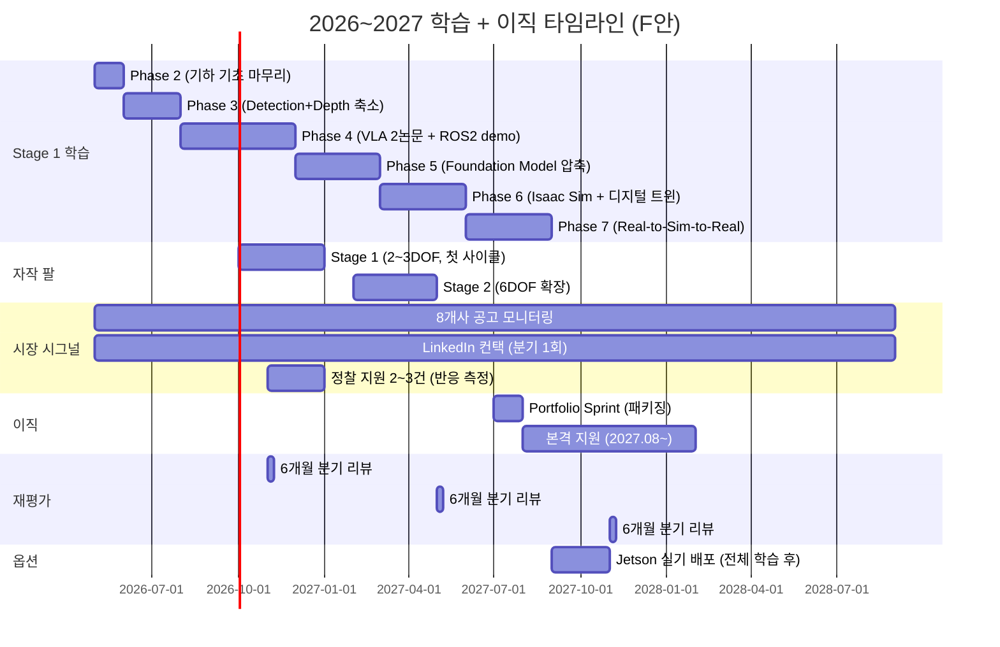

# Physical AI 학습 로드맵


> **목표**: AMR ROS 양산 SW + Physical AI 통합 → **VLA/Foundation Model 통합 엔지니어**
> **기간**: Stage 1 (이직 전) + Stage 2 (이직 후) + Stage 2+ (장기 확장)
> **전제**: 2025.08 출생 딸과 함께하는 직장인 아빠, AMR ROS Application 개발자


---


## Repo 운영 방식


- `Studies/` 하위 코드는 **의도적으로 미완성 유지**
- 역순 학습 원칙에 따라 **로컬에서 작성 → 동작 확인 → 원복**
- 산출물 (#1, #2.5, #4 등) 은 **별도 디렉토리에 완성본 보존** 방침


---


## 전체 로드맵 (F안)





---


## 타임라인 요약


| 시기 | Stage | 내용 | 목표 |
|------|-------|------|------|
| 2026.01-02 | Stage 1 | Phase 0-1 (완료) | 환경 세팅, 수학 핵심 |
| 2026.03-05 | Stage 1 | Phase 2: Perception 기하 기초 (마무리 중) | 카메라 모델 + Multi-view |
| 2026.06-08 | Stage 1 | **Phase 3 (축소): Detection + Depth → PC TensorRT + ROS2 노드** | **산출물 #1 (2026.08)** |
| 2026.09-12 | Stage 1 | **Phase 4: RT-2 + OpenVLA 블로그 2편 + ROS2 minimal demo** | **산출물 #2 (2026.12)** |
| 2026.10-12 | Stage 1 | **Hardware-Arm Stage 1**: Dynamixel 2-3DOF + URDF + Sim 디지털 트윈 | **산출물 #2.5 (2026.12)** |
| 2026.11-12 | Stage 1 | **정찰 지원 2-3건** (합격 기대 X, 면접관 반응 측정) | 시장 시그널 |
| 2026.12-2027.02 | Stage 1 | Phase 5: Foundation Model (ViT/CLIP/DINOv2/SigLIP, 동작 원리 수준) | 사전 지식 |
| 2027.02-04 | Stage 1 | **Hardware-Arm Stage 2**: 6DOF + teleop + 안전 인터록 | #4 하드웨어 기반 |
| 2027.02-05 | Stage 1 | Phase 6: Isaac Sim + 디지털 트윈 (Sim/Real gap 측정) | #4 Sim 기반 |
| 2027.05-07 | Stage 1 | **Phase 7: Real-to-Sim-to-Real (OpenVLA + ROS2 + 자작 팔 통합)** | **산출물 #4 결정타 (2027.07)** |
| 2027.07 | Stage 1 | **Portfolio Sprint** (1개월, 패키징) | 이직 준비 |
| **2027.08~** | **Career** | **본격 이직 활동 (분기당 면접 2-3건)** | 합격 |
| 이직 후~ | Stage 2 | 회사 환경 활용 (BEV / Foundation Model 심화 / 그 외) | 시니어 성장 |


---


## 언어 사용 전략


| Phase | 내용 | 언어 | 이유 |
|-------|------|------|------|
| Phase 0-1 | 환경 세팅, 수학 | Python | 빠른 프로토타이핑 |
| **Phase 2** | **Perception 기하 기초** | **C++** | OpenCV C++ (Ubuntu PC) |
| **Phase 3 (축소)** | **Detection + Depth → PC TRT + ROS2 노드** | **Python** (학습) + **C++/TensorRT** (PC 배포) | PyTorch → PC TensorRT |
| **Phase 4** | **VLA 논문 + OpenVLA → ROS2 minimal demo** | **Python** + **ROS2 (rclpy)** | HuggingFace inference + ROS2 토픽 |
| **Phase 5** | **Foundation Model 기초** | **Python** | HuggingFace transformers |
| **Phase 6** | **Isaac Sim + 디지털 트윈** | **Python** (Isaac Sim API) + **ROS2** | URDF 임포트 + Sim/Real 매칭 |
| **Phase 7** | **Real-to-Sim-to-Real** | **Python** + **C++** (안전 인터록) + **ROS2** | OpenVLA + 자작 팔 통합 |
| **Hardware-Arm** | **자작 팔 트랙** | **ROS2** + **URDF/XACRO** | `dynamixel_hardware` + URDF |


### 핵심 원칙


- **기하학 기초 (Phase 2)**: **C++** (OpenCV, 카메라 모델/캘리브레이션)
- **딥러닝 학습 (Phase 3-5)**: **Python** (PyTorch, HuggingFace)
- **딥러닝 배포 (Phase 3, 7)**: **PC TensorRT + ROS2 노드** (Jetson 30+ FPS 는 Phase 7 이후 옵션)
- **로봇 통합 (Phase 6, 7, Hardware-Arm)**: **ROS2 + URDF + Isaac Sim**


---


## Stage 1: 학습 + 자작 팔 + 본격 지원 (2026.05-2027.08)


### 실습 가이드 위치


**모든 실습 가이드는 `Studies/Phase X/weekN/PRACTICE.md` (또는 `Studies/Hardware-Arm/` 의 단계별 문서) 에 있습니다.**
**각 Phase 의 week 별 자료는 미리 작성되어 있음 — 진입 시점에 재검토 + 필요 시 갱신.**


| Phase | 가이드 위치 | 언어 |
|-------|------------|------|
| Phase 2 | 각 week별 PRACTICE.md ([`week3/PRACTICE.md`](./Studies/Phase%202/week3/PRACTICE.md)) | C++ |
| Phase 3 (축소) | 각 week별 PRACTICE.md ([`week1/PRACTICE.md`](./Studies/Phase%203/week1/PRACTICE.md)) | Python + PC TensorRT |
| Phase 4 (VLA) | 미리 작성됨 — 진입 시 (2026.09) 다시 체크 | Python + ROS2 |
| Phase 5 | 미리 작성됨 — 진입 시 (2026.12) 다시 체크 | Python |
| Phase 6 | 미리 작성됨 — 진입 시 (2027.02) 다시 체크 | Python + ROS2 |
| Phase 7 | 미리 작성됨 — 진입 시 (2027.05) 다시 체크 | Python + C++ + ROS2 |
| Hardware-Arm Stage 1 | 미리 작성됨 — 진입 시 (2026.10) 다시 체크 | ROS2 + URDF |
| Hardware-Arm Stage 2 | 미리 작성됨 — 진입 시 (2027.02) 다시 체크 | ROS2 + URDF + Sim 매칭 |


---


### Phase 0-2: 기초
> Phase 0-1 완료, Phase 2 진행 중


| Phase | 내용 | 기간 |
|-------|------|------|
| 0 | 환경 세팅 | 2주 |
| 1 | 수학 핵심 (선형대수, 3D 기하) | 2개월 |
| 2 | Perception 기하 기초 (카메라 모델, Multi-view) | 4주 |


> 기존 SLAM 트랙 (VO/BA, VIO) 은 [Archive/SLAM-legacy/](./Archive/SLAM-legacy/) 로 이동되었습니다.


### Phase 3 (축소): Detection + Depth → PC TensorRT + ROS2 노드 (약 2개월, 2026.06-08)
> **메시지**: Detection + Depth 의 핵심 + Foundation Model latency 사전 학습용 PC TensorRT 경험
> **시작 전 액션**: 1순위 3개사 JD 정독 (VLA 모델 직접 개발 코스닥 상장사 / 대기업 SW 자회사 VLA / 신생 휴머노이드 스타트업) → 산출물 #1 스펙 1페이지 확정


| 주차 | 내용 | 핵심 모델 | 우선순위 |
|------|------|----------|----------|
| 1-2 | PyTorch 복습 | - | 필수 |
| 3-5 | **YOLO11 학습 + PC TensorRT 변환** | YOLO11, TensorRT | 필수 |
| 6-7 | **Depth Anything V2 + PC TensorRT** | Depth Anything V2 | 필수 |
| 8 | **통합 시스템 + ROS2 노드 래퍼** | Detection + Depth + ROS2 | 필수 |


> **Jetson 실기 배포는 Phase 7 이후 옵션** — 전체 학습 (Phase 2-7) 완료 후 시간 여유 보고 결정


**산출물 #1**: YOLO11 + Depth Anything V2 → **PC TensorRT 추론 + ROS2 노드 래퍼 + 1분 영상** (2026.08까지 `physical-ai-study` 레포에 공개)


### Phase 4: VLA 논문 reading + OpenVLA ROS2 minimal demo (4개월, 2026.09-12)
> **목표**: VLA 의 아키텍처 다이어그램을 막힘없이 읽을 수 있는 수준 + OpenVLA inference 를 ROS2 토픽으로 받는 minimal demo
> **선정 논문 (2편)**: RT-2, OpenVLA — 필요 시 분기 재평가에서 π0 / Helix 로 갱신


| 주차 | 내용 | 핵심 |
|------|------|------|
| 1-3 | RT-2 정독 + 블로그 1편 | Vision-Language → Action |
| 4-7 | OpenVLA 정독 + 블로그 1편 | open-source VLA 의 표준 |
| 8-12 | **OpenVLA HuggingFace inference → ROS2 토픽 minimal demo (#2)** | Brain ↔ Body 첫 통합 |
| 13-16 | 블로그 2편 마무리 + 패키징 + #2 영상 | Phase 7 의 예고편 |


**산출물 #2**: RT-2 + OpenVLA 블로그 2편 + **OpenVLA inference → ROS2 토픽 minimal demo + 1분 영상** (2026.12까지)


### Phase 5: Foundation Model 기초 (3개월, 2026.12-2027.02)
> **목표**: ViT / CLIP / DINOv2 / SigLIP 의 *동작 원리 수준* — 아키텍처 다이어그램 + 학습 방식 + 입출력 인터페이스 설명 가능 수준. **직접 학습 / fine-tune 은 하지 않음**.


| 주차 | 내용 | 핵심 |
|------|------|------|
| 1-3 | ViT | Patch embedding + Self-attention |
| 4-6 | CLIP | Vision-Language contrastive |
| 7-9 | DINOv2 | Self-supervised |
| 10-12 | SigLIP + Phase 4 demo 보강 | Sigmoid loss |


> 결과물 없는 학습 금지. 각 주제별 짧은 노트 또는 mini-demo 1개.


### Phase 6: Isaac Sim + 디지털 트윈 (3개월, 2027.02-05)
> **목표**: 자작 팔 (Hardware-Arm Stage 2) 의 URDF 를 Isaac Sim 에 임포트 → 디지털 트윈 + Sim/Real gap 측정 인프라 구축
> **자작 팔 Stage 2 (2027.02-04) 와 병행**


| 주차 | 내용 | 핵심 |
|------|------|------|
| 1-3 | Isaac Sim 환경 셋업 | Conda + Workstation |
| 4-7 | URDF 임포트 + 디지털 트윈 | Sim Joint State ↔ Real Joint State 매칭 |
| 8-12 | Sim/Real gap 측정 인프라 | latency / 반복성 / force / 시각 |


### Phase 7: Real-to-Sim-to-Real (3개월, 2027.05-07) — 결정타
> **목표**: OpenVLA fork + ROS2 노드 래핑 + 자작 6DOF 팔 + 디지털 트윈 (Isaac Sim) + 안전 인터록 + latency 측정 → **산출물 #4**


| 주차 | 내용 | 핵심 |
|------|------|------|
| 1-3 | OpenVLA fork + ROS2 통합 | inference 토픽 |
| 4-6 | 안전 인터록 통합 | 위치/속도/토크 한계 + e-stop |
| 7-9 | latency 측정 + Sim/Real gap 영상 | "VLA latency 200ms" 의 직접 증거 |
| 10-12 | 통합 영상 + 패키징 | 이직 면접용 |


**산출물 #4 결정타** (2027.07까지): Real-to-Sim-to-Real — 자작 6DOF 팔 + Isaac Sim 디지털 트윈 + OpenVLA fork + ROS2 노드 + 안전 인터록 + latency 측정 + Sim/Real gap 영상


> *"Sim only 산출물은 박사도 만든다. Sim + 자작 실 팔이면 본인만 만든다."*


---


### Hardware-Arm: 자작 팔 트랙 (2단계, 2026.10-2027.04)
> **왜 자작 팔인가**: *"Brain ↔ Body 통합 SW 엔지니어"* 의 가장 완전한 증거. 본인 약점 (VLA 신입급) 을 본인 강점 (펌웨어 2년 + 자동차 R&D 보조 2년 + AMR ROS 5년) 으로 직접 깨는 카드.
>
> 박사·연구생이 못 만드는 결과물 3가지:
> - **latency**: 추론 → 모터 명령까지 ms 단위 측정
> - **안전 메커니즘**: e-stop, 토크 한계, 충돌 감지 직접 구현
> - **양산 비용 이해**: DIY 팔 BOM 표 — "이 가격대에 이 성능까지"


#### Stage 1 (2026.10-12, 3개월, 약 30-50만원)
- **하드웨어**: Dynamixel XL330 2-3DOF + U2D2 + 그리퍼 (3D 프린트)
- **목표**: pick-and-place 단순 동작 + URDF + ROS2 드라이버 (`dynamixel_hardware`) + Isaac Sim 디지털 트윈 첫 사이클
- **산출물 #2.5**: 동작 영상 + URDF + Sim 임포트 영상 (1분)
- **이유**: 첫 사이클을 작게 돌려 시행착오 비용 분산. 두 번째 사이클 (Stage 2) 압축에 결정적.


#### Stage 2 (2027.02-04, 3개월, 약 100-150만원 추가)
- **하드웨어**: 6DOF 확장 (Dynamixel XM430 추가) + teleop 입력 장치
- **목표**: teleop 데이터 수집 + 카메라 ↔ 팔 base 캘리브 + 안전 인터록 + Sim 물리 파라미터 매칭
- **출력**: Phase 6 (Isaac Sim) 의 자연스러운 토대. Phase 7 산출물 #4 의 하드웨어 기반.


#### BOM 합계 (Dynamixel 풀세트, 보유 3D 프린터 활용)
| 항목 | 권장 | 비용 |
|---|---|---|
| 모터 6 DOF | XL330 + XM430 | 100-200만 |
| 컨트롤러 | U2D2 + 전원 | ~10만 |
| 그리퍼 | 단순 2-finger 또는 3D 프린트 | 0-15만 |
| 카메라 | 보유 ELP Stereo 활용 | 0 |
| 3D 프린터 | 보유 시 그대로 | 0 |
| **합계** | | **약 150-225만** |


> **보너스**: Dynamixel 채택 = **Dynamixel 제조사이자 휴머노이드 양산 상장사 (2순위 C)** 지원 시 직접 매칭 (모터 제조사 = 회사 자체).
> **대안 (AR4 저예산, ~50-100만)**: 스테퍼 기반이라 토크 피드백 없음 → "안전 메커니즘" 증거 약화 → 추천 안 함.


### 정찰 지원 (2026.11-12, 2-3건)
> **목적**: 시장 시그널을 *추측이 아닌 실측* 으로. 합격 기대 X, 면접관 반응 측정.
>
> **시점 정합**: 2026.12 시점에 가진 패 = 산출물 #1 (Detection+Depth+TRT+ROS2 노드) + #2 (RT-2 + OpenVLA 블로그 2편 + ROS2 minimal demo) + #2.5 (자작 팔 Stage 1 영상).


**후보 (실제 채용 공고 모니터링 결과 보고 결정)**:
- 신생 휴머노이드 스타트업 (풀스택, 1순위 C) — 시니어 진입 가능성
- Dynamixel 제조사 + 휴머노이드 양산 상장사 (2순위 C) — 모터 직접 매칭 + ROS 강점
- 시리즈 B 이상 AMR Perception SW 포지션 중 1


**활용**: 면접관 질문 패턴 → Phase 4-7 학습 우선순위 보정. 2027.05 분기 재평가 입력.


### Portfolio Sprint (1개월, 2027.07)
> Phase 7 완료 직후, 본격 지원 직전.


**목적**: 산출물 #1, #2, #2.5, #4 를 **면접용으로 패키징**. **새 산출물 제작 X, 통합/포장**.


(Phase 3-7 에서 누적했으므로 Sprint 는 만드는 단계가 아니라 다듬는 단계)


| 주 | 주제 | 핵심 |
|----|------|------|
| 1 | 패키징 설계 | 산출물 4개를 면접관 진입점으로 재구성 |
| 2 | **포트폴리오 Repo 정비** | `physical-ai-study` README + 산출물별 디렉토리 정리 |
| 3 | **결정타 #4 영상 통합** | Real-to-Sim-to-Real 1-3분 영상 마감 |
| 4 | 이력서 개편 + LinkedIn / 지원 트래커 정비 | 국문/영문, 본격 지원 시작 준비 |


**차별화 메시지**: *"Foundation Model 을 실제 로봇 (자작 팔 포함) 에 직접 배포해본 양산 SW 엔지니어"*


---


## Stage 2: 이직 후 (회사 환경 활용)


> 새 회사 적응 기간 (3-6개월) 후 심화 학습 시작. 적응 기간 버퍼 확보 우선.


Stage 1 에서 학습 제외로 분류한 영역 중 회사 환경에서 자연스럽게 익혀야 할 것:


| 영역 | 내용 | 비고 |
|---|---|---|
| BEV / Occupancy | Multi-camera → BEV / 3D 점유 | 자율주행 직무 진입 시 |
| Foundation Model 심화 | Stage 1 의 "동작 원리 수준" 을 응용 수준으로 | VLA 통합 직무 진입 시 |
| Synthetic Data / Domain Randomization | Isaac Sim 환경 확장, Blender 에셋 | manipulation/humanoid 직무 진입 시 |
| Multi-modal | Camera + LiDAR / VLM 응용 | 직무 매칭에 따라 |


> **방향은 회사 직무가 결정**. 미리 짜지 않음 — Stage 1 의 결정타 산출물 #4 가 어느 회사로 매칭되느냐가 Stage 2 의 학습 영역을 결정한다.


---


## Stage 2+: 장기 확장


### Embodied AI
| 주제 | 내용 |
|------|------|
| Navigation + Manipulation | 이동 + 조작 통합 |
| World Models | 환경 이해/예측 |
| Foundation Models for Robotics | 대규모 로봇 모델 |


### 당신의 강점이 빛나는 부분
| Stage 2+ 요소 | AMR 경험 연결 |
|---------------|---------------|
| Action 실행 | ROS 5년 경험 |
| 실제 배포 | 제품 레벨 경험 |
| 하드웨어 이해 | 펌웨어 2년 |
| 로봇 도메인 | AMR 도메인 지식 |


> **VLA는 "Vision+Language 연구자" + "로봇 실무자"가 만나야 가능한 영역**
> 당신은 후자를 이미 갖추고 있음!


---


## 실습 환경


| 장비 | 주 용도 | 사용 조건 |
|------|---------|----------|
| Ubuntu PC (RTX 4070, 12GB VRAM) | 데이터셋 실험, 딥러닝 학습/추론, 원격 접속 메인 | 출장지 포함 상시 |
| ELP Stereo Camera | 실카메라 캘리브/rectification 실습 (USB 주변기기) | Ubuntu PC 연결 |


### 원격 작업 워크플로우
- 출장지: VS Code Tunnel 또는 vscode.dev → Ubuntu PC (Docker 컨테이너)
- 네트워크: Tailscale 메시 (포트 포워딩 불필요)
- 시각화: Rerun.io (perception 주력), Jupyter inline (이미지), Foxglove (ROS 2 쓰는 경우)
- 상세 가이드: [ENVIRONMENT.md](./ENVIRONMENT.md)


> Jetson Orin Nano 는 **하드웨어 실습 시간 확보 시점**에 재도입 검토. 현 로드맵에서는 Ubuntu PC 중심으로 진행.


---


## 커리어 경로


```
현재: AMR ROS Application 개발자 (양산 AMR, ROS 5년차)
      |
      v
Phase 3 끝 (2026.08): 산출물 #1 (Detection+Depth+PC TRT+ROS2 노드)
      |
      v
Phase 4 끝 (2026.12): 산출물 #2 (RT-2 + OpenVLA 블로그 + ROS2 minimal demo)
      |
      v
Hardware-Arm Stage 1 (2026.12): 산출물 #2.5 (자작 팔 영상)
      |
      v
정찰 지원 2~3건 (2026.11~12): 시장 시그널 측정
      |
      v
Phase 5~6 (2026.12~2027.05): Foundation Model + Isaac Sim 디지털 트윈
      |
      v
Phase 7 결정타 (2027.07): 산출물 #4 (Real-to-Sim-to-Real)
      |
      v
Portfolio Sprint (2027.07): 패키징
      |
      v
2027.08~: 본격 이직 활동
      |
      v
이직 성공: VLA/Foundation Model 통합 엔지니어
      |
      v
장기: Embodied AI / Physical AI 시니어
```


### 최종 포지셔닝
> "Foundation Model 을 실제 로봇 (자작 팔 포함) 에 배포해본 **Brain ↔ Body 통합 SW 엔지니어**
> — AMR 양산 ROS 5년 + 펌웨어 2년 + 자동차 R&D 보조 2년 + 자작 팔 + Real-to-Sim-to-Real 사이클"


---


## 마일스톤 체크리스트


### Stage 1 (학습 + 자작 팔 + Portfolio + 본격 지원, 2026.05-2027.08)


#### 환경 / 기초
- [x] 환경 세팅 완료
- [x] 수학 기초 이해
- [ ] Phase 2 완료 (Perception 기하 기초, 마무리 중)


#### 5월 안 (Phase 3 진입 전)
- [ ] 1순위 3개사 JD 정독 — **VLA 모델 직접 개발 코스닥 상장사 / 대기업 SW 자회사 (VLA 자율주행) / 신생 휴머노이드 스타트업**
- [ ] 2순위 3개사 JD 정독 — 대기업 자율주행 SW 자회사 (CV/ML) / ADAS 양산 SW 중견기업 / **Dynamixel 제조사 + 휴머노이드 양산 상장사** (모터 직접 매칭)
- [ ] 학습 우선순위 매핑 표 작성 (1순위 3개사 기준)
- [ ] Phase 3 산출물 #1 스펙 1페이지 확정 (Jetson 제외, PC TensorRT + ROS2 노드)
- [ ] TensorRT C++ Quick Start 1회 따라하기 (Phase 3 배포 사전 워밍업) — [공식 가이드](https://docs.nvidia.com/deeplearning/tensorrt/latest/getting-started/quick-start-guide.html), [샘플 코드](https://github.com/NVIDIA/TensorRT/tree/main/quickstart/SemanticSegmentation)
- [x] 레포 리네이밍 + Public 전환 (`physical-ai-study`)
- [ ] LinkedIn 프로필 헤드라인 변경 ("AMR ROS Engineer" → "AMR ROS Production SW + Physical AI Integration")


#### 6-8월 (Phase 3 축소판)
- [ ] Phase 3 완료 (PyTorch → YOLO11 + PC TensorRT → Depth Anything V2 + PC TensorRT → 통합 + ROS2 노드 래퍼)
- [ ] 매주 공개 가능한 형태로 산출물 누적
- [ ] 이력서 국문 1차 작성 (2026.08 까지)
- [ ] **GitHub 산출물 #1 공개** (Phase 3 끝, 2026.08)


#### 9-12월 (Phase 4 VLA + Hardware-Arm Stage 1 + 정찰 지원)
- [ ] Phase 4 완료 (RT-2 + OpenVLA 블로그 2편 + OpenVLA inference → ROS2 minimal demo)
- [ ] **GitHub 산출물 #2 공개** (2026.12)
- [ ] Hardware-Arm Stage 1 완성 (Dynamixel 2-3DOF + URDF + ROS2 드라이버 + Isaac Sim 디지털 트윈 첫 사이클)
- [ ] **GitHub 산출물 #2.5 공개** (자작 팔 Stage 1 영상, 2026.12)
- [ ] 이력서 영문 작성 (2026.12 까지)
- [ ] 지원 트래커 스프레드시트 생성
- [ ] **정찰 지원 2-3건** (2026.11-12, 합격 기대 X, 면접관 반응 측정)
- [ ] **6개월 분기 재평가 #1 (2026.11)** — 정찰 지원 반응 / Phase 4 진행률 / 시장 시그널 (1순위 회사 채용 활성도, OpenVLA 후속 모델 등장 여부)


#### 2027.01-04 (Phase 5 + Hardware-Arm Stage 2)
- [ ] Phase 5 완료 (Foundation Model: ViT / CLIP / DINOv2 / SigLIP, 동작 원리 수준)
- [ ] Hardware-Arm Stage 2 진행 (6DOF + teleop + 안전 인터록 + Sim 물리 파라미터 매칭)


#### 2027.02-05 (Phase 6)
- [ ] Phase 6 완료 (Isaac Sim 환경 + URDF 임포트 + 디지털 트윈 + Sim/Real gap 측정 인프라)
- [ ] **6개월 분기 재평가 #2 (2027.05)** — Phase 5 결과 / Hardware-Arm Stage 2 완성도 / VLA 모델 갱신 검토 (OpenVLA 유지 or π0/Helix 등)


#### 2027.05-07 (Phase 7 결정타)
- [ ] Phase 7 완료 (OpenVLA fork + ROS2 노드 래핑 + 자작 팔 + 안전 인터록 + latency 측정 + Sim/Real gap 영상)
- [ ] **GitHub 산출물 #4 결정타 공개** (Real-to-Sim-to-Real, 2027.07)
- [ ] Portfolio Sprint 완료 (1개월, 패키징)


#### 2027.08~ (본격 이직 활동)
- [ ] 본격 지원 시작 (1순위 3개사 우선 + 2순위 보완)
- [ ] 분기당 면접 2-3건 목표
- [ ] **6개월 분기 재평가 #3 (2027.11)** — 면접 결과 누적 / 시장 매칭 / 2028.03 fallback 진입 여부 / Jetson 옵션 (#5) 진입 여부


#### 측정 지표 (지속, 2026.05~)
- [ ] 매월: 포트폴리오 Public Repo 커밋 그래프 + 8개사 채용 공고 모니터링
- [ ] 매분기: 시장 시그널 1개 (LinkedIn 컨택 / 컨퍼런스 / 정찰/본격 지원)


### Stage 2 (이직 후, 회사 환경 활용)
- [ ] 회사 직무 따라 BEV / Foundation Model 응용 / Synthetic Data / Multi-modal 중 1-2개 선택 심화
- [ ] 시니어 성장


### Stage 2+ (장기)
- [ ] Embodied AI 역량
- [ ] 미래 리더십


---


## 핵심 원칙


1. **역순 학습**: 먼저 돌려보고, 모르는 것을 채운다
2. **개념은 설명할 수 있게, 구현은 찾을 수 있게**: "이게 뭐고 왜 쓰나요?" → 답할 수 있어야 함 (면접 대비). "코드로 어떻게 짜나요?" → 뭘 찾아봐야 하는지 알면 OK (실무 대비). 수학적 유도는 스킵. 막힌 부분은 표시해두고 다음으로.
3. **실무 연결**: 항상 "이게 로봇에 어떻게 쓰이나?" 생각
4. **기록 습관**: 배운 것을 짧게라도 기록
5. **가족 우선**: 학습은 마라톤, 번아웃 방지
6. **AMR 실무 경험이 차별점, Foundation Model 통합이 본체**: SW 경력 (펌웨어 + AMR ROS) + 자작 팔 통합이 최대 무기


---


## 부록 A: Phase ↔ 디렉토리 매핑


| Stage/Phase | 주제 | 기간 | 대응 디렉토리 |
|---|---|---|---|
| Stage 1 Phase 0-1 | 학습 사전 (환경 + 수학) | 완료 | `Studies/Phase 0`, `Studies/Phase 1` |
| Stage 1 Phase 2 | 기하 기초 | ~2026.05 | `Studies/Phase 2/` |
| Stage 1 Phase 3 | Detection+Depth (축소) | 2026.06-08 | `Studies/Phase 3/` |
| Stage 1 Phase 4 | VLA 논문 2편 + ROS2 demo | 2026.09-12 | `Studies/Phase 4/` |
| Stage 1 Phase 5 | Foundation Model 기초 | 2026.12-2027.02 | `Studies/Phase 5/` |
| Stage 1 Phase 6 | Isaac Sim + 디지털 트윈 (Sim-to-Real) | 2027.02-05 | `Studies/Phase 6/` |
| Stage 1 Phase 7 | Real-to-Sim-to-Real (OpenVLA + ROS2 통합) | 2027.05-07 | `Studies/Phase 7/` |
| Hardware-Arm | 자작 팔 트랙 (Stage 1 + Stage 2) | 2026.10-2027.04 | `Studies/Hardware-Arm/` |


---


## 부록 B: 산출물 재정의


| 산출물 | 시점 | 내용 | 우선순위 |
|---|---|---|---|
| #1 | 2026.08 | YOLO11 + Depth Anything V2 → PC TensorRT + ROS2 노드 + 1분 영상 (Jetson 제외) | 3 (진입 신호) |
| #2 | 2026.12 | RT-2 + OpenVLA 블로그 2편 + OpenVLA HuggingFace → ROS2 토픽 minimal demo | 2 (VLA 이해 증거) |
| #2.5 | 2026.12 | 자작 팔 Stage 1 첫 사이클 영상 (2-3DOF pick-and-place + URDF + Sim 디지털 트윈) | (마이너) |
| **#4 결정타** | **2027.07** | **Real-to-Sim-to-Real**: 자작 6DOF 팔 + Isaac Sim 디지털 트윈 + OpenVLA fork + ROS2 노드 래핑 + 안전 인터록 + latency 측정 + Sim/Real gap 영상 | **1 (본인만 만들 수 있는 결정타)** |
| #5 (옵션) | Phase 7 이후 | Jetson 실기 배포 — #1 또는 #4 의 Jetson 포팅판 | (옵션) |


---


## 부록 C: Phase 7 이후 옵션 — Jetson 실기 배포


전체 학습 (Phase 2-7) 완료 후, 시간 여유가 있으면 Jetson Orin Nano 에 포팅:


- 산출물 #1 (Detection + Depth) 의 Jetson TensorRT 실기 배포 — 30+ FPS 목표
- 산출물 #4 (OpenVLA + ROS2 + 자작 팔) 의 Jetson 실기 배포 — latency 측정 + 안전 메커니즘


목적: *"VLA latency 200ms / 안전 메커니즘 / 양산 비용 문제 해결"* 의 직접 증거. 이직 면접에서 강력한 차별점이지만 학습 시간 압박이 크면 보류 가능.


**판단 기준**: 2027.11 분기 재평가 시점 (본격 지원 후 3개월) — 시간 여유 + 시장 반응 보고 결정.


---


## 부록 D: 6개월 분기 재평가 메타-규칙


> 계획은 2년치를 짜되, 6개월마다 재평가한다. 시장은 6개월 단위로 바뀐다.


| 시점 | 재평가 항목 |
|---|---|
| **2026.11** | 정찰 지원 2-3건 결과 / Phase 4 (VLA 논문) 진행률 / 자작 팔 Stage 1 첫 사이클 완성 여부 / 시장 시그널 (1순위 회사 채용 활성도, OpenVLA 후속 모델 등장 여부) |
| **2027.05** | Phase 5 (Foundation Model) 종료 시점 / 자작 팔 Stage 2 완성도 / VLA 모델 선정 재검토 (OpenVLA 유지 or π0/Helix 등으로 갱신) / Phase 6 (Isaac Sim) 진입 준비도 |
| **2027.11** | 2027.08 본격 지원 후 3개월 — 면접 결과 누적 / 시장 매칭 시그널 / **2028.03 fallback 진입 여부 판단** / Jetson 옵션 (#5) 진입 여부 |


**핵심 원칙**: 재평가 시점에 "원안 고수" 가 결론일 수도 있고, "전략 수정" 이 결론일 수도 있다. 정직하게 본다.


**시그널 → 행동 매핑**:
- 정찰 지원 반응 좋음 + #4 80% 완성 → 2027.07 본격 지원 앞당김
- 정찰 지원 반응 약함 + 시장 정체 → 2028.03 fallback 진입 + Jetson 옵션 추가
- OpenVLA 가 한 세대 뒤 → 2027.05 재평가 시점에 모델 갱신 (π0 / Helix / GR00T 중 1)


---


> **경로**: 기하학 기초 → **VLA 논문** → **자작 팔** → **Foundation Model** → **Isaac Sim 디지털 트윈** → **Real-to-Sim-to-Real (#4 결정타)** → **이직**
> AMR 실무 경험 + 펌웨어 이해 + 자작 팔을 살려 **VLA/Foundation Model 통합 엔지니어**로 성장합니다.
