# Visual SLAM & Perception 로드맵

> 🎯 **목표**: SLAM 기초 → **AI Perception** → **이직** (Perception Engineer)
> ⏰ **기간**: Stage 1 (이직 전) + Stage 2 (이직 후) + Stage 2+ (장기 확장)
> 👶 **전제**: 5개월 딸과 함께하는 직장인 아빠, AMR ROS Application 개발자

---

## 📊 전체 로드맵

```mermaid
graph LR
    subgraph Stage1["🔷 Stage 1: 이직 전 (2026~2027)"]
        P0[Phase 0: 환경 세팅]
        P1[Phase 1: 수학 핵심]
        P2[Phase 2: 컴퓨터 비전]
        P3["Phase 3: VO & BA"]
        P4["Phase 4: VIO 개념"]
        P5[Phase 5: Detection+Depth]
        P6[Phase 6: 3D Perception]
    end

    subgraph Career["🎯 Career"]
        Portfolio[포트폴리오]
        Job[이직]
    end

    subgraph Stage2["🔶 Stage 2: 이직 후 (2027)"]
        BEV[BEV/Occupancy]
        Blender[Blender 기초]
        Isaac[Isaac Sim 연동]
        Multi[Multi-modal]
    end

    subgraph Stage2Plus["🚀 Stage 2+: 장기 (2028~)"]
        VLA[VLA 입문]
        Embodied[Embodied AI]
    end

    P0 --> P1 --> P2 --> P3 --> P4 --> P5 --> P6
    P6 --> Portfolio --> Job
    Job --> BEV --> Isaac --> Multi
    Blender -.-> Isaac
    Multi --> VLA --> Embodied
```



---

## 🗓️ 타임라인 요약

| 시기 | Stage | 내용 | 목표 |
|------|-------|------|------|
| 2026.01-02 | Stage 1 | Phase 0-1 (완료) | 환경 세팅, 수학 핵심 |
| 2026.03-04 | Stage 1 | Phase 2: CV 기초 | 카메라 모델 이해 |
| 2026.05-06 | Stage 1 | Phase 3: VO & BA | VO/BA 개념 이해 |
| 2026.06 | Stage 1 | Phase 4: VIO 개념 | IMU-Vision 상호보완 이해 |
| 2026.07-09 | Stage 1 | **Phase 5: Detection + Depth** | 2D Perception + Jetson 배포 |
| 2026.10-11 | Stage 1 | **Phase 6: 3D Perception + BEV** | KITTI/nuScenes 3D Detection |
| 2026.12 | Stage 1 | 포트폴리오 | GitHub + 블로그 + 데모 영상 |
| 2027.01~ | Career | **이직 활동** | Perception Engineer |
| 2027 중반~ | Stage 2 | BEV, Blender, Isaac Sim | 이직 후 심화 |
| 2028~ | Stage 2+ | **VLA, Embodied AI** | 미래 역량 |

---

## 💻 언어 사용 전략

| Phase | 내용 | 언어 | 이유 |
|-------|------|------|------|
| Phase 0-1 | 환경 세팅, 수학 | Python | 빠른 프로토타이핑 |
| **Phase 2** | **컴퓨터 비전 기초** | **C++** | Jetson 실습, OpenCV C++ |
| **Phase 3** | **VO & BA** | **C++** | g2o, Ceres (C++ 전용) |
| **Phase 4** | **VIO 개념** | **C++** | Sophus, 개념 이해 중심 |
| **Phase 5** | **Detection + Depth** | **Python** (학습) + **C++/TensorRT** (배포) | PyTorch → Jetson 최적화 |
| **Phase 6** | **3D Perception** | **Python** | MMDetection3D, nuScenes |

### 핵심 원칙

✅ **SLAM 알고리즘 (Phase 2-4)**: **C++**
- 이유: VINS, ORB-SLAM 모두 C++, 개념 이해 수준

✅ **딥러닝 학습 (Phase 5-6)**: **Python** (PyTorch)
- 이유: 딥러닝 생태계 표준

✅ **딥러닝 배포**: **C++ + TensorRT** (Jetson)
- 이유: 실시간 추론 성능 (30+ FPS 목표)

---

## 🔷 Stage 1: 이직 전 (2026년)

### 실습 가이드 위치

**모든 실습 가이드는 `Studies/Phase X/PRACTICE.md`에 있습니다:**

| Phase | 가이드 위치 | 언어 |
|-------|------------|------|
| Phase 2 | [`Studies/Phase 2/week2/PRACTICE.md`](./Studies/Phase%202/week2/PRACTICE.md) | C++ |
| Phase 3 | 각 week별 PRACTICE.md (예: [`week8/PRACTICE.md`](./Studies/Phase%203/week8/PRACTICE.md)) | C++ |
| Phase 4 | [`Studies/Phase 4/PRACTICE.md`](./Studies/Phase%204/PRACTICE.md) | C++ |
| Phase 5 | [`Studies/Phase 7/PRACTICE.md`](./Studies/Phase%207/PRACTICE.md) | Python + TensorRT |
| Phase 6 | [`Studies/Phase 8/PRACTICE.md`](./Studies/Phase%208/PRACTICE.md) | Python |

---

### Phase 0-4: SLAM 기초
> Phase 0-1 완료, Phase 2 진행 중, Phase 3-4 개념 이해 중심

| Phase | 내용 | 기간 |
|-------|------|------|
| 0 | 환경 세팅, VINS 실행 | 2주 |
| 1 | 수학 핵심 (선형대수, 3D 기하) | 2개월 |
| 2 | 컴퓨터 비전 기초 | 2개월 |
| 3 | VO & BA (개념 이해 중심) | 1.5개월 |
| 4 | VIO 개념 (직관적 이해 중심) | 1개월 |

### Phase 5: Detection + Depth (3개월) ⭐
> **핵심 Phase** - Detection + Depth 필수, Instance Seg 선택

| 주차 | 내용 | 핵심 모델 | 우선순위 |
|------|------|----------|----------|
| 1-2 | PyTorch 복습 | - | 필수 |
| 3-4 | **YOLO 실습** | YOLOv8, RT-DETR | 필수 |
| 5-6 | **Depth Estimation** | DPT, Depth Anything | 필수 |
| 7-8 | Segmentation | SegFormer, SAM | 필수 |
| 9-10 | **Jetson 배포** | TensorRT | 필수 |
| 11-12 | Instance Segmentation | Mask R-CNN | ⚡선택 |

> ⚠️ **TensorRT 배포는 삽질 시간이 예상보다 길어질 수 있음**
> Instance Seg은 시간 여유 있을 때 진행

**산출물**: Jetson에서 실시간 Detection + Depth 데모

### Phase 6: 3D Perception (2개월) ⭐
> **이직 준비 핵심** - KITTI 3D → nuScenes 순서로 진행

| 주차 | 내용 | 핵심 |
|------|------|------|
| 1-2 | 3D Object Detection 개념 | 카메라 → 3D |
| 3-4 | **KITTI 3D 실습** | 가벼운 데이터셋으로 먼저 |
| 5-6 | Monocular 3D Detection | FCOS3D |
| 7-8 | **nuScenes + BEV 입문** | BEVFormer 개념 |

> 💡 **nuScenes (~400GB)는 셋업에만 며칠 걸릴 수 있음**
> KITTI 3D로 먼저 연습 후 nuScenes 진입 권장

**산출물**: 카메라 기반 3D 객체 검출 데모

### 포트폴리오 (2026.12)
| 항목 | 내용 |
|------|------|
| GitHub | 학습 정리 + 데모 코드 |
| 블로그 | 학습 여정 시리즈 |
| 데모 영상 | Jetson 실시간 Perception |

---

## 🔶 Stage 2: 이직 후 (2027년 중반~)

> 새 회사 적응 기간 (3-6개월) 후 심화 학습 시작
> ⚠️ 이직 직후 바로 시작하지 말고 적응 기간 버퍼 확보

### BEV & Occupancy (3개월)
| 주제 | 내용 |
|------|------|
| BEVFormer 심화 | Multi-camera → BEV |
| Occupancy Network | 3D 공간 점유 예측 |
| nuScenes 벤치마크 | 성능 평가 |

### 🎨 Blender for Simulation
> **목적**: Isaac Sim/Gazebo용 시뮬레이션 에셋 제작

| 단계 | 내용 | 기간 | 산출물 |
|------|------|------|--------|
| 1 | 기초 UI, 모델링, 텍스처링 | 4주 | 장애물/박스 모델 |
| 2 | Python API (Scripting) | 2주 | 자동화 스크립트 |
| 3 | **Isaac Sim/Gazebo Export** | 2주 | USD/URDF 변환 |
| 4 | Procedural Generation | 2주 (선택) | 다양한 에셋 자동 생성 |

> 💡 **3D 좌표계/투영 개념이 Blender 모델링에 바로 적용됨**

**산출물**: Isaac Sim에서 사용 가능한 커스텀 로봇 환경 에셋

### 🎮 Isaac Sim 연동 (2개월)
> Blender 에셋을 활용한 시뮬레이션 환경 구축

| 주제 | 내용 |
|------|------|
| Isaac Sim 기초 | 환경 세팅, USD 이해 |
| Blender → Isaac | 커스텀 에셋 Import |
| **Synthetic Data 생성** | Domain Randomization |
| Perception 파이프라인 | 시뮬레이션 → 실제 전이 |

> 💡 **Synthetic Data로 학습 데이터 무한 생성 가능!**

### Multi-modal Perception (3개월)
| 주제 | 내용 |
|------|------|
| Camera + LiDAR 융합 | 센서 퓨전 |
| Vision-Language | CLIP, BLIP |
| Open-vocabulary Detection | 텍스트 기반 검출 |

---

## 🚀 Stage 2+: 장기 확장 (2028년~)

### VLA (Vision-Language-Action) 입문
> 로봇이 **보고 → 이해하고 → 행동**하는 End-to-End 시스템

| 주제 | 내용 | 대표 모델 |
|------|------|----------|
| VLA 기초 | Vision-Language-Action 구조 | RT-2, OpenVLA |
| Policy Learning | 행동 정책 학습 | Diffusion Policy |
| Simulation | 시뮬레이션 환경 | Isaac Sim, MuJoCo |

### Embodied AI
| 주제 | 내용 |
|------|------|
| Navigation + Manipulation | 이동 + 조작 통합 |
| World Models | 환경 이해/예측 |
| Foundation Models for Robotics | 대규모 로봇 모델 |

### 당신의 강점이 빛나는 부분
| Stage 2+ 요소 | AMR 경험 연결 |
|---------------|---------------|
| Action 실행 | ROS 5년 경험 |
| 실제 배포 | 제품 레벨 경험 |
| 하드웨어 이해 | 펌웨어 2년 |
| 로봇 도메인 | AMR 도메인 지식 |

> 💡 **VLA는 "Vision+Language 연구자" + "로봇 실무자"가 만나야 가능한 영역**
> 당신은 후자를 이미 갖추고 있음!

---

## 🔧 실습 환경

| 장비 | 용도 |
|------|------|
| **Jetson Orin Nano** | 실시간 추론, 배포 |
| **ELP 800P Stereo Monochrome** | 스테레오 비전 |

---

## 🏆 커리어 경로

```
현재: AMR ROS Application 개발자 (7년차)
      ↓
2027: Perception Engineer (로봇/자율주행)
      ↓
2028+: Embodied AI / VLA Engineer
```

### 최종 포지셔닝
> "SLAM 기초를 이해하고, 딥러닝 Perception을 할 수 있으며,
> 실제 로봇 제품에 배포해본 경험이 있는 **Perception Engineer**"

---

## ✅ 마일스톤 체크리스트

### Stage 1 (2026~2027년)
- [x] VINS-Fusion 실행 성공
- [x] 수학 기초 이해
- [ ] Phase 2 완료 (컴퓨터 비전)
- [ ] Phase 3 완료 (VO & BA 개념)
- [ ] Phase 4 완료 (VIO 개념)
- [ ] Phase 5 완료 (Detection + Depth, Jetson 배포)
- [ ] Phase 6 완료 (3D Perception + BEV)
- [ ] 포트폴리오 완성
- [ ] **이직 성공! 🎉**

### Stage 2 (2027년)
- [ ] BEV Perception 심화
- [ ] 🎨 Blender 기초 완료
- [ ] 🎮 Isaac Sim 연동
- [ ] Multi-modal 학습
- [ ] 시니어 성장

### Stage 2+ (2028년~)
- [ ] VLA 입문
- [ ] Embodied AI 역량
- [ ] 미래 리더십 🚀

---

## 💡 핵심 원칙

1. **역순 학습**: 먼저 돌려보고, 모르는 것을 채운다
2. **80% 이해하면 다음으로**: 완벽 추구 X
3. **실무 연결**: 항상 "이게 로봇에 어떻게 쓰이나?" 생각
4. **기록 습관**: 배운 것을 짧게라도 기록
5. **가족 우선**: 학습은 마라톤, 번아웃 방지
6. **SLAM 기초는 무기, Perception이 본체**: SLAM 이해가 차별점, Perception이 메인 스킬

---

> 📝 **경로**: SLAM 기초 → **AI Perception** → **이직** → BEV → **VLA**
> AMR 실무 경험을 살려 **Perception Engineer**로 성장합니다.
