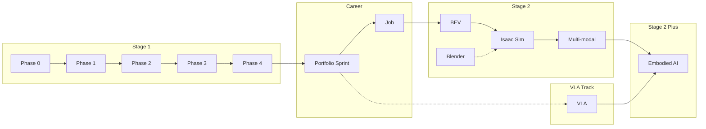

# 딥러닝 Perception 로드맵

> [goal] **목표**: AMR 실무 경험 + 딥러닝 Perception → **Perception Engineer**
> [time] **기간**: Stage 1 (이직 전) + Stage 2 (이직 후) + Stage 2+ (장기 확장)
>  **전제**: 5개월 딸과 함께하는 직장인 아빠, AMR ROS Application 개발자

---

## [chart] 전체 로드맵



---

##  타임라인 요약

| 시기 | Stage | 내용 | 목표 |
|------|-------|------|------|
| 2026.01-02 | Stage 1 | Phase 0-1 (완료) | 환경 세팅, 수학 핵심 |
| 2026.03-04 | Stage 1 | Phase 2: Perception 기하 기초 (4주) | 카메라 모델 + Multi-view 기하 |
| 2026.05-07 | Stage 1 | **Phase 3: Detection + Depth + GitHub 산출물 #1 공개** | 면접 가능한 산출물 1개 |
| 2026.08-09 | Stage 1 | **Phase 4: 3D Perception + 첫 지원 1~2건 (캘리브레이션)** | 시장 시그널 측정 |
| 2026.10-11 | Stage 1 | **Portfolio Sprint: 산출물 통합 + 이력서 + 데모 영상** | 30초 패키징 |
| 2026.12~ | Career | **본격 이직 활동 (계속 트라이) + VLA 입문은 보류/병행** | 분기당 면접 2~3건 |
| 이직 후~ | Stage 2 | BEV, Blender, Isaac Sim | 심화 학습 |
| Stage 2 이후~ | Stage 2+ | **VLA 심화, Embodied AI** | 미래 역량 |

> [pin] 기존 SLAM 트랙 (VO/BA 4주 + VIO 3주) = **7주를 절약**하여 Portfolio Sprint 에 배정.
> Phase 2 도 8주 → 4주로 압축. 절약된 총 11주 중 7주는 Portfolio Sprint, 나머지 4주는 학습 버퍼.

---

## [code] 언어 사용 전략

| Phase | 내용 | 언어 | 이유 |
|-------|------|------|------|
| Phase 0-1 | 환경 세팅, 수학 | Python | 빠른 프로토타이핑 |
| **Phase 2** | **Perception 기하 기초** | **C++** | OpenCV C++ (Ubuntu PC) |
| **Phase 3** | **Detection + Depth** | **Python** (학습) + **C++/TensorRT** (배포) | PyTorch → Jetson 최적화 |
| **Phase 4** | **3D Perception** | **Python** | MMDetection3D, nuScenes |

### 핵심 원칙

[O] **기하학 기초 (Phase 2)**: **C++** (OpenCV, 카메라 모델/캘리브레이션)

[O] **딥러닝 학습 (Phase 3-6)**: **Python** (PyTorch)

[O] **딥러닝 배포**: **C++ + TensorRT** (Jetson, 30+ FPS 목표)

---

##  Stage 1: 이직 전 (2026년)

### 실습 가이드 위치

**모든 실습 가이드는 `Studies/Phase X/PRACTICE.md`에 있습니다:**

| Phase | 가이드 위치 | 언어 |
|-------|------------|------|
| Phase 2 | 각 week별 PRACTICE.md (예: [`week3/PRACTICE.md`](./Studies/Phase%202/week3/PRACTICE.md)) | C++ |
| Phase 3 | 각 week별 PRACTICE.md (예: [`week1/PRACTICE.md`](./Studies/Phase%203/week1/PRACTICE.md)) | Python + TensorRT |
| Phase 4 | 각 week별 PRACTICE.md (예: [`week1/PRACTICE.md`](./Studies/Phase%204/week1/PRACTICE.md)) | Python |

---

### Phase 0-2: 기초
> Phase 0-1 완료, Phase 2 진행 중

| Phase | 내용 | 기간 |
|-------|------|------|
| 0 | 환경 세팅 | 2주 |
| 1 | 수학 핵심 (선형대수, 3D 기하) | 2개월 |
| 2 | Perception 기하 기초 (카메라 모델, Multi-view) | 4주 |

> [!] 기존 SLAM 트랙 (VO/BA, VIO) 은 [Archive/SLAM-legacy/](./Archive/SLAM-legacy/) 로 이동되었습니다.

### Phase 3: Detection + Depth (3개월) [*]
> **핵심 Phase** - Detection + Depth 필수, Instance Seg 선택
> **시작 전 액션**: 타깃 회사 JD 3개 정독 (베어로보틱스 / 우아한형제들 / 로보티즈) → 산출물 #1 스펙 1페이지 확정

| 주차 | 내용 | 핵심 모델 | 우선순위 |
|------|------|----------|----------|
| 1-2 | PyTorch 복습 | - | 필수 |
| 3-6 | **YOLO 실습 + Jetson 배포** | YOLO11, TensorRT | 필수 |
| 7-10 | **Depth Estimation + Jetson 배포** | Depth Anything V2, TensorRT | 필수 |
| 11-12 | **통합 시스템** | Detection + Depth → 3D | 필수 |

> [!] **TensorRT 배포는 삽질 시간이 예상보다 길어질 수 있음**

**산출물**: Jetson 실시간 Detection + Depth 데모 + **별도 Public Repo `robotics-perception-portfolio`** + README + 수치 성능 표 + 1분 영상 (2026.07까지 공개)

### Phase 4: 3D Perception (약 3개월) [*]
> **이직 준비 핵심** - KITTI 3D → nuScenes 입문 순서로 진행
> **시장 탐색 병행**: Phase 4 중 1~2건 지원 (캘리브레이션 목적, 합격 X). 면접관 반응으로 포트폴리오 보완

| 주차 | 내용 | 핵심 |
|------|------|------|
| 1-2 | 3D Object Detection 개념 + 이력서 1차 작성 | 카메라 → 3D |
| 3-4 | **KITTI 3D 실습** + 첫 지원 1~2건 | 가벼운 데이터셋으로 먼저 |
| 5-6 | Monocular 3D Detection | FCOS3D / SMOKE |
| 7-8 | **nuScenes + BEV 입문** (mini만, 가볍게) | BEVFormer 개념 |

> [tip] **nuScenes Full (~400GB) 학습은 Stage 2로 보류 가능**
> KITTI 3D 데모만으로도 채용 라인 충분. Mini (10GB) 만 사용 권장

**산출물**: GitHub 산출물 #2 (3D Detection) — 별도 Public Repo 에 KITTI 3D bbox 시각화 + AP3D 표 + 1분 영상 (2026.09까지 공개)

### Portfolio Sprint (7주)
> Phase 4 완료 직후, 이직 활동 직전

**목적**: 이미 공개한 산출물 #1, #2를 **면접용으로 패키징**. **새 산출물 제작 X, 통합/포장에 집중**.

(Phase 3·4에서 매주 산출물을 누적했으므로 Sprint는 만드는 단계가 아니라 다듬는 단계)

| 주 | 주제 | 핵심 |
|----|------|------|
| 1 | 패키징 설계 | 산출물 2개를 면접관 진입점으로 재구성 |
| 2-3 | **포트폴리오 Repo 정비** | 메인 README + 산출물별 디렉토리 정리 |
| 4 | **AMR 실무 연결 영상** | ROS 2 노드 래퍼 시연, 1분 |
| 5 | 블로그 정리 | Phase 3·4에서 작성한 글 + 추가 1~2개 |
| 6 | 데모 영상 + 이력서 개편 | 1~3분 통합 영상, 이력서 국문/영문 |
| 7 | LinkedIn / 지원 트래커 정비 | 본격 지원 시작 준비 |

**차별화 메시지**: *"딥러닝 모델을 실제 로봇에 붙여본 사람"*

---

##  Stage 2: 이직 후

> 새 회사 적응 기간 (3-6개월) 후 심화 학습 시작
> [!] 이직 직후 바로 시작하지 말고 적응 기간 버퍼 확보

### BEV & Occupancy (3개월)
| 주제 | 내용 |
|------|------|
| BEVFormer 심화 | Multi-camera → BEV |
| Occupancy Network | 3D 공간 점유 예측 |
| nuScenes 벤치마크 | 성능 평가 |

###  Blender for Simulation
> **목적**: Isaac Sim/Gazebo용 시뮬레이션 에셋 제작

| 단계 | 내용 | 기간 | 산출물 |
|------|------|------|--------|
| 1 | 기초 UI, 모델링, 텍스처링 | 4주 | 장애물/박스 모델 |
| 2 | Python API (Scripting) | 2주 | 자동화 스크립트 |
| 3 | **Isaac Sim/Gazebo Export** | 2주 | USD/URDF 변환 |
| 4 | Procedural Generation | 2주 (선택) | 다양한 에셋 자동 생성 |

> [tip] **3D 좌표계/투영 개념이 Blender 모델링에 바로 적용됨**

**산출물**: Isaac Sim에서 사용 가능한 커스텀 로봇 환경 에셋

###  Isaac Sim 연동 (2개월)
> Blender 에셋을 활용한 시뮬레이션 환경 구축

| 주제 | 내용 |
|------|------|
| Isaac Sim 기초 | 환경 세팅, USD 이해 |
| Blender → Isaac | 커스텀 에셋 Import |
| **Synthetic Data 생성** | Domain Randomization |
| Perception 파이프라인 | 시뮬레이션 → 실제 전이 |

> [tip] **Synthetic Data로 학습 데이터 무한 생성 가능!**

### Multi-modal Perception (3개월)
| 주제 | 내용 |
|------|------|
| Camera + LiDAR 융합 | 센서 퓨전 |
| Vision-Language | CLIP, BLIP |
| Open-vocabulary Detection | 텍스트 기반 검출 |

---

##  VLA 입문 (Stage 2 초기로 이동)

> Stage 1 동안은 이직 가능 상태 만들기가 최우선. VLA는 가산점이지 차별화 요소가 아님 (현재 시장에서 Robotics Perception 채용은 VLA 미요구).
> **Stage 2 초기 또는 회사 적응 후 시작 권장**.
> 로봇이 **보고 → 이해하고 → 행동**하는 End-to-End 시스템

| 주제 | 내용 | 대표 모델 |
|------|------|----------|
| VLA 기초 | Vision-Language-Action 구조 | RT-2, OpenVLA |
| Policy Learning | 행동 정책 학습 | Diffusion Policy |
| Simulation | 시뮬레이션 환경 | Isaac Sim, MuJoCo |

> [tip] Phase 3-6의 Perception 지식 + AMR ROS 경험이 VLA 학습의 토대가 됨

---

##  Stage 2+: 장기 확장

### Embodied AI
| 주제 | 내용 |
|------|------|
| Navigation + Manipulation | 이동 + 조작 통합 |
| World Models | 환경 이해/예측 |
| Foundation Models for Robotics | 대규모 로봇 모델 |

### 당신의 강점이 빛나는 부분
| Stage 2+ 요소 | AMR 경험 연결 |
|---------------|---------------|
| Action 실행 | ROS 5년 경험 |
| 실제 배포 | 제품 레벨 경험 |
| 하드웨어 이해 | 펌웨어 2년 |
| 로봇 도메인 | AMR 도메인 지식 |

> [tip] **VLA는 "Vision+Language 연구자" + "로봇 실무자"가 만나야 가능한 영역**
> 당신은 후자를 이미 갖추고 있음!

---

## [tool] 실습 환경

| 장비 | 주 용도 | 사용 조건 |
|------|---------|----------|
| Ubuntu PC (RTX 4070, 12GB VRAM) | 데이터셋 실험, 딥러닝 학습/추론, 원격 접속 메인 | 출장지 포함 상시 |
| ELP Stereo Camera | 실카메라 캘리브/rectification 실습 (USB 주변기기) | Ubuntu PC 연결 |

### 원격 작업 워크플로우
- 출장지: VS Code Tunnel 또는 vscode.dev → Ubuntu PC (Docker 컨테이너)
- 네트워크: Tailscale 메시 (포트 포워딩 불필요)
- 시각화: Rerun.io (perception 주력), Jupyter inline (이미지), Foxglove (ROS 2 쓰는 경우)
- 상세 가이드: [ENVIRONMENT.md](./ENVIRONMENT.md)

> [note] Jetson Orin Nano 는 **하드웨어 실습 시간 확보 시점**에 재도입 검토. 현 로드맵에서는 Ubuntu PC 중심으로 진행.

---

## [goal] 커리어 경로

```
현재: AMR ROS Application 개발자 (7년차)
      ↓
Phase 3 끝 (2026.07): GitHub 산출물 #1 공개
      ↓
Phase 4 중 (2026.08~09): 첫 지원 1~2건 (캘리브레이션)
      ↓
Portfolio Sprint (2026.10~11): 패키징
      ↓
2026.12~: 본격 이직 활동 (계속 트라이)
      ↓
이직 성공: Perception Engineer (로봇/자율주행)
      ↓
장기: Embodied AI / VLA Engineer
```

### 최종 포지셔닝
> "AMR 로봇 제품에 7년간 배포해본 실무 경험 위에
> 딥러닝 Perception을 쌓은 **Perception Engineer**"

---

## [O] 마일스톤 체크리스트

### Stage 1 (학습 + Portfolio)

#### 환경 / 기초
- [x] 환경 세팅 완료
- [x] 수학 기초 이해
- [ ] Phase 2 완료 (Perception 기하 기초)

#### 5월 안 (Phase 3 진입 전)
- [ ] 타깃 회사 3개 확정 — 베어로보틱스 + 우아한형제들 + 로보티즈
- [ ] 1순위 풀 6개사 JD 정독 + 카카오모빌리티 자율주행팀 로보틱스 엔지니어 JD
- [ ] 학습 우선순위 매핑 표 작성
- [ ] Phase 3 산출물 #1 스펙 1페이지 확정

#### 5월 말~6월 초
- [ ] 포트폴리오 Public GitHub Repo 신규 생성 (`robotics-perception-portfolio`)
- [ ] LinkedIn 프로필 정비 (헤드라인·키워드)

#### 6~7월 (Phase 3)
- [ ] Phase 3 완료 (PyTorch → YOLO + Jetson 배포 → Depth → 통합)
- [ ] 매주 공개 가능한 형태로 산출물 누적
- [ ] 이력서 국문 1차 작성 (2026.07까지)
- [ ] **GitHub 산출물 #1 공개** (Phase 3 끝, 2026.07)

#### 8~9월 (Phase 4 + 첫 지원)
- [ ] Phase 4 완료 (3D 개념 → KITTI → Mono 3D → BEV 입문)
- [ ] 이력서 영문 작성 (2026.09까지)
- [ ] 지원 트래커 스프레드시트 생성
- [ ] **첫 지원 1~2건 (캘리브레이션 목적, 합격 X)**
- [ ] **GitHub 산출물 #2 공개** (Phase 4 끝, 2026.09)

#### 10~11월 (Portfolio Sprint — 패키징)
- [ ] 산출물 2개 면접용 패키징 (새 산출물 제작 X)
- [ ] AMR ROS 연결 영상 1분
- [ ] 이력서 개편 (국문/영문)
- [ ] 기술 블로그 3~5개

#### 12월~ (본격 이직 활동)
- [ ] 본격 지원 시작 (분기당 면접 2~3건 목표)
- [ ] 면접 결과를 트래커에 누적 → 포트폴리오/이력서 보완

#### 서브 트랙 — 내부 옵션 유지
- [ ] Phase 3 산출물 #1 사내 데모 발표 1회 검토
- [ ] 사내 AMR 제품에 Detection/Depth 모듈 PoC 1건 모니터링
- [ ] 회사가 Vision/AI 라인 재편할 가능성 대비 사내 노출 유지

#### 측정 지표 (지속)
- [ ] 매월: 포트폴리오 Public Repo 커밋 그래프 변화 확인
- [ ] 매분기: 시장 시그널 1개 (지원 / 면접 / 네트워킹)

### Stage 2 (이직 후)
- [ ] BEV Perception 심화
- [ ]  Blender 기초 완료
- [ ]  Isaac Sim 연동
- [ ] Multi-modal 학습
- [ ] 시니어 성장

### VLA (이직 활동 병행)
- [ ] VLA 논문 읽기 (RT-2, OpenVLA)
- [ ] 간단한 VLA 실험

### Stage 2+ (장기)
- [ ] VLA 심화
- [ ] Embodied AI 역량
- [ ] 미래 리더십 

---

## [tip] 핵심 원칙

1. **역순 학습**: 먼저 돌려보고, 모르는 것을 채운다
2. **개념은 설명할 수 있게, 구현은 찾을 수 있게**: "이게 뭐고 왜 쓰나요?" → 답할 수 있어야 함 (면접 대비). "코드로 어떻게 짜나요?" → 뭘 찾아봐야 하는지 알면 OK (실무 대비). 수학적 유도는 스킵. 막힌 부분은 표시해두고 다음으로.
3. **실무 연결**: 항상 "이게 로봇에 어떻게 쓰이나?" 생각
4. **기록 습관**: 배운 것을 짧게라도 기록
5. **가족 우선**: 학습은 마라톤, 번아웃 방지
6. **AMR 실무 경험이 차별점, Perception이 본체**: 7년간의 실제 로봇 배포 경험이 최대 무기

---

> [note] **경로**: 기하학 기초 → **AI Perception** → **Portfolio Sprint** → **이직** → BEV → **VLA**
> AMR 실무 경험을 살려 **Perception Engineer**로 성장합니다.

---

##  이직 시나리오 분석 — 흔들릴 때 다시 읽기

> 아이도 생겼고, 가족도 있고, 책임질 게 많아졌다.
> 그래도 지금 하고 있는 도메인을 벗어나고 싶다.
> 기술은 빠르게 발전하고 경쟁은 치열하다. 내 자리를 만들기 위해 어떤 노력이든 할 마음이 되어있다.
>
> 원래 인생은 최상과 최악을 검토하고 살아가다 보면, 그 중간 어딘가에 도달하기 마련이다.

### 왜 될 수 있는가

- 7년차 로봇 실무 경험은 대체 불가능한 자산. Perception을 논문으로만 아는 사람은 많지만, 실제 로봇 제품에 배포해본 사람은 드묾
- AMR에서 ROS, 센서, 실시간 시스템을 다뤄본 경험은 면접에서 "이 사람은 현장을 안다"는 신뢰를 줌
- Phase 3-4 완주 + **Jetson 실시간 데모 영상**이 있으면 포트폴리오로 충분히 설득력 있음
- 자율주행/로봇 업계는 "로봇 실무도 알고 Perception도 되는 사람"을 원하는데, 정확히 그 포지셔닝
- C++과 Python 양쪽을 다루는 엔지니어는 수요 대비 공급이 적음

### 전략

- **Portfolio Sprint 이후부터 이직 활동 시작** — 될 때까지 계속 트라이
- "완벽한 준비 후 이직"보다 **"70% 준비 + 면접 경험"** 이 더 효율적
- Phase 3까지만 해도 (Detection + Depth + Jetson 배포) 지원 가능한 포지션이 있음 → Phase 3 끝나면 시장 탐색 병행도 가능
- 첫 이직 시도에서 바로 합격하지 못할 수 있음. 면접 경험을 쌓으며 보완하고 재도전

### 시간이 예상보다 걸려도 괜찮은 이유

- 현 직장(AMR ROS 개발)은 유지됨. 이직 실패 = 현 상태 유지이지 추락이 아님
- 학습한 CV/DL 지식은 현 직장에서도 활용 가능. AMR에 Perception을 붙이는 역할로 포지션 확장도 가능
- 아이가 좀 더 크면 학습 시간이 다시 생김
- 로봇/자율주행 시장은 축소되는 게 아니라 확장 중. 늦어져도 기회는 있음
- 경력이 쌓일수록 오히려 더 강한 포지션에서 재도전 가능

> **핵심**: 지금 하고 있는 공부가 헛되는 시나리오는 없다. **속도가 다를 뿐이지 방향은 맞다.**
>
> AMR → Perception은 완전한 도메인 이탈이 아니다. **같은 로봇 도메인 안에서 레이어를 옮기는 것**이다.
> 면접관 입장에서 "리스크가 낮은 경력직 전환"으로 보인다. 완전히 다른 분야에서 오는 사람보다 훨씬 유리한 위치에 있다.
