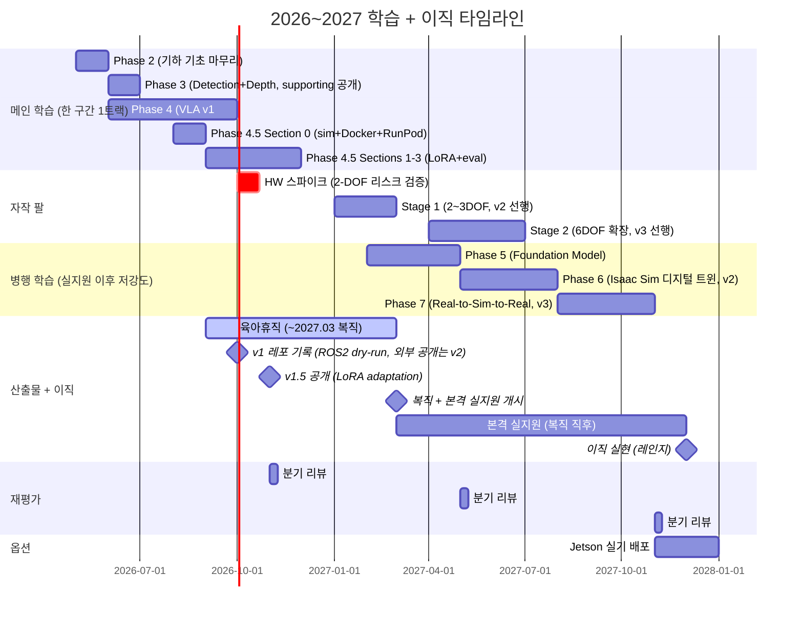

# Physical AI 학습 로드맵


> **목표**: AMR ROS 양산 SW + Physical AI 통합 → **Robot Learning Deployment / Physical AI Systems Engineer**
> **기간**: Stage 1 (이직 전) + Stage 2 (이직 후) + Stage 2+ (장기 확장)
> **전제**: 2025.08 출생 딸과 함께하는 직장인 아빠, AMR ROS Application 개발자


## 실측 결과 (Evidence)

> 이 리포의 가장 강한 증거를 먼저 둔다. 상세 데이터·방법론·판단 근거: [`Measurements/openvla-rtx4070-int4/`](./Measurements/openvla-rtx4070-int4/)

| 항목 | 결과 | 조건 |
|---|---|---|
| OpenVLA 7B int4 로드 | RTX 4070 12GB 에 OOM 없이 안착 (약 7GB) | bitsandbytes nf4 + transformers 4.40.1 |
| 추론 latency | mean 300.3 ms / p95 304.8 ms / std 3.8 ms (n=100) | `predict_action` 단독, 전처리·ROS2 제외 |
| throughput | 3.33 Hz | quasi-static 단일 task 적합 추정 |
| int8 경로 | 배제 — 성공률 58.1% (int4 71.9%), 1.2 Hz | OpenVLA 논문 Table 2·§5.4 근거 + 실측 판단 |

측정: 2026-06, 재측정 (방법론 보강 + p50/p99/VRAM peak) 2026-08 예정. Rerun 시각화 gif 는 확보 시 이 절에 추가.


---


## Foundation Model 직무의 3개 층과 본 로드맵의 좌표


Physical AI 에서 Foundation Model(FM)을 다루는 일은 세 층으로 나뉜다. 본 로드맵은 이 좌표 위에서 셋째 층을 핵심 강점으로 두고, 둘째 층(경량 adaptation)을 방어선으로 묶는다.


- **첫째 층 — FM 제작**: 아키텍처 설계, 사전학습, 새로운 학습 패러다임 연구. 대규모 연구 자원과 연구 트랙이 필요한 영역으로, 본 로드맵의 범위 밖에 둔다.
- **둘째 층 — Adaptation**: 사전학습된 FM 을 특정 로봇/태스크/환경에 맞추는 일. 도메인 데이터 수집, LoRA/co-fine-tuning 으로 모델을 그 작업에 길들인다. 본 로드맵은 **v1.5 (Phase 4.5)** 에서 이 층을 경량 범위로 편입한다.
- **셋째 층 — Deployment/Integration**: FM 을 실제 로봇에서 동작시키는 일. 양자화/증류로 추론을 최적화하고, latency 를 관리하고, ROS2 노드로 감싸 실시간 제어 루프에 통합하고, sim-to-real 격차를 측정하고, 안전 인터록을 걸고, 하드웨어 인터페이스에 맞춘다. **본 로드맵의 핵심 강점** — AMR ROS 양산 실무 5년 + 임베디드 실시간 제어 background 가 직접 맞물린다.


셋째 층이 필요한 이유는 FM 이 강력해질수록 분명해진다. 예로 RT-2(2023)는 55B 모델이 1-3Hz 로 동작해 고주파 제어에 부적합하고, 실시간 추론이 병목이며, 양자화/증류가 과제라고 스스로 한계를 밝혔다. 즉 FM 은 그대로 올린다고 로봇에서 돌지 않는다. **"안 돌아가는 FM 을 돌게 만드는" 엔지니어링**이 셋째 층의 실체이며, 본 로드맵의 차별화 하중이 실리는 지점이다.


본 로드맵의 좌표: 셋째 층을 핵심 강점으로 두고, 둘째 층(경량 adaptation)을 방어선으로 묶는다. 첫째 층은 추구하지 않는다.


---


## Repo 운영 방식


- `Studies/` 하위 코드는 **의도적으로 미완성 유지**
- 역순 학습 원칙에 따라 **로컬에서 작성 → 동작 확인 → 원복**
- **이 레포는 비공개 유지** (2026-07-20 결정) — 문서 내 "공개"/"리포 내 공개"는 "이 레포에 기록"을 뜻한다
- 산출물 (v1, v2, v3) 은 **별도 공개 산출물 repo 로 관리** — 외부 공개 증거(실측 Evidence 요약 포함)와 공개 푸시는 산출물 repo 에서 발행 (구조·이관 범위는 신설 시 결정, 늦어도 v1.5 공개 전)


---


## 전체 로드맵


> 주당 6-8시간 예산 기준. 본격 실지원(2027.03 복직 직후) 전까지는 한 구간에 메인 학습 1트랙만 둔다. 이후는 실지원과 병행하는 저강도 학습으로 진행한다. **2026.09-2027.02 는 육아휴직 기간** (2026-07-01 신청, 2026-07-28 승인 확정. 2026.06-08 은 재직 구간 — 평일 저녁 약 2h 가용 전제. 4070 은 반납하지 않기로 확정(2026-07-20)됐고 **2026.09 자택 이전 확정**으로 휴직 중에도 물리 접근이 유지된다) — 휴직 기간에는 구직 지원(정찰 포함)을 하지 않고 학습·산출물에 집중하며, 시장 신호 probe 는 가시성 기준으로 분해해 저강도 유지한다 (JD 정독 2026.07-08 / LinkedIn 헤드라인·커피챗 2026.09~). 본격 실지원은 복직(2027.03) 직후 개시하고, v2/v3 는 그 위에 얹는 강화 카드다.





---


## 타임라인 요약


> Phase 4(VLA)는 2026.06 진입. 후속 일정의 구체 월은 분기 재평가에서 확정한다.
> Phase 4.5(v1.5, LoRA adaptation)를 둘째 층 증거로 편입하면서 후속 Phase 5-7 이 약 1-2개월 순연될 수 있다 (주 6-8시간 예산 + v1.5 약 6-8주). 단 v1.5 는 v1 자산 재사용으로 한계비용이 낮고, LoRA 가 Phase 6 에서 v1.5 로 전진 배치돼 Phase 6 이 가벼워지므로 일부 상쇄된다. 순 영향은 2026.11 재평가에서 실측 일정으로 재확정.


| 시기 | Stage | 내용 | 목표 |
|------|-------|------|------|
| 2026.01-02 | Stage 1 | Phase 0-1 (완료) | 환경 세팅, 수학 핵심 |
| 2026.03-05 | Stage 1 | Phase 2: Perception 기하 기초 (완료) | 카메라 모델 + Multi-view |
| 2026.06 초 | Stage 1 | Phase 3 완료 (**supporting 공개** — 보조 엔지니어링 증거, 대표작 아님) | VLA wrapper 리허설 |
| 2026.06-09 | Stage 1 | **Phase 4 (메인 단독): VLA v1 — pretrained OpenVLA zero-shot 추론 + ROS2 wrapper + 카메라/bag dry-run 측정 + 정독** | **산출물 v1 (2026 하반기 레포 기록, 외부 공개는 v2)** |
| 2026.08 (Section 0) + 2026.09-11 (Sections 1-3) | Stage 1 | **Phase 4.5: VLA v1.5 — Section 0 (sim 구축·Docker·RunPod 이관, Sections 1-3 선행) + OpenVLA LoRA adaptation + before/after 정량 분석** (sim 데이터, v1 추론 노드 재사용) | **산출물 v1.5 (둘째 층 adaptation 증거)** |
| 2026.07-08 (병행) | Stage 1 | **시장 신호 probe 1단 (저가시성)**: 타겟사 JD 5-10개 정독 + 격차 매핑, 공개 증거 정비 (별도 산출물 repo 신설) | 시장 실측 → 우선순위 보정 |
| 2026.09- (병행) | Stage 1 | **시장 신호 probe 2단 (고가시성)**: LinkedIn 헤드라인 교체 + 현직자 커피챗 1-2건 (휴직 개시 후 — 승인 확정 2026-07-28) | 시장 실측 → 우선순위 보정 |
| 2026.10 | Stage 1 | **하드웨어 스파이크 (2-3주)**: 2-DOF Dynamixel + ROS2 + URDF 파이프라인이 도는지만 검증 | 리스크 조기 검증 (분기 재평가 #1 입력) |
| 2026.09-2027.02 | Career | **육아휴직** (2026-07-01 신청, 2026-07-28 승인 확정) — 구직 지원(정찰 포함) 안 함, 학습·산출물 집중. 2026.06-08 은 재직 구간 (4070 은 보유 지속 + 2026.09 자택 이전 확정 — 휴직 중에도 물리 접근 유지) | 학습 집중 기간 |
| 2026.11 | Career | **분기 재평가 #1** (정찰 지원 없이 수행 — 입력: 스파이크 결과 / v1 결과 / 시장 신호 probe 반응 / 모델 갱신) | 중간 점검 |
| 2027.01-02 | Stage 1 | **Hardware-Arm Stage 1 (2-3DOF 본 빌드, 스파이크로 디리스크)** + URDF + Sim 디지털 트윈 (v2 선행) | v2 하드웨어 기반 |
| **2027.03~ (복직)** | **Career** | **본격 실지원 개시** (복직 직후, 트리거: v1 + 스파이크 확보 = "면접장에 들어갈 만큼") | 합격 |
| 2027.02-04 (병행) | Stage 1 | Phase 5: Foundation Model (동작 원리 수준), 실지원과 병행 저강도 | 사전 지식 |
| 2027.04-06 (병행) | Stage 1 | **Hardware-Arm Stage 2**: 6DOF + teleop + 안전 인터록 | v3 하드웨어 기반 |
| 2027.05-07 (병행) | Stage 1 | Phase 6: Isaac Sim + 디지털 트윈 (Sim/Real gap 측정) + 자작 팔 결합 | **산출물 v2 (헤드라인, sim-to-real gap)** |
| 2027.08~ (병행) | Stage 1 | **Phase 7: Real-to-Sim-to-Real → 산출물 v3** (차별화 정점) | 차별화 강화 |
| 2027 말~2028 | Career | 이직 실현 (시장 반응에 따른 레인지) | 착지 |
| 이직 후~ | Stage 2 | 회사 환경 활용 (BEV / Foundation Model 심화 / 그 외) | 시니어 성장 |


---


## 언어 사용 전략


| Phase | 내용 | 언어 | 이유 |
|-------|------|------|------|
| Phase 0-1 | 환경 세팅, 수학 | Python | 빠른 프로토타이핑 |
| **Phase 2** | **Perception 기하 기초** | **C++** | OpenCV C++ (Ubuntu PC) |
| **Phase 3** | **Detection + Depth → PC TRT + ROS2 노드** | **Python** (학습) + **C++/TensorRT** (PC 배포) | PyTorch → PC TensorRT |
| **Phase 4** | **VLA 논문 + OpenVLA → ROS2 minimal demo** | **Python** + **ROS2 (rclpy)** | HuggingFace inference + ROS2 토픽 |
| **Phase 5** | **Foundation Model 기초** | **Python** | HuggingFace transformers |
| **Phase 6** | **Isaac Sim + 디지털 트윈** | **Python** (Isaac Sim API) + **ROS2** | URDF 임포트 + Sim/Real 매칭 |
| **Phase 7** | **Real-to-Sim-to-Real** | **Python** + **C++** (안전 인터록) + **ROS2** | OpenVLA + 자작 팔 통합 |
| **Hardware-Arm** | **자작 팔 트랙** | **ROS2** + **URDF/XACRO** | `feetech_ros2_driver` + URDF |


### 핵심 원칙


- **기하학 기초 (Phase 2)**: **C++** (OpenCV, 카메라 모델/캘리브레이션)
- **딥러닝 학습 (Phase 3-5)**: **Python** (PyTorch, HuggingFace)
- **딥러닝 배포 (Phase 3, 7)**: **PC TensorRT + ROS2 노드** (Jetson 30+ FPS 는 Phase 7 이후 옵션)
- **로봇 통합 (Phase 6, 7, Hardware-Arm)**: **ROS2 + URDF + Isaac Sim**


---


## Stage 1: 학습 + 자작 팔 + 실지원 (2026.06-, 본격 실지원 2027.03 복직 직후)


### 실습 가이드 위치


**모든 실습 가이드는 `Studies/Phase X/weekN/PRACTICE.md` (또는 `Studies/Hardware-Arm/` 의 단계별 문서) 에 있습니다.**
**각 Phase 의 week 별 자료는 미리 작성되어 있음 — 진입 시점에 재검토 + 필요 시 갱신.**


| Phase | 가이드 위치 | 언어 |
|-------|------------|------|
| Phase 2 | 각 week별 PRACTICE.md ([`week3/PRACTICE.md`](./Studies/Phase%202/week3/PRACTICE.md)) | C++ |
| Phase 3 | 각 week별 PRACTICE.md ([`week1/PRACTICE.md`](./Studies/Phase%203/week1/PRACTICE.md)) | Python + PC TensorRT |
| Phase 4 (VLA) | 미리 작성됨 — 진입 시 (2026.06) 다시 체크 | Python + ROS2 |
| Phase 5 | 미리 작성됨 — 진입 시 (2027.02) 다시 체크 | Python |
| Phase 6 | 미리 작성됨 — 진입 시 (2027.05) 다시 체크 | Python + ROS2 |
| Phase 7 | 미리 작성됨 — 진입 시 (2027.08) 다시 체크 | Python + C++ + ROS2 |
| Hardware-Arm 스파이크 | 미리 작성됨 — 진입 시 (2026.10) 다시 체크 | ROS2 (2-DOF 검증) |
| Hardware-Arm Stage 1 | 미리 작성됨 — 진입 시 (2027.01) 다시 체크 | ROS2 + URDF |
| Hardware-Arm Stage 2 | 미리 작성됨 — 진입 시 (2027.04) 다시 체크 | ROS2 + URDF + Sim 매칭 |


---


### Phase 0-2: 기초


| Phase | 내용 | 기간 |
|-------|------|------|
| 0 | 환경 세팅 | 2주 |
| 1 | 수학 핵심 (선형대수, 3D 기하) | 2개월 |
| 2 | Perception 기하 기초 (카메라 모델, Multi-view) | 4주 |


### Phase 3: Detection + Depth → PC TensorRT + ROS2 노드 (supporting system work, ~2026.06 초)
> **메시지**: Detection + Depth + PC TensorRT/ROS2 통합은 **VLA v1 wrapper 의 난도 낮은 리허설이자 재사용 스캐폴드**다. AMR ROS 5년차 기준 commodity 라 헤드라인 어필은 하지 않되, **보조 엔지니어링 증거 (supporting system work) 로 리포 내 공개**한다 — 공개 조건·재현 확인은 [`Roadmap/Phase 3.md`](./Roadmap/Phase%203.md) 참고.
> **상태**: week1-8 완료, supporting 로그 커밋 완료 (2026.06). 빌드 스크립트 기준 재현 확인은 4070 에서 직접 수행 (PC 는 2026.09 자택 이전 확정으로 시점 제약 없음).


| 주차 | 내용 | 핵심 모델 | 우선순위 |
|------|------|----------|----------|
| 1-2 | PyTorch 복습 | - | 필수 |
| 3-5 | **YOLO11 학습 + PC TensorRT 변환** | YOLO11, TensorRT | 필수 |
| 6-7 | **Depth Anything V2 + PC TensorRT** | Depth Anything V2 | 필수 |
| 8 | **통합 시스템 + ROS2 노드 래퍼 + latency 측정** | Detection + Depth + ROS2 | 필수 |


> **Jetson 실기 배포는 v3 이후 옵션** — 전체 학습 (Phase 2-7) 완료 후 시간 여유 보고 결정


**Phase 3 산출**: YOLO11 + Depth Anything V2 → PC TensorRT 추론 + ROS2 노드 래퍼 + latency 측정 → **repo 내 supporting 로그로 공개** (velog/LinkedIn 어필 안 함, 대표작 아님). TensorRT/양자화 배포 + ROS2 통합 경험은 VLA v1 에 흡수.


### Phase 4: VLA v1 — OpenVLA zero-shot 추론 + ROS2 minimal demo (약 4개월, 2026.06-09)
> **목표**: VLA 의 아키텍처 다이어그램을 막힘없이 읽을 수 있는 수준 + pretrained OpenVLA zero-shot inference 를 ROS2 토픽으로 받는 추론 루프 (카메라/bag dry-run 으로 latency/throughput 측정)
> **선정 논문 (2편)**: RT-2, OpenVLA — 필요 시 분기 재평가에서 π0 / Helix / GR00T 로 갱신
> **범위 (v1)**: pretrained zero-shot (LoRA adaptation 은 v1.5/Phase 4.5), 카메라/bag dry-run (sim embodiment 결합 + task 성공률은 v1.5/Phase 4.5, 자작 팔은 v2), 단일 embodiment


| 주차 | 내용 | 핵심 |
|------|------|------|
| 1-2,4-6 | RT-2 / OpenVLA 정독 (블로그 작성 week3·7 은 v2 이관) | Vision-Language → Action |
| 8-12 | **OpenVLA zero-shot inference → ROS2 토픽 → 카메라/bag 추론 루프 dry-run (v1)** | Brain ↔ Body 첫 통합 |
| 13-16 | 블로그 마무리 + 패키징 + 1분 영상 + 외부 공개 → **v2 이관** | (v1 제외) |

> 진행 순서 변형: 2026.06-07 선행 투입 구간은 표적 skim → week8-12 실습 선행, week1-7 정독은 2026.08-09 후행 (역순 학습 원칙). 블로그 작성·1분 영상·패키징·외부 공개는 v2 로 이관. 상세: [`Roadmap/Phase 4.md`](./Roadmap/Phase%204.md)


**산출물 v1** (2026 하반기까지 `physical-ai-study` 레포에 **결과 기록만**, 외부 공개는 v2 로 이관):
- ROS2 패키지: OpenVLA zero-shot inference → `vla_action` 토픽, 카메라/bag 입력으로 1분 dry-run (sim task 성공률은 v1.5/Phase 4.5)
- 레포 기록: README + latency/throughput 표 (+ 선택 Rerun 시각화 스크린샷/gif)
- RT-2/OpenVLA 정독 — 아키텍처 이해 (블로그 작성은 v2)
- 1분 영상·블로그 작성·velog/LinkedIn 외부 공개는 v2(Phase 6)로 이관 — v1(sim zero-shot)은 공개 산출물로 약해 공개 푸시는 실제 팔이 결합되는 v2 로 통합
- 한계 명시: v1 의 Body 는 sim, 실암 결합은 v2 예고


> **컴퓨트 (실측 검증 완료)**: OpenVLA 7B 의 BF16 가중치는 약 14-15GB → RTX 4070 12GB 로 풀 정밀도 불가. int4 양자화 시 VRAM 약 7GB (논문 실측) + 성공률은 bf16 과 동등 → 12GB 안착, 4070 에서 OOM 없이 로드 확인. 4070 추론 속도는 실측 mean 300.3 ms (3.33 Hz, n=100) 로 quasi-static 단일 task 에 적합 추정 — 제어 주기 판정 수치는 task 선정 후 확정. int8 은 성공률·속도 모두 열위로 실험에서 배제 (수치 본체: [`Studies/Phase 4/SETUP.md`](./Studies/Phase%204/SETUP.md) §1.3). 제어 주기 미충족 시 범위 축소(관측→action 시각화) 로 분기.


### Phase 5: Foundation Model 기초 (3개월, 2027.02-04, 실지원 병행 저강도)
> **목표**: ViT / CLIP / DINOv2 / SigLIP 의 *동작 원리 수준* — 아키텍처 다이어그램 + 학습 방식 + 입출력 인터페이스 설명 가능 수준. **직접 학습 / fine-tune 은 하지 않음**.


| 주차 | 내용 | 핵심 |
|------|------|------|
| 1-3 | ViT | Patch embedding + Self-attention |
| 4-6 | CLIP | Vision-Language contrastive |
| 7-9 | DINOv2 | Self-supervised |
| 10-12 | SigLIP + v1 demo 보강 | Sigmoid loss |


> 결과물 없는 학습 금지. 각 주제별 짧은 노트 또는 mini-demo 1개.


### Phase 6: Isaac Sim + 디지털 트윈 → 산출물 v2 (3개월, 2027.05-07, 실지원 병행 저강도)
> **목표**: 자작 팔 (Hardware-Arm Stage 1) 의 URDF 를 Isaac Sim 에 임포트 → 디지털 트윈 + **자작 팔 결합 + sim-to-real gap 수치 측정 = 헤드라인 산출물 v2**
> **자작 팔 Stage 2 (2027.04-06) 와 병행**. Sim-only 산출물은 배제 — 자작 팔과 결합되어야 차별점.


| 주차 | 내용 | 핵심 |
|------|------|------|
| 1-3 | Isaac Sim 환경 셋업 | Conda + Workstation |
| 4-7 | URDF 임포트 + 디지털 트윈 | Sim Joint State ↔ Real Joint State 매칭 |
| 8-12 | Sim/Real gap 측정 인프라 (LoRA 는 v1.5/Phase 4.5 로 이관) | latency / 반복성 / force / 시각, v1.5 sim 성공률을 gap 분모로 |


**산출물 v2 강화 카드 (헤드라인)**: 자작 팔에 FM 을 올렸을 때의 sim-to-real gap 을 수치로 측정·보고. "팔이 움직인다" 가 아니라 격차를 측정한 것이 핵심 신호. v1.5(sim) 성공률이 그 분모.


### Phase 7: Real-to-Sim-to-Real → 산출물 v3 (3개월, 2027.08~) — 차별화 정점
> **목표**: OpenVLA fork + ROS2 노드 래핑 + 자작 6DOF 팔 + 디지털 트윈 (Isaac Sim) + 안전 인터록 + latency 측정 → **산출물 v3**


| 주차 | 내용 | 핵심 |
|------|------|------|
| 1-3 | OpenVLA fork + ROS2 통합 | inference 토픽 |
| 4-6 | 안전 인터록 통합 | 위치/속도/토크 한계 + e-stop |
| 7-9 | latency 측정 + Sim/Real gap 영상 | "VLA latency 200ms" 의 직접 증거 |
| 10-12 | 통합 영상 + 패키징 | 이직 면접용 |


**산출물 v3** (2027.08~): Real-to-Sim-to-Real — 자작 6DOF 팔 + Isaac Sim 디지털 트윈 + OpenVLA fork + ROS2 노드 + 안전 인터록 + latency 측정 + Sim/Real gap 영상


> *"Sim-only 산출물은 차별점이 되지 않는다 — 자작 실 팔과 결합되어야 본인 강점 (실배포·통합) 이 실린다."*


---


### Hardware-Arm: 자작 팔 트랙 (스파이크 + 2단계, 2026.10-2027.06)
> **왜 자작 팔인가**: *"Brain ↔ Body 통합 SW 엔지니어"* 의 가장 완전한 증거. 본인 약점 (VLA 신입급) 을 본인 강점 (AMR ROS 실무 5년, 2021.06~ + 펌웨어 2.5년 하드웨어 이해) 으로 직접 깨는 카드. 자작 팔은 cross-embodiment 의 첫 embodiment 증명이다.
> **가장 중요한 증거일수록 가장 먼저 리스크를 깬다** — 첫 하드웨어는 계획의 2-3배 걸린다. 그래서 본 빌드 전에 짧은 스파이크로 먼저 굴린다. 조달·조립은 v1(sim) 과 병렬로 지금 착수해 v2 가 하드웨어 리드타임에 게이트되지 않게 한다.
>
> 실행 품질로 증명하는 3가지 — latency 측정, e-stop, BOM 이해는 로보틱스 랩에서도 일상적으로 다룬다 (항목 자체가 희소한 것이 아니다). 차별점은 양산 ROS 5년 경험자가 이것들을 제품 수준 감각 (측정 방법론, 안전 설계 관행, 원가 구조) 으로 수행한다는 **실행 품질**이다:
> - **latency**: 추론 → 모터 명령까지 ms 단위 측정
> - **안전 메커니즘**: e-stop, 토크 한계, 충돌 감지 직접 구현
> - **양산 비용 이해**: DIY 팔 BOM 표 — "이 가격대에 이 성능까지"


#### 스파이크 (2026.10, 2-3주, 산출물 아님 = 리스크 검증)
- **범위**: 키트 전체 조립 전에 모터 1-2개만 버스에 물려 전기·소프트웨어 경로만 확인. 안 예뻐도 됨.
- **목표**: "Feetech 버스 + `feetech_ros2_driver` + ros2_control 이 내 환경에서 도는가" 만 확인. pick-and-place 아님.
- **출력**: 예상보다 오래 걸리면 Stage 1 의 ROS2 통합 경로·일정을 **2026 년 안에** 재산정. 결과는 분기 재평가 #1 (2026.11) 입력.


#### Stage 1 (2027.01-02, 2개월, 약 1-3만원) — 스파이크로 디리스크된 본 빌드 (v2 선행)
- **하드웨어**: SO-101 리더 + 팔로워 6DOF 키트 (3D 프린팅 부품·전원·케이블 포함) + 손목 카메라 1대
- **목표**: pick-and-place 단순 동작 + URDF + ROS2 드라이버 (`feetech_ros2_driver`) + Isaac Sim 디지털 트윈 첫 사이클
- **역할**: v2(헤드라인, sim-to-real gap)가 소비하는 선행 하드웨어. 동작 영상 + URDF + Sim 임포트 영상은 v2 의 입력 자료.
- **이유**: 스파이크에서 드라이버 경로를 이미 검증했으므로 본 빌드는 조립과 동작 완성도에 집중.
- **비용**: 팔 키트 약 55만원은 2026.09-10 에 선집행되므로 이 구간의 추가 지출은 손목 카메라뿐이다.


#### Stage 2 (2027.04-06, 3개월) — 실지원과 병행 (v3 선행)
- **하드웨어**: 확장 수단 미정 — SO-101 이 이미 6DOF 이므로 과제는 관절 수가 아니라 페이로드·강성이다. 상위 팔 도입 / 소프트웨어 스택 심화 / 양팔 확장 중 선택과 비용 산정은 2026.11 재평가 안건
- **목표**: teleop 데이터 수집 + 카메라 ↔ 팔 base 캘리브 + 안전 인터록 + Sim 물리 파라미터 매칭
- **출력**: Phase 6 (Isaac Sim) 의 자연스러운 토대. Phase 7 산출물 v3 의 하드웨어 기반.


#### 하드웨어 확정 (2026-07): SO-101 (SO-ARM101) 리더-팔로워

| 항목 | 내용 |
|---|---|
| 구성 | SO-101 / SO-ARM101 (TheRobotStudio + Hugging Face 오픈소스 설계). 리더 + 팔로워 미조립 키트, Feetech STS3215 기반 |
| 비용 | 약 56-58만원 (팔 키트 약 55만원 + 손목 카메라 1-3만원) |
| 조달 | 국내 판매자, 3D 프린팅 부품 포함, 리드타임 3일 → 스파이크 시기 (2026.09-10) 에 단일 구매 |
| 근거 | LeRobot / Hugging Face 생태계 표준 — teleop 데이터 수집 (v2.5 데이터셋)·ACT 학습·HF Hub 공개가 이 생태계 위에서 이어진다 |

> Koch v1.1 (Dynamixel 기반, 총 49-60만원) 과 커스텀 XL330+XM430 안 (BOM 150-225만원) 은 비채택 — 사유는 [Hardware-Arm.md](./Roadmap/Hardware-Arm.md) 비채택 기록. Stage 2 확장 수단 (원안: XM430 6DOF 확장) 재설계는 2026.11 분기 재평가 안건.


### 시장 신호 probe (가시성 기준 분해, 재직·휴직 중 저강도) → (복직) → 본격 실지원
> **시장 신호는 학습 초기부터 싸게 받는다**: 12개월 투입을 기다리지 않고 JD·커피챗·LinkedIn 으로 받는다. 단, 가시성이 높은 항목은 육아휴직 승인 확정 전에 움직이지 않는다 — 승인 계류 중 헤드라인 교체는 고용주에게 이직 확정 신호를 보내 승인 프로세스에 불필요한 마찰 변수를 만든다. (승인 확정 2026-07-28 로 이 조건은 해소됐다 — 2단은 휴직 개시 시점에 맞춰 집행한다.)
> **육아휴직 (2026.09-2027.02) 중에는 구직 지원(정찰 포함)을 하지 않는다.** 지원이 아닌 정보 수집·프로필 정비(시장 신호 probe)만 저강도로 유지한다. 본격 실지원은 복직(2027.03) 직후 개시한다.


**probe 일정 (가시성 기준 3분해, Phase 4 와 병행)**:
- **2026.07-08 (재직 중, 저가시성)**: 타겟사 **실제 JD 5-10개 정독** → 요구 역량 vs 현재 격차 1페이지 매핑 + **공개 증거 정비 — 별도 산출물 repo 신설** (실측 표·supporting 산출물 요약을 산출물 repo 로 발행, 이 레포는 비공개 유지 — 학습 리포·포트폴리오 공개는 재직자도 흔히 하므로 이직 신호로 읽히지 않는다) JD 목록에는 Dynamixel 제조사 본사 2개 공고(시스템 SW·모방학습)를 우선 배치하고, 동일 그룹의 AMR 물적분할 자회사는 수평이동이라 제외한다. 인재풀 등록·공고 알림 설정도 저가시성이라 이 단계에서 수행.
- **2026.09 (휴직 개시 후, 고가시성 — 승인 확정 2026-07-28)**: **LinkedIn 헤드라인 교체** ("AMR ROS Engineer" → "AMR ROS Production SW + Physical AI Integration") — 2026.11 재평가 전 약 2개월의 신호 수집 기간 확보
- **2026.09 이후 (저강도)**: 현직자 **1-2명 커피챗/메시지** (정보성, 합격 목적 아님. Dynamixel 제조사 재직자 우선 — 질문 예: 면접 평가 축, 시스템 SW 트랙과 AI 트랙의 조직 관계)
- 구직 지원(정찰 포함)은 하지 않는다 — 복직 후로 미룬다.


**본격 실지원 개시 (2027.03 복직 직후)**:
- 조건: **v1 + 스파이크 + (진행 중) v2** 가 "면접장에 들어갈 만큼".
- v2/v3 완성을 기다리지 않는다. 이직 활동 자체가 6개월 프로세스 → 복직 직후 바로 시작해 2027말 착지를 노린다.
- 모델 갱신: 지원 시점 기준 최신 VLA (π0 / Helix / GR00T 등) 로 데모 모델 교체.


### 초기 패키징 (2027.01-02, Stage 1 본 빌드와 맞물려, 본격 실지원 직전)
> 본격 실지원 개시 직전 짧은 패키징 (2-3주). **새 산출물 제작 X, 통합/포장**.


**목적**: 산출물 **v1** 을 면접용으로 패키징 (실지원 트리거 최소선). v2 는 Phase 6 완료 시 헤드라인으로 합류, v3 는 이후 정점 카드로 추가.


| 주제 | 핵심 |
|------|------|
| 패키징 설계 | 산출물 (v1, 진행 중 v2) 를 면접관 진입점으로 재구성 |
| 포트폴리오 Repo 정비 | `physical-ai-study` README + 산출물별 디렉토리 정리 |
| 이력서 개편 | 국문/영문, 지원 트래커 정비, 실지원 시작 준비 |


> 이후 v2 (sim-to-real gap) / v3 (Real-to-Sim-to-Real) 가 완성되면 포트폴리오에 **강화 카드로 추가** 하고 이력서/영상 갱신.


**차별화 메시지**: *"이기종 플랫폼(이동+조작)에 Foundation Model 을 실시간 배포·통합하고, 경량 adaptation 까지 다루는 엔지니어"* — 매니퓰레이션 데이터 moat 에 **단독 베팅하지는 않되**, 경량 adaptation(둘째 층)을 셋째 층(통합/배포)과 묶어 보유한다. AMR 이동 해자가 프리미엄을 받는 cross-embodiment 좌표이며, 데이터 moat 전면 베팅도 단순 회피도 아닌 중간 좌표다.


---


## Stage 2: 이직 후 (회사 환경 활용)


> 새 회사 적응 기간 (3-6개월) 후 심화 학습 시작. 적응 기간 버퍼 확보 우선.


Stage 1 에서 학습 제외로 분류한 영역 중 회사 환경에서 자연스럽게 익혀야 할 것:


| 영역 | 내용 | 비고 |
|---|---|---|
| BEV / Occupancy | Multi-camera → BEV / 3D 점유 | 자율주행 직무 진입 시 |
| Foundation Model 심화 | Stage 1 의 "동작 원리 수준" 을 응용 수준으로 | VLA 통합 직무 진입 시 |
| Synthetic Data / Domain Randomization | Isaac Sim 환경 확장, Blender 에셋 | manipulation/humanoid 직무 진입 시 |
| Multi-modal | Camera + LiDAR / VLM 응용 | 직무 매칭에 따라 |


> **방향은 회사 직무가 결정**. 미리 짜지 않음 — Stage 1 의 결정타 산출물 v3 가 어느 회사로 매칭되느냐가 Stage 2 의 학습 영역을 결정한다.


---


## Stage 2+: 장기 확장


### Embodied AI
| 주제 | 내용 |
|------|------|
| Navigation + Manipulation | 이동 + 조작 통합 |
| World Models | 환경 이해/예측 |
| Foundation Models for Robotics | 대규모 로봇 모델 |


### 당신의 강점이 빛나는 부분
| Stage 2+ 요소 | AMR 경험 연결 |
|---------------|---------------|
| Action 실행 | ROS 5년 경험 (2021.06~) |
| 실제 배포 | 제품 레벨 경험 |
| 하드웨어 이해 | 펌웨어 2.5년 |
| 로봇 도메인 | AMR 도메인 지식 |


> **VLA는 "Vision+Language 연구자" + "로봇 실무자"가 만나야 가능한 영역**
> 당신은 후자를 이미 갖추고 있음!


---


## 실습 환경


| 장비 | 주 용도 | 사용 조건 |
|------|---------|----------|
| Ubuntu PC (RTX 4070, 12GB VRAM) | 데이터셋 실험, 딥러닝 학습/추론, 원격 접속 메인 | 출장지 포함 상시 |
| ELP Stereo Camera | 실카메라 캘리브/rectification 실습 (USB 주변기기) | Ubuntu PC 연결 |


### 원격 작업 워크플로우
- 출장지: VS Code Tunnel 또는 vscode.dev → Ubuntu PC (Docker 컨테이너)
- 네트워크: Tailscale 메시 (포트 포워딩 불필요)
- 시각화: Rerun.io (perception 주력), Jupyter inline (이미지), Foxglove (ROS 2 쓰는 경우)
- 상세 가이드: [ENVIRONMENT.md](./ENVIRONMENT.md)


> Jetson Orin Nano 는 **하드웨어 실습 시간 확보 시점**에 재도입 검토. 현 로드맵에서는 Ubuntu PC 중심으로 진행.


---


## 커리어 경로


```
현재: AMR ROS Application 개발자 (양산 AMR, ROS 2021.06~ 5년차)
      |
      v
시장 신호 probe (1단 2026.07-08: JD 정독·공개 증거(별도 repo) / 2단 2026.09~: LinkedIn 헤드라인·커피챗, 구직 지원 X)
      |
      v
Phase 3 (2026.06 초, 완료): Detection+Depth+PC TRT+ROS2 (supporting 공개, VLA wrapper 스캐폴드)
      |
      v
Phase 4 끝 (2026 하반기): 산출물 v1 (OpenVLA zero-shot 추론 + ROS2 + 카메라/bag dry-run + 정독, 레포 기록만)
      |
      v
Phase 4.5 (2026 하반기, v1 직후): 산출물 v1.5 (OpenVLA LoRA adaptation + before/after 정량 분석, 둘째 층 증거)
      |
      v
HW 스파이크 (2026.10): 2-DOF 리스크 검증 (산출물 아님)
      |
      v
분기 재평가 #1 (2026.11): 스파이크 결과 + v1 결과 + 시장 신호 probe 반응 (정찰 지원 없이 수행)
      |
      v
Hardware-Arm Stage 1 (2027.01-02): v2 선행 하드웨어 (자작 팔 본 빌드)
      |
      v
복직 + 초기 패키징 + 본격 실지원 개시 (2027.03): v1 = "면접장에 들어갈 만큼"
      |
      v
병행 학습 (2027~): Phase 5~7 + Stage 2 → 산출물 v2 (sim-to-real gap, 헤드라인) → v3 (Real-to-Sim-to-Real, 정점)
      |
      v
이직 실현 (2027말-2028): Robot Learning Deployment / Physical AI Systems Engineer
      |
      v
장기: Embodied AI / Physical AI 시니어

(fallback: 시그널 약하면 AMR/AV Perception·센서퓨전 SW 로 착지 — 부록 E)
```


### 최종 포지셔닝
> "이기종 플랫폼(이동+조작)에 Foundation Model 을 실제 로봇 (자작 팔 포함) 에 배포해본 **Robot Learning Deployment / Physical AI Systems Engineer**
> — AMR 양산 ROS 실무 5년 (2021.06~, 로봇/실기체 경력) + 임베디드 실시간 제어 background + 자작 팔 + Real-to-Sim-to-Real 사이클"
> — 좌표: **둘째 층(경량 adaptation) + 셋째 층(deployment/integration) 묶음**. 첫째 층(FM 제작)은 추구하지 않는다.


> **레이어 상향 서사** (면접 1줄): *액추에이터 실시간 제어 (임베디드: 상용차 클러치 반자동화 장치) → ROS 미들웨어 (AMR 양산 5년) → Foundation Model 통합 (학습 중)*.
> 주의: 로봇 경력은 **AMR ROS 5년만** 해당 (총 경력 약 10년). 자동차부품연구원 연구보조 2.5년은 로봇 경력에서 제외하고 강점 근거로 쓰지 않는다. 펌웨어 2.5년은 상용차 수동변속기 클러치 반자동화 장치 (액추에이터 실시간 제어) = Body/구동계 레이어 background 다. 차별점의 하중은 거의 전부 **자작 팔 + 실배포** 에 실린다.


> **cross-embodiment 서사** (지향 좌표 — 복수 embodiment 실경험 확보 전에는 표제로 쓰지 않음, 2026.11 재평가 입력): *"팔 중심 공개 VLA 의 perception+action 구조를 분석해, 내 5년 도메인인 이동 로봇 플랫폼과 잇는다 (mobile manipulation / heterogeneous fleet)."* — 매니퓰레이션을 첫 embodiment 증명으로 삼되 단독 베팅하지 않고, AMR 이동 해자를 연결한다. 하드웨어 베팅 자체(팔 중심 vs 이동 확대)는 2026.11 재평가 입력(부록 D)으로 둔다.


---


## 마일스톤 체크리스트


### Stage 1 (학습 + 자작 팔 + 초기 패키징 + 실지원, 2026.06-, 본격 실지원 2027.03 복직 직후)


#### 환경 / 기초
- [x] 환경 세팅 완료
- [x] 수학 기초 이해
- [x] Phase 2 완료 (Perception 기하 기초)


#### 2026.07-09 (Phase 4 와 병행) — 시장 신호 probe (가시성 분해)
- [ ] (2026.07-08) 타겟사 **실제 JD 5-10개 정독** — 1순위 (Dynamixel 제조사 본사 휴머노이드 시스템 SW 라인 — 2026-07 사거리 재평가로 승격 / VLA 모델 직접 개발 코스닥 상장사 / 대기업 SW 자회사 VLA / 신생 휴머노이드 스타트업 / 매니퓰레이션 FM — 정조준 정합으로 2순위에서 이동 / 양팔 데이터 인프라 스타트업 — 검토 후보, v2.5 정합) + 2순위 (자율주행 SW 자회사 CV/ML / ADAS 양산 중견) → 요구 역량 vs 현재 격차 1페이지 매핑 (제조사 본사 2개 공고(시스템 SW·모방학습) 자격요건 vs v1/v1.5/v2.5 일대일 매핑 우선). 동일 그룹 AMR 물적분할 자회사는 수평이동이라 제외
- [ ] (2026.09, 휴직 개시 후 — 승인 확정 2026-07-28) LinkedIn 프로필 헤드라인 변경 ("AMR ROS Engineer" → "AMR ROS Production SW + Physical AI Integration")
- 육아휴직 중에는 구직 지원(ROS 포지션 실지원 포함)을 하지 않는다 — 복직(2027.03) 후로 미룸
- [x] Phase 3 week8 통합 노드 마무리 + supporting 로그 커밋 (VLA wrapper 리허설)


#### 2026.06-09 (Phase 4 VLA v1, 메인 단독)
- [ ] OpenVLA 지원 embodiment/action space 확인 + sim 환경 정합
- [ ] 컴퓨트 사전 점검 (OpenVLA 7B 4-bit 가 RTX 4070 12GB 에 올라가는지 + latency 1회 측정)
- [ ] 성공 task 1종 + 성공률 기준 N 정의
- [ ] Phase 4 완료 (RT-2 + OpenVLA 정독 + OpenVLA zero-shot inference → ROS2 → 카메라/bag dry-run)
- [ ] **레포에 산출물 v1 결과 기록** (README + latency/throughput 표) — 블로그 작성·1분 영상·velog/LinkedIn 외부 공개는 v2 로 이관


#### 2026.08-12 (Phase 4.5 + 스파이크 — 구직 지원 없음)
- [ ] (2026.08) **Phase 4.5 Section 0**: ManiSkill sim 구축 + zero-shot baseline + Docker 컨테이너화 + RunPod 이관 검증
- [ ] (2026.09-11) **Phase 4.5 Sections 1-3 완료 → 산출물 v1.5 공개** (OpenVLA LoRA adaptation + before/after 정량 분석, 둘째 층 증거)
- [ ] SO-101 모터 1-2개 + `feetech_ros2_driver` + ros2_control 로 각도 명령 1회 성공 (조립 전 선검증)
- [ ] 스파이크 결과로 Stage 1 ROS2 통합 경로·일정 재산정 (터지면 즉시)
- [ ] **6개월 분기 재평가 #1 (2026.11)** — 정찰 지원 없이 수행. 입력: 스파이크 결과 / v1 결과(레포) / 시장 신호 (probe 반응, 1순위 채용 활성도, OpenVLA 후속 모델 등장 여부)


#### 2027.01-02 (Hardware Stage 1 본 빌드 + 초기 패키징, 복직 직전)
- [ ] Hardware-Arm Stage 1 완성 (Dynamixel 2-3DOF + URDF + ROS2 드라이버 + Isaac Sim 디지털 트윈) — v2 선행
- [ ] 초기 패키징 (v1 면접용 정리, 이력서 국/영문 마감)
- [ ] 이력서 영문 작성 + 지원 트래커 스프레드시트 생성 (복직 후 실지원 준비)
- [ ] ACT-Diffusion-VLA 정책 계보 라잇 정리 노트 (면접 방어용, 학습 아님)
- [ ] (v2.5 착수) SO-101 teleop 데이터셋 수집 개시 + LeRobot ACT 1회 학습 (부록 B v2.5)


#### 2027.03~ (복직 + 본격 실지원 개시 + 병행 학습, 저강도)
- [ ] **본격 실지원 개시** (복직 직후, 트리거: v1 + 스파이크 확보 = "면접장에 들어갈 만큼")
- [ ] 분기당 면접 2-3건 목표 (1순위 우선 + 2순위 보완)
- [ ] Phase 5 완료 (Foundation Model: ViT / CLIP / DINOv2 / SigLIP, 동작 원리 수준)
- [ ] Hardware-Arm Stage 2 (6DOF + teleop + 안전 인터록 + Sim 물리 파라미터 매칭) — v3 선행
- [ ] Phase 6 완료 → **산출물 v2 공개** (Isaac Sim 디지털 트윈 + 자작 팔 결합 + sim-to-real gap 수치, 헤드라인)
- [ ] Phase 7 → **산출물 v3 공개** (Real-to-Sim-to-Real, 정점 — 완성되면 포트폴리오/이력서 갱신)
- [ ] **6개월 분기 재평가 #2 (2027.05)** — Phase 5 결과 / Stage 2 완성도 / VLA 모델 갱신 (OpenVLA 유지 or π0/Helix 등)
- [ ] **6개월 분기 재평가 #3 (2027.11)** — 면접 결과 누적 / 시장 매칭 / **2028.03 fallback 진입 여부** (착지점: 부록 E) / Jetson 옵션 진입 여부


#### 측정 지표 (지속, 2026.06~)
- [ ] 매월: 포트폴리오 Public Repo 커밋 그래프 + 채용 공고 모니터링
- [ ] 매월: **콘텐츠 반응** — velog/LinkedIn 조회수 / 리크루터 인바운드 / 댓글·DM / GitHub star·issue (반응 0 에 가까우면 제목·배포 채널·주제 각도 조정)
- [ ] 매분기: 시장 시그널 1개 (커피챗 / LinkedIn 컨택 / 컨퍼런스 / 실지원)


### Stage 2 (이직 후, 회사 환경 활용)
- [ ] 회사 직무 따라 BEV / Foundation Model 응용 / Synthetic Data / Multi-modal 중 1-2개 선택 심화
- [ ] 시니어 성장


### Stage 2+ (장기)
- [ ] Embodied AI 역량
- [ ] 미래 리더십


---


## 핵심 원칙


1. **역순 학습**: 먼저 돌려보고, 모르는 것을 채운다
2. **개념은 설명할 수 있게, 구현은 찾을 수 있게**: "이게 뭐고 왜 쓰나요?" → 답할 수 있어야 함 (면접 대비). "코드로 어떻게 짜나요?" → 뭘 찾아봐야 하는지 알면 OK (실무 대비). 수학적 유도는 스킵. 막힌 부분은 표시해두고 다음으로.
3. **실무 연결**: 항상 "이게 로봇에 어떻게 쓰이나?" 생각
4. **기록 습관**: 배운 것을 짧게라도 기록
5. **가족 우선**: 학습은 마라톤, 번아웃 방지
6. **AMR 실무 경험이 차별점, Foundation Model 통합이 본체**: SW 경력 (펌웨어 + AMR ROS) + 자작 팔 통합이 최대 무기
7. **시간 예산이 먼저다 (주당 6-8시간)**: 한 구간에 메인 학습 트랙은 1개만. 주당 6-8시간을 넘는 주차 계획은 과적재로 보고 자른다. 각 week 문서는 **"이번 주 필수(must) / 여유 시(nice)"** 2단으로 나누고, must 만 해도 산출물이 나오게 한다. 넘치는 자료는 버리지 말고 `nice-to-have` 로 강등.
8. **가장 중요한 증거 = 가장 먼저 리스크 검증**: 차별화 카드 (자작 팔) 를 일정 뒤에 방치하지 않는다. 중간 산출물 (v1·스파이크) 도 각각 단독으로 면접에 들고 갈 수 있는 완성형이어야 한다.


---


## 부록 A: Phase ↔ 디렉토리 매핑


| Stage/Phase | 주제 | 기간 | 대응 디렉토리 |
|---|---|---|---|
| Stage 1 Phase 0-1 | 학습 사전 (환경 + 수학) | 완료 | `Studies/Phase 0`, `Studies/Phase 1` |
| Stage 1 Phase 2 | 기하 기초 | ~2026.05 | `Studies/Phase 2/` |
| Stage 1 Phase 3 | Detection+Depth (supporting 공개) | ~2026.06 | `Studies/Phase 3/` |
| Stage 1 Phase 4 | VLA v1 (OpenVLA zero-shot + ROS2) | 2026.06-09 | `Studies/Phase 4/` |
| Stage 1 Phase 4.5 | VLA v1.5 (OpenVLA LoRA adaptation, 둘째 층) | 2026.08-11 | `Studies/Phase 4.5/` |
| Stage 1 Phase 5 | Foundation Model 기초 (실지원 병행) | 2027.02-04 | `Studies/Phase 5/` |
| Stage 1 Phase 6 | Isaac Sim + 디지털 트윈 (산출물 v2) | 2027.05-07 | `Studies/Phase 6/` |
| Stage 1 Phase 7 | Real-to-Sim-to-Real (산출물 v3) | 2027.08~ | `Studies/Phase 7/` |
| Hardware-Arm | 자작 팔 트랙 (스파이크 + Stage 1 + Stage 2) | 2026.10-2027.06 | `Studies/Hardware-Arm/` |


---


## 부록 B: 산출물 정의


> 산출물은 VLA 트랙 단계명 **v1/v2/v3** 로 구분한다. v1 은 레포 기록만 하고 외부 공개는 v2 로 이관했다 — 외부 공개 어필의 첫 산출물은 실제 팔이 결합되는 v2 다. perception 은 supporting 증거 (리포 내 공개, 어필 헤드라인 아님) 다. 외부 공개 산출물·블로그 동반 코드는 **별도 공개 산출물 repo** 에서 발행한다 — 이 레포는 비공개 유지 (2026-07-20 결정).

| 산출물 | 시점 | 내용 | 우선순위 |
|---|---|---|---|
| **v1** | 2026 하반기 | pretrained OpenVLA zero-shot 추론 → ROS2 wrapper → 카메라/bag dry-run (latency/throughput 측정, sim task 성공률은 v1.5) + RT-2/OpenVLA 정독 + adapter 추상화 (`RobotPolicy`) + action schema validation + 벤치마크 재현성 (안전 실행 스택은 v2). **레포 결과 기록만** (블로그 작성·1분 영상·외부 공개는 v2 로 이관) | **2 (기술 코어, v2 의 eval harness 기반)** |
| **v1.5 (둘째 층 증거)** | 2026 하반기 (Section 0 은 2026.08 전진 — Sections 1-3 선행) | OpenVLA LoRA adaptation (sim 데이터) + zero-shot 대비 **before/after 성공률 정량 분석** (N회, 분산 포함) + 블로그 1편 (= Phase 4.5). 성공률 상승이 아닌 **설계-실행-분석** 이 기준 | **2 (둘째 층 adaptation 가점 카드)** |
| **v2.5 (데이터 파이프라인 증거)** | 2027 상반기 (Stage 1 조립 후) | SO-101 리더-팔로워 teleop 으로 자작 데이터셋 수집 (100-500 episodes 는 실측 수집 속도 기준 재산정) → **LeRobot 포맷 + HF Hub 공개** + LeRobot ACT 1회 학습·결과 기록. Diffusion Policy 는 학습하지 않고 라잇 정리 (ACT-Diffusion-VLA 계보, 면접 방어용) | 2 (데이터 레짐·정책 계보 증거) |
| **v2 강화 카드 (헤드라인)** | 2027 | 자작 팔 결합 + **sim-to-real gap 수치 측정·보고** (= Phase 6 디지털 트윈 + 자작 팔 Stage 1). v1.5(sim) 성공률이 gap 의 분모. LoRA 는 v1.5 로 이관. **v1 에서 이관된 RT-2/OpenVLA 블로그 + 1분 영상 + velog/LinkedIn 외부 공개를 여기서 첫 공개** | **1 (본인만 만드는 결정타, 첫 외부 공개)** |
| **v3** | 2027 후반~ | 6DOF 확장 + Real-to-Sim-to-Real (= Phase 7): OpenVLA fork + ROS2 노드 래핑 + 안전 인터록 + latency 측정 + Sim/Real gap 영상 | 1 (차별화 정점) |
| (supporting) | 2026 상반기 | Phase 3 perception (YOLO11 + Depth Anything V2 + PC TensorRT + ROS2) — supporting system work 로 리포 내 공개, 어필 헤드라인 아님. VLA wrapper 리허설 | supporting |
| Jetson 옵션 | v3 이후 | Jetson 실기 배포 — v1 또는 v3 의 Jetson 포팅판 | (옵션) |


---


## 부록 C: v3 이후 옵션 — Jetson 실기 배포


전체 학습 (Phase 2-7) 완료 후, 시간 여유가 있으면 Jetson Orin Nano 에 포팅:


- Phase 3 perception (Detection + Depth) 의 Jetson TensorRT 실기 배포 — 30+ FPS 목표
- 산출물 v3 (OpenVLA + ROS2 + 자작 팔) 의 Jetson 실기 배포 — latency 측정 + 안전 메커니즘


목적: *"VLA latency 200ms / 안전 메커니즘 / 양산 비용 문제 해결"* 의 직접 증거. 이직 면접에서 강력한 차별점이지만 학습 시간 압박이 크면 보류 가능.


**판단 기준**: 2027.11 분기 재평가 시점 (실지원 개시 후 ~8개월) — 시간 여유 + 시장 반응 보고 결정.


---


## 부록 D: 6개월 분기 재평가 메타-규칙


> 계획은 2년치를 짜되, 6개월마다 재평가한다. 시장은 6개월 단위로 바뀐다.


| 시점 | 재평가 항목 |
|---|---|
| **2026.11** | 하드웨어 스파이크 결과 (파이프라인 검증·일정 재산정) / 산출물 v1 결과(레포 기록) / 시장 신호 probe 반응 (JD 격차·커피챗, **육아휴직 중이라 정찰 지원 입력은 없음**) / **콘텐츠 반응** (조회·인바운드·댓글·star) / OpenVLA 후속 모델 등장 여부 / **둘째 층(adaptation) 증거 점검** (v1.5 sim adaptation 이 AI 트랙 JD 에서 둘째 층 증거로 읽히는지 + sim 증거의 설득력 한계 + real 확장 경로) / **cross-embodiment 좌표 점검** (매니퓰레이션 첫 증명 + 이동 해자 연결이 유효한지, heterogeneous fleet/mobile manipulation 타깃 적합성. 자작 팔을 첫 embodiment 증명으로 유지하되 이동 검증을 일부 끌어들일지를 스파이크 결과·시간 예산과 함께 판단) / **검토 보고서 v1.4 이행 점검** (재측정·이해 검증 10문항 통과 여부, Phase 3 재현 확인·Rerun 시각 자료 확보 여부, probe 2단이 2026.09 에 실제 개시됐는지 — plan: `docs/superpowers/plans/2026-07-07-repo-review-remediation.md`) / **동역학 라잇 트랙 편입 여부** (타겟 제조사 AI 트랙 JD 의 강체 동역학·수치 최적화 요구 대응. 갭은 매니퓰레이터 기구학(FK/IK)·강체 동역학 — 수치 최적화 기초는 Phase 1 week7-8 자산 재활용. 범위 상한: 순기구학·역기구학·자코비안·기초 동역학, must 만으로 면접 방어 수준. 편입 시 주 4-5시간 필요 — 총 예산(주 6-8시간) 안에서 대체 대상(무엇을 빼거나 늦출지)을 함께 결정. spec: `docs/superpowers/specs/2026-07-20-career-review-sync-design.md`) / **본격 실지원 개시 시점 재확인** (사후지급금 폐지(2025.01 — 법령 원문 재확인 필요)로 휴직 중 지원의 경제 페널티 소멸, 채용 프로세스 1-3개월 감안 시 2027.01 지원 = 복직(2027.03) 접속 가능. 판단 입력: 타겟 공고 개폐 / v1·v1.5 완성도 / 스파이크 결과 / 고용주 관계·평판 리스크. 즉흥 변경 금지 — 본 재평가에서만 판단) |
| **2027.05** | 실지원 면접 결과 누적 / Phase 5 종료 시점 / 자작 팔 Stage 2 완성도 + v2 진행률 / VLA 모델 선정 재검토 (OpenVLA 유지 or π0/Helix/GR00T 등으로 갱신) / **콘텐츠 반응** 추이 |
| **2027.11** | 실지원 후 누적 면접 결과 / 시장 매칭 시그널 / **콘텐츠 반응** / **2028.03 fallback 진입 여부 판단** (착지점 정의: 부록 E) / Jetson 옵션 진입 여부 |


**핵심 원칙**: 재평가 시점에 "원안 고수" 가 결론일 수도 있고, "전략 수정" 이 결론일 수도 있다. 정직하게 본다.


**시그널 → 행동 매핑**:
- 시장 신호 probe 반응 좋음 + v1·스파이크 확보 → 2027 본격 실지원 개시 (이미 기본선)
- probe 반응 약함 + 시장 정체 → 2028.03 fallback 진입 (AMR/AV Perception SW, 부록 E) + Jetson 옵션 추가
- OpenVLA 가 한 세대 뒤 → 2027.05 재평가 시점에 모델 갱신 (π0 / Helix / GR00T 중 1)


---


## 부록 E: Fallback 포지션 (패배 시나리오 착지점)


> 분기 재평가 #3 (2027.11) 에서 "2028.03 fallback 진입"이 결론일 때 향하는 인접 착지점. 풀 Physical AI / VLA 통합이 2028 까지 안 풀려도 추락이 아니라 한 레이어 옆으로 착지하는 시나리오다.


**착지점**: AMR / 자율주행(AV) 회사의 **Perception · 센서퓨전 SW** 포지션.


**왜 이 자리인가**:
- 기존 강점 (AMR ROS 실무 5년, 2021.06~) + Stage 1 에서 쌓은 CV (Detection + Depth + PC TensorRT + ROS2 노드, Phase 3 supporting 로그) 를 **그대로** 재사용. VLA fine-tune 역량이 없어도 지원 가능.
- VLA / Foundation Model 통합보다 진입장벽이 낮고, 합격 확률은 더 높다.
- 도메인 이탈이 아니라 같은 로봇/자율주행 도메인 안에서의 횡이동 → 경력직 전환 리스크가 낮게 읽힌다.


**무엇이 살아남나**: Phase 3 perception (Detection + Depth + PC TRT + ROS2 노드) 이 이 시나리오의 핵심 증거 — fallback 시 supporting 로그를 velog 1편으로 승격 공개. 자작 팔 / VLA 산출물 (v1, v1.5, v2, v3) 은 "추가 가점"으로 기능.


> **둘째 층(adaptation) 편입과 fallback 의 관계**: v1.5(LoRA adaptation)는 가점 카드이지 fallback 의 전제 조건이 아니다. 본 fallback 은 "VLA fine-tune 역량이 없어도 지원 가능"을 전제로 하며, 둘째 층 편입은 이 안전망을 약화시키지 않는다 — fallback 시에도 핵심 증거는 여전히 Phase 3 perception 로그다.


**진입 판단**: 부록 D 시그널 매핑의 *"probe 반응 약함 + 시장 정체 → 2028.03 fallback"* 와 연결. 2027.11 재평가에서 1순위(VLA) 시장이 정체면 이쪽으로 분기.


---


> **경로**: 기하학 기초 → **VLA 논문** → **자작 팔** → **Foundation Model** → **Isaac Sim 디지털 트윈** → **Real-to-Sim-to-Real (v3 정점)** → **이직**
> AMR 실무 경험 + 펌웨어 이해 + 자작 팔을 살려 **Robot Learning Deployment / Physical AI Systems Engineer**로 성장합니다.
