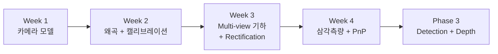

# Phase 2: Perception을 위한 기하학 기초

> ⏰ **기간**: 4주 (기존 8주 → 4주 압축, Optical Flow 제거)
> 🎯 **목표**: 카메라 행렬·왜곡·Multi-view 기하를 사용해 **2D 관측과 3D 세계를 연결**한다. 3D Object Detection / Depth Estimation / BEV의 기하학적 기초.
> ⏱️ **주간 시간**: 약 7시간
> 💻 **언어**: C++ (OpenCV)
> 🛠️ **하드웨어**: Jetson Orin Nano + ELP 800P Stereo Camera

---

## 📜 재구조화 회고 (2026-04-10)

이 Phase 는 원래 **컴퓨터 비전 기초 (8주)** 였고, 완료 기준이 *"VINS-Fusion 의 feature_tracker 노드가 뭘 하는지 이해"* 였다.
이직 타겟이 **Perception Engineer** 로 확정되면서 SLAM 트랙(VO/BA, VIO)이 [Archive/SLAM-legacy/](../Archive/SLAM-legacy/) 로 이동했고, Phase 2 도 SLAM 프레이밍을 제거하고 **Perception 중심 4주 구조** 로 재작성됐다.

기존 8주의 학습 결과(Week 1, 2 카메라 모델/캘리브레이션)는 보존되었고, 새 구조의 Week 1, 2 는 **README 만 Perception 맥락으로 리프레이밍** 한다. Week 3, 4 는 **새 코드** 로 작성된다.

기존 원본은 [Archive/SLAM-legacy/Roadmap/Phase 2.md](../Archive/SLAM-legacy/Roadmap/Phase%202.md) 에서 확인할 수 있다.

---

## 🎯 완료 기준

다음 한 문장에 자신 있게 답할 수 있으면 Phase 2 완료:

> **"카메라 행렬과 왜곡 보정, Multi-view 기하(Rectification, Triangulation, PnP)를 사용해 2D 픽셀과 3D 점을 양방향으로 연결할 수 있고, 이 연산이 Stereo Depth / Monocular 3D Detection / BEV 모델의 기하학적 토대임을 설명할 수 있다."**

면접 관점의 검증 질문:
1. KITTI/nuScenes 의 카메라 캘리브레이션 파일을 보고 fx/fy/cx/cy/distortion 을 해석할 수 있는가?
2. Stereo Depth 모델(HITNet, CRE-Stereo)에 입력하기 전 왜 Rectification 이 필요한가?
3. Monocular 3D Detection (FCOS3D, SMOKE) 이 예측한 3D 박스를 어떻게 2D 이미지에 재투영해 검증하는가?
4. nuScenes 의 6 카메라 rig 에서 한 점의 3D 위치를 복원하려면 어떤 연산이 필요한가?

---

## 🗺️ 4주 구조 한눈에

| Week | 주제 | 학습 상태 | 코드 상태 |
|------|------|----------|----------|
| **1** | 카메라 모델 (핀홀, K, 내부/외부 파라미터) | ✅ 학습 완료 | 기존 유지, README 리프레이밍 |
| **2** | 렌즈 왜곡 + 캘리브레이션 | ✅ 학습 완료 | 기존 유지, README 리프레이밍 |
| **3** | Multi-view 기하 + Stereo Rectification | 🟡 재정리 | **신규 작성** (OpenCV C++) |
| **4** | 삼각측량 + PnP (Perception 3D 맥락) | ⏳ 대기 | **신규 작성** (OpenCV C++) |

> 📌 학습 상태는 "학습자(나)의 진행도" 이고, 코드 상태는 "이 디렉토리의 실습 코드 상태"이다.

---

## 📋 Section 2.1: 카메라 모델 (Week 1, 2)

### Week 1: 핀홀 카메라 모델 ✅ (학습 완료)

> 💻 **C++ 실습**: [Studies/Phase 2/week1/](../Studies/Phase%202/week1/)
> 📝 **README 변경**: SLAM 프레이밍 제거 → Perception 맥락으로 리프레이밍

#### 기본 개념 (학습 완료)
- [x] 핀홀 카메라 원리
- [x] 3D → 2D 투영 과정
- [x] 초점 거리 (Focal Length) / 주점 (Principal Point)

#### 내부 / 외부 파라미터 (학습 완료)
- [x] 카메라 내부 행렬 K 구조
- [x] [R|t] 외부 파라미터
- [x] 월드 → 카메라 → 이미지 좌표 변환 사슬

#### Perception에서 어디에 쓰이나
- **Depth Estimation**: 모델은 픽셀 disparity 또는 normalized depth 를 출력 — 실제 미터 단위 복원에는 K 가 필수 (`Z = fB/d`)
- **Monocular 3D Detection (FCOS3D, SMOKE)**: 2D 이미지에서 3D 박스를 예측할 때, K 의 fx/fy/cx/cy 가 모델 입력 또는 후처리에 사용됨
- **3D → 2D Back-projection**: 3D 박스 코너를 2D 이미지에 그려 시각적 검증할 때 핵심 연산
- **데이터셋 호환**: KITTI/nuScenes calibration 파일이 정확히 이 형식

### Week 2: 렌즈 왜곡 + 캘리브레이션 ✅ (학습 완료)

> 💻 **C++ 실습**: [Studies/Phase 2/week2/](../Studies/Phase%202/week2/)

#### 렌즈 왜곡 / 캘리브레이션 (학습 완료)
- [x] 방사 왜곡 (배럴/핀쿠션) + 접선 왜곡
- [x] 왜곡 계수 (k1, k2, p1, p2, k3)
- [x] 체커보드 캘리브레이션 절차
- [x] 재투영 오차 (Reprojection Error)
- [x] OpenCV C++ 캘리브레이션 (mono + stereo)
- [x] RMS < 0.5 픽셀 달성

#### Perception에서 어디에 쓰이나
- **학습 데이터 전처리**: 왜곡 보정 없이 학습하면 모델 성능 저하 (특히 광각 카메라)
- **데이터셋 표준**: KITTI/nuScenes 모두 "rectified + undistorted" 이미지를 제공 — 이 전처리를 직접 해야 한다는 뜻
- **Fisheye 카메라 대응**: AMR 의 360° 인지에 자주 사용되는 fisheye 모델 (cv::fisheye)
- **Stereo Baseline**: stereo depth 의 절대 스케일은 baseline 에서 나옴 → 캘리브레이션 정확도가 직접 영향
- **Multi-camera rig (BEV)**: nuScenes 의 6 카메라가 모두 정확히 캘리브레이션되어야 BEV 에서 정합 가능

---

## 📋 Section 2.2: Multi-view 기하 (Week 3, 4) — Perception 맥락 신규

### Week 3: Multi-view 기하 + Stereo Rectification 🟡

> 💻 **C++ 실습 (신규)**: [Studies/Phase 2/week3/](../Studies/Phase%202/week3/)
> ⏰ **실습 시간**: 6-8시간

#### 학습 목표
- 에피폴라 제약을 이해하고 Stereo Rectification 까지 한 흐름으로 연결
- Stereo Depth 모델의 **입력 전처리**가 왜 필요한지 직관 확보
- KITTI / nuScenes 의 카메라 rig 구조 해석 능력

#### 핵심 개념
- [ ] 에피폴라 제약 (Epipolar Constraint) — 두 뷰 사이 점이 만족해야 하는 선형 관계
- [ ] Essential Matrix `E` / Fundamental Matrix `F` — 두 카메라의 상대 자세
- [ ] Stereo Rectification — 두 이미지를 같은 평면에 정렬, epipolar line 이 수평이 되도록
- [ ] 디스패리티 ↔ 깊이 관계 `Z = fB/d`
- [ ] (보조) RANSAC — outlier 가 많은 매칭에서 robust 하게 모델 추정

#### Perception에서 어디에 쓰이나
- **Stereo Depth Network (HITNet, CRE-Stereo, RAFT-Stereo)**: 입력은 **rectified stereo pair**. 이 전처리를 못하면 모델은 못 돌린다
- **KITTI Stereo 벤치마크**: 직접 평가를 해보려면 rectification + disparity 파이프라인 이해 필수
- **Multi-camera BEV (BEVFormer, BEVDet)**: 각 카메라의 intrinsic + extrinsic 정렬이 BEV 변환의 근간
- **Visual relocalization (Phase 4 NeRF)**: 두 뷰의 상대 자세 추정은 NeRF/Gaussian Splatting 의 카메라 포즈 입력

#### 실습 코드 (신규 작성)
- `basic.cpp` — 데모 파이프라인: 샘플 stereo → E/F 계산 → Rectification → Disparity → Depth map → 결과 저장
- `my_basic.cpp` — 사용자 구현 뼈대 (Step 1~6)
- `quiz_easy.cpp` / `quiz_medium.cpp` — 개념 + 구현 퀴즈

### Week 4: 삼각측량 + PnP (Perception 3D 맥락) ⏳

> 💻 **C++ 실습 (신규)**: [Studies/Phase 2/week4/](../Studies/Phase%202/week4/)
> ⏰ **실습 시간**: 6-8시간

#### 학습 목표
- 삼각측량 = Multi-view Depth / Multi-view 3D Detection 의 기초 연산
- PnP = 3D 박스 ↔ 2D 이미지 관계 검증의 도구
- 재투영 오차 (Reprojection Error) = 3D Detection 평가 지표의 기초

#### 핵심 개념
- [ ] DLT (Direct Linear Transform) 삼각측량 — 두 시점에서 보인 점의 3D 위치
- [ ] PnP 알고리즘 — 3D-2D 대응으로부터 카메라 포즈 추정 (P3P, EPnP, Iterative)
- [ ] RANSAC + PnP — outlier 에 강건한 포즈 추정
- [ ] 재투영 오차 (Reprojection Error) — 3D 점을 다시 2D 에 투영했을 때의 픽셀 오차

#### Perception에서 어디에 쓰이나
- **Monocular 3D Detection (FCOS3D, SMOKE, MonoFlex)**: 예측한 3D 박스 8 코너를 2D 에 투영 → 재투영 오차로 검증, 학습 시 loss term 으로도 사용
- **nuScenes Multi-view 객체 매칭**: 여러 카메라에서 보인 같은 객체 → 삼각측량으로 3D 위치 복원
- **BEV Detection 의 역연산**: Camera → BEV 변환의 수학적 기반
- **NeRF / Gaussian Splatting (Phase 4 preview)**: Multi-view reconstruction 의 가장 기본 연산
- **카메라 외재 캘리브레이션**: 알려진 3D 패턴(체커보드)으로 PnP 풀어 카메라 포즈 추정

#### 실습 코드 (신규 작성)
- `basic.cpp` — 합성 3D 박스 → 두 뷰 투영 → 삼각측량 복원 → PnP 로 포즈 역추정 → 재투영 오차 시각화
- `my_basic.cpp` — `cv::triangulatePoints`, `cv::solvePnPRansac`, `cv::projectPoints` 를 사용한 사용자 구현
- `quiz_easy.cpp` / `quiz_medium.cpp`

---

## 🔍 Phase 2 최종 자체 점검

다음 질문에 짧게라도 설명할 수 있으면 Phase 2 완료:

1. KITTI 캘리브레이션 파일에서 `P0`, `P1`, `R_rect`, `Tr_velo_to_cam` 이 각각 무엇인가?
2. Stereo Depth 모델이 rectified pair 를 입력으로 받는 이유는?
3. Disparity 가 1 픽셀일 때 Depth 가 얼마인지 계산하는 공식은? (fx, baseline 주어짐)
4. Monocular 3D Detection 모델이 출력한 3D 박스가 정확한지 어떻게 시각적으로 검증하는가?
5. PnP 알고리즘이 최소 몇 개의 3D-2D 대응을 필요로 하는가? P3P 와 EPnP 의 차이는?
6. RANSAC 의 반복 횟수를 결정하는 공식과 그 의미는?

---

## ➡️ 다음 단계

Phase 2 완료 후 → **[Phase 3: Detection + Depth](Phase%205.md)** 로 직진.

> ⚠️ 기존 SLAM 트랙(VO/BA, VIO)은 [Archive/SLAM-legacy/](../Archive/SLAM-legacy/) 로 이동되었다. SLAM 트랙은 더 이상 메인 로드맵의 일부가 아니다.

---

## 📚 참고 자료

### Multi-view Geometry
- *Multiple View Geometry in Computer Vision* (Hartley & Zisserman) — 1, 6, 9, 10, 11장
- OpenCV 공식 문서: [Camera Calibration and 3D Reconstruction](https://docs.opencv.org/4.x/d9/d0c/group__calib3d.html)
- Cyrill Stachniss 강의 영상 (Photogrammetry I/II) — 에피폴라 / 삼각측량 부분

### Perception 맥락
- KITTI 데이터셋 README (calibration 형식 설명)
- nuScenes devkit (`nuscenes.utils.geometry_utils` 의 카메라 변환 코드)
- HITNet 논문 — Stereo network 입력 조건
- FCOS3D / SMOKE 논문 — Monocular 3D detection 의 기하학적 후처리

### 새 Phase 2 가 다루지 않는 것 (Archive 참조)
- ORB / SIFT / AKAZE 등 특징점 디스크립터 deep dive → [Archive/SLAM-legacy/Studies/Phase 2/week3/](../Archive/SLAM-legacy/Studies/Phase%202/week3/)
- Optical Flow / KLT 트래킹 → [Archive/SLAM-legacy/Studies/Phase 2/week8/](../Archive/SLAM-legacy/Studies/Phase%202/week8/)
- VO/BA/VIO 시스템 통합 → [Archive/SLAM-legacy/Studies/Phase 3/](../Archive/SLAM-legacy/Studies/Phase%203/), [Phase 4/](../Archive/SLAM-legacy/Studies/Phase%204/)
