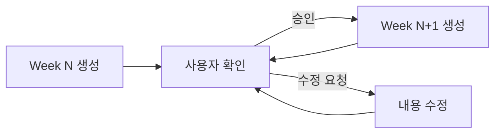

# Studies 학습 자료 생성 Implementation Plan

> 🎯 **목표**: Loadmap 기반 Week 단위 상세 학습 자료 생성  
> 🔄 **방식**: 1주씩 순차 생성 → 사용자 확인 → 다음 진행  
> 📅 **시작**: **Phase 2 Week 2**부터부터

---

## ✅ 사용자 요구사항 반영

| 항목 | 답변 | 반영 방법 |
|------|------|-----------|
| 시작 Week | **Phase 2 Week 2**부터 | Week 2부터 순차 생성 (Week 1은 이미 있음) |
| 언어 비율 | 이론=Python, 실습=C++ | Phase 2-4는 C++ 중심, Phase 7-8은 Python |
| 퀴즈 난이도 | **기초+중급 혼합** | 각 quiz에 Easy/Medium 섹션 구분 |
| 생성 단위 | **1주씩** | Week 단위로 생성 후 사용자 확인 |
| 정답 분리 | **quiz_solutions/** | 정답 코드를 별도 디렉토리에 저장 |
| 데이터셋 | **필요시 포함** | 알고리즘 검증에 필요하면 샘플 데이터 제공 |
| Docker | **필요시 제공** | 의존성 복잡하면 Dockerfile 추가 |
| Phase 5, 6 | 코드 분석 중심 | README + exercises + checklist 구성 |

---

## 📊 현재 상태 점검

### ✅ 완료된 것
- **Loadmap**: Phase 0-8 전체 완료
- **PRACTICE.md**: Phase 2-4, 7-8 C++/Python 실습 가이드 완료
- **Phase 1**: week1-8 디렉토리 존재 (내용 확인 필요)
- **Phase 2**: week1-8 디렉토리 존재, week1 README 완성

### ❌ 생성 필요 (우선순위 순)
0. **공통 인프라**: 의존성 관리, 데이터셋 스크립트, 테스트 프레임워크
1. **Phase 1**: Week 1-8 내용 보완 (Python 환경)
2. **Phase 2**: Week 2-8 내용 보완 (C++ 실습 추가)
3. **Phase 3**: Week 2-13 전체 (C++) ⭐ **최우선**
4. **Phase 4**: Week 1-13 전체 (C++)
5. **Phase 5**: Week 1-12 전체 (코드 분석)
6. **Phase 6**: Week 1-12 전체 (실적용)
7. **Phase 7**: Week 1-12 전체 (Python)
8. **Phase 8**: Week 1-8 전체 (Python)

---

## 🔧 공통 인프라 구성

### 프로젝트 루트 구조

```
Studies/
├── README.md              # 전체 안내
├── dependencies.md        # 의존성 버전 명시
├── TROUBLESHOOTING.md     # 일반 에러 해결
├── progress.md            # 학습 진도 추적
├── scripts/
│   ├── install_deps.sh    # 의존성 자동 설치
│   └── check_env.sh       # 환경 검증
├── datasets/
│   ├── README.md          # 데이터셋 구조 설명
│   └── download.sh        # KITTI/EuRoC 다운로드
├── .github/
│   └── workflows/
│       └── build.yml      # CI/CD (선택)
└── Phase X/
    └── weekY/
        └── ...
```

### dependencies.md 내용

```markdown
# 의존성 버전

## C++ 라이브러리 (Phase 2-4)
- **CMake**: 3.10+
- **Eigen3**: 3.3.7+
- **OpenCV**: 4.5.0+ (with contrib)
- **g2o**: commit `9b41a4e` 이상
- **Ceres Solver**: 2.0.0+
- **Sophus**: latest (header-only)

## Python 패키지 (Phase 7-8)
- **Python**: 3.8+
- **PyTorch**: 2.0.0+
- **numpy**: 1.21+
- **opencv-python**: 4.5+
- **matplotlib**: 3.5+

## 설치 방법
Ubuntu 22.04:
```bash
bash scripts/install_deps.sh
```
```

### datasets/download.sh 예시

```bash
#!/bin/bash
# KITTI Odometry 00 시퀀스 (일부)
wget https://s3.eu-central-1.amazonaws.com/avg-kitti/data_odometry_gray.zip
# EuRoC MH_01 (일부)
# ...
```

### progress.md 구조

```markdown
# 학습 진도

## Phase 3: Visual Odometry & BA
- [ ] Week 1: VO 파이프라인
- [ ] Week 2: 2D-2D 모션 추정
- [ ] Week 3-4: PnP
...
```

---

## 🏗️ Phase별 파일 구성 전략

### Phase 2-4 (C++ SLAM)

각 **weekX/** 디렉토리:
```
weekX/
├── README.md          # 📖 이론 (수식, 개념, 시각화)
│                      # + 🐛 문제 해결 섹션
│                      # + 📖 사전학습/다음연결
├── basic.cpp          # 💻 기본 구현 (주석 상세)
│                      # + ⏱️ 성능 측정 코드
├── basic.h            # 헤더 파일
├── quiz_easy.cpp      # ⭐ 기초 퀴즈 (3-4문제, 정답 없음)
├── quiz_medium.cpp    # ⭐⭐ 중급 퀴즈 (2-3문제, 정답 없음)
├── quiz_solutions/    # ✅ 퀴즈 정답 코드
│   ├── easy_sol.cpp   # 상세 설명 포함
│   └── medium_sol.cpp
├── test/              # 🧪 테스트
│   ├── test_basic.cpp # Google Test
│   └── CMakeLists.txt
├── data/              # (필요시) 샘플 데이터
│   ├── README.md      # 데이터 설명
│   └── download.sh    # 다운로드 스크립트
├── CMakeLists.txt     # 빌드 설정
└── Dockerfile         # (필요시) 환경 구성
```

**특징**:
- 이론은 Python으로 먼저 설명 → C++로 실전 구현
- CMake로 빌드 가능하도록
- Eigen, OpenCV, g2o, Ceres 의존성 (버전 명시)
- 성능 측정 코드 포함 (실행시간, 정확도)
- 에러 처리 가이드 포함
- Google Test로 자동 검증

---

### Phase 5 (VINS-Fusion 코드 분석)

각 **weekX/** 디렉토리:
```
weekX/
├── README.md          # 📖 코드 분석 가이드
│                      # - 분석할 파일/함수 목록
│                      # - 핵심 개념 연결
│                      # - 단계별 분석 가이드
├── exercises.md       # 💻 실습 문제
│                      # - 로깅 추가
│                      # - 파라미터 변경 실험
│                      # - 코드 수정 과제
└── checklist.md       # ✅ 이해도 체크리스트
                       # - 함수별 이해 확인
                       # - 개념 이해도 자가 평가
```

**특징**:
- VINS-Fusion 저장소 기반
- 코드 리딩 → 실험 → 확인 사이클

---

### Phase 6 (AMR 실적용)

각 **weekX/** 디렉토리:
```
weekX/
├── README.md          # 📖 실습 가이드
│                      # - 하드웨어 설정
│                      # - ROS2 통합 방법
│                      # - 트러블슈팅
├── exercises.md       # 💻 실습 과제
│                      # - 캘리브레이션 수행
│                      # - 파라미터 튜닝
│                      # - 성능 평가
└── checklist.md       # ✅ 완료 체크리스트
```

**특징**:
- 실무 중심
- 단계별 성공 기준 명확

---

### Phase 7-8 (Python 딥러닝)

각 **weekX/** 디렉토리:
```
weekX/
├── README.md          # 📖 이론
├── basic.py           # 💻 기본 구현
├── quiz_easy.py       # ⭐ 기초 퀴즈 (정답 없음)
├── quiz_medium.py     # ⭐⭐ 중급 퀴즈 (정답 없음)
├── quiz_solutions/    # ✅ 퀴즈 정답 코드
│   ├── easy_sol.py
│   └── medium_sol.py
├── test/              # 🧪 테스트 (pytest)
│   └── test_basic.py
├── requirements.txt   # Python 패키지 (버전 고정)
├── data/              # (필요시) 샘플 데이터
│   └── download.sh
└── Dockerfile         # (필요시) 환경 구성
```

**특징**:
- PyTorch, Ultralytics, MMDetection3D (버전 고정)
- pytest로 자동 테스트
- TensorBoard 로깅 포함

---

## 📋 Phase 3 Week별 구성 계획

### Week 1: VO 파이프라인 개요

**README.md**:
- Visual Odometry란?
- VO vs VIO vs SLAM
- VO 파이프라인 5단계
- 좌표계 (Camera, World, Robot)
- mermaid 다이어그램

**basic.cpp**:
- 간단한 VO 시뮬레이션 (2D)
- 특징점 이동 → 포즈 변화 계산
- 시각화 (matplotlib-cpp 또는 OpenCV)

**quiz_easy.cpp**:
1. 카메라 좌표계 → 월드 좌표계 변환
2. 회전 행렬 R의 역행렬 = 전치행렬 증명
3. 이동 벡터 t의 의미 파악

**quiz_medium.cpp**:
1. 노이즈가 있는 특징점으로 포즈 추정
2. 스케일 모호성 문제 직접 확인
3. 여러 프레임 연속 VO (드리프트 관찰)

---

### Week 2: 2D-2D 모션 추정 (Essential Matrix)

**README.md**:
- Epipolar Geometry 복습
- Essential Matrix 유도
- E에서 R, t 복원 (4가지 솔루션)
- Cheirality Check
- 수식 단계별 유도

**basic.cpp**:
- `estimateEssentialMatrix()` 구현
- 8-point 알고리즘
- SVD로 E 분해 → R, t 복원
- Cheirality check 구현

**quiz_easy.cpp**:
1. Essential Matrix의 자유도는?
2. 왜 5-point 알고리즘이 minimal인가?
3. t의 스케일은 알 수 있는가?

**quiz_medium.cpp**:
1. 노이즈 있는 대응점으로 E 추정
2. RANSAC으로 outlier 제거
3. 복원된 R, t의 정확도 평가

---

### Week 3-4: 2D-3D 모션 추정 (PnP)

**README.md**:
- PnP 문제 정의
- DLT (Direct Linear Transform)
- P3P, EPnP 알고리즘
- RANSAC with PnP

**basic.cpp**:
- `solvePnP()` 구현 (DLT)
- Reprojection error 계산
- RANSAC-PnP

**quiz_easy.cpp**:
1. Minimal PnP는 몇 개 점 필요?
2. 2D-2D vs 2D-3D 차이는?
3. PnP에서 스케일 필요한가?

**quiz_medium.cpp**:
1. EPnP 구현
2. KITTI 데이터셋으로 궤적 추정
3. Ground truth와 비교

---

### Week 5-7: Bundle Adjustment

**README.md**:
- BA 정의 및 필요성
- Cost function (재투영 오차)
- Levenberg-Marquardt 알고리즘
- Sparse structure (Schur complement)

**basic.cpp**:
- g2o로 간단한 BA
- Ceres로 BA
- 두 라이브러리 비교

**quiz_easy.cpp**:
1. BA가 VO보다 나은 이유?
2. Local BA vs Global BA 차이?
3. 최적화 변수는?

**quiz_medium.cpp**:
1. 커스텀 cost function (Ceres)
2. Robust kernel 적용 (Huber)
3. EuRoC 데이터로 BA 실험

---

## 📋 생성 순서 및 프로세스

### 단계별 진행



### 각 Week 생성 시 포함 내용

**README.md**:
- [ ] 3-5페이지 분량
- [ ] 초심자도 이해 가능한 설명
- [ ] 수식 단계별 유도 + 직관적 해석
- [ ] Mermaid 다이어그램 또는 수식 시각화
- [ ] 참고 자료 링크
- [ ] 예상 학습 시간
- [ ] **🐛 문제 해결 섹션**
- [ ] **📖 이전/다음 연결**

**basic.cpp/py**:
- [ ] 주석 매우 상세 (거의 모든 줄)
- [ ] 단계별 출력 (중간 결과 확인 가능)
- [ ] 시각화 포함 (가능하면)
- [ ] 빌드/실행 방법 주석
- [ ] **⏱️ 성능 측정 코드**
- [ ] **에러 처리 (try-catch, assert)**

**basic.py** (Python):
- [ ] 주석 매우 상세
- [ ] 단계별 출력
- [ ] matplotlib으로 시각화
- [ ] argparse로 파라미터 조정

**quiz_easy.cpp/py**:
- [ ] 기초 문제 3-4개
- [ ] 주어진 코드 완성형
- [ ] 힌트 주석 포함
- [ ] 정답 확인 함수

**quiz_medium.cpp/py**:
- [ ] 중급 문제 2-3개
- [ ] 개념 응용 필요
- [ ] 부분 힌트만 제공
- [ ] 자가 채점 가능

**quiz_solutions/**:
- [ ] 각 문제별 상세 주석
- [ ] 대안 접근법 설명
- [ ] 시간/공간 복잡도 분석

**test/** (새로 추가):
- [ ] Google Test (C++) 또는 pytest (Python)
- [ ] 기본 기능 검증
- [ ] Edge case 테스트

**CMakeLists.txt** (C++ only):
- [ ] 버전 명시 (Eigen 3.3.7+, OpenCV 4+)
- [ ] g2o, Ceres (필요시)
- [ ] Google Test 통합
- [ ] Release/Debug 모드 설정

**data/** (필요시):
- [ ] README.md (데이터 설명)
- [ ] download.sh (자동 다운로드)
- [ ] 샘플 데이터 (< 10MB)

**Dockerfile** (필요시):
- [ ] Ubuntu 22.04 베이스
- [ ] 모든 의존성 설치
- [ ] 빌드 검증

---

## 📝 템플릿

### README.md 템플릿 (Phase 3-4)

```markdown
# Week X: [주제]

> 🎯 **목표**: [이번 주 학습 목표]  
> ⏰ **예상 시간**: 이론 N시간 + 실습 N시간  
> 📚 **사전 지식**: [필요한 배경 지식]

## 📖 이전/다음 연결

**사전 학습**:
- Phase X Week Y: [이전에 배운 내용]

**다음 연결**:
- Phase X Week Z: [이 내용을 확장/응용]

---

## 📖 개념 설명

### 1. 핵심 아이디어
[초심자도 이해할 수 있는 설명]
[예시, 비유 포함]

### 2. 수학적 유도
#### Step 1: [단계 제목]
[수식]
**직관**: [수식의 의미를 한 문장으로]

#### Step 2: [다음 단계]
...

### 3. 알고리즘
\`\`\`
1. [단계 1]
2. [단계 2]
...
\`\`\`

### 4. 시각화
\`\`\`mermaid
[다이어그램]
\`\`\`

---

## 💻 실습

### 기본 구현 (`basic.cpp`)
[코드 설명, 실행 방법]

\`\`\`bash
# 빌드
mkdir build && cd build
cmake ..
make

# 실행
./basic
\`\`\`

**출력 예시**:
\`\`\`
[예상 출력]
\`\`\`

### 퀴즈 (`quiz_*.cpp`)

#### ⭐ 기초 퀴즈
1. [문제 1]
2. [문제 2]
3. [문제 3]

#### ⭐⭐ 중급 퀴즈
1. [문제 1]
2. [문제 2]

---

## ✅ 체크리스트

- [ ] 개념 이해 ([핵심 질문 1])
- [ ] 개념 이해 ([핵심 질문 2])
- [ ] `basic.cpp` 빌드 및 실행 성공
- [ ] 기초 퀴즈 3개 이상 풀이
- [ ] 중급 퀴즈 1개 이상 시도

---

## 📚 참고 자료

### 논문
- [관련 논문 제목 및 링크]

### 강의
- [관련 강의 링크]

### 블로그
- [참고 블로그]

---

## 🐛 문제 해결

### 빌드 에러
**문제**: `Eigen not found`
```bash
sudo apt install libeigen3-dev
```

**문제**: `OpenCV linking error`
```bash
# CMakeLists.txt에서 확인
find_package(OpenCV 4 REQUIRED)
```

### 런타임 에러
**문제**: Segmentation fault
- 배열 인덱스 범위 확인
- nullptr 체크

### 성능 문제
- Release 모드로 빌드: `cmake -DCMAKE_BUILD_TYPE=Release`
- 프로파일링: `valgrind --tool=callgrind`

---

## ⏱️ 성능 측정

```cpp
// basic.cpp에 포함할 코드
#include <chrono>

auto start = std::chrono::high_resolution_clock::now();
// ... 알고리즘 실행 ...
auto end = std::chrono::high_resolution_clock::now();
auto duration = std::chrono::duration_cast<std::chrono::milliseconds>(end - start);
std::cout << "실행 시간: " << duration.count() << " ms" << std::endl;
```

**목표 성능** (참고):
- Essential Matrix 추정: < 10ms
- Bundle Adjustment (100점): < 50ms

---

## ❓ 다음 주 예고

Week X+1: [다음 주 주제]
```

---

### exercises.md 템플릿 (Phase 5-6)

```markdown
# Week X: [주제] - 실습 과제

> 💻 **난이도**: ⭐ 기초 / ⭐⭐ 중급  
> ⏰ **예상 소요**: N시간

---

## Exercise 1: [제목] ⭐

**목표**: [무엇을 배우는가]

**과제**:
1. [단계 1]
2. [단계 2]

**힌트**:
- [힌트 1]
- [힌트 2]

**검증**:
[어떻게 확인하는가]

---

## Exercise 2: [제목] ⭐⭐

...

---

## 제출 (선택)

완료한 코드를 다음 형식으로 정리:
\`\`\`cpp
// 수정한 코드
\`\`\`

**결과 스크린샷**:
[결과 이미지 첨부]
```

---

## ⏱️ 예상 일정

### Phase별 소요 시간

| Phase | Week 수 | 1주당 작성 시간 | 총 시간 |
|-------|---------|----------------|---------|
| Phase 3 | 13주 | 3-4시간 | 39-52시간 |
| Phase 4 | 13주 | 3-4시간 | 39-52시간 |
| Phase 5 | 12주 | 2-3시간 | 24-36시간 |
| Phase 6 | 12주 | 2-3시간 | 24-36시간 |
| Phase 7 | 12주 | 3-4시간 | 36-48시간 |
| Phase 8 | 8주 | 3-4시간 | 24-32시간 |
| **합계** | **70주** | | **186-256시간** |

### 현실적 진행 계획

**1일 1주 생성**으로 가정:
- Phase 3: 13일
- Phase 4: 13일
- Phase 5: 12일
- Phase 6: 12일
- Phase 7: 12일
- Phase 8: 8일

**총 70일** (주말 제외 시 ~3.5개월)

---

## 🚀 첫 번째 작업

**생성 대상**: Phase 2 Week 2

### 파일 목록
1. `/Studies/Phase 2/week2/README.md`
2. `/Studies/Phase 2/week2/basic.cpp`
3. `/Studies/Phase 2/week2/basic.h`
4. `/Studies/Phase 2/week2/quiz_easy.cpp`
5. `/Studies/Phase 2/week2/quiz_medium.cpp`
6. `/Studies/Phase 2/week2/quiz_solutions/easy_sol.cpp`
7. `/Studies/Phase 2/week2/quiz_solutions/medium_sol.cpp`
8. `/Studies/Phase 2/week2/test/test_basic.cpp`
9. `/Studies/Phase 2/week2/CMakeLists.txt`
10. (선택) `/Studies/Phase 2/week2/data/chessboard_images/` - 캘리브레이션 이미지

### 내용
- **주제**: 카메라 캘리브레이션 (Camera Calibration)
- **이론**: 내부/외부 파라미터, 왜곡 모델, Zhang's Method
- **실습**: OpenCV 캘리브레이션, 체커보드 검출, 왜곡 보정
- **퀴즈 기초**: 내부 파라미터 의미, 왜곡 계수 이해
- **퀴즈 중급**: 캘리브레이션 정확도 평가, 왜곡 보정 구현

> 💡 **참고**: Phase 2 week2에 이미 PRACTICE.md가 있으므로, README.md는 이론 중심으로 작성분석

---

## 🔍 부족한 점 검토

### ✅ 모두 반영 완료
- [x] **Phase 3 Week 2**부터 시작
- [x] C++ 실습 구성
- [x] 기초+중급 퀴즈
- [x] 1주씩 생성
- [x] **quiz_solutions/** 디렉토리에 정답 분리
- [x] Phase 5, 6 코드 분석 형태
- [x] **데이터셋**: 필요시 `data/` 디렉토리에 샘플 포함
- [x] **Docker**: 필요시 Dockerfile 제공

### 📝 구현 세부사항

1. **정답 제공 방식**
   - `quiz_solutions/easy_sol.cpp` - 기초 퀴즈 전체 정답
   - `quiz_solutions/medium_sol.cpp` - 중급 퀴즈 전체 정답
   - 각 정답 파일에 상세 주석 + 설명 포함

2. **데이터셋 포함 기준**
   - 알고리즘 검증에 필수적인 경우 포함
   - 예: Essential Matrix는 테스트 이미지 2장 필요
   - 예: Bundle Adjustment는 KITTI 시퀀스 일부 필요

3. **Docker 제공 기준**
   - 의존성 5개 이상이거나
   - 빌드가 복잡한 경우 (g2o, Ceres)
   - 간단한 경우는 README에 설치 명령만

4. **시각화**
   - C++ 코드에서는 OpenCV `imshow`로 간단히
   - 복잡한 플롯은 결과를 파일로 저장 → Python 스크립트로 시각화

5. **테스트**
   - Google Test (C++) / pytest (Python)
   - 각 알고리즘의 정확도 검증
   - CI/CD로 자동 실행 (선택)

6. **진도 추적**
   - `Studies/progress.md`에서 체크
   - 각 week 완료 시 체크박스 업데이트

---

## ✅ 최종 준비 완료

**모든 요구사항이 반영되었습니다!**

- ✅ **Phase 2 Week 2**부터 시작
- ✅ `quiz_solutions/` 디렉토리에 정답 분리
- ✅ 데이터셋 필요시 `data/` 포함
- ✅ Docker 필요시 `Dockerfile` 제공
- ✅ 테스트 자동화 (Google Test/pytest)
- ✅ 성능 측정 및 에러 처리
- ✅ Phase 간 연계성 명시

**다음 생성**: Phase 2 Week 2 (Camera Calibration)

사용자 승인 시 즉시 생성 시작 가능합니다! 🚀🚀
