# SO-ARM101 조립 가이드 — Leader + Follower 검수·모터 설정·조립·캘리브레이션·텔레옵

> LeRobot SO-ARM101 2-arm 세트(3D 프린트 파트 포함 키트)를 부품 검수부터 텔레옵 검증까지 끌고 가는 절차와 함정을 정리한다. 스파이크 Week 1 의 실행 절차이자, Stage 1(ROS2 드라이버·안전·캘리브 오프셋)과 v2.5(record 규약)가 참조하는 하드웨어 사실의 원본이다 ([master roadmap](../../../../docs/superpowers/plans/2026-08-31-master-roadmap.md) §3).
> 작성일: 2026-09-13 (절차 기준일 2026-09-05)
> 원문: TheRobotStudio SO-ARM100 README, LeRobot 공식 문서 `so101`, Seeed Studio wiki
> 그림 출처: 관절별 조립 그림은 LeRobot 공식 문서의 조립 영상(Hugging Face `documentation-images`)에서 추출한 프레임에 단계 번호를 붙인 것이고, 사진은 TheRobotStudio 리포지토리(Apache-2.0)의 것이다. 도식 3장은 이 문서용으로 작성했다. 그림 파일은 `images/so-arm101/`. 움직이는 순서까지 보려면 §11 의 공식 문서 영상을 같이 본다
> 호스트: Ubuntu 22.04 x86 기준. macOS(Apple Silicon) 차이는 §3.2

| Follower (그리퍼) | Leader (핸들 + 트리거) |
|---|---|
| 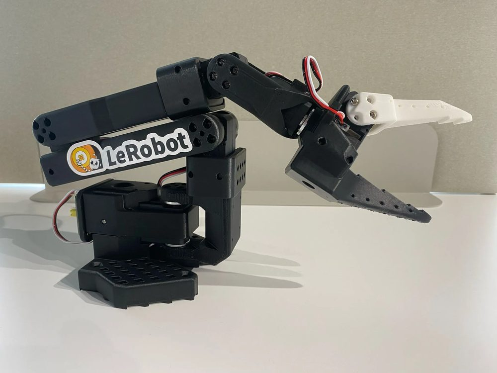 | 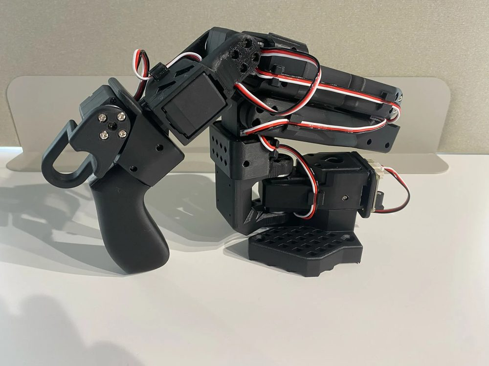 |

## TL;DR

- **모터 ID 설정은 조립 전에 한다.** 서보는 출하 시 전부 ID 1 이고, 보드에 한 개씩 단독 연결해 `lerobot-setup-motors` 로 ID·baudrate(1,000,000)를 EEPROM 에 쓴다. 조립 후에는 데이지체인을 풀어야 해서 몇 배 번거롭다.
- **전원 전압이 서보 종류를 따른다.** 7.4V 서보(Leader 전체, Standard Follower)는 DC 5V, 12V 서보(Pro Follower)는 DC 12V. 플러그 규격이 같아 육안 구분이 안 되므로 어댑터에 라벨을 붙인다. 12V 를 Leader 보드에 꽂으면 서보가 소손된다.
- **배선은 조립과 동시에 한다.** 서보를 장착할 때마다 3핀 케이블을 꽂아둔다. 파트 결합 후 틈으로 케이블을 통과시키는 것은 매우 어렵다.
- **포트는 `/dev/serial/by-id/` 고정 경로, 캘리브 파일은 `HF_LEROBOT_CALIBRATION` 로 사용자 디렉터리.** `/dev/ttyACM*` 번호는 동시 연결·재부팅으로 바뀌고, `~/.cache` 는 디스크 정리로 지워질 수 있다.
- **서보 축을 조립 중 여러 바퀴 돌리지 않는다.** STS3215 는 회전 수를 누적하며 캘리브레이션에서 `Magnitude exceeds 2047` 로 터진다 (처치는 §6.4).
- **Python 3.12 이상 + extras `core_scripts,feetech`.** 3.14 는 `draccus` 비호환으로 `lerobot-setup-motors` 가 실패한다. Seeed 문서의 3.10 은 Seeed 포크 기준이라 공식 리포와 섞지 않는다.

---

## 0. 이 레포의 키트에 적용

구매 키트 구성은 [BOM.md](../../BOM.md) 기준이다. 아래 §1-§11 은 일반 가이드이고, 이 절이 그 가이드를 이 키트에 맞춰 읽는 방법이다.

| 항목 | 이 키트 | 가이드 상 해당 | 적용 |
|---|---|---|---|
| Follower 서보 | STS3215-C018 12V 1:345 x6 | Pro 키트 (§2.2·§2.3) | 어댑터 **12V**. 동봉 12V 2A 는 가이드의 하한(2A 이상, 5A 권장) — 다관절 동시 고부하·정지 시 전압 강하로 서보 리셋(LED 점멸, `Failed to sync read`)이 보이면 5A 급으로 교체 |
| Leader 서보 | 7.4V x6 | 항상 7.4V (§2.3) | 어댑터 **5V 4A** (동봉). Leader 보드에 12V 금지 |
| Leader 기어비 | 판매 페이지 기준 6개 전부 1:147 단일 | 공식 혼합 = 1·3 C044 1/191, 2 C001 1/345, 4·5·6 C046 1/147 (§2.2) | 관절별 조작감만 다르고 캘리브·데이터 수집 무영향으로 감수 (BOM.md ①). 실물 스티커 확인값이 판매 페이지와 다르면 BOM.md ① 을 실물 기준으로 갱신 |
| 서보 보드 | 버스 서보 어댑터 x2, USB-C 케이블 x2 동봉 | §2.1 | 점퍼 2개 모두 `B` 채널 확인 |
| 카메라 | 정면 거치 모듈 1개 기본 + 판매자 Wrist 옵션 (손목 카메라 + 마운트) | §7 말미 | 손목 카메라는 그리퍼에 장착. 보유 ELP 는 거치 모듈에 안 붙음 (D8 확인, `spike/week2/RESULT.md` §4 #5) — 팔로워 왼쪽 측면에 임시 고정. 전체 뷰 전용 카메라 + 고정수단이 도착하면 교체 (Stage 1 W3) |
| 호스트 | Ubuntu PC (RTX 4070) 위 Docker 컨테이너 — Ubuntu 24.04, Python 3.12, lerobot 0.6.2 venv | §3.1 | §3.1 의 Ubuntu 22.04 · Python 3.10 절차는 일반 가이드다. 이 환경의 준비 · 장치 경로 (`/dev/so101_*`) 는 `spike/week2/week2_guide.md` §0 을 따른다. macOS 절(§3.2)은 참고용 |

로드맵과의 연결:

| 로드맵 항목 | 이 문서에서 쓰는 절 |
|---|---|
| 스파이크 D1-D5 (조립·ID·설치·캘리브·teleop) | §2-§7 전체 |
| 스파이크 D8-D9 (카메라·record) | §7 말미 카메라 조건, §6.3 `id`·캘리브 경로 규약 |
| Stage 1 W1 (ROS2 드라이버 검증) | §2.3 배선·baudrate, §4.1 고정 포트 경로, §6.4 레지스터(Present_Position 56, Homing_Offset 33) |
| Stage 1 W4 (캘리브 오프셋 반영) | §6.3 json 위치·디렉터리 구조 |
| Stage 1 W5 (소프트웨어 정지) | §7 비상 정지 — DC 차단은 토크 해제(낙하), USB 차단은 현 위치 유지 |

---

## 1. 전체 흐름

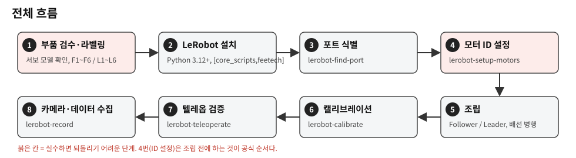

붉은 칸은 실수하면 되돌리기 어려운 단계다. 핵심 원칙 두 가지.

1. 모터 ID 설정은 조립 전에 한다. 공식 순서가 그렇고, 서보를 하나씩 보드에 단독 연결하기가 조립 전이 압도적으로 쉽다. 조립 후에도 데이지체인을 풀어 한 개씩 연결하면 가능하지만, 케이블이 파트 안쪽에 있어 번거롭다.
2. 전원 전압은 서보 종류에 따라 다르며, 잘못 꽂으면 서보가 소손된다. 어댑터에 라벨을 붙인다.

---

## 2. 부품 검수

### 2.1 BOM (2-arm 세트)

| 부품 | 수량 | 비고 |
|---|---|---|
| Feetech STS3215 서보 | 12 | 4종 모델 혼재. 외형 동일, 스티커로 구분 |
| 모터 제어 보드 (Waveshare Bus Servo Adapter) | 2 | 점퍼 2개 모두 `B`(USB) 채널 |
| USB-C 케이블 | 2 | 충전 전용 케이블은 불가, 데이터 케이블 확인 |
| DC 전원 어댑터 (5.5 x 2.1 mm, center +) | 2 | 키트에 따라 미포함. 전압은 §2.3 |
| 테이블 클램프 | 4 | 팔당 2개 |
| 3D 프린트 파트 | Follower 1세트, Leader 1세트 | 공통 파트 9종 + Follower 전용 2종 + Leader 전용 3종 |
| 3핀 서보 케이블 | 서보 동봉 | 여분 확보 권장 |
| 나사 M2x6, M3x6 | 서보/키트 동봉 | M2 = 서보 본체 고정, M3 = 혼 및 파트 결합 |
| Phillips 드라이버 #0, #1 | 1세트 | |

### 2.2 서보 모델과 관절 매핑 (가장 중요)

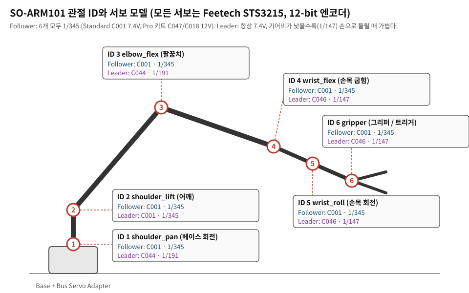

모든 서보는 Feetech STS3215 (12-bit 엔코더, 0-4095) 이고 기어비·정격 전압만 다르다.

| ID | LeRobot 모터명 | 관절 | Follower | Leader (공식 혼합) |
|---|---|---|---|---|
| 1 | `shoulder_pan` | 베이스 회전 | C001 (7.4V) 1/345 | C044 (7.4V) 1/191 |
| 2 | `shoulder_lift` | 어깨 | C001 (7.4V) 1/345 | C001 (7.4V) 1/345 |
| 3 | `elbow_flex` | 팔꿈치 | C001 (7.4V) 1/345 | C044 (7.4V) 1/191 |
| 4 | `wrist_flex` | 손목 굽힘 | C001 (7.4V) 1/345 | C046 (7.4V) 1/147 |
| 5 | `wrist_roll` | 손목 회전 | C001 (7.4V) 1/345 | C046 (7.4V) 1/147 |
| 6 | `gripper` | 그리퍼 / 트리거 | C001 (7.4V) 1/345 | C046 (7.4V) 1/147 |

- Follower 12V 사양 키트(Seeed "Pro", 이 레포의 키트 등)는 6개 모두 C047 또는 C018 (12V, 1/345)이다. Leader 는 어느 키트든 항상 7.4V.
- Leader 에 낮은 기어비를 쓰는 이유: 손으로 움직일 때 저항을 줄이기 위해서다. SO-100 의 외부 기어박스를 없앤 것이 SO-101 의 변경점.
- 검수 즉시 마스킹테이프로 `F1`-`F6`, `L1`-`L6` 를 서보에 써 붙인다. 이후 ID 설정, 조립 모두 이 라벨 기준으로 진행한다.
- 4종을 섞어 넣으면 캘리브레이션은 통과할 수 있어도 텔레옵 시 관절별 감각이 다르고, 최악의 경우 leader 가 자중을 못 버틴다.

### 2.3 전원 전압과 배선

| 서보 | 어댑터 | 적용 |
|---|---|---|
| C001 / C044 / C046 (7.4V) | DC 5V 4A | Leader 전체, Standard 키트 Follower |
| C047 / C018 (12V) | DC 12V (2A 이상, 5A 권장) | Pro 키트 Follower 만 |

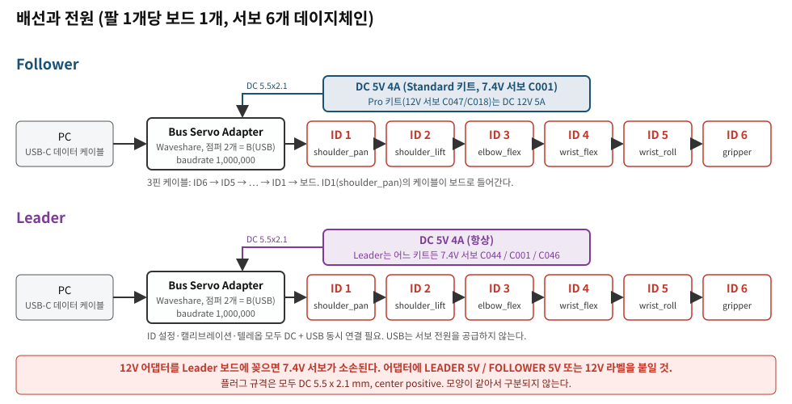

- 3핀 케이블은 ID 6 → 5 → 4 → 3 → 2 → 1 → 보드 순으로 이어지고, ID 1(`shoulder_pan`)의 케이블이 보드로 들어간다.
- 12V 어댑터를 Leader 보드에 꽂으면 7.4V 서보가 소손된다. 플러그 규격이 모두 DC 5.5 x 2.1 mm center positive 라 모양으로 구분되지 않으므로, 어댑터 본체에 `LEADER 5V` / `FOLLOWER 12V` 라벨을 붙인다.
- USB 는 서보에 전원을 공급하지 않는다. ID 설정, 캘리브레이션, 텔레옵 모두 DC 어댑터 + USB 동시 연결이 필요하다.
- 참고 토크: 7.4V 버전 16.5 kg·cm (6V 기준), 12V 버전 30 kg·cm.

---

## 3. 소프트웨어 준비

공식 main 브랜치 기준 Python 3.12 이상(3.12 / 3.13)이 필요하다. 3.14 는 의존 라이브러리 `draccus` 비호환으로 `lerobot-setup-motors` 가 TypeError 로 실패한 사례가 있다. Seeed 문서의 Python 3.10 은 Seeed 포크(`Seeed-Projects/lerobot`) 기준이므로 공식 리포와 섞지 않는다.

SO-101 실기 워크플로에 필요한 extras 는 `core_scripts`(record / replay / calibrate) + `feetech`(서보)다.

### 3.1 Ubuntu 22.04 (x86, RTX)

```bash
conda create -y -n lerobot python=3.12 && conda activate lerobot
conda install ffmpeg -c conda-forge   # torchcodec 문제 시 ffmpeg=7.1.1

git clone https://github.com/huggingface/lerobot.git ~/lerobot
cd ~/lerobot && pip install -e ".[core_scripts,feetech]"

# pip 설치 시 CPU torch로 덮어써질 수 있으므로 확인
python -c "import torch; print(torch.cuda.is_available())"

# 시리얼 포트 권한 (재로그인 필요)
sudo usermod -aG dialout $USER
```

- `usermod` 은 `/etc/group` 에 등록만 하고, 그룹은 로그인 시점에 세션에 부여된다. 따라서 재로그인(또는 재부팅) 전까지는 새로 연 터미널에서도 시리얼 포트가 Permission denied 로 실패한다. 반영 여부는 `id | grep dialout` 으로 확인한다.
- 재로그인 없이 바로 진행하려면 해당 터미널에서 `newgrp dialout` 을 실행한다. 그 셸에서만 그룹이 적용되며, export 한 환경변수와 conda 환경은 상속된다.
- Jetson(aarch64)은 같은 CLI 를 쓰되 torch/torchvision 을 JetPack 용으로 별도 설치. TorchCodec 이 없어 자동으로 pyav 폴백된다.

### 3.2 macOS (Apple Silicon)

포트 식별, 모터 ID 설정, 캘리브레이션, 텔레옵, 카메라 녹화, ACT 추론까지 Mac 단독으로 동작한다. 학습은 MPS 로 가능하지만 느리다 (아래 표).

```bash
# arm64 네이티브 miniforge. Rosetta(x86_64) 터미널/Python은 의존성에서 막히므로 피한다
wget "https://github.com/conda-forge/miniforge/releases/latest/download/Miniforge3-$(uname)-$(uname -m).sh"
bash Miniforge3-$(uname)-$(uname -m).sh

conda create -y -n lerobot python=3.12 && conda activate lerobot
conda install ffmpeg -c conda-forge   # Apple Silicon은 torchcodec 사용, ffmpeg 필요

git clone https://github.com/huggingface/lerobot.git ~/lerobot
cd ~/lerobot && pip install -e ".[core_scripts,feetech]"

python -c "import torch; print(torch.backends.mps.is_available())"
```

| 항목 | Linux | macOS |
|---|---|---|
| 서보 보드 포트 | `/dev/ttyACM0`, `/dev/ttyACM1` | `/dev/tty.usbmodemXXXX` (숫자는 보드·USB 포트별로 다름) |
| 포트 권한 | `dialout` 그룹 | 보통 불필요. 안 열리면 `sudo chmod a+rw /dev/tty.usbmodem*` |
| 카메라 백엔드 | V4L2, `/dev/videoN` | AVFoundation, 인덱스가 세션마다 바뀔 수 있음. `lerobot-find-cameras opencv` 로 매번 확인 |
| 카메라 권한 | 없음 | 시스템 설정 > 개인정보 보호 > 카메라에서 Terminal(또는 iTerm) 허용 |
| record 키보드 조작 | 없음 | pynput 사용. 시스템 설정 > 개인정보 보호 > 손쉬운 사용 / 입력 모니터링에서 Terminal 허용 |
| RealSense | 동작 | 공식 문서에서 불안정으로 안내. 일반 UVC 웹캠 사용 |
| 학습 장치 | `--policy.device=cuda` | `--policy.device=mps` (ACT 30 에피소드에 약 4시간, `batch_size=1` 사례). 미지원 연산은 `PYTORCH_ENABLE_MPS_FALLBACK=1` |
| Intel Mac | - | MPS 없음, torchcodec 없어 pyav 폴백. 텔레옵·녹화는 가능하나 학습·추론 비권장 |

권장 분담: Mac 에서 텔레옵·데이터 수집, 학습은 CUDA 머신(Ubuntu PC 또는 클라우드 GPU), 체크포인트의 `checkpoints/last/pretrained_model` 만 Mac 으로 복사해 추론. 큰 정책은 Mac 을 `robot_client`, CUDA 머신을 `policy_server` 로 두는 비동기 추론(`lerobot[async]`)이 대안이며, 이때 서버 포트는 공인망에 열지 말고 VPN(Tailscale 등) 안에서만 연결한다.

---

## 4. 모터 ID / baudrate 설정 (조립 전)

서보는 출하 시 전부 ID 1 이다. 보드에 서보를 한 개씩만 연결하고 스크립트가 ID 와 baudrate(1,000,000)를 EEPROM 에 쓴다. 한 번만 하면 된다.

### 4.1 포트 식별

```bash
lerobot-find-port
```

두 보드를 모두 꽂은 상태로 실행하면 목록이 나오고, 프롬프트에서 한쪽 USB 를 뽑으면 그 보드의 포트를 알려준다.

| OS | 포트명 예 | 비고 |
|---|---|---|
| Linux | `/dev/ttyACM0`, `/dev/ttyACM1` | 꽂은 순서·재부팅에 따라 번호가 바뀐다. 고정 경로는 아래 `/dev/serial/by-id/` |
| macOS | `/dev/tty.usbmodem5A7C1172111` | `ttyACM*` 는 존재하지 않는다. 숫자는 보드마다 다르고, 같은 USB 포트에 꽂으면 대체로 유지된다. `/dev/cu.usbmodem*` 도 보이지만 `tty.` 쪽을 쓴다 |

Linux 에서는 `/dev/ttyACM*` 번호 대신 시리얼 번호 기반 고정 경로 `/dev/serial/by-id/` 를 쓴다. 어댑터 칩에 새겨진 시리얼 번호로 커널이 자동 생성하는 심볼릭 링크라서, 꽂는 순서·USB 포트 위치·재부팅과 무관하게 항상 같은 보드를 가리킨다. 별도 설정 없이 바로 존재한다.

```bash
ls -l /dev/serial/by-id/
# usb-1a86_USB_Single_Serial_5B8E115934-if00 -> ../../ttyACM0
# usb-1a86_USB_Single_Serial_5B79018737-if00 -> ../../ttyACM1
```

어느 시리얼이 어느 팔인지는 한 번만 확인하면 된다: 한쪽 팔의 USB 를 뽑고 위 명령을 다시 실행해서, 사라진 항목이 그 팔이다.

이 문서의 이후 명령은 환경변수로 적는다. 세션 시작 때 아래처럼 잡아두면 OS 와 무관하게 같은 명령을 쓸 수 있고, 매 세션 치지 않으려면 `~/.bashrc` 에 넣어둔다. 환경변수는 lerobot 이 직접 읽는 것이 아니라 셸이 명령 실행 전에 치환하는 것이므로, 명령에는 `--robot.port=$FOLLOWER_PORT` 처럼 명시적으로 넣어야 한다.

```bash
# Linux: 고정 경로 사용. 시리얼 번호는 자기 보드의 값으로 바꾼다
export FOLLOWER_PORT=/dev/serial/by-id/usb-1a86_USB_Single_Serial_5B8E115934-if00
export LEADER_PORT=/dev/serial/by-id/usb-1a86_USB_Single_Serial_5B79018737-if00
# macOS 예
export FOLLOWER_PORT=/dev/tty.usbmodem5A7C1172111
export LEADER_PORT=/dev/tty.usbmodem5A7A0594001
```

macOS 는 고정 경로가 없으므로 매 세션 `lerobot-find-port` 로 확인한다. Linux 는 고정 경로를 쓰면 최초 식별 한 번으로 끝난다.

포트가 안 열리면 Linux 는 `dialout` 그룹(§3.1), macOS 는 대개 권한 문제가 없지만 필요 시 `sudo chmod a+rw $FOLLOWER_PORT`.

### 4.2 Follower

보드에 Follower 용 전원(5V 또는 12V)과 USB 를 연결한 뒤 실행한다.

```bash
lerobot-setup-motors \
    --robot.type=so101_follower \
    --robot.port=$FOLLOWER_PORT
```

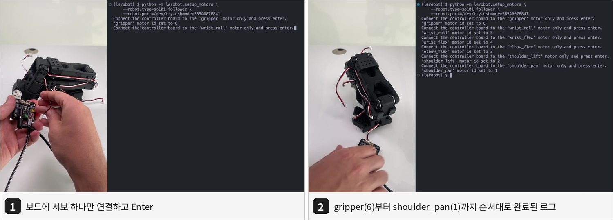

스크립트가 요구하는 순서는 6번부터 역순이다. 각 단계에서 해당 서보만 보드에 단독 연결(다른 서보와 데이지체인 금지)한 뒤 Enter.

1. `gripper` (F6)
2. `wrist_roll` (F5)
3. `wrist_flex` (F4)
4. `elbow_flex` (F3)
5. `shoulder_lift` (F2)
6. `shoulder_pan` (F1)

각 단계마다 `'gripper' motor id set to 6` 같은 메시지로 확인된다. 케이블을 옮길 때 보드 쪽 커넥터만 뽑고 서보 쪽은 꽂아두면 조립 시 배선이 된다.

### 4.3 Leader

보드에 5V 전원을 연결하고 같은 순서로 진행한다.

```bash
lerobot-setup-motors \
    --teleop.type=so101_leader \
    --teleop.port=$LEADER_PORT
```

### 4.4 트러블슈팅

| 증상 | 확인 사항 |
|---|---|
| `Motor 'gripper' was not found` | DC 전원, USB, 3핀 케이블 체결. 전압이 서보와 맞는지 |
| 서보 LED 가 안 켜짐 | 전원 미공급, 또는 앞 서보의 케이블 헐거움 |
| 응답 없음 | Waveshare 보드 점퍼 2개가 `B` 채널인지 |
| 다른 로봇에서 쓰던 서보 재사용 | ID/baudrate 가 다르므로 이 단계를 반드시 다시 수행 |

---

## 5. 조립

### 5.1 공통 원칙

- 프린트 파트의 서포트를 먼저 전부 제거한다 (작은 일자 드라이버로 밑을 들어 올리면 쉽다). 수평축 나사 구멍에 서포트 잔여물이 있으면 나사가 안 들어간다.
- 서보를 장착할 때마다 3핀 케이블을 한 개 꽂아둔다. 조립을 마친 뒤 파트 사이 틈으로 케이블을 통과시키는 것은 매우 어렵다. 배선은 조립과 동시에 진행한다.
- 나사 규격
  - `M2x6` (가장 작은 나사): 서보 본체를 프린트 파트에 고정
  - `M3x6`: 서보 혼(horn) 고정, 프린트 파트끼리 결합
- 서보 혼: 축 위쪽 혼은 `M3x6` 1개로 고정, 반대편(아래) 혼은 나사 없이 끼운다. Joint 5(`wrist_roll`)만 혼 1개.
- 조립 중 서보 축을 여러 바퀴 돌리지 않는다. STS3215 는 회전 수를 누적하며, §6.4 의 `Magnitude exceeds 2047` 오류의 원인이 된다.
- Leader 와 Follower 는 Joint 1-5 까지 동일하고, 엔드이펙터(그리퍼 vs 핸들+트리거)와 서보 모델만 다르다. 아래 그림은 CAD 애니메이션 기준이라 서보가 검정색 한 종류로 보이지만, 실제로는 라벨(F/L + 번호)을 보고 넣는다.

| Mount Helper 지그 (`Optional/Mount_Helper`) | Raised Base (`Optional/Raised_Base`) |
|---|---|
| 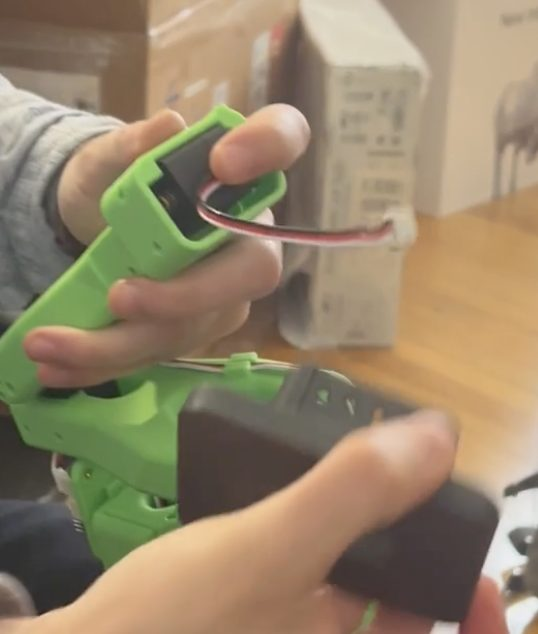 | 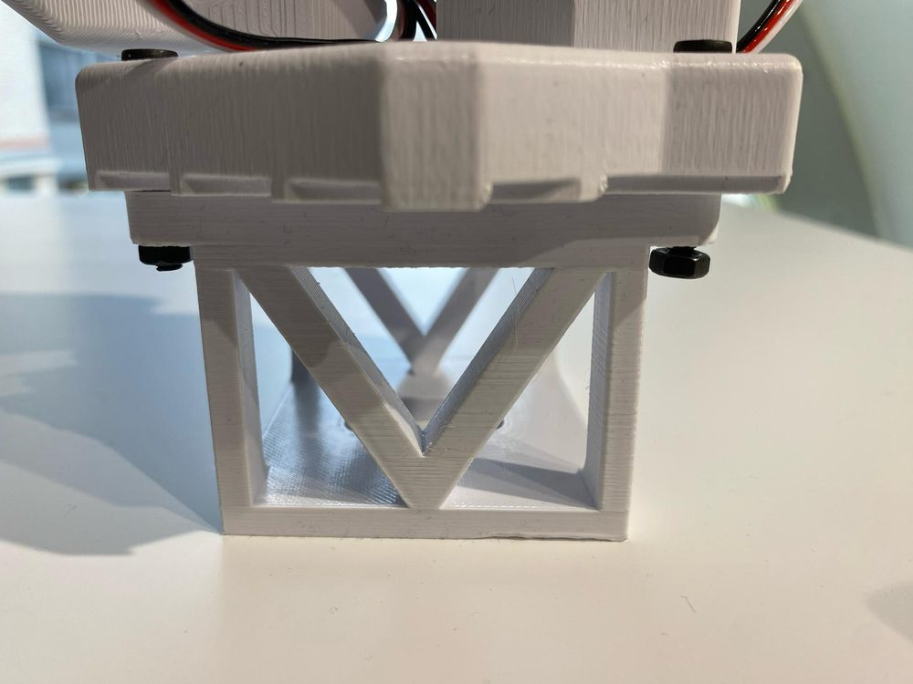 |
| 혼과 파트의 구멍을 맞출 때 쓰는 정렬 지그 | Leader 를 높여 조작을 편하게 하는 베이스 연장 |

### 5.2 Joint 1: `shoulder_pan` (ID 1)

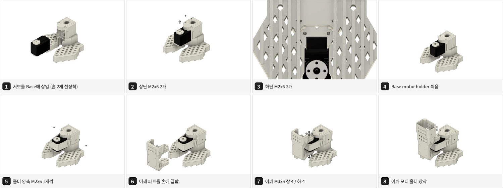

1. 서보에 혼 2개 장착, 위쪽 혼 `M3x6`.
2. 서보를 `Base_SO101` 에 삽입, `M2x6` 4개 (위 2, 아래 2).
3. `Base_motor_holder` 를 씌우고 양측 `M2x6` 1개씩.
4. `Rotation_Pitch`(어깨) 파트를 혼에 결합, 위 `M3x6` 4개 + 아래 `M3x6` 4개.
5. `Motor_holder_SO101_Base`(어깨 모터 홀더) 장착.

### 5.3 Joint 2: `shoulder_lift` (ID 2)

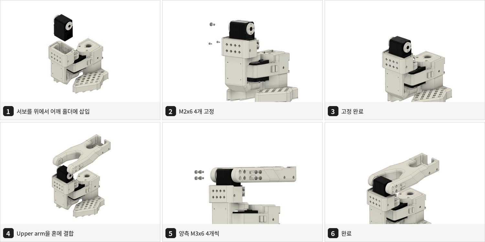

1. 혼 2개 장착, 위쪽 `M3x6`.
2. 서보를 위에서 어깨 홀더에 삽입, `M2x6` 4개.
3. `Upper_arm` 을 혼에 결합, 양측 `M3x6` 4개씩.

### 5.4 Joint 3: `elbow_flex` (ID 3)

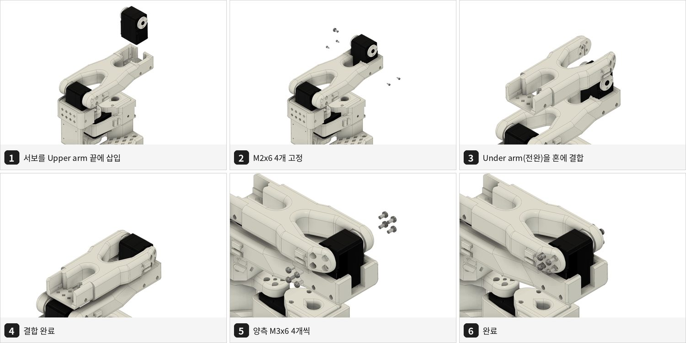

1. 혼 2개 장착, 위쪽 `M3x6`.
2. 서보를 Upper arm 끝에 삽입, `M2x6` 4개.
3. `Under_arm`(전완)을 혼에 결합, 양측 `M3x6` 4개씩.
4. SO-101 에서 추가된 케이블 클립을 이 구간에 사용한다. SO-100 에서 Joint 3 케이블 단선이 잦았던 부위다.

### 5.5 Joint 4: `wrist_flex` (ID 4)

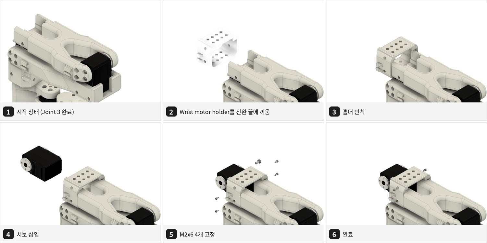

1. 혼 2개 장착, 위쪽 `M3x6`.
2. `Motor_holder_SO101_Wrist` 를 전완 끝에 끼운다.
3. 서보를 홀더에 삽입, `M2x6` 4개.

### 5.6 Joint 5: `wrist_roll` (ID 5)

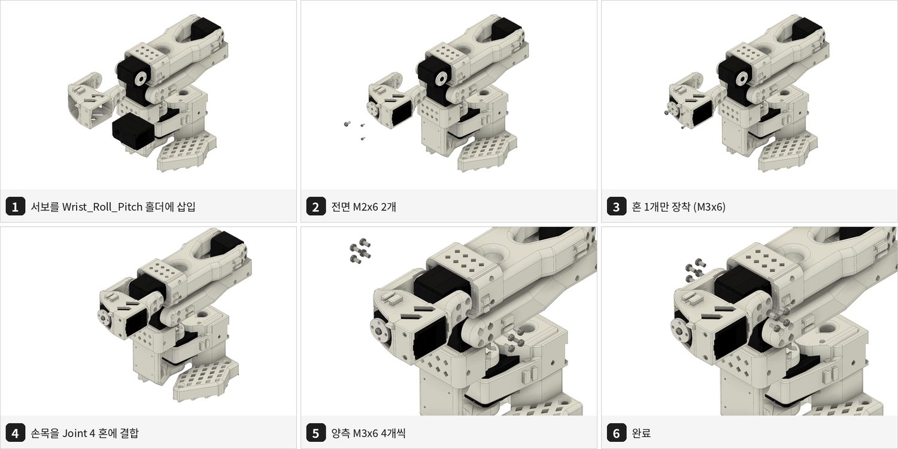

1. 서보를 `Wrist_Roll_Pitch` 홀더에 넣고 전면 `M2x6` 2개.
2. 혼은 1개만, `M3x6`.
3. 손목 어셈블리를 Joint 4 혼에 결합, 양측 `M3x6` 4개씩.

### 5.7 엔드이펙터

Follower (그리퍼)

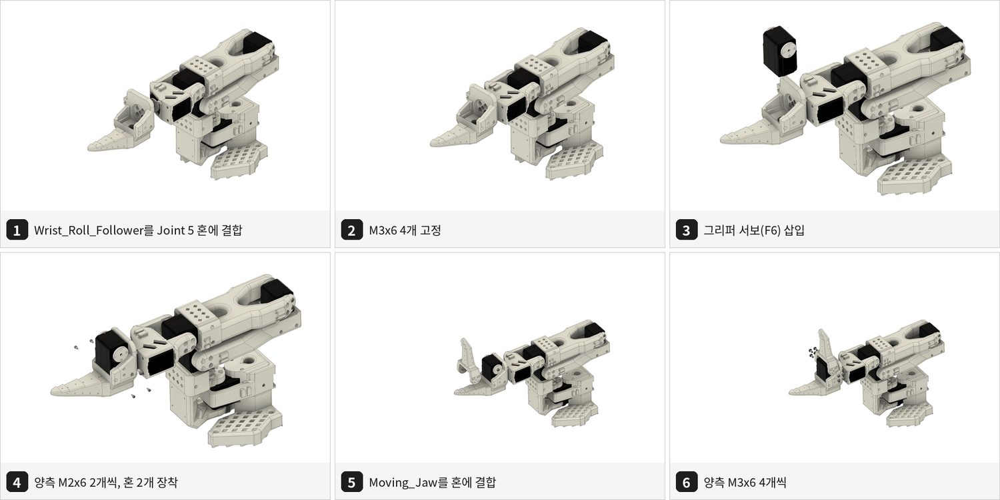

1. `Wrist_Roll_Follower` 를 Joint 5 혼에 `M3x6` 4개로 결합.
2. 그리퍼 서보(F6)를 삽입, 양측 `M2x6` 2개씩.
3. 혼 2개 장착, 위쪽 `M3x6`.
4. `Moving_Jaw` 를 혼에 결합, 양측 `M3x6` 4개씩.

Leader (핸들 + 트리거)

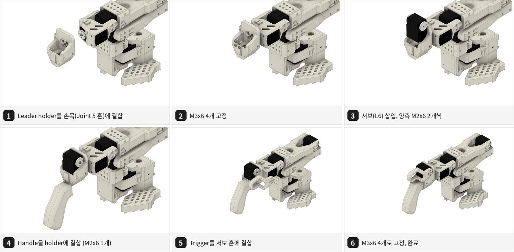

1. Leader holder(`Wrist_Roll_SO101`)를 Joint 5 혼에 `M3x6` 4개로 결합.
2. 트리거 서보(L6)를 삽입, 양측 `M2x6` 2개씩, 혼 1개를 `M3x6` 로 고정.
3. `Handle_SO101` 을 holder 에 `M2x6` 1개로 결합.
4. `Trigger_SO101` 을 혼에 `M3x6` 4개로 결합. 트리거가 L6 축을 돌려 그리퍼 개폐 입력이 된다.

### 5.8 배선과 마감

- 6 → 5 → 4 → 3 → 2 → 1 순으로 데이지체인, ID 1 서보의 케이블이 보드로 간다 (§2.3 도식).
- 보드는 `WaveShare_Mounting_Plate` 로 베이스에 고정한다.
- 관절이 전 범위를 움직여도 케이블이 당겨지지 않는지 손으로 돌려 확인한다. 전원을 넣기 전이라 서보에 부하가 없다.
- 클램프로 책상에 고정한다.
- 소요 시간 참고치: Follower 약 2시간, Leader 약 1.5시간 (경험담 기준, 배선 병행 시).

---

## 6. 캘리브레이션

Leader 와 Follower 가 같은 물리 자세에서 같은 값을 갖도록 맞추는 단계다. 다른 SO-101 에서 학습한 정책을 옮겨 쓸 수 있는 근거이기도 하다.

### 6.1 Follower

포트 환경변수는 §4.1 에서 잡아둔 값을 쓴다.

```bash
lerobot-calibrate \
    --robot.type=so101_follower \
    --robot.port=$FOLLOWER_PORT \
    --robot.id=so101_follower_01
```

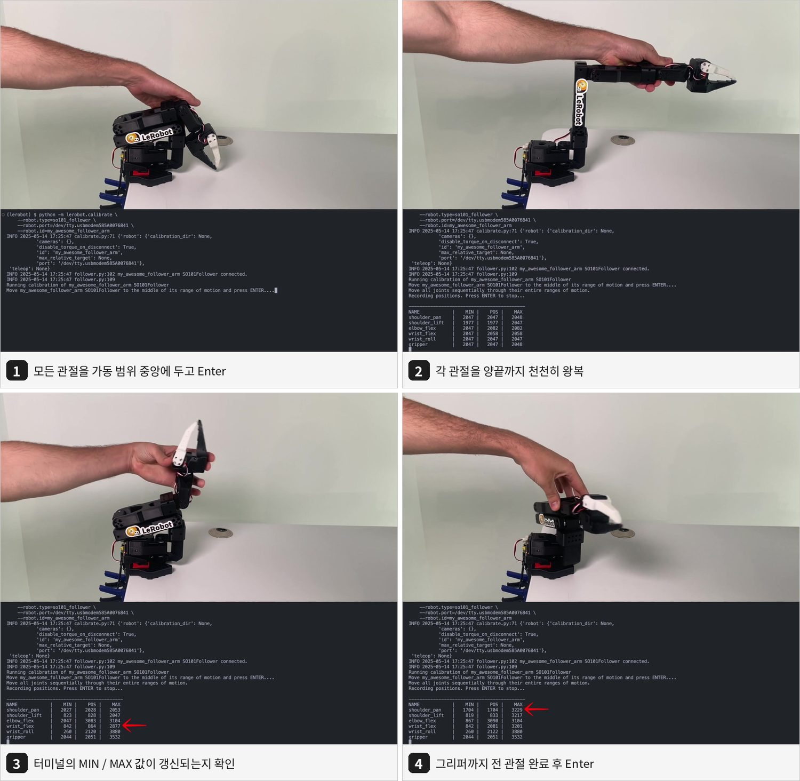

1. **팔을 들어 올려** 모든 관절을 각자 가동 범위의 가운데에 둔 채 → Enter (아래 "가운데 자세").
2. 각 관절을 양끝까지 천천히 왕복시킨다. 터미널의 `MIN` / `MAX` 열이 관절마다 갱신되는지 보면서 진행한다. 그리퍼까지 전 관절을 마친 뒤 → Enter.
3. 캘리브 직후 판정 (§6.2 끝) 을 통과하는지 확인한다.

**가운데 자세**

용어: 1번 단계가 **호밍**(homing)이다. Enter 를 누른 순간의 자세를 각 서보의 기준값 (raw 2047 — 한 바퀴 0-4095 의 한가운데) 으로 삼는다. 그래서 이 순간의 자세가 캘리브 전체를 좌우한다.

| 관절 | 가운데 자세 |
|---|---|
| `shoulder_pan` | 정면 |
| `shoulder_lift` | 상완이 거의 수직 (완전히 뒤로 젖힌 위치와 앞으로 숙인 위치의 중간) |
| `elbow_flex` | 전완이 상완과 약 90도 (완전히 접힌 위치와 편 위치의 중간) |
| `wrist_flex` | 그리퍼가 전완과 일직선 |
| `wrist_roll` | 중앙 |
| `gripper` | 반쯤 열림 |

- 팔이 공중에 떠 있는 자세다. 한 손으로 팔을 받친 채 다른 손으로 Enter 를 누른다. **책상에 내려놓은 휴식 자세에서 누르면 안 된다** — 휴식 자세는 `shoulder_lift` · `elbow_flex` 가 가동 범위의 끝에 붙은 자세다.
- 정확할 필요는 없다. 각 관절이 양 끝에서 30도 이상만 떨어져 있으면 된다.
- 이유: 서보는 한 바퀴를 0-4095 로 세고, 4095 다음은 0 으로 돌아간다. 가운데에서 호밍하면 양 끝이 기준값에서 약 100도씩 떨어져 이 경계 (기준값에서 180도) 에 닿지 않는다. 끝에서 호밍하면 반대쪽 끝이 약 200도 떨어져 경계를 넘고, 그 너머에서는 읽히는 각도가 360도 튄다. 그 상태로 텔레옵 · 녹화를 하면 리더가 그 지점을 지날 때 팔로워가 가동 범위를 가로질러 반대로 돌 수 있다.

### 6.2 Leader

```bash
lerobot-calibrate \
    --teleop.type=so101_leader \
    --teleop.port=$LEADER_PORT \
    --teleop.id=so101_leader_01
```

절차와 가운데 자세는 §6.1 과 같다.

**캘리브 직후 판정 (두 팔 모두)**

호밍 자세가 맞았는지는 json 에 기록된 가동 범위의 폭으로 바로 알 수 있다. 캘리브를 마칠 때마다 확인한다.

```bash
python -c "
import json, os
base = os.environ['HF_LEROBOT_CALIBRATION']
for p in ['robots/so_follower/so101_follower_01', 'teleoperators/so_leader/so101_leader_01']:
    for n, c in json.load(open(f'{base}/{p}.json')).items():
        print(p.split('/')[-1], n.ljust(14), c['range_min'], c['range_max'], round((c['range_max'] - c['range_min']) * 360 / 4095), 'deg')
"
```

| 관절 | 정상 | 잘못된 호밍 (휴식 자세에서 Enter) |
|---|---|---|
| `shoulder_lift` · `elbow_flex` | 폭 185-210도, `range_min` 이 0 에서 멀다 (이 키트 실측: 팔로워 847-3226 · 719-3058) | 폭 약 358-360도, `range_min` 이 0 근처이고 `range_max` 가 4095 근처 |
| `wrist_roll` | 0-4095 (360도) — lerobot 이 측정 없이 써 넣는 값 | 같음 (판정에 쓰지 않는다) |
| 나머지 | 폭이 기계적 가동 범위와 비슷 (`shoulder_pan` · `wrist_flex` 약 200도, `gripper` 약 110-135도) | — |

이 두 관절은 기구적으로 한 바퀴를 돌 수 없다. 폭이 360도에 가깝게 찍혔다면 실제로 그만큼 움직인 것이 아니라 범위 기록 중에 값이 4095 → 0 경계를 넘었다는 흔적이다. 잘못된 호밍으로 나오면 그 팔을 다시 캘리브한다 (§6.3 의 재캘리브).

### 6.3 캘리브레이션 파일

- 기본 저장 위치: `~/.cache/huggingface/lerobot/calibration/` 하위 `robots/so_follower/<id>.json`, `teleoperators/so_leader/<id>.json`. 디렉터리명은 `--robot.type` 의 `so101_follower` 가 아니라 클래스명 기준 `so_follower` 다.
- 기본 위치를 쓰지 않고 사용자 관리 디렉터리에 둔다. `~/.cache` 는 규약상 재생성 가능한 데이터 자리라 디스크 정리로 지워질 수 있는데, 캘리브레이션은 재생성에 물리 작업이 들고, 데이터셋 수집 후 값이 바뀌면 기존 데이터와 관절 매핑이 어긋나는 보존 대상이다.
- 위치 변경은 `HF_LEROBOT_CALIBRATION` 환경변수로 한다. calibrate / teleoperate / record / rollout 등 모든 명령에 일괄 적용되고, 내부 디렉터리 구조는 그대로 유지된다.

이 레포의 환경 (도커 컨테이너) 에서의 값:

| 항목 | 값 |
|---|---|
| 호스트의 실제 위치 | `~/Documents/so-arm101/calibration` |
| 컨테이너 안 경로 | `/root/so-arm101/calibration` — 위 디렉터리의 bind mount |
| 환경변수 | `HF_LEROBOT_CALIBRATION=/root/so-arm101/calibration` — 호스트 compose 가 컨테이너 환경변수로 넣는다 |
| 파일 | `robots/so_follower/so101_follower_01.json`, `teleoperators/so_leader/so101_leader_01.json` |

- 용어: **bind mount** 는 호스트의 디렉터리를 컨테이너 안 경로에 그대로 연결하는 것이다. 복사본이 아니라 같은 파일이라, 컨테이너에서 캘리브하면 그 순간 호스트 파일이 바뀐다. 따로 옮기거나 동기화할 것이 없고, 컨테이너를 재생성해도 남는다.
- 환경변수는 compose 가 넣으므로 컨테이너 안 `~/.bashrc` 에 적지 않는다 (이미지가 만든 파일이라 재생성 시 수정이 사라진다). 새 터미널에서는 `echo $HF_LEROBOT_CALIBRATION` 으로 값이 찍히는지만 확인한다.
- 환경변수가 없는 세션은 에러 없이 기본 경로로 돌아가 파일이 두 벌로 갈라질 수 있다. 증상은 "캘리브 파일이 있는데도 새 캘리브레이션을 요구한다" 이다. 이때는 새로 캘리브하지 말고 환경변수부터 확인한다.
- 명령별 `--robot.calibration_dir` / `--teleop.calibration_dir` 옵션도 있으나(이때는 하위 구조 없이 그 디렉터리에 `<id>.json` 이 바로 놓인다), 매 명령 지정이라 빠뜨리면 일관성이 깨지므로 환경변수 방식을 쓴다.
- `id` 는 이후 teleoperate / record / replay / rollout 에서 동일하게 써야 한다.
- 캘리브 값은 json 과 **서보의 EEPROM 양쪽**에 저장된다. lerobot 은 팔에 연결할 때마다 두 곳의 값 (`homing_offset`, `range_min`, `range_max`) 을 비교하고, 다르면 캘리브 프롬프트를 띄운다.

**재캘리브** (부품 교체 · 재조립 · §6.2 판정에서 잘못된 호밍으로 나온 경우)

```bash
# 덮어쓰기 전에 백업. bind mount 된 디렉터리 안에 둬야 컨테이너를 재생성해도 남는다
mkdir -p $HF_LEROBOT_CALIBRATION/backup-$(date +%m%d)
cp -r $HF_LEROBOT_CALIBRATION/robots $HF_LEROBOT_CALIBRATION/teleoperators $HF_LEROBOT_CALIBRATION/backup-$(date +%m%d)/
# 이후 §6.1 / §6.2 의 lerobot-calibrate 명령을 그대로 실행
```

- 기존 json 이 있으면 첫 프롬프트가 "ENTER = 기존 파일 사용, `c` = 새 캘리브레이션" 이다. **`c` 를 입력한다.** ENTER 는 기존 파일의 값을 서보에 다시 쓸 뿐이라, 재조립 후라면 틀린 값이 들어간다. json 을 지울 필요는 없다.
- 재캘리브하면 각도의 0 기준이 바뀐다. 그 전에 녹화한 데이터셋은 관절값이 새 기준과 어긋나므로, 데이터 수집을 시작한 뒤에는 캘리브를 바꾸지 않는다. 바꿔야 하면 데이터셋을 다시 찍는다.
- 재캘리브 후에는 §6.2 의 판정과 §7 텔레옵 검증을 다시 한다.

### 6.4 `Magnitude NNNN exceeds 2047` 오류

원인: 서보 `Present_Position` 이 0-4095 범위를 벗어난 multi-turn 값(예: 33644)을 갖고 있다. 조립 중 축을 여러 바퀴 돌린 경우 발생한다.

조치 순서

1. USB 와 DC 전원을 모두 뽑고 5초 대기 후 재연결, 재시도. USB 만 뽑으면 미세 전류로 리셋이 안 될 수 있다.
2. 그래도 실패하면 해당 서보의 `Homing_Offset`(register 33)을 0 으로 쓰고 전원을 완전히 재인가한다.

```python
from scservo_sdk import PortHandler, PacketHandler

port = PortHandler("/dev/ttyACM1")  # 오류가 난 팔의 포트
port.openPort()
port.setBaudRate(1000000)
ph = PacketHandler(0)

motor_id = 3  # 오류가 난 관절의 ID
pos, _, _ = ph.read2ByteTxRx(port, motor_id, 56)  # Present_Position
print(pos)  # 정상 범위: 0-4095, 중앙 약 2048

ph.write2ByteTxRx(port, motor_id, 33, 0)  # Homing_Offset reset
port.closePort()
```

3. 대안: Seeed `Seeed_RoboController` 리포지토리의 `servo_middle_calibration.py` 로 현재 위치를 2048 로 기록한 뒤 `lerobot-calibrate` 를 다시 수행.

---

## 7. 텔레옵 검증

포트 환경변수와 id 는 캘리브레이션 때와 같다.

```bash
lerobot-teleoperate \
    --robot.type=so101_follower \
    --robot.port=$FOLLOWER_PORT \
    --robot.id=so101_follower_01 \
    --teleop.type=so101_leader \
    --teleop.port=$LEADER_PORT \
    --teleop.id=so101_leader_01
```

- 포트를 `/dev/ttyACM*` 번호로 지정하는 경우, 보드 2개를 동시에 꽂으면 단독으로 꽂았을 때와 번호가 바뀔 수 있으므로 실행 직전 `lerobot-find-port` 로 재확인한다. §4.1 의 `/dev/serial/by-id/` 고정 경로를 쓰면 이 확인이 필요 없다.
- 검증 항목
  - 6개 관절 모두 leader 와 같은 방향으로 움직이는지
  - 그리퍼 개폐가 트리거를 따라가는지
  - 눈에 띄는 지연·떨림이 없는지 (정상 상태에서 약 60 Hz 루프)
  - Leader 를 놓았을 때 자중으로 처지지 않는지 (처지면 서보 모델 배치 재확인)
- 비상 정지: USB 를 뽑으면 통신이 끊기고 follower 가 현재 위치에서 멈춘다. DC 를 뽑으면 토크가 풀려 팔이 떨어지므로 손으로 받친다.

동작이 확인되면 카메라 추가(`so101-attach` 가 만드는 고정 경로 `/dev/so101_cam_*`, `fourcc: MJPG` — `spike/week2/week2_guide.md` §1) 후 `lerobot-record` 로 넘어간다.

---

## 8. 체크리스트 (재조립·부품 교체 시 재사용)

진행 상태는 여기 두지 않는다 — 스파이크 진행은 [master roadmap](../../../../docs/superpowers/plans/2026-08-31-master-roadmap.md) §3 과 [RESULT.md](../week2/RESULT.md) §2 에서 추적한다.

조립 전

- 서보 12개 모델 스티커 확인, `F1`-`F6` / `L1`-`L6` 라벨링
- 어댑터 전압 확인 및 라벨링 (Leader 는 항상 5V)
- USB-C 케이블이 데이터 케이블인지 확인
- Waveshare 보드 점퍼 `B` 채널
- Python 3.12 이상 환경에 `lerobot[core_scripts,feetech]` 설치, `lerobot-find-port` 실행 확인
- 12개 서보 ID 설정 완료 (`lerobot-setup-motors` follower / leader)

조립 중

- 서포트 제거, 수평축 나사 구멍 관통 확인
- 서보 장착마다 3핀 케이블 선장착
- Leader 서보 모델이 관절별로 맞는지 (공식 혼합: 1·3 = C044, 2 = C001, 4·5·6 = C046. 이 키트는 §0 표 참조)
- 서보 축을 과회전시키지 않음
- 무전원 상태에서 전 관절 가동 시 케이블 당김 없음

조립 후

- Follower / Leader 캘리브레이션 완료, json 파일 생성 + 가동 범위 폭 판정 통과 (§6.2)
- 텔레옵에서 6관절 + 그리퍼 정상 추종
- Leader 자중 처짐 없음

---

## 9. 함정 요약

| 증상 | 원인 | 조치 |
|---|---|---|
| 서보 소손, 타는 냄새 | 7.4V 서보에 12V 인가 | 어댑터 라벨링. 소손된 서보는 교체 |
| `lerobot-setup-motors` TypeError (`str \| None is not callable`) | Python 3.14 + `draccus` 비호환 | Python 3.12 / 3.13 환경 재생성 |
| `Could not connect on port ...` / Permission denied (장치는 존재) | 시리얼 권한. `dialout` 등록 후에도 재로그인 전이면 `id` 출력에 그룹이 없어 실패한다 | 재로그인 또는 재부팅 (§3.1). 즉시 진행은 `newgrp dialout`, 임시로는 `sudo chmod 666 /dev/ttyACM*` |
| `Failed to sync read 'Present_Position'` | 전원 미인가 또는 데이지체인 케이블 헐거움 | LED 꺼진 서보의 앞단 케이블 확인 |
| `Magnitude NNNN exceeds 2047` | multi-turn 누적 | §6.4 |
| 텔레옵 시 특정 관절만 무겁거나 leader 가 처짐 | Leader 서보 기어비 배치 오류 | §2.2 표대로 재배치, 재캘리브레이션 |
| 텔레옵에서 포트 반대로 잡힘 | `/dev/ttyACM*` 번호가 동시 연결 시 변동 | §4.1 `/dev/serial/by-id/` 고정 경로 사용, 임시로는 실행 전 `lerobot-find-port` |
| 조립 후 배선 불가 | 파트 결합 후 틈이 좁음 | 조립과 배선 병행, 슬림 니들노즈 플라이어 |
| 캘리브 json 의 `shoulder_lift` · `elbow_flex` 폭이 약 360도 | 호밍을 가운데 자세가 아니라 휴식 자세에서 함 — 범위 기록 중 인코더 값이 4095 → 0 경계를 넘음. 그대로 쓰면 팔을 크게 편 지점에서 읽히는 각도가 360도 튄다 | §6.1 의 가운데 자세로 재캘리브 후 §6.2 판정 |
| 재조립 후 팔에 연결할 때마다 캘리브 프롬프트가 뜸 | 서보 EEPROM 의 값과 json 이 다름 | `lerobot-calibrate` 에서 `c` 로 새 캘리브레이션 (§6.3). ENTER 는 옛 값을 서보에 다시 쓴다 |

---

## 10. 부록: 직접 프린트하는 경우

- 재료 PLA+, 0.4 mm 노즐 / 0.2 mm 레이어 (또는 0.6 / 0.4), infill 15 %
- 서포트는 전체 적용하되 45도 이상 경사는 제외, 수평축 나사 구멍에는 서포트 금지
- 본 출력 전 `STL/Gauges/` 의 게이지(STS3215 용 `Gauge_0`, `Gauge_tight_1`)로 치수 정확도를 확인
- 베드 220 x 220 mm 는 `Ender_*_SO101.stl`, 205 x 250 mm 는 `Prusa_*_SO101.stl` 단일 파일 사용
- 프린터가 없으면 `3DPRINT.md` 의 출력 대행 목록 참고

---

## 11. 참고 자료

- TheRobotStudio SO-ARM100/101 리포지토리 (BOM, STL, 옵션 하드웨어): https://github.com/TheRobotStudio/SO-ARM100
- LeRobot 공식 SO-101 문서 (관절별 조립 영상 원본, 모터 설정·캘리브레이션 영상): https://huggingface.co/docs/lerobot/so101
- LeRobot 설치 가이드: https://huggingface.co/docs/lerobot/installation
- Seeed Studio wiki (Pro 키트 전압, Leader 조립 실물 사진 Step 1-20, FAQ): https://wiki.seeedstudio.com/lerobot_so100m_new/
- Feetech 서보 디버깅 툴 (Ubuntu): https://github.com/Kotakku/FT_SCServo_Debug_Qt
- 조립 경험담 (multi-turn 오류 진단 절차 포함): https://dev.classmethod.jp/en/articles/lerobot-so-arm101-assembly-teleop/
