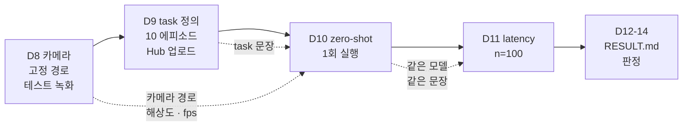

# 스파이크 Week 2 가이드 — 카메라 · 녹화 · SmolVLA zero-shot · latency (D8-D14)

> 스파이크 2주차 (2026-09-14 - 09-21) 의 실행 절차. Week 1 (조립 · 모터 ID · 캘리브레이션 · teleop) 은 [조립 가이드](../week1/so-arm101-assembly-guide.md) 가 담당하고, 이 문서는 그 마지막 줄 — "카메라 추가 후 `lerobot-record` 로 넘어간다" — 부터 판정 기록까지를 잇는다.
> 통과 기준 · 판정표의 원본: [실기 전환 plan](../../../../docs/superpowers/plans/2026-08-30-realworld-transition-execution.md) §5.2-§5.4 / 일 단위 체크: [master roadmap](../../../../docs/superpowers/plans/2026-08-31-master-roadmap.md) §3 + [RESULT.md](RESULT.md) §2
> 작성일: 2026-09-13
> 환경: 호스트 Ubuntu 22.04 + RTX 4070 12GB 위의 도커 컨테이너 (Ubuntu 24.04), venv `/workspace/venvs/lerobot` (Python 3.12, lerobot 0.6.2, extras `core_scripts,feetech,smolvla`)
> LeRobot 버전 주의: 명령어 · 옵션 이름은 버전에 따라 바뀐다. 이 문서의 명령은 2026 중반 공식 문서 기준 골격이고, **각 Day 의 첫 단계는 `--help` 로 옵션 이름 대조**다. 이름이 다르면 이 문서를 고친다.

## TL;DR

- **카메라는 고정 경로로 잡는다.** `/dev/video*` 번호는 재부팅 · 재연결로 바뀐다. `so101-attach` 가 USB 시리얼로 만드는 `/dev/so101_cam_overview` · `/dev/so101_cam_wrist` 를 쓴다 (서보 보드를 `/dev/so101_follower` 로 잡은 것과 같은 원리).
- **ELP Stereo 는 좌 · 우 영상이 한 프레임에 붙어 나온다.** 스파이크는 자르지 않고 그대로 쓴다. 크롭 여부는 v2.5 측정 설계에서 결정한다.
- **구도는 실시간 화면으로 보고, 다 봤으면 뷰어를 끈다.** 이 컨테이너는 화면이 없어 `scripts/live_view.py` 가 카메라를 브라우저로 보내 준다 (§1.2). 카메라는 한 번에 한 프로세스만 열 수 있어서, 뷰어를 켜 둔 채로는 녹화도 zero-shot 도 카메라 연결에서 실패한다.
- **본 녹화 전에 2 에피소드 테스트 녹화를 한다 (업로드 없이).** fps 가 설정보다 낮게 나오는 문제, 캘리브 경로가 다른 셸에서 갈라지는 문제는 10 에피소드를 다시 찍기 전에 잡는다.
- **에피소드 하나는 녹화 → 리셋 → 저장 세 구간이다.** 저장 (30초 에피소드에 약 17초) 중에는 아무것도 녹화되지 않는다. 음성 안내가 나오지 않는 환경이라, 터미널에 `Recording episode N` 이 찍힌 것을 보고 시범을 시작한다 (§2.2).
- **zero-shot 실행은 `lerobot-rollout` 이다.** lerobot 0.6.2 의 `lerobot-record` 는 리더 시범을 녹화하는 전용 도구이고, 정책으로 팔을 움직이는 일은 `lerobot-rollout` 이 맡는다. 카메라 이름은 데이터셋용이 아니라 모델 config 의 `input_features` 키에 맞춘다. `--robot.max_relative_target` 으로 한 틱 이동량을 제한한 뒤 돌린다. 예상 동작은 과제 수행이 아니라 **팔이 휴식 자세에서 일어나 가운데 자세로 모이는 것**이다 (§3.5).
- **latency 는 "chunk 1개 생성 시간" 으로 정의한다.** SmolVLA 는 한 번 모델을 돌려 action 을 여러 개 만들어 큐에 쌓으므로, 큐를 비우지 않고 100번 호출하면 대부분 0 ms 근처가 찍힌다. `scripts/measure_latency_smolvla.py` 가 매 반복 큐를 비운다.
- **판정은 09-21 에 한 번만.** RESULT.md §1 의 4칸을 채우고 plan §5.4 표의 한 행을 §5 에 적는다.

---

## 0. 시작 전 준비

### 0.1 Week 1 에서 이어받는 것

| 항목 | 값 | 어디서 정했나 |
|---|---|---|
| Python 환경 | venv `/workspace/venvs/lerobot` (lerobot 0.6.2, alias `acl`) | 컨테이너 Dockerfile |
| 포트 환경변수 | `$FOLLOWER_PORT`, `$LEADER_PORT` (`so101-attach` 가 USB 시리얼로 만드는 `/dev/so101_follower`, `/dev/so101_leader`) | 컨테이너 Dockerfile · `so101-help` |
| 팔 id | `so101_follower_01`, `so101_leader_01` | 조립 가이드 §6.1-§6.2 |
| 캘리브 파일 | `$HF_LEROBOT_CALIBRATION` 아래 `robots/so_follower/*.json`, `teleoperators/so_leader/*.json` | 조립 가이드 §6.3 |
| 캘리브 상태 | 두 팔 모두 가운데 자세에서 호밍, `shoulder_lift` · `elbow_flex` 의 가동 범위 폭이 185-210도 | 조립 가이드 §6.1-§6.2 (판정 명령 포함) |
| teleop 동작 | 6관절 + 그리퍼 추종 (must 1). 캘리브를 다시 하면 D9 전에 다시 확인한다 (§2.1) | 조립 가이드 §7 |

### 0.2 Week 2 공통 준비

용어: **HF Hub**(Hugging Face Hub)는 데이터셋 · 모델 저장소. `lerobot-record` 가 녹화 결과를 여기로 올리고, `lerobot/smolvla_base` 도 여기서 받는다. 업로드에는 **write 권한 토큰**이 필요한데, 호스트 compose 의 `.env` (`HF_WRITE_TOKEN`) 가 컨테이너 환경변수 `HF_TOKEN` 으로 넣어 주므로 컨테이너 안에서 로그인하지 않는다.

아래 블록이 **세션 점검**이다. 새 터미널을 열 때마다, 그리고 D9 · D10 을 시작하기 직전에 돌린다. 팔을 10분 넘게 움직이는 작업이 중간에 멈추는 원인의 대부분은 여기서 30초면 잡힌다.

```bash
so101-attach         # 팔 · 카메라 USB 를 꽂은 뒤, 그리고 컨테이너 재시작 뒤 매번. /dev/so101_* 노드 생성
acl                  # venv 활성화 (/workspace/venvs/lerobot)
ls -la /dev/so101_*  # 노드 4개: so101_follower, so101_leader, so101_cam_overview, so101_cam_wrist
pgrep -af "lerobot-|live_view" || echo "실행 중인 lerobot / 뷰어 없음"   # 포트 · 카메라를 잡고 있는 프로세스가 없어야 한다
echo $FOLLOWER_PORT $LEADER_PORT $HF_LEROBOT_CALIBRATION   # 셋 다 값이 찍혀야 한다 (컨테이너 환경변수. 빈 값이면 컨테이너 설정 확인)
ls $HF_LEROBOT_CALIBRATION/robots/so_follower/ $HF_LEROBOT_CALIBRATION/teleoperators/so_leader/   # json 2개

hf auth whoami       # 환경변수 HF_TOKEN 으로 로그인된 아이디가 찍혀야 한다. `hf auth login` 은 하지 않는다 (환경변수가 파일 토큰보다 우선)
echo $HF_USER        # 컨테이너 환경변수 (호스트 .env 의 HF_USER). 아래 모든 repo_id 의 앞부분

export SPIKE_OUT=/workspace/study/physical-ai-study/Studies/Hardware-Arm/spike/week2/outputs   # 로그 · 측정 결과 (gitignore 대상). 세션마다 잡는다
mkdir -p $SPIKE_OUT
```

- `HF_LEROBOT_CALIBRATION` 이 빈 셸에서 `lerobot-record` 를 실행하면 에러 없이 기본 경로 (`~/.cache/huggingface/lerobot/calibration/`) 를 보고 "캘리브 파일 없음" 으로 새 캘리브레이션을 요구한다 (조립 가이드 §6.3). 새 터미널을 열 때마다 `echo` 로 확인한다.
- 포트 · 캘리브 경로 · `HF_TOKEN` · `HF_USER` 는 호스트 compose (`.env`) 가 컨테이너 환경변수로 넣는다. 컨테이너 안 `~/.bashrc` 는 이미지가 만든 것이라 재생성 시 수정이 사라지므로 거기에 적지 않는다. `SPIKE_OUT` 만 세션마다 export 한다.

D10 · D11 은 SmolVLA 를 실제로 GPU 에 올리므로 `smolvla` extra 가 추가로 필요하다. 용어: **extra** 는 pip 패키지의 선택 설치 묶음이다. lerobot 은 정책마다 필요한 라이브러리를 extra 로 나눠 두어서, Week 1 의 `core_scripts,feetech` (텔레옵 · 녹화 · 서보) 만으로는 SmolVLA 안의 시각-언어 모델 (SmolVLM2) 을 읽어 들이는 `transformers` 가 설치되지 않는다. venv 에 1회만 설치하면 된다 — venv 가 `/workspace` 마운트 위에 있어 컨테이너를 재생성해도 남는다.

```bash
pip install "lerobot[smolvla]"     # transformers · accelerate · num2words 추가. 설치된 lerobot 본체 (git 커밋 고정) 는 그대로 두고 빠진 의존성만 채운다
python -c "import transformers, accelerate, num2words; print(transformers.__version__)"   # 기대: 5.4.x 또는 5.5.x (lerobot 0.6.2 의 smolvla extra 가 요구하는 범위. 실측 5.5.4)
python -c "import torch; print(torch.__version__, torch.cuda.is_available())"             # 기대: 2.11.0+cu130 True -- pip 이 torch 를 CPU 판으로 바꾸지 않았는지 확인
```

### 0.3 Day 사이의 의존 관계



D11 은 팔 · 카메라 없이 GPU 만 쓴다. D10 이 밀리면 D11 을 먼저 해도 된다 (모델 로드가 되는지만 D10 §3.1 로 확인한 뒤).

### 0.4 이 문서가 다루지 않는 것

- 데이터 품질 · 성공률 · 부분 도달률의 통계 — v2.5 (`../../v25/README.md`)
- ROS2 층, 이중 latency — Stage 1 (`../../stage1/ros2_driver_setup.md` §5)

---

## 1. D8 — 카메라 세팅 + 테스트 녹화

**무엇을**: ELP 를 고정하고, LeRobot 이 그 카메라를 원하는 해상도 · fps 로 여는지 확인한 뒤, 2 에피소드짜리 테스트 녹화를 한다 (Hub 업로드 없음).
**왜**: D9 본 녹화에서 카메라 문제를 처음 만나면 10 에피소드를 다시 찍게 된다. 카메라 번호가 바뀌는 문제, fps 가 설정보다 낮게 나오는 문제는 본 녹화 전에 끝내야 한다.
**끝나면 손에 남는 것**: 카메라 고정 경로 1개 (`$FRONT_CAM`), `--robot.cameras` 설정 문자열 1개 (`$CAMS`), 로컬 테스트 데이터셋 1개, 수령 확인 ③ 의 답.

### 1.1 명령 확인

```bash
lerobot-find-cameras --help
lerobot-record --help | grep -i -A2 "cameras"
# OpenCV 카메라 설정에 어떤 키가 있는지 (fourcc 같은 픽셀 포맷 옵션 유무를 여기서 본다)
python -c "import dataclasses; from lerobot.cameras.opencv import OpenCVCameraConfig; print([f.name for f in dataclasses.fields(OpenCVCameraConfig)])"
```

### 1.2 물리 장착과 구도 (수령 확인 ③)

- 수령 확인 ③ 의 결과: ELP 는 키트 기본 정면 거치 모듈에 붙지 않는다 (RESULT.md §4 #5). 현재 ELP 는 팔로워 **왼쪽 측면** 에 임시 고정, 손목 카메라는 그리퍼에 장착 — 스파이크는 "안 예뻐도 된다" (plan §5.1).
- 측면 시점은 문제가 아니다. 팔이 앞으로 뻗는 동작이 화면을 가로지르는 이동으로 보여 정면보다 잘 잡힌다. 대신 좌우 이동은 깊이로 바뀌어 약해지므로 큐브 → 트레이 동선을 주로 앞뒤 방향으로 잡는다.
- 구도 확인 (D9 전에 teleop 으로): ① 최대 신장 · 최좌 · 최우 · 최고 높이에서 팔이 화면 밖으로 잘리지 않는가 ② 큐브 위치와 트레이 위치에서 집는 순간 그리퍼 끝이 전완에 가려지지 않는가 ③ 큐브와 트레이가 둘 다 보이고 크기로 구분되는가. 안 되면 카메라를 조금 높여 30-45도 내려다보게 한다.
- 구도가 확정되면 D9 본 녹화부터 D10 이 끝날 때까지 카메라를 움직이지 않는다. 데이터셋 (D9) 과 zero-shot (D10) 이 같은 시점을 봐야 한다.
- USB 허브: ELP 는 USB 2.0 허브 뒤에 있지만 손목 카메라와 동시 스트리밍에서 60 / 30 fps 가 그대로 나온다 (실측). fps 가 실측으로 미달할 때만 직결을 시도한다.

**실시간 화면으로 구도 보기**

이 컨테이너는 화면 (DISPLAY) 이 없고 `ffplay` 같은 뷰어도 없다. 그래서 `scripts/live_view.py` 가 카메라 영상을 MJPEG 로 내보내고, VS Code 의 포트 포워딩을 거쳐 브라우저로 본다. 용어 — **포트 포워딩**은 컨테이너 안의 주소를 내 PC 의 브라우저에서 열 수 있게 이어 주는 VS Code 기능이다.

```bash
python Studies/Hardware-Arm/spike/week2/scripts/live_view.py          # 전체 뷰 ELP (1280x480, §1.4 와 같은 설정)
python Studies/Hardware-Arm/spike/week2/scripts/live_view.py wrist    # 손목 카메라 (1280x720)
```

1. VS Code 하단 패널의 **PORTS** 탭 → **Forward a Port** → `18080`.
2. 브라우저에서 `http://localhost:18080`. VS Code 안에서 보려면 명령 팔레트 (`Ctrl+Shift+P`) → **Simple Browser: Show** → 같은 주소. 터미널과 영상을 나란히 둘 수 있다.
3. 끝낼 때는 터미널에서 `Ctrl+C`. `카메라 반환` 이 찍히면 끝이다.

- **뷰어를 켜 둔 동안에는 lerobot 이 그 카메라를 열지 못한다.** 카메라 장치는 한 번에 한 프로세스만 스트리밍할 수 있다. `lerobot-record` · `lerobot-rollout` 전에 반드시 끈다. 카메라를 쓰지 않는 `so101-teleop` 은 뷰어와 동시에 켜도 된다 — 리더로 팔을 움직이면서 구도를 볼 때 쓴다.
- 서버는 `127.0.0.1` 에만 열린다. 집 안 영상이라 컨테이너 네트워크에는 열지 않고 VS Code 포워딩으로만 접근한다.
- 브라우저로 보내는 속도는 약 15 fps 다 (터널 대역폭을 아끼려는 값. 스크립트 상단의 `STREAM_FPS`). 로컬 PC 에서 `18080` 이 이미 쓰이고 있으면 스크립트의 `PORT` 한 줄을 바꾼다.
- ELP 는 좌 · 우 영상이 한 프레임에 붙어 나오는데 두 렌즈의 시야가 조금 다르다. **한쪽 절반에서만 팔이 잘리는 경우가 있으므로** 양쪽 절반을 다 본다.

**기준 프레임 남기기**

구도가 확정되면 뷰어를 끄고 한 장 저장한다. D9 · D10 직전에 실시간 화면과 이 그림을 비교해 카메라가 밀리지 않았는지 본다.

```bash
python -c "
import cv2
c = cv2.VideoCapture('/dev/so101_cam_overview', cv2.CAP_V4L2)          # 전체 뷰 ELP
c.set(cv2.CAP_PROP_FOURCC, cv2.VideoWriter_fourcc(*'MJPG')); c.set(3, 1280); c.set(4, 480)   # 녹화와 같은 설정 (3 = 가로, 4 = 세로)
[c.read() for _ in range(15)]                                          # 자동 노출이 자리 잡도록 몇 장 버린다
cv2.imwrite('$SPIKE_OUT/ref_overview.png', c.read()[1]); c.release()
"
ls -la $SPIKE_OUT/ref_overview.png
```

### 1.3 카메라 식별 — 고정 경로

용어: **UVC**(USB Video Class)는 드라이버 설치 없이 꽂으면 되는 USB 카메라 규격. 리눅스는 UVC 카메라 하나에 `/dev/videoN` 두 개를 만든다 (N 은 영상, N+1 은 메타데이터). 그래서 `ls /dev/video*` 의 개수가 카메라 수의 2배로 보이고, `lerobot-find-cameras` 는 영상 노드만 보여 준다.

컨테이너 /dev 는 tmpfs 라 호스트 udev 가 만드는 `/dev/v4l/by-id/` 가 없다. 대신 `so101-attach` 가 USB 시리얼로 카메라를 찾아 고정 이름의 노드를 만든다 (`so101-attach list` 로 보이는 카메라와 시리얼 확인).

```bash
so101-attach                    # 카메라를 다시 꽂았거나 컨테이너를 재시작했으면 재실행
ls -la /dev/so101_cam_*         # so101_cam_overview = ELP (캡처 노드), so101_cam_wrist = 손목 카메라
lerobot-find-cameras opencv     # 열리는 카메라 목록 + 기본 해상도/fps. /dev/videoN 이름으로 표시되지만 설정에는 위 고정 이름을 쓴다. 샘플 이미지를 ./outputs/captured_images/ 에 저장
```

```bash
export FRONT_CAM=/dev/so101_cam_overview
export WRIST_CAM=/dev/so101_cam_wrist
```

샘플 이미지 (`outputs/captured_images/`) 를 열어 본다. ELP Stereo 는 좌 · 우 영상이 한 프레임에 나란히 붙어 나온다 (Phase 6 week7 에서 확인한 1280x480). 스파이크는 이 프레임을 자르지 않고 그대로 쓴다 — 이유와 한계는 §6 표 마지막 행.

```bash
sudo apt install -y v4l-utils
v4l2-ctl -d $FRONT_CAM --list-formats-ext   # 픽셀 포맷 (MJPG / YUYV) 별로 지원하는 해상도 · fps 목록
```

용어: **YUYV** 는 무압축 전송. USB 2.0 에서 1280x480 은 15 fps 가 한계다. **MJPG** 는 카메라가 JPEG 로 압축해 보내는 모드로, 같은 해상도에서 높은 fps 가 나온다. 목록에 있는 fps 만 설정에 적는다.

| 카메라 | MJPG 해상도 | 지원 fps |
|---|---|---|
| ELP (`so101_cam_overview`) | 1280x480 (좌 · 우 결합) | 25, 60 (30 없음 — 30 을 적으면 `failed to set fps=30` 으로 중단) |
| ELP | 2560x720 | 25, 60 |
| 손목 (`so101_cam_wrist`) | 1280x720 | 30 |
| 손목 | 640x480 | 30 |

### 1.4 카메라 설정 문자열

```bash
export CAMS="{ front: {type: opencv, index_or_path: $FRONT_CAM, width: 1280, height: 480, fps: 60, fourcc: MJPG}, wrist: {type: opencv, index_or_path: $WRIST_CAM, width: 1280, height: 720, fps: 30, fourcc: MJPG} }"
```

- `front` / `wrist` 는 데이터셋의 이미지 키 이름 (`observation.images.front`, `observation.images.wrist`) 이 된다. D9 는 이 이름을 쓰고, D10 은 모델이 기대하는 이름으로 바꿔 쓴다 (§3.2).
- `width` / `height` / `fps` 는 §1.3 표에 있는 조합만 적는다. 없는 fps 를 적으면 lerobot 이 카메라 연결 단계에서 예외를 내고 멈춘다.
- `fourcc: MJPG` 는 lerobot 0.6.2 `OpenCVCameraConfig` 의 `fourcc` 필드다. 카메라 fps 와 데이터셋 fps (§1.5 의 `--dataset.fps=30`) 는 별개다 — record 루프는 매 틱 카메라의 최신 프레임을 가져오므로 ELP 를 60 으로 두면 30 fps 의 매 틱에 새 프레임이 들어간다.

### 1.5 테스트 녹화 (2 에피소드, 업로드 없음)

```bash
lerobot-record \
    --robot.type=so101_follower \
    --robot.port=$FOLLOWER_PORT \
    --robot.id=so101_follower_01 \
    --robot.cameras="$CAMS" \
    --teleop.type=so101_leader \
    --teleop.port=$LEADER_PORT \
    --teleop.id=so101_leader_01 \
    --display_data=false \
    --dataset.repo_id=$HF_USER/so101-spike-test \
    --dataset.num_episodes=2 \
    --dataset.fps=30 \
    --dataset.episode_time_s=20 \
    --dataset.reset_time_s=10 \
    --dataset.single_task="test" \
    --dataset.push_to_hub=false
```

- `--display_data=false`: 이 컨테이너는 헤드리스 (DISPLAY 없음) 라 Rerun 창을 못 띄운다. 녹화 전 구도는 §1.2 의 실시간 화면으로, 녹화된 영상은 mp4 로 확인한다. 실행 전에 실시간 뷰어가 꺼져 있어야 한다.
- 키 조작 (→ · ← · q) 은 VS Code 터미널처럼 TTY 인 셸에서만 듣는다. 비대화형 셸이면 타이머만으로 진행된다.
- 흐름: 카메라 · 팔 연결 → 에피소드 1 녹화 (20초) → 리셋 구간 (10초) → 에피소드 2 → 영상 인코딩. 녹화 중 키 조작은 §2.3.

확인:

```bash
DS=$(ls -d ~/.cache/huggingface/lerobot/$HF_USER/so101-spike-test* | tail -1)   # 기본 저장 위치. lerobot 0.6.2 는 repo_id 뒤에 _YYYYMMDD_HHMMSS 를 붙인다 (--dataset.no_stamp=true 로 끔)
python -c "import json; d=json.load(open('$DS/meta/info.json')); print(d['fps'], d['total_episodes'], d['total_frames'])"
# 기대: 30 2 약 1200 (= 30 fps x 20 s x 2, 화살표 키로 일찍 끝내지 않았을 때)
# 프레임 수가 크게 모자라면 카메라 fps 또는 녹화 루프가 못 따라간 것 -- §6
find $DS -name "*.mp4" | head -2       # 영상 파일. 하나를 열어 카메라 시점 · 밝기 · 팔 전체가 보이는지 확인
```

### 1.6 막힐 때

§6 표의 D8 행. 가장 흔한 순서: 카메라 번호 변동 (고정 경로로 해결) → fps 미달 (MJPG 또는 해상도 하향) → 캘리브 파일 못 찾음 (`HF_LEROBOT_CALIBRATION` 빈 셸).

---

## 2. D9 — task 정의 · 10 에피소드 · Hub 업로드

**무엇을**: 단일 task 를 지시문 · 물체 · 시작 자세 · 종료 조건까지 고정하고, 리더로 시범 10회를 녹화해 HF Hub private 데이터셋으로 올린다.
**왜**: must 2 의 증거는 repo id 하나지만, 이 10 에피소드는 v2.5 파인튜닝 데이터의 규약 원형이고, 에피소드당 소요 시간은 v2.5 N 역산의 입력이다 (`../../v25/README.md` §1).
**끝나면 손에 남는 것**: Hub private 데이터셋 repo id, 에피소드당 소요 시간 1개, task 정의 표.

순서: §2.1 에서 task · 작업 공간 · 카메라 구도를 고정한다 → §2.2 의 명령으로 녹화한다 (녹화 중에 터미널에서 보게 될 것도 거기 있다) → §2.3 의 키로 조작한다 → §2.4 로 확인하고 기록한다.

### 2.1 task 정의 · 작업 공간 · 카메라 구도 (녹화 전에 고정)

용어: **에피소드**는 시범 1회분의 기록, **시범**(demonstration)은 사람이 리더로 과제를 해 보이는 것이다. 에피소드마다 첫 장면이 제각각이면 학습 데이터로 쓸 수 없어서, 녹화 전에 아래를 전부 정해 둔다.

**시작 조건**

- §0.2 의 세션 점검을 통과했다.
- 캘리브가 조립 가이드 §6.2 의 판정을 통과한 상태다. **캘리브를 다시 했다면 D9 전에 teleop 부터 확인한다.** 녹화한 뒤에 캘리브를 바꾸면 그 데이터의 관절값 기준이 어긋난다 (조립 가이드 §6.3).
- teleop 확인을 증거로도 남기려면 `so101-teleop` 대신 녹화로 돌린다. 아래 §2.2 의 명령에서 `--dataset.repo_id=$HF_USER/so101-spike-teleop --dataset.num_episodes=1 --dataset.reset_time_s=0 --dataset.single_task="teleop check" --dataset.push_to_hub=false` 로 바꾸고 `no_stamp` · `private` 를 뺀다. 30초 동안 6개 관절을 하나씩 크게, 그리퍼 개폐, 팔을 끝까지 편 자세를 넣는다. 끝나면 추종 품질을 수치로 뽑는다:

```bash
DS=$(ls -d ~/.cache/huggingface/lerobot/$HF_USER/so101-spike-teleop* | tail -1)
python Studies/Hardware-Arm/spike/week2/scripts/analyze_teleop_tracking.py $DS
# 관절별 지연 · 추종 오차 (RMSE) · 편향 · 최대 1틱 변화. 최대 1틱 변화가 수백 도로 찍히면 값이 튄 것이다 (캘리브 문제)
```

  이 데이터셋에는 `action` (리더가 보낸 목표) 과 `observation.state` (팔로워의 실제 위치) 가 같이 기록된다. 그래서 영상에 리더가 나오지 않아도 "팔로워가 리더를 따라갔다" 를 수치로 보일 수 있다. 이 환경의 실측은 지연 100-170 ms, 지연을 맞춘 뒤의 RMSE 0.5-1.7도다 (RESULT.md §1 행 1). 이 녹화는 D9 의 리허설도 겸한다.

**task 정의**

| 항목 | 이 스파이크의 값 | 왜 고정하나 |
|---|---|---|
| 지시문 (`single_task`) | `Pick up the red cube and place it on the tray.` | 데이터셋 · zero-shot · latency 가 같은 문장을 쓴다. 영어 — `smolvla_base` 가 영어 지시문으로 학습됨 |
| 물체 | 3-4 cm 큐브 1개, 책상과 **밝기** 가 대비되는 것 | 전체 뷰 ELP 는 흑백 센서라 색상 대비는 손목 카메라에서만 보인다. 문장의 "red" 는 손목 카메라 기준 |
| 목표 | 종이 트레이 또는 테이프로 표시한 사각형 | 성공 여부를 눈으로 판정할 수 있게 |
| 팔 시작 자세 | 리더를 테이프로 표시한 자세에 두고 시작 | 에피소드마다 첫 프레임이 같아야 학습 데이터가 된다 |
| 물체 시작 위치 | 테이프로 표시한 칸 1-3개 중 하나. 에피소드별로 어느 칸인지 메모 | v2.5 배치 마커의 축소판 |
| 에피소드 상한 | 30 s (`episode_time_s`) | 리더 시범 1회는 10-20 s 면 끝난다. 끝나면 → 키로 일찍 종료 |
| 리셋 | 15 s (`reset_time_s`) | 큐브를 시작 칸으로, 리더를 시작 자세로 되돌리는 시간 |
| 실패한 시범 | ← 키로 취소하고 재녹화 | 데이터셋에는 성공 시범만 남긴다 (`../../v25/PRACTICE.md` 1 의 품질 게이트) |

물체 · 문장을 바꾸려면 여기서 바꾸고 D10 · D11 · 스크립트의 `TASK` 상수까지 같은 문장으로 맞춘다.

**작업 공간 준비**

- [ ] 큐브 1개 (3-4 cm). 전체 뷰 ELP 는 **흑백 센서**라 색이 아니라 **밝기**로 책상과 구분돼야 한다. 색 대비는 손목 카메라에서만 보인다.
- [ ] 트레이 또는 테이프로 표시한 사각형 — 성공 여부를 눈으로 판정할 수 있는 크기
- [ ] 큐브 시작 칸 1-3개를 테이프로 표시. 에피소드마다 어느 칸이었는지 적는다 (§2.3 의 표)
- [ ] 리더의 시작 자세를 테이프로 표시. 매 에피소드 이 자세에서 시작한다
- [ ] 화면에 들어오는 불필요한 물체를 치운다 — 검은 케이블, 충전 패드처럼 흑백 화면에서 큐브와 헷갈릴 수 있는 것
- [ ] 큐브 → 트레이 동선은 팔로워의 통상 작업 범위 안에 둔다. 팔을 끝까지 뻗어야 닿는 위치는 피한다 (teleop 확인에서 최대 신장 자세를 시험하지 않았다면 더욱)

| 메모할 것 | 값 |
|---|---|
| 큐브 (크기 · 색) | |
| 트레이 (종류 · 위치) | |
| 큐브 시작 칸 개수 | |

**카메라 구도**

데이터셋의 영상이 곧 정책의 눈이다. §1.2 의 실시간 화면을 켜고 ELP 를 팔로워의 작업 공간 쪽으로 겨눈다. must 1 증거를 찍느라 카메라를 리더 쪽으로 돌려 뒀다면 여기서 반드시 되돌린다 — 그대로 녹화하면 큐브와 그리퍼가 배경에 작게 들어간다.

- [ ] 리더 팔과 조작하는 내 팔이 화면에 **들어오지 않는다**
- [ ] 팔로워가 큐브 시작 칸과 트레이에 닿는 자세에서 화면 밖으로 잘리지 않는다 (다른 터미널에서 `acl` 후 `so101-teleop` 을 켜고 리더로 움직여 본다. 확인이 끝나면 `Ctrl+C`)
- [ ] 집는 순간 그리퍼 끝이 전완에 가려지지 않는다
- [ ] 큐브와 트레이가 둘 다 보이고 크기로 구분된다
- [ ] 좌 · 우 절반 양쪽에서 위 항목이 성립한다
- [ ] 손목 카메라 (`live_view.py wrist`) 에 집게와 그 앞의 책상이 보인다
- [ ] 뷰어를 끄고 기준 프레임 `$SPIKE_OUT/ref_overview.png` 를 저장했다 (§1.2)
- [ ] 이 시점부터 D10 이 끝날 때까지 ELP 를 건드리지 않는다

### 2.2 본 녹화

시작 전에 **리더와 팔로워를 같은 자세 (둘 다 휴식 자세) 로 맞춘다.** 연결되는 순간 팔로워가 리더의 자세로 바로 따라붙는데, 녹화 명령에는 속도 제한이 없다. 팔로워 가동 범위에 손과 케이블이 없는지 본다.

```bash
acl                                                  # venv
export CAMS="{ front: {type: opencv, index_or_path: /dev/so101_cam_overview, width: 1280, height: 480, fps: 60, fourcc: MJPG}, wrist: {type: opencv, index_or_path: /dev/so101_cam_wrist, width: 1280, height: 720, fps: 30, fourcc: MJPG} }"
ls -la /dev/so101_* && echo $CAMS $HF_USER && hf auth whoami   # 노드 4개 · 두 변수 · 계정이 찍혀야 한다
pgrep -af live_view || echo "뷰어 꺼짐"              # 켜져 있으면 카메라 연결에서 실패한다
ls -d ~/.cache/huggingface/lerobot/$HF_USER/so101-spike-pick-cube 2>/dev/null || echo "로컬에 같은 이름 없음 (정상)"
lerobot-record \
    --robot.type=so101_follower \
    --robot.port=$FOLLOWER_PORT \
    --robot.id=so101_follower_01 \
    --robot.cameras="$CAMS" \
    --teleop.type=so101_leader \
    --teleop.port=$LEADER_PORT \
    --teleop.id=so101_leader_01 \
    --display_data=false \
    --dataset.repo_id=$HF_USER/so101-spike-pick-cube \
    --dataset.no_stamp=true \
    --dataset.num_episodes=10 \
    --dataset.fps=30 \
    --dataset.episode_time_s=30 \
    --dataset.reset_time_s=15 \
    --dataset.single_task="Pick up the red cube and place it on the tray." \
    --dataset.private=true \
    --dataset.push_to_hub=true \
    2>&1 | tee -i $SPIKE_OUT/d9_record.log
```

- `tee -i`: 로그를 화면과 파일에 동시에 남긴다. 소요 시간을 이 로그의 시각으로 잰다 (§2.4). `-i` 는 `Ctrl+C` 를 tee 가 무시하게 하는 옵션이다 — 없으면 `Ctrl+C` 를 눌렀을 때 tee 가 먼저 죽어 그 뒤의 로그 (저장 · 연결 해제) 가 파일에 남지 않는다. 키 조작은 `tee` 를 붙여도 그대로 된다 — lerobot 은 표준 입력이 터미널인지만 본다.
- `--dataset.no_stamp=true`: lerobot 0.6.2 는 기본으로 repo_id 뒤에 `_YYYYMMDD_HHMMSS` 를 붙여 로컬 폴더와 Hub 이름이 모두 바뀐다. D10 과 RESULT.md §1 이 같은 repo_id 를 참조하므로 끈다.
- `--display_data=false`: 헤드리스 컨테이너 (§1.5). 카메라 fps 는 `$CAMS` 의 값 (ELP 60, 손목 30) 이고 `--dataset.fps=30` 은 녹화 루프 주기다. 둘은 별개라 ELP 가 30 을 지원하지 않아도 무관하다.
- 실행 전 같은 셸에서 `echo $CAMS $HF_USER` 로 둘 다 찍히는지 본다. `$CAMS` 는 §1.4 의 export 를 세션마다 다시 해야 한다.
**에피소드 하나의 리듬**

녹화 중에는 아래 세 구간이 에피소드마다 반복된다. 컨테이너에 음성 합성 도구가 없어 소리 안내는 나오지 않는다 (`spd-say` 경고가 찍히는데 무해하다). 구간이 바뀌는 것은 **터미널 글자로** 확인한다.

| 구간 | 터미널에 찍히는 것 | 길이 | 할 일 |
|---|---|---|---|
| 녹화 | `Recording episode N` | 최대 30초 | 시범. 끝났으면 `→` 로 바로 넘긴다 |
| 리셋 | `Reset the environment` | 최대 15초 | 큐브를 다음 시작 칸에, 리더를 시작 자세에 둔다. 끝났으면 `→`. 마지막 에피소드 뒤에는 이 구간이 없다 |
| 저장 | `Svt[info]` 로 시작하는 줄이 쏟아진다 | 약 17초 (30초 에피소드 실측. 짧게 끝낸 에피소드는 더 짧다) | **기다린다.** 이 구간은 녹화되지 않는다 |

- 용어 — **인코딩**은 찍은 프레임들을 mp4 영상으로 압축하는 작업이다. 저장 구간이 긴 이유가 이것이다. 이 환경은 PyAV 의 `libsvtav1` (AV1 코덱) 을 쓴다.
- 저장 중에는 제어 루프가 멈춰 있어 팔로워가 리더를 따라오지 않는다. **리더를 시작 자세에 둔 채 기다린다.** 이때 리더를 다른 자세로 옮겨 두면 다음 에피소드가 시작되는 순간 팔로워가 그 자세로 한 번에 따라붙고, 그 장면이 에피소드 첫머리에 녹화된다.
- `Recording episode N` 이 찍히기 전에 시범을 시작하면 앞부분이 잘린다.
- 10 에피소드를 전부 상한까지 쓰면 약 10분 (30 + 15 + 17초씩 10번) 이고, 그 뒤 업로드가 이어진다. 30초 에피소드 하나가 영상 2개 포함 약 30 MB 다.

**중간에 끊겼을 때**

같은 명령에 `--resume=true` 를 붙이고, `--dataset.num_episodes` 를 **남은 개수**로 바꿔 다시 실행한다. 이 값은 전체 개수가 아니라 "이번 실행에서 추가로 찍을 개수" 다. 10 그대로 두면 이미 찍은 것에 10개가 더 붙는다.

### 2.3 녹화 중 키 조작

녹화를 실행한 터미널에 포커스가 있어야 듣는다.

| 키 | 동작 |
|---|---|
| `→` 또는 `n` | 현재 구간 (녹화 · 리셋) 을 일찍 끝내고 다음으로 |
| `←` 또는 `r` | 현재 에피소드를 버리고 다시 녹화 (리셋 구간을 거친 뒤 같은 번호로 다시 시작) |
| `Esc` 또는 `q` | 녹화 전체 종료 → 저장 → 업로드 |

**시범 요령**

- 큐브를 놓친 시범, 트레이 밖에 떨어뜨린 시범은 `←` 로 버린다. 데이터셋에는 성공한 시범만 남긴다.
- 서두르지 않는다. teleop 지연이 100-170 ms 라 리더를 빠르게 휘두르면 팔로워가 뒤따라오며 흔들리고, 손목 카메라 영상이 흐려진다 (실내 조명에서 30 fps 웹캠은 빠른 움직임에 모션 블러가 생긴다).
- 에피소드마다 큐브를 어느 칸에 뒀는지 적는다.

| 에피소드 | 0 | 1 | 2 | 3 | 4 | 5 | 6 | 7 | 8 | 9 |
|---|---|---|---|---|---|---|---|---|---|---|
| 큐브 시작 칸 | | | | | | | | | | |

### 2.4 확인 + 부수 실측

"업로드됐다" 와 "10 에피소드가 private 로 제대로 올라갔다" 는 다르다. 조작 환경과 방 안이 찍힌 영상이라 private 여부는 직접 확인한다.

```bash
DS=~/.cache/huggingface/lerobot/$HF_USER/so101-spike-pick-cube
python -c "import json; d=json.load(open('$DS/meta/info.json')); print(d['total_episodes'], 'episodes |', d['total_frames'], 'frames |', round(d['total_frames']/d['fps'], 1), 's')"
# 기대: 10 episodes. 마지막 값이 순수 녹화 초 (프레임 수 / fps)

python -c "from huggingface_hub import HfApi; d = HfApi().dataset_info('$HF_USER/so101-spike-pick-cube'); print('private =', d.private, '| last_modified =', d.last_modified)"
# 기대: private = True

grep -E "Recording episode 0|Stop recording" $SPIKE_OUT/d9_record.log
# 두 줄의 시각 차이가 전체 소요 (리셋 · 저장 포함, 업로드 제외). 10 으로 나누면 에피소드당 소요

grep -E "Cadence \(episode" $SPIKE_OUT/d9_record.log
# 에피소드별 제어 루프 주기. 30 Hz 근처이고 "ticks over the ... budget" 이 0 에 가까워야 한다
```

- [ ] 영상 하나를 열어 본다 (`$DS/videos/observation.images.front/chunk-000/` 의 mp4). 큐브 · 트레이 · 그리퍼가 보이고 리더 · 내 팔이 없는지
- [ ] 브라우저에서 `https://huggingface.co/datasets/<HF_USER>/so101-spike-pick-cube` 가 열리고 Private 표시가 있다

에피소드당 소요와 순수 녹화 초의 차이가 리셋 · 저장 · 조작에 든 오버헤드다. 이 값이 v2.5 에서 몇 에피소드를 찍을 수 있는지 계산하는 입력이다 (`../../v25/README.md` §1 표).

**기록**

| 어디에 | 무엇을 |
|---|---|
| RESULT.md §1 행 2 | 데이터셋 repo id + 확보일. **이 repo id 가 must 2 의 증거다** |
| RESULT.md §2 | must 2 체크 |
| RESULT.md §3 | 에피소드당 소요, 순수 녹화 초, 그 차이 (오버헤드) |
| RESULT.md §4 | §6 표와 조립 가이드 §9 표에 **없는** 막힌 지점만 |
| master roadmap §3 | D9 체크 |

데이터셋은 Hub 에 올라가 있으므로 `outputs/evidence/` 로 따로 복사하지 않는다. 로그 (`d9_record.log`) 는 `outputs/` 에 남는다.

### 2.5 막힐 때

§6 표의 D8-D9 · D9 행. 가장 흔한 순서: 뷰어를 안 꺼서 카메라 연결 실패 → 앞선 실행이 남긴 같은 이름의 로컬 폴더 (`FileExistsError`) → 업로드 실패 (녹화는 남아 있으므로 다시 찍지 않는다).

---

## 3. D10 — SmolVLA zero-shot 1회 실행

**무엇을**: 사전학습 SmolVLA (`lerobot/smolvla_base`) 를 파인튜닝 없이 그대로 팔에 연결해 30초 1 에피소드를 돌린다. 리더 없이 카메라 영상 + 관절값 + 지시문 → 모델 → 팔로워 명령.
**왜**: must 3 는 "팔이 명령에 반응해 움직이는가" 만 본다. 성공률은 v2.5 가 잰다. 여기서 확인하는 것은 관측 → 모델 → 명령의 경로가 이 환경에서 끊기지 않고 이어지는가다. 용어: **zero-shot** = 이 팔 · 이 작업의 데이터를 전혀 학습하지 않은 상태로 실행.
**끝나면 손에 남는 것**: 30초 영상 + 로그 파일. 부수로 모델이 기대하는 입력 키 목록 (D11 이 그대로 쓴다). 2차 실행 (선택) 까지 하면 ELP · 손목 영상과 관절값이 든 로컬 데이터셋 1개.

lerobot 0.6.2 에서 실기 정책 실행은 **`lerobot-rollout`** 이 맡는다. 용어: **rollout** = 학습된 정책을 실제 환경에서 굴려 보는 것. `lerobot-record` 는 리더 시범 녹화 전용이라 `--teleop.*` 없이 실행하면 "use lerobot-rollout instead" 로 멈춘다. rollout 은 실행 방식을 `--strategy.type` 으로 고른다. 이 스파이크가 쓰는 것은 둘이다.

| 전략 | 하는 일 | 이 스파이크에서의 역할 |
|---|---|---|
| `base` | 녹화 없이 정책만 돌린다 | **1차 실행 — must 3 판정.** 증거는 스마트폰 영상 + 로그 (§3.4) |
| `episodic` | 정책을 돌리면서 카메라 영상 · 관절값 · 정책 명령을 데이터셋으로 남긴다 | 2차 실행 (선택) — "팔이 스스로 움직였다" 를 관절 궤적 수치로도 남긴다 (§3.4 의 2차 실행) |

rollout 이 도는 동안에는 ELP 를 따로 찍을 수 없다. rollout 이 ELP 를 `camera2` 로 잡고 있고, 카메라는 한 번에 한 프로세스만 스트리밍하기 때문이다 (§1.2). ELP 영상을 남기려면 rollout 자신이 녹화하는 `episodic` 을 쓴다.

### 3.1 모델 받기 + 기대 입력 확인

먼저 §0.2 의 `smolvla` extra 설치를 끝낸다. 이 절의 명령은 파일을 받아 JSON 을 읽기만 하므로 extra 없이도 통과한다 — 통과했다고 모델이 로드된다는 뜻은 아니다. 모델을 실제로 올리는 §3.4 와 D11 스크립트는 `transformers` 가 없으면 시작 직후 ImportError 로 멈춘다.

```bash
hf download lerobot/smolvla_base      # 구버전 CLI 는 huggingface-cli download
python - <<'EOF'
import json
from huggingface_hub import hf_hub_download

cfg = json.load(open(hf_hub_download("lerobot/smolvla_base", "config.json")))
for key, feat in cfg["input_features"].items():   # 모델이 기대하는 관측 키와 모양
    print(key, feat["shape"])
print("n_action_steps", cfg["n_action_steps"], "chunk_size", cfg["chunk_size"])
EOF
```

읽는 법:

- `observation.images.<이름>` 이 이미지 키다. 이름과 개수를 적어 둔다 (§3.2 에서 쓴다).
- `observation.state` 의 모양이 `[6]` 이면 SO-101 의 6 관절과 맞는다.
- `n_action_steps` / `chunk_size` 는 모델이 한 번 돌 때 만드는 action 개수다. D11 의 해석에 쓴다.

### 3.2 카메라 키 맞추기

정책은 자기 config 에 있는 이미지 키만 관측에서 찾는다. 데이터셋용 이름 `front` 가 그 목록에 없으면 `Visual feature mismatch` 오류로 멈춘다 — master roadmap 이 D10 의 막힘으로 꼽은 "카메라 키 이름 불일치" 가 이것이다. 해법은 카메라 이름을 모델 쪽에 맞추는 것:

```bash
# smolvla_base 의 이미지 키는 observation.images.camera1 · camera2 · camera3 (§3.1 출력). 손목을 camera1, 전체 뷰 ELP 를 camera2 로 둔다
# 이름만 다르고 해상도 · fps · fourcc 는 §1.4 의 $CAMS 와 같다 (ELP 는 30 fps 를 지원하지 않는다 -- §1.3 표)
export CAMS_ZS="{ camera1: {type: opencv, index_or_path: /dev/so101_cam_wrist, width: 1280, height: 720, fps: 30, fourcc: MJPG}, camera2: {type: opencv, index_or_path: /dev/so101_cam_overview, width: 1280, height: 480, fps: 60, fourcc: MJPG} }"
```

카메라 2대 vs 모델 키 3개: `camera3` 은 비워 둔 채로 돈다. lerobot 0.6.2 의 검사는 "로봇이 주는 이미지 이름이 전부 모델 키 안에 들어 있는가" 만 본다 — {`camera1`, `camera2`} 는 {`camera1`, `camera2`, `camera3`} 안에 들어 있으므로 통과한다. 모델 쪽도 관측에 없는 키는 건너뛰고 있는 이미지만 쓴다 (`modeling_smolvla.py` 의 `prepare_images`). 반대로 이름이 하나라도 모델 키 밖이면 (`front` 등) 이 검사에서 걸린다.

`--policy.empty_cameras` 는 붙이지 않는다. 이 옵션은 없는 키 자리를 마스크된 빈 이미지로 채워 넣는 용도이고 `smolvla_base` 의 기본값은 0 (채우지 않음) 이다. 붙이지 않아도 위 검사를 통과하므로 스파이크에서는 기본값 그대로 둔다.

### 3.3 시작 전 점검과 안전 준비

**시작 전 점검**

```bash
# §0.2 의 세션 점검을 먼저 통과시킨다. 그다음:
pgrep -af live_view || echo "뷰어 꺼짐"              # 켜져 있으면 rollout 이 카메라 연결에서 실패한다
nvidia-smi --query-gpu=memory.used,memory.total --format=csv,noheader   # SmolVLA 는 약 1 GB 를 쓴다. 다른 작업이 GPU 를 채우고 있지 않은지
ls -la $SPIKE_OUT/ref_overview.png                   # D9 때 저장한 기준 프레임 (§1.2)
echo $CAMS_ZS                                        # §3.2 의 export 가 이 셸에 잡혀 있는지
```

- [ ] 카메라가 D9 때와 같은 자리에 있다 — 실시간 화면 (§1.2) 을 켜서 `ref_overview.png` 와 비교하고, **끈다**
- [ ] 모델이 받아져 있다 (§3.1). 첫 실행에서 다운로드를 기다리지 않기 위해서다
- [ ] 캘리브가 조립 가이드 §6.2 의 판정을 통과한 상태다. 정책의 목표 (0도 근처) 가 어떤 자세인지는 캘리브의 가운데 자세가 정한다

**공간과 안전**

이 실행에서 팔은 휴식 자세에서 **일어난다** (§3.5). 약 3초에 걸쳐 상완이 수직으로 서고, 전완은 앞쪽 아래로 비스듬히 뻗은 자세에서 멈춘다 (실측 — §3.5). 그리퍼 끝이 책상 가까이까지 내려오므로 팔 위쪽과 앞쪽에 팔 길이만큼의 공간이 비어 있어야 한다.

- 작업면 위에는 큐브 · 트레이만. 손 · 케이블 · 리더 팔은 팔로워 가동 범위 밖. 리더는 연결하지 않아도 된다 (명령에 `--teleop.*` 가 없다).
- `--robot.max_relative_target=3`: 한 틱 (제어 루프 1회) 에 관절 목표가 현재 위치에서 벗어날 수 있는 양의 상한. lerobot 0.6.2 의 팔로워는 기본이 각도 모드 (`use_degrees=true`) 라 단위는 **도** 다 (그리퍼만 0-100). 틱마다 적용되므로 30 Hz 에서 3 이면 초당 최대 90도, 10 이면 초당 300도다. 첫 실행은 3 으로 시작하고, 움직임을 눈으로 확인한 뒤에만 올린다.
- 비상 정지: USB 를 뽑으면 그 자리에서 멈추고, DC 를 뽑으면 토크가 풀려 떨어진다 (조립 가이드 §7). 손은 USB 쪽에 둔다.
- 종료 동작: 30초가 지나거나 Ctrl+C 를 누르면 rollout 은 팔을 **실행 직전의 자세로 약 3초에 걸쳐 되돌린 뒤** 연결을 끊는다 (`--return_to_initial_position` 기본값 true). 팔이 멈춘 것처럼 보여도 로그에 `Rollout finished` 가 찍히기 전에는 가동 범위에 손을 넣지 않는다. 2차 실행 (`episodic`) 은 30초가 끝난 뒤 영상을 저장하는 동안 **팔이 일어난 자세로 약 19초 굳어 있다가** 복귀한다 — 멈춘 것이 아니다 (§3.4 의 2차 실행).
- 스마트폰 촬영 준비 — 30초 영상이 증거다. 팔이 일어났을 때의 높이까지 화면에 들어오도록 세우고, 명령을 실행하기 **전에** 녹화를 시작한다 (모델을 올리는 동안 몇 초에서 수십 초가 지나간다).

### 3.4 실행

```bash
lerobot-rollout \
    --strategy.type=base \
    --policy.path=lerobot/smolvla_base \
    --policy.device=cuda \
    --robot.type=so101_follower \
    --robot.port=$FOLLOWER_PORT \
    --robot.id=so101_follower_01 \
    --robot.cameras="$CAMS_ZS" \
    --robot.max_relative_target=3 \
    --task="Pick up the red cube and place it on the tray." \
    --fps=30 \
    --duration=30 \
    2>&1 | tee -i $SPIKE_OUT/d10_zeroshot.log
```

- `--strategy.type=base`: 녹화 없이 정책만 실행한다. `--dataset.*` 옵션을 같이 주면 "does not record data" 오류로 멈춘다. must 3 판정은 이 실행으로 끝난다. 실행 결과를 데이터셋으로도 남기는 `episodic` 은 아래 "2차 실행" 에 있다.
- `--teleop.*` 는 넣지 않는다 — 정책이 리더 역할을 한다.
- `--task` 는 D9 의 `single_task` 와 같은 문장. `--fps=30` 은 제어 루프 주기 (D9 의 `--dataset.fps` 와 같은 값), `--duration=30` 은 30초 뒤 루프 종료 (0 이면 무한).
- 추론 방식은 기본값 `sync` 다 — 제어 틱마다 정책을 부르고, action 큐가 빈 틱에만 모델이 실제로 돈다. 실기 구성의 chunk 생성은 약 91 ms (§4.1) 로 30 Hz 기준 약 3틱 분량이라 50 스텝 (약 1.7초) 마다 팔이 잠깐 멈칫할 수 있다. 고장이 아니다. 느린 VLA 용 `--inference.type=rtc` 는 스파이크에서 쓰지 않는다.
- 화면 표시는 기본값이 꺼짐이라 `--display_data` 를 적지 않는다 (헤드리스 컨테이너 — §1.5).
- 로그는 `tee -i` 로 파일과 화면에 동시에 남긴다. 이 파일 경로가 증거의 절반이다. `-i` 가 있어야 `Ctrl+C` 로 멈췄을 때도 복귀 · 해제 과정의 로그가 파일에 남는다 (§2.2).

**터미널에 찍히는 것과 팔의 동작**

rollout 은 모델을 먼저 올리고, 그다음에 로봇에 연결한다. 그래서 모델을 올리는 동안에는 팔이 풀린 채 그대로다.

| 단계 | 터미널에 찍히는 것 | 팔 |
|---|---|---|
| 모델 로드 | `Loading policy from 'lerobot/smolvla_base'...` → `Policy loaded: type=smolvla, device=cuda` | 토크가 꺼진 채 그대로. 아직 하드웨어에 손대지 않는다 |
| 연결 | `Connecting robot (so101_follower)...` → `Robot connected` → `Captured initial robot position (6 keys)` | 토크가 켜져 현재 자세로 굳는다. **이때의 자세가 종료 시 되돌아갈 자세다** |
| 시작 | `Rollout setup complete, starting rollout...` → `Base strategy control loop started` | 0도 자세를 향해 일어나기 시작한다 (초당 최대 90도) |
| 진행 | 출력 없음 — 화면 표시가 꺼져 있으면 틱마다 찍는 로그가 없다 | 약 3초 만에 멈춘 뒤 그 자세를 유지한다 (관절별 흔들림은 표준편차 0.6도 이하 — 실측). `Relative goal position magnitude had to be clamped to be safe.` 경고가 거의 매 틱 찍힌다 — 정상 (§3.5) |
| 시간 종료 | `Duration limit reached (30s)` → `Base strategy control loop ended` → `Cadence summary` | 멈춘다 |
| 복귀 | `Returning robot to initial position before shutdown...` | 약 3초에 걸쳐 시작 자세로 내려온다 |
| 해제 | `Disconnecting robot...` → `Rollout finished` | 토크가 꺼진다. 여기까지 와야 손을 넣어도 된다 |

- 첫 번째 추론은 GPU 초기화가 겹쳐 뒤의 추론보다 오래 걸릴 수 있다. 시작 직후 팔이 잠깐 가만히 있어도 기다린다.
- 로그가 조용한 "진행" 구간이 30초 가까이 이어지는 것이 정상이다. 멈춘 것이 아니다.

**멈추는 법**

| 방법 | 결과 | 언제 |
|---|---|---|
| 그냥 둔다 | 30초 뒤 복귀 → 해제 | 기본 |
| `Ctrl+C` | 제어 루프를 끝내고 **복귀 → 해제를 그대로 거친다** | 움직임이 이상하지만 위험하지는 않을 때 |
| USB 를 뽑는다 | 그 자리에서 멈춘다. 복귀하지 않고 토크는 켜진 채 남는다 | 부딪히려 하거나 위험할 때 |

USB 를 뽑아 멈춘 뒤에는 팔이 공중에 굳어 있다. **손으로 팔을 받친 채 DC 를 뽑아** 토크를 풀고 휴식 자세로 내려놓는다 (조립 가이드 §7). 다시 시작하려면 USB · DC 를 연결하고 `so101-attach` 부터 한다.

**2차 실행 (선택) — ELP 영상과 관절값을 데이터셋으로 남기기**

**무엇을**: 같은 zero-shot 을 `episodic` 전략으로 한 번 더 돌려, 정책이 팔을 움직이는 30초를 데이터셋 1 에피소드로 남긴다.
**왜**: 1차 실행의 증거는 스마트폰 영상이라 "움직였다" 를 눈으로만 보인다. 데이터셋에는 ELP · 손목 영상과 함께 `observation.state` (팔의 실제 관절값) 와 `action` (정책이 낸 관절 목표) 이 30 Hz 로 기록되므로, 팔이 스스로 움직였다는 것과 정책 출력이 0 근처에 모인다는 것 (§3.5) 을 수치로 확인할 수 있다.
**언제**: 1차 실행에서 팔이 예상대로 움직이는 것을 본 **뒤에** 한다. must 3 은 1차 실행으로 이미 닫혔으므로 이 실행이 실패해도 판정은 그대로다. §3.3 의 공간 · 안전 준비는 1차와 똑같이 한다.

```bash
lerobot-rollout \
    --strategy.type=episodic \
    --policy.path=lerobot/smolvla_base \
    --policy.device=cuda \
    --robot.type=so101_follower \
    --robot.port=$FOLLOWER_PORT \
    --robot.id=so101_follower_01 \
    --robot.cameras="$CAMS_ZS" \
    --robot.max_relative_target=3 \
    --task="Pick up the red cube and place it on the tray." \
    --fps=30 \
    --dataset.repo_id=$HF_USER/rollout_so101-spike-zeroshot \
    --dataset.num_episodes=1 \
    --dataset.episode_time_s=30 \
    --dataset.push_to_hub=false \
    2>&1 | tee -i $SPIKE_OUT/d10_zeroshot_episodic.log
```

1차 명령과 다른 곳:

- `--strategy.type=episodic`: 정책을 돌리면서 매 틱의 관측과 명령을 데이터셋에 쌓는다. 리더는 필요 없다 (`--teleop.*` 를 넣지 않는다).
- `--duration` 이 없다. `episodic` 은 이 옵션을 보지 않고 `--dataset.episode_time_s=30` 으로 길이를 정한다.
- `--dataset.repo_id`: 이름 부분이 **`rollout_` 로 시작해야 한다.** 아니면 `Dataset names for rollout must start with 'rollout_'` 로 멈춘다. lerobot 이 뒤에 `_YYYYMMDD_HHMMSS` 를 붙이므로 다시 돌려도 이름이 충돌하지 않는다.
- `--dataset.num_episodes=1`: 에피소드가 하나뿐이면 리셋 구간이 없다.
- `--dataset.push_to_hub=false`: 로컬 (`~/.cache/huggingface/lerobot/$HF_USER/`) 에만 남긴다.
- `--task` 만 주면 같은 문장이 데이터셋의 `single_task` 에도 들어간다.
- 이 전략은 키 입력을 듣는다 (`→` 에피소드 조기 종료, `←` 버리고 다시, `Esc` 종료). 실행 중에 터미널 키를 건드리지 않는다.

터미널에 찍히는 것과 팔의 동작 — 모델 로드 · 연결까지는 1차 실행의 표와 같고, 그 뒤가 다르다:

| 단계 | 터미널에 찍히는 것 | 팔 |
|---|---|---|
| 데이터셋 준비 | `Setting up dataset (repo_id=...)` → `Dataset ready` | 토크가 켜진 채 시작 자세 |
| 시작 | `Episodic strategy ready` → `Recording episode 0` | 0도 자세를 향해 일어난다 |
| 진행 | 클램프 경고만 찍힌다 (30초) | 약 3초 만에 멈춘 뒤 그 자세를 유지한다 |
| 저장 | `Svt[info]` 로 시작하는 줄이 쏟아진다 | **일어난 자세로 굳은 채 약 19초** (실측). 멈춘 것이 아니다 |
| 종료 | `Episodic control loop ended` → `Cadence summary` → `Stop recording` → `Finalizing dataset...` | 그대로 |
| 복귀 | `Returning robot to initial position before shutdown...` | 약 3초에 걸쳐 시작 자세로 내려온다 |
| 해제 | `Disconnecting robot...` → `Exiting` → `Episodic strategy teardown complete` → `Rollout finished` | 토크가 꺼진다. 1차와 똑같이 `Rollout finished` 가 찍혀야 손을 넣어도 된다 |

멈추는 법은 1차 실행과 같다 (`Ctrl+C` 는 저장 → 복귀 → 해제를 거친다. 위험하면 USB).

검증 범위: 위 명령은 이 환경에서 끝까지 통과했다 (2026-09-20 — 데이터셋 생성 · 855 프레임 기록 · 저장 · 시작 자세 복귀, 데이터셋 29 MB. RESULT.md §1 행 3). 실패했을 때 알아 둘 것: rollout 은 모델 로드 → 로봇 연결 → 데이터셋 생성 순서로 준비하므로 (`rollout/context.py`), 데이터셋 생성에서 오류가 나면 팔은 토크가 켜진 채 (휴식 자세로 굳은 채) 프로세스만 끝난다. 그때는 DC 를 뽑았다 꽂아 토크를 푼다 (조립 가이드 §7).

### 3.5 판정과 증거

| 관찰 | 판정 |
|---|---|
| 팔이 지시문과 무관하게라도 스스로 움직인다 | must 3 통과 |
| 큐브 쪽으로 간다 (reached) / 집는다 (grasped) | nice — RESULT.md §1 nice 행에 기록 |
| 전혀 안 움직임 / 예외로 종료 | §6 표 |
| 팔이 일어나 관절들이 0도 쪽으로 모인 뒤 멈춘다. `elbow_flex` 는 0도까지 못 가고 중간에서 멈춘다 | **예상되는 동작** (아래 문단) — must 3 통과. 디버깅하지 않고 v2.5 첫 항목으로 기록 (plan §5.4 의 "1-2 통과, 3 실패" 행과 같은 처리) |
| 그 밖의 이상 동작 (극단 위치로 튐 등) | 반응은 한 것 — must 3 통과. USB 를 뽑아 멈추고 로그를 남긴다 |

예상 동작의 근거 (2026-09-19 사전 검증 — 팔을 움직이지 않고 실제 카메라 · 관절값으로 정책 출력까지만 확인): 정책이 낸 관절 목표가 6개 모두 0 근처 (±4 이내) 였다. `smolvla_base` 의 정규화 통계는 `so100.` · `so100-blue.` · `so100-red.` 접두어가 붙은 키로 저장돼 있는데, lerobot 0.6.2 의 역정규화 단계는 접두어 없는 `action` 키를 찾고, 없으면 값을 그대로 통과시킨다. 그래서 모델이 낸 정규화된 값이 그대로 관절 목표 (도) 로 나간다. 입력 쪽 관절값도 같은 이유로 정규화되지 않은 채 들어간다. 각도 모드의 0도는 캘리브 파일의 `range_min` 과 `range_max` 의 중간 위치다.

- 이 실행이 보여 주는 것은 "관측 → 모델 → 명령 경로가 이어지는가" 뿐이다. 과제 수행 능력에 대해서는 아무것도 말해 주지 않는다 — 큐브 쪽으로 가지 않는 것이 정상이다.
- 휴식 자세에서 시작하면 팔이 **일어난다.** 0도는 각 관절 가동 범위의 가운데 (상완이 거의 수직, 팔꿈치 약 90도) 이고, 토크가 꺼진 휴식 자세는 `shoulder_lift` 약 -102도, `elbow_flex` 약 +103도, `wrist_flex` 약 +63도로 읽힌다 (사전 검증 실측). 정책은 이 세 관절을 0도 쪽으로 보내고, `max_relative_target=3` 에서 팔이 멈추기까지 약 3초 걸린다 (실측). 팔 위쪽과 앞쪽 공간을 비워 둔다. 목표 위치는 6개 관절 모두 캘리브 범위 안이다.
- **`elbow_flex` 는 목표에 도달하지 못한다.** 실측에서 `shoulder_lift` 는 +2도, `wrist_flex` 는 0도까지 갔지만 `elbow_flex` 는 목표 약 +2도에 못 미친 +42도에서 완전히 멈췄다 — 상완은 수직인데 전완이 수평까지 올라오지 못하고 앞쪽 아래로 비스듬히 뻗은 자세다. 가장 유력한 설명은 `max_relative_target=3` 이 서보에 보내는 목표를 "현재 위치 ± 3도" 로 묶기 때문이다. 서보는 P 제어라 위치 오차에 비례한 토크만 내는데, 오차가 3도로 묶이면 토크도 묶여 전완 + 그리퍼 + 손목 카메라를 중력에 맞서 더 들어 올리지 못한다 (RESULT.md §4 #11). must 3 판정에는 무관하다.
- 그래서 `Relative goal position magnitude had to be clamped to be safe.` 경고가 30초 동안 약 1000줄 찍힌다. 목표와 현재 위치의 차이가 3도를 넘는 관절이 있는 틱마다 나오는 경고이고, 이 실행에서는 `elbow_flex` 가 끝까지 그 상태다. 오류가 아니다.

**끝난 뒤 확인**

```bash
grep -nE "Policy loaded|Robot connected|control loop started|Duration limit reached|Returning robot|Rollout finished|Traceback|Error" $SPIKE_OUT/d10_zeroshot.log
# 위 표의 단계가 순서대로 찍혀 있고 Traceback · Error 가 없어야 한다

grep -n -A8 "Cadence summary" $SPIKE_OUT/d10_zeroshot.log
# 제어 루프 주기 요약. 모델이 도는 틱은 33 ms 예산을 넘기므로 "ticks over the ... budget" 이 0 이 아닌 것이 정상이다
```

- 실측 (2026-09-20, 1차 · 2차 실행 모두): 모델은 50틱에 한 번 돌고 그 틱이 약 100 ms 걸린다 (첫 추론만 약 340 ms). 예산 초과 틱은 17개 (2.0 %), 실효 주기는 28.5 Hz 다. 예산 초과가 이보다 훨씬 많으면 카메라 읽기나 GPU 쪽을 의심한다.
- 스마트폰 영상을 `$SPIKE_OUT/evidence/` 로 옮긴다. `/workspace` 는 호스트 디렉터리의 bind mount 라 컨테이너를 재생성해도 남는다.

2차 실행 (`episodic`) 을 했다면 데이터셋으로 같은 것을 수치로 본다:

```bash
grep -nE "Dataset ready|Recording episode|control loop ended|Finalizing dataset|Returning robot|Rollout finished|Traceback|Error" $SPIKE_OUT/d10_zeroshot_episodic.log | grep -v spd-say   # spd-say 경고는 음성 도구가 없다는 뜻이라 무해하다

DSZ=$(ls -d ~/.cache/huggingface/lerobot/$HF_USER/rollout_so101-spike-zeroshot* | tail -1)   # 타임스탬프가 붙은 실제 폴더
find $DSZ -name "*.mp4"                                                # camera1 (손목) · camera2 (ELP) 영상
python - <<EOF
import json
import numpy as np
import pandas as pd
info = json.load(open("$DSZ/meta/info.json"))                      # 관절 이름 · 프레임 수가 여기 있다
names = info["features"]["action"]["names"]
df = pd.read_parquet("$DSZ/data/chunk-000/file-000.parquet")       # 프레임당 1행
state = np.stack(df["observation.state"].to_numpy())               # 팔의 실제 관절값
action = np.stack(df["action"].to_numpy())                         # 정책이 낸 관절 목표
print(info["total_episodes"], "episode |", info["total_frames"], "frames")
for j, name in enumerate(names):
    print(f"{name:18s} state {state[0, j]:7.1f} -> {state[-1, j]:7.1f} (moved {np.ptp(state[:, j]):6.1f}) | action {action[:, j].min():6.1f} .. {action[:, j].max():6.1f}")
EOF
```

읽는 법:

- `1 episode | 약 900 frames` 가 찍혀야 한다 (30 s x 30 fps).
- `state A -> B` 는 첫 프레임과 마지막 프레임의 관절값이다. 녹화는 복귀 전에 끝나므로 마지막 값은 일어난 자세다. 휴식 자세에서 시작했다면 `shoulder_lift` 가 약 -100 → 0 근처, `elbow_flex` 가 약 +100 → 0 근처로 찍힌다. `moved` (그 관절이 움직인 폭) 가 큰 값이면 **팔이 스스로 움직였다는 수치 증거다.**
- `action min .. max` 가 6개 관절 모두 0 근처의 좁은 범위면 위의 "예상되는 동작" (정규화 통계 미적용) 을 실측으로 확인한 것이다.
- ELP 영상 (`camera2`) 에서 팔이 일어났을 때 팔꿈치가 화면 위쪽에 걸칠 수 있다 (D9 구도의 위쪽 여유가 작다). 관절값이 같이 남으므로 판정에는 지장이 없다.

**기록**

| 어디에 | 무엇을 |
|---|---|
| RESULT.md §1 행 3 | 영상 파일 경로 + `outputs/d10_zeroshot.log` + 확보일. 관찰한 동작을 한 줄로 (위 판정 표의 어느 행이었는지). 2차 실행을 했다면 데이터셋 폴더 + `outputs/d10_zeroshot_episodic.log` + 위 출력의 관절별 `moved` · `action` 범위 |
| RESULT.md §1 nice | reached / grasped 를 봤을 때만 |
| RESULT.md §2 | must 3 체크 |
| RESULT.md §4 | §6 표에 **없는** 막힌 지점만 |
| master roadmap §3 | D10 체크 |

---

## 4. D11 — latency n=100

**무엇을**: `scripts/measure_latency_smolvla.py` 로 4070 에서 SmolVLA 의 추론 시간을 100회 재고 mean / p95 를 얻는다. 팔 · 카메라 연결이 필요 없다 — 랜덤 입력으로 GPU 만 쓴다.
**왜**: OpenVLA 300.3 ms (레포 README 실측 표) 는 "AR 토큰 방식 VLA" 의 숫자다. 같은 4070 에서 action-chunk 방식 (SmolVLA) 의 숫자를 나란히 놓는 것이 이 측정의 목적이고, v2.5 비교표 (`../../v25/PRACTICE.md` §4) 의 latency 행이 이 값을 그대로 쓴다.
**끝나면 손에 남는 것**: 수치 1줄 + `outputs/` 의 npy · csv.

### 4.1 무엇을 "1회" 로 볼 것인가 (측정 정의)

용어: **action chunk** = 모델이 한 번 돌아 미래 여러 스텝의 action 을 한꺼번에 내놓는 방식. SmolVLA 의 `select_action` 은 호출마다 큐에서 action 을 하나씩 꺼내고, 큐가 비었을 때만 모델을 돌린다 (한 번에 `n_action_steps` 개를 채운다). 그래서 아무 처리 없이 100번 호출하면 대부분 0-1 ms 가 찍혀 OpenVLA 와 비교가 되지 않는다.

이 스파이크의 정의: **1회 = chunk 1개 생성**. 매 반복 `policy.reset()` 으로 큐를 비운 뒤 `select_action` 을 1회 부른다. OpenVLA 의 `predict_action` 1회 (= action 1개) 와 조건을 맞춘 대조표:

| 조건 | OpenVLA (2026-06, methodology §1) | SmolVLA (이 스크립트) |
|---|---|---|
| n / warm-up / batch | 100 / 5 / 1 | 동일 |
| 입력 이미지 | 224x224 랜덤 RGB 1장, 매 반복 새로 | config 가 선언한 이미지 키 3개 (`camera1` · `camera2` · `camera3`, 각 256x256) 모두에 랜덤 텐서, 매 반복 새로 (모델 내부에서 512x512 로 패딩 리사이즈) |
| 지시문 | 고정 1문장 | 고정 1문장 (D9 · D10 과 동일) |
| GPU 동기화 | `synchronize()` 앞뒤 | 동일 |
| 1회의 산출 | action 1개 (7 dim) | action `n_action_steps` 개 (chunk) |
| 정밀도 | int4 (nf4) | 양자화 없음 — 가중치 dtype 은 bfloat16 (출력에 찍힘) |
| 전처리 | processor 는 측정 밖 | preprocessor 파이프라인이 있으면 밖, 없는 구버전은 안 — 어느 쪽인지 출력에 찍힘 |

스크립트는 chunk 값과 함께 상각값 (chunk ms / `n_action_steps`) 도 출력한다. RESULT.md 에는 chunk 값을 주 수치로 적고 상각값을 괄호에 넣는다. 두 수치의 뜻이 다르다는 것 (한 번 판단에 걸리는 시간 vs action 하나당 평균) 을 같이 적는다. 측정은 이미지 3장 (랜덤 텐서) 기준이다. D10 실기 구성 (카메라 2대, 실제 관측) 으로 확인한 chunk 생성은 mean 약 91 ms (n=20) 였다 — 조건이 다르므로 must 4 의 수치로는 이 표의 조건으로 잰 값만 쓴다.

### 4.2 실행

```bash
cd <레포 경로>
python Studies/Hardware-Arm/spike/week2/scripts/measure_latency_smolvla.py
```

출력 (숫자는 자리표시):

```
입력 키: ['observation.state', 'observation.images.camera1', 'observation.images.camera2', 'observation.images.camera3']
n_action_steps=50 chunk_size=50 dtype=torch.bfloat16 use_amp=False
preprocessor 분리: True (True 면 전처리는 측정 구간 밖)
로드 직후 memory_allocated: _.__ GB
warm-up 완료
10/100: latest = ___ ms
...
[latency 통계 -- chunk 1개 생성 기준]
mean   : ___ ms  (action 당 _.__ ms)
p95    : ___ ms
peak VRAM (memory_allocated): _.__ GB

RESULT.md 1줄: SmolVLA base (4070, torch.bfloat16): chunk mean ___ / p95 ___ ms (n=100, 50 actions/chunk, action 당 _.__ ms, 전처리 밖) vs OpenVLA int4 300.3 / 304.8 ms (action 1개)
저장: .../spike/week2/outputs/smolvla_latency_4070.npy, smolvla_latency_4070_summary.csv
```

마지막 "RESULT.md 1줄" 을 그대로 RESULT.md §1 행 4 에 붙인다. `outputs/` 는 gitignore 대상이라 수치는 문서에 옮겨 적어야 남는다.

**결과 파일을 고정해 둔다.** 스크립트는 돌릴 때마다 같은 파일명 (`outputs/smolvla_latency_4070.*`) 에 덮어쓴다. RESULT.md 에 적은 수치의 원본이 다음 실행으로 사라지지 않도록, 기록에 쓸 실행을 마친 직후에 시각을 붙여 복사한다. RESULT.md 의 "원본" 은 이 사본을 가리킨다.

```bash
mkdir -p $SPIKE_OUT/evidence
STAMP=$(date +%Y%m%d_%H%M)
cp $SPIKE_OUT/smolvla_latency_4070.npy         $SPIKE_OUT/evidence/smolvla_latency_4070_$STAMP.npy
cp $SPIKE_OUT/smolvla_latency_4070_summary.csv $SPIKE_OUT/evidence/smolvla_latency_4070_summary_$STAMP.csv
```

- 측정은 재현된다. 같은 날 두 번 돌린 mean 이 106.2 ms 와 106.3 ms 였다. 그래서 다시 돌리는 것 자체는 문제가 없고, 문제는 기록과 파일이 어긋나는 것이다.
- 분포의 max 가 두 번 모두 본 측정 3번째 반복에서 나왔다. warm-up 5회로 다 빠지지 않은 초기 비용의 잔여로 보이며 p95 · p99 에는 영향이 없다.

### 4.3 스크립트가 안 돌 때

D10 이 돌았다면 모델 로드는 같은 경로라 통과한다. D10 보다 먼저 돌려 `ImportError: 'transformers' is required but not installed` 가 나면 §0.2 의 `smolvla` extra 설치가 빠진 것이다. 남는 실패 지점은 관측 배치 만들기와 전처리 분기 두 곳이고, 정답은 `lerobot-rollout` 의 `sync` 추론이 정책을 부르는 코드에 있다:

```bash
grep -n "def get_action" -A 30 $(python -c "import lerobot.rollout.inference.sync as m; print(m.__file__)")
```

이 함수가 관측 dict 에 무엇을 넣고 (`task` 키, batch 차원), 어떤 순서로 부르는지 (preprocessor → `select_action` → postprocessor) 를 스크립트의 루프와 대조해 다른 줄만 고친다. 고친 내용은 스크립트 상단 docstring 의 "OpenVLA 와 다른 점" 에 반영한다.

---

## 5. D12-14 — RESULT.md 기입 + 판정

**무엇을**: Week 1-2 의 증거 4건, 소요 시간, 막힌 지점을 RESULT.md 에 옮기고 09-21 에 판정 행을 적는다.
**왜**: RESULT.md 는 "정답은 지우고 증거는 남긴다" 원칙의 보존 기록이고, 분기 재평가 #1 (2026.11) 의 입력이다. 여기 적히지 않은 것은 두 달 뒤 없는 것과 같다.

### 5.1 어디에 무엇을

| RESULT.md 위치 | 채울 것 | 어디서 나오나 |
|---|---|---|
| §1 행 1 | teleop 을 녹화한 데이터셋 경로 (영상 2개 포함) + 추종 수치 (지연 · RMSE · 최대 1틱 변화) | §2.1 의 teleop 확인 — `scripts/analyze_teleop_tracking.py` |
| §1 행 2 | 데이터셋 repo id | §2.4 |
| §1 행 3 | 영상 경로 + `d10_zeroshot.log` 경로 + 관찰한 동작 한 줄. 2차 실행을 했다면 데이터셋 폴더 + 관절별 움직인 폭 · 정책 출력 범위 | §3.5 |
| §1 행 4 | "RESULT.md 1줄" (chunk mean / p95, OpenVLA 병기) + 고정해 둔 원본 파일 경로 | §4.2 |
| §1 nice | reached / grasped 관찰 | §3.5 (있을 때만) |
| §2 체크박스 | Week 2 4개 | 각 Day 완료 시 |
| §3 소요 시간 | 계획 대비 실제 (각 날의 벽시계) + 에피소드당 소요 · 순수 녹화 초 · 오버헤드 | 작업일은 아래 명령으로 복원, 에피소드 값은 §2.4 |
| §4 막힌 지점 | 조립 가이드 §9 표와 본 문서 §6 표에 **없는 것만** — 이미 표에 있는 함정에 걸렸으면 "가이드 §N 표 적용" 한 줄 | 각 Day |
| §5 판정 | 아래 표의 한 행 | 09-21 |

언제 무엇을 했는지 기억이 흐릴 때는 커밋 이력으로 작업일을 복원한다. 커밋 시각은 "그 일을 끝낸 시각" 에 가깝고 실제 투입 시간은 아니므로, 달력과 같이 본다.

```bash
git log --since=2026-09-07 --until=2026-09-22 --date=format:'%m-%d %H:%M' --format='%ad  %s' -- Studies/Hardware-Arm docs/superpowers/plans
```

### 5.2 판정 (09-21, 1회만 — plan §5.4)

| 결과 | 행동 |
|---|---|
| must 4개 통과 | Stage 1 본 빌드 2026.10 개시, v2.5 2026.11 개시 |
| 1-3 통과, 4 미완 | 통과로 간주 (latency 는 Stage 1 첫 주에 측정) |
| 1-2 통과, 3 실패 | 통과로 간주하되 v2.5 첫 항목을 "zero-shot 실행 디버깅" 으로 |
| 1 실패 (teleop 불가) 또는 2주 초과 | 롤백 — 원안 일정 복귀. 실패 원인 기록 후 분기 재평가 #1 입력 |

이 표에 **"must 2 미완" 을 구제하는 행은 없다.** 관대한 행은 "4 미완" 과 "3 실패" 뿐이다. D9 를 09-21 까지 끝내지 못하면 "2주 초과" 에 해당한다. 남은 시간이 빠듯하면 D10 보다 D9 를 먼저 끝낸다.

**판정일 절차**

1. §5.1 표대로 RESULT.md §1-§4 를 채운다. 빈칸이 남으면 "미완" 이라고 적는다 — 비워 두지 않는다.
2. 위 표에서 해당하는 행을 하나 고른다. 두 행에 걸치는 것처럼 보이면 더 아래 (더 나쁜) 행을 고른다.
3. RESULT.md §5 의 "결과" 와 "다음 행동" 을 그 행의 문구로 채운다.
4. RESULT.md §5 의 "분기 재평가 #1 입력 요약" 2-3줄을 **직접** 쓴다. 아래 질문에 답해 보고 그중 재평가에서 결정에 쓰일 것만 남긴다.
   - 계획 대비 실제 소요가 가장 크게 어긋난 구간은 어디였나? 원인은 하드웨어, 소프트웨어 버전, 내 절차 중 무엇이었나?
   - RESULT.md §4 의 막힌 지점 중 "문서대로 했는데도 걸린 것" 과 "문서가 없거나 틀려서 걸린 것" 은 각각 몇 개인가? v2.5 에서 같은 종류를 줄이려면 무엇을 먼저 해야 하나?
   - zero-shot 실행이 과제 수행 능력에 대해 아무것도 말해 주지 못한 이유를 한 문장으로 말할 수 있는가? 그렇다면 v2.5 의 첫 작업은 무엇이 되나?
   - §3 의 에피소드당 소요로 계산하면 v2.5 의 출발점 N=50 은 몇 시간인가? 육아 병행 일정에 들어가는가?
5. master roadmap §3 의 D12-14 체크박스와 실기 전환 plan §5.4 의 판정 기록 체크박스를 닫는다.

판정은 이날 한 번만 하고 다시 열지 않는다.

### 5.3 증거가 어디에 있고 무엇에 사라지는가

RESULT.md 는 경로를 적을 뿐이고, 증거 자체는 아래 위치에 있다. 분기 재평가 (2026.11) 까지 남아 있어야 의미가 있다.

| 증거 | 위치 | 사라지는 경우 | 대비 |
|---|---|---|---|
| must 1 데이터셋, D8 테스트 녹화 | `~/.cache/huggingface/lerobot/` — docker named volume `hf-cache` | `docker volume rm` · `docker compose down -v` · `docker volume prune`. 컨테이너 재생성에는 남는다 | `outputs/evidence/` 에 폴더째 사본 |
| must 2 데이터셋 | HF Hub (private) + 위 볼륨 | Hub 에서 직접 지울 때 | Hub 가 원본 |
| must 3 영상 · 로그 | `outputs/evidence/`, `outputs/d10_zeroshot.log` | 직접 지울 때 | — |
| must 3 2차 실행 데이터셋 (선택) | `~/.cache/huggingface/lerobot/$HF_USER/rollout_so101-spike-zeroshot_*` — 위 `hf-cache` 볼륨. 로그는 `outputs/d10_zeroshot_episodic.log` | must 1 데이터셋과 같다 | must 1 데이터셋과 같다 |
| must 4 측정 원본 | `outputs/evidence/smolvla_latency_4070_*` | 직접 지울 때. `outputs/` 바로 아래의 같은 이름 파일은 재실행 때마다 덮어써진다 | §4.2 의 고정 절차 |
| 캘리브 파일 | `$HF_LEROBOT_CALIBRATION` — 호스트 `~/Documents/so-arm101/calibration` 의 bind mount | 직접 지우거나 재캘리브로 덮어쓸 때 | 조립 가이드 §6.3 의 백업 |

- `outputs/` 는 gitignore 대상이라 커밋에 들어가지 않는다. `/workspace` 가 호스트 디렉터리의 bind mount 라 디스크에는 남는다.
- 위 위치는 전부 같은 디스크다. 디스크 고장에는 같이 사라진다. 그 위험까지 대비하는 것은 Hub 에 올라가는 must 2 데이터셋뿐이다.

---

## 6. 함정 요약 (Week 2)

| Day | 증상 | 원인 | 조치 |
|---|---|---|---|
| D8 | `lerobot-find-cameras` 의 카메라 수가 `/dev/video*` 의 절반 | UVC 는 장치당 video 노드 2개 (영상 + 메타데이터) | 정상. `so101-attach` 가 만드는 `/dev/so101_cam_*` 는 캡처 노드만이다 |
| D8 | 재부팅 후 카메라가 다른 번호로 잡힘 | `/dev/videoN` 번호는 열거 순서에 따라 바뀜 | §1.3 고정 경로 |
| D8 | fps 가 설정보다 훨씬 낮음 (5-10) | YUYV 무압축의 USB 대역폭 한계 | `fourcc: MJPG` 지정 + §1.3 표에 있는 fps 만 적는다 |
| D8 | 카메라가 열리다 실패 / 프레임 드롭 | USB 허브 대역폭 공유 (현 구성은 실측으로 문제 없음) | fps 실측이 미달할 때만 PC 직결 |
| D8-D9 | `lerobot-record` 가 캘리브레이션을 새로 요구 | 그 셸에 `HF_LEROBOT_CALIBRATION` 이 없어 기본 경로를 봄 | `echo $HF_LEROBOT_CALIBRATION` 확인 후 재실행. 새로 캘리브하지 않는다 |
| D9-D10 | 카메라 연결 단계에서 실패 | 실시간 뷰어 (`live_view.py`) 가 켜져 있어 카메라를 잡고 있다. 카메라는 한 번에 한 프로세스만 연다 | 뷰어를 `Ctrl+C` 로 끄고 재실행. `pgrep -af live_view` 로 확인 |
| D9 | 시작 직후 `FileExistsError` | 앞선 실행이 남긴 같은 이름의 로컬 폴더 | 이어 찍으려면 §2.2 의 `--resume=true`. 처음부터 다시 찍으려면 `~/.cache/huggingface/lerobot/$HF_USER/so101-spike-pick-cube` 폴더를 지운다 |
| D9 | 시작하자마자 팔로워가 크게 움직인다 | 리더와 팔로워의 자세가 달랐다. 연결 순간 팔로워가 리더 자세로 바로 따라붙는다 | 고장이 아니다. 두 팔을 같은 자세 (휴식 자세) 로 맞추고 시작한다 |
| D9 | 키가 듣지 않는다 | 터미널 포커스가 다른 곳에 있다 | 녹화를 실행한 터미널을 클릭한 뒤 누른다. `→` 대신 `n`, `←` 대신 `r`, `Esc` 대신 `q` 도 된다 |
| D9 | 에피소드 첫머리에 팔이 한 번에 움직이는 장면이 찍혔다 | 저장 구간에 리더를 움직여 뒀다. 저장 중에는 팔로워가 따라오지 않다가 다음 에피소드 시작에 한 번에 따라붙는다 | 저장 중에는 리더를 시작 자세에 둔 채 기다린다 (§2.2). 그 에피소드는 `←` 로 버린다 |
| D9 | 업로드 401 / 403 | 토큰이 없거나 read 권한 | 역할 확인: `python -c "from huggingface_hub import HfApi; print(HfApi().whoami()['auth']['accessToken']['role'])"` — `write` 여야 한다. 아니면 호스트 compose `.env` 의 `HF_WRITE_TOKEN` 을 고치고 컨테이너를 재생성한다. 컨테이너 안에서 `hf auth login` 은 하지 않는다 (§0.2) |
| D9 | 녹화는 끝났는데 업로드가 실패했다 | 네트워크 등 | 로컬 데이터셋은 그대로 남아 있다. **다시 찍지 않는다.** 업로드만 다시 한다: `python -c "from lerobot.datasets.lerobot_dataset import LeRobotDataset; LeRobotDataset('$HF_USER/so101-spike-pick-cube').push_to_hub(private=True)"` — 끝나면 §2.4 의 private 확인을 한다 |
| D9 | 저장 구간이 비정상적으로 길다 | 이 환경의 인코딩은 PyAV 에 포함된 `libsvtav1` 이라 ffmpeg 바이너리가 필요 없다. 30초 에피소드에 약 17초가 정상이다 | 그보다 몇 배 길면 다른 작업이 CPU 를 쓰고 있는지 본다. lerobot 이 로그에서 안내하는 `--dataset.streaming_encoding=true` 는 이 환경에서 시험하지 않았다 |
| D9 | 녹화 중 팔로워가 멈칫함 (`Failed to sync read`) | 12V 2A 어댑터의 전압 강하 | 조립 가이드 §0 표 — 5A 급 교체 |
| D10 | `A teleoperator is required for recording ... use lerobot-rollout instead` | `lerobot-record` 에 `--policy.path` 를 준 옛 방식. lerobot 0.6.2 의 record 는 녹화 전용이다 | §3.4 의 `lerobot-rollout` |
| D10 | `Visual feature mismatch between policy and robot hardware` | 카메라 이름 ≠ 모델 `input_features` 키 | §3.2 |
| D10 | 팔이 전혀 안 움직임 | 로그의 예외, 또는 정책 목표 (모든 관절 0도 근처) 가 시작 자세와 거의 같음 | 로그 확인. 목표와 시작 자세가 같은 경우는 §3.5. `max_relative_target` 은 틱당 각도라 3 이어도 초당 90도 — 원인이 아니다 |
| D10 | 모든 관절이 0도 근처로 모이고 과제와 무관하게 움직임 | `smolvla_base` 의 정규화 통계 키가 `so100.` 접두어라 역정규화가 적용되지 않음 — 정규화된 값이 그대로 관절 목표로 나간다 | 예상된 동작. must 3 는 통과. 원인은 v2.5 첫 항목으로 (§3.5) |
| D10 | 화면이 D9 때와 다른 곳을 비춘다 | D9 뒤에 카메라가 밀렸다 | `$SPIKE_OUT/ref_overview.png` 와 실시간 화면을 비교해 되돌린다 (§1.2). 스파이크 판정에는 무관하지만 D9 데이터와 시점이 달라진다 |
| D10 | 로그가 30초 가까이 조용하다 | 정상. 화면 표시가 꺼져 있으면 제어 루프는 틱마다 로그를 찍지 않는다 | 기다린다. `Duration limit reached` 가 찍힌다 (§3.4 의 표) |
| D10 | `Ctrl+C` 를 눌렀는데 팔이 바로 풀리지 않고 움직인다 | 정상. rollout 은 종료할 때 팔을 시작 자세로 약 3초에 걸쳐 되돌린 뒤 토크를 끈다 | `Rollout finished` 가 찍힐 때까지 손을 넣지 않는다. 즉시 멈춰야 하면 USB 를 뽑는다 (§3.4 의 "멈추는 법") |
| D10 2차 | `Dataset names for rollout must start with 'rollout_'` | `lerobot-rollout` 은 데이터셋 이름이 `rollout_` 로 시작하지 않으면 거부한다 | `--dataset.repo_id=$HF_USER/rollout_so101-spike-zeroshot` (§3.4 의 2차 실행) |
| D10 2차 | 30초가 지났는데 팔이 일어난 채 굳어 있고 `Svt[info]` 줄이 쏟아진다 | 정상. `episodic` 은 에피소드를 저장 (영상 인코딩) 한 뒤에 복귀한다. 그동안 제어 루프가 멈춰 팔은 마지막 자세를 유지한다 | 약 19초 기다린다. `Returning robot to initial position` 뒤에 내려온다 |
| D10 | `Relative goal position magnitude had to be clamped to be safe.` 경고가 쏟아진다 | 정상. `max_relative_target=3` 이 목표를 현재 위치 ± 3도로 자를 때마다 찍힌다. `elbow_flex` 가 목표에 못 미친 채 멈춰 있어 매 틱 나온다 (§3.5) | 무시한다. 단계 확인은 `grep` 으로 신호 줄만 본다 (§3.5 의 "끝난 뒤 확인") |
| D10 2차 | 오류로 끝났는데 팔이 휴식 자세로 굳어 있다 (손으로 안 움직인다) | 로봇 연결 뒤의 준비 단계 (데이터셋 생성) 에서 예외가 나 연결 해제를 거치지 못했다. 토크가 켜진 채 남는다 | DC 를 뽑았다 꽂아 토크를 푼다 (조립 가이드 §7). 로그의 `Traceback` 을 읽고 원인을 고친 뒤 재실행 |
| D10-D11 | `ImportError: 'transformers' is required but not installed` | venv 에 `smolvla` extra 가 없음. lerobot 은 이 검사를 import 시점이 아니라 정책 객체를 만드는 시점 (`from_pretrained`) 에 하므로 `import` 와 §3.1 은 통과한다 | §0.2 의 `pip install "lerobot[smolvla]"` |
| D11 | latency 가 대부분 0-1 ms | action 큐에서 꺼내기만 하고 모델이 안 돎 | 스크립트의 `policy.reset()` 이 루프 안에 있는지 확인 |
| D11 | `KeyError: observation.language.tokens` 류 | 신버전인데 preprocessor 를 안 거침 | 스크립트의 preprocessor 분기 + §4.3 |
| 공통 | ELP 좌 · 우 붙은 프레임을 그대로 씀 | 스파이크는 "반응" 만 보므로 크롭하지 않음. 모델이 정사각형으로 패딩 리사이즈해 실효 해상도가 낮아짐 | must 기준 영향 없음. 크롭 (왼쪽 절반) 또는 일반 웹캠 교체는 v2.5 측정 설계 (`../../v25/README.md` §0) 에서 결정 |

---

## 7. 참고 자료

- LeRobot SO-101 문서 (record · 정책 실행 명령 원본): https://huggingface.co/docs/lerobot/so101
- LeRobot 카메라 문서 (`lerobot-find-cameras`, OpenCV 설정 키): https://huggingface.co/docs/lerobot/cameras
- LeRobot SmolVLA 문서: https://huggingface.co/docs/lerobot/smolvla
- `lerobot/smolvla_base` 모델 카드: https://huggingface.co/lerobot/smolvla_base
- OpenVLA 측정 조건의 원본: [`Measurements/openvla-rtx4070-int4/methodology.md`](../../../../Measurements/openvla-rtx4070-int4/methodology.md) §1
