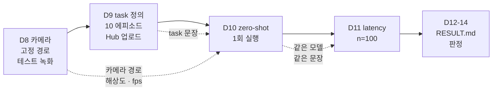

# 스파이크 Week 2 가이드 — 카메라 · 녹화 · SmolVLA zero-shot · latency (D8-D14)

> 스파이크 2주차 (2026-09-14 - 09-21) 의 실행 절차. Week 1 (조립 · 모터 ID · 캘리브레이션 · teleop) 은 [조립 가이드](../week1/2026-09-13-so-arm101-assembly-guide.md) 가 담당하고, 이 문서는 그 마지막 줄 — "카메라 추가 후 `lerobot-record` 로 넘어간다" — 부터 판정 기록까지를 잇는다.
> 통과 기준 · 판정표의 원본: [실기 전환 plan](../../../../docs/superpowers/plans/2026-08-30-realworld-transition-execution.md) §5.2-§5.4 / 일 단위 체크: [master roadmap](../../../../docs/superpowers/plans/2026-08-31-master-roadmap.md) §3 + [RESULT.md](RESULT.md) §2
> 작성일: 2026-09-13
> 환경: 호스트 Ubuntu 22.04 + RTX 4070 12GB 위의 도커 컨테이너 (Ubuntu 24.04), venv `/workspace/venvs/lerobot` (Python 3.12, lerobot 0.6.2, extras `core_scripts,feetech,smolvla`)
> LeRobot 버전 주의: 명령어 · 옵션 이름은 버전에 따라 바뀐다. 이 문서의 명령은 2026 중반 공식 문서 기준 골격이고, **각 Day 의 첫 단계는 `--help` 로 옵션 이름 대조**다. 이름이 다르면 이 문서를 고친다.

## TL;DR

- **카메라는 고정 경로로 잡는다.** `/dev/video*` 번호는 재부팅 · 재연결로 바뀐다. `so101-attach` 가 USB 시리얼로 만드는 `/dev/so101_cam_overview` · `/dev/so101_cam_wrist` 를 쓴다 (서보 보드를 `/dev/so101_follower` 로 잡은 것과 같은 원리).
- **ELP Stereo 는 좌 · 우 영상이 한 프레임에 붙어 나온다.** 스파이크는 자르지 않고 그대로 쓴다. 크롭 여부는 v2.5 측정 설계에서 결정한다.
- **본 녹화 전에 2 에피소드 테스트 녹화를 한다 (업로드 없이).** fps 가 설정보다 낮게 나오는 문제, 캘리브 경로가 다른 셸에서 갈라지는 문제는 10 에피소드를 다시 찍기 전에 잡는다.
- **zero-shot 실행은 `lerobot-rollout` 이다.** lerobot 0.6.2 의 `lerobot-record` 는 리더 시범을 녹화하는 전용 도구이고, 정책으로 팔을 움직이는 일은 `lerobot-rollout` 이 맡는다. 카메라 이름은 데이터셋용이 아니라 모델 config 의 `input_features` 키에 맞춘다. `--robot.max_relative_target` 으로 한 스텝 이동량을 제한한 뒤 돌린다.
- **latency 는 "chunk 1개 생성 시간" 으로 정의한다.** SmolVLA 는 한 번 모델을 돌려 action 을 여러 개 만들어 큐에 쌓으므로, 큐를 비우지 않고 100번 호출하면 대부분 0 ms 근처가 찍힌다. `scripts/measure_latency_smolvla.py` 가 매 반복 큐를 비운다.
- **판정은 09-21 에 한 번만.** RESULT.md §1 의 4칸을 채우고 plan §5.4 표의 한 행을 §5 에 적는다.

---

## 0. 시작 전 준비

### 0.1 Week 1 에서 이어받는 것

| 항목 | 값 | 어디서 정했나 |
|---|---|---|
| Python 환경 | venv `/workspace/venvs/lerobot` (lerobot 0.6.2, alias `acl`) | 컨테이너 Dockerfile |
| 포트 환경변수 | `$FOLLOWER_PORT`, `$LEADER_PORT` (`so101-attach` 가 USB 시리얼로 만드는 `/dev/so101_follower`, `/dev/so101_leader`) | 컨테이너 Dockerfile · `so101-help` |
| 팔 id | `so101_follower_01`, `so101_leader_01` | 조립 가이드 §6.1-§6.2 |
| 캘리브 파일 | `$HF_LEROBOT_CALIBRATION` 아래 `robots/so_follower/*.json`, `teleoperators/so_leader/*.json` | 조립 가이드 §6.3 |
| teleop 동작 | must 1 기능 충족. 30초 증거 영상이 없으면 D12 에 촬영 | master roadmap §3 D5 |

### 0.2 Week 2 공통 준비

용어: **HF Hub**(Hugging Face Hub)는 데이터셋 · 모델 저장소. `lerobot-record` 가 녹화 결과를 여기로 올리고, `lerobot/smolvla_base` 도 여기서 받는다. 업로드에는 **write 권한 토큰**이 필요한데, 호스트 compose 의 `.env` (`HF_WRITE_TOKEN`) 가 컨테이너 환경변수 `HF_TOKEN` 으로 넣어 주므로 컨테이너 안에서 로그인하지 않는다.

```bash
so101-attach         # 팔 · 카메라 USB 를 꽂은 뒤, 그리고 컨테이너 재시작 뒤 매번. /dev/so101_* 노드 생성
acl                  # venv 활성화 (/workspace/venvs/lerobot)
echo $FOLLOWER_PORT $LEADER_PORT $HF_LEROBOT_CALIBRATION   # 셋 다 값이 찍혀야 한다 (컨테이너 환경변수. 빈 값이면 컨테이너 설정 확인)
ls $HF_LEROBOT_CALIBRATION/robots/so_follower/ $HF_LEROBOT_CALIBRATION/teleoperators/so_leader/   # json 2개

hf auth whoami       # 환경변수 HF_TOKEN 으로 로그인된 아이디가 찍혀야 한다. `hf auth login` 은 하지 않는다 (환경변수가 파일 토큰보다 우선)
echo $HF_USER        # 컨테이너 환경변수 (호스트 .env 의 HF_USER). 아래 모든 repo_id 의 앞부분

export SPIKE_OUT=/workspace/study/physical-ai-study/Studies/Hardware-Arm/spike/week2/outputs   # 로그 · 측정 결과 (gitignore 대상). 세션마다 잡는다
mkdir -p $SPIKE_OUT
```

- `HF_LEROBOT_CALIBRATION` 이 빈 셸에서 `lerobot-record` 를 실행하면 에러 없이 기본 경로 (`~/.cache/huggingface/lerobot/calibration/`) 를 보고 "캘리브 파일 없음" 으로 새 캘리브레이션을 요구한다 (조립 가이드 §6.3). 새 터미널을 열 때마다 `echo` 로 확인한다.
- 포트 · 캘리브 경로 · `HF_TOKEN` · `HF_USER` 는 호스트 compose (`.env`) 가 컨테이너 환경변수로 넣는다. 컨테이너 안 `~/.bashrc` 는 이미지가 만든 것이라 재생성 시 수정이 사라지므로 거기에 적지 않는다. `SPIKE_OUT` 만 세션마다 export 한다.

D10 · D11 은 SmolVLA 를 실제로 GPU 에 올리므로 `smolvla` extra 가 추가로 필요하다. 용어: **extra** 는 pip 패키지의 선택 설치 묶음이다. lerobot 은 정책마다 필요한 라이브러리를 extra 로 나눠 두어서, Week 1 의 `core_scripts,feetech` (텔레옵 · 녹화 · 서보) 만으로는 SmolVLA 안의 시각-언어 모델 (SmolVLM2) 을 읽어 들이는 `transformers` 가 설치되지 않는다. venv 에 1회만 설치하면 된다 — venv 가 `/workspace` 마운트 위에 있어 컨테이너를 재생성해도 남는다.

```bash
pip install "lerobot[smolvla]"     # transformers · accelerate · num2words 추가. 설치된 lerobot 본체 (git 커밋 고정) 는 그대로 두고 빠진 의존성만 채운다
python -c "import transformers, accelerate, num2words; print(transformers.__version__)"   # 기대: 5.4.x 또는 5.5.x (lerobot 0.6.2 의 smolvla extra 가 요구하는 범위. 실측 5.5.4)
python -c "import torch; print(torch.__version__, torch.cuda.is_available())"             # 기대: 2.11.0+cu130 True -- pip 이 torch 를 CPU 판으로 바꾸지 않았는지 확인
```

### 0.3 Day 사이의 의존 관계



D11 은 팔 · 카메라 없이 GPU 만 쓴다. D10 이 밀리면 D11 을 먼저 해도 된다 (모델 로드가 되는지만 D10 §3.1 로 확인한 뒤).

### 0.4 이 문서가 다루지 않는 것

- 데이터 품질 · 성공률 · 부분 도달률의 통계 — v2.5 (`../../v25/README.md`)
- ROS2 층, 이중 latency — Stage 1 (`../../stage1/ros2_driver_setup.md` §5)

---

## 1. D8 — 카메라 세팅 + 테스트 녹화

**무엇을**: ELP 를 고정하고, LeRobot 이 그 카메라를 원하는 해상도 · fps 로 여는지 확인한 뒤, 2 에피소드짜리 테스트 녹화를 한다 (Hub 업로드 없음).
**왜**: D9 본 녹화에서 카메라 문제를 처음 만나면 10 에피소드를 다시 찍게 된다. 카메라 번호가 바뀌는 문제, fps 가 설정보다 낮게 나오는 문제는 본 녹화 전에 끝내야 한다.
**끝나면 손에 남는 것**: 카메라 고정 경로 1개 (`$FRONT_CAM`), `--robot.cameras` 설정 문자열 1개 (`$CAMS`), 로컬 테스트 데이터셋 1개, 수령 확인 ③ 의 답.

### 1.1 명령 확인

```bash
lerobot-find-cameras --help
lerobot-record --help | grep -i -A2 "cameras"
# OpenCV 카메라 설정에 어떤 키가 있는지 (fourcc 같은 픽셀 포맷 옵션 유무를 여기서 본다)
python -c "import dataclasses; from lerobot.cameras.opencv import OpenCVCameraConfig; print([f.name for f in dataclasses.fields(OpenCVCameraConfig)])"
```

### 1.2 물리 장착 (수령 확인 ③)

- 수령 확인 ③ 의 결과: ELP 는 키트 기본 정면 거치 모듈에 붙지 않는다 (RESULT.md §4 #5). 현재 ELP 는 팔로워 **왼쪽 측면** 에 임시 고정, 손목 카메라는 그리퍼에 장착 — 스파이크는 "안 예뻐도 된다" (plan §5.1).
- 측면 시점은 문제가 아니다. 팔이 앞으로 뻗는 동작이 화면을 가로지르는 이동으로 보여 정면보다 잘 잡힌다. 대신 좌우 이동은 깊이로 바뀌어 약해지므로 큐브 → 트레이 동선을 주로 앞뒤 방향으로 잡는다.
- 구도 확인 (D9 전에 teleop 으로): ① 최대 신장 · 최좌 · 최우 · 최고 높이에서 팔이 화면 밖으로 잘리지 않는가 ② 큐브 위치와 트레이 위치에서 집는 순간 그리퍼 끝이 전완에 가려지지 않는가 ③ 큐브와 트레이가 둘 다 보이고 크기로 구분되는가. 안 되면 카메라를 조금 높여 30-45도 내려다보게 한다.
- 기준 프레임을 남긴다: 구도가 확정되면 `lerobot-find-cameras opencv` 의 샘플 이미지를 `$SPIKE_OUT/ref_overview.png` 로 복사해 두고, D9 · D10 직전에 새 샘플과 겹쳐 밀림이 없는지 본다.
- 한 번 고정하면 Week 2 내내 움직이지 않는다. 데이터셋 (D9) 과 zero-shot (D10) 이 같은 시점을 봐야 한다.
- USB 허브: ELP 는 USB 2.0 허브 뒤에 있지만 손목 카메라와 동시 스트리밍에서 60 / 30 fps 가 그대로 나온다 (실측). fps 가 실측으로 미달할 때만 직결을 시도한다.

### 1.3 카메라 식별 — 고정 경로

용어: **UVC**(USB Video Class)는 드라이버 설치 없이 꽂으면 되는 USB 카메라 규격. 리눅스는 UVC 카메라 하나에 `/dev/videoN` 두 개를 만든다 (N 은 영상, N+1 은 메타데이터). 그래서 `ls /dev/video*` 의 개수가 카메라 수의 2배로 보이고, `lerobot-find-cameras` 는 영상 노드만 보여 준다.

컨테이너 /dev 는 tmpfs 라 호스트 udev 가 만드는 `/dev/v4l/by-id/` 가 없다. 대신 `so101-attach` 가 USB 시리얼로 카메라를 찾아 고정 이름의 노드를 만든다 (`so101-attach list` 로 보이는 카메라와 시리얼 확인).

```bash
so101-attach                    # 카메라를 다시 꽂았거나 컨테이너를 재시작했으면 재실행
ls -la /dev/so101_cam_*         # so101_cam_overview = ELP (캡처 노드), so101_cam_wrist = 손목 카메라
lerobot-find-cameras opencv     # 열리는 카메라 목록 + 기본 해상도/fps. /dev/videoN 이름으로 표시되지만 설정에는 위 고정 이름을 쓴다. 샘플 이미지를 ./outputs/captured_images/ 에 저장
```

```bash
export FRONT_CAM=/dev/so101_cam_overview
export WRIST_CAM=/dev/so101_cam_wrist
```

샘플 이미지 (`outputs/captured_images/`) 를 열어 본다. ELP Stereo 는 좌 · 우 영상이 한 프레임에 나란히 붙어 나온다 (Phase 6 week7 에서 확인한 1280x480). 스파이크는 이 프레임을 자르지 않고 그대로 쓴다 — 이유와 한계는 §6 표 마지막 행.

```bash
sudo apt install -y v4l-utils
v4l2-ctl -d $FRONT_CAM --list-formats-ext   # 픽셀 포맷 (MJPG / YUYV) 별로 지원하는 해상도 · fps 목록
```

용어: **YUYV** 는 무압축 전송. USB 2.0 에서 1280x480 은 15 fps 가 한계다. **MJPG** 는 카메라가 JPEG 로 압축해 보내는 모드로, 같은 해상도에서 높은 fps 가 나온다. 목록에 있는 fps 만 설정에 적는다.

| 카메라 | MJPG 해상도 | 지원 fps |
|---|---|---|
| ELP (`so101_cam_overview`) | 1280x480 (좌 · 우 결합) | 25, 60 (30 없음 — 30 을 적으면 `failed to set fps=30` 으로 중단) |
| ELP | 2560x720 | 25, 60 |
| 손목 (`so101_cam_wrist`) | 1280x720 | 30 |
| 손목 | 640x480 | 30 |

### 1.4 카메라 설정 문자열

```bash
export CAMS="{ front: {type: opencv, index_or_path: $FRONT_CAM, width: 1280, height: 480, fps: 60, fourcc: MJPG}, wrist: {type: opencv, index_or_path: $WRIST_CAM, width: 1280, height: 720, fps: 30, fourcc: MJPG} }"
```

- `front` / `wrist` 는 데이터셋의 이미지 키 이름 (`observation.images.front`, `observation.images.wrist`) 이 된다. D9 는 이 이름을 쓰고, D10 은 모델이 기대하는 이름으로 바꿔 쓴다 (§3.2).
- `width` / `height` / `fps` 는 §1.3 표에 있는 조합만 적는다. 없는 fps 를 적으면 lerobot 이 카메라 연결 단계에서 예외를 내고 멈춘다.
- `fourcc: MJPG` 는 lerobot 0.6.2 `OpenCVCameraConfig` 의 `fourcc` 필드다. 카메라 fps 와 데이터셋 fps (§1.5 의 `--dataset.fps=30`) 는 별개다 — record 루프는 매 틱 카메라의 최신 프레임을 가져오므로 ELP 를 60 으로 두면 30 fps 의 매 틱에 새 프레임이 들어간다.

### 1.5 테스트 녹화 (2 에피소드, 업로드 없음)

```bash
lerobot-record \
    --robot.type=so101_follower \
    --robot.port=$FOLLOWER_PORT \
    --robot.id=so101_follower_01 \
    --robot.cameras="$CAMS" \
    --teleop.type=so101_leader \
    --teleop.port=$LEADER_PORT \
    --teleop.id=so101_leader_01 \
    --display_data=false \
    --dataset.repo_id=$HF_USER/so101-spike-test \
    --dataset.num_episodes=2 \
    --dataset.fps=30 \
    --dataset.episode_time_s=20 \
    --dataset.reset_time_s=10 \
    --dataset.single_task="test" \
    --dataset.push_to_hub=false
```

- `--display_data=false`: 이 컨테이너는 헤드리스 (DISPLAY 없음) 라 Rerun 창을 못 띄운다. 영상은 녹화 뒤 mp4 로 확인한다.
- 키 조작 (→ · ← · q) 은 VS Code 터미널처럼 TTY 인 셸에서만 듣는다. 비대화형 셸이면 타이머만으로 진행된다.
- 흐름: 카메라 · 팔 연결 → 에피소드 1 녹화 (20초) → 리셋 구간 (10초) → 에피소드 2 → 영상 인코딩. 녹화 중 키 조작은 §2.3.

확인:

```bash
DS=$(ls -d ~/.cache/huggingface/lerobot/$HF_USER/so101-spike-test* | tail -1)   # 기본 저장 위치. lerobot 0.6.2 는 repo_id 뒤에 _YYYYMMDD_HHMMSS 를 붙인다 (--dataset.no_stamp=true 로 끔)
python -c "import json; d=json.load(open('$DS/meta/info.json')); print(d['fps'], d['total_episodes'], d['total_frames'])"
# 기대: 30 2 약 1200 (= 30 fps x 20 s x 2, 화살표 키로 일찍 끝내지 않았을 때)
# 프레임 수가 크게 모자라면 카메라 fps 또는 녹화 루프가 못 따라간 것 -- §6
find $DS -name "*.mp4" | head -2       # 영상 파일. 하나를 열어 카메라 시점 · 밝기 · 팔 전체가 보이는지 확인
```

### 1.6 막힐 때

§6 표의 D8 행. 가장 흔한 순서: 카메라 번호 변동 (고정 경로로 해결) → fps 미달 (MJPG 또는 해상도 하향) → 캘리브 파일 못 찾음 (`HF_LEROBOT_CALIBRATION` 빈 셸).

---

## 2. D9 — task 정의 · 10 에피소드 · Hub 업로드

**무엇을**: 단일 task 를 지시문 · 물체 · 시작 자세 · 종료 조건까지 고정하고, 리더로 시범 10회를 녹화해 HF Hub private 데이터셋으로 올린다.
**왜**: must 2 의 증거는 repo id 하나지만, 이 10 에피소드는 v2.5 파인튜닝 데이터의 규약 원형이고, 에피소드당 소요 시간은 v2.5 N 역산의 입력이다 (`../../v25/README.md` §1).
**끝나면 손에 남는 것**: Hub private 데이터셋 repo id, 에피소드당 소요 시간 1개, task 정의 표.

### 2.1 task 정의 (녹화 전에 고정)

| 항목 | 이 스파이크의 값 | 왜 고정하나 |
|---|---|---|
| 지시문 (`single_task`) | `Pick up the red cube and place it on the tray.` | 데이터셋 · zero-shot · latency 가 같은 문장을 쓴다. 영어 — `smolvla_base` 가 영어 지시문으로 학습됨 |
| 물체 | 3-4 cm 큐브 1개, 책상과 **밝기** 가 대비되는 것 | 전체 뷰 ELP 는 흑백 센서라 색상 대비는 손목 카메라에서만 보인다. 문장의 "red" 는 손목 카메라 기준 |
| 목표 | 종이 트레이 또는 테이프로 표시한 사각형 | 성공 여부를 눈으로 판정할 수 있게 |
| 팔 시작 자세 | 리더를 테이프로 표시한 자세에 두고 시작 | 에피소드마다 첫 프레임이 같아야 학습 데이터가 된다 |
| 물체 시작 위치 | 테이프로 표시한 칸 1-3개 중 하나. 에피소드별로 어느 칸인지 메모 | v2.5 배치 마커의 축소판 |
| 에피소드 상한 | 30 s (`episode_time_s`) | 리더 시범 1회는 10-20 s 면 끝난다. 끝나면 → 키로 일찍 종료 |
| 리셋 | 15 s (`reset_time_s`) | 큐브를 시작 칸으로, 리더를 시작 자세로 되돌리는 시간 |
| 실패한 시범 | ← 키로 취소하고 재녹화 | 데이터셋에는 성공 시범만 남긴다 (`../../v25/PRACTICE.md` 1 의 품질 게이트) |

물체 · 문장을 바꾸려면 여기서 바꾸고 D10 · D11 · 스크립트의 `TASK` 상수까지 같은 문장으로 맞춘다.

### 2.2 본 녹화

```bash
acl                                                  # venv
export CAMS="{ front: {type: opencv, index_or_path: /dev/so101_cam_overview, width: 1280, height: 480, fps: 60, fourcc: MJPG}, wrist: {type: opencv, index_or_path: /dev/so101_cam_wrist, width: 1280, height: 720, fps: 30, fourcc: MJPG} }"
ls -la /dev/so101_* && echo $CAMS $HF_USER && hf auth whoami   # 노드 4개 · 두 변수 · 계정이 찍혀야 한다
date +%T    # 시작 시각 -- 에피소드당 소요 계산용
lerobot-record \
    --robot.type=so101_follower \
    --robot.port=$FOLLOWER_PORT \
    --robot.id=so101_follower_01 \
    --robot.cameras="$CAMS" \
    --teleop.type=so101_leader \
    --teleop.port=$LEADER_PORT \
    --teleop.id=so101_leader_01 \
    --display_data=false \
    --dataset.repo_id=$HF_USER/so101-spike-pick-cube \
    --dataset.no_stamp=true \
    --dataset.num_episodes=10 \
    --dataset.fps=30 \
    --dataset.episode_time_s=30 \
    --dataset.reset_time_s=15 \
    --dataset.single_task="Pick up the red cube and place it on the tray." \
    --dataset.private=true \
    --dataset.push_to_hub=true
date +%T    # 종료 시각
```

- `--dataset.no_stamp=true`: lerobot 0.6.2 는 기본으로 repo_id 뒤에 `_YYYYMMDD_HHMMSS` 를 붙여 로컬 폴더와 Hub 이름이 모두 바뀐다. D10 과 RESULT.md §1 이 같은 repo_id 를 참조하므로 끈다.
- `--display_data=false`: 헤드리스 컨테이너 (§1.5). 카메라 fps 는 `$CAMS` 의 값 (ELP 60, 손목 30) 이고 `--dataset.fps=30` 은 녹화 루프 주기다. 둘은 별개라 ELP 가 30 을 지원하지 않아도 무관하다.
- 실행 전 같은 셸에서 `echo $CAMS $HF_USER` 로 둘 다 찍히는지 본다. `$CAMS` 는 §1.4 의 export 를 세션마다 다시 해야 한다.
- 중간에 끊기면 같은 repo_id 로 `--resume=true` 를 붙여 이어 찍는다.
- 리더를 잡기 전에 팔로워 가동 범위 안에 손 · 케이블이 없는지 본다.

### 2.3 녹화 중 키 조작

| 키 | 동작 |
|---|---|
| → | 현재 에피소드 (또는 리셋 구간) 를 일찍 끝내고 다음으로 |
| ← | 현재 에피소드를 버리고 처음부터 다시 녹화 |
| Esc | 녹화 전체 종료 → 인코딩 → 업로드 |

### 2.4 확인 + 부수 실측

```bash
DS=~/.cache/huggingface/lerobot/$HF_USER/so101-spike-pick-cube
python -c "import json; d=json.load(open('$DS/meta/info.json')); print(d['total_episodes'], d['total_frames']/d['fps'], 's')"
# 기대: 10, 순수 녹화 초 (프레임 수 / fps)
```

- Hub 에서 `https://huggingface.co/datasets/<HF_USER>/so101-spike-pick-cube` 가 열리고 Private 표시가 있는지 본다. **이 repo id 가 must 2 의 증거** → RESULT.md §1 행 2.
- 에피소드당 소요 = (종료 시각 - 시작 시각) / 10. 순수 녹화 초와의 차이가 리셋 · 조작 오버헤드다. 두 값을 RESULT.md §3 에 적는다 — v2.5 N 역산 (`../../v25/README.md` §1 표) 의 입력.

### 2.5 막힐 때

§6 표의 D9 행. 업로드 실패 (401) 는 로그인 토큰 권한, 인코딩 단계 정지는 ffmpeg 문제인 경우가 대부분이다.

---

## 3. D10 — SmolVLA zero-shot 1회 실행

**무엇을**: 사전학습 SmolVLA (`lerobot/smolvla_base`) 를 파인튜닝 없이 그대로 팔에 연결해 30초 1 에피소드를 돌린다. 리더 없이 카메라 영상 + 관절값 + 지시문 → 모델 → 팔로워 명령.
**왜**: must 3 는 "팔이 명령에 반응해 움직이는가" 만 본다. 성공률은 v2.5 가 잰다. 여기서 확인하는 것은 관측 → 모델 → 명령의 경로가 이 환경에서 끊기지 않고 이어지는가다. 용어: **zero-shot** = 이 팔 · 이 작업의 데이터를 전혀 학습하지 않은 상태로 실행.
**끝나면 손에 남는 것**: 30초 영상 + 로그 파일. 부수로 모델이 기대하는 입력 키 목록 (D11 이 그대로 쓴다).

lerobot 0.6.2 에서 실기 정책 실행은 **`lerobot-rollout`** 이 맡는다. 용어: **rollout** = 학습된 정책을 실제 환경에서 굴려 보는 것. `lerobot-record` 는 리더 시범 녹화 전용이라 `--teleop.*` 없이 실행하면 "use lerobot-rollout instead" 로 멈춘다. rollout 은 실행 방식을 `--strategy.type` 으로 고르는데, 이 스파이크는 녹화 없이 정책만 돌리는 `base` 를 쓴다 — must 3 의 증거는 스마트폰 영상과 로그라서 데이터셋이 필요 없다.

### 3.1 모델 받기 + 기대 입력 확인

먼저 §0.2 의 `smolvla` extra 설치를 끝낸다. 이 절의 명령은 파일을 받아 JSON 을 읽기만 하므로 extra 없이도 통과한다 — 통과했다고 모델이 로드된다는 뜻은 아니다. 모델을 실제로 올리는 §3.4 와 D11 스크립트는 `transformers` 가 없으면 시작 직후 ImportError 로 멈춘다.

```bash
hf download lerobot/smolvla_base      # 구버전 CLI 는 huggingface-cli download
python - <<'EOF'
import json
from huggingface_hub import hf_hub_download

cfg = json.load(open(hf_hub_download("lerobot/smolvla_base", "config.json")))
for key, feat in cfg["input_features"].items():   # 모델이 기대하는 관측 키와 모양
    print(key, feat["shape"])
print("n_action_steps", cfg["n_action_steps"], "chunk_size", cfg["chunk_size"])
EOF
```

읽는 법:

- `observation.images.<이름>` 이 이미지 키다. 이름과 개수를 적어 둔다 (§3.2 에서 쓴다).
- `observation.state` 의 모양이 `[6]` 이면 SO-101 의 6 관절과 맞는다.
- `n_action_steps` / `chunk_size` 는 모델이 한 번 돌 때 만드는 action 개수다. D11 의 해석에 쓴다.

### 3.2 카메라 키 맞추기

정책은 자기 config 에 있는 이미지 키만 관측에서 찾는다. 데이터셋용 이름 `front` 가 그 목록에 없으면 `Visual feature mismatch` 오류로 멈춘다 — master roadmap 이 D10 의 막힘으로 꼽은 "카메라 키 이름 불일치" 가 이것이다. 해법은 카메라 이름을 모델 쪽에 맞추는 것:

```bash
# smolvla_base 의 이미지 키는 observation.images.camera1 · camera2 · camera3 (§3.1 출력). 손목을 camera1, 전체 뷰 ELP 를 camera2 로 둔다
# 이름만 다르고 해상도 · fps · fourcc 는 §1.4 의 $CAMS 와 같다 (ELP 는 30 fps 를 지원하지 않는다 -- §1.3 표)
export CAMS_ZS="{ camera1: {type: opencv, index_or_path: /dev/so101_cam_wrist, width: 1280, height: 720, fps: 30, fourcc: MJPG}, camera2: {type: opencv, index_or_path: /dev/so101_cam_overview, width: 1280, height: 480, fps: 60, fourcc: MJPG} }"
```

카메라 2대 vs 모델 키 3개: `camera3` 은 비워 둔 채로 돈다. lerobot 0.6.2 의 검사는 "로봇이 주는 이미지 이름이 전부 모델 키 안에 들어 있는가" 만 본다 — {`camera1`, `camera2`} 는 {`camera1`, `camera2`, `camera3`} 안에 들어 있으므로 통과한다. 모델 쪽도 관측에 없는 키는 건너뛰고 있는 이미지만 쓴다 (`modeling_smolvla.py` 의 `prepare_images`). 반대로 이름이 하나라도 모델 키 밖이면 (`front` 등) 이 검사에서 걸린다.

`--policy.empty_cameras` 는 붙이지 않는다. 이 옵션은 없는 키 자리를 마스크된 빈 이미지로 채워 넣는 용도이고 `smolvla_base` 의 기본값은 0 (채우지 않음) 이다. 붙이지 않아도 위 검사를 통과하므로 스파이크에서는 기본값 그대로 둔다.

### 3.3 안전 준비

- 작업면 위에는 큐브 · 트레이만. 손 · 케이블 · 리더 팔은 팔로워 가동 범위 밖.
- `--robot.max_relative_target=10`: 한 스텝에 관절이 움직일 수 있는 양의 상한. 정규화 범위 -100..100 기준 10 이면 한 스텝에 전체 범위의 5 %. 처음엔 이 값으로 시작하고, 팔이 너무 굼뜨면 20-30 으로 올린다.
- 비상 정지: USB 를 뽑으면 그 자리에서 멈추고, DC 를 뽑으면 토크가 풀려 떨어진다 (조립 가이드 §7). 손은 USB 쪽에 둔다.
- 종료 동작: 30초가 지나거나 Ctrl+C 를 누르면 rollout 은 팔을 **실행 직전의 자세로 약 3초에 걸쳐 되돌린 뒤** 연결을 끊는다 (`--return_to_initial_position` 기본값 true). 팔이 멈춘 것처럼 보여도 로그에 `Rollout finished` 가 찍히기 전에는 가동 범위에 손을 넣지 않는다.
- 스마트폰 촬영 준비 — 30초 영상이 증거다.

### 3.4 실행

```bash
lerobot-rollout \
    --strategy.type=base \
    --policy.path=lerobot/smolvla_base \
    --policy.device=cuda \
    --robot.type=so101_follower \
    --robot.port=$FOLLOWER_PORT \
    --robot.id=so101_follower_01 \
    --robot.cameras="$CAMS_ZS" \
    --robot.max_relative_target=10 \
    --task="Pick up the red cube and place it on the tray." \
    --fps=30 \
    --duration=30 \
    2>&1 | tee $SPIKE_OUT/d10_zeroshot.log
```

- `--strategy.type=base`: 녹화 없이 정책만 실행한다. `--dataset.*` 옵션을 같이 주면 "does not record data" 오류로 멈춘다. 실행 결과를 데이터셋으로도 남기는 `episodic` 전략이 있지만 must 3 에는 필요 없다.
- `--teleop.*` 는 넣지 않는다 — 정책이 리더 역할을 한다.
- `--task` 는 D9 의 `single_task` 와 같은 문장. `--fps=30` 은 제어 루프 주기 (D9 의 `--dataset.fps` 와 같은 값), `--duration=30` 은 30초 뒤 루프 종료 (0 이면 무한).
- 추론 방식은 기본값 `sync` 다 — 제어 틱마다 정책을 부르고, action 큐가 빈 틱에만 모델이 실제로 돈다. D11 실측 chunk 약 106 ms 는 30 Hz 기준 3틱 분량이라 50 스텝 (약 1.7초) 마다 팔이 잠깐 멈칫할 수 있다. 고장이 아니다. 느린 VLA 용 `--inference.type=rtc` 는 스파이크에서 쓰지 않는다.
- 화면 표시는 기본값이 꺼짐이라 `--display_data` 를 적지 않는다 (헤드리스 컨테이너 — §1.5).
- 로그는 `tee` 로 파일과 화면에 동시에 남긴다. 이 파일 경로가 증거의 절반이다.

### 3.5 판정과 증거

| 관찰 | 판정 |
|---|---|
| 팔이 지시문과 무관하게라도 스스로 움직인다 | must 3 통과 |
| 큐브 쪽으로 간다 (reached) / 집는다 (grasped) | nice — RESULT.md §1 nice 행에 기록 |
| 전혀 안 움직임 / 예외로 종료 | §6 표 |
| 극단 위치로 튄다 | 반응은 한 것 — must 3 통과. 원인 (action 스케일 규약 차이) 은 디버깅하지 않고 v2.5 첫 항목으로 기록 (plan §5.4 의 "1-2 통과, 3 실패" 행과 같은 처리) |

증거: 영상 파일 경로 + `$SPIKE_OUT/d10_zeroshot.log` → RESULT.md §1 행 3.

---

## 4. D11 — latency n=100

**무엇을**: `scripts/measure_latency_smolvla.py` 로 4070 에서 SmolVLA 의 추론 시간을 100회 재고 mean / p95 를 얻는다. 팔 · 카메라 연결이 필요 없다 — 랜덤 입력으로 GPU 만 쓴다.
**왜**: OpenVLA 300.3 ms (레포 README 실측 표) 는 "AR 토큰 방식 VLA" 의 숫자다. 같은 4070 에서 action-chunk 방식 (SmolVLA) 의 숫자를 나란히 놓는 것이 이 측정의 목적이고, v2.5 비교표 (`../../v25/PRACTICE.md` §4) 의 latency 행이 이 값을 그대로 쓴다.
**끝나면 손에 남는 것**: 수치 1줄 + `outputs/` 의 npy · csv.

### 4.1 무엇을 "1회" 로 볼 것인가 (측정 정의)

용어: **action chunk** = 모델이 한 번 돌아 미래 여러 스텝의 action 을 한꺼번에 내놓는 방식. SmolVLA 의 `select_action` 은 호출마다 큐에서 action 을 하나씩 꺼내고, 큐가 비었을 때만 모델을 돌린다 (한 번에 `n_action_steps` 개를 채운다). 그래서 아무 처리 없이 100번 호출하면 대부분 0-1 ms 가 찍혀 OpenVLA 와 비교가 되지 않는다.

이 스파이크의 정의: **1회 = chunk 1개 생성**. 매 반복 `policy.reset()` 으로 큐를 비운 뒤 `select_action` 을 1회 부른다. OpenVLA 의 `predict_action` 1회 (= action 1개) 와 조건을 맞춘 대조표:

| 조건 | OpenVLA (2026-06, methodology §1) | SmolVLA (이 스크립트) |
|---|---|---|
| n / warm-up / batch | 100 / 5 / 1 | 동일 |
| 입력 이미지 | 224x224 랜덤 RGB 1장, 매 반복 새로 | config 가 선언한 이미지 키 3개 (`camera1` · `camera2` · `camera3`, 각 256x256) 모두에 랜덤 텐서, 매 반복 새로 (모델 내부에서 512x512 로 패딩 리사이즈) |
| 지시문 | 고정 1문장 | 고정 1문장 (D9 · D10 과 동일) |
| GPU 동기화 | `synchronize()` 앞뒤 | 동일 |
| 1회의 산출 | action 1개 (7 dim) | action `n_action_steps` 개 (chunk) |
| 정밀도 | int4 (nf4) | 양자화 없음 — 가중치 dtype 은 bfloat16 (출력에 찍힘) |
| 전처리 | processor 는 측정 밖 | preprocessor 파이프라인이 있으면 밖, 없는 구버전은 안 — 어느 쪽인지 출력에 찍힘 |

스크립트는 chunk 값과 함께 상각값 (chunk ms / `n_action_steps`) 도 출력한다. RESULT.md 에는 chunk 값을 주 수치로 적고 상각값을 괄호에 넣는다. 두 수치의 뜻이 다르다는 것 (한 번 판단에 걸리는 시간 vs action 하나당 평균) 을 같이 적는다. 측정은 이미지 3장 기준이고 D10 실기는 카메라 2대 (§3.2) 라, 실기의 chunk 시간은 이 값과 다를 수 있다.

### 4.2 실행

```bash
cd <레포 경로>
python Studies/Hardware-Arm/spike/week2/scripts/measure_latency_smolvla.py
```

출력 (숫자는 자리표시):

```
입력 키: ['observation.state', 'observation.images.camera1', 'observation.images.camera2', 'observation.images.camera3']
n_action_steps=50 chunk_size=50 dtype=torch.bfloat16 use_amp=False
preprocessor 분리: True (True 면 전처리는 측정 구간 밖)
로드 직후 memory_allocated: _.__ GB
warm-up 완료
10/100: latest = ___ ms
...
[latency 통계 -- chunk 1개 생성 기준]
mean   : ___ ms  (action 당 _.__ ms)
p95    : ___ ms
peak VRAM (memory_allocated): _.__ GB

RESULT.md 1줄: SmolVLA base (4070, torch.bfloat16): chunk mean ___ / p95 ___ ms (n=100, 50 actions/chunk, action 당 _.__ ms, 전처리 밖) vs OpenVLA int4 300.3 / 304.8 ms (action 1개)
저장: .../spike/week2/outputs/smolvla_latency_4070.npy, smolvla_latency_4070_summary.csv
```

마지막 "RESULT.md 1줄" 을 그대로 RESULT.md §1 행 4 에 붙인다. `outputs/` 는 gitignore 대상이라 수치는 문서에 옮겨 적어야 남는다.

### 4.3 스크립트가 안 돌 때

D10 이 돌았다면 모델 로드는 같은 경로라 통과한다. D10 보다 먼저 돌려 `ImportError: 'transformers' is required but not installed` 가 나면 §0.2 의 `smolvla` extra 설치가 빠진 것이다. 남는 실패 지점은 관측 배치 만들기와 전처리 분기 두 곳이고, 정답은 `lerobot-rollout` 의 `sync` 추론이 정책을 부르는 코드에 있다:

```bash
grep -n "def get_action" -A 30 $(python -c "import lerobot.rollout.inference.sync as m; print(m.__file__)")
```

이 함수가 관측 dict 에 무엇을 넣고 (`task` 키, batch 차원), 어떤 순서로 부르는지 (preprocessor → `select_action` → postprocessor) 를 스크립트의 루프와 대조해 다른 줄만 고친다. 고친 내용은 스크립트 상단 docstring 의 "OpenVLA 와 다른 점" 에 반영한다.

---

## 5. D12-14 — RESULT.md 기입 + 판정

**무엇을**: Week 1-2 의 증거 4건, 소요 시간, 막힌 지점을 RESULT.md 에 옮기고 09-21 에 판정 행을 적는다.
**왜**: RESULT.md 는 "정답은 지우고 증거는 남긴다" 원칙의 보존 기록이고, 분기 재평가 #1 (2026.11) 의 입력이다. 여기 적히지 않은 것은 두 달 뒤 없는 것과 같다.

### 5.1 어디에 무엇을

| RESULT.md 위치 | 채울 것 | 어디서 나오나 |
|---|---|---|
| §1 행 1 | teleop 30초 영상 링크 | Week 1. 미촬영이면 D12 에 teleop 을 다시 돌려 촬영 (master roadmap §3 D5) |
| §1 행 2 | 데이터셋 repo id | §2.4 |
| §1 행 3 | 영상 경로 + `d10_zeroshot.log` 경로 | §3.5 |
| §1 행 4 | "RESULT.md 1줄" (chunk mean / p95, OpenVLA 병기) | §4.2 |
| §1 nice | reached / grasped 관찰 | §3.5 (있을 때만) |
| §2 체크박스 | Week 2 4개 | 각 Day 완료 시 |
| §3 소요 시간 | 계획 대비 실제 (D8-D11 각 날의 벽시계) + 에피소드당 소요 · 리셋 오버헤드 | §2.4 |
| §4 막힌 지점 | 조립 가이드 §9 표와 본 문서 §6 표에 **없는 것만** — 이미 표에 있는 함정에 걸렸으면 "가이드 §N 표 적용" 한 줄 | 각 Day |
| §5 판정 | 아래 표의 한 행 | 09-21 |

### 5.2 판정 (09-21, 1회만 — plan §5.4)

| 결과 | 행동 |
|---|---|
| must 4개 통과 | Stage 1 본 빌드 2026.10 개시, v2.5 2026.11 개시 |
| 1-3 통과, 4 미완 | 통과로 간주 (latency 는 Stage 1 첫 주에 측정) |
| 1-2 통과, 3 실패 | 통과로 간주하되 v2.5 첫 항목을 "zero-shot 실행 디버깅" 으로 |
| 1 실패 (teleop 불가) 또는 2주 초과 | 롤백 — 원안 일정 복귀. 실패 원인 기록 후 분기 재평가 #1 입력 |

판정 행을 RESULT.md §5 에 적고, master roadmap §3 의 D12-14 체크박스를 닫는다. 판정은 이날 한 번만 하고 다시 열지 않는다.

---

## 6. 함정 요약 (Week 2)

| Day | 증상 | 원인 | 조치 |
|---|---|---|---|
| D8 | `lerobot-find-cameras` 의 카메라 수가 `/dev/video*` 의 절반 | UVC 는 장치당 video 노드 2개 (영상 + 메타데이터) | 정상. `so101-attach` 가 만드는 `/dev/so101_cam_*` 는 캡처 노드만이다 |
| D8 | 재부팅 후 카메라가 다른 번호로 잡힘 | `/dev/videoN` 번호는 열거 순서에 따라 바뀜 | §1.3 고정 경로 |
| D8 | fps 가 설정보다 훨씬 낮음 (5-10) | YUYV 무압축의 USB 대역폭 한계 | `fourcc: MJPG` 지정 + §1.3 표에 있는 fps 만 적는다 |
| D8 | 카메라가 열리다 실패 / 프레임 드롭 | USB 허브 대역폭 공유 (현 구성은 실측으로 문제 없음) | fps 실측이 미달할 때만 PC 직결 |
| D8-D9 | `lerobot-record` 가 캘리브레이션을 새로 요구 | 그 셸에 `HF_LEROBOT_CALIBRATION` 이 없어 기본 경로를 봄 | `echo $HF_LEROBOT_CALIBRATION` 확인 후 재실행. 새로 캘리브하지 않는다 |
| D9 | 업로드 401 / 403 | 로그인 안 됨 또는 read 토큰 | `hf auth login` 을 write 토큰으로 다시 |
| D9 | 인코딩 단계에서 멈춤 또는 오류 | ffmpeg / torchcodec 문제 | `conda install ffmpeg -c conda-forge` (조립 가이드 §3.1) |
| D9 | 녹화 중 팔로워가 멈칫함 (`Failed to sync read`) | 12V 2A 어댑터의 전압 강하 | 조립 가이드 §0 표 — 5A 급 교체 |
| D10 | `A teleoperator is required for recording ... use lerobot-rollout instead` | `lerobot-record` 에 `--policy.path` 를 준 옛 방식. lerobot 0.6.2 의 record 는 녹화 전용이다 | §3.4 의 `lerobot-rollout` |
| D10 | `Visual feature mismatch between policy and robot hardware` | 카메라 이름 ≠ 모델 `input_features` 키 | §3.2 |
| D10 | 팔이 전혀 안 움직임 | `max_relative_target` 과소, 또는 로그의 예외 | 로그 확인 → 값을 20-30 으로 |
| D10 | 팔이 극단 위치로 튐 | action 스케일 규약 차이 (정규화 -100..100 vs 각도) | must 3 는 통과. 원인은 v2.5 첫 항목으로 (§3.5) |
| D10-D11 | `ImportError: 'transformers' is required but not installed` | venv 에 `smolvla` extra 가 없음. lerobot 은 이 검사를 import 시점이 아니라 정책 객체를 만드는 시점 (`from_pretrained`) 에 하므로 `import` 와 §3.1 은 통과한다 | §0.2 의 `pip install "lerobot[smolvla]"` |
| D11 | latency 가 대부분 0-1 ms | action 큐에서 꺼내기만 하고 모델이 안 돎 | 스크립트의 `policy.reset()` 이 루프 안에 있는지 확인 |
| D11 | `KeyError: observation.language.tokens` 류 | 신버전인데 preprocessor 를 안 거침 | 스크립트의 preprocessor 분기 + §4.3 |
| 공통 | ELP 좌 · 우 붙은 프레임을 그대로 씀 | 스파이크는 "반응" 만 보므로 크롭하지 않음. 모델이 정사각형으로 패딩 리사이즈해 실효 해상도가 낮아짐 | must 기준 영향 없음. 크롭 (왼쪽 절반) 또는 일반 웹캠 교체는 v2.5 측정 설계 (`../../v25/README.md` §0) 에서 결정 |

---

## 7. 참고 자료

- LeRobot SO-101 문서 (record · 정책 실행 명령 원본): https://huggingface.co/docs/lerobot/so101
- LeRobot 카메라 문서 (`lerobot-find-cameras`, OpenCV 설정 키): https://huggingface.co/docs/lerobot/cameras
- LeRobot SmolVLA 문서: https://huggingface.co/docs/lerobot/smolvla
- `lerobot/smolvla_base` 모델 카드: https://huggingface.co/lerobot/smolvla_base
- OpenVLA 측정 조건의 원본: [`Measurements/openvla-rtx4070-int4/methodology.md`](../../../../Measurements/openvla-rtx4070-int4/methodology.md) §1
