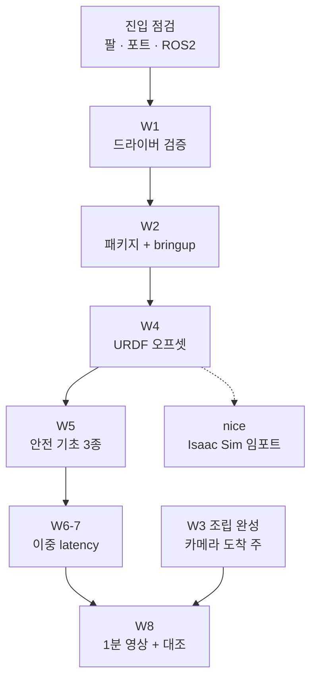

# Hardware-Arm Stage 1 - 가이드 (SO-101 본 빌드)

> **기간**: 2026.10-11 (2개월, 스파이크로 디리스크된 본 빌드 — 2026-08-30 실기 전환)
> **선행**: 2026.09 스파이크 판정 통과 (2026-09-20 must 4개, [실기 전환 plan](../../../docs/superpowers/plans/2026-08-30-realworld-transition-execution.md) §5.4). 팔은 이미 조립돼 LeRobot 으로 돈다 — 본 빌드의 초점은 **완성도 + ROS 2 층**
> **추가 지출 없음** (키트·카메라·자재는 2026.09 구매 완료, 전체 뷰 카메라 + 고정수단은 배송 중 — [../BOM.md](../BOM.md))
> **역할 분리**: 데이터·학습 = LeRobot / 배포·통합 = ROS 2 (같은 포트 — 동시에 한 스택만)

---

## Stage 1 일정

```
2026.10 첫 주 : ROS2 드라이버 검증 (구 스파이크 항목 인수)
                — 모터 1개 위치 명령 → 데이지체인 → 최소 URDF + RViz
2026.10       : ROS2 래핑 (feetech_ros2_driver + ros2_control) + 조립 완성
                (케이블 정리·손목 카메라 마운트·전체 뷰 카메라 교체 — 작업대 고정은 완료)
2026.11       : 안전 기초 (소프트 리밋·토크 상한·소프트웨어 정지) + URDF 오프셋 반영
                + 이중 latency 측정 + 1분 영상
                -> v2 선행 하드웨어. v2.5 (teleop 데이터셋 + SmolVLA) 병행 개시
```

---

## must / nice ([실기 전환 plan] §6 과 동일)

| 항목 | must/nice | 내용 |
|---|---|---|
| 조립 완성 | must | 케이블 정리, 손목 카메라 마운트, 전체 뷰 카메라 교체 (새 카메라 + 고정수단 — 장착, 고정 방식 확정 + 위치 마킹). 작업대 고정은 완료 |
| 안전 기초 | must | 소프트 리밋 (관절 범위) + 토크 상한 + 소프트웨어 정지 (키 또는 ROS2 서비스 호출로 토크를 유지한 채 현 위치 정지). 물리 전원 차단 스위치는 두지 않는다 — DC 차단은 토크 해제로 팔이 낙하한다 |
| ROS2 래핑 | must | `feetech_ros2_driver` + ros2_control 노드 — LeRobot 스택과 병행 운영 |
| URDF | must | SO-101 공개 URDF 재사용 + 캘리브레이션 오프셋 반영 |
| 이중 latency | must | (a) LeRobot 직결 / (b) ROS2 토픽 경유 — (b)-(a) = **통합 오버헤드** (셋째 층 증거) |
| 1분 영상 | must | teleop + 정책 실행 + 소프트웨어 정지 시연 |
| Isaac Sim 임포트 | nice | Phase 6 이월 허용 ([isaac_sim_import.md](isaac_sim_import.md)) |

---

## 학습 파일

| 파일 | 내용 |
|---|---|
| [../BOM.md](../BOM.md) | SO-101 구매 구성 + 키트 사양 (구매·조립 완료) |
| [URDF_guide.md](URDF_guide.md) | SO-101 공개 URDF 재사용 + 검증 |
| [ros2_driver_setup.md](ros2_driver_setup.md) | feetech_ros2_driver + ros2_control |
| [isaac_sim_import.md](isaac_sim_import.md) | Isaac Sim 임포트 (nice) |

---

## 진행 순서 (W1-W8)

> 주 단위 체크박스의 원본은 [master roadmap](../../../docs/superpowers/plans/2026-08-31-master-roadmap.md) §3 "10-11월 — Stage 1" 이다. **체크는 거기에만 한다.** 이 절은 그 W1-W8 을 "어느 문서의 어느 절을 어떤 순서로 열고, 끝나면 손에 무엇이 남아야 하는가" 로 풀어 쓴 것이다.
> "W" 는 달력의 주가 아니라 작업 묶음이다. 하나가 22시 이후 1-2시간 세션 2-3회 분량이다. 밀리면 다음 항목을 당기지 말고 버퍼 (2026.12-2027.02) 로 넘긴다.

### 왜 이 순서인가

가이드 파일은 3개지만 **파일 순서대로 읽지 않는다.** 한 주 안에서도 두 문서를 오간다. 순서를 정하는 것은 "무엇이 먼저 돌아야 다음 것을 확인할 수 있는가" 다.



- **W1 이 맨 앞**: 첫 관문은 "`feetech_ros2_driver` 가 이 컨테이너의 ROS 2 Jazzy 에서 빌드되는가" 다. 이후의 모든 주가 이 드라이버에 기대므로 가장 큰 불확실성을 가장 먼저 턴다.
- **W2 가 W1 뒤**: W1 은 드라이버가 빌드되고 실제 팔에서 값이 읽히고 한 관절이 움직이는 데까지다. W2 는 그 경로를 이루는 패키지 (`ros2_pkg/so101_description/`) 를 읽어 이해하고, 띄우기부터 끄기까지를 한 번에 통과시키는 주다. 돌아가는 것을 본 뒤에 읽어야 각 파일이 무엇을 하는지 보인다.
- **W4 가 W2 뒤**: 오프셋 맞추기는 "RViz 속 팔의 자세 = 실제 팔의 자세" 를 눈으로 대조하는 일이다. 실제 팔의 관절값이 RViz 로 흘러 들어오는 bringup (W2) 이 먼저 있어야 한다.
- **W5 가 W4 뒤**: 소프트 리밋 값은 URDF 의 `<limit>` 값과 같아야 한다. URDF 가 확정돼야 값이 정해진다.
- **W6-7 · W8 이 W5 뒤**: 둘 다 사람이 아니라 모델이 낸 명령을 ROS2 를 거쳐 팔에 보낸다. 그런 실행은 안전 기초가 선 뒤에 한다.
- **W3 은 떠 있는 항목**: 새 전체 뷰 카메라의 도착에 달려 있어서 번호 자리 (W2 와 W4 사이) 에 고정하지 않는다. 도착한 주에 끼워 넣는다. 마감은 두 개다 — W8 영상 (정책 실행에 카메라가 필요하다) 과 v2.5 본 수집 (카메라 시점이 데이터에 그대로 박히므로 수집 전에 고정돼 있어야 한다).

`URDF_guide.md` 의 §1 이하 (URDF 구조 · XACRO · mesh) 는 **미리 읽지 않는다.** W1 · W4 에서 URDF 를 고치다 막혔을 때 여는 사전이다.

### 매 세션 공통

- **`so101-attach` 부터 실행한다**: 세션을 시작할 때마다, USB 를 뽑았다 꽂은 뒤에도 실행한다. `ls -la /dev/so101_*` 로 노드가 보이는 것은 확인이 되지 않는다 — USB 를 뽑아도 노드 껍데기는 남아 있고, 열 때에야 실패한다. 실제로 연결돼 있는지는 `so101-attach list` 의 `serial boards` 아래에 `ttyACM` 줄이 있는지로 본다.
- **한 번에 한 스택**: LeRobot 과 ROS2 는 같은 시리얼 포트를 쓴다. LeRobot 프로세스가 살아 있으면 ROS2 드라이버가 모터를 못 찾고, 그 반대도 같다. 스택을 바꿀 때는 앞의 것을 완전히 끈다.
- **W5 전에는 안전 기초가 없다**: 그때까지 팔에 보내는 명령은 소각도로만, 팔 주변을 비우고 보낸다. 멈추는 법은 **USB 분리** (통신이 끊기고 팔로워가 현재 위치에서 멈춘다) 다. DC 어댑터는 뽑지 않는다 — 토크가 풀려 팔이 떨어진다 ([조립 가이드](../spike/week1/so-arm101-assembly-guide.md) §7).
- **ROS2 launch 를 끄면 팔이 떨어진다**: 드라이버는 종료할 때 모든 관절의 토크를 끈다 ([ros2_driver_setup.md](ros2_driver_setup.md) §1.2). `Ctrl+C` 를 누르기 전에 팔을 휴식 자세로 보내거나 손으로 받친다.
- **빌드는 `/workspace/so101_ws` 에서, venv 없이, 원본은 `ros2_pkg/` 에**: [ros2_driver_setup.md](ros2_driver_setup.md) §2. 레포 폴더 안에서 `colcon build` 를 돌리지 않는다.
- **작업한 날마다 커밋한다**: 스파이크는 구간 안에 커밋이 없어서 소요 시간을 확정하지 못했다 ([RESULT](../spike/week2/RESULT.md) §3 · §5).

### 진입 점검 (W1 전, 세션 1회 안쪽)

가이드는 미리 써 둔 것이라 지금의 저장소 · 환경과 어긋나 있을 수 있다. 또 W1 에서 막혔을 때 "ROS2 쪽 문제인가, 팔 쪽 문제인가" 를 가르려면 기준선이 필요하다.

- **여는 곳**: [조립 가이드](../spike/week1/so-arm101-assembly-guide.md) §7 (teleop 명령), [ros2_driver_setup.md](ros2_driver_setup.md) 헤더
- **하는 일**
  1. 팔로워 · 리더 보드의 USB 를 꽂고 `so101-attach` → 두 보드 모두 `[so101-attach] /dev/so101_... -> ttyACM...` 줄이 찍히는지 확인
  2. LeRobot teleop 을 1분 돌려 팔이 스파이크 때처럼 따라오는지 본다. 여기서 안 되면 ROS2 가 아니라 하드웨어 · 포트 문제다. 확인했으면 LeRobot 을 끈다
  3. `echo $ROS_DISTRO` 가 `jazzy` 인지 확인
  4. `feetech_ros2_driver` 저장소 README 에서 지원 배포판 · 플러그인 클래스 이름 · 파라미터 이름을 읽고, 가이드의 예시 ([ros2_driver_setup.md](ros2_driver_setup.md) §1 · §3, [URDF_guide.md](URDF_guide.md) 의 `<ros2_control>` 블록) 와 다르면 가이드를 고친다
- **끝나면 남는 것**: "LeRobot 으로는 돈다" 는 기준선 + 현재 저장소와 맞는 가이드

### W1 — ROS2 드라이버 검증

- **여는 곳 (순서대로)**: [ros2_driver_setup.md](ros2_driver_setup.md) 헤더 → §0 → §1 (선행 설치 → 빌드 → 드라이버의 사실) → §2 → §4.1 (팔 없이) → §4.2 (실제 팔)
- **ros2_control 이 무엇인가**: `feetech_ros2_driver` 는 혼자 도는 프로그램이 아니라 ros2_control 의 하드웨어 플러그인이다. ros2_control 은 ROS 2 에서 모터 같은 하드웨어를 "명령이 들어가는 입구 / 상태가 나오는 출구" 로 표준화하는 틀이다. 어느 포트의 몇 번 모터를 쓸지는 URDF 안의 `<ros2_control>` 블록에서, 어떤 컨트롤러를 띄울지는 yaml (§3) 에서 읽는다. 그래서 모터 하나를 움직이는 데에도 URDF · yaml · launch 가 다 필요하고, 이 셋은 `ros2_pkg/so101_description/` 에 들어 있다
- **하는 일**
  1. §1.0 선행 설치 → §1.1 빌드. Jazzy 에서 빌드되는지가 Stage 1 전체의 첫 관문이다. 받은 드라이버의 커밋이 §1.2 의 기준 커밋과 같은지 본다
  2. §2 — 패키지 원본 (레포) 을 워크스페이스에 심링크로 걸고 빌드한다. `rosdep install` 을 한 번 더 돌려 패키지가 기대는 것을 채운다
  3. §4.1 — 팔 없이 (`use_mock_hardware:=true`) 띄워 컨트롤러 2개가 active 인지, 명령이 어느 관절로 가는지, 두 토픽의 관절 순서가 다르다는 것을 확인한다
  4. §4.2 — 실제 팔에 띄운다. ② `/joint_states` 에 6개 이름과 값이 나오고, 손으로 읽은 팔의 자세와 값이 말이 되는지 본다 (휴식 자세인데 전부 0 근처로 나오면 어딘가 틀린 것이다)
  5. ① 첫 명령은 **읽은 위치 그대로 + 한 관절만 +0.05 rad** 다. `[0.1, 0, 0, 0, 0, 0]` 같은 명령을 보내면 나머지 다섯 관절이 가운데 자세로 한꺼번에 튄다 (§4.2 의 경고)
  6. ③ 화면으로 확인 — 이 컨테이너에는 화면이 없어 RViz 를 바로 띄울 수 없다. 볼 방법을 먼저 정한다: Foxglove (브리지를 띄우고 맥북에서 접속) 가 기본이고 VNC + RViz 가 최후 수단이다 ([ENVIRONMENT.md](../../../ENVIRONMENT.md) §4). URDF 자체는 `check_urdf` 로 화면 없이도 확인된다. 오프셋 맞추기 ([URDF_guide.md](URDF_guide.md) §0 의 3번) 는 W4 로 남긴다
- **끝나면 남는 것**: 빌드되는 드라이버, 실제 팔의 6축 `/joint_states`, 한 관절을 의도한 만큼 움직인 기록, 정해진 시각화 경로
- **막히면**: launch 가 하드웨어 초기화에서 죽으면 로그의 서보 id 를 본다 — 특정 id 에서만 실패하면 그 서보의 ID · 배선, 전부 실패하면 포트 · LeRobot 프로세스 점유 · 보드레이트다. 그다음 "자주 발생 문제" 표. Jazzy 빌드가 끝내 안 되면 W2 로 넘어가지 말고 그 사실을 master roadmap W1 아래에 적는다. 대안을 찾을 때는 [마스터 가이드](../../../Roadmap/Hardware-Arm.md) 참고 자료의 SO-101 ROS2 스택이 어떤 드라이버를 쓰는지부터 본다

### W2 — so101_description 패키지 + bringup

- **여는 곳**: [ros2_driver_setup.md](ros2_driver_setup.md) §2 → §3 → §4
- **하는 일**: 패키지의 파일 네 종류를 직접 열어 읽고, 각자가 무슨 일을 하는지 말로 설명할 수 있게 한다 — `urdf/so101.urdf.xacro` (끝의 `<ros2_control>` 블록), `config/so101_controllers.yaml`, `launch/display.launch.py` (팔 없이 URDF 만 본다), `launch/bringup.launch.py` (드라이버 + 컨트롤러). 그다음 §4.2 를 처음부터 끝까지 (띄우기 → 읽기 → 한 관절 명령 → 휴식 자세로 되돌리기 → 끄기) 한 번에 통과시킨다
- **끝나면 남는 것**: `ros2 launch so101_description bringup.launch.py` 한 줄로 팔이 ROS2 에 붙는 상태. 이후의 모든 주가 이 명령에서 출발한다
- **막히면**: 가장 흔한 것은 URDF 와 yaml 의 joint 이름 불일치다 ("자주 발생 문제" 표). mock 으로 띄웠을 때는 되는데 실제 팔에서만 안 되면 설정이 아니라 하드웨어 쪽이다

### W3 — 조립 완성 (카메라가 도착한 주에 끼워 넣는다)

- **여는 곳**: `stage1/` 에 전용 가이드가 없다. 재료는 master roadmap 의 W3 줄, [week2_guide](../spike/week2/week2_guide.md) §1.2-§1.5 (장착과 구도 · 고정 경로 · 설정 문자열 · 테스트 녹화), [조립 가이드](../spike/week1/so-arm101-assembly-guide.md) §5.8 (배선과 마감)
- **하는 일**
  1. 케이블 정리. 스파이크 데이터셋에는 손목 카메라 케이블이 화면에 찍혔다 ([RESULT](../spike/week2/RESULT.md) §1 행 2 의 결함 ⑤)
  2. 손목 카메라 마운트 점검
  3. 새 전체 뷰 카메라 장착 → `so101-attach` 의 `/dev/so101_cam_overview` 매핑을 새 카메라의 USB 시리얼로 바꾼다 → 새 카메라가 지원하는 해상도 · fps 를 다시 확인한다 (ELP 에서 쓰던 `fps: 60` 설정을 그대로 가져오지 않는다 — 지원 목록은 카메라마다 다르다)
  4. 고정 방식을 확정하고 카메라 위치를 작업대에 마킹한다
  5. week2_guide §1.5 방식으로 테스트 녹화 2 에피소드
- **주의**: 이 주의 확인 작업은 LeRobot 스택으로 한다. ROS2 bringup 을 끈 상태에서 한다
- **끝나면 남는 것**: 움직이지 않는 카메라 2대 + 위치 마킹 + 새 카메라의 설정 문자열 ([v2.5 PRACTICE](../v25/PRACTICE.md) 가 그대로 받아 쓴다)

### W4 — URDF 캘리브 오프셋 반영 · 검증

- **여는 곳**: [URDF_guide.md](URDF_guide.md) §0 의 3번 → "검증 단계" → 체크리스트. URDF 를 읽다 막히면 §1. 캘리브 json 의 위치는 [조립 가이드](../spike/week1/so-arm101-assembly-guide.md) §6.3
- **오프셋이 무엇인가**: LeRobot 캘리브레이션이 "여기가 0도" 라고 정한 자세와, URDF 가 0 rad 로 그리는 자세의 차이다. 어긋나 있으면 RViz 속 팔과 실제 팔이 다른 자세를 하고, 뒤에 올 Sim 매칭 (Phase 6) 도 같은 만큼 틀린다
- **하는 일**: bringup 을 띄우고 명령으로 자세를 몇 개 만든 뒤 RViz 의 자세와 실제 자세를 관절별로 대조한다. 어긋난 관절은 회전 방향 (부호) 과 영점을 `<origin rpy>` 또는 드라이버 오프셋으로 맞춘다. 대조 전에 단위부터 맞춘다 — LeRobot 은 도, URDF 는 rad, 서보는 12비트 스텝이다 ([ros2_driver_setup.md](ros2_driver_setup.md) "자주 발생 문제" 마지막 행)
- **끝나면 남는 것**: RViz 와 실물이 같은 자세를 하는 URDF (커밋), `check_urdf` 통과. (nice) Isaac Sim 임포트는 이 뒤에야 의미가 있다

### W5 — 안전 기초 3종

- **여는 곳**: `stage1/` 에 전용 가이드가 없다. 정의는 위 must 표의 "안전 기초" 행과 master roadmap 의 W5 줄이다. 재료는 [URDF_guide.md](URDF_guide.md) 체크리스트의 limit 항목, [ros2_driver_setup.md](ros2_driver_setup.md) §1.2 (토크 상한 = `max_torque_limit`, 서보 단 각도 한계 = `range_min` · `range_max`, 적은 값은 서보 EEPROM 에 기록된다는 점), [조립 가이드](../spike/week1/so-arm101-assembly-guide.md) §7, [Stage 2 안전 인터록](../stage2/safety_interlock.md) e-stop 절 (정지 동작의 정의 — Stage 2 가 이 주의 소프트웨어 정지를 C++ 로 인수한다)
- **하는 일**
  1. 소프트 리밋 — 기본 상태에서는 URDF 의 `<limit>` 가 적용되지 않는다 (bringup 로그: `Enforcing command limits is disabled. Command limits from URDF will be ignored.`). 켜는 방법부터 찾는다. 그다음 컨트롤러의 limit 을 URDF `<limit>` 와 같은 값으로 두고, 한계 밖 명령을 보냈을 때 팔이 한계를 넘지 않는지 확인 (명령이 거부되든 한계값으로 잘리든, 어느 쪽으로 동작하는지도 적어 둔다)
  2. 토크 상한 — 드라이버 파라미터로 건다. 상한을 너무 낮게 잡으면 팔이 중력을 못 이겨 목표 자세에 못 간다 (스파이크에서 `elbow_flex` 가 실제로 그랬다 — [RESULT](../spike/week2/RESULT.md) §4 #11). "팔을 든 자세를 유지할 수 있는 최소값" 을 먼저 재고 그 위로 잡는다
  3. 소프트웨어 정지 — 키 또는 ROS2 서비스 호출 1회로 명령 스트림을 끊고, 현재 위치를 목표로 써서 토크를 유지한 채 멈춘다. **팔이 이동하는 중에 걸어서** 그 자리에 서는지 확인한다 (명령을 끊기만 하면 마지막 목표까지 간다)
- **끝나면 남는 것**: 3종이 켜진 bringup. 이후의 정책 실행은 항상 이 상태에서 한다

### W6-7 — 이중 latency

- **여는 곳**: [ros2_driver_setup.md](ros2_driver_setup.md) §5 (5.1 → 5.3 → 5.4 순서로). 방법론의 출발점은 [week2_guide](../spike/week2/week2_guide.md) §4 와 `../spike/week2/scripts/measure_latency_smolvla.py`. 측정 스크립트는 `scripts/measure_latency_ros2.py` ((b)) 와 `scripts/measure_latency_lerobot.py` ((a)) 두 개다 — §5.4 의 표
- **무엇을 재는가**: 추론 시간이 아니라 **명령이 전달되는 길** 이다. 한 관절에 작은 계단 명령을 보내고 팔이 움직이기 시작할 때까지를, LeRobot 직결 (a) 과 ROS2 경유 (b) 로 각각 100번 잰다. 스파이크 must 4 는 팔 없이 추론만 쟀으므로 (a) 로 그대로 쓸 수 없다 (§5.1)
- **하는 일**: §5.3 의 측정 정의를 읽고 두 스크립트가 그것을 어떻게 맞추는지 (관측 주기 10 ms · 서보 가속도 · 명령 위상) 확인한다 → (b) mock (스크립트 검증 겸 하한 대조군) → (b) 실제 팔 → 스택 전환 → (a) → §5.5 의 검증 → Measurements 디렉토리 1개. 실제 팔은 W5 의 안전 기초가 선 뒤, 낮은 자세로 받친 채 돌린다
- **끝나면 남는 것**: (a) · (b) · (b)-(a) 의 mean / p95 와 그 측정 조건, §5.7 의 질문에 대한 자기 답

### W8 — 1분 영상 + 체크리스트 대조

- **여는 곳**: 이 문서의 must 표와 아래 완료 체크리스트
- **하는 일**: 영상은 장면 3개다 — teleop / 정책 실행 / 소프트웨어 정지 시연. 한 번에 이어 찍지 않고 장면별로 찍는다 (teleop 은 LeRobot 스택이라 ROS2 bringup 과 동시에 띄울 수 없다). 그다음 완료 체크리스트를 대조하고, 남은 must 는 버퍼 구간으로 넘긴다고 master roadmap 에 표시한다
- **끝나면 남는 것**: v2 선행 하드웨어 (1분 영상 + URDF)

### (nice) Isaac Sim 임포트

W4 뒤 아무 때나, 시간이 남을 때만 한다 ([isaac_sim_import.md](isaac_sim_import.md)). 로컬 사양 미달로 실패하면 기록만 남기고 Phase 6 로 넘긴다. must 를 밀어내지 않는다.

### v2.5 와 겹치는 구간

11월 (W5-W8) 에 [v2.5](../v25/README.md) 가 병행으로 시작된다. v2.5 의 0번 (측정 설계 1페이지) 은 팔을 쓰지 않아 어느 주와도 겹칠 수 있다. 팔을 쓰는 단계 (하네스 검증 · 본 수집) 는 W3 으로 카메라가 고정된 뒤에 한다. 한 세션에는 한 트랙만 잡는다.

---

## 완료 체크리스트

- [ ] ROS2 드라이버 검증 (모터 위치 명령 → 데이지체인 → 최소 URDF+RViz)
- [ ] 조립 완성 (케이블·손목 카메라·전체 뷰 카메라 교체. 작업대 고정은 완료)
- [ ] 안전 기초 — 소프트 리밋 + 토크 상한 + 소프트웨어 정지
- [ ] ROS2 래핑 — joint state / command 노드
- [ ] URDF — 공개 URDF 재사용 + 오프셋 반영, RViz 검증
- [ ] 이중 latency 측정 — (a)/(b)/통합 오버헤드
- [ ] 1분 영상 — teleop + 정책 실행 + 소프트웨어 정지
- [ ] (nice) Isaac Sim 임포트

---

## 참고

- [Roadmap/Hardware-Arm.md](../../../Roadmap/Hardware-Arm.md) — 마스터 가이드 (하드웨어 확정·비채택 기록)
- `feetech_ros2_driver` (ros2_control): https://github.com/JafarAbdi/feetech_ros2_driver
- LeRobot SO-101 문서: https://huggingface.co/docs/lerobot (진입 시 명령어 재확인)
- SO-101 공개 설계/URDF: https://github.com/TheRobotStudio/SO-ARM100
