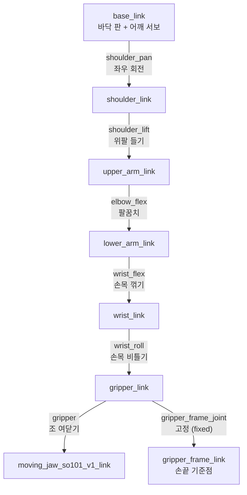
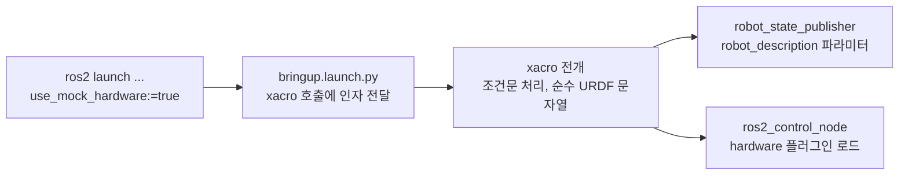

# Hardware-Arm Stage 1 - URDF 가이드 (SO-101 재사용 + 검증)


> 시기: 2026.10-11 (Stage 1) — **2026-08-30 갱신**: 처음부터 작성하지 않는다. **SO-101 공개 URDF 를 재사용**하고, 캘리브레이션 오프셋을 반영해 검증하는 것이 Stage 1 must 다.


---


## 0. 기본 경로 — SO-101 공개 URDF 재사용


1. 원본 확보: https://github.com/TheRobotStudio/SO-ARM100 (SO-101 URDF/STL — LeRobot 문서에서도 링크)
2. `so101_description/urdf/` 로 복사 후 joint 이름·mesh 경로를 패키지 기준으로 정리 — 패키지 원본은 이 레포의 `stage1/ros2_pkg/so101_description/` 이고 URDF 는 그 안 `urdf/` 한 곳에만 둔다 ([ros2_driver_setup.md](ros2_driver_setup.md) §2)
3. **캘리브레이션 오프셋 반영**: 스파이크의 LeRobot 캘리브레이션 (`lerobot-calibrate`) 영점과 URDF 영점을 대조 — 어긋나면 URDF 의 `<origin rpy>` 로 먼저 맞춘다. 드라이버의 `homing_offset` 은 서보 EEPROM 에 직접 기록돼 LeRobot 캘리브레이션과 같은 자리를 덮어쓰므로 마지막 수단이다 ([ros2_driver_setup.md](ros2_driver_setup.md) §1.2)
4. 아래 §1-§4 는 재사용한 URDF 를 **읽고 고치기 위한** 기초다 (백지 작성용 아님)


---


## 1. URDF 의 기본 구조 (읽는 법)

**URDF**(Unified Robot Description Format)는 로봇의 뼈대를 적은 XML 문서다. 내용은 두 종류뿐이다 — **링크**(link, 움직이지 않는 덩어리 하나) 와 **관절**(joint, 링크 두 개를 잇고 "어디서, 어느 축으로, 얼마나" 도는지). 관절이 링크를 부모 → 자식으로 이어 나무 (tree) 를 이루고, 뿌리가 `base_link` 다. 아래 예시는 전부 실제 파일 `ros2_pkg/so101_description/urdf/so101.urdf.xacro` 에서 가져온 것이다.

### 1.1 이 팔의 나무

노드가 링크, 화살표가 관절이다. 관절 이름이 곧 `/joint_states` 와 명령 토픽에 나오는 이름이다.



링크 8개, 관절 7개 (도는 관절 revolute 6개 + 고정 관절 fixed 1개). `gripper_frame_link` 는 부품이 없는 빈 링크로, "손끝이 어디인가" 를 가리키는 기준점 역할만 한다.

### 1.2 태그 사전

| 태그 | 뜻 | 이 파일에서 |
|---|---|---|
| `<robot name="...">` | 문서 전체를 감싸는 바깥 상자 | `so101` |
| `<link name="...">` | 뼈 하나. 부품 여러 개가 한 링크에 들어갈 수 있다 (서로 상대 위치가 고정이면 한 링크) | 8개 |
| `<joint name="..." type="...">` | 관절. `revolute` 는 각도 범위가 있는 회전, `fixed` 는 안 움직임 | 7개 |
| `<parent link>` · `<child link>` | 이 관절이 잇는 두 링크. 자식이 부모에 대해 움직인다 | 관절마다 1쌍 |
| `<origin xyz="..." rpy="...">` | "어디에, 어떻게 돌려서" 놓는가. `xyz` 는 m 단위 이동, `rpy` 는 rad 단위 회전 (roll · pitch · yaw = x · y · z 축 둘레) | joint 와 visual 양쪽에 나온다. **기준이 다르다** (§1.5) |
| `<axis xyz="...">` | 회전축. 자식 링크 좌표계 기준 | 전부 `0 0 1` (자식의 z 축) |
| `<limit lower upper effort velocity>` | 가동 범위 (rad) 와 힘 · 속도 상한 | 관절마다 다르다. 소프트 리밋의 원본 (W5) |
| `<visual>` | 화면에 그릴 모양. 부품 하나당 하나 | 17개 |
| `<collision>` | 충돌 계산용 모양. 여기서는 visual 과 같은 mesh 를 그대로 쓴다 | 17개 |
| `<inertial>` | 질량 · 무게중심 · 관성. 시뮬레이터가 쓴다. 실제 팔 구동에는 쓰이지 않는다 | 링크마다 1개 |
| `<mesh filename="package://...">` | 모양 파일 (STL). `package://패키지이름/경로` 로 ROS 패키지 안의 파일을 가리킨다 | `package://so101_description/meshes/*.stl` |
| `<material>` | 색 | 3D 프린트 부품은 노랑, 서보는 검정 |

파일 끝의 `<ros2_control>` 블록 안에도 `<joint>` 가 6개 있는데, 이것은 관절 정의가 아니라 "이 관절을 몇 번 서보가 움직이는가" 를 적은 것이다 (아래 "ros2_control 인터페이스 추가" 절).

### 1.3 실제 줄 읽기 — 링크

`base_link` 의 앞부분이다. 부품 세 개 (바닥 판, 모터 홀더, 어깨 서보) 가 한 링크에 들어 있는데 여기서는 하나만 보인다.

```xml
<link name="base_link">
  <inertial>
    <origin xyz="0.0137179 -5.19711e-05 0.0334843" rpy="0 0 0"/>
    <mass value="0.147"/>
    <inertia ixx="0.000114686" ixy="-4.59787e-07" ixz="4.97151e-06" iyy="0.000136117" iyz="9.75275e-08" izz="0.000130364"/>
  </inertial>
  <!-- Part base_motor_holder_so101_v1 -->
  <visual>
    <origin xyz="-0.00636471 -9.94414e-05 -0.0024" rpy="1.5708 -1.67685e-15 1.5708"/>
    <geometry>
      <mesh filename="package://so101_description/meshes/base_motor_holder_so101_v1.stl"/>
    </geometry>
    <material name="3d_printed"/>
  </visual>
  <collision>
    <origin xyz="-0.00636471 -9.94414e-05 -0.0024" rpy="1.5708 -1.67685e-15 1.5708"/>
    <geometry>
      <mesh filename="package://so101_description/meshes/base_motor_holder_so101_v1.stl"/>
    </geometry>
  </collision>
  ...
</link>
```

- `<inertial>`: 이 링크의 질량이 147 g 이고 무게중심이 링크 원점에서 앞 1.4 cm, 위 3.3 cm 라는 뜻. 실제 팔에서는 읽히지 않는다.
- `<visual>` 의 `<origin>`: STL 파일의 원점을 **이 링크의 좌표계 안에서** 어디에 놓을지다. `rpy="1.5708 0 1.5708"` 은 x 축으로 90도, z 축으로 90도 돌린다는 뜻이다. CAD 에서 내보낸 값이라 손댈 일이 없다.
- `<collision>` 은 `<visual>` 의 복사본이다. 충돌 계산이 필요한 시뮬레이터용이다.
- `-1.67685e-15` 같은 값은 0 이다. CAD 변환의 부동소수점 찌꺼기라 의미가 없다.

### 1.4 실제 줄 읽기 — 관절

`shoulder_pan` (base 위에서 팔 전체를 좌우로 돌리는 관절) 이다.

```xml
<joint name="shoulder_pan" type="revolute">
  <origin xyz="0.0388353 -8.97657e-09 0.0624" rpy="3.14159 4.18253e-17 -3.14159"/>
  <parent link="base_link"/>
  <child link="shoulder_link"/>
  <axis xyz="0 0 1"/>
  <limit effort="10" velocity="10" lower="-1.91986" upper="1.91986"/>
</joint>
```

| 줄 | 읽는 법 |
|---|---|
| `parent` / `child` | `base_link` 에 대해 `shoulder_link` 가 움직인다 |
| `origin xyz="0.0388 0 0.0624"` | 자식 링크의 원점 (= 이 관절의 회전 중심) 이 **부모 링크 원점 기준** 앞 3.9 cm, 위 6.2 cm 에 있다 |
| `origin rpy="3.14159 0 -3.14159"` | 자식 좌표계를 x 축으로 180도, z 축으로 -180도 돌린다. 결과는 z 축이 **아래**를 향하는 좌표계다 |
| `axis 0 0 1` | 그 (아래를 향한) z 축 둘레로 돈다. 그래서 +명령을 주면 위에서 봤을 때 시계 방향으로 돈다 |
| `limit lower / upper` | ±1.92 rad = ±110도. 관절값 0 이 범위의 가운데다 |

관절 6개의 `limit` 를 도 단위로 옮기면 다음과 같다. 관절값 0 이 모두 가운데라는 것이 `new_calib` 버전의 규약이다.

| 관절 | lower | upper | 도 단위 |
|---|---|---|---|
| shoulder_pan | -1.920 | +1.920 | ±110 |
| shoulder_lift | -1.745 | +1.745 | ±100 |
| elbow_flex | -1.690 | +1.690 | ±97 |
| wrist_flex | -1.658 | +1.658 | ±95 |
| wrist_roll | -2.744 | +2.841 | -157 / +163 |
| gripper | -0.175 | +1.745 | -10 / +100 |

### 1.5 숫자를 읽을 때 지킬 규칙

- **단위**: 길이는 m, 각도는 rad. 0.0624 는 6.24 cm, 1.5708 은 90도다. LeRobot 은 도 단위, 서보는 12비트 스텝이라 세 스택을 오갈 때 단위부터 맞춘다 ([ros2_driver_setup.md](ros2_driver_setup.md) "자주 발생 문제" 마지막 행).
- **`<origin>` 은 두 종류가 있고 기준이 다르다.** joint 의 origin 은 **부모 링크 기준**으로 자식 링크 좌표계를 어디에 두는가이고, visual 의 origin 은 **그 링크 기준**으로 부품 모양을 어디에 놓는가다. W4 에서 고치는 것은 joint 쪽이다.
- **관절값 0 은 "그대로" 가 아니라 "가동 범위의 가운데"** 다. 0 rad 일 때의 자세는 위팔 수직, 아래팔 수평으로 앞, 그리퍼 앞을 향하는 L 자다. 휴식 자세와 다르다.
- **링크 좌표계의 z 축 = 그 관절의 회전축**이다 (CAD 변환 프로그램의 규약). 그래서 Foxglove 에서 링크마다 축 방향이 제각각으로 보인다. `base_link` 만 x 앞 · y 왼 · z 위이고, 나머지는 회전축에 맞춰 돌아가 있다. 이것은 잘못이 아니고, 운동학에도 영향이 없다. 영향을 받는 것은 각 관절의 +방향 하나뿐이라 W4 에서 관절마다 실물과 대조한다.
- **오른손 규칙**: 회전축을 엄지로 잡았을 때 나머지 손가락이 감기는 방향이 +다.

### 1.6 이 파일에서 손대는 곳과 안 대는 곳

| 위치 | 하는 일 | 언제 |
|---|---|---|
| joint 의 `<origin rpy>` | 실물과 화면의 영점이 어긋난 관절을 맞춘다 | W4 |
| joint 의 `<limit>` | 소프트 리밋 값의 원본. 컨트롤러 limit 과 같아야 한다 | W5 |
| 파일 끝 `<ros2_control>` | 서보 id · 포트 · mock 분기 | 아래 절 |
| `<visual>` · `<collision>` · `<inertial>` · `<mesh>` | 손대지 않는다. 공개 URDF 의 수치 그대로다 | — |

### 1.7 읽는 순서 (처음 여는 사람에게)

1. `<joint>` 7개만 골라 `parent` → `child` 를 따라가며 §1.1 의 나무를 손으로 그려 본다.
2. 각 joint 의 `origin xyz` 를 뿌리부터 더해 가며 "이 관절이 base 에서 대략 어디쯤인가" 를 cm 로 적어 본다 (어깨 6 cm, 팔꿈치 23 cm 높이 부근이 나오면 맞다).
3. `axis` 와 `origin rpy` 로 어느 방향으로 도는지, `limit` 로 얼마나 도는지 본다.
4. 그다음에야 `<link>` 를 연다. visual 은 "그 자리에 어떤 부품이 보이는가" 이고, mesh 파일 이름이 부품 이름이다.
5. 눈으로 확인하고 싶으면 "검증 단계" 의 1번 (`check_urdf` 가 나무를 찍어 준다) 과 2번 (Foxglove) 을 돌린다.


---


## 2. xacro — 이 파일이 `.xacro` 인 이유

**xacro**(XML macro) 는 URDF 를 만들어 내는 전처리기다. 변수 · 매크로 · 조건문이 든 `.xacro` 파일을 읽어 순수 URDF 문자열을 내놓는다. ROS 2 노드가 받는 것은 항상 전개된 뒤의 URDF 이고, `.xacro` 는 사람이 편집하는 원본이다.

이 파일이 xacro 인 이유는 하나뿐이다. **launch 인자 `use_mock_hardware` 로 하드웨어 플러그인을 고르기 위해서**다. 링크와 관절은 CAD 변환기가 이미 전부 펼쳐 놓았기 때문에 매크로나 변수는 쓰지 않는다. 파일 전체에서 xacro 문법이 나오는 곳은 파일 끝의 이 12줄이 전부다.

```xml
<xacro:arg name="use_mock_hardware" default="false"/>

<ros2_control name="SO101Hardware" type="system">
  <hardware>
    <xacro:if value="$(arg use_mock_hardware)">
      <plugin>mock_components/GenericSystem</plugin>
    </xacro:if>
    <xacro:unless value="$(arg use_mock_hardware)">
      <plugin>feetech_ros2_driver/FeetechHardwareInterface</plugin>
      <param name="usb_port">/dev/so101_follower</param>
    </xacro:unless>
  </hardware>
  ...
```

| 문법 | 뜻 | 여기서 |
|---|---|---|
| `<xacro:arg name default>` | 밖 (launch) 에서 넘겨받는 값을 선언한다. 안 넘기면 `default` | `use_mock_hardware`, 기본 `false` |
| `$(arg 이름)` | 그 값이 들어갈 자리 | 두 조건문의 `value` |
| `<xacro:if value>` / `<xacro:unless value>` | 값이 참이면 / 거짓이면 안쪽 줄을 남기고, 아니면 통째로 지운다 | 참이면 mock 플러그인, 거짓이면 실제 드라이버 + 포트 |

### 2.1 값이 흘러가는 길



`bringup.launch.py` 가 `xacro so101.urdf.xacro use_mock_hardware:=<값>` 을 실행해 그 출력을 두 노드에 넘긴다. 그래서 `/robot_description` 토픽으로 흘러나오는 문자열에는 xacro 태그가 하나도 남아 있지 않다.

### 2.2 손으로 전개해 보기

launch 없이 xacro 만 돌려 조건문이 어떻게 갈리는지 눈으로 확인한다. 기대 출력은 각 블록 아래에 있다.

```bash
source /opt/ros/jazzy/setup.bash && xacro /workspace/study/physical-ai-study/Studies/Hardware-Arm/stage1/ros2_pkg/so101_description/urdf/so101.urdf.xacro | grep -n "<plugin>\|usb_port"
```

```
391:      <plugin>feetech_ros2_driver/FeetechHardwareInterface</plugin>
393:      <param name="usb_port">/dev/so101_follower</param>
```

```bash
source /opt/ros/jazzy/setup.bash && xacro /workspace/study/physical-ai-study/Studies/Hardware-Arm/stage1/ros2_pkg/so101_description/urdf/so101.urdf.xacro use_mock_hardware:=true | grep -n "<plugin>\|usb_port"
```

```
391:      <plugin>mock_components/GenericSystem</plugin>
```

전개 결과 전체를 파일로 남기려면 "검증 단계" 1번의 명령을 쓴다 (`/tmp/so101.urdf`).

### 2.3 고칠 때 규칙

- 인자를 하나 더 만들면 (`<xacro:arg>` 추가) `bringup.launch.py` 의 xacro 호출 줄에도 같은 이름으로 넘겨야 한다. 한쪽만 고치면 기본값으로만 돈다.
- 링크와 관절을 매크로로 묶어 "정리" 하지 않는다. 공개 URDF 의 수치를 그대로 둔다는 원칙 (§0) 이 깨지고, 원본과의 diff 가 커져 W4 에서 어느 값이 바뀌었는지 추적하기 어려워진다.
- 편집 뒤에는 반드시 다시 빌드한다. 패키지는 워크스페이스에 심링크로 걸려 있어 파일 수정이 바로 반영되지만 ([ros2_driver_setup.md](ros2_driver_setup.md) §2), 새 파일을 추가했을 때는 `colcon build` 가 필요하다.


---


## 3. 3D 프린트 부품 -> mesh 파일


```
1. Fusion 360 또는 OpenSCAD 로 디자인
2. STL 으로 export
3. ROS2 package 의 meshes/ 디렉토리에
4. URDF 에서 mesh filename="package://...
```


---


## 4. ros2_control 인터페이스 추가 (feetech)


```xml
<ros2_control name="SO101Hardware" type="system">
  <hardware>
    <!-- 플러그인 클래스명은 feetech_ros2_driver 버전으로 확인 (ros2_driver_setup.md §1) -->
    <plugin>feetech_ros2_driver/FeetechHardwareInterface</plugin>
    <!-- 컨테이너에서는 so101-attach 가 만드는 고정 경로를 쓴다 -->
    <!-- 보드레이트는 파라미터가 없다 — 드라이버 코드의 기본값이 1000000 이다 (ros2_driver_setup.md §1.2) -->
    <param name="usb_port">/dev/so101_follower</param>
  </hardware>
  <joint name="shoulder_pan">
    <param name="id">1</param>
    <command_interface name="position"/>
    <!-- 드라이버가 내보내는 상태는 position / velocity 두 개다 (effort 는 없다) -->
    <state_interface name="position"/>
    <state_interface name="velocity"/>
  </joint>
  <!-- 나머지 5 joint 동일 패턴 (shoulder_lift 2, elbow_flex 3, wrist_flex 4, wrist_roll 5, gripper 6) -->
</ros2_control>
```

실제로 쓰는 블록은 `ros2_pkg/so101_description/urdf/so101.urdf.xacro` 의 끝에 있다 (6 joint 전부 + 팔 없이 시험하는 `use_mock_hardware` 분기).


---


## 검증 단계

세 단계 모두 팔 없이 한다. 파일은 `so101.urdf` 가 아니라 xacro (`so101.urdf.xacro`) 라 먼저 `xacro` 로 전개한 뒤 검사한다. 이 컨테이너에는 화면 (`DISPLAY`) 이 없어 RViz 는 못 쓰고, 화면은 Foxglove 다 ([ros2_driver_setup.md](ros2_driver_setup.md) §4.3).

**1. 파싱 검증 + 트리 확인.** `check_urdf` 가 통과하면 링크 트리를 그대로 찍어 준다. 기대하는 트리는 `base_link → shoulder_link → upper_arm_link → lower_arm_link → wrist_link → gripper_link → {moving_jaw_so101_v1_link, gripper_frame_link}` 다.

```bash
source /opt/ros/jazzy/setup.bash && xacro /workspace/study/physical-ai-study/Studies/Hardware-Arm/stage1/ros2_pkg/so101_description/urdf/so101.urdf.xacro > /tmp/so101.urdf && check_urdf /tmp/so101.urdf
```

**2. 팔 없이 화면으로 보기.** 패키지의 `display.launch.py` 가 robot_state_publisher 와 joint_state_publisher (관절 전부 0) 를 띄운다. bringup 이 떠 있으면 먼저 끈다 — 두 노드가 같은 `/joint_states` 를 발행하게 된다. 브리지를 띄우고 Foxglove 로 붙는 방법은 §4.3 그대로다. 영점 자세 (위팔 수직, 아래팔 수평 앞, 그리퍼 앞) 가 보이면 된다.

```bash
source /opt/ros/jazzy/setup.bash && source /workspace/so101_ws/install/setup.bash && ros2 launch so101_description display.launch.py
```

**3. (선택) 트리 그림.** `urdf_to_graphviz` 가 만드는 PDF 는 컨테이너에서 열 수 없으므로 `.gv` 를 PNG 로 바꿔 VS Code 에서 연다. 트리 자체는 1번 출력으로 충분하다.

```bash
cd /tmp && urdf_to_graphviz /tmp/so101.urdf so101 && dot -Tpng so101.gv -o so101_tree.png
```


---


## 일반 문제


| 증상 | 해결 |
|---|---|
| Joint axis 잘못 | URDF 의 `<axis xyz=>` 확인 |
| Link 가 떠 있음 | `<origin>` xyz / rpy 확인 |
| Mesh 가 안 보임 | package:// path 확인 |
| Inertia 0 | mass + ixx/iyy/izz 추가 |
| 충돌 무시 | `<collision>` block 추가 |


---


## 체크리스트


- [ ] SO-101 공개 URDF 확보 + 패키지로 이식
- [ ] 캘리브레이션 오프셋 반영 (LeRobot 영점 대조)
- [ ] joint 6 + gripper 의 axis / origin / limit 확인 (소프트 리밋 값은 안전 기초와 일치)
- [ ] mesh 파일 로딩
- [ ] ros2_control 인터페이스 (feetech)
- [ ] check_urdf 통과
- [ ] RViz 시각화 정상
