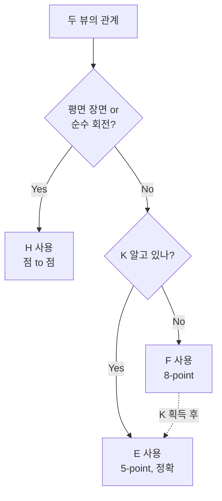
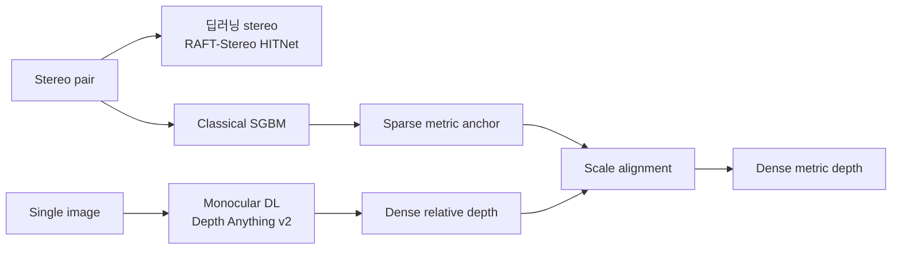
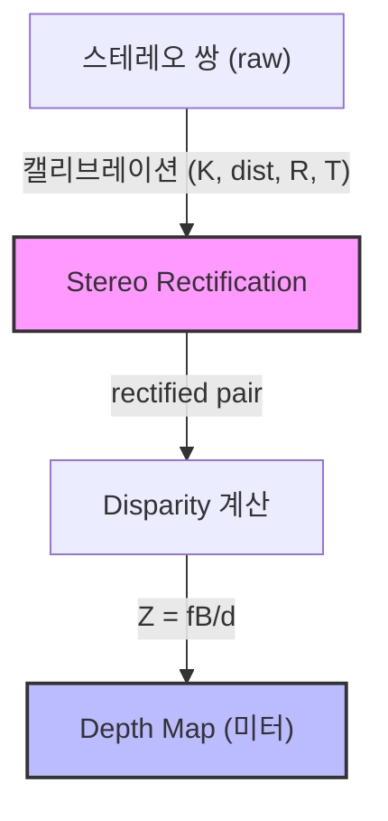

# Week 3: Multi-view 기하 + Stereo Rectification


## 개요


> **목표**: 에피폴라 제약을 이해하고 Stereo Rectification까지 한 흐름으로 연결
> **예상 시간**: 이론 2시간 + 실습 4시간


**Multi-view 기하**는 두 개 이상의 카메라로 같은 장면을 볼 때 성립하는 기하학적 관계입니다. 이 관계를 이용하면 2D 이미지에서 3D 깊이 정보를 복원할 수 있습니다.


### [?] 왜 이걸 배워야 할까요?


**Perception에서의 활용**:
- **Stereo Depth Network** (HITNet, CRE-Stereo, RAFT-Stereo): 입력은 **rectified stereo pair**. 이 전처리를 못하면 모델을 돌릴 수 없음
- **KITTI Stereo 벤치마크**: 직접 평가를 해보려면 rectification + disparity 파이프라인 이해 필수
- **Multi-camera BEV** (BEVFormer, BEVDet): 각 카메라의 intrinsic + extrinsic 정렬이 BEV 변환의 근간
- **Visual relocalization** (Phase 4 NeRF): 두 뷰의 상대 자세 추정은 NeRF/Gaussian Splatting 의 카메라 포즈 입력


---


## 학습 순서


| 순서 | 활동 | 파일 | 마치면 풀 퀴즈 |
|:----:|------|------|:-------------:|
| 1 | 데모 실행 — `./basic` 출력 + output/ 이미지 확인 | `basic.cpp` | - |
| 2 | 에피폴라 제약 이론 학습 | `README.md` | **easy 문제 1**: 에피폴라 선 계산 |
| 3 | Rectification 이론 학습 | `README.md` | **easy 문제 2**: Rectification 목적 |
| 4 | Disparity-Depth 공식 이해 | `README.md` | **easy 문제 3**: Z = fB/d 계산 |
| 5 | `my_basic.cpp` Step 1-6 구현 | `my_basic.cpp` | - |
| 6 | 중급 퀴즈 풀기 | `quiz_medium.cpp` | **medium 문제 1-2** |
| 7 | **KITTI 검증 실습** (출장지 원격 PC) | [PRACTICE.md](./PRACTICE.md) 5단계 | - |
| 8 | (선택) **ELP 실카메라 캘리브 실습** | [PRACTICE.md](./PRACTICE.md) 6단계 | - |
| 9 | (선택) **Classical vs Learning-based Depth 비교** | [PRACTICE.md](./PRACTICE.md) 7단계 | - |


---


## Step 1: 먼저 돌려보기


```bash
cd week3 && mkdir build && cd build
cmake .. && make
./basic
```


`output/` 에 저장된 이미지를 열어보세요:
- `03_rectified_pair.png`의 수평 초록선이 두 이미지를 가로질러 정렬되었는지 확인
- `04_disparity.png`에서 가까운 물체(warm color)와 먼 물체(cool color)의 차이 확인


---


## 핵심 개념


### 1. 에피폴라 제약 (Epipolar Constraint)


두 카메라에서 같은 3D 점을 관측하면, 해당 점의 투영은 에피폴라 제약을 만족합니다:


```
p₂ᵀ · F · p₁ = 0
```


- `F`: Fundamental Matrix (3×3) — 두 카메라의 상대 기하 관계
- `p₁`: 왼쪽 이미지의 점 (동차 좌표)
- `p₂`: 오른쪽 이미지의 대응점 (동차 좌표)


**기하학적 의미**: 왼쪽 이미지의 점 p₁에 대응하는 오른쪽 이미지의 점은 **에피폴라 선** 위에만 존재합니다.


```
왼쪽 이미지: 오른쪽 이미지:
+----------+ +----------+
| *p₁ | | -------- | ← 에피폴라 선 (p₂는 이 선 위)
| | | *p₂ |
+----------+ +----------+
```


→ 2D 전체 탐색이 **1D 선 탐색**으로 줄어듦


#### 제약이 성립하기 위한 7가지 조건


제약은 공짜로 성립하지 않습니다. 아래 조건이 **모두** 만족돼야 합니다:


| # | 조건 | 깨질 때 | 해결 |
|---|------|---------|------|
| 1 | **Pinhole 카메라 모델** (중심 투영) | 어안, rolling shutter, catadioptric | Fisheye 모델로 undistort |
| 2 | **정확한 내부 K + 왜곡 보정** | 에피폴라 선 평행 이동/휨 | 정밀 캘리브, `undistort` 선행 |
| 3 | **고정된 외부 자세 (R, t)** | 진동, 열팽창으로 baseline 변동 | Online self-calibration |
| 4 | **Rigid & static scene** | 움직이는 사람/차량 | Outlier 처리, semantic mask |
| 5 | **Non-degenerate 3D 분포** | 한 평면만 있음 (F 불안정) → H 로 대체 | H-F 경쟁 추정 |
| 6 | **정확한 대응점 8쌍 이상 + 분포** | Outlier, 편중된 매칭 | RANSAC, normalized 8-point |
| 7 | **시간 동기 (stereo rig)** | USB 트리거 지연 → 동적 장면 어긋남 | 하드웨어 동기 카메라 |


→ 실카메라에서 **y-disparity < 1-2 px** 를 검증 기준으로 두는 이유가 바로 이 조건들이 현실에서 완벽히 성립하지 않기 때문입니다. 증상이 나오면 "구현이 틀렸나"보다 먼저 "어느 조건이 깨졌나"를 역추적하는 것이 올바른 디버깅 순서.


### 2. 세 가지 행렬: H, F, E


세 개 다 3×3 행렬이라 헷갈리지만, **하는 일과 성립 조건이 다릅니다.**


#### (1) 하는 일의 차이 — 점 → 점 vs 점 → 선


| 행렬 | 입력 → 출력 | 의미 |
|------|-------------|------|
| **Homography (H)** | 점 → **점** | 한 점이 다른 이미지에서 어느 점으로 갔는지 정확히 |
| **Fundamental (F)** | 점 → **선** | 한 점이 다른 이미지의 어느 에피폴라 선 위에 있는지 |
| **Essential (E)** | 점 → **선** | F 와 같으나 정규화 좌표계 (K 제거 버전) |


#### (2) 성립 조건의 차이


| 행렬 | 장면 조건 | K 필요? | 최소 점수 | DoF |
|------|-----------|---------|-----------|-----|
| H | **평면 장면** 또는 **순수 회전** | 불필요 | 4쌍 | 8 |
| F | 일반 3D + baseline 있음 | 불필요 | 7-8쌍 | 7 |
| E | 일반 3D + baseline + K 있음 | **필요** | 5쌍 | 5 |


중요: **H 와 F/E 는 상호 배제적 경향**. 장면이 평면이면 H 가 잘 되고 F 는 degenerate, 일반 3D 면 F 가 잘 되고 H 는 대표성이 없음.


#### (3) 연결 공식


```
H = K₂ · (R + t·nᵀ/d) · K₁⁻¹ (n, d: 평면 법선과 거리)
F = K₂⁻ᵀ · E · K₁⁻¹
E = [t]× · R
```


#### (4) "F 는 K 가 필요 없다" vs "F 는 K 정보를 담는다" — 상충 해결


초심자가 가장 많이 헷갈리는 지점. **F 에 대한 세 가지 행동을 분리**해서 보면 모순이 사라집니다:


| 행동 | K 필요? | 이유 |
|------|---------|------|
| (A) F 를 **추정** (대응점 8쌍 이상) | 불필요 | 추정식 `p₂ᵀ F p₁ = 0` 에 K 가 등장하지 않음 |
| (B) F 로 **에피폴라 선 긋기 / outlier 판별** | 불필요 | F 자체가 이미 변환 정보를 담음 |
| (C) F 에서 **R, t 를 꺼내기 (분해)** | **필요** | `E = K₂ᵀ F K₁` 변환 후 SVD |


핵심: F 의 9개 숫자에는 K₁, K₂, R, t 의 효과가 **녹아든 상태**로 들어가 있습니다. 섞여 있을 땐 K 없이 측정/사용 가능하지만, **성분별로 분리하려면** K 가 있어야 합니다. 같은 3D 장면이라도 카메라를 바꾸면 (K 가 달라지면) F 값 자체도 바뀝니다.


#### (5) 언제 무엇을 쓰는가





실무 기준:
- **Stereo rig, KITTI, 캘리브된 카메라** → **E** (가장 정확)
- **AR 마커, 파노라마 stitching, 문서 스캔** → **H**
- **구형 사진, 인터넷 SfM, K 미지 상황** → **F** 로 시작 후 self-calibrate → E


#### (6) OpenCV 매핑


| 행렬 | 계산 | R, t 복원 |
|------|------|-----------|
| H | `cv::findHomography` | `cv::decomposeHomographyMat` |
| F | `cv::findFundamentalMat` | K 필요 → E 변환 후 |
| E | `cv::findEssentialMat` | `cv::recoverPose` |


### 3. Stereo Rectification


**목적**: 두 이미지를 같은 평면에 정렬하여 에피폴라 선을 **수평**으로 만들기


```
Rectification 전: Rectification 후:
+----------+ +----------+ +----------+ +----------+
| \ | | / | | | | |
| * | | * | --> | --*----- | | -----*-- | ← 수평!
| \ | | / | | | | |
+----------+ +----------+ +----------+ +----------+
  에피폴라 선이 기울어짐 수평으로 정렬됨
```


**결과**: 같은 행(row)에서 x 좌표 차이만으로 disparity 계산 가능


OpenCV 파이프라인:
1. `cv::stereoRectify` → R1, R2, P1, P2, Q 계산
2. `cv::initUndistortRectifyMap` → 각 카메라의 remap 테이블
3. `cv::remap` → rectified 이미지 생성


### 4. Disparity <-> Depth


```
Z = fB / d


Z: 깊이 (미터)
f: 초점 거리 (픽셀)
B: baseline (미터)
d: disparity (픽셀) = u_left - u_right
```


| d (px) | Z (m) | 의미 |
|--------|-------|------|
| 60 | 1.0 | 매우 가까운 물체 |
| 30 | 2.0 | 가까운 물체 |
| 10 | 6.0 | 중간 거리 |
| 1 | 60.0 | 매우 먼 물체 |


→ **반비례 관계**: d가 2배 → Z가 절반


### 5. (보조) RANSAC


특징점 매칭에는 outlier(잘못된 매칭)가 섞이기 마련입니다. **RANSAC**(Random Sample Consensus)은 outlier가 많은 데이터에서 robust하게 모델을 추정하는 방법입니다.


`cv::findFundamentalMat(pts1, pts2, cv::FM_RANSAC, 3.0, 0.99)` 에서:
- `3.0`: 에피폴라 선까지의 거리 허용치 (px)
- `0.99`: 성공 확률


### 6. Classical 기하학 vs Learning-based Depth


현대 perception 에서는 기하학 기반과 딥러닝 기반 방법이 **경쟁이 아니라 상호보완** 관계입니다.


#### 원리와 특성 차이


| 항목 | Classical (SGBM, SfM) | Learning-based (Depth Anything, MiDaS) |
|------|------------------------|------------------------------------------|
| 원리 | Triangulation (기하) | Learned scene prior |
| 입력 | Stereo pair / multi-view | 단일 이미지도 가능 |
| Scale | Metric (baseline 알면) | Relative (monocular 시) |
| Textureless 처리 | 구멍 (invalid mask) | Smooth gradient 로 채움 |
| 실패 모드 | 명시적 (invalid 표시) | Silent (자신 있게 틀림) |
| 일반화 | 새 환경 OK (캘리브만) | Train/test 분포에 취약 |
| 해석 가능성 | 오차 bound 수식으로 분석 | 블랙박스 |
| 연산 특성 | SIMD/FPGA 친화 | GPU/NPU 친화 |


#### Classical 이 실패하는 4가지 상황


1. **Textureless** (벽, 하늘): cost function 이 모든 disparity 에서 동일 → 매칭 실패
2. **Repetitive pattern** (벽돌, 창문 격자): 주기성 때문에 다중 local minimum
3. **Occlusion**: 전경 경계 — 한쪽에만 보이는 픽셀은 대응점 자체가 없음
4. **비-Lambertian 표면** (유리, 금속): photometric consistency 가정 깨짐


→ 딥러닝은 **학습된 scene prior (원근감, 물체 크기, 그림자 등)** 로 이 영역을 "추측"해서 메웁니다.


#### Hybrid 가 표준





- **딥러닝 stereo**: 기하 제약(epipolar) + 학습된 매칭 → 두 장점 결합
- **Monocular + sparse metric fusion**: 학습 prior + 기하 scale anchor
- **Depth completion**: sparse LiDAR + 이미지 → dense depth


이번 주 파이프라인의 rectified pair 가 여전히 입력으로 쓰입니다. **기하 전처리는 딥러닝 시대에도 사라지지 않습니다.**


실습: [PRACTICE.md 7단계](./PRACTICE.md) 에서 SGBM 과 Depth Anything v2 를 같은 장면에 적용해 직접 비교.


---


## Perception에서 어디에 쓰이나


### Stereo Depth Network (HITNet, CRE-Stereo, RAFT-Stereo)
- **입력**: rectified stereo pair
- **출력**: dense disparity map
- **후처리**: `Z = fB/d` 로 미터 단위 depth 복원
- 이번 주에 배운 전처리(rectification)가 없으면 모델을 돌릴 수 없음


### Monocular Depth (Depth Anything v2, MiDaS, ZoeDepth)
- **입력**: 단일 이미지 (baseline / rectify 불필요)
- **출력**: relative depth (일부 모델은 metric)
- **한계**: monocular 는 본질적으로 scale-invariant → stereo/LiDAR 의 sparse metric 과 **fusion** 하는 것이 현대 표준
- 이번 주 파이프라인 결과를 scale anchor 로 써서 학습 출력을 metric 화 가능


### KITTI Stereo 벤치마크
- KITTI 는 이미 rectified 이미지를 제공 (이 전처리가 적용된 상태)
- 평가 지표: EPE (End-Point Error), D1 (disparity error rate)
- 직접 데이터셋으로 평가해보려면 이 파이프라인 이해가 필수


### Multi-camera BEV (BEVFormer, BEVDet)
- nuScenes 6 카메라의 intrinsic + extrinsic 정렬이 BEV 변환의 근간
- 이번 주 배운 stereo 기하가 multi-camera 로 확장된 형태


---


## 핵심 정리


### 파이프라인





### 핵심 공식


| 개념 | 공식 | 의미 |
|------|------|------|
| 에피폴라 제약 | p₂ᵀFp₁ = 0 | 대응점은 에피폴라 선 위 |
| F 의 구조 | F = K₂⁻ᵀ [t]× R K₁⁻¹ | K, R, t 가 한 행렬에 녹아든 형태 |
| E-F 관계 | E = K₂ᵀ F K₁ | E 는 K 제거된 순수 기하 버전 |
| Homography (평면) | p₂ = H p₁ | 평면 / 순수회전 장면의 점 → 점 매핑 |
| Disparity→Depth | Z = fB/d | 미터 단위 depth 복원 |


### 세 행렬 한 줄 요약


| 행렬 | 출력 | 장면 | K | 용도 |
|------|------|------|---|------|
| H | 점 → 점 | 평면 / 순수회전 | 불필요 | Stitching, AR 마커 |
| F | 점 → 선 | 일반 3D | 불필요 | Uncalibrated 대응 정제 |
| E | 점 → 선 | 일반 3D | 필요 | Calibrated 기하 복원 |


---


## 학습 완료 체크리스트


### 기초 이해 (필수)
- [ ] 에피폴라 제약의 기하학적 의미 설명 가능
- [ ] 에피폴라 제약이 성립하는 7가지 조건 열거 가능
- [ ] H, F, E 의 차이 설명 가능 (점→점 vs 점→선, K 필요 여부, 장면 조건)
- [ ] "F 는 K 없이 추정 가능하지만 K 정보를 담고 있다" 의 의미 설명 가능
- [ ] Rectification 이 왜 필요한지 한 문장으로 설명 가능
- [ ] Z = fB/d 공식의 각 항의 단위와 의미 알기
- [ ] RANSAC 이 왜 필요한지 설명 가능


### 실용 활용 (권장)
- [ ] OpenCV `stereoRectify` + `remap` 파이프라인 구현 가능
- [ ] `StereoBM` 으로 disparity map 생성 가능
- [ ] Rectification 품질을 y-disparity 오차로 검증 가능
- [ ] y-disparity 가 클 때 7가지 조건 중 어느 게 깨졌는지 역추적 가능
- [ ] KITTI 공식 rectified 이미지와 본인 구현 결과의 픽셀 diff 측정 가능
- [ ] Rerun.io 로 disparity / depth map 시각화 가능
- [ ] (선택) ELP 실카메라로 mono/stereo 캘리브 → rectify y-disparity < 1 px 확인


### 심화 (선택)
- [ ] KITTI stereo 벤치마크의 입력/출력 형식 이해
- [ ] StereoBM vs StereoSGBM 차이 설명 가능
- [ ] Classical SGBM 의 실패 상황 4가지 (textureless / repetitive / occlusion / 비-Lambertian) 설명 가능
- [ ] Depth Anything v2 같은 monocular depth 와 stereo 의 차이 및 hybrid 구조 이해


---


## 다음 단계


### Week 4: 삼각측량 + PnP (하이브리드 방식)


scratch 구현은 **생략**하고 이론 정독 + OpenCV API + KITTI/nuScenes 실습으로 진행합니다.
Week 3 에서 rectify scratch 로 수학을 한 번 체화했으니, Week 4 는 **데이터셋 감각** 쌓기에 집중 (Phase 3 워크플로우의 전초).


핵심 주제:
- **삼각측량**: 두 뷰에서 관측한 점의 3D 위치 복원
- **PnP**: 3D-2D 대응에서 카메라 포즈 추정
- **재투영 오차**: Monocular 3D Detection 의 평가 지표


---


## 참고 자료


- *Multiple View Geometry* (Hartley & Zisserman) — Chapter 9 (epipolar geometry), 11 (F/E), 13 (H)
- OpenCV: [Stereo Calibration and Rectification](https://docs.opencv.org/4.x/dd/d53/tutorial_py_depthmap.html)
- HITNet / RAFT-Stereo 논문 — Stereo network 입력 조건
- Depth Anything v2 — Foundation monocular depth 모델
- KITTI 데이터셋 README — calibration 형식 설명
- 학습 환경 / 원격 작업 가이드: [ENVIRONMENT.md](../../../ENVIRONMENT.md)
