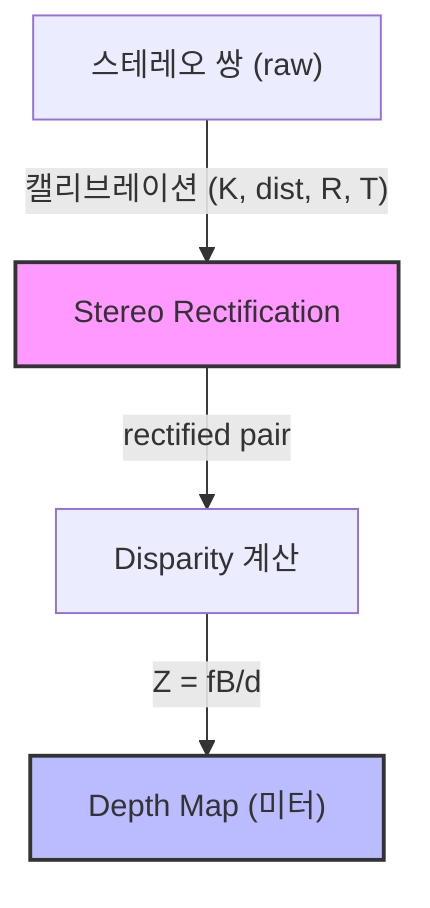

# Week 3: Multi-view 기하 + Stereo Rectification

## [pin] 개요

> [goal] **목표**: 에피폴라 제약을 이해하고 Stereo Rectification까지 한 흐름으로 연결
> [time] **예상 시간**: 이론 2시간 + 실습 4시간

**Multi-view 기하**는 두 개 이상의 카메라로 같은 장면을 볼 때 성립하는 기하학적 관계입니다. 이 관계를 이용하면 2D 이미지에서 3D 깊이 정보를 복원할 수 있습니다.

### [?] 왜 이걸 배워야 할까요?

**Perception에서의 활용**:
- **Stereo Depth Network** (HITNet, CRE-Stereo, RAFT-Stereo): 입력은 **rectified stereo pair**. 이 전처리를 못하면 모델을 돌릴 수 없음
- **KITTI Stereo 벤치마크**: 직접 평가를 해보려면 rectification + disparity 파이프라인 이해 필수
- **Multi-camera BEV** (BEVFormer, BEVDet): 각 카메라의 intrinsic + extrinsic 정렬이 BEV 변환의 근간
- **Visual relocalization** (Phase 4 NeRF): 두 뷰의 상대 자세 추정은 NeRF/Gaussian Splatting 의 카메라 포즈 입력

---

## [list] 학습 순서

| 순서 | 활동 | 파일 | 마치면 풀 퀴즈 |
|:----:|------|------|:-------------:|
| 1 | 데모 실행 — `./basic` 출력 + output/ 이미지 확인 | `basic.cpp` | - |
| 2 | 에피폴라 제약 이론 학습 | `README.md` | **easy 문제 1**: 에피폴라 선 계산 |
| 3 | Rectification 이론 학습 | `README.md` | **easy 문제 2**: Rectification 목적 |
| 4 | Disparity-Depth 공식 이해 | `README.md` | **easy 문제 3**: Z = fB/d 계산 |
| 5 | `my_basic.cpp` Step 1~6 구현 | `my_basic.cpp` | - |
| 6 | 중급 퀴즈 풀기 | `quiz_medium.cpp` | **medium 문제 1~2** |
| 7 | **KITTI 검증 실습** (출장지 원격 PC) | [PRACTICE.md](./PRACTICE.md) 5단계 | - |
| 8 | (선택) **ELP 실카메라 캘리브 실습** | [PRACTICE.md](./PRACTICE.md) 6단계 | - |

---

##  Step 1: 먼저 돌려보기

```bash
cd week3 && mkdir build && cd build
cmake .. && make
./basic
```

`output/` 에 저장된 이미지를 열어보세요:
- `03_rectified_pair.png`의 수평 초록선이 두 이미지를 가로질러 정렬되었는지 확인
- `04_disparity.png`에서 가까운 물체(warm color)와 먼 물체(cool color)의 차이 확인

---

## [ref] 핵심 개념

### 1. 에피폴라 제약 (Epipolar Constraint)

두 카메라에서 같은 3D 점을 관측하면, 해당 점의 투영은 에피폴라 제약을 만족합니다:

```
p₂ᵀ · F · p₁ = 0
```

- `F`: Fundamental Matrix (3×3) — 두 카메라의 상대 기하 관계
- `p₁`: 왼쪽 이미지의 점 (동차 좌표)
- `p₂`: 오른쪽 이미지의 대응점 (동차 좌표)

**기하학적 의미**: 왼쪽 이미지의 점 p₁에 대응하는 오른쪽 이미지의 점은 **에피폴라 선** 위에만 존재합니다.

```
왼쪽 이미지:          오른쪽 이미지:
+----------+         +----------+
|    *p₁   |         | -------- |  ← 에피폴라 선 (p₂는 이 선 위)
|          |         |     *p₂  |
+----------+         +----------+
```

→ 2D 전체 탐색이 **1D 선 탐색**으로 줄어듦

### 2. Essential / Fundamental Matrix

| 항목 | Essential (E) | Fundamental (F) |
|------|--------------|-----------------|
| 입력 | 정규화 좌표 (K 보정 후) | 픽셀 좌표 (보정 전) |
| 관계 | `F = K₂⁻ᵀ E K₁⁻¹` | `E = K₂ᵀ F K₁` |
| OpenCV | `cv::findEssentialMat` | `cv::findFundamentalMat` |
| 자유도 | 5 | 7 |

### 3. Stereo Rectification

**목적**: 두 이미지를 같은 평면에 정렬하여 에피폴라 선을 **수평**으로 만들기

```
Rectification 전:                   Rectification 후:
+----------+ +----------+          +----------+ +----------+
|  \       | |       /  |          |          | |          |
|   *      | |      *   |   -->    | --*----- | | -----*-- |  ← 수평!
|    \     | |     /    |          |          | |          |
+----------+ +----------+          +----------+ +----------+
  에피폴라 선이 기울어짐               수평으로 정렬됨
```

**결과**: 같은 행(row)에서 x 좌표 차이만으로 disparity 계산 가능

OpenCV 파이프라인:
1. `cv::stereoRectify` → R1, R2, P1, P2, Q 계산
2. `cv::initUndistortRectifyMap` → 각 카메라의 remap 테이블
3. `cv::remap` → rectified 이미지 생성

### 4. Disparity <-> Depth

```
Z = fB / d

Z: 깊이 (미터)
f: 초점 거리 (픽셀)
B: baseline (미터)
d: disparity (픽셀) = u_left - u_right
```

| d (px) | Z (m) | 의미 |
|--------|-------|------|
| 60 | 1.0 | 매우 가까운 물체 |
| 30 | 2.0 | 가까운 물체 |
| 10 | 6.0 | 중간 거리 |
| 1 | 60.0 | 매우 먼 물체 |

→ **반비례 관계**: d가 2배 → Z가 절반

### 5. (보조) RANSAC

특징점 매칭에는 outlier(잘못된 매칭)가 섞이기 마련입니다. **RANSAC**(Random Sample Consensus)은 outlier가 많은 데이터에서 robust하게 모델을 추정하는 방법입니다.

`cv::findFundamentalMat(pts1, pts2, cv::FM_RANSAC, 3.0, 0.99)` 에서:
- `3.0`: 에피폴라 선까지의 거리 허용치 (px)
- `0.99`: 성공 확률

---

## [link] Perception에서 어디에 쓰이나

### Stereo Depth Network (HITNet, CRE-Stereo)
- **입력**: rectified stereo pair
- **출력**: dense disparity map
- **후처리**: `Z = fB/d` 로 미터 단위 depth 복원
- 이번 주에 배운 전처리(rectification)가 없으면 모델을 돌릴 수 없음

### KITTI Stereo 벤치마크
- KITTI 는 이미 rectified 이미지를 제공 (이 전처리가 적용된 상태)
- 평가 지표: EPE (End-Point Error), D1 (disparity error rate)
- 직접 데이터셋으로 평가해보려면 이 파이프라인 이해가 필수

### Multi-camera BEV (BEVFormer, BEVDet)
- nuScenes 6 카메라의 intrinsic + extrinsic 정렬이 BEV 변환의 근간
- 이번 주 배운 stereo 기하가 multi-camera 로 확장된 형태

---

## [chart] 핵심 정리

### 파이프라인



### 핵심 공식

| 개념 | 공식 | 의미 |
|------|------|------|
| 에피폴라 제약 | p₂ᵀFp₁ = 0 | 대응점은 에피폴라 선 위 |
| E-F 관계 | F = K₂⁻ᵀEK₁⁻¹ | K 보정 여부 차이 |
| Disparity→Depth | Z = fB/d | 미터 단위 depth 복원 |

---

## [O] 학습 완료 체크리스트

### 기초 이해 (필수)
- [ ] 에피폴라 제약의 기하학적 의미 설명 가능
- [ ] Rectification 이 왜 필요한지 한 문장으로 설명 가능
- [ ] Z = fB/d 공식의 각 항의 단위와 의미 알기
- [ ] RANSAC 이 왜 필요한지 설명 가능

### 실용 활용 (권장)
- [ ] OpenCV `stereoRectify` + `remap` 파이프라인 구현 가능
- [ ] `StereoBM` 으로 disparity map 생성 가능
- [ ] Rectification 품질을 y-disparity 오차로 검증 가능
- [ ] KITTI 공식 rectified 이미지와 본인 구현 결과의 픽셀 diff 측정 가능
- [ ] Rerun.io 로 disparity / depth map 시각화 가능
- [ ] (선택) ELP 실카메라로 mono/stereo 캘리브 → rectify y-disparity < 1 px 확인

### 심화 (선택)
- [ ] KITTI stereo 벤치마크의 입력/출력 형식 이해
- [ ] StereoBM vs StereoSGBM 차이 설명 가능

---

## [link] 다음 단계

### Week 4: 삼각측량 + PnP (하이브리드 방식)

scratch 구현은 **생략**하고 이론 정독 + OpenCV API + KITTI/nuScenes 실습으로 진행합니다.
Week 3 에서 rectify scratch 로 수학을 한 번 체화했으니, Week 4 는 **데이터셋 감각** 쌓기에 집중 (Phase 3 워크플로우의 전초).

핵심 주제:
- **삼각측량**: 두 뷰에서 관측한 점의 3D 위치 복원
- **PnP**: 3D-2D 대응에서 카메라 포즈 추정
- **재투영 오차**: Monocular 3D Detection 의 평가 지표

---

## [ref] 참고 자료

- *Multiple View Geometry* (Hartley & Zisserman) — Chapter 9, 11
- OpenCV: [Stereo Calibration and Rectification](https://docs.opencv.org/4.x/dd/d53/tutorial_py_depthmap.html)
- HITNet 논문 — Stereo network 입력 조건
- KITTI 데이터셋 README — calibration 형식 설명
- 학습 환경 / 원격 작업 가이드: [ENVIRONMENT.md](../../../ENVIRONMENT.md)
