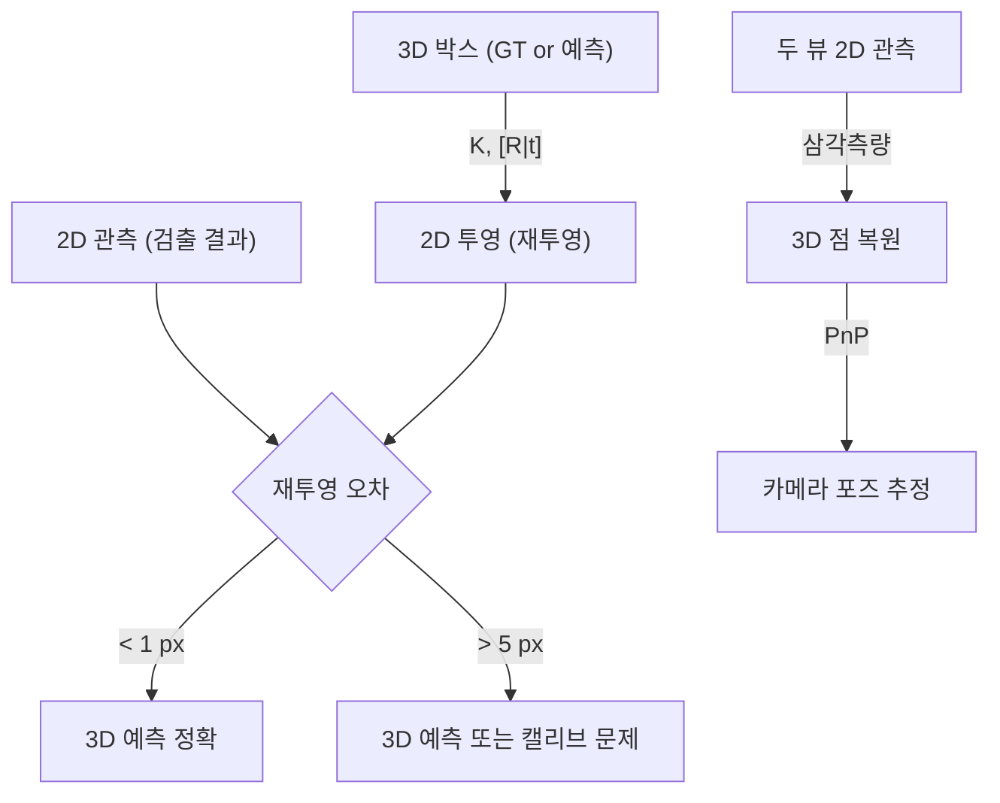

# Week 4: 삼각측량 + PnP (Perception 3D 맥락)

## [pin] 개요

> [goal] **목표**: 삼각측량과 PnP를 이해하고 Perception 3D Detection 평가의 기초 확보
> [time] **예상 시간**: 이론 2시간 + 실습 4시간

**삼각측량**은 두 시점에서 관측한 점의 3D 위치를 복원하는 연산이고, **PnP**는 알려진 3D-2D 대응에서 카메라 포즈를 추정하는 연산입니다. 이 두 연산은 Monocular 3D Detection, Multi-view Depth, 카메라 외재 캘리브레이션의 핵심 빌딩 블록입니다.

### [?] 왜 이걸 배워야 할까요?

**Perception에서의 활용**:
- **Monocular 3D Detection (FCOS3D, SMOKE, MonoFlex)**: 예측 3D 박스 8 코너를 2D에 투영 → **재투영 오차**로 검증, 학습 시 loss term으로 사용
- **nuScenes Multi-view**: 여러 카메라 관측 → 삼각측량으로 3D 위치 복원
- **BEV Detection 역연산**: Camera → BEV 변환의 수학적 기반
- **NeRF / Gaussian Splatting (Phase 4 preview)**: Multi-view 재구성의 기본 연산
- **카메라 외재 캘리브레이션**: 알려진 3D 패턴(체커보드)으로 PnP 풀어 카메라 포즈 추정

---

## [list] 학습 순서

| 순서 | 활동 | 파일 | 비고 |
|:----:|------|------|------|
| 1 | 데모 실행 (basic.cpp 결과 확인) | `basic.cpp` | - |
| 2 | 삼각측량 이론 학습 | `README.md` | - |
| 3 | PnP 이론 학습 | `README.md` | - |
| 4 | 재투영 오차 이해 | `README.md` | - |
| 5 | OpenCV API 실습 (my_basic.cpp 에서 API 호출 부분 채움) | `my_basic.cpp` | API 조립 중심 |
| 6 | KITTI 3D Object Detection 의 3D 박스 2D 재투영 | `PRACTICE.md` 4단계 | 원격 PC |
| 7 | nuScenes 샘플로 solvePnP 외재 추정 | `PRACTICE.md` 5단계 | 원격 PC |
| 8 | 중급 퀴즈 (개념 중심) | `quiz_medium.cpp` | 문제 1 scratch 는 풀이 선택 |

---

## 왜 scratch 구현을 생략하는가

- **수학 핵심은 Week 3 에서 경험 완료**: rectify scratch 로 행렬/좌표 변환을 직접 다뤘다
- **PnP/삼각측량 본질은 SVD + 수치 안정화**: 교육용 scratch 는 이해 비용만 크고 실무 가치 낮음
- **Perception 실무 무게중심**: API 호출 + 데이터셋 처리 — Phase 3, 4 와 직접 연결
- **재미와 지속성**: 즉시적 시각 피드백이 있는 데이터셋 실습이 동기부여 유지에 유리

## 코드 TODO 처리 지침

- `my_basic.cpp`: TODO 가 이미 OpenCV API 조립 중심으로 작성되어 있음. 순서대로 채우면 됨 (scratch 유도 블록 없음)
- `quiz_medium.cpp`:
  - **문제 1 (DLT 삼각측량 SVD scratch)**: 개념 이해만 하고 풀이는 선택
  - **문제 2 (RANSAC 반복 수 공식 계산)**: 권장 — 공식 적용 수준
- 학습 목표는 **"API 를 올바르게 조립하고 결과를 해석할 수 있다"** 이며, scratch 는 Week 3 에서 경험 완료로 간주

---

##  Step 1: 먼저 돌려보기

```bash
cd week4 && mkdir build && cd build
cmake .. && make
./basic
```

`output/` 에 저장된 이미지를 열어보세요:
- `01_3d_box_projections.png` — 두 카메라에서 본 3D 박스 (녹색 선)
- `02_reprojection_error.png` — 관측(녹색 원) vs 재투영(적색 원) 비교

---

## [ref] 핵심 개념

### 1. DLT 삼각측량

두 카메라에서 같은 3D 점 X를 관측하면:

```
카메라 1: p₁ = P₁ · X     (P₁ = K₁·[R₁|t₁])
카메라 2: p₂ = P₂ · X     (P₂ = K₂·[R₂|t₂])
```

이를 `AX = 0` 형태로 정리 (각 관측이 2개 식 → 총 4개 식, 미지수 4개):

```
A = [u₁·P₁[2] - P₁[0]]
    [v₁·P₁[2] - P₁[1]]
    [u₂·P₂[2] - P₂[0]]
    [v₂·P₂[2] - P₂[1]]
```

**SVD(A)** 의 마지막 특이벡터 → X (동차 좌표) → (X/W, Y/W, Z/W)

OpenCV: `cv::triangulatePoints(P1, P2, pts1, pts2, points4D)`

### 2. PnP 알고리즘

**문제**: n개의 3D-2D 대응 {(Xᵢ, pᵢ)} 에서 카메라 포즈 [R|t] 추정

| 알고리즘 | 최소 점 수 | 특징 |
|---------|----------|------|
| P3P | 3 (+1 모호성 해소) | 빠르지만 4개 해 중 선택 필요 |
| EPnP | 4 | 가상 제어점 기반, 효율적 |
| DLT | 6 | 단순하지만 점이 많이 필요 |
| Iterative (LM) | 4+ | 초기값 필요, 정확도 높음 |

OpenCV:
```cpp
cv::solvePnP(objectPoints, imagePoints, K, distCoeffs, rvec, tvec);
cv::solvePnPRansac(objectPoints, imagePoints, K, distCoeffs, rvec, tvec);
```

### 3. RANSAC + PnP

특징점 매칭에 outlier가 섞여 있을 때 RANSAC으로 robust 추정:

```
필요한 반복 수: N = log(1 - p) / log(1 - wⁿ)

p: 성공 확률 (0.99)
w: inlier 비율
n: 최소 점 수 (PnP = 4)
```

| inlier 비율 | 반복 수 (n=4, p=0.99) |
|------------|---------------------|
| 90% | 5 |
| 50% | 72 |
| 30% | 567 |
| 10% | 46,049 |

### 4. 재투영 오차 (Reprojection Error)

```
eᵢ = ||p_obs - π(K, R, t, Xᵢ)||₂
```

| 오차 | 판단 | Perception 맥락 |
|------|------|----------------|
| < 1 px | 우수 | 3D Detection 결과 신뢰 가능 |
| 1-3 px | 양호 | 실용적 수준 |
| > 5 px | 불량 | 3D 예측 또는 캘리브레이션 문제 |

---

## [link] Perception에서 어디에 쓰이나

### Monocular 3D Detection (FCOS3D, SMOKE, MonoFlex)
- 모델이 예측한 3D 박스의 8 코너를 2D 이미지에 **재투영**
- 재투영 결과와 2D 검출 결과의 일치도를 검증
- 학습 시 재투영 오차를 loss term 으로 사용하는 모델도 있음

### nuScenes Multi-view 객체 매칭
- 6 카메라에서 보인 같은 객체 → **삼각측량**으로 3D 위치 복원
- 카메라 extrinsic 이 정확해야 삼각측량 결과가 의미 있음

### BEV Detection 역연산
- Camera → BEV 변환은 본질적으로 3D→2D 투영의 역연산
- 이번 주에 배운 삼각측량 + PnP 가 수학적 기반

### NeRF / Gaussian Splatting (Phase 4 preview)
- Multi-view 이미지에서 3D 구조 복원 → 삼각측량의 확장
- 카메라 포즈 추정 → PnP (또는 SfM pipeline)

---

## [chart] 핵심 정리

### 파이프라인



---

## [O] 학습 완료 체크리스트

### 기초 이해 (필수)
- [ ] 삼각측량의 기하학적 원리 설명 가능
- [ ] PnP 가 풀고 있는 문제를 한 문장으로 설명 가능
- [ ] 재투영 오차의 의미와 단위 알기
- [ ] RANSAC 반복 수 공식의 각 항 의미 알기

### 실용 활용 (권장)
- [ ] `cv::triangulatePoints` 사용 가능
- [ ] `cv::solvePnP` / `cv::solvePnPRansac` 사용 가능
- [ ] `cv::projectPoints` 로 재투영 오차 계산 가능
- [ ] KITTI 3D Object Detection 의 3D 박스를 올바르게 2D 에 재투영 가능
- [ ] nuScenes 6-cam 샘플에서 solvePnP 로 외재 추정 가능
- [ ] Rerun.io 로 3D 점 / 박스 시각화 가능

### 심화 (선택)
- [ ] DLT 삼각측량을 SVD 로 직접 구현 가능
- [ ] P3P vs EPnP 의 차이 설명 가능

---

## [link] 다음 단계

Phase 2 완료 후 → **[Phase 3: Detection + Depth](../../Roadmap/Phase%203.md)** 로 직진.

Phase 3 는 PyTorch + 데이터셋 기반 딥러닝 흐름입니다. 이번 주의 KITTI/nuScenes 실습으로 **데이터셋 감각을 이미 선제 확보**했으므로 자연스럽게 이어집니다.

---

## [ref] 참고 자료

- *Multiple View Geometry* (Hartley & Zisserman) — Chapter 12 (Triangulation), 7 (PnP)
- OpenCV: [solvePnP](https://docs.opencv.org/4.x/d5/d1f/calib3d_solvePnP.html)
- FCOS3D 논문 — Monocular 3D detection 의 기하학적 후처리
- SMOKE 논문 — 재투영 기반 3D box 학습
- 학습 환경 / 원격 작업 가이드: [ENVIRONMENT.md](../../../ENVIRONMENT.md)
