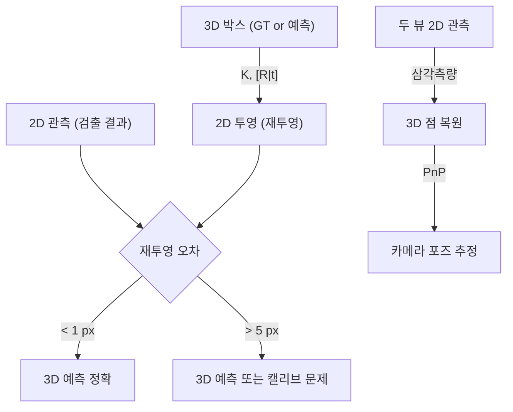

# Week 4: 삼각측량 + PnP (Perception 3D 맥락)


## 개요


> **목표**: 삼각측량과 PnP를 이해하고 Perception 3D Detection 평가의 기초 확보
> **예상 시간**: 이론 2시간 + 실습 4시간


**삼각측량**은 두 시점에서 관측한 점의 3D 위치를 복원하는 연산이고, **PnP**는 알려진 3D-2D 대응에서 카메라 포즈를 추정하는 연산입니다. 이 두 연산은 Monocular 3D Detection, Multi-view Depth, 카메라 외재 캘리브레이션의 핵심 빌딩 블록입니다.


### [?] 왜 이걸 배워야 할까요?


**Perception에서의 활용**:
- **Monocular 3D Detection (FCOS3D, SMOKE, MonoFlex)**: 예측 3D 박스 8 코너를 2D에 투영 → **재투영 오차**로 검증, 학습 시 loss term으로 사용
- **nuScenes Multi-view**: 여러 카메라 관측 → 삼각측량으로 3D 위치 복원
- **BEV Detection 역연산**: Camera → BEV 변환의 수학적 기반
- **NeRF / Gaussian Splatting (Phase 4 preview)**: Multi-view 재구성의 기본 연산
- **카메라 외재 캘리브레이션**: 알려진 3D 패턴(체커보드)으로 PnP 풀어 카메라 포즈 추정


---


## 학습 순서


| 순서 | 활동 | 파일 | 비고 |
|:----:|------|------|------|
| 1 | 데모 실행 (basic.cpp 결과 확인) | `basic.cpp` | - |
| 2 | 삼각측량 이론 학습 | `README.md` | - |
| 3 | PnP 이론 학습 | `README.md` | - |
| 4 | 재투영 오차 이해 | `README.md` | - |
| 5 | OpenCV API 실습 (my_basic.cpp 에서 API 호출 부분 채움) | `my_basic.cpp` | API 조립 중심 |
| 6 | KITTI 3D Object Detection 의 3D 박스 2D 재투영 | `PRACTICE.md` 4단계 | 데이터셋 다운로드 필요 |
| 7 | nuScenes 샘플로 solvePnP 외재 추정 | `PRACTICE.md` 5단계 | 데이터셋 다운로드 필요 |
| 8 | 중급 퀴즈 (개념 중심) | `quiz_medium.cpp` | 문제 1 scratch 는 풀이 선택 |


---


## 왜 scratch 구현을 생략하는가


- **수학 핵심은 Week 3 에서 경험 완료**: rectify scratch 로 행렬/좌표 변환을 직접 다뤘다
- **PnP/삼각측량 본질은 SVD + 수치 안정화**: 교육용 scratch 는 이해 비용만 크고 실무 가치 낮음
- **Perception 실무 무게중심**: API 호출 + 데이터셋 처리 — Phase 3, 4 와 직접 연결
- **재미와 지속성**: 즉시적 시각 피드백이 있는 데이터셋 실습이 동기부여 유지에 유리


## 코드 TODO 처리 지침


- `my_basic.cpp`: TODO 가 이미 OpenCV API 조립 중심으로 작성되어 있음. 순서대로 채우면 됨 (scratch 유도 블록 없음)
- `quiz_medium.cpp`:
  - **문제 1 (DLT 삼각측량 SVD scratch)**: 개념 이해만 하고 풀이는 선택
  - **문제 2 (RANSAC 반복 수 공식 계산)**: 권장 — 공식 적용 수준
- 학습 목표는 **"API 를 올바르게 조립하고 결과를 해석할 수 있다"** 이며, scratch 는 Week 3 에서 경험 완료로 간주


---


## Step 1: 먼저 돌려보기


```bash
cd week4 && mkdir build && cd build
cmake .. && make
./basic
```


`output/` 에 저장된 이미지를 열어보세요:
- `01_3d_box_projections.png` — 두 카메라에서 본 3D 박스 (녹색 선)
- `02_reprojection_error.png` — 관측(녹색 원) vs 재투영(적색 원) 비교


---


## 핵심 개념


### 0. 이번 주의 큰 그림 — 두 가지 역방향 문제


이번 주는 본질적으로 **카메라 투영식 `p = K · (R·X + t)`** 라는 한 줄을 두 방향으로 푸는 연습이다.


| 미지수 | 알려진 것 | 푸는 방법 |
|--------|----------|----------|
| **3D 점 X** | 카메라 자세 (K, R, t) + 두 시점의 2D 관측 p | **삼각측량 (Triangulation)** |
| **카메라 자세 (R, t)** | K + 알려진 3D 패턴 X + 2D 관측 p | **PnP (Perspective-n-Point)** |


3D Detection / Multi-view Perception 모두 결국 이 두 연산의 조합이다. 그리고 **재투영 오차** 는 어느 쪽이든 결과를 검증하는 공통 지표.


---


### 1. DLT 삼각측량


#### 왜 삼각측량이 필요한가


**단일 카메라 한 장**에서는 픽셀이 가까이 있는 작은 물체인지, 멀리 있는 큰 물체인지 구분할 수 없다. 한 픽셀이 정의하는 정보는 카메라 중심에서 뻗어나가는 **광선 (ray) 하나** 뿐이다:


```
카메라 1: 픽셀 p1 ----> 광선 r1 (이 위 어디에든 X가 있을 수 있음)
```


**두 시점**에서 같은 점 X 를 관측하면, 두 광선이 한 점에서 교차한다 — 그 교점이 바로 X:


```
카메라 1 -----> 광선 r1 \
                          X <-- 두 광선이 만나는 지점
카메라 2 -----> 광선 r2 /
```


#### 현실: 광선이 정확히 만나지 않는다


이론상 한 점에서 만나야 하지만 실제로는 다음 이유로 두 광선이 **3D 공간에서 살짝 빗나간다 (skew lines)**:


- 픽셀 위치 측정 노이즈 (subpixel 오차)
- 캘리브레이션 K, R, t 의 작은 오차
- 특징점 매칭의 미세한 어긋남


```
        \ .X (추정)
         \ /
          \/ <-- 두 광선이 가장 가까이 지나는 지점
          /\ 을 X 의 추정값으로 삼는다
         / \
        / \
```


이 "가장 가까운 지점" 을 푸는 표준 방법이 **DLT (Direct Linear Transformation)**.


#### DLT 식 유도 직관


투영식 `p = P · X` (P 는 3x4 카메라 행렬, X 는 동차 4D) 에서 p 는 동차 좌표라 스케일이 자유로움. 이 자유도를 **외적 = 0** (두 벡터가 평행이면 외적이 0) 으로 제거하면 한 카메라마다 독립 식 2개가 나온다. 두 카메라 = 식 4개, 미지수 4개 (X 의 동차 4D).


```
A = [u1·P1[2] - P1[0]]
    [v1·P1[2] - P1[1]]
    [u2·P2[2] - P2[0]]
    [v2·P2[2] - P2[1]]
```


여기서 `P1[i]` 는 P1 의 i 번째 행. 식은 `AX = 0` 형태.


#### 왜 SVD 인가


`AX = 0` 에서 자명한 해 `X = 0` 은 의미가 없다. 우리는 `||X|| = 1` 제약 아래 `||AX||` 가 최소가 되는 X 를 찾고 싶다. 선형대수 결과로 이 답은 **A 의 가장 작은 특이값에 대응하는 우특이벡터** = SVD 분해의 V 의 마지막 열.


```
SVD(A) = U · S · V^T
X_hom = V[:, -1] (마지막 열, 동차 4D)
X_3d = (X_hom[0]/X_hom[3],
         X_hom[1]/X_hom[3],
         X_hom[2]/X_hom[3]) (동차 -> 비동차)
```


OpenCV: `cv::triangulatePoints(P1, P2, pts1, pts2, points4D)`


#### 실패 모드 (실무에서 자주 만남)


| 상황 | 증상 | 원인 |
|------|------|------|
| Baseline 이 너무 짧음 | 추정 Z 가 폭발적으로 커지고 불안정 | 두 광선이 거의 평행 |
| 두 카메라 시점이 너무 다름 | 매칭 자체가 실패 | 시점 변화로 외관이 달라짐 |
| 점이 baseline 선 위에 있음 | 삼각측량 불가 (degenerate) | 두 광선이 한 직선이 됨 |
| 캘리브 부정확 | 일관된 bias 가 모든 점에 발생 | K, R, t 오차가 누적 투영 |


핵심 trade-off: baseline 이 **너무 짧으면 깊이 정밀도 ↓**, **너무 길면 매칭 성공률 ↓**. Stereo rig 설계의 기본 고민.


---


### 2. PnP 알고리즘


#### 이름 풀이


**P**erspective-**n**-**P**oint: "n 개의 3D-2D 점 대응" 으로 카메라의 자세 (R, t) 를 푸는 문제.


#### 직관


내가 **이미 모양과 크기를 아는 물체** (체커보드, AR 마커, 알려진 3D 박스 등) 를 사진으로 찍었다. 사진 속에서 그 물체의 코너들이 어느 픽셀에 보이는지도 안다.


→ "이 물체가 카메라 앞 **어디에**, **어떤 방향으로** 있어야 사진이 이렇게 보일까?" 를 푸는 것이 PnP.


```
알려진 3D 패턴 (object frame) 카메라가 본 사진 (image frame)
                                                                         PnP 결과
   *---* * ---- *
   | | . . 카메라 ↔ 패턴
   *---* + * ---- * -----> 상대 자세 (R, t)
   (각 코너의 X 알려짐) (각 코너의 픽셀 좌표 알려짐)
```


#### 자유도와 최소 점 수


카메라 포즈 = R (3 DoF) + t (3 DoF) = **6 DoF**.
2D 관측 점 1개 → 픽셀 (u, v) 두 개의 식.
이론상 점 3 개 = 식 6 개 = DoF 와 일치 → **최소 3 점** 으로 풀 수 있음. 다만 P3P 는 해가 **최대 4 개** 나올 수 있어 1 점을 추가로 써서 모호성을 해소한다.


| 알고리즘 | 최소 점 수 | 특징 | 언제 쓰나 |
|---------|----------|------|----------|
| **P3P** | 3 (+1) | 폐형 해, 빠름 | RANSAC 의 가설 생성 단계 |
| **EPnP** | 4 | 가상 제어점 4 개로 환원, O(n) | 일반 용도 표준 |
| **DLT** | 6 | 선형, 단순, 정확도 낮음 | 점이 많고 빠른 초기값이 필요할 때 |
| **Iterative (LM)** | 4+ | 비선형 최적화, 초기값 필요 | 마지막 정밀 refine |


OpenCV:
```cpp
cv::solvePnP(objectPoints, imagePoints, K, distCoeffs, rvec, tvec);
cv::solvePnPRansac(objectPoints, imagePoints, K, distCoeffs, rvec, tvec);
```


`rvec` 는 Rodrigues 벡터 (회전축 × 회전각, 3D). 3x3 회전행렬로 바꾸려면 `cv::Rodrigues(rvec, R)`.


#### 활용 사례 (Perception 맥락)


- **AR 마커 추적**: ArUco 4 코너 (3D 알려짐) → 카메라 자세 → 가상 객체 합성
- **체커보드 외재 캘리브**: 패턴 코너로 카메라 ↔ 보드 자세 추정
- **Monocular 3D Detection 평가**: 예측한 3D 박스 8 코너의 일관성 검증
- **로봇 매니퓰레이션**: 알려진 부품의 위치 추정


#### 삼각측량 vs PnP — 헷갈리지 않게


| 항목 | 삼각측량 | PnP |
|------|----------|-----|
| 알려진 것 | 카메라 자세 (K, R, t) × 2 + 2D 관측 × 2 | K + 알려진 3D 점 + 2D 관측 |
| 미지수 | **3D 점 X** | **카메라 자세 (R, t)** |
| 비유 | "두 망원경이 어디를 가리키나" | "이 사진은 어디서 찍었나" |
| 최소 데이터 | 두 시점의 1쌍 점 | 한 시점의 3 점 |


---


### 3. RANSAC + PnP


#### 왜 outlier 처리가 필요한가


특징점 매칭 (SIFT, ORB) 결과에는 **항상 잘못된 대응** 이 섞인다:


- 비슷한 패턴의 다른 위치 (반복 텍스처: 벽돌, 창문 격자)
- 가려진 객체의 경계
- 동적 객체에 붙은 점


순수 PnP 는 모든 점을 평등하게 사용 → outlier 한두 개가 결과를 망가뜨린다. **RANSAC** 으로 inlier 만 골라낸 후 추정해야 robust 해진다.


#### RANSAC 5단계


```
1. Sample : 데이터에서 최소 점 수 (PnP = 4) 만큼 무작위 추출
2. Hypothesize : 그 점들로 모델 (R, t) 을 한 번 추정
3. Score : 전체 데이터에 모델 적용 -> 재투영 오차 < 임계값 인 점 = inlier
4. Repeat : 1-3 을 N 회 반복, 최대 inlier 셋을 가진 모델 선택
5. Refine : 최종 inlier 만으로 LM 비선형 최적화
```


#### 반복 수 공식 유도


한 번 sample 했을 때 4 개 모두 inlier 일 확률 = `w^n` (w = inlier 비율, n = 최소 점 수).
N 회 반복 중 **한 번이라도** 모두 inlier 인 sample 을 뽑을 확률 = `1 - (1 - w^n)^N`.
이 확률이 목표 신뢰도 `p` (보통 0.99) 이상이 되도록:


```
1 - (1 - w^n)^N >= p
(1 - w^n)^N <= 1 - p
N >= log(1 - p) / log(1 - w^n)
```


**직관**: inlier 비율 w 가 낮을수록 운 좋게 4 개를 모두 뽑기 어려워서 N 이 폭발적으로 증가한다.


| inlier 비율 (w) | 반복 수 N (n=4, p=0.99) |
|----------------|------------------------|
| 90% | 5 |
| 50% | 72 |
| 30% | 567 |
| 10% | 46,049 |


#### 실무 팁


- 임계값 (inlier 판단용 재투영 오차): 보통 1-3 px, 캘리브 정밀도에 비례
- 점이 너무 적으면 (n < 10) RANSAC 의 효과가 작음 → 매칭 단계에서 ratio test, mutual check 로 outlier 사전 제거
- inlier 비율이 너무 낮으면 (< 30%) RANSAC 으로 살리려 하지 말고 매칭 자체를 의심 (특징점 알고리즘 / descriptor / 시점 변화)


---


### 4. 재투영 오차 (Reprojection Error)


#### 왜 재투영 오차가 황금 지표인가


3D 추정 결과 (X, R, t) 를 검증할 때 **3D 거리 비교** 는 정답 3D 가 있어야 한다. 하지만 보통 우리가 가진 정답은 **2D 관측 (사람이 표시한 픽셀, GT 라벨 등)** 뿐.


→ 추정한 3D 를 다시 카메라로 투영해서 **사진 속 어디에 보여야 하는지** 계산 → **실제 관측 픽셀과의 거리** 가 오차.


```
3D 추정 X --- pi(K, R, t) ---> p_predict (예측 픽셀)
                                       |
                                       v
                              || p_obs - p_predict || <-- 재투영 오차 (px)
                                       ^
                                       |
실제 관측 (GT, 검출 결과) ---------- p_obs
```


**단위가 픽셀** 이라 직관적이고 (1 px 정도면 좋음), 카메라 해상도에 무관하게 절대적 의미를 가진다.


#### 수식


```
e_i = || p_obs - pi(K, R, t, X_i) ||_2


pi(K, R, t, X) = K · (R · X + t) 의 동차 정규화 (Z 로 나눔)
```


#### 해석 기준


| 오차 | 판단 | Perception 맥락 |
|------|------|----------------|
| < 1 px | 우수 | 캘리브 / 3D Detection 모두 신뢰 가능 |
| 1-3 px | 양호 | 실용적 수준, 대부분의 응용 OK |
| 3-5 px | 주의 | 캘리브 정밀도 의심, refine 필요 |
| > 5 px | 불량 | 3D 예측 오류 또는 캘리브 깨짐 |


#### 큰 오차가 나오면 어디를 의심할까


| 증상 | 원인 후보 |
|------|----------|
| 모든 점에서 일정한 bias | K (특히 cx, cy) 잘못됨 |
| 화면 가장자리에서만 큼 | 왜곡 보정 (distCoeffs) 미적용 |
| 특정 점만 큼 | 매칭 outlier, occlusion 경계 |
| 시간에 따라 점점 증가 | 진동 / 열팽창으로 외재 변동 |
| Z 가 멀수록 비례하여 큼 | 깊이 정밀도의 자연한 한계 (정상 동작) |


#### Perception 학습에서의 활용


일부 모델 (SMOKE 등) 은 학습 시 **3D 박스 8 코너의 재투영** 결과를 이미지 좌표 GT 와 비교해 loss 항으로 사용한다. 기하학적 일관성을 직접 강제하는 방식.


---


## Perception에서 어디에 쓰이나


### Monocular 3D Detection (FCOS3D, SMOKE, MonoFlex)
- 모델이 예측한 3D 박스의 8 코너를 2D 이미지에 **재투영**
- 재투영 결과와 2D 검출 결과의 일치도를 검증
- 학습 시 재투영 오차를 loss term 으로 사용하는 모델도 있음


### nuScenes Multi-view 객체 매칭
- 6 카메라에서 보인 같은 객체 → **삼각측량**으로 3D 위치 복원
- 카메라 extrinsic 이 정확해야 삼각측량 결과가 의미 있음


### BEV Detection 역연산
- Camera → BEV 변환은 본질적으로 3D→2D 투영의 역연산
- 이번 주에 배운 삼각측량 + PnP 가 수학적 기반


### NeRF / Gaussian Splatting (Phase 4 preview)
- Multi-view 이미지에서 3D 구조 복원 → 삼각측량의 확장
- 카메라 포즈 추정 → PnP (또는 SfM pipeline)


---


## 핵심 정리


### 파이프라인





---


## 학습 완료 체크리스트


### 기초 이해 (필수)
- [ ] 삼각측량의 기하학적 원리 설명 가능
- [ ] PnP 가 풀고 있는 문제를 한 문장으로 설명 가능
- [ ] 재투영 오차의 의미와 단위 알기
- [ ] RANSAC 반복 수 공식의 각 항 의미 알기


### 실용 활용 (권장)
- [ ] `cv::triangulatePoints` 사용 가능
- [ ] `cv::solvePnP` / `cv::solvePnPRansac` 사용 가능
- [ ] `cv::projectPoints` 로 재투영 오차 계산 가능
- [ ] KITTI 3D Object Detection 의 3D 박스를 올바르게 2D 에 재투영 가능
- [ ] nuScenes 6-cam 샘플에서 solvePnP 로 외재 추정 가능
- [ ] Rerun.io 로 3D 점 / 박스 시각화 가능


### 심화 (선택)
- [ ] DLT 삼각측량을 SVD 로 직접 구현 가능
- [ ] P3P vs EPnP 의 차이 설명 가능


---


## 다음 단계


Phase 2 완료 후 → **[Phase 3: Detection + Depth](../../Roadmap/Phase%203.md)** 로 직진.


Phase 3 는 PyTorch + 데이터셋 기반 딥러닝 흐름입니다. 이번 주의 KITTI/nuScenes 실습으로 **데이터셋 감각을 이미 선제 확보**했으므로 자연스럽게 이어집니다.


---


## 참고 자료


- *Multiple View Geometry* (Hartley & Zisserman) — Chapter 12 (Triangulation), 7 (PnP)
- OpenCV: [solvePnP](https://docs.opencv.org/4.x/d5/d1f/calib3d_solvePnP.html)
- FCOS3D 논문 — Monocular 3D detection 의 기하학적 후처리
- SMOKE 논문 — 재투영 기반 3D box 학습
- 학습 환경 / 원격 작업 가이드: [ENVIRONMENT.md](../../../ENVIRONMENT.md)
