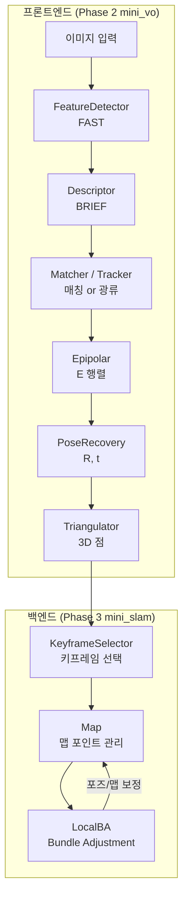

# mini_slam (Visual SLAM 시스템)

## 📌 개요

> 🎯 **목표**: Phase 2의 mini_vo를 확장하여 키프레임 관리 + Bundle Adjustment를 갖춘 SLAM 시스템 구축
> 💻 **언어**: C++ 17 (OpenCV, Ceres, g2o)
> 📦 **구조**: Phase 2 mini_vo 재사용 + Phase 3 모듈 추가

mini_slam은 Phase 3의 **통합 프로젝트**입니다. mini_vo의 프론트엔드(특징점 검출→매칭→포즈 추정) 위에 백엔드(키프레임 관리, 맵, 최적화)를 구축합니다.

---

## 🔧 프로젝트 구조

```
mini_slam/
├── CMakeLists.txt
├── main.cpp                      # 데모 실행 (주차별 모듈 테스트)
├── include/
│   ├── types.h                   # Pose, MapPoint 기본 타입
│   ├── keyframe.h                # W6: 키프레임 + 공가시성
│   ├── map.h                     # W6: 맵 관리자
│   ├── local_ba_ceres.h          # W8: Ceres BA
│   └── local_ba_g2o.h            # W9-W10: g2o BA
└── src/
    ├── keyframe.cpp              # ✅ 구현 완료
    ├── map.cpp                   # ✅ 구현 완료
    ├── local_ba_ceres.cpp        # 🔲 stub
    └── local_ba_g2o.cpp          # 🔲 stub
```

### Phase 2 mini_vo 재사용

```
Phase 2/project/mini_vo/
├── include/   ← mini_slam이 헤더 참조
│   ├── camera.h, feature_detector.h, descriptor.h
│   ├── feature_matcher.h, epipolar.h, pose_recovery.h
│   └── triangulator.h, tracker.h
└── src/       ← mini_slam이 소스 직접 빌드
```

---

## 📋 주차별 모듈 매핑

| 주차 | 모듈 | 핵심 구현 | 상태 |
|:----:|------|----------|:----:|
| W1 | - | VO 파이프라인 검증 (mini_vo 재사용 확인) | ✅ |
| W6 | `Keyframe` | 키프레임 선택, 공가시성 그래프 | ✅ |
| W6 | `Map` | 맵 포인트/키프레임 관리, 아웃라이어 제거 | ✅ |
| W8 | `LocalBACeres` | Ceres Solver로 재투영 오차 최적화 | 🔲 |
| W9-W10 | `LocalBAG2O` | g2o 그래프 최적화 + Schur Complement | 🔲 |

### 전체 로드맵

| 주차 | 작업 | 설명 |
|:----:|------|------|
| W1 | VO 파이프라인 검증 | Phase 2 모듈이 정상 동작하는지 확인 |
| W2 | E Matrix RANSAC 튜닝 | Phase 2 Epipolar 확장 |
| W3 | PnP RANSAC 직접 구현 | 3D-2D 대응으로 포즈 추정 |
| W5 | mini_vo → mini_slam 통합 | 프론트엔드 + 백엔드 연결 |
| W6 | Keyframe + Map 관리 | 키프레임 선택, 공가시성, 맵 포인트 관리 |
| W8 | Ceres Local BA | 자동 미분 기반 Bundle Adjustment |
| W9 | g2o Local BA + Schur | 그래프 최적화 + 구조 활용 |
| W10 | BA 통합 + 비교 | Ceres vs g2o 성능 비교 |
| W12 | 스케일 드리프트 측정 | 단안 VO의 스케일 문제 정량 분석 |
| W13 | 최종 데모 + GT 비교 | Ground Truth와 궤적 비교 |

---

## 🚀 빌드 및 실행

```bash
cd mini_slam
mkdir -p build && cd build
cmake .. && make
./mini_slam                    # 합성 이미지로 테스트
./mini_slam <image_path>       # 실제 이미지로 테스트
```

> W8 이후 Ceres, W9 이후 g2o가 필요합니다. 설치 방법은 각 주차 PRACTICE.md를 참고하세요.

---

## 🏗️ 시스템 아키텍처



---

## 📚 핵심 클래스

### types.h — 기본 타입

| 타입 | 역할 |
|------|------|
| `Pose` | SE(3) 변환 (R + t), 합성/역변환 지원 |
| `MapPoint` | 3D 위치 + 관측 키프레임 목록 + 아웃라이어 플래그 |

### Keyframe — 키프레임 관리 (W6)

| 기능 | 설명 |
|------|------|
| 공가시성(Covisibility) | 같은 맵 포인트를 관측하는 키프레임 간의 연결 그래프 |
| `KeyframeSelector` | 시차, 추적 품질, 프레임 간격 기준으로 새 키프레임 필요 여부 판단 |

### Map — 맵 관리자 (W6)

| 기능 | 설명 |
|------|------|
| 키프레임 추가/검색 | ID 기반 관리 |
| 맵 포인트 추가/제거 | 아웃라이어 자동 제거 |
| 공가시성 갱신 | 키프레임 간 공유 맵 포인트 기반 그래프 갱신 |

### LocalBA — Bundle Adjustment (W8-W10)

| 방식 | 특징 |
|------|------|
| **Ceres** (W8) | 자동 미분, 간결한 코드, 빠른 프로토타이핑 |
| **g2o** (W9-W10) | 그래프 구조 활용, Schur Complement로 효율적 |

```
최적화 대상:
  - 키프레임 포즈: Rodrigues(3) + t(3) = 6 DoF
  - 맵 포인트 위치: (X, Y, Z) = 3 DoF

비용 함수:
  재투영 오차 = || π(K [R|t] X) - x_obs ||²
```
