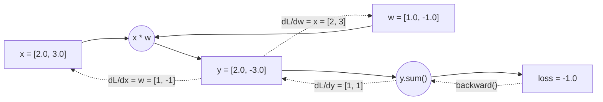

# Week 1: PyTorch 기초 재정비


> **이번 주 목표**: CUDA 환경을 세팅하고, PyTorch의 핵심 개념(Tensor, autograd, DataLoader)을 복습한 뒤, CNN으로 이미지 분류를 직접 학습시킨다.
> **예상 시간**: 12시간
> **핵심 질문**: "PyTorch에서 모델 학습의 전체 파이프라인(데이터 → 모델 → 학습 → 평가 → 저장)을 혼자서 구성할 수 있는가?"


---


## 학습 순서


| 순서 | 단계 | 파일 | 설명 |
|:----:|------|------|------|
| 1 | 환경 설정 | `requirements.txt` | `pip install -r requirements.txt` |
| 2 | 이론 학습 | `README.md` | 아래 핵심 개념 읽기 |
| 3 | Python 퀴즈 (초급) | `quiz_easy.py` | Tensor shape, autograd, DataLoader 개념 확인 |
| 4 | Python 퀴즈 (중급) | `quiz_medium.py` | Gradient 계산, CNN 구현 코드 작성 |
| 5 | 실습 | [PRACTICE.md](./PRACTICE.md) | CIFAR-10 CNN 학습 파이프라인 구축 |


---


## 시작하기 전에


Phase 3는 **딥러닝 기반 2D Perception**을 다루는 단계입니다. YOLO 객체 검출과 Depth Estimation을 배우기 전에, 그 기반이 되는 **PyTorch**를 확실히 잡아야 합니다.


### 왜 PyTorch인가?


PyTorch는 딥러닝 연구와 산업 모두에서 가장 널리 쓰이는 프레임워크입니다.


| 특징 | 설명 |
|------|------|
| **Dynamic Computation Graph** | 실행 시점에 그래프가 생성되어 디버깅이 쉬움 |
| **Pythonic** | NumPy와 유사한 API로 학습 곡선이 낮음 |
| **생태계** | torchvision, torchaudio, HuggingFace 등 풍부한 라이브러리 |
| **배포** | ONNX, TorchScript, TensorRT 등 다양한 배포 경로 |


### 비유로 이해하기


PyTorch를 **레고 블록**에 비유할 수 있습니다.
- **Tensor**: 레고 브릭 하나하나 (데이터의 기본 단위)
- **autograd**: 조립 설명서를 자동으로 만들어주는 시스템 (역전파 자동 계산)
- **nn.Module**: 미리 만들어진 레고 세트 (Conv, Linear 등)
- **DataLoader**: 레고 브릭을 정리해서 한 묶음씩 전달해주는 역할


---


## 핵심 개념 자세히 알아보기


### 1. CUDA 환경 세팅


#### PC (학습용)


CUDA는 NVIDIA GPU를 활용한 병렬 연산 라이브러리입니다. 딥러닝 학습에서 GPU를 사용하면 CPU 대비 **10-100배** 빠릅니다.


```bash
# 1. NVIDIA 드라이버 확인
nvidia-smi


# 2. venv 가상환경 생성
python3 -m venv .venv
source .venv/bin/activate


# 3. PyTorch 설치 (CUDA 11.8 기준)
pip install torch torchvision torchaudio --index-url https://download.pytorch.org/whl/cu118


# 4. 설치 확인
python -c "import torch; print(torch.cuda.is_available())"
# 출력: True
```


**각 단계가 하는 일**


- `nvidia-smi`: NVIDIA System Management Interface. GPU 가 잡혀 있는지, **드라이버 버전 / CUDA 버전 / 메모리 사용량** 을 한 번에 보여줍니다. 첫 줄의 `CUDA Version: 12.x` 같은 표시는 **드라이버가 지원하는 최대 CUDA** 버전이지, 실제 설치된 toolkit 버전은 아닙니다.
- `python3 -m venv .venv`: 프로젝트 전용 **가상 환경** 생성. 시스템 파이썬에 패키지를 마구 깔지 않고 격리해야 의존성 충돌이 없습니다. `source .venv/bin/activate` 후 설치한 패키지는 이 디렉토리 안에만 살아 있고 deactivate 하면 사라진 듯 보입니다.
- `--index-url https://...cu118`: PyTorch 휠을 받는 곳이 일반 PyPI 가 아니라 **CUDA 11.8 빌드 전용 인덱스** 라는 뜻. 끝의 `cu118` 이 CUDA 11.8 빌드를 가리킵니다. 자신의 환경이 CUDA 12.1 이면 `cu121` 인덱스를 써야 함. 잘못 맞추면 `torch.cuda.is_available()` 이 False 가 나옵니다.
- `python -c "import torch; print(torch.cuda.is_available())"`: 설치 검증 한 줄. **True 가 나와야** GPU 학습이 가능한 상태입니다. False 면 드라이버 / CUDA 버전 / 빌드 매칭을 다시 점검.


#### Jetson Orin Nano (배포용)


```bash
# JetPack 6.0 설치 후
# PyTorch ARM64 버전 설치
pip install torch torchvision # Jetson용 whl 파일 사용


# CUDA, TensorRT 확인
python -c "import torch; print(torch.cuda.is_available())"
dpkg -l | grep tensorrt
```


#### GPU 메모리 관리


GPU 메모리는 한정되어 있으므로 관리가 중요합니다.


```python
import torch


# GPU 정보 확인
print(f"GPU: {torch.cuda.get_device_name(0)}")
print(f"총 메모리: {torch.cuda.get_device_properties(0).total_memory / 1e9:.1f} GB")
print(f"할당된 메모리: {torch.cuda.memory_allocated() / 1e6:.1f} MB")
print(f"캐시된 메모리: {torch.cuda.memory_reserved() / 1e6:.1f} MB")


# 메모리 해제
torch.cuda.empty_cache()
```


**숫자 단위 해설**


- `total_memory` 는 바이트 단위 정수입니다. `/ 1e9` 로 나누면 **GB**, `/ 1e6` 으로 나누면 **MB** 단위.
- `memory_allocated()`: 현재 텐서가 **실제 사용 중** 인 메모리.
- `memory_reserved()`: PyTorch 가 **OS 로부터 잡아 둔** 메모리 (사용 중 + 캐싱). 다음번에 텐서 만들 때 OS 호출 없이 재활용하기 위한 캐시.
- `torch.cuda.empty_cache()`: 사용 안 하는 캐시를 OS 에 반환. **할당 중인 텐서까지 지우진 않습니다.** 메모리 표시 숫자가 줄어들어도 `del` 로 텐서를 먼저 지워야 진짜 free 됩니다.


**GPU 메모리 부족(OOM) 해결법**:
1. `batch_size` 줄이기 (가장 효과적)
2. `torch.cuda.empty_cache()` 호출
3. `with torch.no_grad():` 블록 사용 (추론 시)
4. Mixed Precision (FP16) 사용
5. Gradient Accumulation


---


### 2. Tensor 연산


Tensor는 PyTorch의 **기본 데이터 구조**입니다. NumPy의 ndarray와 유사하지만, GPU 연산과 자동 미분을 지원합니다.


**numpy vs torch 한눈에**


| 항목 | numpy.ndarray | torch.Tensor |
|-----|---------------|--------------|
| 어디서 동작? | CPU 만 | CPU / GPU |
| 자동 미분 | 없음 | `requires_grad=True` 로 켜기 |
| 딥러닝 연동 | 별도 변환 필요 | 모델 / 옵티마이저와 그대로 호환 |
| API 모양 | `np.zeros`, `arr.shape`, `arr.dtype` | `torch.zeros`, `t.shape`, `t.dtype` (거의 동일) |


API 가 거의 똑같이 생겨서 numpy 사용자는 1-2 시간이면 익숙해집니다. 결정적인 차이는
"이 텐서가 어디에 (cpu/gpu) 있고 미분 추적이 켜져 있는가" 입니다.


```python
import torch


# -- 텐서 생성 --
x = torch.zeros(3, 4) # 0으로 채운 3x4 텐서
x = torch.ones(3, 4) # 1로 채운 3x4 텐서
x = torch.randn(3, 4) # 표준 정규분포 랜덤
x = torch.tensor([1, 2, 3]) # 직접 값 지정
x = torch.arange(0, 10, 2) # [0, 2, 4, 6, 8]


# -- 텐서 속성 --
print(x.shape) # 크기
print(x.dtype) # 데이터 타입 (float32, int64 등)
print(x.device) # cpu 또는 cuda:0


# -- GPU로 이동 --
device = torch.device('cuda' if torch.cuda.is_available() else 'cpu')
x = x.to(device)
# 또는
x = x.cuda()
```


**dtype 이 왜 중요한가**


- `float32` (= `torch.float`): 학습에서 **기본 데이터 타입**. 모델 가중치/연산 결과 거의 다 이 타입.
- `int64` (= `torch.long`): **라벨/인덱스**용 정수. CrossEntropyLoss 의 target 은 반드시 long.
- `uint8`: 이미지 픽셀 0-255 (PIL/OpenCV 로 읽은 직후). 보통 `ToTensor()` 에서 float32 0.0-1.0 로 변환.
- `float16` / `bfloat16`: 메모리 절약 + 학습 가속용 (Mixed Precision).


타입이 안 맞으면 `RuntimeError: expected scalar type Float but found Long` 같은 흔한 오류가 납니다. 변환은 `x.float()`, `x.long()`, `x.to(torch.float32)` 등으로.


#### 주요 연산


```python
# -- 기본 연산 --
a = torch.randn(3, 4)
b = torch.randn(3, 4)


c = a + b # 요소별 덧셈
c = a * b # 요소별 곱셈 (Hadamard product)
c = a @ b.T # 행렬 곱 (matmul)
c = torch.matmul(a, b.T) # 동일


# -- Shape 변환 (각 연산은 원본 x에 대한 독립 예시) --
x = torch.randn(2, 3, 4)
print(x.view(2, 12).shape)      # [2,3,4] → [2,12] (메모리 연속 필요)
print(x.reshape(2, 12).shape)   # [2,3,4] → [2,12] (메모리 복사 가능)
print(x.permute(2, 0, 1).shape) # [2,3,4] → [4,2,3] (차원 순서 변경, HWC → CHW 등)

y = torch.randn(3, 4)
print(y.unsqueeze(0).shape)     # [3,4] → [1,3,4] (차원 추가)

z = torch.randn(1, 3, 4)
print(z.squeeze(0).shape)       # [1,3,4] → [3,4] (차원 제거)


# -- 이미지에서 자주 쓰는 변환 --
# OpenCV (HWC, BGR) → PyTorch (CHW, RGB)
import numpy as np
img_np = np.random.randint(0, 255, (480, 640, 3), dtype=np.uint8)
img_tensor = torch.from_numpy(img_np).permute(2, 0, 1).float() / 255.0
# shape: [3, 480, 640], range: [0, 1]
```


**shape 변환 4종 한 줄 정리**


| 연산 | 효과 | 메모리 |
|------|------|--------|
| `view(...)` | shape 변경 (요소 수 유지) | 연속(contiguous) 필요. **새 데이터 없음**, stride 만 바뀜 |
| `reshape(...)` | shape 변경 (요소 수 유지) | 가능하면 `view`, 안 되면 **복사**. 안전한 기본값 |
| `permute(...)` | **축 순서** 바꿈 (H,W,C -> C,H,W 등) | 데이터 복사 X, 결과는 비연속이 될 수 있음 |
| `unsqueeze(d)` / `squeeze(d)` | 크기 1 차원 **추가 / 제거** | 데이터 복사 없음 |


핵심 차이: `view/reshape` 는 "**평탄화한 뒤 새 모양으로 재해석**", `permute` 는 "**축 순서 자체를 바꿈**". 둘은 결과가 완전히 다릅니다 (시각화 섹션의 깨진 이미지 예시 참고).


#### 텐서 이미지 시각화


matplotlib의 `imshow`는 `(H, W, C)` 순서를 기대합니다. 위에서 `permute(2, 0, 1)`로
`(C, H, W)`로 바꿔놨기 때문에, 시각화하려면 다시 `(H, W, C)`로 되돌려야 합니다.


변환 효과가 한눈에 보이도록, 무작위 노이즈 대신 색이 구분되는 구조적 이미지
(4분할 색상 블록)를 만들어 세 가지를 나란히 비교합니다. (1) 변환 전 원본,
(2) `permute` 없이 `reshape`만 한 잘못된 복원(깨짐), (3) `permute`로 축을
제대로 되돌린 올바른 복원.


```python
import matplotlib.pyplot as plt
import numpy as np
import torch

# -- 구조가 보이는 데모 이미지 생성 (4분할 색상 블록) --
H, W = 480, 640
img_np = np.zeros((H, W, 3), dtype=np.uint8)
img_np[: H // 2, : W // 2] = [220, 50, 50]   # 좌상: 빨강
img_np[: H // 2, W // 2 :] = [50, 200, 50]   # 우상: 초록
img_np[H // 2 :, : W // 2] = [50, 80, 220]   # 좌하: 파랑
img_np[H // 2 :, W // 2 :] = [230, 210, 40]  # 우하: 노랑

# (H, W, C) → (C, H, W), 0~1 정규화
img_tensor = torch.from_numpy(img_np).permute(2, 0, 1).float() / 255.0

plt.figure(figsize=(12, 3))

# 1) 변환 전: 원본 numpy 이미지 (H, W, C) → 그대로 표시 가능
plt.subplot(1, 3, 1)
plt.imshow(img_np)
plt.title("1. original img_np (H,W,C)")
plt.axis("off")

# 2) 잘못된 복원: permute 없이 reshape만 → 픽셀이 뒤섞여 깨짐
wrong = img_tensor.reshape(H, W, 3).cpu().numpy()
plt.subplot(1, 3, 2)
plt.imshow(wrong)
plt.title("2. reshape only (broken)")
plt.axis("off")

# 3) 올바른 복원: permute로 축을 (H, W, C)로 되돌림
img_back = img_tensor.permute(1, 2, 0).cpu().numpy()  # (480, 640, 3), 0~1 float
plt.subplot(1, 3, 3)
plt.imshow(img_back)
plt.title("3. permute (correct)")
plt.axis("off")

plt.tight_layout()
plt.show()
```


**`img_back` 한 줄 분해**:


`img_back = img_tensor.permute(1, 2, 0).cpu().numpy()` 는 메서드 체이닝으로
세 변환을 순서대로 적용합니다. 시작 상태는 `(3, 480, 640)` = `(C, H, W)`, float, 0-1 범위입니다.


1. **`.permute(1, 2, 0)`** - 차원 순서 재배치. 인자는 "새 텐서의 각 축에 기존 텐서의
   몇 번째 축을 놓을지"를 지정합니다.


```
기존 축 인덱스:  0=C(3)   1=H(480)   2=W(640)

permute(1, 2, 0)
        |  |  +-- 새 축 2 <- 기존 축 0 (C, 채널)
        |  +----- 새 축 1 <- 기존 축 2 (W, 너비)
        +-------- 새 축 0 <- 기존 축 1 (H, 높이)

결과: (480, 640, 3) = (H, W, C)
```


   데이터를 복사하지 않고 stride 메타데이터만 바꾼 view를 반환하므로, 결과 텐서는
   메모리상 비연속(non-contiguous) 상태가 됩니다.

2. **`.cpu()`** - 텐서가 GPU(`cuda:0`)에 있으면 CPU 메모리로 복사. numpy는 CPU 메모리만
   접근할 수 있어 필요합니다. 이미 CPU에 있으면 아무 동작도 하지 않습니다(no-op).

3. **`.numpy()`** - torch.Tensor를 numpy.ndarray로 변환. matplotlib, OpenCV 등은 numpy를
   입력으로 받습니다. CPU 텐서와 numpy 배열은 같은 메모리를 공유합니다(가능한 경우 복사 없음).


순서가 중요합니다. `.cpu()`가 `.numpy()`보다 먼저 와야 하며, GPU 텐서에 바로 `.numpy()`를
호출하면 에러가 납니다. grad가 붙은 텐서라면 `.numpy()` 전에 `.detach()`가 추가로
필요합니다(`...permute(1,2,0).detach().cpu().numpy()`).


**알아둘 점**:
- `permute(1, 2, 0)`: `(C, H, W)` → `(H, W, C)`. 앞서 한 `permute(2, 0, 1)`을 정확히 되돌리는 연산
- **`reshape` != `permute`**: `reshape`는 메모리를 1차원으로 편 뒤 새 모양에 그대로 재배치할 뿐 축 순서를 바꾸지 않음. `(C, H, W)` 메모리는 채널별로 뭉쳐 있어 `(H, W, 3)`로 재해석하면 픽셀이 섞여 깨짐(패널 2). 축을 옮기려면 반드시 `permute`를 써야 함
- `.cpu().numpy()`: 텐서가 GPU에 있거나 grad가 붙어 있으면 바로 numpy 변환이 안 되므로 `cpu()`를 거치는 것이 안전
- dtype 차이: `imshow`는 uint8이면 0-255, float이면 0-1 범위로 해석. `img_tensor`는 `/255.0`으로 정규화돼 있어 그대로 표시됨
- 패널 1(변환 전 원본)과 패널 3(`permute` 복원)이 동일하고 패널 2(`reshape`)만 깨져 보이면 변환이 올바른 것


---


### 3. autograd (자동 미분)


autograd는 PyTorch의 **자동 미분 엔진**입니다. 순전파(forward)에서 수행된 연산을
기록해두었다가, `backward()`를 호출하면 각 변수에 대한 gradient를 자동으로 계산합니다.
미분 공식을 손으로 짤 필요가 없습니다.


#### gradient가 뭔가? (직관)


`gradient`(기울기)는 한마디로 **"이 값을 아주 조금 바꾸면 loss가 얼마나 변하는가"**
입니다. 수학적으로는 `loss`를 그 변수로 미분한 값(편미분, dL/dvar)입니다.


- `x.grad` = dL/dx = "x를 조금 키우면 loss가 얼마나 변하나"
- `w.grad` = dL/dw = "w를 조금 키우면 loss가 얼마나 변하나"


딥러닝에서 `w`는 모델의 가중치(weight)입니다. 이 gradient를 보고 "loss를 줄이려면
w를 어느 방향으로 바꿔야 하는지" 알아내서 그 방향으로 조금씩 업데이트하는 것이
바로 **학습**입니다.


#### 예제 코드


```python
import torch

# requires_grad=True → 이 텐서의 gradient를 추적
x = torch.tensor([2.0, 3.0], requires_grad=True)
w = torch.tensor([1.0, -1.0], requires_grad=True)

# 순전파 (forward)
y = x * w        # [2.0, -3.0]  (요소별 곱)
loss = y.sum()   # -1.0         (스칼라)

# 역전파 (backward)
loss.backward()

# gradient 확인
print(x.grad)    # tensor([ 1., -1.])  → dL/dx
print(w.grad)    # tensor([2., 3.])    → dL/dw
```


이 예제의 연산 흐름을 그림으로 보면 (실선 = 순전파, 점선 = `backward()` 역전파):





#### 순전파: 숫자 따라가기


```
x = [2.0,  3.0]
w = [1.0, -1.0]

y = x * w = [2.0*1.0, 3.0*(-1.0)] = [2.0, -3.0]   # 요소별 곱

loss = y.sum() = 2.0 + (-3.0) = -1.0
```


여기까지가 forward입니다. 이 계산을 하는 동안 PyTorch는 `requires_grad=True`인
텐서가 **어떤 연산을 거쳤는지 그래프로 기록**해 둡니다 (위 그림의 실선 부분).


#### 역전파: gradient 값이 왜 저렇게 나오나


`loss`를 x, w로 직접 풀어쓰면:


```
loss = y0 + y1 = (x0 * w0) + (x1 * w1)
```


핵심은 **곱셈의 미분**입니다. `x * w`를 한 변수로 미분하면 상대 변수만 남습니다.


```
d(x*w)/dx = w     (w를 상수 취급)
d(x*w)/dw = x     (x를 상수 취급)
```


이걸 각 원소에 적용하면:


| 변수 | 편미분 | 값 | 의미 |
|------|--------|-----|------|
| `x.grad[0]` | dL/dx0 = w0 |  1.0 | x0를 키우면 loss가 +1.0 비율로 변함 |
| `x.grad[1]` | dL/dx1 = w1 | -1.0 | x1를 키우면 loss가 -1.0 비율로 변함 |
| `w.grad[0]` | dL/dw0 = x0 |  2.0 | w0를 키우면 loss가 +2.0 비율로 변함 |
| `w.grad[1]` | dL/dw1 = x1 |  3.0 | w1를 키우면 loss가 +3.0 비율로 변함 |


즉 `x.grad = [1, -1]`은 우연이 아니라 **w의 값**이고, `w.grad = [2, 3]`은
**x의 값**입니다. `loss = x*w` 형태라서 서로의 값이 상대방의 기울기가 됩니다.


#### backward() 한 줄이 한 일


1. 기록해 둔 연산 그래프를 **거꾸로** 따라간다 (loss -> sum -> mul -> x, w).
2. 연쇄 법칙(chain rule)으로 각 변수의 편미분을 자동 계산한다.
3. 결과를 각 텐서의 `.grad` 속성에 저장한다.


forward만 정의하면 backward는 자동입니다. 신경망이 아무리 깊고 복잡해져도
원리는 이 예제와 똑같습니다.


#### backward()가 바꾸는 것 / 안 바꾸는 것


`backward()`의 유일한 관찰 가능한 효과는 **`.grad`가 채워지는 것**입니다.


```
backward() 호출 전:   x.grad = None         w.grad = None
backward() 호출 후:   x.grad = [ 1., -1.]   w.grad = [2., 3.]
```


반대로 **바뀌지 않는 것**:
- `loss` 값 자체 - backward는 미분만 할 뿐 loss를 다시 계산하지 않음
- 가중치 `x`, `w`의 값 - `backward()`는 가중치를 **업데이트하지 않음**


가중치를 실제로 수정하는 것은 `optimizer.step()`입니다. 역할이 분리돼 있습니다:
`backward()` = 기울기 계산, `optimizer.step()` = 그 기울기로 가중치 수정.


#### `.grad`는 덮어쓰기가 아니라 누적(+=)


`backward()`는 `.grad = 새값`이 아니라 `.grad += 새값`으로 동작합니다.
`zero_grad` 없이 같은 계산을 두 번 backward 하면:


```
1회 후:  x.grad = [ 1., -1.]
2회 후:  x.grad = [ 2., -2.]   # 덮어쓰지 않고 더해짐
```


그래서 학습 루프에서 매 iteration `optimizer.zero_grad()`로 `.grad`를 비우지
않으면 이전 step의 gradient가 계속 쌓여 잘못된 방향으로 업데이트됩니다.


참고: 기본적으로 `backward()` 후 연산 그래프는 메모리에서 해제됩니다. 같은 그래프에
`backward()`를 두 번 호출하면 에러가 나며, 필요하면 `backward(retain_graph=True)`를 씁니다.


#### 학습 루프에서 backward()의 위치


```
optimizer.zero_grad()   # 1. 이전 .grad 비우기 (누적 방지)
outputs = model(x)      # 2. 순전파 (그래프 기록)
loss = criterion(...)   # 3. loss 계산
loss.backward()         # 4. <- 여기. .grad 채움 (가중치는 아직 그대로)
optimizer.step()        # 5. .grad 보고 가중치 실제 업데이트
```


`backward()`는 4번에서 "어느 방향으로 얼마나 바꿔야 하는지(`.grad`)"만 계산하고,
실제 수정은 5번 `optimizer.step()`이 합니다.


#### 한 문장 요약


> `requires_grad=True`로 추적을 켜고 -> forward로 loss를 계산하면 -> `backward()`가
> "각 변수를 조금 바꿀 때 loss가 얼마나 변하는지(`.grad`)"를 자동으로 채워준다.
> 그 `.grad` 값으로 가중치를 업데이트하는 것이 학습이다.


**핵심 규칙**:
- `requires_grad=True`인 텐서에 대해서만 gradient 계산
- `loss`는 스칼라(숫자 하나)여야 `backward()` 호출 가능 (그래서 `.sum()`이나 `.mean()`으로 줄임)
- `loss.backward()` 호출 후 `.grad`에 gradient 저장
- `optimizer.zero_grad()`로 gradient 초기화 (매 iteration). 안 하면 gradient가 누적됨
- 추론 시에는 `with torch.no_grad():` 사용 (그래프 기록 안 함 -> 메모리 절약)


---


### 4. Dataset & DataLoader


#### 실습용 간이 데이터셋 준비


개념을 코드로 직접 굴려보기 위해 합성 도형 분류 데이터셋 (원/사각형/삼각형, 64x64 RGB) 을
PIL 만으로 만들어 사용합니다. 외부 다운로드 없이 즉시 생성됩니다.


```bash
# week1 디렉토리에서
python prepare_demo_dataset.py
# -> ./demo_dataset/images/ 에 클래스당 20 장, 총 60 장 생성
```


파일명 규칙은 `{class_id}_{image_id:03d}.png` (예: `0_000.png` = circle).
이 규칙 덕분에 `__getitem__` 에서 파일명을 split 한 번으로 라벨을 뽑을 수 있습니다
(`class_id`: 0=circle, 1=square, 2=triangle).


#### Dataset: 데이터 하나를 어떻게 읽을 것인가


```python
import os

from PIL import Image
from torch.utils.data import Dataset


class ShapeDataset(Dataset):
    """{class_id}_{image_id}.png 규칙으로 저장된 도형 분류 데이터셋."""

    def __init__(self, image_dir, transform=None):
        self.image_dir = image_dir
        self.transform = transform
        # png 만 필터링하고 sorted 로 결정적 순서 보장 (재현성)
        self.image_list = sorted(
            f for f in os.listdir(image_dir) if f.endswith(".png")
        )

    def __len__(self):
        """데이터셋의 총 개수"""
        return len(self.image_list)

    def __getitem__(self, idx):
        """idx 번째 데이터를 (image, label) 로 반환"""
        filename = self.image_list[idx]
        img_path = os.path.join(self.image_dir, filename)
        image = Image.open(img_path).convert("RGB")
        # 파일명 규칙 {class_id}_{image_id}.png 에서 라벨 추출
        label = int(filename.split("_")[0])

        if self.transform:
            image = self.transform(image)

        return image, label


# 빠른 확인: 한 샘플을 꺼내 shape/label 출력
dataset = ShapeDataset("./demo_dataset/images")
print(f"총 {len(dataset)} 장")  # -> 총 60 장
image, label = dataset[0]
print(f"첫 샘플 - 크기: {image.size}, 라벨: {label}")  # -> (64, 64), 0
```


#### DataLoader: 데이터를 배치 단위로 묶어서 전달


PIL Image 를 그대로 배치로 묶을 수는 없으니, `torchvision.transforms` 로 Tensor 변환을
끼워 줍니다. 이때 비로소 `(B, C, H, W)` 텐서 배치가 만들어집니다.


```python
import torch
from torch.utils.data import DataLoader
from torchvision import transforms

# PIL -> Tensor(C,H,W) 변환 + [0,255] -> [0,1] 스케일링
# (mean/std 로 빼고 나누는 "Normalize" 는 다음 섹션 CIFAR-10 에서 등장)
transform = transforms.Compose([
    transforms.ToTensor(),
])

dataset = ShapeDataset("./demo_dataset/images", transform=transform)
dataloader = DataLoader(
    dataset,
    batch_size=8,       # 데이터가 60 장이라 8 정도가 적당
    shuffle=True,       # 매 epoch 마다 순서 섞기
    num_workers=0,      # 데모는 작아서 0 (단일 프로세스) 이 디버깅 편함
    pin_memory=True,    # GPU 전송 속도 향상 (CPU 만 쓰면 효과 없음)
    drop_last=True,     # 마지막 불완전 배치 버림
)

device = "cuda" if torch.cuda.is_available() else "cpu"

# 한 배치만 꺼내서 shape 확인
images, labels = next(iter(dataloader))
print(f"images: {images.shape}, dtype={images.dtype}")  # -> [8, 3, 64, 64]
print(f"labels: {labels.shape}, {labels.tolist()}")     # -> [8], 예: [2,0,1,...] (shuffle 로 매번 다름)

# 실제 학습 루프에서는 이렇게 순회
for batch_idx, (images, labels) in enumerate(dataloader):
    images = images.to(device)  # GPU 로 이동
    labels = labels.to(device)
    # ... 학습 코드 ...
```


**실전 파라미터 가이드** (위 예제는 데모라 보수적으로 잡았음):
- `batch_size=32` 이상: 실데이터 + GPU 메모리 여유 있을 때
- `num_workers=4` 내외: CPU 코어 수의 절반 정도 (윈도우/노트북은 0 으로 시작 권장)


**DataLoader의 역할 시각화**:


```
Dataset: [img0, img1, img2, img3, img4, img5, img6, img7, ...]
              | shuffle + batch_size=4
              v
DataLoader:
  Batch 0: [img5, img2, img7, img0] -> GPU
  Batch 1: [img3, img1, img6, img4] -> GPU
  ...
```


---


### 5. CNN 학습 파이프라인 (CIFAR-10)


CIFAR-10은 10개 클래스의 32x32 컬러 이미지 60,000장으로 구성된 벤치마크 데이터셋입니다.
앞에서 만든 "도형 분류 합성 데이터셋"이 워밍업이었다면, CIFAR-10은 실제 학습 흐름을
처음부터 끝까지 돌려보는 **첫 풀 파이프라인**입니다. 5번 섹션의 코드 블록 4개는
크게 다음 4단계로 나뉩니다.


```
1) 데이터 준비   : Dataset + DataLoader + 전처리
2) 모델 정의     : nn.Module 을 상속한 CNN 클래스
3) 학습 설정     : device / loss / optimizer / scheduler
4) 학습 루프     : 매 epoch 마다 5단계 (zero_grad -> forward -> loss -> backward -> step)
```


아래 코드는 위 4단계가 순서대로 등장합니다.


#### 5.1 데이터 준비


```python
import torch
import torch.nn as nn
import torch.optim as optim
import torchvision
import torchvision.transforms as transforms


# -- 1. 데이터 준비 --
transform = transforms.Compose([
    transforms.RandomHorizontalFlip(),
    transforms.RandomCrop(32, padding=4),
    transforms.ToTensor(),
    transforms.Normalize((0.4914, 0.4822, 0.4465),
                         (0.2470, 0.2435, 0.2616)),
])


trainset = torchvision.datasets.CIFAR10(
    root='./data', train=True, download=True, transform=transform)
trainloader = DataLoader(trainset, batch_size=128, shuffle=True, num_workers=2)


testset = torchvision.datasets.CIFAR10(
    root='./data', train=False, download=True, transform=transform)
testloader = DataLoader(testset, batch_size=128, shuffle=False, num_workers=2)
```


**1단계 자세히 - 데이터 준비**


- `transforms.Compose([...])`: 여러 전처리 단계를 **순서대로** 묶어 하나의 함수처럼
  쓰게 해 줍니다. Dataset 의 `__getitem__` 안에서 호출되어 PIL Image -> 최종 Tensor
  로 변환합니다.
- `RandomHorizontalFlip()`: 50% 확률로 좌우 반전. 자동차/동물처럼 좌우 대칭이 자연스러운
  대상에서 **데이터 양을 사실상 2배**로 늘리는 효과 (data augmentation).
- `RandomCrop(32, padding=4)`: 32x32 이미지 주위를 4픽셀씩 0 으로 패딩한 뒤 (40x40),
  거기서 다시 32x32 영역을 무작위로 잘라냄. 위치에 강인한 모델을 만드는 흔한 트릭.
- `ToTensor()`: PIL Image (HxWxC, uint8 0-255) -> Tensor (CxHxW, float32 0.0-1.0).
  Dataset & DataLoader 섹션에서 본 그 변환과 동일합니다.
- `Normalize(mean, std)`: 각 채널을 `(x - mean) / std` 로 표준화. 입력 분포를 평균 0
  근처로 맞춰 학습이 안정됩니다. 위의 숫자 `(0.4914, 0.4822, 0.4465)` 와
  `(0.2470, 0.2435, 0.2616)` 는 **CIFAR-10 학습 전체에서 미리 계산해 둔 채널별 mean/std**
  값으로, 관례적으로 그대로 사용합니다.
- `train=True/False`: CIFAR-10 은 학습용 50,000 장과 테스트용 10,000 장으로 미리 나뉘어
  있어, 같은 클래스로 두 split 을 각각 생성합니다.
- `shuffle=True` (train) / `shuffle=False` (test): 학습은 매 epoch 순서를 섞어야 일반화에
  유리하고, 테스트는 평가 결과의 재현성을 위해 고정합니다.
- `batch_size=128`: 한 번에 128 장씩 모델에 넣는다는 의미. `[128, 3, 32, 32]` 텐서가
  매 iteration 만들어집니다.


##### `batch_size` 는 어떤 기준으로 정하나


batch_size 는 **4 가지 축의 trade-off** 위에서 결정됩니다. 무조건 크게 한다고 좋은 게
아닙니다.


| 기준 | 영향 방향 | 한계 |
|------|---------|------|
| GPU 메모리 | 클수록 메모리 많이 씀 | OOM 나면 못 돌림 (절대적 상한) |
| 학습 안정성 / 일반화 | 클수록 gradient 노이즈 적어 안정적 | 너무 크면 일반화 성능 떨어짐 (sharp minima) |
| 학습 속도 (throughput) | 클수록 GPU 활용도 ↑ | 메모리 swap 나면 오히려 느려짐 |
| BatchNorm 통계 품질 | 클수록 mean/var 추정 정확 | 너무 작으면 (< 16) BN 망가짐 |


**1) GPU 메모리 (가장 강한 제약)**


배치를 키울수록 다음 메모리가 비례해 증가합니다.


```
한 step 의 GPU 메모리
  = 모델 파라미터 (고정)
  + 활성화 (activation, batch_size 에 비례)   <-- 여기만 변동
  + gradient (파라미터와 같은 크기, 고정)
  + optimizer 상태 (Adam 이면 파라미터의 2 배, 고정)
```


batch_size 2 배 -> 활성화 메모리 2 배. 다른 항목은 고정이라 작은 모델일수록 batch 가
메모리의 거의 전부를 차지합니다.


**OOM 이 무엇인가**


**OOM = Out Of Memory** (메모리 부족). GPU 메모리에 텐서를 할당하려는데 남은 공간이
부족해 **실패하는 상황**을 가리킵니다. 학습 도중 OOM 이 발생하면 프로세스가 그 자리에서
죽습니다 (예외가 뜨고 학습 종료).


PyTorch 에서 실제로 보게 되는 에러 메시지는 다음과 같은 형태입니다.


```
RuntimeError: CUDA out of memory. Tried to allocate 2.00 GiB
(GPU 0; 11.17 GiB total capacity; 8.34 GiB already allocated;
 0 bytes free; 8.50 GiB reserved in total by PyTorch)
```


읽는 법:
- `Tried to allocate 2.00 GiB`: 지금 2 GiB 를 새로 잡으려 했는데 실패
- `11.17 GiB total capacity`: GPU 전체 메모리
- `8.34 GiB already allocated`: 현재 텐서가 차지 중인 메모리
- `0 bytes free`: 남은 공간 0
- `8.50 GiB reserved in total by PyTorch`: PyTorch 가 캐시까지 잡고 있는 양


OOM 이 가장 흔히 나는 원인 (영향 순):
1. **batch_size 가 너무 큼** -> 활성화 메모리 폭발 (1순위 의심)
2. **모델이 너무 큼** -> 파라미터 / gradient / optimizer 상태가 많음
3. **입력 해상도가 너무 큼** -> 활성화 메모리 폭발
4. **이전 step 의 텐서가 안 지워짐** -> 메모리 누수 (학습 코드 버그)


대처는 1) 부터 차례로:


```
1순위: batch_size 절반으로 줄이기
2순위: torch.cuda.amp 로 Mixed Precision (float16) 학습 -> 활성화 메모리 절반
3순위: torch.no_grad() 블록 (평가 시) / del + torch.cuda.empty_cache()
4순위: 모델 작게 / 입력 해상도 줄이기
```


이 4 단계는 README 섹션 1 의 "GPU 메모리 부족(OOM) 해결법" 과 동일한 흐름입니다.


**2) 학습 안정성 / 일반화 (직관에 반하는 부분)**


| batch 크기 | gradient 노이즈 | 일반화 |
|----------|---------------|-------|
| 작음 (8-32) | 노이즈 많음 (regularization 효과) | 보통 좋음 |
| 중간 (64-256) | 균형 | 가장 안전한 선택 |
| 큼 (1024+) | 노이즈 적음 (정확한 gradient) | **나빠지는 경향** (sharp minima) |


큰 batch 가 "더 정확한 gradient" 를 주는 건 맞지만, 결과적으로 좁고 깊은 골 (sharp minima)
에 빠져 새 데이터에 약해집니다. 작은 batch 의 노이즈가 오히려 넓은 평지 (flat minima) 로
유도해 일반화에 도움. 메모리만 보고 무조건 키우면 안 되는 이유.


**3) BatchNorm 의 하한**


`nn.BatchNorm2d` 는 mini-batch 통계로 정규화하기 때문에 **batch_size 가 작으면 통계가
부정확** 해져 학습이 망가집니다.


- BN 사용 시 **batch_size >= 16** 권장
- 8 이하 필요하면 `nn.GroupNorm` / `nn.LayerNorm` 으로 교체


**4) 학습률 (learning rate) 과의 관계**


batch_size 를 바꾸면 lr 도 같이 바꿔야 학습 곡선이 유지됩니다. 흔한 출발 룰
(**Linear Scaling Rule**):


```
새 lr = 기존 lr * (새 batch_size / 기존 batch_size)

예) batch=128, lr=0.001  ->  batch=256, lr=0.002
    batch=128, lr=0.001  ->  batch=64,  lr=0.0005
```


정확한 룰은 아니고 출발점일 뿐. 8 배 이상 차이가 나면 warm-up 같은 추가 기법 필요.


**실전 결정 흐름**


```
1) 2 의 거듭제곱 후보부터: 32, 64, 128, 256, 512
   (cuDNN/cuBLAS 가 2 의 거듭제곱에 최적화)

2) 큰 값부터 시도 -> OOM 나면 절반씩 감소
     256 시도 -> OOM
     128 시도 -> OK, BN 통계 안정, GPU 활용도 양호
     -> 결정: 128

3) lr 미세 조정 (Linear Scaling Rule 로 출발)

4) 학습 곡선 보고 조정
   - 발산하면 : lr 줄이거나 batch 키우기
   - 정체되면 : lr 키우기
   - 일반화만 나쁘면 (train 정확도만 높음) : batch 줄이기
```


**왜 이 코드에서는 `batch_size=128` 인가**


- **CIFAR-10 의 사실상 표준**: 거의 모든 논문/튜토리얼이 128 또는 256 사용
- **메모리 부담 거의 없음**: 32x32 작은 이미지 + SimpleCNN 작은 모델
- **BN 통계 안정**: 128 이면 BatchNorm 통계가 충분히 정확
- **GPU 친화적**: 2 의 거듭제곱
- **속도 적절**: 50000 / 128 = 391 batch/epoch, 한 epoch 가 GPU 에서 수십 초 - 수 분


메모리 OOM 이 나면 `128 -> 64 -> 32` 로 줄이고, 줄인 만큼 `lr` 도
`0.001 -> 0.0005 -> 0.00025` 로 같이 줄이는 게 출발점.


**한 줄 요약**


> "**GPU 메모리 안에 들어가는 가장 큰 2 의 거듭제곱**" 을 일단 잡고, 일반화가 나쁘면 줄이고,
> BN 통계가 불안정하면 16 이상 유지. CIFAR-10 + SimpleCNN 에서 128 은 거의 안전한 기본값.


#### 5.2 모델 정의 (CNN)


PyTorch 의 모델은 항상 `nn.Module` 을 상속받는 **클래스** 로 작성합니다. 두 가지만
기억하면 됩니다:


- `__init__`: 학습할 **레이어 (가중치를 갖는 부품)** 를 미리 등록만 해 둠. 아직 데이터는 안 흐른다.
- `forward(x)`: 실제로 입력 `x` 가 레이어를 **어떤 순서로 통과**할지 정의. 학습/추론은 모두 이 함수를 따라 진행됨.


아래 SimpleCNN 은 3 단의 컨볼루션 블록 (`features`) 으로 이미지에서 특징을 뽑고,
마지막 fully-connected 레이어 (`classifier`) 로 10개 클래스 점수를 출력합니다.


##### 비유로 보는 CNN


수식 들어가기 전에 CNN 의 직관을 비유 위주로 한번 잡고 갑니다. 한 줄 정의:


> "이미지를 작은 조각으로 나눠서, **이 조각에 어떤 패턴이 있는가** 를 학습하는 신경망"


**1) CNN 의 핵심 연산 = 도장 찍기**


CNN 의 핵심인 **Convolution** 은 도장 찍기로 비유할 수 있습니다.


```
도장 (3x3 패턴):           이미지 위를 슬라이딩:

  [ + ]                      +-----------------+
  [   ]   <- 작은 패턴         |    이미지         |
  [ + ]                      |   . . . . . .   |
                             |   . [도장] . .   |  <- 한 위치에 도장 찍음
                             |   . . . . . .   |     -> "여기에 패턴 있는가?" 한 숫자
                             +-----------------+
```


도장을 이미지의 모든 위치에 차례로 갖다 대고, "여기에 이 패턴이 얼마나 강하게 있나?"
를 숫자 1 개로 답합니다. 모든 위치에 다 찍고 나면 **새로운 이미지 (feature map)** 가 만들어집니다.


```
원본 이미지 (6x6)            도장 찍은 결과 (6x6)

. . X X . .                  0 1 8 8 1 0
. X X X X .       ->         1 8 9 9 8 1     <- 큰 숫자 = 도장 패턴이 강하게 매칭된 곳
X X . . X X                  8 9 0 0 9 8
X X . . X X                  8 9 0 0 9 8
. X X X X .                  1 8 9 9 8 1
. . X X . .                  0 1 8 8 1 0
```


**핵심**: 같은 도장 하나로 이미지 **전체**를 다 찍습니다. 위치마다 다른 도장이 아니라
**하나의 도장이 모든 위치에 재사용** 됩니다. 이게 CNN 이 가벼운 이유.


**2) 도장의 모양은 학습된다**


도장의 모양 (3x3 = 9 개 숫자) 은 **모델이 직접 학습** 합니다.


- 학습 초기 : 도장은 무작위 숫자
- 학습 진행 : backpropagation 으로 도장 모양이 점점 의미 있게 변함
- 학습 끝   : "세로 줄무늬 검출용", "빨간색 영역 검출용", "둥근 모서리 검출용" 같은
              **유용한 패턴 검출기** 가 됨


사람이 "세로 줄을 찾아라" 라고 가르치지 않아도 **데이터로부터 알아서** 그런 도장이
만들어집니다.


**3) 채널: 도장은 여러 개를 동시에 사용**


실제 CNN 은 한 번에 여러 개의 도장을 동시에 씁니다. 코드의 `nn.Conv2d(3, 32, 3)` 의
**32 가 바로 도장 개수**.


```
원본 이미지            32 개 도장 동시 적용         32 장의 feature map

[H, W, 3]   ---->   [도장1, 도장2, ..., 도장32]   ---->   [H, W, 32]
                    각각 다른 패턴 검출
```


- 도장 1 : 세로 줄 검출
- 도장 2 : 가로 줄 검출
- 도장 3 : 빨간색 검출
- ... (32 개)


**채널 수 = 도장 개수 = 표현할 수 있는 패턴의 다양성.** SimpleCNN 에서 채널이
`3 -> 32 -> 64 -> 128` 로 늘어나는 이유.


**4) 깊이: 도장 위에 도장 (계층적 추상화)**


CNN 의 진짜 강력함은 **여러 단을 쌓을 때** 나옵니다.


```
1 단 (얕음) : 원본 이미지에서 단순 패턴 검출
              -> "여기 세로 줄 있음", "여기 빨간색 있음"

2 단 (중간) : 1 단의 출력을 입력으로 받아 패턴의 조합 검출
              -> "세로 줄 + 가로 줄 = 격자무늬", "빨강 + 둥근 모서리 = 빨간 공"

3 단 (깊음) : 2 단의 출력에서 더 복잡한 조합 검출
              -> "눈 + 코 + 입 = 얼굴", "바퀴 + 차체 = 자동차"
```


**얕은 층은 단순한 것** (선, 색), **깊은 층은 복잡한 조합** (얼굴, 자동차) **을 봅니다.**
레고처럼 단순 부품을 쌓아 복잡한 형태를 만드는 구조.


**5) Pooling: 요약**


도장만 계속 찍으면 이미지 크기가 그대로라 무겁습니다. 중간중간 **Pooling** 으로 크기를 줄입니다.
`MaxPool2d(2)` = "2x2 영역에서 가장 큰 값 하나만 남김".


```
원본 4x4               MaxPool 2x2          결과 2x2

1 3 2 4                                    9 7
5 9 7 2     -->     각 2x2 영역에서   -->   8 6
3 2 6 5             최댓값만 뽑기
8 1 4 6
```


크기는 절반으로 줄지만 "가장 강한 신호" 는 보존. 덤으로 **위치에 살짝 강해짐** (강아지 눈이
픽셀 1 - 2 개 옆으로 이동해도 같은 자리에 검출됨).


**6) 전체 흐름 한눈에**


```
[입력 이미지 32x32x3]
        |
        v
[Conv + ReLU]      <- 도장 32 개 찍기 + 음수 제거
        |  32x32x32
        v
[MaxPool]          <- 크기 절반
        |  16x16x32
        v
[Conv + ReLU]      <- 더 복잡한 도장 64 개
        |  16x16x64
        v
[MaxPool]
        |  8x8x64
        v
[Conv + ReLU]      <- 가장 복잡한 도장 128 개
        |  8x8x128
        v
[GlobalAvgPool]    <- 공간 정보 통째로 평균
        |  128
        v
[FC Linear(128, 10)] <- 마지막 분류
        |
        v
[클래스별 점수] -> 가장 큰 점수의 클래스가 예측
```


**공간은 줄이고** (32 -> 16 -> 8 -> 1) **, 채널은 늘리는** (3 -> 32 -> 64 -> 128) **피라미드 구조.**
거의 모든 CNN 의 공통 모양입니다.


**7) 얼굴 인식으로 다시 보기**


CNN 이 얼굴 사진을 처리할 때 안에서 일어나는 일:


```
1 단: "어, 여기 둥근 모서리가 있네."
     "여기 어두운 영역이 있네."
     "여기 피부색 영역이 있네."
        |
        v
2 단: "둥근 모서리 + 어두운 영역 = 이건 눈이다."
     "곡선 모양 = 이건 입이다."
        |
        v
3 단: "눈 두 개 + 코 + 입이 적당한 위치에 있음 = 얼굴이다."
        |
        v
출력: "이 사진엔 얼굴이 있다."
```


이 모든 추론을 **사람이 가르치지 않고 데이터로부터 자동 학습** 합니다. 그게 CNN 의
진짜 신기한 점.


**큰 그림 요약**


> CNN = **"작은 도장을 학습해서, 이미지에 도장 찍어가며 패턴을 찾는 신경망"**.
> 얕은 층은 단순 패턴 (선, 색), 깊은 층은 복잡한 패턴 (얼굴, 자동차) 을 자동으로 학습.


여기까지가 비유로 본 큰 그림. 이제 같은 내용을 **수식과 공식** 으로 한 번 더 정리합니다.


---


##### 이론으로 보는 CNN


코드를 보기 전에 "왜 CNN 이 이렇게 생겼는지" 5분만 정리합니다.


**1) 왜 FC 가 아니라 Conv 인가**


먼저 **Fully-Connected (FC)** 가 무엇인지부터 짚고 갑니다. PyTorch 에서는
`nn.Linear` 가 정확히 이것이고, **Dense layer** 라는 이름으로도 부릅니다.
한 줄로 요약하면:


> "입력의 **모든** 원소를 출력의 **모든** 원소와 각각 가중치로 연결한 층"


수식:


```
y = W x + b

- x  : 입력 벡터  (N 차원)
- W  : 가중치 행렬 (M, N)
- b  : 편향 벡터   (M 차원)
- y  : 출력 벡터  (M 차원)
- 파라미터 수 = N * M + M
```


연결 모양 (입력 4 차원, 출력 3 차원 예시):


```
입력 x          출력 y
x0 -----+---+---+---> y0
        |   |   |
x1 -----+---+---+---> y1     모든 x_j 가 모든 y_i 와 연결됨.
        |   |   |             각 화살표마다 가중치 W_ij 가 1 개씩 존재.
x2 -----+---+---+---> y2     y_i = sum_j (W_ij * x_j) + b_i
        |   |   |
x3 -----+---+---+
```


**이미지에 FC 만 쓰려면**: 2D 이미지를 1D 벡터로 **flatten** 한 뒤 `nn.Linear` 에
통과시킵니다.


```
입력 32x32 RGB 이미지     flatten         첫 FC hidden        ...    출력
[32, 32, 3]            -->  [3072]   -->  [1024]            ...    [10]
                                          (3072 * 1024 + 1024 = 약 3.15M 파라미터)
```


비교용으로 SimpleCNN 의 첫 conv 층 파라미터를 계산해 보면:


```
nn.Conv2d(3, 32, kernel_size=3, padding=1)
파라미터 수 = (3 * 3 * 3) * 32 + 32 = 896    (약 0.001M)
```


입력은 같은 32x32x3 인데 **첫 층 파라미터가 약 3500 배 차이**가 납니다. 왜 이렇게 줄어드는가는
바로 아래 표가 정리합니다.


이미지를 그냥 한 줄로 펴서 Fully-Connected 만 쌓으면 3 가지 문제가 생깁니다.


| 문제 | FC 방식 | CNN 의 해결책 |
|------|---------|--------------|
| 파라미터 폭발 | 32x32x3 = 3072 입력 -> hidden 1024 만 해도 3.15M 파라미터 | 3x3 커널 1 개는 27 파라미터. 같은 커널을 이미지 전체에 슬라이딩 |
| 공간 구조 소실 | 픽셀을 펴는 순간 "옆 픽셀끼리 인접" 정보가 사라짐 | 항상 (H, W) 격자 유지 |
| 이동 불변성 | 1 픽셀만 옆으로 옮겨도 완전히 다른 입력으로 인식 | 같은 커널이 어디든 적용 -> translation invariance |


CNN 의 핵심 트릭 3 가지 (위 표의 해결책을 한마디로):
- **Local connectivity** : 한 출력 뉴런은 입력의 작은 영역 (3x3) 만 봄. FC 처럼 모든 픽셀을 한꺼번에 보지 않음.
- **Weight sharing** : 같은 커널을 이미지 전체에서 재사용. FC 는 위치마다 다른 가중치를 학습하지만 Conv 는 한 커널로 끝.
- **Hierarchical features** : 얕은 층 = 엣지/색, 중간 = 부품 (눈, 바퀴), 깊은 층 = 객체 자체.


**그러면 FC 는 이제 안 쓰나?** -> 씁니다. SimpleCNN 마지막의 `nn.Linear(128, 10)` 이
바로 FC 입니다. 단, 입력이 이미 **128 차원 특징 벡터로 압축된 다음** 이라 파라미터가
`128 * 10 + 10 = 1290 개` 밖에 안 듭니다. CNN 의 전략은 **"공간 정보는 Conv 가 압축,
마지막 분류만 FC"** 입니다.


**2) Convolution 연산 한 번 더**


입력 `(C_in, H, W)`, 커널 `(C_out, C_in, K, K)`, stride `S`, padding `P` 일 때
출력의 공간 크기:


```
H_out = (H + 2P - K) / S + 1
W_out = (W + 2P - K) / S + 1
```


SimpleCNN 의 모든 `Conv2d` 는 `K=3, P=1, S=1` 이라 **공간 크기가 유지**됩니다:


```
H_out = (H + 2 - 3) / 1 + 1 = H
```


공간을 줄이는 일은 `MaxPool2d(2)` 가 따로 담당합니다 (`K=2, S=2 -> H_out = H/2`).


**3) CNN 의 표준 빌딩 블록: `Conv -> BN -> ReLU`**


거의 모든 현대 CNN 이 이 3 종 세트의 반복입니다. 역할 분담이 명확해서 그렇습니다.


```
Conv2d      -> "학습 가능한 필터로 지역 패턴 뽑기"
BatchNorm2d -> "방금 뽑은 특징의 분포를 평균 0, 분산 1 로 정규화 (학습 안정/가속)"
ReLU        -> "음수는 0 으로 - 비선형성 부여, gradient 가 잘 흐르도록"
```


이 3 종이 한 묶음으로 등장하는 이유: Conv 의 출력 분포가 들쭉날쭉하면 다음 층 학습이
어려워지는데 (internal covariate shift), BN 이 그걸 잡아 주고, 그 위에 ReLU 로 비선형성을
더해야 모델이 깊어질 의미가 생깁니다 (없으면 결국 선형 변환 1번과 동치).


##### Conv 와 ReLU 의 역할 자세히 보기


빌딩 블록 표는 한 줄 요약이고, **Conv** 와 **ReLU** 각각이 실제로 무엇을 하는지
풀어 보면 둘은 완전히 다른 일을 합니다. 한마디로 **Conv = 패턴 찾기, ReLU = 신호 정리**.


**Conv 의 역할: "도장으로 패턴 점수 매기기"**


Conv 가 한 위치에서 하는 일은 **단순 곱셈 + 합산** 입니다. 도장 (= 가중치 행렬) 과
입력 패치를 같은 위치끼리 곱한 뒤 다 더합니다.


```
입력 패치 (3x3)         도장 가중치 (3x3)
[ 0.2  0.8  0.1 ]      [ -1   1  -1 ]
[ 0.9  0.7  0.3 ]  *   [  1   2   1 ]    (원소별 곱)
[ 0.1  0.5  0.6 ]      [ -1   1  -1 ]
                                      |
                                      v
                          모든 원소 곱을 다 더함 -> 한 숫자 출력 (예: 2.4)
```


이 한 숫자가 "**이 도장이 학습한 패턴이 여기에 얼마나 강하게 있는가**" 의 점수입니다.


- 출력 값 **큰 양수** -> 도장이 찾는 패턴이 강하게 매치됨
- 출력 값 **0 근처** -> 별 관계 없음
- 출력 값 **음수** -> 매치 안 됨 (혹은 반대 방향 패턴)


학습되는 것은 도장 안의 가중치 값들. 도장 32 개를 쓰면 32 종류의 패턴 검출기를
동시에 학습하는 셈입니다.


여기서 **결정적인 사실 하나**: Conv 는 곱셈과 덧셈만 합니다. 즉 **선형 연산** 입니다.
이게 ReLU 가 필요한 이유와 직결됩니다.


**ReLU 의 역할: "음수는 0, 양수는 그대로"**


ReLU 의 정의는 한 줄짜리입니다.


```
f(x) = max(0, x)
```


그래프 모양:


```
출력 |
  3 +        /
  2 +       /
  1 +      /
  0 +____./_______ 입력
     -3 -2 -1 0 1 2 3
```


음수 입력은 전부 0 으로 뭉개고, 양수는 그대로 통과시킵니다. 역할 두 가지.


**신호 정리 ("있다 / 없다" 로 단순화)**


Conv 결과의 음수는 보통 "이 패턴 여기 없음" 이라는 신호입니다. 그걸 0 으로 잘라내서
약한 신호 / 반대 신호를 제거합니다. 다음 층 입장에서는 "**이 도장 신호가 켜진
위치만**" 보면 됩니다.


```
Conv 출력 한 채널 (예: 8x8 feature map)
[ -3.2   0.1   5.7  -1.0 ... ]
         |
         v   ReLU 통과
[  0.0   0.1   5.7   0.0 ... ]      <- 0 인 자리 = 패턴 없음
                                       양수인 자리 = 패턴 강도
```


**비선형성 도입 (이게 진짜 결정적)**


ReLU 가 정말 중요한 이유는 이쪽입니다. **ReLU 없이 Conv 만 100 층 쌓으면 Conv 1 층과
수학적으로 똑같습니다.** 왜? 선형 연산을 아무리 합성해도 결과는 또 선형이기 때문입니다.


```
y = W3 (W2 (W1 x))    <- 선형 변환 3 번 합성
  = (W3 W2 W1) x      <- 행렬 곱 미리 합쳐버리면 W' 하나로 표현 가능
  = W' x
```


깊이가 의미 없어집니다. 곡선 형태의 복잡한 결정 경계를 만들 수가 없음. 이미지처럼
비선형적인 데이터는 선형 모델로는 절대 못 분류합니다.


**ReLU 같은 비선형 함수가 사이에 끼어야** 각 층이 진짜로 새로운 표현을 만들고,
층을 깊게 쌓는 의미가 생깁니다. "음수를 꺾는다" 라는 단순한 비선형 한 방으로 모델
표현력이 폭발적으로 늘어남.


**둘이 같이 하는 일을 한 줄로**


```
Conv:  "이 위치에 내가 찾는 패턴이 얼마나 있나?" 점수 (선형)
ReLU:  "패턴 없음은 0, 있음은 강도 유지" + 비선형성 부여
```


이 둘을 **반복** 하면서 모델은 점점 추상적인 패턴을 학습합니다. 얕은 층은 엣지/색,
중간 층은 부위, 깊은 층은 객체스러운 패턴. 위의 빌딩 블록에서 BN 은 사이에 끼는
정규화 역할 (학습 안정/가속) 이고, 본질적인 "검출 + 비선형 정리" 의 짝은 Conv + ReLU.


**ReLU 의 단점과 대안 (참고)**


ReLU 도 약점이 있습니다. **dying ReLU** 라고, 어떤 뉴런의 입력이 학습 중 계속 음수
영역에만 들어가면 출력도 0, 기울기도 0 이라 영원히 학습이 안 되는 죽은 뉴런이 됩니다.


대안:


- **LeakyReLU**: 음수 영역에 약한 기울기 (`0.01x`) 를 줘서 완전히 죽지 않게 함
- **GELU**: 부드러운 곡선형. 트랜스포머 (BERT, GPT) 에서 표준
- **SiLU / Swish**: GELU 와 비슷한 부드러운 곡선. 최근 비전 모델에서 자주 보임


초보 단계에서는 ReLU 만 알면 충분합니다. 계산 단순하고 학습 잘 되고, 가장 많이 쓰입니다.


**4) 채널/공간의 "피라미드" 구조**


SimpleCNN 을 위에서 내려다보면 이런 모양입니다.


```
                채널 (특징 수)        공간 (해상도)
입력            3                    32 x 32          ----- 가장 구체적, 가장 적은 채널
Conv 블록 1     32                   32 x 32 -> 16x16
Conv 블록 2     64                   16 x 16 -> 8 x 8
Conv 블록 3     128                  8 x 8 -> 1 x 1   ----- 가장 추상적, 가장 많은 채널
```


- **공간은 점점 줄이고**: 픽셀 단위 디테일을 버리고 "어디쯤에 무엇이 있다" 만 남김
- **채널은 점점 늘리고**: 표현할 수 있는 패턴의 다양성 증가 (edge 32 종류 -> 부품 64 종류 -> 객체 128 종류)


이 "공간 down / 채널 up" 패턴은 VGG, ResNet, EfficientNet 까지 거의 모든 CNN 백본의 공통 골격입니다.


**5) Receptive Field (한 출력이 입력의 얼마나 큰 영역을 보는가)**


얕은 층의 한 픽셀은 입력의 좁은 영역만, 깊은 층의 한 픽셀은 넓은 영역을 종합합니다.


```
입력 픽셀 1 개            <- RF = 1 x 1
3x3 conv 1 회 후           <- RF = 3 x 3
3x3 conv 2 회 후           <- RF = 5 x 5
+ MaxPool(2)              <- RF = 10 x 10 (Pool 이 RF 를 2 배로)
3x3 conv 더 쌓을수록        <- RF 가 누적으로 커짐
```


딥러닝 CNN 이 강력한 이유: **얕은 곳은 좁게 정확히, 깊은 곳은 넓게 종합** 적으로 보는 다중 스케일 분석을 자동으로 학습합니다.


**6) `MaxPool` vs `AdaptiveAvgPool`**


둘 다 공간을 줄이지만 역할이 다릅니다.


- `MaxPool2d(2)`: 2x2 영역에서 **최댓값** 만 남김. 가장 강한 반응을 골라내며 공간을 절반으로.
  작은 위치 변화에 강인 (translation invariance).
- `AdaptiveAvgPool2d(1)`: 공간 전체의 **평균** 1 개로 압축. 입력 크기 무관하게 `(C, 1, 1)` 출력.
  이를 **Global Average Pooling (GAP)** 라 부르며, "이 채널의 패턴이 이미지 전체에서 평균적으로
  얼마나 강하게 나타났는가" 한 숫자로 요약. **파라미터 0**, 위치에 강인.


예전 CNN (AlexNet, VGG) 은 conv 끝에 `Flatten + Linear(거대한 수, ...)` 를 썼는데, GAP 이
나오면서 **파라미터를 수백만 개 절약하고 과적합도 줄임**. SimpleCNN 도 그 패턴을 따릅니다.


**7) 왜 `features` 와 `classifier` 로 나뉘어 있나**


- `features`: 이미지 -> 특징 벡터 (이걸 "backbone" 이라 부름)
- `classifier`: 특징 벡터 -> 클래스 점수 (이걸 "head" 라 부름)


이 분리가 전이 학습 (transfer learning) 의 기반입니다. ImageNet 같은 거대 데이터로 학습된
`features` 를 그대로 가져오고 `classifier` 만 우리 task 용으로 새로 학습 -> 다음 섹션의
ResNet-18 예제가 정확히 이 패턴.


```python
# -- 2. 간단한 CNN 모델 --
class SimpleCNN(nn.Module):
    def __init__(self):
        super().__init__()
        self.features = nn.Sequential(
            nn.Conv2d(3, 32, 3, padding=1), # [B, 32, 32, 32]
            nn.BatchNorm2d(32),
            nn.ReLU(),
            nn.MaxPool2d(2), # [B, 32, 16, 16]


            nn.Conv2d(32, 64, 3, padding=1), # [B, 64, 16, 16]
            nn.BatchNorm2d(64),
            nn.ReLU(),
            nn.MaxPool2d(2), # [B, 64, 8, 8]


            nn.Conv2d(64, 128, 3, padding=1), # [B, 128, 8, 8]
            nn.BatchNorm2d(128),
            nn.ReLU(),
            nn.AdaptiveAvgPool2d(1), # [B, 128, 1, 1]
        )
        self.classifier = nn.Linear(128, 10)


    def forward(self, x):
        x = self.features(x)
        x = x.view(x.size(0), -1) # flatten
        x = self.classifier(x)
        return x
```


##### SimpleCNN 코드 풀이 - 각 부품이 하는 일


- `nn.Sequential(...)`: 여러 레이어를 받아 **앞에서부터 차례로 통과**시키는 컨테이너.
  `self.features(x)` 한 줄에 12 줄짜리 forward 가 다 담깁니다.
- `nn.Conv2d(in_channels, out_channels, kernel_size, padding=...)`: 2D 컨볼루션.
  - 첫 번째 `nn.Conv2d(3, 32, 3, padding=1)`: 입력 채널 3 (RGB), 출력 채널 32,
    커널 3x3, padding=1 로 **공간 크기는 유지**한 채 채널만 늘림.
- `nn.BatchNorm2d(channels)`: 미니 배치 안에서 채널별로 평균/분산을 맞춰주는 정규화.
  학습이 훨씬 안정되고 빨라집니다. `train()` / `eval()` 모드에서 동작이 달라집니다.
- `nn.ReLU()`: 음수는 0 으로, 양수는 그대로. 모델에 **비선형성**을 부여하는 가장 흔한 활성화.
- `nn.MaxPool2d(2)`: 2x2 영역에서 가장 큰 값만 남김. **공간 크기를 절반**으로 줄이며
  주요 특징만 압축합니다 (`32x32` -> `16x16` -> `8x8`).
- `nn.AdaptiveAvgPool2d(1)`: 입력 공간 크기가 무엇이든 **1x1 로 평균 풀링**.
  `8x8 -> 1x1`. 입력 해상도에 강인한 모델을 만드는 비결.
- `nn.Linear(128, 10)`: 128 차원 벡터를 10 차원으로 변환. 10 은 **CIFAR-10 의 클래스 수**.


**텐서 모양이 어떻게 변하나** (배치 크기 B 는 그대로 유지됨)


```
입력           [B,   3, 32, 32]   <- ToTensor + Normalize 후 들어옴
Conv 1 / BN / ReLU [B,  32, 32, 32]   <- 채널 3 -> 32 (padding=1 로 H, W 유지)
MaxPool 2       [B,  32, 16, 16]   <- H, W 절반
Conv 2 / BN / ReLU [B,  64, 16, 16]
MaxPool 2       [B,  64,  8,  8]
Conv 3 / BN / ReLU [B, 128,  8,  8]
AdaptiveAvgPool2d(1) [B, 128,  1,  1]
view (flatten)  [B, 128]
Linear(128, 10) [B,  10]            <- 클래스별 점수 (logit)
```


**forward 의 `x.view(x.size(0), -1)` 한 줄 풀이**


- `x.size(0)` = B (배치 크기). 즉 "배치 차원은 그대로 두고"
- `-1` = "나머지 다 평탄화해라"
- 입력 `[B, 128, 1, 1]` -> `[B, 128]` 로 1차원 벡터로 펼침. `Linear` 가 받을 수 있는
  형태로 모양만 바꿉니다 (값은 그대로).


**`forward` 는 누가 호출하는가? - 직접 호출하지 않는다**


코드를 보면 `forward` 를 어디서도 직접 부르지 않습니다. 그런데도 정의해야 하는 이유:
**PyTorch 가 자동으로 호출**하기 때문입니다. 학습 루프의 이 한 줄이 바로 그 자리입니다.


```python
outputs = model(images)   # <-- 이 한 줄이 속으로 model.forward(images) 를 호출
```


속에서 일어나는 일을 풀어 보면:


```
model(images)
   |
   v
model.__call__(images)        # nn.Module 이 정의해 둔 메서드
   |
   |---- forward_pre_hook 실행 (등록된 게 있다면)
   |---- model.forward(images)  <-- 우리가 정의한 함수가 호출되는 시점
   |---- forward_hook 실행 (등록된 게 있다면)
   |
   v
outputs 반환
```


**그럼 `model.forward(x)` 를 직접 부르면 안 되나?**


직접 호출해도 결과는 거의 같지만 권장하지 않습니다. `model(x)` (= `__call__`) 가
forward 호출 외에 다음 작업까지 같이 처리하기 때문입니다.


| 누가 챙겨주나 | 무엇을 |
|--------------|--------|
| `model(x)` (=`__call__`) | hook 호출 (forward_pre_hook, forward_hook) |
| `model(x)` (=`__call__`) | gradient 추적 컨텍스트 설정 |
| `model(x)` (=`__call__`) | TensorBoard `add_graph` 같은 도구 호환 |
| `model.forward(x)` 직접 호출 | 위 작업이 **전부 누락됨** |


그래서 PyTorch 관례는 **"forward 는 정의만 하고, 호출은 항상 `model(x)` 로"**.


**정의를 빠뜨리면?**


`nn.Module` 의 기본 `forward` 는 `NotImplementedError` 를 던지도록 되어 있습니다.


```python
class BrokenCNN(nn.Module):
    def __init__(self):
        super().__init__()
        self.conv = nn.Conv2d(3, 32, 3)
    # forward 정의 안 함


model = BrokenCNN()
model(torch.randn(1, 3, 32, 32))
# -> NotImplementedError: Module [BrokenCNN] is missing the required "forward" function
```


즉 `forward` 는 **nn.Module 과 우리의 계약** 입니다. "당신이 forward 만 정의해 주면 호출 / hook /
gradient 관리는 PyTorch 가 다 알아서 한다" 는 약속.


#### 5.3 학습 설정


모델을 만든 다음에는 **"어디서 (device), 무엇으로 잘잘못을 재고 (criterion),
어떻게 가중치를 바꿀지 (optimizer), 학습 중 학습률을 어떻게 조절할지 (scheduler)"**
4 가지를 결정합니다. 아래 5 줄에 그게 다 들어 있습니다.


```python
# -- 3. 학습 설정 --
device = torch.device('cuda' if torch.cuda.is_available() else 'cpu')
model = SimpleCNN().to(device)
criterion = nn.CrossEntropyLoss()
optimizer = optim.Adam(model.parameters(), lr=0.001)
scheduler = optim.lr_scheduler.StepLR(optimizer, step_size=30, gamma=0.1)
```


**3단계 자세히**


- `device = torch.device('cuda' if torch.cuda.is_available() else 'cpu')`:
  GPU 가 있으면 `cuda:0`, 없으면 `cpu` 를 가리키는 객체. 이후 모든 텐서/모델을
  여기로 옮깁니다.
- `model = SimpleCNN().to(device)`: 모델의 **모든 파라미터를 device 위로 이동**.
  GPU 학습이 가능해지는 한 줄. 입력 텐서도 같은 device 에 있어야 모델에 통과시킬 수 있음.
- `criterion = nn.CrossEntropyLoss()`: 분류 문제의 표준 손실 함수.
  내부적으로 `softmax + log + NLL` 을 한 번에 계산합니다. 입력은 raw logit `[B, 10]`,
  타깃은 정수 클래스 `[B]` (one-hot 변환 불필요).
- `optimizer = optim.Adam(model.parameters(), lr=0.001)`: 가중치를 어떻게 업데이트할지
  결정하는 객체. `Adam` 은 학습률을 파라미터별로 적응적으로 조절해 **수렴이 빠르고 안정적**.
  처음에는 `lr=0.001` 이 거의 정석.
- `scheduler = optim.lr_scheduler.StepLR(optimizer, step_size=30, gamma=0.1)`:
  학습률 스케줄러. **매 30 epoch 마다 lr 을 0.1 배** 로 줄입니다 (0.001 -> 0.0001 -> 0.00001).
  처음에는 크게, 나중에는 작게 움직여 정밀하게 수렴시키는 전형적 패턴.


```
optimizer 가 하는 일:        scheduler 가 하는 일:
"이 .grad 값을 보고            "iteration 이 진행됨에 따라
 lr 만큼 가중치를 옮긴다"        lr 자체를 점점 줄여간다"
```


#### 5.4 학습 루프


```python
# -- 4. 학습 루프 --
def evaluate(model, loader):
    """주어진 loader 에 대해 모델 정확도(%)를 반환. 검증/테스트용."""
    model.eval()
    correct = 0
    total = 0
    with torch.no_grad():
        for images, labels in loader:
            images, labels = images.to(device), labels.to(device)
            outputs = model(images)
            _, predicted = outputs.max(1)
            total += labels.size(0)
            correct += predicted.eq(labels).sum().item()
    return 100. * correct / total


num_epochs = 50
for epoch in range(num_epochs):
    model.train()
    running_loss = 0.0
    correct = 0
    total = 0


    for images, labels in trainloader:
        images, labels = images.to(device), labels.to(device)


        optimizer.zero_grad() # gradient 초기화
        outputs = model(images) # 순전파
        loss = criterion(outputs, labels) # 손실 계산
        loss.backward() # 역전파
        optimizer.step() # 파라미터 업데이트


        running_loss += loss.item()
        _, predicted = outputs.max(1)
        total += labels.size(0)
        correct += predicted.eq(labels).sum().item()


    scheduler.step()
    train_loss = running_loss / len(trainloader) # 배치 평균 loss
    train_acc = 100. * correct / total
    val_acc = evaluate(model, testloader) # 검증 정확도
    print(f"Epoch [{epoch+1}/{num_epochs}] "
          f"Loss: {train_loss:.4f} "
          f"Acc: {train_acc:.2f}% "
          f"Val Acc: {val_acc:.2f}%")
```


##### 학습 루프 코드 풀이


학습 루프는 **이중 for 문** 구조입니다.


```
for epoch in range(num_epochs):       # 바깥: 전체 데이터셋을 50 번 반복
    for images, labels in trainloader: # 안쪽: 한 epoch 안에서 배치를 차례로
        ...                            # 5단계 학습 + 통계 누적
```


**바깥 루프 (epoch) 시작 시점에 하는 일**


- `model.train()`: 모델을 **학습 모드** 로 설정. BatchNorm 은 현재 배치 통계를 사용하고
  Dropout 이 활성화됨 (평가할 때는 `model.eval()` 을 호출해 다른 모드로 바꿉니다).
- `running_loss`, `correct`, `total`: 한 epoch 동안 누적할 통계 변수. 매 epoch 시작 시
  0 으로 초기화 (이전 epoch 의 값이 남아 있으면 평균/정확도 계산이 잘못됨).


**안쪽 루프 (batch) 핵심 5 단계**


각 배치마다 똑같이 반복되는 학습의 골격입니다. autograd 섹션에서 본 그 순서 그대로:


| 순서 | 코드 | 하는 일 |
|------|------|--------|
| 1 | `optimizer.zero_grad()` | 모든 파라미터의 `.grad` 를 0 으로 초기화. 안 하면 이전 step gradient 가 누적됨 |
| 2 | `outputs = model(images)` | **forward**. `[B, 3, 32, 32]` 입력 -> `[B, 10]` logit 출력 |
| 3 | `loss = criterion(outputs, labels)` | logit 과 정답 label `[B]` 로 CrossEntropy loss 계산 (스칼라) |
| 4 | `loss.backward()` | **backward**. 그래프를 거꾸로 타고 가서 각 파라미터의 `.grad` 를 채움 |
| 5 | `optimizer.step()` | `.grad` 와 `lr` 를 보고 실제로 파라미터를 업데이트 |


##### 5단계를 한 단계씩 자세히


표만으로는 추상적이라, 각 단계가 **메모리에서 무엇을 바꾸는지** 한 번씩 풀어 봅니다.
이 5단계는 PyTorch 학습 코드의 사실상 모든 곳에 등장하는 골격이라 외워둘 가치가 있습니다.


**1) `optimizer.zero_grad()` - 그래디언트 초기화**


```python
optimizer.zero_grad()
```


- 이전 배치에서 계산된 `.grad` 값을 0 으로 리셋.
- **왜 필요한가**: PyTorch 의 `backward()` 는 `.grad = 새값` 이 아니라 `.grad += 새값` 으로
  동작합니다 (autograd 섹션 참고). 안 비우면 이전 배치 gradient 가 계속 쌓여 잘못된
  방향으로 업데이트됨.
- 비유: 칠판에 새 계산을 쓰기 전에 지우개로 지우는 것.


**2) `outputs = model(images)` - Forward (순전파)**


```python
outputs = model(images)   # [B, 3, 32, 32] -> [B, 10]
```


- 입력 데이터를 모델에 통과시켜 예측값 (logit) 을 계산.
- 동시에 PyTorch 가 **계산 그래프 (computation graph)** 를 자동으로 기록.
  이 그래프가 있어야 나중에 `backward()` 가 chain rule 을 거꾸로 타고 갈 수 있음.
- `model.forward()` 를 직접 호출하지 않고 `model(images)` 로 호출하는 이유는 5.2 의
  "`forward` 는 누가 호출하는가" 섹션 참고 (hook / gradient 추적 컨텍스트 누락 방지).


**3) `loss = criterion(outputs, labels)` - Loss 계산**


```python
loss = criterion(outputs, labels)   # 스칼라 텐서
```


- 예측값 (logit) 과 정답 라벨의 차이를 **하나의 스칼라** 로 압축.
- 이 값이 작을수록 모델이 정답을 잘 맞춘 것 -> **이 값을 줄이는 게 학습 목표**.
- 스칼라여야 `backward()` 호출 가능. 벡터/행렬이면 `.sum()` 이나 `.mean()` 으로 줄여야 함.


**4) `loss.backward()` - Backward (역전파)**


```python
loss.backward()
```


- `loss` 부터 시작해서 기록된 계산 그래프를 **거꾸로** 타고 가며 각 파라미터의 gradient 를
  자동 계산 (chain rule).
- 결과는 각 파라미터 (예: `model.features[0].weight`) 의 `.grad` 속성에 저장.
- "이 파라미터를 어느 방향으로 움직여야 loss 가 줄어드는가" 를 계산하는 단계.
- **주의**: 가중치 값 자체는 아직 안 바뀜. 다음 5단계가 그 일을 함.


**5) `optimizer.step()` - 파라미터 업데이트**


```python
optimizer.step()
```


- 4단계에서 채워진 `.grad` 와 `lr` 를 보고 실제로 가중치를 업데이트.
- SGD 의 경우: `w = w - lr * w.grad` (가장 단순한 형태).
- Adam, RMSProp 등은 momentum / variance 같은 내부 상태까지 활용한 더 복잡한 업데이트 규칙.
- **이 한 줄이 실행되는 순간** 모델이 한 발자국 학습됨.


**한눈에 보는 시퀀스**


```
[ optimizer.zero_grad() ]   <- 이전 .grad 삭제
        |
        v
[ outputs = model(x) ]      <- forward, 계산 그래프 생성
        |
        v
[ loss = criterion(y_hat, y) ]   <- 스칼라 loss
        |
        v
[ loss.backward() ]         <- 그래프 역추적, .grad 채움
        |
        v
[ optimizer.step() ]        <- .grad 보고 가중치 수정
        |
        v
(다음 배치 또는 다음 epoch 로)
```


##### 순서를 바꾸면 안 되는 이유


5단계는 **순서가 곧 데이터 의존성** 입니다. 각 단계는 직전 단계의 결과를 입력으로 씁니다.


| 잘못된 순서 | 무슨 일이 일어나나 |
|------------|------------------|
| `step()` 을 `backward()` 보다 먼저 | `.grad` 가 비어 있어 (또는 이전 값으로) 잘못된 업데이트 |
| `backward()` 를 `loss` 계산 전에 | 호출할 `loss` 자체가 없음 -> AttributeError |
| `zero_grad()` 를 빼먹음 | gradient 누적으로 학습 폭주 / 발산 |
| `forward` 를 `zero_grad` 전에 | 동작은 하지만, 한 batch 의 grad 가 이전 batch 와 섞일 위험 |


##### 자주 하는 실수


| 실수 | 결과 | 처방 |
|------|------|------|
| `optimizer.zero_grad()` 빼먹기 | gradient 누적 -> loss 폭주 | 매 iteration 첫 줄에 고정 |
| `loss.item()` 대신 `loss` 를 리스트에 저장 | 계산 그래프가 메모리에 누적 -> OOM | `loss.item()` 또는 `loss.detach()` 사용 |
| 평가 시 `model.eval()` / `torch.no_grad()` 누락 | BN/Dropout 이 학습 모드로 동작, 메모리 낭비 | `evaluate()` 함수처럼 묶어두기 |
| `images.to(device)` 빠뜨림 | "Expected all tensors on same device" 에러 | 매 batch 첫 줄에서 같이 옮기기 |
| GPU 텐서를 바로 `.numpy()` | "can't convert cuda tensor" 에러 | `.detach().cpu().numpy()` 순서 |


**통계 누적 코드 풀이**


```python
running_loss += loss.item()                  # 배치 loss (스칼라 tensor) -> python float 로 꺼내 누적
_, predicted = outputs.max(1)                # 클래스 차원에서 최댓값 -> 예측 클래스 인덱스
total += labels.size(0)                      # 이 배치의 샘플 수 (= batch_size, 마지막은 다를 수 있음)
correct += predicted.eq(labels).sum().item() # (예측 == 정답) 인 샘플 개수
```


- `loss.item()`: 1-원소 텐서를 **python 숫자**로 변환. `.item()` 없이 그냥 `loss` 를 더하면
  텐서가 누적되며 연산 그래프가 같이 쌓여 메모리 폭발의 원인이 됨.
- `outputs.max(1)`: `outputs` 의 shape 는 `[B, 10]`. `dim=1` (클래스 차원) 에서 최댓값을 찾으면
  `(values, indices)` 튜플이 반환됨. 우리는 값은 안 쓰고 (`_`) 인덱스만 받음 -> 예측 클래스.
- `predicted.eq(labels).sum().item()`: 예측과 정답이 같은 자리만 `True` (= 1) 인 텐서를 만들고,
  합치면 "맞춘 개수" 가 됩니다.


**바깥 루프 (epoch) 종료 시점**


- `scheduler.step()`: epoch 단위로 호출. 위에서 정한 `step_size=30, gamma=0.1` 에 따라
  30 epoch 마다 lr 을 1/10 로 줄임. 학습 초반엔 크게, 후반엔 정밀하게 옮기는 효과.
- `train_loss = running_loss / len(trainloader)`: epoch 동안 누적된 loss 를 **배치 수로 나눠** 평균 loss. print 와 7번 TensorBoard 로깅이 동일 변수를 참조하도록 변수로 빼둠.
- `train_acc = 100. * correct / total`: 누적된 (맞춘 개수 / 전체 개수) 로 epoch 정확도 계산.
- `val_acc = evaluate(model, testloader)`: 매 epoch 끝에 검증셋으로 정확도 측정. `evaluate` 안에서 `model.eval()` + `torch.no_grad()` 로 가중치 업데이트/그래프 기록 없이 forward 만 돌림. 다음 epoch 시작 시 `model.train()` 으로 다시 학습 모드로 복귀.


**전체 흐름을 한 번 더**


```
Epoch 1  -->  trainloader 한 바퀴 (50000 / 128 = 391 batch)
              -->  각 batch 마다 5단계 + 통계 누적
              -->  epoch 끝: scheduler.step(), print
Epoch 2  -->  trainloader 또 한 바퀴 (shuffle 로 순서 바뀜)
              ...
Epoch 50 -->  학습 종료. lr 은 0.001 -> 0.0001 -> 0.00001 까지 감소했음
```


기대 결과: SimpleCNN 으로 학습하면 **CIFAR-10 정확도 70% 이상** 이 일반적입니다.
이 골격은 모델만 바꾸면 ResNet, EfficientNet 등 다른 분류 모델에도 그대로 통합니다.


---


### 6. ResNet-18 이미지 분류


**ResNet(Residual Network)**은 잔차 연결(skip connection)을 도입하여 깊은 네트워크 학습을 가능하게 한 모델입니다.


```
일반 블록: ResNet 블록:
x --→ F(x) x --→ F(x) --→ F(x) + x
                     | ↑
                     +----------------+
                        (skip connection)
```


**왜 ResNet 인가**


모델을 깊게 쌓을수록 (Conv layer 를 100, 1000 단으로) **gradient 가 사라지거나 폭발해서**
학습이 안 되는 문제가 있었습니다. ResNet 은 `F(x) + x` 라는 **지름길 (skip connection)** 을
넣어 gradient 가 항상 통과할 길을 마련했고, 덕분에 100+ 단의 깊은 네트워크가 안정적으로
학습됩니다. 이 아이디어 이후 거의 모든 현대 CNN 백본이 잔차 연결을 사용합니다.


```python
import torchvision.models as models


# Pretrained ResNet-18 로드
model = models.resnet18(weights='IMAGENET1K_V1')


# CIFAR-10용으로 수정 (10 classes)
model.fc = nn.Linear(model.fc.in_features, 10)
model = model.to(device)
```


**코드 풀이 (3 줄밖에 안 되지만 중요한 개념 3 개가 들어 있음)**


- `models.resnet18(weights='IMAGENET1K_V1')`: torchvision 에 미리 정의된 ResNet-18 구조를
  만들고, **ImageNet (1000 클래스, 약 130만 장)** 으로 미리 학습된 가중치를 같이 받아옵니다.
  처음부터 가중치를 무작위로 시작하지 않고 **이미 일반 이미지 특징을 잘 보는 상태** 에서
  출발하는 것이 `pretrained` 의 의미.
- `model.fc`: ResNet 의 마지막 fully-connected 레이어 (분류기 부분). ImageNet 용이라
  원래는 `Linear(512, 1000)` 으로 설정돼 있음.
- `model.fc = nn.Linear(model.fc.in_features, 10)`: 마지막 레이어만 우리 task 용으로 **교체**.
  `in_features` 는 자동으로 512 가 잡히고, 출력만 10 (CIFAR-10 클래스 수) 으로 바꿈.
  앞쪽 conv layer 들은 ImageNet 으로 학습된 그대로, 마지막 분류기만 처음부터 학습되는 구조.


이 패턴이 바로 **전이 학습 (transfer learning)**. 적은 데이터로도 빨리 수렴하고 정확도도
높은 게 일반적 (CIFAR-10 에서 85%+ 가 어렵지 않음).


```
ImageNet 으로 미리 학습된 ResNet-18:
[입력 224x224] -> [Conv 블록 여러 개] -> [Linear 512 -> 1000]
                       ^                      ^
                       이 부분은 그대로 쓰고    이 부분만 교체
                       (일반 이미지 특징 인식)  (Linear 512 -> 10)
```


**참고**: ResNet 은 원래 224x224 입력 기준이라 CIFAR-10 의 32x32 를 그대로 넣으면
공간 정보가 너무 빨리 사라집니다. 실전에선 `transforms.Resize(224)` 로 키우거나
CIFAR 전용 ResNet 변형 (`resnet18_cifar`) 을 쓰기도 합니다.


---


### 7. TensorBoard 시각화


**왜 필요한가**


앞 섹션의 학습 루프는 매 epoch print 로 loss/accuracy 만 콘솔에 찍습니다. 짧은 학습이면
충분하지만, 50+ epoch / 여러 실험을 비교하려면 **숫자보다 그래프** 가 압도적으로 빠릅니다.
TensorBoard 는 학습 중 기록한 숫자를 **브라우저 대시보드** 로 보여 줍니다 (loss curve,
accuracy curve, learning rate 변화 등).


```python
from torch.utils.tensorboard import SummaryWriter


writer = SummaryWriter('runs/cifar10_experiment')


# 학습 중 로깅
for epoch in range(num_epochs):
    # ... 학습 코드 ...
    writer.add_scalar('Loss/train', train_loss, epoch)
    writer.add_scalar('Accuracy/train', train_acc, epoch)
    writer.add_scalar('Accuracy/val', val_acc, epoch)
    writer.add_scalar('LR', optimizer.param_groups[0]['lr'], epoch)


writer.close()
```


**코드 풀이**


- `SummaryWriter('runs/cifar10_experiment')`: `runs/cifar10_experiment/` 폴더에 로그 파일을
  쌓습니다. 실험 이름을 바꿔 가며 (`runs/exp1`, `runs/exp2`...) 여러 실험을 한 대시보드에서
  비교할 수 있습니다.
- `writer.add_scalar(tag, value, step)`: 한 개의 숫자 값을 시간 축 (step) 과 함께 기록.
  - `tag`: 그래프 이름. **슬래시 `/` 가 들어가면 그룹화** 됨. 예) `Loss/train`, `Loss/val`
    -> 대시보드에서 "Loss" 그룹 아래 두 곡선이 같이 보임.
  - `value`: 기록할 수 (python float). 모델에서 나온 텐서면 `.item()` 으로 꺼내서 전달.
  - `step`: 가로축 값. 보통 epoch 또는 iteration.
- `optimizer.param_groups[0]['lr']`: 현재 learning rate. scheduler 로 lr 이 변하는 모습을
  직접 눈으로 확인 가능.
- `writer.close()`: 학습 끝나면 자원 해제.


```bash
# TensorBoard 실행
tensorboard --logdir=runs
# 브라우저에서 http://localhost:6006 접속
```


실행하면 브라우저 대시보드에 **곡선이 실시간으로 갱신**됩니다. 학습이 잘 되는지
(loss 가 내려가고 accuracy 가 올라가는지), 과적합 시점 (val loss 가 다시 올라감) 등을
한눈에 볼 수 있습니다.


**자주 쓰는 다른 logging API**:
- `add_image(tag, image_tensor, step)`: 이미지 시각화 (예: 입력 샘플, augmentation 결과)
- `add_histogram(tag, values, step)`: 가중치/gradient 분포
- `add_graph(model, sample_input)`: 모델 구조도


---


### 8. Checkpoint 저장/로드


**왜 필요한가**


학습은 길고 (50 epoch 가 몇 시간), 도중에 컴퓨터가 꺼지거나 OOM 으로 죽을 수 있습니다.
**중간 결과를 디스크에 저장**해 두면 다시 처음부터 시작할 필요가 없습니다. 또한 학습이
끝난 후 모델을 **다른 환경 (서버, Jetson) 으로 옮기려면 가중치를 파일로 내보내야** 합니다.
이 두 경우 모두 PyTorch 에서는 `state_dict` 라는 개념을 사용합니다.


**`state_dict` 가 무엇인가**


- 모델/옵티마이저의 **현재 학습 상태를 담은 dict**.
  `{'features.0.weight': Tensor, 'features.0.bias': Tensor, ...}` 처럼 레이어 이름 ->
  파라미터 텐서 매핑.
- 모델 구조는 안 들어가고 **숫자 값만** 들어 있음. 그래서 로드할 때는 같은 구조의
  `model` 을 먼저 만들고 거기에 부어 넣는 식.


```python
# -- 저장 --
torch.save({
    'epoch': epoch,
    'model_state_dict': model.state_dict(),
    'optimizer_state_dict': optimizer.state_dict(),
    'loss': loss,
    'best_acc': best_acc,
}, 'checkpoint.pth')


# -- 로드 --
checkpoint = torch.load('checkpoint.pth')
model.load_state_dict(checkpoint['model_state_dict'])
optimizer.load_state_dict(checkpoint['optimizer_state_dict'])
start_epoch = checkpoint['epoch']
best_acc = checkpoint['best_acc']
```


**저장 코드 풀이**


- `torch.save(obj, path)`: 임의의 python 객체 (보통 dict) 를 파일로 직렬화.
  PyTorch 관례로 확장자는 **`.pth`** 또는 `.pt` 를 씁니다.
- `model.state_dict()`: 가중치만 추출.
- `optimizer.state_dict()`: Adam 같은 옵티마이저는 momentum 같은 내부 상태를 갖습니다.
  이걸 같이 저장해야 **이어서 학습** 했을 때 동일한 흐름이 유지됩니다.
- `epoch`, `loss`, `best_acc`: 다시 시작할 때 어디부터 이어갈지 / 어디까지 잘 됐는지
  알기 위한 메타데이터.


**로드 코드 풀이**


- `torch.load('checkpoint.pth')`: 위에서 저장한 dict 를 그대로 메모리로 복원.
- `model.load_state_dict(...)`: **이미 만들어 둔 `model`** 의 가중치를 dict 값으로 덮어씀.
  로드 전에 동일 구조의 `model = SimpleCNN()` 을 만들어 둬야 함.
- `start_epoch = checkpoint['epoch']`: `for epoch in range(start_epoch, num_epochs):`
  로 학습을 이어서 진행 가능.


**Best Model 저장 패턴**:


```python
best_acc = 0.0


for epoch in range(num_epochs):
    # ... 학습 ...
    val_acc = evaluate(model, testloader)


    if val_acc > best_acc:
        best_acc = val_acc
        torch.save(model.state_dict(), 'best_model.pth')
        print(f"Best model saved! Acc: {best_acc:.2f}%")
```


**이 패턴이 왜 일반적인가**


학습이 길어지면 모델은 **학습 데이터엔 점점 잘 맞춰지지만 (overfitting), 검증 데이터엔
오히려 정확도가 떨어지는 시점** 이 옵니다. 마지막 epoch 의 모델이 항상 최고는 아닙니다.
그래서 **검증 정확도가 최고일 때만 저장** 해 두면 학습 후 그 시점의 가중치를 골라 쓸 수
있습니다.


- 전체 체크포인트 (이어서 학습용): epoch + model + optimizer 다 저장
- 베스트 모델 (배포용): `model.state_dict()` 만 저장 (가볍게)


---


## 꼭 이해해야 할 핵심 개념


### 1. 학습 파이프라인의 흐름


```
데이터 준비 모델 정의 학습 루프
--------- ---------- ----------
Dataset -+ nn.Module for epoch:
             +→ DataLoader --→ model(x) optimizer.zero_grad()
Transform -+ | output = model(x)
                               v loss = criterion(output, y)
                           predictions loss.backward()
                               | optimizer.step()
                               v
                           loss 계산
```


### 2. train() vs eval() 모드


| 모드 | BatchNorm | Dropout | 용도 |
|------|-----------|---------|------|
| `model.train()` | 배치 통계 사용 | 활성화 | 학습 시 |
| `model.eval()` | 이동 평균 사용 | 비활성화 | 추론/평가 시 |


### 3. GPU 메모리 최적화 전략


| 전략 | 효과 | 사용법 |
|------|------|--------|
| batch_size 줄이기 | 메모리 직접 감소 | `batch_size=16` → `8` |
| Mixed Precision | 메모리 50% 감소 | `torch.cuda.amp` |
| Gradient Accumulation | 큰 배치 효과 | 여러 미니배치 gradient 누적 |
| `torch.no_grad()` | 추론 시 절약 | gradient 기록 안 함 |
| `del` + `empty_cache()` | 즉시 해제 | 불필요한 텐서 삭제 |


---


## 자체 점검 - 이해했는지 확인!


**Q1. `requires_grad=True`의 역할은 무엇인가?**
> autograd가 해당 텐서에 대한 연산을 추적하여, `backward()` 호출 시 자동으로 gradient를 계산할 수 있게 합니다. 모델의 학습 가능한 파라미터(weight, bias)는 기본적으로 이 속성이 True입니다.


**Q2. Dataset과 DataLoader의 역할 차이는?**
> Dataset은 데이터 하나(이미지, 라벨)를 어떻게 읽고 전처리할지 정의합니다. DataLoader는 Dataset으로부터 데이터를 배치 단위로 묶고, 순서를 섞고(shuffle), 병렬로 로딩(num_workers)하는 역할을 합니다.


**Q3. `model.train()`과 `model.eval()`의 차이는?**
> `train()` 모드에서는 BatchNorm이 현재 배치의 통계를 사용하고 Dropout이 활성화됩니다. `eval()` 모드에서는 BatchNorm이 학습 중 누적된 이동 평균을 사용하고 Dropout이 비활성화되어 일관된 추론 결과를 보장합니다.


**Q4. GPU 메모리 부족(OOM) 시 해결 방법 3가지는?**
> 1) batch_size를 줄인다. 
> 2) `torch.cuda.amp`로 Mixed Precision 학습을 사용한다. 
> 3) 추론 시 `with torch.no_grad():` 블록을 사용하여 gradient 기록을 비활성화한다. 추가로 Gradient Accumulation, 모델 크기 축소 등도 가능합니다.


---


## 이번 주 실습 & 다음 주 준비


### 이번 주 실습 과제


1. **CUDA 환경 세팅**: venv 환경 만들고 PyTorch GPU 버전 설치 확인
2. **Tensor 연산 연습**: 다양한 shape 변환, GPU 이동 실습
3. **CIFAR-10 CNN 학습**: SimpleCNN으로 70%+ 정확도 달성
4. **ResNet-18 Fine-tuning**: Pretrained weights로 85%+ 달성
5. **TensorBoard 시각화**: Loss/Accuracy 커브 확인
6. **Checkpoint 저장/로드**: 학습 중단 후 이어서 학습


### 다음 주 준비


- Albumentations 공식 문서 훑어보기: https://albumentations.ai/docs/
- Weights & Biases 가입: https://wandb.ai
- timm 라이브러리 설치: `pip install timm`


---


## 이번 주 핵심 요약


1. **CUDA 환경 세팅**이 딥러닝의 첫 걸음이다. `torch.cuda.is_available()`이 True여야 한다.
2. **Tensor**는 PyTorch의 기본 단위이며, GPU에서 동작하고 자동 미분을 지원한다.
3. **autograd**는 `backward()`로 gradient를 자동 계산하며, 이것이 딥러닝 학습의 핵심이다.
4. **Dataset + DataLoader** 패턴으로 데이터를 효율적으로 배치 단위로 공급한다.
5. **학습 루프**는 `zero_grad → forward → loss → backward → step` 순서를 반드시 지킨다.


---


- 이전: [Phase 2 - Perception 기하 기초](../../../Roadmap/Phase%202.md)
- 다음: [Week 2 - CV 라이브러리](../week2/README.md)
