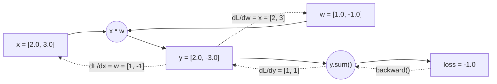

# Week 1: PyTorch 기초 재정비


> **이번 주 목표**: CUDA 환경을 세팅하고, PyTorch의 핵심 개념(Tensor, autograd, DataLoader)을 복습한 뒤, CNN으로 이미지 분류를 직접 학습시킨다.
> **예상 시간**: 12시간
> **핵심 질문**: "PyTorch에서 모델 학습의 전체 파이프라인(데이터 → 모델 → 학습 → 평가 → 저장)을 혼자서 구성할 수 있는가?"


---


## 학습 순서


| 순서 | 단계 | 파일 | 설명 |
|:----:|------|------|------|
| 1 | 환경 설정 | `requirements.txt` | `pip install -r requirements.txt` |
| 2 | 이론 학습 | `README.md` | 아래 핵심 개념 읽기 |
| 3 | Python 퀴즈 (초급) | `quiz_easy.py` | Tensor shape, autograd, DataLoader 개념 확인 |
| 4 | Python 퀴즈 (중급) | `quiz_medium.py` | Gradient 계산, CNN 구현 코드 작성 |
| 5 | 실습 | [PRACTICE.md](./PRACTICE.md) | CIFAR-10 CNN 학습 파이프라인 구축 |


---


## 시작하기 전에


Phase 3는 **딥러닝 기반 2D Perception**을 다루는 단계입니다. YOLO 객체 검출과 Depth Estimation을 배우기 전에, 그 기반이 되는 **PyTorch**를 확실히 잡아야 합니다.


### 왜 PyTorch인가?


PyTorch는 딥러닝 연구와 산업 모두에서 가장 널리 쓰이는 프레임워크입니다.


| 특징 | 설명 |
|------|------|
| **Dynamic Computation Graph** | 실행 시점에 그래프가 생성되어 디버깅이 쉬움 |
| **Pythonic** | NumPy와 유사한 API로 학습 곡선이 낮음 |
| **생태계** | torchvision, torchaudio, HuggingFace 등 풍부한 라이브러리 |
| **배포** | ONNX, TorchScript, TensorRT 등 다양한 배포 경로 |


### 비유로 이해하기


PyTorch를 **레고 블록**에 비유할 수 있습니다.
- **Tensor**: 레고 브릭 하나하나 (데이터의 기본 단위)
- **autograd**: 조립 설명서를 자동으로 만들어주는 시스템 (역전파 자동 계산)
- **nn.Module**: 미리 만들어진 레고 세트 (Conv, Linear 등)
- **DataLoader**: 레고 브릭을 정리해서 한 묶음씩 전달해주는 역할


---


## 핵심 개념 자세히 알아보기


### 1. CUDA 환경 세팅


#### PC (학습용)


CUDA는 NVIDIA GPU를 활용한 병렬 연산 라이브러리입니다. 딥러닝 학습에서 GPU를 사용하면 CPU 대비 **10-100배** 빠릅니다.


```bash
# 1. NVIDIA 드라이버 확인
nvidia-smi


# 2. venv 가상환경 생성
python3 -m venv .venv
source .venv/bin/activate


# 3. PyTorch 설치 (CUDA 11.8 기준)
pip install torch torchvision torchaudio --index-url https://download.pytorch.org/whl/cu118


# 4. 설치 확인
python -c "import torch; print(torch.cuda.is_available())"
# 출력: True
```


#### Jetson Orin Nano (배포용)


```bash
# JetPack 6.0 설치 후
# PyTorch ARM64 버전 설치
pip install torch torchvision # Jetson용 whl 파일 사용


# CUDA, TensorRT 확인
python -c "import torch; print(torch.cuda.is_available())"
dpkg -l | grep tensorrt
```


#### GPU 메모리 관리


GPU 메모리는 한정되어 있으므로 관리가 중요합니다.


```python
import torch


# GPU 정보 확인
print(f"GPU: {torch.cuda.get_device_name(0)}")
print(f"총 메모리: {torch.cuda.get_device_properties(0).total_memory / 1e9:.1f} GB")
print(f"할당된 메모리: {torch.cuda.memory_allocated() / 1e6:.1f} MB")
print(f"캐시된 메모리: {torch.cuda.memory_reserved() / 1e6:.1f} MB")


# 메모리 해제
torch.cuda.empty_cache()
```


**GPU 메모리 부족(OOM) 해결법**:
1. `batch_size` 줄이기 (가장 효과적)
2. `torch.cuda.empty_cache()` 호출
3. `with torch.no_grad():` 블록 사용 (추론 시)
4. Mixed Precision (FP16) 사용
5. Gradient Accumulation


---


### 2. Tensor 연산


Tensor는 PyTorch의 **기본 데이터 구조**입니다. NumPy의 ndarray와 유사하지만, GPU 연산과 자동 미분을 지원합니다.


```python
import torch


# -- 텐서 생성 --
x = torch.zeros(3, 4) # 0으로 채운 3x4 텐서
x = torch.ones(3, 4) # 1로 채운 3x4 텐서
x = torch.randn(3, 4) # 표준 정규분포 랜덤
x = torch.tensor([1, 2, 3]) # 직접 값 지정
x = torch.arange(0, 10, 2) # [0, 2, 4, 6, 8]


# -- 텐서 속성 --
print(x.shape) # 크기
print(x.dtype) # 데이터 타입 (float32, int64 등)
print(x.device) # cpu 또는 cuda:0


# -- GPU로 이동 --
device = torch.device('cuda' if torch.cuda.is_available() else 'cpu')
x = x.to(device)
# 또는
x = x.cuda()
```


#### 주요 연산


```python
# -- 기본 연산 --
a = torch.randn(3, 4)
b = torch.randn(3, 4)


c = a + b # 요소별 덧셈
c = a * b # 요소별 곱셈 (Hadamard product)
c = a @ b.T # 행렬 곱 (matmul)
c = torch.matmul(a, b.T) # 동일


# -- Shape 변환 (각 연산은 원본 x에 대한 독립 예시) --
x = torch.randn(2, 3, 4)
print(x.view(2, 12).shape)      # [2,3,4] → [2,12] (메모리 연속 필요)
print(x.reshape(2, 12).shape)   # [2,3,4] → [2,12] (메모리 복사 가능)
print(x.permute(2, 0, 1).shape) # [2,3,4] → [4,2,3] (차원 순서 변경, HWC → CHW 등)

y = torch.randn(3, 4)
print(y.unsqueeze(0).shape)     # [3,4] → [1,3,4] (차원 추가)

z = torch.randn(1, 3, 4)
print(z.squeeze(0).shape)       # [1,3,4] → [3,4] (차원 제거)


# -- 이미지에서 자주 쓰는 변환 --
# OpenCV (HWC, BGR) → PyTorch (CHW, RGB)
import numpy as np
img_np = np.random.randint(0, 255, (480, 640, 3), dtype=np.uint8)
img_tensor = torch.from_numpy(img_np).permute(2, 0, 1).float() / 255.0
# shape: [3, 480, 640], range: [0, 1]
```


#### 텐서 이미지 시각화


matplotlib의 `imshow`는 `(H, W, C)` 순서를 기대합니다. 위에서 `permute(2, 0, 1)`로
`(C, H, W)`로 바꿔놨기 때문에, 시각화하려면 다시 `(H, W, C)`로 되돌려야 합니다.


변환 효과가 한눈에 보이도록, 무작위 노이즈 대신 색이 구분되는 구조적 이미지
(4분할 색상 블록)를 만들어 세 가지를 나란히 비교합니다. (1) 변환 전 원본,
(2) `permute` 없이 `reshape`만 한 잘못된 복원(깨짐), (3) `permute`로 축을
제대로 되돌린 올바른 복원.


```python
import matplotlib.pyplot as plt
import numpy as np
import torch

# -- 구조가 보이는 데모 이미지 생성 (4분할 색상 블록) --
H, W = 480, 640
img_np = np.zeros((H, W, 3), dtype=np.uint8)
img_np[: H // 2, : W // 2] = [220, 50, 50]   # 좌상: 빨강
img_np[: H // 2, W // 2 :] = [50, 200, 50]   # 우상: 초록
img_np[H // 2 :, : W // 2] = [50, 80, 220]   # 좌하: 파랑
img_np[H // 2 :, W // 2 :] = [230, 210, 40]  # 우하: 노랑

# (H, W, C) → (C, H, W), 0~1 정규화
img_tensor = torch.from_numpy(img_np).permute(2, 0, 1).float() / 255.0

plt.figure(figsize=(12, 3))

# 1) 변환 전: 원본 numpy 이미지 (H, W, C) → 그대로 표시 가능
plt.subplot(1, 3, 1)
plt.imshow(img_np)
plt.title("1. original img_np (H,W,C)")
plt.axis("off")

# 2) 잘못된 복원: permute 없이 reshape만 → 픽셀이 뒤섞여 깨짐
wrong = img_tensor.reshape(H, W, 3).cpu().numpy()
plt.subplot(1, 3, 2)
plt.imshow(wrong)
plt.title("2. reshape only (broken)")
plt.axis("off")

# 3) 올바른 복원: permute로 축을 (H, W, C)로 되돌림
img_back = img_tensor.permute(1, 2, 0).cpu().numpy()  # (480, 640, 3), 0~1 float
plt.subplot(1, 3, 3)
plt.imshow(img_back)
plt.title("3. permute (correct)")
plt.axis("off")

plt.tight_layout()
plt.show()
```


**`img_back` 한 줄 분해**:


`img_back = img_tensor.permute(1, 2, 0).cpu().numpy()` 는 메서드 체이닝으로
세 변환을 순서대로 적용합니다. 시작 상태는 `(3, 480, 640)` = `(C, H, W)`, float, 0-1 범위입니다.


1. **`.permute(1, 2, 0)`** - 차원 순서 재배치. 인자는 "새 텐서의 각 축에 기존 텐서의
   몇 번째 축을 놓을지"를 지정합니다.


```
기존 축 인덱스:  0=C(3)   1=H(480)   2=W(640)

permute(1, 2, 0)
        |  |  +-- 새 축 2 <- 기존 축 0 (C, 채널)
        |  +----- 새 축 1 <- 기존 축 2 (W, 너비)
        +-------- 새 축 0 <- 기존 축 1 (H, 높이)

결과: (480, 640, 3) = (H, W, C)
```


   데이터를 복사하지 않고 stride 메타데이터만 바꾼 view를 반환하므로, 결과 텐서는
   메모리상 비연속(non-contiguous) 상태가 됩니다.

2. **`.cpu()`** - 텐서가 GPU(`cuda:0`)에 있으면 CPU 메모리로 복사. numpy는 CPU 메모리만
   접근할 수 있어 필요합니다. 이미 CPU에 있으면 아무 동작도 하지 않습니다(no-op).

3. **`.numpy()`** - torch.Tensor를 numpy.ndarray로 변환. matplotlib, OpenCV 등은 numpy를
   입력으로 받습니다. CPU 텐서와 numpy 배열은 같은 메모리를 공유합니다(가능한 경우 복사 없음).


순서가 중요합니다. `.cpu()`가 `.numpy()`보다 먼저 와야 하며, GPU 텐서에 바로 `.numpy()`를
호출하면 에러가 납니다. grad가 붙은 텐서라면 `.numpy()` 전에 `.detach()`가 추가로
필요합니다(`...permute(1,2,0).detach().cpu().numpy()`).


**알아둘 점**:
- `permute(1, 2, 0)`: `(C, H, W)` → `(H, W, C)`. 앞서 한 `permute(2, 0, 1)`을 정확히 되돌리는 연산
- **`reshape` != `permute`**: `reshape`는 메모리를 1차원으로 편 뒤 새 모양에 그대로 재배치할 뿐 축 순서를 바꾸지 않음. `(C, H, W)` 메모리는 채널별로 뭉쳐 있어 `(H, W, 3)`로 재해석하면 픽셀이 섞여 깨짐(패널 2). 축을 옮기려면 반드시 `permute`를 써야 함
- `.cpu().numpy()`: 텐서가 GPU에 있거나 grad가 붙어 있으면 바로 numpy 변환이 안 되므로 `cpu()`를 거치는 것이 안전
- dtype 차이: `imshow`는 uint8이면 0-255, float이면 0-1 범위로 해석. `img_tensor`는 `/255.0`으로 정규화돼 있어 그대로 표시됨
- 패널 1(변환 전 원본)과 패널 3(`permute` 복원)이 동일하고 패널 2(`reshape`)만 깨져 보이면 변환이 올바른 것


---


### 3. autograd (자동 미분)


autograd는 PyTorch의 **자동 미분 엔진**입니다. 순전파(forward)에서 수행된 연산을
기록해두었다가, `backward()`를 호출하면 각 변수에 대한 gradient를 자동으로 계산합니다.
미분 공식을 손으로 짤 필요가 없습니다.


#### gradient가 뭔가? (직관)


`gradient`(기울기)는 한마디로 **"이 값을 아주 조금 바꾸면 loss가 얼마나 변하는가"**
입니다. 수학적으로는 `loss`를 그 변수로 미분한 값(편미분, dL/dvar)입니다.


- `x.grad` = dL/dx = "x를 조금 키우면 loss가 얼마나 변하나"
- `w.grad` = dL/dw = "w를 조금 키우면 loss가 얼마나 변하나"


딥러닝에서 `w`는 모델의 가중치(weight)입니다. 이 gradient를 보고 "loss를 줄이려면
w를 어느 방향으로 바꿔야 하는지" 알아내서 그 방향으로 조금씩 업데이트하는 것이
바로 **학습**입니다.


#### 예제 코드


```python
import torch

# requires_grad=True → 이 텐서의 gradient를 추적
x = torch.tensor([2.0, 3.0], requires_grad=True)
w = torch.tensor([1.0, -1.0], requires_grad=True)

# 순전파 (forward)
y = x * w        # [2.0, -3.0]  (요소별 곱)
loss = y.sum()   # -1.0         (스칼라)

# 역전파 (backward)
loss.backward()

# gradient 확인
print(x.grad)    # tensor([ 1., -1.])  → dL/dx
print(w.grad)    # tensor([2., 3.])    → dL/dw
```


이 예제의 연산 흐름을 그림으로 보면 (실선 = 순전파, 점선 = `backward()` 역전파):





#### 순전파: 숫자 따라가기


```
x = [2.0,  3.0]
w = [1.0, -1.0]

y = x * w = [2.0*1.0, 3.0*(-1.0)] = [2.0, -3.0]   # 요소별 곱

loss = y.sum() = 2.0 + (-3.0) = -1.0
```


여기까지가 forward입니다. 이 계산을 하는 동안 PyTorch는 `requires_grad=True`인
텐서가 **어떤 연산을 거쳤는지 그래프로 기록**해 둡니다 (위 그림의 실선 부분).


#### 역전파: gradient 값이 왜 저렇게 나오나


`loss`를 x, w로 직접 풀어쓰면:


```
loss = y0 + y1 = (x0 * w0) + (x1 * w1)
```


핵심은 **곱셈의 미분**입니다. `x * w`를 한 변수로 미분하면 상대 변수만 남습니다.


```
d(x*w)/dx = w     (w를 상수 취급)
d(x*w)/dw = x     (x를 상수 취급)
```


이걸 각 원소에 적용하면:


| 변수 | 편미분 | 값 | 의미 |
|------|--------|-----|------|
| `x.grad[0]` | dL/dx0 = w0 |  1.0 | x0를 키우면 loss가 +1.0 비율로 변함 |
| `x.grad[1]` | dL/dx1 = w1 | -1.0 | x1를 키우면 loss가 -1.0 비율로 변함 |
| `w.grad[0]` | dL/dw0 = x0 |  2.0 | w0를 키우면 loss가 +2.0 비율로 변함 |
| `w.grad[1]` | dL/dw1 = x1 |  3.0 | w1를 키우면 loss가 +3.0 비율로 변함 |


즉 `x.grad = [1, -1]`은 우연이 아니라 **w의 값**이고, `w.grad = [2, 3]`은
**x의 값**입니다. `loss = x*w` 형태라서 서로의 값이 상대방의 기울기가 됩니다.


#### backward() 한 줄이 한 일


1. 기록해 둔 연산 그래프를 **거꾸로** 따라간다 (loss -> sum -> mul -> x, w).
2. 연쇄 법칙(chain rule)으로 각 변수의 편미분을 자동 계산한다.
3. 결과를 각 텐서의 `.grad` 속성에 저장한다.


forward만 정의하면 backward는 자동입니다. 신경망이 아무리 깊고 복잡해져도
원리는 이 예제와 똑같습니다.


#### backward()가 바꾸는 것 / 안 바꾸는 것


`backward()`의 유일한 관찰 가능한 효과는 **`.grad`가 채워지는 것**입니다.


```
backward() 호출 전:   x.grad = None         w.grad = None
backward() 호출 후:   x.grad = [ 1., -1.]   w.grad = [2., 3.]
```


반대로 **바뀌지 않는 것**:
- `loss` 값 자체 - backward는 미분만 할 뿐 loss를 다시 계산하지 않음
- 가중치 `x`, `w`의 값 - `backward()`는 가중치를 **업데이트하지 않음**


가중치를 실제로 수정하는 것은 `optimizer.step()`입니다. 역할이 분리돼 있습니다:
`backward()` = 기울기 계산, `optimizer.step()` = 그 기울기로 가중치 수정.


#### `.grad`는 덮어쓰기가 아니라 누적(+=)


`backward()`는 `.grad = 새값`이 아니라 `.grad += 새값`으로 동작합니다.
`zero_grad` 없이 같은 계산을 두 번 backward 하면:


```
1회 후:  x.grad = [ 1., -1.]
2회 후:  x.grad = [ 2., -2.]   # 덮어쓰지 않고 더해짐
```


그래서 학습 루프에서 매 iteration `optimizer.zero_grad()`로 `.grad`를 비우지
않으면 이전 step의 gradient가 계속 쌓여 잘못된 방향으로 업데이트됩니다.


참고: 기본적으로 `backward()` 후 연산 그래프는 메모리에서 해제됩니다. 같은 그래프에
`backward()`를 두 번 호출하면 에러가 나며, 필요하면 `backward(retain_graph=True)`를 씁니다.


#### 학습 루프에서 backward()의 위치


```
optimizer.zero_grad()   # 1. 이전 .grad 비우기 (누적 방지)
outputs = model(x)      # 2. 순전파 (그래프 기록)
loss = criterion(...)   # 3. loss 계산
loss.backward()         # 4. <- 여기. .grad 채움 (가중치는 아직 그대로)
optimizer.step()        # 5. .grad 보고 가중치 실제 업데이트
```


`backward()`는 4번에서 "어느 방향으로 얼마나 바꿔야 하는지(`.grad`)"만 계산하고,
실제 수정은 5번 `optimizer.step()`이 합니다.


#### 한 문장 요약


> `requires_grad=True`로 추적을 켜고 -> forward로 loss를 계산하면 -> `backward()`가
> "각 변수를 조금 바꿀 때 loss가 얼마나 변하는지(`.grad`)"를 자동으로 채워준다.
> 그 `.grad` 값으로 가중치를 업데이트하는 것이 학습이다.


**핵심 규칙**:
- `requires_grad=True`인 텐서에 대해서만 gradient 계산
- `loss`는 스칼라(숫자 하나)여야 `backward()` 호출 가능 (그래서 `.sum()`이나 `.mean()`으로 줄임)
- `loss.backward()` 호출 후 `.grad`에 gradient 저장
- `optimizer.zero_grad()`로 gradient 초기화 (매 iteration). 안 하면 gradient가 누적됨
- 추론 시에는 `with torch.no_grad():` 사용 (그래프 기록 안 함 -> 메모리 절약)


---


### 4. Dataset & DataLoader


#### Dataset: 데이터 하나를 어떻게 읽을 것인가


```python
from torch.utils.data import Dataset
from PIL import Image
import os


class CustomDataset(Dataset):
    def __init__(self, image_dir, transform=None):
        self.image_dir = image_dir
        self.transform = transform
        self.image_list = os.listdir(image_dir)


    def __len__(self):
        """데이터셋의 총 개수"""
        return len(self.image_list)


    def __getitem__(self, idx):
        """idx번째 데이터를 반환"""
        img_path = os.path.join(self.image_dir, self.image_list[idx])
        image = Image.open(img_path).convert('RGB')
        label = 0 # 실제로는 파일명이나 별도 파일에서 읽음


        if self.transform:
            image = self.transform(image)


        return image, label
```


#### DataLoader: 데이터를 배치 단위로 묶어서 전달


```python
from torch.utils.data import DataLoader


dataset = CustomDataset('path/to/images')
dataloader = DataLoader(
    dataset,
    batch_size=32, # 한 번에 32개씩
    shuffle=True, # 매 epoch마다 순서 섞기
    num_workers=4, # 데이터 로딩 병렬화 (CPU 코어 수)
    pin_memory=True, # GPU 전송 속도 향상
    drop_last=True, # 마지막 불완전 배치 버림
)


# 사용
for batch_idx, (images, labels) in enumerate(dataloader):
    images = images.to(device) # GPU로 이동
    labels = labels.to(device)
    # ... 학습 코드 ...
```


**DataLoader의 역할 시각화**:


```
Dataset: [img0, img1, img2, img3, img4, img5, img6, img7, ...]
              ↓ shuffle + batch_size=4
DataLoader:
  Batch 0: [img5, img2, img7, img0] → GPU
  Batch 1: [img3, img1, img6, img4] → GPU
  ...
```


---


### 5. CNN 학습 파이프라인 (CIFAR-10)


CIFAR-10은 10개 클래스의 32x32 컬러 이미지 60,000장으로 구성된 벤치마크 데이터셋입니다.


```python
import torch
import torch.nn as nn
import torch.optim as optim
import torchvision
import torchvision.transforms as transforms


# -- 1. 데이터 준비 --
transform = transforms.Compose([
    transforms.RandomHorizontalFlip(),
    transforms.RandomCrop(32, padding=4),
    transforms.ToTensor(),
    transforms.Normalize((0.4914, 0.4822, 0.4465),
                         (0.2470, 0.2435, 0.2616)),
])


trainset = torchvision.datasets.CIFAR10(
    root='./data', train=True, download=True, transform=transform)
trainloader = DataLoader(trainset, batch_size=128, shuffle=True, num_workers=2)


testset = torchvision.datasets.CIFAR10(
    root='./data', train=False, download=True, transform=transform)
testloader = DataLoader(testset, batch_size=128, shuffle=False, num_workers=2)


# -- 2. 간단한 CNN 모델 --
class SimpleCNN(nn.Module):
    def __init__(self):
        super().__init__()
        self.features = nn.Sequential(
            nn.Conv2d(3, 32, 3, padding=1), # [B, 32, 32, 32]
            nn.BatchNorm2d(32),
            nn.ReLU(),
            nn.MaxPool2d(2), # [B, 32, 16, 16]


            nn.Conv2d(32, 64, 3, padding=1), # [B, 64, 16, 16]
            nn.BatchNorm2d(64),
            nn.ReLU(),
            nn.MaxPool2d(2), # [B, 64, 8, 8]


            nn.Conv2d(64, 128, 3, padding=1), # [B, 128, 8, 8]
            nn.BatchNorm2d(128),
            nn.ReLU(),
            nn.AdaptiveAvgPool2d(1), # [B, 128, 1, 1]
        )
        self.classifier = nn.Linear(128, 10)


    def forward(self, x):
        x = self.features(x)
        x = x.view(x.size(0), -1) # flatten
        x = self.classifier(x)
        return x


# -- 3. 학습 설정 --
device = torch.device('cuda' if torch.cuda.is_available() else 'cpu')
model = SimpleCNN().to(device)
criterion = nn.CrossEntropyLoss()
optimizer = optim.Adam(model.parameters(), lr=0.001)
scheduler = optim.lr_scheduler.StepLR(optimizer, step_size=30, gamma=0.1)


# -- 4. 학습 루프 --
num_epochs = 50
for epoch in range(num_epochs):
    model.train()
    running_loss = 0.0
    correct = 0
    total = 0


    for images, labels in trainloader:
        images, labels = images.to(device), labels.to(device)


        optimizer.zero_grad() # gradient 초기화
        outputs = model(images) # 순전파
        loss = criterion(outputs, labels) # 손실 계산
        loss.backward() # 역전파
        optimizer.step() # 파라미터 업데이트


        running_loss += loss.item()
        _, predicted = outputs.max(1)
        total += labels.size(0)
        correct += predicted.eq(labels).sum().item()


    scheduler.step()
    train_acc = 100. * correct / total
    print(f"Epoch [{epoch+1}/{num_epochs}] "
          f"Loss: {running_loss/len(trainloader):.4f} "
          f"Acc: {train_acc:.2f}%")
```


---


### 6. ResNet-18 이미지 분류


**ResNet(Residual Network)**은 잔차 연결(skip connection)을 도입하여 깊은 네트워크 학습을 가능하게 한 모델입니다.


```
일반 블록: ResNet 블록:
x --→ F(x) x --→ F(x) --→ F(x) + x
                     | ↑
                     +----------------+
                        (skip connection)
```


```python
import torchvision.models as models


# Pretrained ResNet-18 로드
model = models.resnet18(weights='IMAGENET1K_V1')


# CIFAR-10용으로 수정 (10 classes)
model.fc = nn.Linear(model.fc.in_features, 10)
model = model.to(device)
```


---


### 7. TensorBoard 시각화


```python
from torch.utils.tensorboard import SummaryWriter


writer = SummaryWriter('runs/cifar10_experiment')


# 학습 중 로깅
for epoch in range(num_epochs):
    # ... 학습 코드 ...
    writer.add_scalar('Loss/train', train_loss, epoch)
    writer.add_scalar('Accuracy/train', train_acc, epoch)
    writer.add_scalar('Accuracy/val', val_acc, epoch)
    writer.add_scalar('LR', optimizer.param_groups[0]['lr'], epoch)


writer.close()
```


```bash
# TensorBoard 실행
tensorboard --logdir=runs
# 브라우저에서 http://localhost:6006 접속
```


---


### 8. Checkpoint 저장/로드


```python
# -- 저장 --
torch.save({
    'epoch': epoch,
    'model_state_dict': model.state_dict(),
    'optimizer_state_dict': optimizer.state_dict(),
    'loss': loss,
    'best_acc': best_acc,
}, 'checkpoint.pth')


# -- 로드 --
checkpoint = torch.load('checkpoint.pth')
model.load_state_dict(checkpoint['model_state_dict'])
optimizer.load_state_dict(checkpoint['optimizer_state_dict'])
start_epoch = checkpoint['epoch']
best_acc = checkpoint['best_acc']
```


**Best Model 저장 패턴**:


```python
best_acc = 0.0


for epoch in range(num_epochs):
    # ... 학습 ...
    val_acc = evaluate(model, testloader)


    if val_acc > best_acc:
        best_acc = val_acc
        torch.save(model.state_dict(), 'best_model.pth')
        print(f"Best model saved! Acc: {best_acc:.2f}%")
```


---


## 꼭 이해해야 할 핵심 개념


### 1. 학습 파이프라인의 흐름


```
데이터 준비 모델 정의 학습 루프
--------- ---------- ----------
Dataset -+ nn.Module for epoch:
             +→ DataLoader --→ model(x) optimizer.zero_grad()
Transform -+ | output = model(x)
                               v loss = criterion(output, y)
                           predictions loss.backward()
                               | optimizer.step()
                               v
                           loss 계산
```


### 2. train() vs eval() 모드


| 모드 | BatchNorm | Dropout | 용도 |
|------|-----------|---------|------|
| `model.train()` | 배치 통계 사용 | 활성화 | 학습 시 |
| `model.eval()` | 이동 평균 사용 | 비활성화 | 추론/평가 시 |


### 3. GPU 메모리 최적화 전략


| 전략 | 효과 | 사용법 |
|------|------|--------|
| batch_size 줄이기 | 메모리 직접 감소 | `batch_size=16` → `8` |
| Mixed Precision | 메모리 50% 감소 | `torch.cuda.amp` |
| Gradient Accumulation | 큰 배치 효과 | 여러 미니배치 gradient 누적 |
| `torch.no_grad()` | 추론 시 절약 | gradient 기록 안 함 |
| `del` + `empty_cache()` | 즉시 해제 | 불필요한 텐서 삭제 |


---


## 자체 점검 - 이해했는지 확인!


**Q1. `requires_grad=True`의 역할은 무엇인가?**
> autograd가 해당 텐서에 대한 연산을 추적하여, `backward()` 호출 시 자동으로 gradient를 계산할 수 있게 합니다. 모델의 학습 가능한 파라미터(weight, bias)는 기본적으로 이 속성이 True입니다.


**Q2. Dataset과 DataLoader의 역할 차이는?**
> Dataset은 데이터 하나(이미지, 라벨)를 어떻게 읽고 전처리할지 정의합니다. DataLoader는 Dataset으로부터 데이터를 배치 단위로 묶고, 순서를 섞고(shuffle), 병렬로 로딩(num_workers)하는 역할을 합니다.


**Q3. `model.train()`과 `model.eval()`의 차이는?**
> `train()` 모드에서는 BatchNorm이 현재 배치의 통계를 사용하고 Dropout이 활성화됩니다. `eval()` 모드에서는 BatchNorm이 학습 중 누적된 이동 평균을 사용하고 Dropout이 비활성화되어 일관된 추론 결과를 보장합니다.


**Q4. GPU 메모리 부족(OOM) 시 해결 방법 3가지는?**
> 1) batch_size를 줄인다. 2) `torch.cuda.amp`로 Mixed Precision 학습을 사용한다. 3) 추론 시 `with torch.no_grad():` 블록을 사용하여 gradient 기록을 비활성화한다. 추가로 Gradient Accumulation, 모델 크기 축소 등도 가능합니다.


---


## 이번 주 실습 & 다음 주 준비


### 이번 주 실습 과제


1. **CUDA 환경 세팅**: venv 환경 만들고 PyTorch GPU 버전 설치 확인
2. **Tensor 연산 연습**: 다양한 shape 변환, GPU 이동 실습
3. **CIFAR-10 CNN 학습**: SimpleCNN으로 70%+ 정확도 달성
4. **ResNet-18 Fine-tuning**: Pretrained weights로 85%+ 달성
5. **TensorBoard 시각화**: Loss/Accuracy 커브 확인
6. **Checkpoint 저장/로드**: 학습 중단 후 이어서 학습


### 다음 주 준비


- Albumentations 공식 문서 훑어보기: https://albumentations.ai/docs/
- Weights & Biases 가입: https://wandb.ai
- timm 라이브러리 설치: `pip install timm`


---


## 이번 주 핵심 요약


1. **CUDA 환경 세팅**이 딥러닝의 첫 걸음이다. `torch.cuda.is_available()`이 True여야 한다.
2. **Tensor**는 PyTorch의 기본 단위이며, GPU에서 동작하고 자동 미분을 지원한다.
3. **autograd**는 `backward()`로 gradient를 자동 계산하며, 이것이 딥러닝 학습의 핵심이다.
4. **Dataset + DataLoader** 패턴으로 데이터를 효율적으로 배치 단위로 공급한다.
5. **학습 루프**는 `zero_grad → forward → loss → backward → step` 순서를 반드시 지킨다.


---


- 이전: [Phase 2 - Perception 기하 기초](../../../Roadmap/Phase%202.md)


다음: [Week 2 - CV 라이브러리](../week2/README.md)
