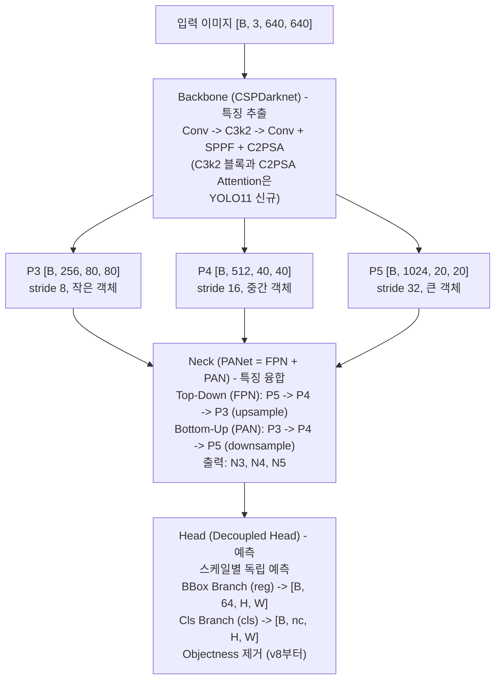
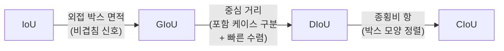

# Week 3: YOLO 이론 (Section 5.2)

> **이번 주 목표**: YOLO의 발전사를 이해하고, YOLO11의 구조(Backbone-Neck-Head)와 Loss 함수, Detection 평가 지표를 학습한다.
> **예상 시간**: 12시간
> **핵심 질문**: "YOLO11이 어떤 원리로 하나의 이미지에서 여러 객체를 한 번에 검출하는가?"

---

## 학습 순서

| 순서 | 단계 | 파일 | 설명 |
|:----:|------|------|------|
| 1 | 환경 설정 | `requirements.txt` | 첫 실행 시 `pip install -r requirements.txt` |
| 2 | 이론 학습 | `README.md` | 아래 핵심 개념 읽기 |
| 3 | Python 퀴즈 (초급) | `quiz_easy.py` | YOLO 구조, Anchor, mAP 개념 확인 |
| 4 | Python 퀴즈 (중급) | `quiz_medium.py` | IoU 계산, NMS 구현 코드 작성 |
| 5 | 실습 | [PRACTICE.md](./PRACTICE.md) | YOLO 이론 검증 실습 |

---

## 시작하기 전에

### Week 2와의 연결

Week 2에서는 Augmentation, 실험 관리, Pretrained 모델 같은 **도구**를 익혔다. Week 3은 그 도구로 다룰 **대상** 자체 - 객체 검출 모델 YOLO - 의 내부 원리를 본다. 아직 코드를 학습시키지는 않고, 구조와 수식을 이해하는 이론 주차다.

| Week 2 | -> | Week 3 |
|---------|---|---------|
| CV 라이브러리 도구 | -> | YOLO Detection 이론 |
| Augmentation 파이프라인 | -> | Detection 학습 데이터 이해 |
| Pretrained 모델 활용 | -> | YOLO Backbone 구조 이해 |

### 왜 YOLO인가?

**객체 검출(Object Detection)** 은 이미지에서 "무엇이, 어디에 있는가"를 동시에 찾는 문제다. 분류(Classification)가 "이 사진은 고양이"라고만 답한다면, 검출은 "왼쪽 위에 고양이, 오른쪽 아래에 개"처럼 위치(BBox)까지 답한다.

YOLO(You Only Look Once)는 **실시간 객체 검출**의 대표 모델이다. 이름 그대로 이미지를 "한 번만 본다" - 즉 한 번의 신경망 통과로 모든 객체를 찾는다. SLAM/로봇 시스템에서 주변 객체를 인식할 때 가장 널리 쓰인다.

| 특징 | 설명 |
|------|------|
| **One-Stage** | 한 번의 forward pass로 검출 (뒤에 나올 Two-Stage보다 빠름) |
| **실시간** | 30 FPS 이상으로 영상 처리 가능 |
| **End-to-End** | 입력 이미지 -> BBox + Class + Confidence를 바로 출력 |
| **범용성** | 자율주행, 로봇, CCTV 등 다양한 분야에서 활용 |

---

## 핵심 개념 자세히 알아보기

### 1. YOLO 발전사 개요

YOLO는 2015년 YOLOv1 이후 꾸준히 발전해 왔다. 큰 흐름은 **Anchor 기반** 시대에서 **Anchor-Free** 시대로의 전환이다 (Anchor가 무엇인지는 §2에서 설명한다). 지금 단계에서는 "어느 버전이 어느 진영인지"만 눈에 익히면 된다.

```
YOLO 발전 타임라인
━━━━━━━━━━━━━━━━━━━━━━━━━━━━━━━━━━━━━━━━━━━━━


2015 YOLOv1 --- 최초의 One-Stage Detector
        |
2016 YOLOv2 --- Anchor Box 도입, Batch Normalization
        |
2018 YOLOv3 --- Multi-Scale Detection (FPN)
        | ---- Anchor 기반 시대 ----
        |
2020 YOLOv5 --- PyTorch 구현, 실용성 극대화
        |
2022 YOLOv7 --- E-ELAN, Auxiliary Head
        |
2023 YOLOv8 --- Anchor-Free, Decoupled Head, C2f
        | ---- Anchor-Free 시대 ----
        |
2024 YOLO11 --- C3k2 블록 + C2PSA (Position-Sensitive
        | Attention) Neck, v8 대비 파라미터 감소
        | + mAP 향상
        |
2025 YOLO26 --- 최신 (커뮤니티 평가 미흡, 참고용)
```

이 주차의 학습 대상은 **YOLO11**이다. v8에서 도입된 Anchor-Free 방식을 계승하면서 Backbone과 Neck을 개선한 버전이다.

---

### 2. Anchor 기반 vs Anchor-Free

검출 모델이 풀어야 하는 어려운 문제 하나가 "BBox의 크기와 위치를 어떻게 숫자로 예측하느냐"다. 객체는 작을 수도 크을 수도, 가로로 길 수도 세로로 길 수도 있다. 이 문제를 푸는 두 가지 접근이 Anchor 기반과 Anchor-Free다.

#### Anchor 기반 (YOLOv1-v7, v5도 기본 anchor)

**Anchor(앵커)** 란 미리 정해 둔 BBox 템플릿이다. "작은 정사각형, 가로로 긴 직사각형, 큰 직사각형..." 같은 표준 모양 여러 개를 먼저 깔아 두고, 모델은 "그 템플릿을 얼마나 옮기고 늘려야 실제 객체에 맞는가"(오프셋)만 예측한다. 0에서 BBox를 그리는 것보다 템플릿을 보정하는 게 쉽다는 발상이다.

| 항목 | 내용 |
|---|---|
| 사전 정의 | 작은/중간/큰 Anchor Box 템플릿 여러 개를 미리 깔아 둠 |
| 모델 예측값 | dx, dy (중심 위치 보정), dw, dh (크기 보정), confidence, class probabilities |

**문제점**: 편리해 보이지만 대가가 있다.

- Anchor의 크기/비율을 사전에 정해야 한다. 보통 학습 데이터의 BBox들을 K-means 군집화해서 결정한다.
- Anchor 개수가 많아지면 예측해야 할 값이 늘어 연산량이 증가한다.
- 데이터셋이 바뀌면 (예: 사람 위주 -> 차량 위주) 최적 Anchor도 달라져, 다시 튜닝해야 한다.

#### Anchor-Free (YOLOv8 - YOLO11)

**Anchor-Free** 방식은 템플릿을 아예 두지 않는다. 각 그리드 셀이 "내 중심에서 객체의 위/아래/왼쪽/오른쪽 경계까지의 거리"를 직접 예측한다. YOLO11은 v8에서 도입된 이 방식을 그대로 계승한다.

| 항목 | 내용 |
|---|---|
| 사전 정의 | 없음 (Anchor 템플릿 자체를 두지 않음) |
| 모델 예측값 | left, top, right, bottom (셀 중심에서 BBox 네 변까지의 거리), class probabilities |

**장점**:

- Anchor 설계/튜닝이 아예 불필요하다 - 사람이 손댈 하이퍼파라미터가 줄어든다.
- 템플릿에 갇히지 않아 더 유연한 BBox 예측이 가능하다.
- 학습이 더 안정적이다.

---

### 3. YOLO11 전체 구조

YOLO11은 **Backbone -> Neck -> Head** 세 부분으로 구성된다. 각 부분의 역할을 한 줄로 요약하면:

- **Backbone(백본)**: 이미지에서 특징을 **추출**한다. "이 영역엔 모서리, 저 영역엔 질감" 같은 특징 지도를 만든다.
- **Neck(넥)**: 서로 다른 크기의 특징 지도를 **융합**한다. 큰 객체용 정보와 작은 객체용 정보를 섞는다.
- **Head(헤드)**: 융합된 특징으로 최종 **예측**(BBox + 클래스)을 한다.

`quiz_easy.py` 문제 2가 이 역할 분담(Backbone=추출, Neck=융합, Head=예측)을 그대로 묻는다.

v8 대비 YOLO11의 핵심 변경점은 두 가지다 - Backbone의 **C2f -> C3k2** 블록 교체와, Neck 직전에 **C2PSA(Position-Sensitive Attention)** 모듈 추가다.



---

### 4. Backbone: CSPDarknet

Backbone은 **CSP(Cross Stage Partial)** 구조를 활용한 특징 추출기다. CSP는 특징 지도를 두 갈래로 나눠 한 갈래만 무거운 연산을 거치게 하고 나머지는 그대로 보내는 설계로, 연산량을 줄이면서도 학습 안정성(gradient 흐름)을 유지한다.

#### C3k2 모듈 (YOLO11 핵심 블록)

YOLO11은 v8의 **C2f**를 **C3k2** 블록으로 교체했다. C3k2는 v5의 C3 블록 계열을 잇는 변형으로, 내부 Bottleneck의 커널 크기를 작게 가져가 연산량 대비 표현력을 더 끌어올린다.

```
C3k2 (C3 with smaller kernel-2 Bottlenecks)


입력 -→ Conv1x1 -→ Split -→ Branch1 (direct)
                      | |
                      +→ C3k(k=2) -+→ Concat -→ Conv1x1 -→ 출력
                         C3k(k=2) -+
                         ...


장점:
  - C2f 대비 파라미터 / FLOPs 감소
  - 작은 커널 Bottleneck으로 표현력 유지
  - Gradient flow 분리는 CSP 계열 그대로 계승
```

아래는 C3k2를 개념적으로 단순화한 구현이다. 실제 Ultralytics 구현을 참고했으며, 각 줄이 무엇을 하는지 주석으로 따라갈 수 있다.

```python
import torch                  # PyTorch 본체
import torch.nn as nn         # 신경망 레이어 모음


class C3k2(nn.Module):
    """C3-style block with kernel-2 Bottlenecks (YOLO11)"""

    def __init__(self, c_in, c_out, n=1, c3k=False):
        # c_in: 입력 채널 수, c_out: 출력 채널 수
        # n: 내부 블록 반복 횟수, c3k: 내부 블록 종류 선택 플래그
        super().__init__()                       # nn.Module 초기화 필수 호출
        self.c = c_out // 2                      # 분할 후 한 갈래의 채널 수 (출력의 절반)
        # 1x1 Conv: 입력을 2*self.c 채널로 바꿔 두 갈래로 쪼갤 준비
        self.cv1 = nn.Conv2d(c_in, 2 * self.c, 1)
        # 1x1 Conv: 갈래들을 Concat한 결과를 최종 출력 채널로 정리
        self.cv2 = nn.Conv2d((2 + n) * self.c, c_out, 1)
        # 내부 블록 리스트 생성: c3k=True면 C3kBlock, 아니면 일반 Bottleneck을 n개
        self.m = nn.ModuleList(
            [C3kBlock(self.c, self.c) if c3k else Bottleneck(self.c, self.c)
             for _ in range(n)]
        )

    def forward(self, x):
        # cv1을 통과시킨 뒤 채널 방향(dim=1)으로 2등분 -> 두 갈래를 리스트로 보관
        y = list(self.cv1(x).chunk(2, 1))
        # 내부 블록들을 차례로 통과시키며, 매번 직전 결과를 다음 입력으로 사용
        for m in self.m:
            y.append(m(y[-1]))                   # 마지막 갈래를 블록에 넣고 결과를 누적
        # 모든 갈래를 채널 방향으로 이어 붙인(Concat) 뒤 cv2로 정리해 출력
        return self.cv2(torch.cat(y, 1))
```

> C2f vs C3k2: 외형은 유사하지만, C3k2는 내부 Bottleneck의 receptive field(한 번에 보는 영역)를 작게 가져가 모델 크기를 줄이면서 mAP를 유지/향상시킨다.

#### C2PSA: Position-Sensitive Attention (YOLO11 신규)

YOLO11은 Backbone 마지막(SPPF 뒤)에 **C2PSA** 모듈을 추가했다. PSA(Position-Sensitive Self-Attention)를 CSP 형태로 감싼 블록이다. Attention(주의)은 "이미지의 어느 부분에 더 집중할지" 가중치를 학습하는 기법으로, 다음 효과를 노린다.

- 작은 객체나 일부 가려진 객체에 대한 공간적(positional) 주의를 강화한다.
- Transformer의 전역 의존성(이미지 전체를 한 번에 보는 능력)을 일부 도입하되, Backbone 끝단에서만 적용해 연산 비용을 최소화한다.
- v8의 순수 CNN 구조 대비 mAP가 오른 핵심 근거다.

#### Multi-Scale Feature Maps

Backbone은 한 종류의 특징 지도만 내놓지 않는다. 해상도가 다른 여러 장을 동시에 내놓는다.

```
입력: 640 x 640


Backbone 출력:
  P3: [B, 256, 80, 80] ← stride 8 (작은 객체)
  P4: [B, 512, 40, 40] ← stride 16 (중간 객체)
  P5: [B, 1024, 20, 20] ← stride 32 (큰 객체)


※ stride가 작을수록 해상도가 높아 작은 객체 검출에 유리
```

stride는 "입력 대비 몇 배 줄었는가"다 (Week 2 §4.2에서 다룬 개념). stride 8인 P3은 640/8 = 80 크기로, 해상도가 높아 작은 객체의 위치를 세밀하게 잡는다. stride 32인 P5는 20 크기로, 해상도는 낮지만 한 칸이 넓은 영역을 보므로 큰 객체에 유리하다.

---

### 5. Neck: PANet (Path Aggregation Network)

Backbone이 만든 P3/P4/P5는 각자 강점이 다르다. P3(고해상도)은 위치 정보가 정확하고, P5(저해상도)는 "이게 무엇인가"라는 의미적(semantic) 정보가 풍부하다. Neck은 이 둘을 **양방향으로 섞어** 모든 스케일이 위치 정보와 의미 정보를 모두 갖게 한다.

```
FPN (Top-Down) + PAN (Bottom-Up) 결합:


Top-Down (FPN): Bottom-Up (PAN):
P5 -----→ Upsample + P4 N3 ----→ Downsample + N4
              | |
              v v
P4' ----→ Upsample + P3 N4' ---→ Downsample + N5
              | |
              v v
            P3' N5'


효과:
  - 고해상도(P3)는 작은 객체의 위치 정보를 가짐
  - 저해상도(P5)는 큰 객체의 의미적(semantic) 정보를 가짐
  - PANet은 이 두 정보를 양방향으로 전파
```

- **Top-Down (FPN 경로, Feature Pyramid Network)**: 2017년 발표된 구조로, 저해상도 P5의 의미 정보를 키워서(Upsample) 고해상도 쪽으로 내려보낸다. YOLOv3에서 처음 도입되어 작은 객체 검출 성능을 끌어올렸다.
- **Bottom-Up (PAN 경로, Path Aggregation Network의 핵심 경로)**: 2018년 PANet 논문에서 FPN의 약점(고해상도의 위치 정보가 위로 잘 전달되지 않음)을 보완하려고 추가한 경로다. 고해상도의 위치 정보를 줄여서(Downsample) 저해상도 쪽으로 올려보낸다.

즉, **PANet = FPN(Top-Down) + PAN(Bottom-Up)** 으로, 의미 정보는 위→아래, 위치 정보는 아래→위로 양방향 전파한다.

#### 왜 Multi-Scale이 중요한가?

한 장의 특징 지도만 쓰면 특정 크기의 객체만 잘 잡는다. 객체 크기가 제각각이므로, 크기별로 다른 해상도의 지도에서 검출해야 한다.

```
640x640 이미지에서:


작은 객체 (사람 얼굴):
  → 이미지 내 20x20 픽셀 크기
  → P3 (80x80) Feature Map에서 검출


중간 객체 (자동차):
  → 이미지 내 80x80 픽셀 크기
  → P4 (40x40) Feature Map에서 검출


큰 객체 (건물):
  → 이미지 내 200x200 픽셀 크기
  → P5 (20x20) Feature Map에서 검출
```

---

### 6. Head: Decoupled Head

Head는 Neck이 융합한 특징으로 최종 예측을 한다. YOLO11의 Head는 v8과 마찬가지로 **BBox 예측과 클래스 예측을 분리(Decoupled)** 한다. 위치를 맞추는 일과 종류를 맞추는 일은 성격이 다른 작업이라, 가지를 나눠 따로 학습하는 게 더 잘 된다는 발견에 기반한다.

```
이전 YOLO (Coupled Head):
  Feature → 하나의 Conv → [BBox, Objectness, Class]


YOLOv8 ~ YOLO11 (Decoupled Head):
  Feature -+-→ BBox Branch --→ BBox 예측 [B, 64, H, W]
           | (Conv → Conv)
           |
           +-→ Cls Branch ---→ Class 예측 [B, nc, H, W]
                (Conv → Conv)


변경점 (v5 → v8 → v11):
  1. Objectness score 제거 (v8부터)
  2. BBox와 Classification을 독립적으로 학습
  3. BBox는 DFL(Distribution Focal Loss) 방식으로 예측
  4. YOLO11: Cls 분기에 Depthwise-Separable Conv 도입으로 경량화
```

> **Objectness 제거**: v5까지는 "이 위치에 물체가 있는가"를 따로 점수(objectness)로 예측했다. v8부터는 이를 없애고, 클래스 점수 자체가 그 역할을 겸한다. 예측해야 할 값이 줄어 구조가 단순해졌다.

#### DFL (Distribution Focal Loss)

BBox 좌표를 예측하는 방식에도 개선이 있었다.

```
기존 방식: BBox 좌표를 하나의 값으로 직접 예측
  → 부정확할 수 있음 (특히 경계가 애매한 객체)


DFL 방식: BBox 좌표를 확률 분포로 예측
  → 16개 bin의 확률 분포를 예측 후 기대값 계산
  → 더 정확한 BBox 위치 추정


예시 (left 거리 예측):
  bins: [0, 1, 2, 3, 4, 5, 6, 7, 8, 9, 10, 11, 12, 13, 14, 15]
  probs: [0, 0, 0, 0.1, 0.5, 0.3, 0.1, 0, ...]
  예측값 = sum(bins * probs) = 4.4
```

핵심 발상은 "경계 거리가 정확히 4다"라고 단정하는 대신 "4 근처일 확률이 높다"는 분포를 예측하는 것이다. 경계가 흐릿한 객체에서 더 안정적인 값을 낸다.

---

### 7. Loss Function

학습이란 모델의 예측을 정답에 가깝게 만드는 과정이고, 그 "얼마나 틀렸나"를 재는 함수가 **Loss(손실 함수)** 다. YOLO11의 Loss는 v8과 동일하게 세 요소의 합이다.

```
Total Loss = λ_box * L_box + λ_cls * L_cls + λ_dfl * L_dfl
```

| 항목    | Loss 종류                | 역할              |
|---------|--------------------------|-------------------|
| L_box   | CIoU Loss                | BBox 위치 정확도  |
| L_cls   | BCE Loss                 | 클래스 분류 정확도 |
| L_dfl   | Distribution Focal Loss  | BBox 분포         |

`λ`(람다)는 각 손실의 가중치다. 세 가지를 적절히 섞어 위치도 맞고 분류도 맞는 모델을 만든다.

#### IoU 계열 비교

BBox 위치 손실(L_box)을 이해하려면 먼저 **IoU**(Intersection over Union)를 알아야 한다. IoU는 예측 BBox와 정답 BBox가 얼마나 겹치는지를 0-1로 나타낸 값이다 (1이면 완전히 일치).

```
IoU (Intersection over Union):
  = 교집합 넓이 / 합집합 넓이
    - 교집합: 두 BBox가 겹치는 부분의 넓이
    - 합집합: 두 BBox가 차지하는 전체 넓이 (겹친 부분은 한 번만 셈)
    - 값 범위: 0 (전혀 안 겹침) - 1 (완전 일치)
  문제: BBox가 겹치지 않으면 IoU = 0 이고, 조금 움직여도 여전히 0
        -> gradient = 0 이라 "어느 방향으로 옮겨야 할지" 신호가 없음


GIoU (Generalized IoU):
  = IoU - (C - Union) / C
    - C     : 예측 BBox와 정답 BBox를 모두 안에 담을 수 있는
              가장 작은 축 정렬 직사각형의 넓이
              ("두 박스를 함께 감싸는 가장 작은 봉투"라고 생각하면 된다)
    - Union : 위 IoU에서 쓴 합집합 넓이와 동일
    - (C - Union) / C : C 안에서 어느 BBox도 차지하지 않는
                        "빈 공간"의 비율 (0 - 1).
                        두 BBox가 멀어질수록 빈 공간이 커져 패널티 증가

      +------------------+   <- C (둘을 감싸는 최소 직사각형)
      | +---+            |
      | | A |            |
      | +---+    +---+   |
      |          | B |   |
      |          +---+   |
      +------------------+
      A, B 사이의 빈 공간이 클수록 (C - Union)/C 가 커져 GIoU 감소

  해결: 안 겹쳐도 (C - Union)/C 항이 살아있어서
        "더 가까워지면 손실이 줄어든다"는 gradient가 생김


DIoU (Distance IoU):
  = IoU - d² / c²
    - d : 두 BBox의 중심점 사이 직선 거리 (유클리드 거리)
          중심 ((x1+x2)/2, (y1+y2)/2) 끼리의 거리
    - c : 위에서 정의한 C(최소 감싸는 직사각형)의 대각선 길이
    - d² / c² : 중심 거리를 대각선으로 나눠 0 - 1 로 정규화한 값
                중심이 멀수록 1 에 가까워지고, 완전히 겹치면 0

  해결: GIoU는 "감싸는 봉투의 빈 공간"만 보기 때문에
        두 BBox의 모양이 비슷하면 중심이 어긋나도 손실 변화가 둔하다.
        DIoU는 중심점을 직접 끌어당기는 항이 있어 학습이 더 빠름.


CIoU (Complete IoU): ← YOLOv8 / YOLO11 사용
  = IoU - d²/c² - α·v
    - d, c : DIoU와 동일 (중심점 거리 패널티)
    - v    : 종횡비(가로/세로 비율) 일관성 패널티.
             두 BBox의 w/h 비율 차이를 atan으로 각도화해 비교한 값
             (4/pi²) * (atan(w_gt/h_gt) - atan(w_pred/h_pred))²
             모양 비율이 다를수록 커지고, 같으면 0
    - α    : v 항의 가중치 = v / (1 - IoU + v).
             IoU가 낮을 때는 작아져서 "먼저 중심부터 맞추고",
             IoU가 높아질수록 커져서 "모양 보정"을 강하게 적용

  해결: BBox의 위치(중심)뿐 아니라 가로세로 비율(모양)까지 함께 맞춰
        DIoU보다 더 정밀하게 학습 신호를 제공.
```

#### IoU 계열 비교

각 손실을 따로 본 위 설명을 한 표로 모아 보면 차이가 분명해진다.

| 항목 | IoU | GIoU | DIoU | CIoU |
|---|---|---|---|---|
| 비겹침에서 학습 신호 | 없음 | 외접 박스 빈 공간 | 중심 거리 | 중심 거리 |
| 수렴 속도 | - | 느림 | 빠름 | 빠름 |
| 포함 관계 (한 박스가 다른 박스를 완전히 감쌈) 구분 | 불가 | 불가 | 가능 | 가능 |
| 종횡비(가로/세로 비율) 반영 | 불가 | 불가 | 불가 | 가능 |
| 추가 계산 | 기준 | 외접 면적 | + 중심거리 + 대각선 | + arctan + alpha + v |
| 대표 사용 | 평가 지표(mAP) | 초기 anchor-free | DIoU-NMS | YOLOv4 - YOLO11 회귀 손실 |

수식만 보면 차이가 와닿지 않으니 두 시나리오로 살펴보자.

**시나리오 A**: 큰 박스 A가 작은 박스 B를 완전히 감싸고, B의 위치만 다른 경우.

```
+--------+      +--------+
|  +--+  |      |+--+    |
|  |B |  | vs   ||B |    |
|  +--+  |      |+--+    |
+--A-----+      +--A-----+
B at center     B shifted left
```

- GIoU는 두 경우를 **구분하지 못한다**. 외접 박스 C가 A 자체와 같아서 (C - Union)/C = 0, 결국 GIoU = IoU가 된다.
- DIoU, CIoU는 **구분한다**. 중심 거리 d가 다르기 때문이다.

**시나리오 B**: 중심은 같고 가로세로 비율만 다른 경우 (예: 정답은 16:9, 예측은 1:1).

- GIoU, DIoU는 **페널티가 거의 없다**. 중심 거리 = 0이고 GIoU의 빈 공간 항도 미세하다.
- CIoU만 **페널티를 부과한다**. v 항이 양수로 작용해 비율 차이를 잡아낸다.

진화 흐름 (각 단계가 이전 단계의 명확한 단점 하나를 푼다):



CIoU는 DIoU의 상위 호환에 가깝다. v 항 가중치 alpha가 IoU가 낮을 때 자동으로 작아져 종횡비 보정의 영향을 조절하므로, 종횡비가 균일한 도메인이라도 손해가 거의 없다.

**언제 무엇을 쓸까**:

| 상황 | 추천 | 이유 |
|---|---|---|
| 새 프로젝트 학습 손실 기본값 | CIoU | YOLOv4 - YOLO11 사실상 표준 |
| NMS 단계 | DIoU-NMS | 중심 거리로 "다른 객체 가능성" 판단, 밀집 객체에서 false suppression 감소 |
| 종횡비가 균일한 도메인 (정사각형 박스 위주 위성/세포 등) | DIoU | v 항이 도움 안 되고 계산만 늘어남 |
| 학습 불안정 (CIoU의 w,h gradient 의심) | DIoU 또는 EIoU/SIoU | CIoU의 종횡비 항이 일부 케이스에서 w,h를 동조 학습 못함 |
| 평가 지표 | IoU/mAP | 학습 손실과 평가는 별개 |

실무 표준 조합은 **학습 손실은 CIoU, NMS는 DIoU-NMS**다. GIoU는 역사적 baseline으로 알아두면 충분하다.

왜 그냥 IoU를 손실로 쓰지 않을까? **두 BBox가 전혀 겹치지 않으면 IoU = 0이고, 조금 움직여도 여전히 0이라 gradient(기울기)가 0이 된다.** gradient가 0이면 모델은 "어느 방향으로 BBox를 옮겨야 할지" 신호를 받지 못해 학습이 안 된다. GIoU -> DIoU -> CIoU는 이 문제를 단계적으로 보완하며, 겹치지 않아도 "더 가까워지면 손실이 준다"는 신호를 준다.

아래는 CIoU Loss의 개념적 구현이다. 줄마다 무엇을 계산하는지 따라가 보자.

```python
import torch        # PyTorch 본체
import math         # 원주율 pi 등 수학 상수


def ciou_loss(pred_box, target_box):
    """CIoU Loss 개념적 구현

    pred_box, target_box: [x1, y1, x2, y2] 형식 (좌상단, 우하단 좌표)
        좌표계 컨벤션: 이미지 좌표계 (y축이 아래로 증가)를 가정.
        OpenCV/PIL/PyTorch/YOLO/COCO 등 컴퓨터 비전 표준이며,
        이 컨벤션에서 [x1, y1, x2, y2] = [x_min, y_min, x_max, y_max] 로
        약속되어 항상 x1 < x2, y1 < y2 가 성립한다.
        (수학 좌표계처럼 y가 위로 증가한다고 그리면 y1 > y2 가 되어
         아래 max/min 방향이 반대가 되니 주의 - 본문 §7 IoU 계열 비교 참고.)
    """
    # --- 1. 교집합(Intersection) 영역 계산 ---
    # 위 컨벤션에서 좌상단은 (x_min, y_min) = 작은 좌표, 우하단은 (x_max, y_max) = 큰 좌표.
    # 두 BBox가 겹치는 사각형의 좌상단은 각 좌상단 중 더 큰 값
    # (두 좌상단 중 더 "안쪽"으로 들어간 쪽이 교집합의 시작점이라 max)
    inter_x1 = torch.max(pred_box[0], target_box[0])
    inter_y1 = torch.max(pred_box[1], target_box[1])
    # 겹치는 사각형의 우하단은 각 우하단 중 더 작은 값
    # (두 우하단 중 더 "안쪽"으로 들어간 쪽이 교집합의 끝점이라 min)
    inter_x2 = torch.min(pred_box[2], target_box[2])
    inter_y2 = torch.min(pred_box[3], target_box[3])

    # 교집합 넓이 = 가로 * 세로. clamp(min=0)으로 안 겹칠 때 음수를 0으로 처리
    inter_area = torch.clamp(inter_x2 - inter_x1, min=0) * \
                 torch.clamp(inter_y2 - inter_y1, min=0)

    # --- 2. 합집합(Union) 영역 계산 ---
    area_pred = (pred_box[2] - pred_box[0]) * (pred_box[3] - pred_box[1])      # 예측 BBox 넓이
    area_target = (target_box[2] - target_box[0]) * (target_box[3] - target_box[1])  # 정답 BBox 넓이
    union_area = area_pred + area_target - inter_area    # 합집합 = 두 넓이 합 - 교집합

    iou = inter_area / (union_area + 1e-7)               # IoU = 교집합/합집합 (1e-7: 0 나눗셈 방지)

    # --- 3. 중심점 사이 거리 (DIoU 항) ---
    pred_cx = (pred_box[0] + pred_box[2]) / 2            # 예측 BBox 중심 x
    pred_cy = (pred_box[1] + pred_box[3]) / 2            # 예측 BBox 중심 y
    target_cx = (target_box[0] + target_box[2]) / 2      # 정답 BBox 중심 x
    target_cy = (target_box[1] + target_box[3]) / 2      # 정답 BBox 중심 y
    d2 = (pred_cx - target_cx) ** 2 + (pred_cy - target_cy) ** 2  # 중심 거리의 제곱

    # --- 4. 두 BBox를 모두 감싸는 최소 사각형의 대각선 거리 ---
    c_x1 = torch.min(pred_box[0], target_box[0])         # 최소 사각형 좌상단 x
    c_y1 = torch.min(pred_box[1], target_box[1])         # 최소 사각형 좌상단 y
    c_x2 = torch.max(pred_box[2], target_box[2])         # 최소 사각형 우하단 x
    c_y2 = torch.max(pred_box[3], target_box[3])         # 최소 사각형 우하단 y
    c2 = (c_x2 - c_x1) ** 2 + (c_y2 - c_y1) ** 2         # 대각선 길이의 제곱

    # --- 5. 종횡비(가로세로 비율) 일관성 항 ---
    pred_w = pred_box[2] - pred_box[0]                   # 예측 BBox 너비
    pred_h = pred_box[3] - pred_box[1]                   # 예측 BBox 높이
    target_w = target_box[2] - target_box[0]             # 정답 BBox 너비
    target_h = target_box[3] - target_box[1]             # 정답 BBox 높이

    # v: 두 BBox의 종횡비가 얼마나 다른지 (atan으로 비율을 각도화해 비교)
    # atan을 쓰는 이유:
    #   (1) bounded: atan은 (0, inf) -> (0, pi/2) 매핑이라 w/h가 폭주해도 값이 갇혀 loss가 튀지 않음
    #       (단순히 w/h 차이를 쓰면 h가 작을 때 무한대로 발산)
    #   (2) 기하학적 의미: atan(w/h)는 BBox 대각선이 세로축과 이루는 각도와 동치
    #       -> 박스 "모양의 각도" 차이로 자연스럽게 해석됨
    #   (3) (4/pi^2) 정규화와 결합: 두 atan 차이의 최대값이 pi/2 이므로
    #       (4/pi^2) * (차이)^2 의 최대값이 1 -> v 가 [0, 1]에 정규화되어
    #       alpha = v / (1 - IoU + v) 가중치가 안정적으로 동작함
    v = (4 / math.pi ** 2) * (
        torch.atan(target_w / (target_h + 1e-7)) -
        torch.atan(pred_w / (pred_h + 1e-7))
    ) ** 2
    alpha = v / (1 - iou + v + 1e-7)                     # v 항의 가중치 (IoU가 낮을수록 작아짐)

    # --- 6. CIoU = IoU - 중심거리항 - 종횡비항, Loss는 1 - CIoU ---
    ciou = iou - d2 / (c2 + 1e-7) - alpha * v
    return 1 - ciou                                      # 완전히 일치하면 0, 멀수록 큰 손실
```

#### BCE Loss (Binary Cross Entropy)

클래스 분류 손실(L_cls)에는 **BCE**(Binary Cross Entropy)를 쓴다. "이 객체가 클래스 A인가?"를 각 클래스마다 독립적인 예/아니오 문제로 본다.

```python
import torch.nn as nn   # 신경망 레이어 모음

# BCEWithLogitsLoss: 내부에서 sigmoid를 적용한 뒤 BCE를 계산하는 손실 함수
bce_loss = nn.BCEWithLogitsLoss()

# pred_cls: 모델이 낸 클래스 점수 [B, num_classes, H, W] (sigmoid 적용 전 raw 값)
# target_cls: 정답 [B, num_classes, H, W] (각 클래스가 맞으면 1, 아니면 0)
loss_cls = bce_loss(pred_cls, target_cls)   # 예측과 정답의 차이를 손실로 환산
```

왜 Softmax가 아니라 Sigmoid 기반 BCE를 쓸까? Softmax는 "여러 클래스 중 딱 하나"를 고를 때 쓴다 (확률 합 = 1). 반면 BCE는 클래스마다 독립적으로 0-1 점수를 매겨, **하나의 객체가 여러 클래스에 속하는 경우**(예: "동물"이면서 "개")를 허용한다. Detection에서는 이 유연성이 유리하다.

---

### 8. Detection 평가 지표

학습한 모델이 얼마나 좋은지 측정하는 지표들이다.

> **용어 정리**
>
> 다음 용어들이 이 절 전반에 등장한다. TP/FP/Precision/Recall은 바로 아래 "Precision & Recall"에서, IoU는 §7에서 자세히 다루지만, 본문과 표/예제로 들어가기 전에 한눈에 묶어둔다.
>
> - **GT (Ground Truth)**: 사람이 직접 라벨링한 정답 BBox. 모델 예측의 옳고 그름을 가리는 기준선이다.
> - **confidence**: 모델이 "이 예측이 정답일 것 같다"고 느끼는 자신감 점수(0-1). YOLO는 BBox마다 이 점수를 함께 출력하며, 높을수록 강한 주장이다. 이름이 비슷한 "confidence threshold"(추론 시 자르는 컷오프)와는 다른 개념이다 - 아래 함정 4번 박스 참고.
> - **IoU (Intersection over Union)**: 두 BBox의 겹친 면적 / 합친 면적 (§7). 0이면 안 겹치고 1이면 완전히 일치한다. TP/FP 판정의 기준값이다.
> - **TP (True Positive)**: GT와 IoU가 임계값(보통 0.5) 이상으로 잘 맞은 검출 = 정답 인정.
> - **FP (False Positive)**: GT가 없는 곳에 박스가 놓였거나, IoU가 부족하거나, 이미 다른 검출이 매칭한 GT에 또 들어온 검출 = 오답.
> - **누적 TP / 누적 FP**: 검출을 confidence 내림차순으로 정렬해 표를 위에서 아래로 내려가며 그 줄까지의 TP/FP 개수를 차곡차곡 더한 값. 예를 들어 4행의 누적 FP=2는 "1-4행 중 FP가 2개"라는 뜻이다. 누적값을 쓰는 이유는 "confidence 컷오프를 그 줄까지 풀면 어떤 Precision/Recall이 나오는가"를 시뮬레이션하기 위함이다.

#### Precision & Recall

검출 결과는 네 가지로 나뉜다. 표의 약어를 먼저 익히자.

|           | 실제 양성 (GT)    | 실제 음성          |
|-----------|-------------------|--------------------|
| 예측 양성 | TP (True Positive)  | FP (False Positive) |
| 예측 음성 | FN (False Negative) | TN (True Negative)  |

```
Precision = TP / (TP + FP)
  "모델이 검출한 것 중 실제로 맞은 비율"
  → 높을수록 오검출(FP)이 적음


Recall = TP / (TP + FN)
  "실제 객체 중 모델이 찾아낸 비율"
  → 높을수록 미검출(FN)이 적음
```

- **TP(True Positive)**: 객체를 제대로 검출함.
- **FP(False Positive)**: 객체가 없는데 있다고 잘못 검출함 (오검출).
- **FN(False Negative)**: 객체가 있는데 못 찾음 (미검출).

Precision은 "검출한 게 믿을 만한가", Recall은 "놓친 게 없는가"를 본다. 보통 둘은 trade-off 관계다.

#### IoU 임계값

검출이 TP인지 FP인지는 정답 BBox와의 **IoU**(§7)로 판정한다.

```
IoU ≥ 0.5 → TP (올바른 검출)
IoU < 0.5 → FP (잘못된 검출)


예시:
  GT Box: [100, 100, 200, 200]
  Pred Box: [110, 105, 210, 205]
  IoU = 교집합 / 합집합 ≈ 0.81 → TP (0.5 이상)
```

> **하나의 GT는 하나의 검출에만 매칭된다 (1:1 매칭 규칙)**
>
> IoU만 0.5 이상이면 무조건 TP인 것은 아니다. 한 정답(GT) 객체는 **가장 잘 맞는 검출 하나**에만 매칭되고, 이미 매칭된 GT에 다른 검출이 또 높은 IoU로 들어오면 그 검출은 **FP**가 된다. 같은 객체를 두 번 검출했다고 둘 다 인정하면 모델이 BBox를 마구 뿌릴수록 점수가 오르는 허점이 생기기 때문이다.
>
> 예시: 정답 GT0이 있고 검출 Det0(IoU 0.85), Det4(IoU 0.75)가 모두 GT0과 겹친다고 하자. confidence가 높은 Det0이 먼저 GT0에 매칭되어 TP가 된다. 그 뒤 Det4도 IoU 0.75로 GT0과 겹치지만, **GT0은 이미 Det0이 차지했으므로 Det4는 FP**다. `quiz_medium.py` 문제 3이 정확히 이 상황(Det4)을 묻는다.

#### mAP (mean Average Precision)

```
AP 계산 과정:
  1. Confidence 순으로 검출 결과 정렬
  2. 각 검출에서 Precision, Recall 계산
  3. Precision-Recall 곡선 그리기
  4. 곡선 아래 면적 = AP (하나의 클래스)
  5. 모든 클래스의 AP 평균 = mAP


주요 지표:
  mAP@0.5 IoU 임계값 0.5에서의 mAP
  mAP@0.5:0.95 IoU 0.5~0.95 (0.05 간격) 평균 mAP
                → COCO 공식 지표 (더 엄격)


비유:
  mAP@0.5 = "대충 맞으면 OK" (위치 관대)
  mAP@0.5:0.95 = "정확히 맞아야 OK" (위치 엄격)
```

**AP**(Average Precision)는 한 클래스에 대한 Precision-Recall 곡선 아래 면적이다. 그런데 곡선이 들쭉날쭉해 면적을 그대로 재기 어렵다. 그래서 고전적으로 **11-point interpolation**(11점 보간)을 쓴다.

> **11-point interpolation**: Recall 값을 0.0, 0.1, 0.2, ..., 1.0의 11개 지점으로 고정한다. 각 지점에서 "그 Recall 이상에서의 최대 Precision"을 읽어, 11개 값의 평균을 AP로 삼는다. 곡선의 들쭉날쭉함을 매끈하게 만들어 AP를 안정적으로 계산하는 방법이다. `PRACTICE.md`의 지표 계산 실습이 이 방식을 사용한다. (COCO는 11점 대신 101점 보간을 쓰지만 원리는 같다.)

**mAP**는 모든 클래스의 AP를 평균한 값이다. `mAP@0.5`는 IoU 임계값 0.5 하나로만 평가하고, `mAP@0.5:0.95`는 0.5부터 0.95까지 0.05 간격 10개 임계값에서 각각 AP를 구해 평균한다. 후자가 더 엄격한 이유는, IoU 0.9 같은 높은 임계값에서 TP로 인정받으려면 BBox 위치가 매우 정확해야 하기 때문이다.

##### AP 계산 예시 (한 클래스)

위 "AP 계산 과정 1-5단계"가 실제로 어떻게 굴러가는지 표로 한 번 따라가 보자. 정답(GT) 박스 3개, 모델 예측 5개인 상황을 가정한다. 표에 등장하는 용어(GT/confidence/TP/FP/누적 TP·FP)는 §8 시작부 "용어 정리" 박스 참고.

| 순위 | confidence | TP/FP | 누적 TP | 누적 FP | Precision | Recall |
|:-:|:-:|:-:|:-:|:-:|:-:|:-:|
| 1 | 0.95 | TP | 1 | 0 | 1.00 | 0.33 |
| 2 | 0.90 | FP | 1 | 1 | 0.50 | 0.33 |
| 3 | 0.80 | TP | 2 | 1 | 0.67 | 0.67 |
| 4 | 0.70 | FP | 2 | 2 | 0.50 | 0.67 |
| 5 | 0.60 | TP | 3 | 2 | 0.60 | 1.00 |

- confidence 내림차순으로 정렬한 뒤 위에서부터 TP/FP를 판정한다 (IoU 임계값으로 GT와 1:1 매칭, §8 IoU 임계값 박스 참고).
- 누적 TP/FP로 매 행의 Precision = TP/(TP+FP), Recall = TP/(GT 총 개수=3)를 계산한다.
- 이 (Recall, Precision) 점들을 이은 곡선 아래 면적이 그 클래스의 AP다 (11-point interpolation은 그 면적을 안정적으로 재는 한 방법).

##### PR 곡선 시각화 (위 예시)

표의 마지막 두 열 (Recall, Precision)을 그래프로 옮기면 아래와 같다. confidence 내림차순으로 1행부터 5행까지 점을 찍은 것이다.

```
Precision
   1.00 +  o 1행 (R=0.33)
        |
   0.80 +
        |
   0.67 +              o 3행 (R=0.67)
        |
   0.60 +                              o 5행 (R=1.00)
        |
   0.50 +  o 2행       o 4행
        |  (R=0.33)    (R=0.67)
   0.00 +--+-----------+--------------+-----> Recall
        0.0           0.33          0.67   1.00
```

핵심은 **들쭉날쭉**(non-monotonic)이라는 점. 2행에서 P가 1.00 -> 0.50으로 떨어졌다가 3행에서 0.67로 다시 올라간다. FP를 만나면 Precision이 떨어지고, 그 다음 TP가 들어오면 다시 회복되기 때문이다. 이 들쭉날쭉한 곡선 아래 면적을 그대로 재면 노이즈에 흔들리므로, 단조 감소(monotonic decreasing) 형태로 다듬어 평균 내는 게 11-point interpolation이다.

##### 11-point interpolation 적용 (위 예시 계속)

Recall 축을 0.0, 0.1, 0.2, ..., 1.0의 11개 기준점으로 고정한다. 각 기준점에서 **"Recall이 그 값 이상인 모든 행의 Precision 중 최대값"**을 읽는다.

| Recall 기준점 | 조건 R >= 기준점 만족하는 행 | 그 행들의 Precision | 최대 Precision |
|:-:|:-:|:-:|:-:|
| 0.0 | 1-5행 (R=0.33, 0.33, 0.67, 0.67, 1.00) | 1.00, 0.50, 0.67, 0.50, 0.60 | **1.00** |
| 0.1 | 1-5행 | 동일 | **1.00** |
| 0.2 | 1-5행 | 동일 | **1.00** |
| 0.3 | 1-5행 | 동일 | **1.00** |
| 0.4 | 3-5행 (R=0.67, 0.67, 1.00) | 0.67, 0.50, 0.60 | **0.67** |
| 0.5 | 3-5행 | 동일 | **0.67** |
| 0.6 | 3-5행 | 동일 | **0.67** |
| 0.7 | 5행 (R=1.00) | 0.60 | **0.60** |
| 0.8 | 5행 | 0.60 | **0.60** |
| 0.9 | 5행 | 0.60 | **0.60** |
| 1.0 | 5행 | 0.60 | **0.60** |

```
AP = (1.00 x 4 + 0.67 x 3 + 0.60 x 4) / 11
   = (4.00 + 2.01 + 2.40) / 11
   = 8.41 / 11
   ~ 0.765
```

보간 후의 PR 곡선은 단조 감소하는 **계단 모양**이 된다. 면적을 직사각형 11개로 나눠 평균 내는 것과 같다.

```
Precision
   1.00 +--------+
        |        |
        |        |  P=1.00
        |        |  (R=0.0~0.3)
   0.67 +        +-----+
        |              |  P=0.67
        |              |  (R=0.4~0.6)
   0.60 +              +--------+
        |                       |  P=0.60
        |                       |  (R=0.7~1.0)
   0.00 +--+--+--+--+--+--+--+--+--+--+--+--> Recall
        0 .1 .2 .3 .4 .5 .6 .7 .8 .9 1.0
        <-- 4점 -->  <- 3점 ->  <-- 4점 -->
```

"Recall 그 값 **이상**"이라는 조건이 핵심이다. R=0.33의 P=0.50(2행)이 들쭉날쭉의 원흉이지만, "R>=0.0"이라는 조건에는 P=1.00(1행)도 포함되므로 최대값은 1.00이 된다. 이래서 노이즈가 자동으로 무시된다.

##### 같은 예측, 다른 IoU 임계값 (mAP@0.5 vs mAP@0.75 직관)

`mAP@0.5`와 `mAP@0.5:0.95`가 왜 다른 값이 나오는지를 한 예제로 본다. 정답 GT 2개, 예측 3개.

**GT와 예측의 IoU**:

| 예측 | confidence | GT_A와 IoU | GT_B와 IoU |
|:-:|:-:|:-:|:-:|
| P1 | 0.95 | 0.92 | 0 |
| P2 | 0.80 | 0 | 0.65 |
| P3 | 0.70 | 0 | 0.88 |

**IoU 임계값 0.5에서 (mAP@0.5의 한 부분)**:

| 순위 | 예측 | 최대 IoU | 매칭 GT | 임계값 0.5 기준 | TP/FP 사유 |
|:-:|:-:|:-:|:-:|:-:|:-:|
| 1 | P1 | 0.92 | A (사용) | TP | IoU>=0.5, A 미매칭 |
| 2 | P2 | 0.65 | B (사용) | TP | IoU>=0.5, B 미매칭 |
| 3 | P3 | 0.88 | B (이미 사용) | FP | B를 P2가 선점 |

누적 TP/FP -> (1,0), (2,0), (2,1). Precision/Recall = (1.0, 0.5), (1.0, 1.0), (0.67, 1.0).
11-point: R=0.0-1.0 모든 기준점에서 최대 Precision = 1.00 (1-2행에서 달성). **AP@0.5 = 1.00**.

**IoU 임계값 0.75에서 (mAP@0.5:0.95의 더 엄격한 부분)**:

| 순위 | 예측 | 최대 IoU | 매칭 GT | 임계값 0.75 기준 | TP/FP 사유 |
|:-:|:-:|:-:|:-:|:-:|:-:|
| 1 | P1 | 0.92 | A (사용) | TP | IoU>=0.75 |
| 2 | P2 | 0.65 | - | FP | IoU<0.75 (B 매칭 실패) |
| 3 | P3 | 0.88 | B (사용) | TP | IoU>=0.75, B 미매칭 (P2가 매칭 안 됐으므로 비어 있음) |

누적 TP/FP -> (1,0), (1,1), (2,1). Precision/Recall = (1.0, 0.5), (0.5, 0.5), (0.67, 1.0).
11-point:
- R=0.0-0.5 기준점: 최대 Precision = 1.00 (1행)
- R=0.6-1.0 기준점: 최대 Precision = 0.67 (3행)
- AP@0.75 = (1.00 x 6 + 0.67 x 5) / 11 = (6.00 + 3.35) / 11 ≈ **0.850**

**같은 예측, 같은 GT인데 임계값만 0.5 -> 0.75로 올렸더니 AP가 1.00 -> 0.85로 떨어졌다.** P2의 IoU=0.65가 0.5는 통과하지만 0.75는 못 넘기 때문이다.

`mAP@0.5:0.95`는 임계값 0.5, 0.55, ..., 0.95 (10개)에서 각각 AP를 구해 평균한다. 위 예에서 임계값을 더 올리면 (0.9 부근) P1만 살아남고 P3도 떨어진다 -> AP 더 하락. 그래서 10개 평균인 `mAP@0.5:0.95`는 `mAP@0.5`보다 항상 작거나 같다. 두 지표의 차이는 **모델이 위치를 얼마나 정확히 잡는가**를 드러낸다.

##### COCO mAP 변형

COCO 벤치마크는 IoU 임계값과 객체 크기에 따라 mAP를 여러 갈래로 나눠 보고한다. 논문/모델 카드 표기를 헷갈리지 않으려면 익혀 둘 것.

> **Pascal VOC와 COCO는 무엇인가?**
>
> 둘 다 객체 검출 모델을 비교하기 위한 **표준 데이터셋이자 평가 프로토콜**이다. 한 모델이 "강하다"고 말하려면 같은 데이터셋, 같은 평가 방식으로 잰 다른 모델보다 높아야 한다.
>
> - **Pascal VOC** (20개 클래스, 2007/2012): IoU=0.5 단일 임계값으로 mAP를 잰다. 위치 정확도에 관대한 옛 표준.
> - **COCO** (80개 클래스, 2014/2017): IoU 0.5-0.95를 0.05 간격으로 10번 평가해 평균을 낸다. 위치 정확도까지 엄격하게 보는 현재 표준.
>
> 표기 규칙도 한 번에 정리하자. `@`는 "어느 IoU 임계값에서"라는 뜻이다.
> - `mAP@0.5` = `AP50`: IoU 0.5 기준 mAP (같은 의미, 표기만 다름).
> - `mAP@0.75` = `AP75`: IoU 0.75 기준.
> - `mAP@[.5:.95]`: IoU 0.5-0.95 (10개) 평균 mAP. COCO 기본값으로 그냥 `mAP`라고만 쓰면 보통 이걸 가리킨다.
>
> `AP_S / AP_M / AP_L`의 크기 기준은 **BBox 자체의 면적**이다. 입력 이미지 해상도가 아니라 객체 박스 면적이 32x32 픽셀 미만이면 S, 96x96 픽셀 이상이면 L로 분류된다.

| 표기 | 정의 |
|------|------|
| `mAP` 또는 `mAP@[.5:.95]` | IoU 0.5, 0.55, ..., 0.95 (10개)에서 각각 mAP를 구해 평균 (COCO 공식) |
| `mAP@0.5` 또는 `AP50` | IoU 0.5 임계값만 사용 (Pascal VOC 호환, 위치 관대) |
| `mAP@0.75` 또는 `AP75` | IoU 0.75 임계값만 사용 (위치 엄격) |
| `AP_S` | 작은 객체(면적 < 32x32) 대상 mAP |
| `AP_M` | 중간 객체(32x32 - 96x96) 대상 mAP |
| `AP_L` | 큰 객체(> 96x96) 대상 mAP |

- `mAP@0.5`는 높은데 `mAP@[.5:.95]`는 낮다면, 분류는 잘하지만 BBox 위치가 부정확하다는 신호.
- `AP_S`가 유독 낮다면 작은 객체 검출이 약하다는 뜻 - Multi-Scale(§5)이나 입력 해상도 조정을 검토한다.

##### mAP 해석 시 자주 빠지는 함정

mAP는 단일 숫자라 비교가 쉬워 보이지만, 의미를 모르고 비교하면 잘못된 결론으로 이어진다.

> **함정 3-4번에 쓰인 용어 미리 정리**
>
> - **NMS (Non-Maximum Suppression, 비최대 억제)**: YOLO는 같은 객체에 박스를 여러 개 내놓기 때문에, "confidence가 가장 높은 박스를 남기고 그 박스와 IoU가 큰 이웃 박스들은 지우는" 후처리가 필요하다. 그것이 NMS다 (이 README 아래쪽 '꼭 이해해야 할 핵심 개념' > 'NMS' 절에서 자세히 다룬다). NMS의 IoU 임계값을 낮추면 더 공격적으로 지워 검출이 줄고, 높이면 덜 지워 중복이 늘어 - 그래서 같은 모델 가중치라도 mAP가 흔들린다.
> - **PR 곡선 (Precision-Recall curve)**: confidence 컷오프를 1.0에서 0.0까지 서서히 낮춰가며 각 지점의 (Recall, Precision)을 찍은 곡선. 위 "AP 계산 예시" 표에서 마지막 두 열을 그래프로 옮긴 것과 같다. **AP = 이 곡선 아래 면적**.
> - **confidence threshold (컷오프)**: 추론할 때 "이 confidence 이하 예측은 출력하지 않는다"는 결정 값(보통 0.25, 0.5 등). 화면에 그려지는 박스 개수에는 영향을 주지만, AP는 PR 곡선 전체 면적이라 컷오프 위치와 무관하다. 그래서 함정 4번이 성립한다.

1. **데이터셋과 IoU 임계값이 같아야 비교 가능하다.** Pascal VOC mAP(AP50)와 COCO mAP(@[.5:.95])를 같은 표에 두고 "어느 게 더 높네"라고 말하면 안 된다.
2. **클래스 불균형의 영향.** mAP는 클래스별 AP의 단순 평균이라, 샘플이 적어 AP가 들쭉날쭉한 클래스가 전체 점수를 끌어내릴 수 있다. 모델 디버깅 시에는 클래스별 AP를 따로 봐야 한다.
3. **NMS 임계값에 따라 값이 변한다.** 같은 가중치라도 NMS IoU 임계값을 바꾸면 mAP가 달라진다. 모델 비교 시 NMS 설정이 동일한지 확인할 것.
4. **confidence threshold와는 무관하다.** AP는 PR 곡선 전체의 면적이므로, 추론에 쓰는 confidence threshold를 바꿔도 AP 자체는 그대로다. confidence threshold는 "어디서 자를지"를 정하는 운용 결정이지 mAP를 직접 바꾸지 않는다.

#### FPS (Frames Per Second)

```
FPS = 1초에 처리할 수 있는 이미지 수


실시간 기준:
  30 FPS 이상 → 실시간 (영상 처리)
  15 FPS 이상 → 준실시간
  15 FPS 미만 → 비실시간


모델별 대략적 비교 (640x640 기준, T4/RTX 클래스 GPU):
  Faster R-CNN: ~5 FPS (정확하지만 느림)
  YOLOv5s: ~140 FPS (빠르지만 덜 정확)
  YOLO11n: ~180 FPS (가장 빠름, nano)
  YOLO11s: ~140 FPS (균형)
  YOLO11x: ~55 FPS (정확, extra large)
```

정확도(mAP)와 속도(FPS)는 보통 trade-off다. 로봇/임베디드 환경에서는 둘의 균형을 보고 모델 크기를 고른다.

---

## 꼭 이해해야 할 핵심 개념

### 1. One-Stage vs Two-Stage Detector

```
Two-Stage (Faster R-CNN):
  입력 → Backbone → RPN(Region Proposal) → RoI Pooling → Classification
  장점: 높은 정확도
  단점: 느림 (RPN 단계 추가)


One-Stage (YOLO):
  입력 → Backbone → Neck → Head → 바로 BBox + Class
  장점: 빠름 (한 번에 처리)
  단점: 작은 객체 검출이 상대적으로 약함 (→ Multi-Scale로 보완)
```

Two-Stage는 "객체가 있을 만한 후보 영역을 먼저 추리고(1단계), 그 영역만 분류하는(2단계)" 방식이다. 정확하지만 단계가 많아 느리다. One-Stage(YOLO)는 후보 추리기 없이 한 번에 끝낸다 - 그래서 실시간이 가능하다.

### 2. YOLOv5 vs YOLOv8 vs YOLO11 핵심 차이

| 항목 | YOLOv5 | YOLOv8 | YOLO11 |
|------|--------|--------|--------|
| Anchor | Anchor 기반 | Anchor-Free | **Anchor-Free** |
| Head | Coupled | Decoupled | **Decoupled** |
| Objectness | 있음 | 없음 | **없음** |
| BBox 예측 | offset | DFL | **DFL** |
| Backbone 블록 | C3 | C2f | **C3k2** |
| Neck Attention | 없음 | 없음 | **C2PSA (PSA)** |
| 같은 크기 mAP | 기준 | +2-3% | **+3-5%** |
| 같은 mAP 파라미터 | 기준 | 기준 | **약 22% 감소** |

### 3. NMS (Non-Maximum Suppression)

YOLO는 같은 객체에 대해 BBox를 여러 개 내놓는다. NMS는 그 중복을 제거해 객체당 하나만 남기는 후처리다.

```
NMS: 중복 검출 제거


1. Confidence 순으로 정렬
2. 가장 높은 Confidence의 BBox 선택
3. 선택된 BBox와 IoU > threshold인 BBox 제거
4. 남은 BBox 중 반복


예시:
  BBox A (conf=0.95) ← 선택
  BBox B (conf=0.85, IoU with A = 0.8) ← 제거 (중복)
  BBox C (conf=0.75, IoU with A = 0.1) ← 유지 (다른 객체)
```

핵심은 "가장 확신하는 BBox를 남기고, 그것과 많이 겹치는(IoU 큰) BBox는 같은 객체로 보고 버린다"는 것이다. `quiz_medium.py` 문제 2가 이 과정을 직접 추적하게 한다.

---

## 자체 점검 - 이해했는지 확인!

**Q1. Anchor 기반과 Anchor-Free의 핵심 차이는?**
> Anchor 기반은 미리 정의한 BBox 템플릿(Anchor)을 깔아 두고 그 보정값(오프셋)을 예측한다. Anchor-Free는 템플릿 없이 각 그리드 셀이 경계까지의 거리를 직접 예측한다. YOLOv8부터 Anchor-Free를 써서 Anchor 설계/튜닝 부담을 없앴고, YOLO11도 이를 계승한다 (§2).

**Q2. YOLO11의 Backbone-Neck-Head 각각의 역할은?**
> Backbone(CSPDarknet + C3k2 + SPPF + C2PSA)은 이미지에서 Multi-Scale Feature Map을 추출한다. Neck(PANet)은 서로 다른 해상도의 특징을 양방향으로 융합한다. Head(Decoupled Head)는 융합된 특징으로 BBox와 클래스를 분리된 가지에서 예측한다 (§3).

**Q3. CIoU Loss가 IoU Loss보다 나은 점은?**
> 기본 IoU Loss는 두 BBox가 겹치지 않으면 IoU=0이고 gradient도 0이라, 모델이 BBox를 어디로 옮길지 신호를 못 받는다. CIoU는 중심점 거리와 종횡비 일관성까지 더해, 겹치지 않는 상황에서도 의미 있는 gradient를 제공한다 (§7).

**Q4. mAP@0.5와 mAP@0.5:0.95의 차이는?**
> mAP@0.5는 IoU 임계값 0.5 하나에서만 평가해 위치가 대략 맞으면 인정한다. mAP@0.5:0.95는 0.5-0.95의 10개 임계값에서 각각 평가해 평균하므로, 높은 임계값을 통과하려면 BBox 위치가 매우 정확해야 한다. COCO 공식 지표는 mAP@0.5:0.95다 (§8).

---

## 이번 주 체크리스트

- [ ] YOLO 발전사 (v1-v11) 흐름과 Anchor 기반/Free 시대 구분 이해
- [ ] Anchor 기반 vs Anchor-Free 차이 설명 가능
- [ ] YOLO11 Backbone(CSPDarknet + C3k2 + C2PSA) 구조 이해
- [ ] YOLO11 Neck(PANet)의 Top-Down/Bottom-Up 융합 이해
- [ ] YOLO11 Decoupled Head 구조와 Objectness 제거 이해
- [ ] CIoU Loss가 IoU의 gradient 0 문제를 푸는 방식 이해
- [ ] Precision, Recall, IoU 임계값, GT 1:1 매칭 규칙 이해
- [ ] mAP 계산(11-point interpolation)과 mAP@0.5 vs @0.5:0.95 차이 설명 가능
- [ ] NMS 동작 원리 이해
- [ ] YOLOv8 -> YOLO11 변경점 (C2f->C3k2, C2PSA 추가) 설명 가능

---

## 핵심 요약

**YOLO11 핵심 정리**

1. **Anchor-Free**: Anchor 없이 직접 BBox 예측
2. **구조**: CSPDarknet + C3k2 + SPPF + C2PSA (Backbone) -> PANet (Neck) -> Decoupled Head (Head)
3. **Loss**: CIoU(위치) + BCE(분류) + DFL(분포)
4. **평가**: mAP@0.5:0.95 (COCO 공식 지표)
5. **NMS**로 중복 검출 제거
6. **v8 대비**: C2f -> C3k2, Neck에 C2PSA 추가 -> 같은 mAP에서 파라미터 약 22% 감소

---

이전: [Week 2 - CV 라이브러리](../week2/README.md)
다음: [Week 4 - YOLO11 학습](../week4/README.md)
