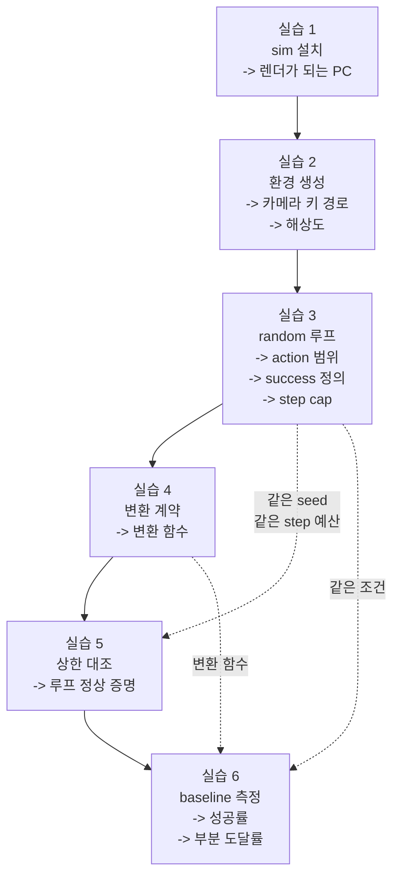

# Week 0 실습: sim 신규 구축 -> 하네스 검증 -> zero-shot baseline


> **실습 목표**: ManiSkill sim 환경을 0부터 구축하고, action 변환 계약을 확정하고, 하네스를 검증한 뒤 zero-shot baseline 을 측정한다.
> **예상 시간**: 12-16시간
> **원칙**: 실습 6 (측정) 는 실습 5 (검증) 를 통과한 뒤에만 한다. 순서를 바꾸면 측정값이 해석 불가가 된다 (README §1).


### 이 문서를 읽는 법


- 각 실습은 **무엇을 하나 / 왜 하나 / 끝나면 손에 남는 것** 세 줄로 시작한다. 손을 대기 전에 이 세 줄만 먼저 읽고 지금 무슨 목적의 작업인지 잡는다.
- `README.md` 는 **개념**(왜 이런 구조인가), 이 문서는 **절차**(무엇을 타이핑하고 무엇을 확인하는가) 다. 개념이 흔들리면 각 절에 붙은 README § 번호로 돌아간다.
- 코드는 읽고 이해한 뒤 직접 타이핑한다. 복사해서 붙이면 실습 5-6 의 빈칸을 채울 수 없다 — 빈칸을 채우는 것이 이번 주의 이해 검증이다.


---


## 0. 이번 주 전체 그림


### 0.1 한 문장으로


> 로봇 팔이 들어 있는 **가상 세계**(ManiSkill)를 컴퓨터에 세우고, 그 세계의 카메라 화면을 **사전학습된 정책 모델**(OpenVLA)에 보여 주고, 모델이 내놓은 동작 명령을 다시 그 세계에 집어넣어 큐브 집기를 시켜 본 뒤, **몇 번 성공했는지**를 기록한다.


여기서 이번 주의 어려움은 "성공률을 재는 것"이 아니다. 거의 확실히 0% 가 나오기 때문이다 (README §7). 어려움은 **0% 가 나왔을 때 그게 내 코드 버그인지, 아니면 모델이 원래 이 화면을 못 다루는 것인지 구분할 수 있는 상태를 미리 만들어 두는 것**이다. 실습 1-5 가 전부 그 준비이고, 실제 측정은 실습 6 하나다.


### 0.2 6개 실습이 이어지는 방식


앞 실습의 출력이 뒤 실습의 입력이 된다. 그래서 순서를 바꿀 수 없다.





점선은 "값을 물려받는다"는 뜻이다. 실습 5 와 실습 6 이 **같은 조건**을 쓰지 않으면 실습 5 의 검증이 실습 6 에 대해 아무것도 보장하지 못한다.


### 0.3 자주 걸리는 용어 미리 풀기


이 표는 아래 절들에서 처음 나오는 자리에 다시 설명하지만, 모르는 단어가 나올 때 돌아올 지점으로 먼저 둔다.


| 용어 | 뜻 |
|---|---|
| **sim** | 시뮬레이터. 물리 법칙과 로봇·물체가 코드로 들어 있는 가상 세계 |
| **episode** | 시도 1회. 환경을 초기 상태로 되돌리고(reset) 성공하거나 시간이 다 될 때까지 진행하는 한 판 |
| **step** | 시뮬레이션 시간을 한 칸 진행시키는 단위. 이 sim 은 1 step = 0.05초 (20 Hz) |
| **step cap** | 한 episode 에 허용하는 최대 step 수. 넘으면 실패로 끊는다 |
| **action** | 로봇에게 주는 동작 명령 숫자 벡터. 여기서는 7개 숫자 |
| **관측**(observation) | 환경이 돌려주는 현재 상태. 카메라 이미지, 관절 각도 등 |
| **EEF**(end-effector) | 팔 끝의 손 부분. 그리퍼가 달린 지점 |
| **델타**(delta) | 절대 위치가 아니라 "지금 위치에서 얼마나 더 움직여라"는 변화량 |
| **그리퍼**(gripper) | 물체를 집는 두 손가락 집게 |
| **headless** | 화면 창(GUI) 없이 실행. 렌더 결과를 창에 띄우지 않고 숫자 배열로 받는다 |
| **Vulkan** | GPU 에게 그림을 그리라고 지시하는 저수준 규격. 이 sim 의 렌더가 이걸 쓴다 |
| **venv** | 파이썬 가상 환경. 프로젝트별로 패키지 버전을 따로 격리하는 폴더 |
| **seed** | 무작위 초기 배치를 정하는 정수. 같은 seed 면 같은 배치가 재현된다 |
| **zero-shot** | 이 환경용으로 추가 학습을 전혀 하지 않은 상태로 바로 시켜 보는 것 |
| **baseline** | 개선 전 기준값. 나중에 fine-tuning 후 수치와 비교하기 위한 출발점 |
| **하네스**(harness) | 측정을 돌리는 장치 전체 — 환경 생성, 루프, 성공 판정, 기록 코드를 묶어 부르는 말 |
| **상한 대조** | 잘 되는 것이 확실한 해법을 같은 장치에 넣어 "이 장치로 낼 수 있는 최고 성적"을 먼저 확인하는 것 |
| **motion planning** | 물체 위치를 좌표로 직접 읽어 경로를 계산해 움직이는 고전 방식. 카메라를 안 보고 정답을 아는 상태로 푼다 |
| **정규화**(normalize) | 값의 범위를 `[-1, 1]` 같은 공통 구간으로 맞추는 것 |
| **역정규화**(unnormalize) | 정규화된 값을 실제 물리 단위(미터, 라디안)로 되돌리는 것 |
| **q01 / q99** | 데이터의 하위 1% / 상위 1% 지점 값. 최소·최대 대신 이걸 쓰면 이상치에 안 휘둘린다 |
| **action repeat** | 정책이 내놓은 하나의 action 을 여러 step 연속으로 넣는 것. 정책 주기와 sim 주기를 맞추는 수단 |


### 0.4 v1 에서 가져오는 것과 새로 만드는 것


sim 은 **새로 구축한다.** v1 (Phase 4) 에는 실행 가능한 sim 환경이 없다 — 남아 있는 것은 문서상의 선정 판단뿐이고, 그것으로는 한 episode 도 돌 수 없다.


| 구분 | 내용 | 출처 |
|---|---|---|
| 재사용 (문서) | sim 선정 근거 (ManiSkill), 후보 비교표, 비채택 사유 | [`Phase 4/notes.md`](../../Phase%204/notes.md) 순서 3 |
| 재사용 (문서) | task 선정 (PickCube), instruction 문구, N=20 기준 | 같은 문서의 성공 task 정의 노트 |
| 재사용 (코드) | OpenVLA 4-bit 추론 호출 패턴 | [`Phase 4/week6`](../../Phase%204/week6/PRACTICE.md) |
| **신규 구축** | Vulkan 런타임, ManiSkill 설치, 에셋, venv | 실습 1 |
| **신규 구축** | 환경 생성·관측 추출·성공 판정 확인 | 실습 2-3 |
| **신규 구축** | action 변환 레이어 | 실습 4 |
| **신규 구축** | 하네스 검증, baseline 측정 | 실습 5-6 |


> 이번 주 산출물이 이후 week 전체의 sim 기반이 된다. week1 의 데이터 수집, week5 의 eval 이 모두 여기서 세운 환경과 계약 표를 그대로 쓴다.


### 0.5 파일을 어디 두고 어디서 실행하나


실습 스크립트는 `week0/` 폴더 바로 아래에 두고, 터미널의 현재 위치(cwd)도 `week0` 으로 두고 실행한다. 이 문서의 모든 `outputs/...` 경로가 그 기준이다.


```bash
cd "/workspace/study/physical-ai-study/Studies/Phase 4.5/week0"
python practice_env_check.py            # 이렇게 실행하면 outputs/ 경로가 맞는다
```


`outputs/` 는 실행 결과물 전용 폴더이고 gitignore 대상이다. 즉 거기 넣은 파일은 커밋되지 않으므로, **코드는 `outputs/` 안에 두지 않는다.**


예외가 하나 있다. 실습 4 의 계약 표는 `outputs/` 밖인 `week0/action_contract.md` 에 둔다. 이 문서는 이번 주에 한 번 쓰고 버리는 실행 결과가 아니라 week1 이후가 계속 기준으로 삼는 문서이므로, gitignore 를 피해 레포에 커밋되어 남아야 한다.


---


## 실습 1: sim 환경 신규 구축 (설치 -> 검증)


**무엇을 하나**: GPU 렌더 준비 -> 전용 venv 생성 -> ManiSkill 설치 -> 패키지가 제공하는 데모를 돌려 설치가 성공했는지 확인.
**왜 하나**: 렌더가 안 되면 카메라 이미지가 안 나오고, 이미지가 없으면 VLA 에 줄 입력이 없다. 이후 전부가 무의미해진다.
**끝나면 손에 남는 것**: 데모가 완주하는 PC, 그리고 `outputs/env_build.md` (설치 기록). 이 기록은 나중에 Docker 이미지 명세의 원본이 된다.


이 실습의 통과 조건은 내가 쓴 코드가 도는 것이 아니라 **ManiSkill 내장 데모가 헤드리스로 완주하는 것**이다. 내 코드부터 쓰면 오류가 났을 때 "설치가 잘못됐나, 내 코드가 잘못됐나"를 구분할 수 없다.


### 1-1. Vulkan 런타임 확보


ManiSkill 의 물리·렌더 엔진은 **SAPIEN** 이고, SAPIEN 은 화면을 그릴 때 OpenGL 이 아니라 **Vulkan** 을 쓴다. Vulkan 은 "GPU 에게 그림을 그리라고 지시하는 저수준 규격"이고, 실제로 지시를 전달하려면 두 가지가 필요하다.


| 구성 요소 | 역할 | 없으면 |
|---|---|---|
| **로더**(loader, `libvulkan1`) | 프로그램의 Vulkan 호출을 받아 적절한 드라이버로 넘겨주는 중개자 | Vulkan 초기화 자체가 실패 |
| **ICD**(Installable Client Driver) | "이 GPU 는 이 드라이버로 처리하라"고 적힌 등록 파일. NVIDIA 드라이버가 설치한다 | GPU 를 못 찾아 CPU 소프트웨어 렌더로 떨어진다 |


여기가 설치 실패의 1순위다.


```bash
sudo apt update
sudo apt install -y libvulkan1 vulkan-tools    # Vulkan 로더 + 진단 도구 (vulkaninfo)
vulkaninfo --summary                           # GPU 가 목록에 나와야 한다
ls /usr/share/vulkan/icd.d/                    # nvidia ICD 파일 존재 확인 (드라이버가 설치한다)
```


`vulkaninfo --summary` 에 RTX 4070 이 나오지 않으면 여기서 멈춘다. GPU 대신 `llvmpipe` 만 보이면 CPU 소프트웨어 렌더로 떨어진 상태다 (`llvmpipe` 는 CPU 로 그림을 그리는 대체 구현의 이름이다). 그대로 진행하면 느리거나 검은 화면이 나온다.


### 1-2. sim 전용 venv 생성


**venv** 는 파이썬 패키지를 프로젝트별로 격리하는 폴더다. 왜 새로 만드는가 — Phase 4 의 공용 venv `.venv-vla` 는 `transformers==4.40.1` / `timm==0.9.16` 같은 특정 버전으로 묶여 있고, 그 조합 위에서만 Block 1-3 실측이 재현된다. ManiSkill 을 그 안에 설치하면 의존성 해결 과정에서 torch 나 transformers 버전이 갈릴 수 있고, 그러면 **이미 끝낸 측정의 재현성이 깨진다.** 그래서 sim 은 별도 venv 에서 먼저 세운다.


```bash
cd "/workspace/study/physical-ai-study/Studies/Phase 4.5"
python3 -m venv .venv-sim                      # sim 전용 (.venv* 는 gitignore 대상)
source .venv-sim/bin/activate                  # 이 터미널의 python/pip 을 venv 것으로 전환
pip install --upgrade pip                      # 휠 해석 실패를 줄인다
mkdir -p week0/outputs                         # 실습 산출물 저장 위치 (outputs/ 는 gitignore)
pip install -r week0/requirements.txt          # ManiSkill 본체
```


`sapien` 휠(wheel, 미리 빌드된 설치 패키지)을 못 찾는다는 오류가 나면 **현재 python 버전에 맞는 휠이 제공되지 않는 경우**다. 그때는 지원 버전으로 venv 를 다시 만든다 (예: `python3.11 -m venv .venv-sim`). 해당 버전이 시스템에 없으면 apt 로 먼저 설치해야 하므로, 이 분기에 들어갔다는 사실과 최종 사용 버전을 기록한다.


### 1-3. 에셋 확보


**에셋**(asset)은 로봇 3D 모델, 물체 메시, 배경 씬 같은 데이터 파일이다. 용량이 커서 패키지 본체와 따로 내려받는 경우가 있다. 필요 여부는 task 마다 다르므로 **명령의 도움말로 확인하고** 필요한 것만 받는다.


```bash
python -m mani_skill.utils.download_asset --help    # 받을 수 있는 에셋 목록·사용법 확인
python -m mani_skill.utils.download_demo --help     # 데모 궤적 데이터 (있으면 실습 5 후보)
```


PickCube 는 큐브와 바닥 같은 기본 도형 위주라 추가 에셋 없이 도는 것이 정상이다. 실습 2 에서 에셋 관련 오류가 나면 그때 여기로 돌아와 해당 에셋만 받는다.


### 1-4. 설치 검증 — 내장 데모 완주


```bash
python -c "import mani_skill; print(mani_skill.__version__, mani_skill.__path__[0])"
# 사용 가능한 예제 모듈 목록 확인 (이름은 버전마다 다르므로 직접 본다)
ls "$(python -c 'import mani_skill; print(mani_skill.__path__[0])')/examples"
```


목록에서 random action 데모를 찾아 **헤드리스로** 실행한다. 헤드리스가 필요한 이유는 이 작업 환경에 띄울 화면(디스플레이)이 없기 때문이다. 창을 띄우려 하면 디스플레이 오류로 죽으므로, 렌더 결과를 창 대신 숫자 배열로 받도록 지정한다.


```bash
python -m mani_skill.examples.demo_random_action -e PickCube-v1 --render-mode rgb_array
# 옵션 이름이 다르면: python -m mani_skill.examples.demo_random_action --help 로 확인
```


`rgb_array` 가 "창 없이 RGB 배열로 돌려줘"라는 뜻의 렌더 모드 이름이다.


### 1-5. 자주 나오는 증상과 대응


| 증상 | 원인 | 대응 |
|---|---|---|
| pip 가 `sapien` 휠을 못 찾음 | 현재 python 버전용 휠 미제공 | 지원 버전으로 venv 재생성 (1-2) |
| `vulkaninfo` 에 GPU 없음 / `llvmpipe` 만 | Vulkan 로더·ICD 미설치 | `libvulkan1` 설치, ICD 경로 확인 (1-1) |
| 렌더 결과가 전부 검정 | GPU 렌더 컨텍스트 실패 후 fallback | ICD·드라이버 확인. 검은 화면은 통과가 아니다 |
| Vulkan instance/device 생성 실패 | 컨테이너에 GPU 디바이스 미노출 | GPU 패스스루 설정 확인 |
| 에셋 파일 없음 오류 | 에셋 미다운로드 | 해당 에셋만 받는다 (1-3) |
| 데모가 디스플레이 오류로 죽음 | GUI 렌더 모드로 실행 | 렌더 모드를 배열 출력으로 지정 (1-4) |


**기록할 것** (`outputs/env_build.md`): 최종 python 버전, `mani_skill` 버전, 받은 에셋, 겪은 증상과 대응. 이 파일이 나중에 `Measurements/.../environment.md` 의 원본이 되고, Section 0 후반의 Docker 이미지 명세가 된다.


### 1-6. 공용 venv 와의 통합 가능성 조사


실습 6 에서는 OpenVLA (`.venv-vla` 에 있다) 와 ManiSkill (`.venv-sim` 에 있다) 을 **한 프로세스에서 같이** 써야 한다. 서로 다른 venv 에 있으면 그게 안 되므로, 합칠 수 있는지 지금 알아 둔다.


`--dry-run` 은 "실제로 설치하지 말고 무엇이 어떻게 바뀔지만 보여 줘"라는 pip 옵션이다. 기존 환경을 건드리지 않고 영향만 확인할 수 있다.


```bash
deactivate                                                        # 현재 venv 에서 빠져나온다
source "../Phase 4/.venv-vla/bin/activate"
pip install --dry-run mani_skill 2>&1 | grep -i "would install"   # 실제 설치 없이 영향만 본다
```


출력에 `torch` / `transformers` / `timm` 이 **다른 버전으로** 등장하면 합치지 않는다 — 기존 측정의 재현성이 깨지기 때문이다. 그 경우 실습 6 은 두 프로세스 (sim + 추론) 로 나눠 파일이나 소켓으로 주고받는 구조가 된다. 등장하지 않으면 `.venv-vla` 에 ManiSkill 을 추가해 한 프로세스로 진행한다. 판단과 근거를 `outputs/env_decision.md` 에 두 줄로 남긴다.


---


## 실습 2: 첫 환경 생성 + 관측 구조 확인


**무엇을 하나**: 파이썬 코드로 환경을 직접 만들고, 환경이 돌려주는 관측이 어떤 모양인지 출력해 보고, 장면 이미지 1장을 파일로 저장한다.
**왜 하나**: 실습 6 에서 "카메라 이미지를 꺼내 모델에 넣는" 코드를 써야 하는데, 이미지가 관측 딕셔너리의 **어느 키 아래 어떤 shape 으로** 들어 있는지는 버전마다 다르다. 문서를 믿지 말고 설치된 버전에서 직접 확인한다.
**끝나면 손에 남는 것**: 카메라 이미지의 정확한 키 경로, 두 종류 해상도, 그리고 `outputs/env_check.png`.


**파일명**: `practice_env_check.py`


### 환경을 만들 때 주는 인자 4개


ManiSkill 은 **gymnasium** 규약을 따른다. gymnasium 은 강화학습 환경의 공통 인터페이스 표준이고, 핵심은 세 함수다 — `gym.make()` 로 환경을 만들고, `reset()` 으로 초기화하고, `step(action)` 으로 한 칸 진행한다. 이 규약을 따르므로 ManiSkill 이 처음이어도 함수 이름은 예측 가능하다.


환경 생성 시 주는 인자가 이번 주 작업의 거의 전부를 결정한다 (README §3).


| 인자 | 뜻 | 이번 주 값과 이유 |
|---|---|---|
| `obs_mode` | 관측에 무엇을 담을지 (관절 상태값만 / RGB / RGB-D 등) | `"rgb"` — VLA 에 이미지를 줘야 하므로 |
| `control_mode` | 내가 준 7개 숫자를 로봇에게 **어떻게 해석시킬지** | `"pd_ee_delta_pose"` — 아래 풀이 참조 |
| `render_mode` | 사람이 보는 화면을 어떻게 낼지 | `"rgb_array"` — 창 없이 배열로 (헤드리스) |
| `sensor_configs` | 관측 카메라의 해상도 등 세부 설정 | 224x224 — OpenVLA 입력 크기에 맞춘다 |


`pd_ee_delta_pose` 라는 이름은 세 조각이다.


| 조각 | 뜻 |
|---|---|
| `pd` | PD 제어기로 목표를 추종한다 (내부 구현 방식) |
| `ee` | 목표를 **end-effector**(팔 끝) 기준으로 준다. 관절 각도가 아니다 |
| `delta_pose` | 절대 목표 자세가 아니라 **현재에서의 변화량**(위치 3 + 회전 3) 으로 준다 |


즉 "손을 지금 위치에서 이만큼 옮기고 이만큼 돌려라"는 명령 형식이고, OpenVLA 가 내놓는 출력 형식과 같은 종류다. 그래서 이걸 고른다.


### 카메라가 두 개라는 점


혼동이 가장 잦은 지점이다. 이 환경에는 **용도가 다른 두 시점**이 있다.


| 구분 | 꺼내는 방법 | 용도 | 이번 주 해상도 |
|---|---|---|---|
| 관측 카메라 | `obs["sensor_data"][...]["rgb"]` | **정책 모델의 입력** | 224x224 (`sensor_configs` 로 지정) |
| 사람용 렌더 | `env.render()` | 사람이 눈으로 확인, 영상 저장 | 512x512 (기본값) |


`env.render()` 로 나온 이미지를 모델에 넣으면 학습·측정 조건이 어긋난다. 아래 코드에서 저장하는 `env_check.png` 는 **사람이 확인하는 용도**다.


```python
"""
실습 2: 환경을 직접 생성해 관측 구조를 확인하고 렌더 이미지 1장을 저장
"""
import gymnasium as gym                        # ManiSkill 은 gymnasium 규약을 따른다
import mani_skill.envs                         # import 만으로 ManiSkill task 들이 gym 에 등록된다
import numpy as np                             # 관측 배열 처리
from PIL import Image                          # 렌더 결과 저장


print("=" * 60)
print("실습 2: 환경 생성 + 관측 구조")
print("=" * 60)


# -- 2-1. 등록된 task 이름 확인 (문서를 믿지 않고 설치된 버전에서 직접 본다) --
print("\n[2-1] PickCube 관련 등록 환경")
for env_id in gym.registry.keys():             # gym 에 등록된 모든 환경 이름을 훑는다
    if "PickCube" in env_id:                   # 이름에 PickCube 가 포함된 것만
        print("  ", env_id)                    # 실제 사용할 정확한 id 를 여기서 얻는다


# -- 2-2. 환경 생성 (ENV_ID 를 2-1 출력의 실제 이름으로 교체) --
ENV_ID = "PickCube-v1"                         # <- 2-1 출력의 실제 id 로 교체한다
print(f"\n[2-2] 환경 생성: {ENV_ID}")
env = gym.make(
    ENV_ID,                                    # 사용할 task
    obs_mode="rgb",                            # 관측에 카메라 RGB 이미지를 포함시킨다
    control_mode="pd_ee_delta_pose",           # action 을 EEF 델타 pose 로 해석 (OpenVLA 출력과 대응)
    render_mode="rgb_array",                   # GUI 없이 배열로 렌더 (헤드리스)
    sensor_configs=dict(width=224, height=224), # 관측 카메라를 OpenVLA 입력 크기로 (기본 128 이면 업샘플 열화가 섞인다)
)
print("환경 생성 성공 — Vulkan 렌더 컨텍스트가 붙었다")


# -- 2-3. 관측 구조 확인 (키 이름을 추측하지 않고 출력해서 본다) --
print("\n[2-3] 관측 구조")
obs, info = env.reset(seed=0)                  # seed 를 주면 초기 배치가 재현된다
for key in obs:                                # 관측 최상위 키
    value = obs[key]
    if isinstance(value, dict):                # 한 겹 더 들어가는 항목 (카메라 등)
        for sub_key in value:
            inner = value[sub_key]
            if isinstance(inner, dict):        # 카메라별로 한 겹 더 있는 경우
                for leaf in inner:
                    print(f"   {key}/{sub_key}/{leaf}: {getattr(inner[leaf], 'shape', '')}")
            else:
                print(f"   {key}/{sub_key}: {getattr(inner, 'shape', '')}")
    else:
        print(f"   {key}: {getattr(value, 'shape', type(value).__name__)}")
print("\n[2-3b] info 키:", list(info.keys()))  # 성공 플래그가 어디 실리는지 단서


# -- 2-4. 렌더 이미지 저장 (여기가 통과 판정) --
print("\n[2-4] 렌더 이미지 저장")
frame = env.render().cpu().numpy()             # 현재 장면 렌더 — GPU 텐서로 오므로 cpu 로 내린 뒤 numpy 로 바꾼다
if frame.ndim == 4:                            # (batch, H, W, 3) 형태면 첫 장만 쓴다
    frame = frame[0]
print("frame shape:", frame.shape)             # 사람이 보는 뷰의 해상도. 모델 입력은 2-3 의 sensor_data 쪽이다
Image.fromarray(frame.astype(np.uint8)).save("outputs/env_check.png")
print("저장 완료: outputs/env_check.png")


env.close()                                    # 렌더 컨텍스트 해제
print("\n실습 2 완료")
```


코드에서 낯선 부분 두 개를 풀어 둔다.


- `.cpu().numpy()`: ManiSkill 은 GPU 에서 시뮬레이션하므로 결과가 **GPU 메모리 위의 torch 텐서**로 온다. `.cpu()` 로 CPU 메모리로 내리고 `.numpy()` 로 numpy 배열로 바꿔야 PIL 로 저장할 수 있다.
- `frame.ndim == 4`: ManiSkill 은 여러 환경을 동시에 돌릴 수 있어서 결과 앞에 항상 개수 차원이 붙는다. 환경 1개여도 `(1, 512, 512, 3)` 이므로 `[0]` 으로 첫 장을 꺼낸다.


**확인 포인트**


- `outputs/env_check.png` 가 검은 화면이 아니라 실제 장면인가. 검으면 실습 1-1 로 복귀
- **두 해상도를 구분한다.** `env.render()` 는 사람이 보는 뷰(512x512) 이고, 모델이 먹는 것은 `sensor_data` 쪽 관측 카메라다. `frame shape` 를 모델 입력으로 착각하면 실습 6 의 전처리가 어긋난다
- 관측 카메라 shape 가 `(1, 224, 224, 3)` 인가. 128 로 나오면 `sensor_configs` 가 안 먹은 것이다 — 이 해상도는 baseline 정의의 일부이므로 여기서 맞춰야 한다
- 카메라 이미지의 정확한 키 경로 (실습 6 에서 그대로 쓴다)


---


## 실습 3: sim 단독 루프 + success 정의 확인


**무엇을 하나**: VLA 없이 무작위 action 으로 episode 를 돌린다.
**왜 하나**: 목적은 "돌아간다"를 보는 것이 아니다. **성공 판정의 정확한 정의와 action 공간의 규약을 사실로 확정**하는 것이다. 이 두 개를 추측으로 두면 실습 6 의 숫자가 무엇을 센 것인지 알 수 없다.
**끝나면 손에 남는 것**: `outputs/sim_facts.md` — 환경 id, action 범위, success 정의, step cap, 상태 접근 경로, 카메라 키 경로.


**파일명**: `practice_sim_loop.py`


### 미리 알아 둘 것 1: `step()` 이 돌려주는 5개


gymnasium 규약에서 `env.step(action)` 은 항상 5개를 튜플로 돌려준다.


| 반환값 | 뜻 |
|---|---|
| `obs` | 이 step 이후의 관측 (카메라 이미지 등) |
| `reward` | 보상 값. 강화학습 학습용이고 **이번 주에는 쓰지 않는다** |
| `terminated` | 환경이 "끝났다"고 판단 (성공 또는 실패 조건 도달) |
| `truncated` | 시간 제한(step cap)에 걸려 강제로 끊김 |
| `info` | 부가 정보 딕셔너리. **성공 플래그가 여기 실려 온다** |


`terminated` 와 `truncated` 를 나눠 두는 이유는 "제대로 끝난 것"과 "시간이 다 돼서 잘린 것"을 구분해야 하기 때문이다.


### 미리 알아 둘 것 2: action 공간을 읽는 법


`env.action_space` 를 출력하면 `Box(-1.0, 1.0, (7,), float32)` 같은 것이 나온다. 읽는 법은 이렇다.


| 조각 | 뜻 |
|---|---|
| `Box` | 연속값 구간. 이산 선택지가 아니라 실수 벡터를 받는다 |
| `-1.0, 1.0` | 각 차원의 허용 하한과 상한 |
| `(7,)` | 7개 숫자로 된 1차원 벡터 |
| `float32` | 32비트 실수 |


하한·상한이 `[-1, 1]` 인 것은 **환경이 정규화된 입력을 기대한다**는 신호다. 즉 미터 단위 물리량을 그대로 넣으면 안 되고, "축 한계 대비 몇 %" 로 바꿔 넣어야 한다. 이 사실이 실습 4 계약 표 2번 행의 근거가 된다.


### 미리 알아 둘 것 3: step cap 은 두 층이다


아래 코드에서 `STEP_CAP = 100` 으로 루프를 걸어도 출력의 `steps` 는 전부 50 으로 나온다. 헷갈리는 지점이므로 미리 정리한다.


| 층 | 값 | 누가 정하나 |
|---|---|---|
| 내 루프의 상한 | `STEP_CAP = 100` | 내 코드의 `for` 문 |
| 환경 자신의 제한 | 50 | `@register_env("PickCube-v1", max_episode_steps=50)` 에 박힌 등록 기본값 |


둘 중 **작은 쪽이 먼저 걸린다.** 50 step 에서 환경이 `truncated=True` 를 올리고 루프가 `break` 되므로 항상 50 이다. 환경 쪽 제한을 바꾸려면 생성 시 `gym.make(..., max_episode_steps=N)` 으로 명시해야 한다 (실습 4-3 에서 이 값을 확정한다).


내 상한을 환경 상한보다 **크게** 잡은 것은 의도적이다. 100 이라는 숫자 자체에 뜻이 있는 게 아니라 "환경 상한보다 크다"는 성질에 뜻이 있다 — 그래야 출력의 `steps` 가 어느 층 때문에 멈춘 것인지 가려진다. 50 으로 잡으면 내 `for` 문이 다 돌아서 끝난 것과 환경이 끊은 것이 똑같이 `steps=50` 으로 보여 두 원인을 구분할 수 없고, 30 으로 잡으면 환경 상한이 50 이라는 사실이 출력에 아예 나타나지 않는다. 100 으로 두면 출력이 50 이라는 것이 곧 "환경이 50 에서 끊었다"의 증거가 되고, 이것이 `sim_facts.md` 의 step cap 행에 적는 근거다. 부수 효과로 환경이 `truncated` 를 올리지 않는 설정이었을 때 루프가 무한히 도는 것도 막는다.


```python
"""
실습 3: random action 으로 episode 를 돌리고 success 정의·action 공간을 확정
"""
import inspect                                 # 성공 판정 코드를 직접 읽기 위해
import gymnasium as gym
import mani_skill.envs


ENV_ID = "PickCube-v1"                         # <- 실습 2 에서 확정한 id


print("=" * 60)
print("실습 3: sim 단독 루프")
print("=" * 60)


env = gym.make(ENV_ID, obs_mode="rgb", control_mode="pd_ee_delta_pose")


# -- 3-1. action 공간의 실제 정의 (범위 규약 확정 — 변환 계약 2번 항목) --
print("\n[3-1] action space")
print("  ", env.action_space)                  # 차원 수와 상한/하한이 그대로 출력된다
print("   low :", env.action_space.low)        # 하한 — -1 이면 정규화된 입력을 기대한다는 뜻
print("   high:", env.action_space.high)       # 상한


# -- 3-2. 선택 가능한 control_mode 목록 --
print("\n[3-2] control modes")
print("  ", env.unwrapped.agent.supported_control_modes)   # 실제 지원 목록 (문서와 다를 수 있다)


# -- 3-3. 성공 판정의 소스코드를 직접 읽는다 (임계값을 추측하지 않는다) --
print("\n[3-3] 성공 판정 코드")
print(inspect.getsource(type(env.unwrapped).evaluate))     # evaluate 가 success 를 계산한다


# -- 3-4. 상태 접근 경로 탐색 (부분 도달률 계산에 필요 — 실습 6) --
print("\n[3-4] env 내부 접근 가능한 이름")
print("  ", [name for name in dir(env.unwrapped) if not name.startswith("_")])


# -- 3-5. random action 으로 20 episode (step cap 확정) --
print("\n[3-5] random action 20 episode")
STEP_CAP = 100                                 # 내 루프의 상한. 환경 자신의 제한(50)이 먼저 걸린다
for episode in range(20):                      # seed 를 바꿔 20회
    obs, info = env.reset(seed=episode)        # 매번 다른 초기 배치
    success = False                            # 이 episode 의 성공 여부
    for step in range(STEP_CAP):               # step cap 까지만 시도
        action = env.action_space.sample()     # 무작위 action (정책 없음)
        obs, reward, terminated, truncated, info = env.step(action)
        if info.get("success", False):         # 성공 플래그 — 키 이름은 3-3 에서 확인한 것으로
            success = True
            break                              # 성공 즉시 종료
        if terminated or truncated:            # 환경이 스스로 끝냈으면 종료
            break
    print(f"   ep{episode:02d}: success={success} steps={step + 1}")


env.close()
print("\n실습 3 완료")
```


`env.unwrapped` 가 나오는 이유: `gym.make()` 가 돌려주는 것은 원래 환경을 여러 겹의 **wrapper**(시간 제한, 관측 변환 등을 덧씌운 껍데기) 로 감싼 객체다. 큐브 위치나 성공 판정 함수 같은 내부 알맹이에 닿으려면 `unwrapped` 로 껍데기를 벗겨야 한다.


### 3-3 의 출력을 읽을 때 스스로 답할 것


`evaluate` 소스가 그대로 출력된다. 다음 질문에 답할 수 있으면 success 정의를 이해한 것이다 — 답을 여기 적어 두지 않는다.


- 성공 조건이 몇 개의 부분 조건으로 이루어져 있고, 그것들이 AND 인가 OR 인가
- "큐브가 목표에 도달했다"를 판정하는 거리 임계값은 얼마이고, 어느 변수에 들어 있는가
- 로봇이 정지해 있어야 한다는 조건이 왜 붙어 있는가 (그게 없으면 어떤 상황이 성공으로 잡히는가)
- 매 step `info` 에 실려 오는 부분 조건 이름들은 무엇인가 (실습 6 의 부분 도달률에 그대로 쓴다)


**기록할 것** (`outputs/sim_facts.md`)


| 항목 | 확정값 | 출처 |
|---|---|---|
| 환경 id | `PickCube-v1` (그 외 `PickCubeSO100-v1`, `PickCubeWidowXAI-v1`, `PickCubeYCB-v1` 등록됨) | 실습 2 의 2-1 출력 |
| action 차원 / 범위 | `Box(-1.0, 1.0, (7,), float32)` — 7차원, 전 차원 `[-1, 1]` 정규화 입력 | 3-1 출력 |
| control mode | `pd_ee_delta_pose` (지원 11종 중 선택) | 3-2 출력 |
| success 의 정확한 정의 | `is_obj_placed & is_robot_static` | 3-3 소스코드 |
| 환경 등록 기본 step cap | **50** (변경 불가 값이 아니라 기본값. 늘리려면 `gym.make(..., max_episode_steps=N)` 명시) | `@register_env("PickCube-v1", max_episode_steps=50)`, 3-5 의 `steps=50` |
| 측정에 쓸 step 예산 | `max_episode_steps=200` + action repeat 4 = 정책 결정 50회 | 실습 4-3 |
| 부분 도달률 계산에 쓸 상태 접근 경로 | `env.unwrapped` 의 `cube`, `goal_site`, `goal_thresh`, `cube_half_size`, `agent.tcp_pose`, `agent.is_grasping(cube)`, `agent.is_static(0.2)`. 매 step `info` 에 `is_obj_placed` / `is_robot_static` / `is_grasped` 가 이미 실려 온다 | 3-4 출력, 3-3 소스코드 |
| 카메라 키 경로 / 해상도 | 정책 입력: `obs["sensor_data"]["base_camera"]["rgb"]`. 기본 128x128 이고 이번 주는 `sensor_configs` 로 224x224 고정. 사람용 렌더: `env.render()` = `(1, 512, 512, 3)` | 실습 2 의 2-3 출력, `pick_cube.py` `_default_sensor_configs` |


> random action 으로 조작이 성공하는 일은 없다. 그렇다고 **20/20 실패를 기대하지는 않는다** — `seed 0-19` 에는 조작 없이 성공으로 잡히는 배치가 섞여 있다. PickCube 는 목표 지점을 매 episode 무작위로 뽑으므로, 목표가 큐브 초기 위치에서 `goal_thresh` 안에 떨어지는 episode 가 나온다. 그 episode 는 팔을 움직이기 전부터 `is_obj_placed` 가 True 이고 팔이 정지 상태라 `is_robot_static` 도 True 이므로, 첫 step 에서 곧바로 `success` 가 된다. 출력의 `steps` 가 1 이면 이 경우다.


> 그래서 성공이 나왔을 때 원인은 두 갈래다. 가르는 방법은 `env.step` 을 한 번도 부르기 전에 판정을 읽어 보는 것이다.


| 성공의 원인 | 확인 방법 | 대응 |
|---|---|---|
| 목표가 큐브 초기 위치 안에 떨어졌다 | `reset` 직후 `env.unwrapped.evaluate()` 의 `is_obj_placed` 가 이미 True (또는 cube-goal 거리가 `goal_thresh` 보다 작다) | 정상. 어느 seed 가 그런지 세어 두고 실습 5-3 에서 무행동 하한으로 확정한다 |
| success 판정이 느슨하다 | `reset` 직후에는 False 인데 random action 몇 step 만에 True 로 바뀐다 | 3-3 의 정의를 다시 읽는다 |


> 이 "공짜 성공" 을 모르고 넘어가면 실습 6 에서 정책의 성과와 초기 배치 운을 구분할 수 없다.


---


## 실습 4: action 변환 계약 확정


**무엇을 하나**: OpenVLA 가 내놓는 7개 숫자와 ManiSkill 이 받는 7개 숫자 사이의 **번역 규칙**을 표로 확정하고, 그 표대로 변환 함수를 쓴다.
**왜 하나**: 개수가 같다는 것은 아무것도 보장하지 않는다. 단위가 다르거나 부호가 반대면 팔이 엉뚱하게 움직이고, 그러면 실습 6 의 0% 는 모델 탓이 아니라 내 번역 버그 탓이 된다.
**끝나면 손에 남는 것**: `action_contract.md` — 각 행에 출처가 붙은 계약 표 + 변환 함수.


**산출물**: `week0/action_contract.md` (`outputs/` 가 아니다 — §0.5)


### 왜 "개수가 같아도 안 맞는가"


구체적으로 어긋날 수 있는 지점이 넷이다 (README §4).


| # | 항목 | 안 맞으면 생기는 일 |
|---|---|---|
| 1 | 단위와 스케일 | 1cm 를 의도한 값이 1m 로 해석되어 팔이 튀거나, 반대로 거의 안 움직인다 |
| 2 | 값의 범위 규약 | 정규화된 값을 물리량으로, 또는 그 반대로 해석해 스케일이 통째로 어긋난다 |
| 3 | 기준 프레임과 회전 표현 | 방향이 엉뚱하게 돈다. 특히 회전은 표현이 다르면 **조용히** 틀린다 |
| 4 | gripper 부호 규약 | 집어야 할 때 펴고, 펴야 할 때 집는다 |


3번의 "조용히"가 이번 주에서 가장 위험하다. 회전 델타가 작을 때는 표현을 잘못 매핑해도 팔이 그럴싸하게 움직이므로, **코드가 도는 것으로는 맞았는지 알 수 없다.** 그래서 코드를 돌려보는 대신 소스를 읽어 확정한다.


### 4-1. OpenVLA 쪽 사실 확인


**파일명**: `openvla_action.py`


`.venv-vla` 에서 실행한다 (모델 로드가 필요하다).


읽을 대상은 `vla.norm_stats` 다. 이것은 "각 학습 데이터셋의 action 이 어떤 분포였는지"를 적어 둔 통계 표다. 모델의 raw 출력은 정규화된 추상값이므로, 이 통계를 써서 실제 물리 단위로 되돌린다(역정규화). `unnorm_key` 가 "어느 데이터셋 통계로 되돌릴지" 고르는 스위치다 (README §5).


```python
"""
실습 4-1: OpenVLA 의 action 통계를 열어 단위·정규화 규약을 확인
"""
import torch
from transformers import AutoModelForVision2Seq, BitsAndBytesConfig


bnb_config = BitsAndBytesConfig(               # Phase 4 week6 과 동일한 4-bit 설정
    load_in_4bit=True,
    bnb_4bit_quant_type="nf4",
    bnb_4bit_use_double_quant=True,
    bnb_4bit_compute_dtype=torch.float16,
)
vla = AutoModelForVision2Seq.from_pretrained(  # 로드에 수 분 걸린다
    "openvla/openvla-7b",
    attn_implementation="eager",
    torch_dtype=torch.float16,
    low_cpu_mem_usage=True,
    trust_remote_code=True,
    quantization_config=bnb_config,
)


# -- 사용 가능한 unnorm_key 목록 --
print("\n[4-1a] 선택 가능한 unnorm_key")
print(list(vla.norm_stats.keys()))             # 학습 데이터셋별 통계 키 목록


# -- 특정 key 의 통계 내용 (여기서 단위·정규화 대상 차원을 읽는다) --
KEY = "bridge_orig"                            # <- 후보 key. 선택 근거를 표에 적을 것
print(f"\n[4-1b] {KEY} 통계")
for name, value in vla.norm_stats[KEY]["action"].items():
    print(f"   {name}: {value}")               # 분위수·평균·마스크 등이 그대로 나온다
```


출력에 나오는 통계량 이름을 먼저 풀어 둔다.


| 이름 | 뜻 |
|---|---|
| `min` / `max` | 데이터의 최솟값 / 최댓값. 이상치 하나에 크게 흔들린다 |
| `q01` / `q99` | 하위 1% / 상위 1% 지점. 양 끝 1% 를 잘라내 이상치 오염을 피한다 |
| `mean` / `std` | 평균 / 표준편차 |
| `mask` | 차원별 True/False 배열. **False 인 차원은 역정규화를 건너뛴다** |


읽어야 할 것: 어떤 통계량으로 되돌리는가 / 되돌린 값의 크기 대역이 어느 정도인가 (그것이 미터인지 판단하는 근거) / **차원별 적용 여부 마스크가 있는가**, 있다면 어느 차원이 제외되는가. 답과 근거는 `action_contract.md` 에 서술한다.


### 4-2. 계약 표


각 행에 **출처**(파일:줄 또는 출력 스니펫) 가 붙어야 한다. 근거 없는 행은 추측이고, 추측이 하나라도 있으면 실습 6 의 숫자를 방어할 수 없다.


| # | 항목 | OpenVLA 쪽 | ManiSkill 쪽 | 변환 규칙 | 출처 |
|---|---|---|---|---|---|
| 1 | 위치 델타의 단위·스케일 | 미터. 출력 범위 = `[q01, q99]`, 최대 ±0.042 m/step (5 Hz 기준) | 미터. ±0.1 m/step (20 Hz) | `a = d / 0.1` | `modeling_prismatic.py:528-537`, `panda.py:115-116`, 실측 |
| 2 | 값의 범위 규약 (정규화 여부) | 출력은 **역정규화된 물리량**. `[-1, 1]` 정규화는 토크나이저 내부에서만 쓰이고 반환값에는 남지 않는다 (mask=False 차원 제외) | 입력은 **`[-1, 1]` 정규화값**. `normalize_action=True` | 물리량을 각 축 한계로 나눠 정규화 | 3-1 출력 `Box(-1.0, 1.0, (7,), float32)`, `pd_ee_pose.py:187`, `modeling_prismatic.py:521-537` |
| 3 | 기준 프레임 | bridge 규약의 EEF 델타. 병진은 베이스 기준 | `root_translation:root_aligned_body_rotation` — 병진은 root(베이스) 기준, 회전은 root 정렬 body 회전. `use_delta=True`, `use_target=False` | 프레임 재사상 불필요 | `pd_ee_pose.py:279-285`, `pd_ee_pose.py:179-190` |
| 4 | 회전 표현 | axis-angle 3벡터, 라디안. 최대 ±0.207 rad/step | XYZ 오일러 3벡터, ±0.1 rad/step. **부호가 반전되고** 클리핑이 축별이 아니라 3벡터 노름 기준 | `a = r / (-0.1)`, 노름 > 1 이면 방향 유지한 채 단위 노름으로 축소 | `pd_ee_pose.py:232`, `pd_ee_pose.py:240-243`, 실측 |
| 5 | gripper 부호 규약 | mask=False -> 역정규화 우회, raw 값 통과. 범위 `[0, 1]`, **0 = 닫힘 / 1 = 열림** | 범위 `[-1, 1]`, **-1 = 닫힘 / +1 = 열림** (관절 목표 -0.01 - 0.04 m) | `g = 2 * raw - 1`. raw 가 이산값이므로 0.5 임계 이진화도 가능 | `mask` / `q01` / `q99` = `[..., False]` / `0.0` / `1.0`, `panda.py:179-180`, 실측 |


각 행의 상세 근거 (통계 표 읽은 과정, 단위 판정 논리, ManiSkill 컨트롤러 실측값, `unnorm_key` 선택 비교) 는 `action_contract.md` 에 있다. 그 문서가 정본이고 위 표는 요약이다.


> 이 변환 코드는 실행 보드 `#5` 의 `RobotPolicy` adapter + action schema validation 의 첫 sim 구현체다. 별도로 쓰지 말고 그 인터페이스 위에 얹는다 — 안 그러면 같은 코드를 두 번 쓴다.


### 4-3. 제어 주기를 맞춘다 (action repeat)


계약 표의 4항목을 다 맞춰도 남는 어긋남이 하나 있다. **한 step 이 현실의 몇 초인지**가 양쪽에서 다르다.


| 쪽 | 주기 | 1 step 의 현실 시간 |
|---|---|---|
| OpenVLA 의 학습 데이터 (`bridge_orig`) | 5 Hz | 0.2초 |
| ManiSkill `PickCube-v1` | 20 Hz | 0.05초 |


모델이 내놓는 "3cm 이동"은 **0.2초 동안** 3cm 가라는 뜻이다. 그걸 ManiSkill 의 1 step 에 그대로 넣으면 0.05초 만에 3cm 를 가려 하므로 **학습 시보다 4배 빠르게** 움직인다.


해법은 **action repeat 4** 다. OpenVLA 를 한 번 호출하고, 같은 action 을 ManiSkill 에 4 step 연속으로 넣어 실효 주기를 5 Hz 로 맞춘다.


이 결정이 step 예산을 바꾼다. 정책 결정 1회가 env step 4개를 소비하므로, 정책이 50번 판단할 기회를 주려면 env step 이 200개 필요하다.


| 상수 | 값 | 뜻 |
|---|---|---|
| `MAX_EPISODE_STEPS` | 200 | 환경에 허용하는 env step 총량 (`gym.make` 인자로 명시) |
| `ACTION_REPEAT` | 4 | 같은 action 을 몇 step 연속 넣을지 |
| `POLICY_STEPS` | 50 | 정책 결정 횟수 = 200 / 4. sim 시간 10초 |


**이 세 값은 실습 5 와 실습 6 이 동일하게 써야 한다.** 다르면 상한 대조가 성립하지 않는다.


> 미확인으로 남은 전제: `bridge_orig` 의 5 Hz 는 이 환경에서 측정한 값이 아니라 데이터셋 문헌에서 온 값이다. BridgeData V2 데이터셋 카드 또는 Open-X Embodiment 논문의 주기 표로 확인한다. 이 값이 틀리면 action repeat 배수와 단위 판정 근거가 같이 바뀐다.


---


## 실습 5: 하네스 검증 (상한 대조)


**무엇을 하나**: 성공하는 것이 확실한 기성 해법을 내 측정 장치에 넣어 성공률을 본다.
**왜 하나**: 실습 6 에서 0% 가 나올 때 원인이 두 가지다 — (a) 모델이 이 화면을 못 다룬다, (b) 내 환경·루프·성공 판정이 고장났다. (b) 를 **미리** 배제해 두면 0% 가 해석 가능한 결과가 된다. 순서를 바꾸면 이 배제가 불가능하다.
**끝나면 손에 남는 것**: `outputs/harness_check.md` — 무엇으로 검증했고 상한이 얼마였는지.


**파일명**: `harness_check.py`


### 상한 대조가 무엇을 하는가


"이 장치로 낼 수 있는 최고 점수"를 먼저 재는 것이다. 정답을 아는 해법을 넣었는데도 성공률이 낮으면, 그건 해법 탓이 아니라 **장치 탓**이다 — 성공 판정이 불가능한 조건이거나, step 예산이 모자라거나, 루프가 잘못 짜였다는 뜻이다.


### 어떤 해법을 쓰나 — motion planning 이 아니라 scripted


ManiSkill 에는 PickCube 용 **motion planning** 해법(`examples/motionplanning/panda/solutions/pick_cube.py`)이 들어 있지만 **이 환경에서는 쓸 수 없다.**


| 항목 | 사실 |
|---|---|
| 원인 | `mani_skill 3.0.1` 이 `mplib==0.1.1` 을 핀으로 박아 두었고, 그 바이너리는 numpy 1.x C API 로 빌드돼 있다 |
| 증상 | 설치된 numpy 가 2.5.1 이라 ABI 가 안 맞아 `mplib.Planner` 생성 시점에 세그폴트로 죽는다 |
| 증거 | `mplib/pymp*.so` 안의 `numpy.core` (numpy 2 에서는 `numpy._core`) 와 `FAILURE obtaining numpy _ARRAY_API pointer` 문자열 |
| 우회 실패 | numpy 를 1.26 으로 내리면 `scipy 1.18` 과 `opencv-python 5` 가 numpy>=2 를 요구해 그쪽이 깨진다 |


그래서 README §8 이 함께 허용하는 **scripted 해법**을 쓴다. 큐브와 목표의 좌표를 시뮬레이터에서 직접 읽어(특권 정보) 접근 -> 하강 -> 파지 -> 이동 -> 정지 순서로 손을 움직인다. "인식"을 건너뛰고 "제어"만 푸는 성격은 motion planning 과 같고, 경로를 기하학적으로 미리 계획하는 대신 매 step 목표 방향으로 조금씩 가는 방식이다.


바꿔 쓰는 것이 손해가 아니다. scripted 해법은 실습 6 과 **같은 `control_mode`(`pd_ee_delta_pose`)** 를 쓰므로 정규화 action 경로까지 함께 지나간다 — motion planning(관절 각도 명령)보다 검증 범위가 넓다.


### 조건 중 무엇을 맞출 수 있고 무엇을 못 맞추나


| 조건 | 맞출 수 있나 | 이유 |
|---|---|---|
| 환경 id / task | 맞춘다 | 같은 `PickCube-v1` |
| 성공 판정 | 맞춘다 | 환경이 소유하므로 자동으로 동일 |
| seed 목록 | 맞춘다 | 같은 `list(range(20))` |
| env step 예산 | 맞춘다 | `max_episode_steps=200` 동일하고, scripted 루프도 그 안에서 끝난다 |
| `control_mode` | 맞춘다 | 둘 다 `pd_ee_delta_pose`. `[-1, 1]` 정규화 action 이 물리량으로 풀리는 경로까지 검증된다 |
| action 변환 레이어 | **검증 안 된다** | OpenVLA 출력을 받는 변환 함수는 이 해법이 지나가지 않는다 |


마지막 줄만 남는 한계다. 상한이 높게 나오면 "환경·루프·성공 판정·카메라·정규화 action 경로는 정상"까지 말할 수 있고, **OpenVLA 출력을 번역하는 변환 함수는 여전히 용의자로 남는다.** 그것까지 배제하려면 README §8 의 (b) 공개 수치 대조가 필요하다.


소비 step 수도 함께 센다. 정답을 아는 해법이 200 step 을 거의 다 쓴다면 실습 6 의 예산이 빡빡하다는 뜻이고, 그 경우 실습 6 의 0% 는 정책 성능이 아니라 예산 부족을 반영할 수 있다.


### 하한도 같이 잰다 — 공짜로 얻는 성공


PickCube 는 목표 지점을 매 episode 무작위로 뽑는다. 그래서 **목표가 큐브 초기 위치에서 `goal_thresh`(0.025 m) 안에 떨어지는 seed** 가 섞인다. 그런 seed 는 `is_obj_placed` 가 reset 직후부터 True 이고, 팔을 전혀 움직이지 않아도 로봇이 정지 상태이므로 success 가 뜬다.


이것을 모르면 실습 6 을 해석할 수 없다. 성공률이 1/20 로 나왔을 때 그게 정책의 성과인지 공짜분인지 구분이 안 되기 때문이다. 그래서 **무행동 정책**(전 차원 0 인 action)으로 20 seed 를 돌려 하한을 먼저 확정한다. 그 seed 번호를 기록해 두고, 실습 6 에서 같은 seed 가 성공하면 그것은 조작 성공의 증거가 아니다.


```python
"""
실습 5: 기성 해법으로 성공률 상한을 확인 (루프·환경·판정 검증)

ManiSkill 내장 motion planning 해법은 이 환경에서 쓸 수 없다. mani_skill 3.0.1 이 핀으로 박은
mplib==0.1.1 바이너리가 numpy 1.x C API 로 빌드돼 있어 numpy 2.5.1 과 ABI 가 안 맞고,
mplib.Planner 생성 시점에 세그폴트로 죽는다 (numpy 를 1.26 으로 내리면 scipy/opencv 가 깨진다).
그래서 README §8 이 함께 허용하는 다른 기성 해법 — scripted 정책 — 으로 상한을 잡는다.

이 scripted 정책은 카메라를 보지 않고 큐브·목표 좌표를 시뮬레이터에서 직접 읽는다 (인식 문제를 우회).
motion planning 과 달리 실습 6 과 **같은 control_mode(pd_ee_delta_pose)** 를 쓰므로
정규화 action 경로까지 함께 검증된다. 단 OpenVLA 출력을 변환하는 레이어는 지나가지 않으므로
변환 레이어는 이 검증으로 배제되지 않는다.
"""
import json                                    # 결과를 원시 형태로 저장하기 위해
import numpy as np
import gymnasium as gym
import mani_skill.envs


ENV_ID = "PickCube-v1"                         # <- 실습 2 확정값
MAX_EPISODE_STEPS = 200                        # <- 실습 4-3 확정값 (실습 6 과 동일해야 한다)
SEEDS = list(range(20))                        # <- 실습 6 과 공유할 고정 목록
POS_LIMIT = 0.1                                # pd_ee_delta_pose 의 위치 한계 (m). action 1.0 = 0.1 m
MAX_STEP_M = 0.03                              # 한 step 에 요청할 최대 이동량 (m). 크게 잡으면 PD 추종이 흔들린다
APPROACH_HEIGHT = 0.05                         # 큐브 위 어느 높이에서 하강을 시작할지 (m)
CLOSE_STEPS = 8                                # 그리퍼가 실제로 닫히기까지 기다리는 step 수


def to_vec(pose_field):
    """배치 텐서로 오는 좌표를 (3,) numpy 벡터로 바꾼다.

    Args:
        pose_field: `pose.p` 같은 (1, 3) 형태의 GPU 텐서

    Returns:
        (3,) float numpy 배열
    """
    return np.asarray(pose_field.cpu())[0]     # GPU -> CPU -> numpy, 배치 차원 제거


def run_episode(env, seed):
    """scripted 정책으로 한 episode 를 수행한다.

    좌표를 직접 읽어 접근 -> 하강 -> 파지 -> 목표 이동 -> 정지 순서로 진행한다.
    회전 델타는 전부 0 이다 — Panda 의 초기 자세가 이미 그리퍼를 아래로 향하고 있어
    위치 제어만으로 큐브를 잡을 수 있다.

    Args:
        env: `pd_ee_delta_pose` 로 생성된 ManiSkill 환경
        seed: 초기 배치를 재현하는 정수

    Returns:
        (성공 여부, 소비한 env step 수, 마지막 info 의 부분 조건 딕셔너리)
    """
    base = env.unwrapped                       # 큐브·목표 좌표는 wrapper 를 벗겨야 보인다
    obs, info = env.reset(seed=seed)            # 고정 seed 로 초기 배치 재현
    phase = "above"                            # 현재 단계 (above -> descend -> close -> lift -> hold)
    close_count = 0                            # 그리퍼 닫기 명령을 몇 step 유지했는지

    for step in range(MAX_EPISODE_STEPS):
        tcp = to_vec(base.agent.tcp.pose.p)    # 그리퍼 끝(TCP) 현재 위치
        cube = to_vec(base.cube.pose.p)        # 큐브 현재 위치 (특권 정보 — 카메라를 안 본다)
        goal = to_vec(base.goal_site.pose.p)   # 목표 지점 위치
        grip = 1.0                             # 기본은 열림 (+1 = 열림, 계약 표 5번)

        if phase == "above":                   # 1) 큐브 위쪽으로 이동
            target = cube + np.array([0.0, 0.0, APPROACH_HEIGHT])
            if np.linalg.norm(target - tcp) < 0.008:      # 충분히 도달하면 다음 단계
                phase = "descend"
        elif phase == "descend":               # 2) 큐브 중심 높이까지 하강
            target = cube
            if np.linalg.norm(target - tcp) < 0.006:
                phase = "close"
        elif phase == "close":                 # 3) 제자리에서 그리퍼 닫기
            target = tcp                       # 이동 없음 (델타 0)
            grip = -1.0                        # -1 = 닫힘
            close_count += 1
            if close_count >= CLOSE_STEPS:
                phase = "lift"
        elif phase == "lift":                  # 4) 큐브를 든 채 목표 지점으로 이동
            target = goal
            grip = -1.0
            if np.linalg.norm(goal - cube) < 0.02:        # goal_thresh(0.025) 보다 보수적으로
                phase = "hold"
        else:                                  # 5) 정지 — success 는 is_robot_static 도 요구한다
            target = tcp
            grip = -1.0

        delta = np.clip(target - tcp, -MAX_STEP_M, MAX_STEP_M)     # step당 이동량 제한
        action = np.concatenate([
            delta / POS_LIMIT,                 # 미터 -> [-1, 1] 정규화 (계약 표 1번과 같은 규칙)
            np.zeros(3),                       # 회전 델타 없음
            [grip],                            # gripper 명령
        ]).astype(np.float32)

        obs, reward, terminated, truncated, info = env.step(action)
        if bool(info["success"].item()):       # 성공 즉시 종료
            return True, step + 1, info
        if terminated or truncated:            # 환경이 스스로 끝냈으면 종료
            break

    return False, step + 1, info               # step 예산을 다 쓰고 실패


print("=" * 60)
print("실습 5: 상한 대조 (scripted 정책)")
print("=" * 60)


# -- 5-1. 실습 6 과 같은 조건으로 환경 생성 --
env = gym.make(
    ENV_ID,
    obs_mode="rgb",                            # 이 해법은 이미지를 안 쓰지만 조건을 맞춰 둔다
    control_mode="pd_ee_delta_pose",           # 실습 6 과 동일 — 정규화 action 경로까지 검증된다
    render_mode="rgb_array",                   # 헤드리스
    sensor_configs=dict(width=224, height=224),   # 실습 6 과 동일한 관측 카메라 설정
    max_episode_steps=MAX_EPISODE_STEPS,       # 실습 6 과 같은 env step 예산
)


# -- 5-2. 20 episode 실행 --
print("\n[5-2] scripted 해법 20 episode")
success_count = 0                              # 성공 episode 수
records = []                                   # episode 별 결과
for seed in SEEDS:
    solved, steps, info = run_episode(env, seed)
    stages = {                                 # 실패한 경우 어디까지 갔는지 남긴다
        "is_grasped": bool(info["is_grasped"].item()),
        "is_obj_placed": bool(info["is_obj_placed"].item()),
        "is_robot_static": bool(info["is_robot_static"].item()),
    }
    success_count += int(solved)               # 성공이면 1 누적
    records.append({"seed": seed, "solved": solved, "steps": steps, **stages})
    print(f"   seed{seed:02d}: solved={solved} steps={steps} grasped={stages['is_grasped']}")


print(f"\n상한 성공률: {success_count}/{len(SEEDS)}")
steps_used = [record["steps"] for record in records]
print(f"소비 step: 최소 {min(steps_used)} / 최대 {max(steps_used)} / 평균 {sum(steps_used) / len(steps_used):.1f}"
      f" (실습 6 예산 {MAX_EPISODE_STEPS})")


# -- 5-3. 하한 대조 — 아무것도 하지 않는 정책의 성공률 --
# PickCube 는 목표 지점을 무작위로 뽑으므로, 목표가 큐브 초기 위치에서 goal_thresh 안에
# 떨어지는 seed 가 섞인다. 그 seed 는 조작 없이도 success 가 되어 성공률을 공짜로 올린다.
# 실습 6 의 성공률을 해석하려면 이 공짜분을 먼저 알아야 한다.
print("\n[5-3] 무행동 정책 20 episode (하한)")
zero_action = np.zeros(7, dtype=np.float32)    # 전 차원 0 = 이동·회전 없음
noop_hits = []                                 # 무행동으로 성공한 seed 목록
for seed in SEEDS:
    obs, info = env.reset(seed=seed)
    for step in range(MAX_EPISODE_STEPS):
        obs, reward, terminated, truncated, info = env.step(zero_action)
        if bool(info["success"].item()):       # 조작 없이 성공 -> 애초에 목표 안에 있던 배치
            noop_hits.append(seed)
            break
        if terminated or truncated:
            break
print(f"   무행동 성공 seed: {noop_hits} -> {len(noop_hits)}/{len(SEEDS)}")


# -- 5-4. 원시 결과 저장 (outputs/harness_check.md 작성의 근거) --
with open("outputs/harness_check.json", "w") as f:
    json.dump({"env_id": ENV_ID, "control_mode": "pd_ee_delta_pose",
               "max_episode_steps": MAX_EPISODE_STEPS, "solver": "scripted (privileged state)",
               "seeds": SEEDS, "upper_bound": success_count, "records": records,
               "noop_lower_bound": len(noop_hits), "noop_success_seeds": noop_hits}, f, indent=2)
print("저장 완료: outputs/harness_check.json")


env.close()
```


**통과 판정**


- 상한이 **충분히 높다** (기성 해법이 대부분 성공) -> env·루프·판정 정상. 실습 6 으로 진행
- 상한이 낮다 -> **실습 6 으로 가지 않는다.** step 예산 / control_mode / success 정의 중 무엇이 문제인지 실습 3 으로 복귀


**`outputs/harness_check.md` 에 남길 것**


| 항목 | 왜 필요한가 |
|---|---|
| 쓴 해법 (scripted) 과 motion planning 을 못 쓴 이유 | 이 선택이 무엇을 검증하고 무엇을 남기는지가 결과 해석의 전제다 |
| 상한 성공률 | 낮으면 실습 6 의 숫자가 무효다 |
| 소비 step 수 (최소/최대/평균) 와 예산 200 의 비교 | 실습 6 의 실패가 예산 부족 때문인지 가리는 근거 |
| 무행동 하한 성공률과 그 seed 번호 | 실습 6 의 성공 중 공짜분을 걷어내는 기준 |
| 이 검증으로 배제되지 **않은** 것 (변환 레이어) | 남은 용의자를 명시하지 않으면 "검증 완료" 로 오해된다 |


> 이 기록이 없으면 실습 6 의 숫자는 해석 불가 상태로 남는다. 변환 레이어까지 배제하려면 공개 수치 대조 (README §8 의 (b)) 를 추가로 해야 한다.


---


## 실습 6: zero-shot baseline 측정


**무엇을 하나**: OpenVLA 를 sim 루프에 연결해 20 episode 를 돌리고, 최종 성공률과 중간 단계 도달률을 함께 기록한다.
**왜 하나**: 이후 fine-tuning 의 before 값이다. 이 숫자가 없으면 나중에 "개선했다"를 증명할 수 없다.
**끝나면 손에 남는 것**: `outputs/zeroshot_baseline.json` — seed 목록, 조건, episode 별 결과.


**파일명**: `practice_zeroshot_baseline.py`


실습 5 를 통과한 뒤에만 실행한다.


### 루프 한 바퀴가 하는 일


말로 먼저 정리한다. 코드는 이 순서를 그대로 옮긴 것이다.


1. 관측에서 **관측 카메라 이미지**를 꺼낸다 (사람용 렌더가 아니다 — 실습 2)
2. 이미지와 영어 명령 문장을 OpenVLA 에 넣어 7개 숫자를 받는다
3. 받은 숫자를 계약 표대로 변환한다 (실습 4)
4. 변환된 action 을 **4 step 연속** 환경에 넣는다 (action repeat — 실습 4-3)
5. 그 사이 올라온 `info` 로 부분 도달률을 갱신한다
6. 성공했거나 정책 결정 50회를 다 쓰면 이 episode 를 끝낸다


### 왜 최종 성공률만으로는 안 되나


OpenVLA 의 sim zero-shot 성적은 정합 처리가 없는 환경에서 0% 근처다 (README §7). before 가 0 이면 after 와 비교해도 움직임이 안 보인다. 그래서 **진행 단계를 쪼개** 어디까지 갔는지도 센다.


| 단계 | 뜻 |
|---|---|
| `reached` | 그리퍼 끝이 큐브에 충분히 가까이 갔다 |
| `grasped` | 큐브를 실제로 물었다 |
| `lifted` | 큐브가 바닥에서 떴다 |
| `placed` | task 의 성공 판정을 통과했다 (= 최종 성공률) |


최종이 0/20 이어도 `reached` 가 12/20 이면 신호가 살아 있다는 뜻이고, adaptation 이 그 앞 단계를 밀어 올리면 before/after 가 움직인다. **판정 임계값은 baseline 정의의 일부다** — 아래 코드의 값을 바꾸려면 근거를 기록하고 이후 측정에서도 같은 값을 써야 한다.


```python
"""
실습 6: OpenVLA zero-shot baseline (N=20, 고정 seed, 부분 도달률 병기)
"""
import json                                    # 결과를 원시 형태로 저장하기 위해
import numpy as np
import torch
import gymnasium as gym
import mani_skill.envs
from PIL import Image
from transformers import AutoModelForVision2Seq, AutoProcessor, BitsAndBytesConfig


ENV_ID = "PickCube-v1"                         # <- 실습 2 확정값
MAX_EPISODE_STEPS = 200                        # <- 실습 4-3: env step 예산 (실습 5 와 동일)
ACTION_REPEAT = 4                              # <- 실습 4-3: 5 Hz 정책을 20 Hz sim 에 맞춘다
POLICY_STEPS = MAX_EPISODE_STEPS // ACTION_REPEAT   # 정책 결정 횟수 = 50
SEEDS = list(range(20))                        # <- 실습 5 와 같은 목록 (변인 고정)
NOOP_SEEDS = [8]                               # <- 실습 5-3 무행동 하한. 이 seed 의 성공은 조작 성공이 아니다
UNNORM_KEY = "bridge_orig"                     # <- 실습 4 에서 근거와 함께 확정한 key
INSTRUCTION = "pick up the cube"               # 영어 단문 고정 (OpenVLA prompt 틀)
POS_LIMIT = 0.1                                # pd_ee_delta_pose 의 위치 한계 (m). action 1.0 = 0.1 m
ROT_SCALE = -0.1                               # 회전 스케일 (rad). 부호가 반전돼 있다 (계약 표 4번)
REACH_DIST = 0.05                              # reached 임계값 (m). 근거는 아래 판정식 주석
LIFT_Z = 0.04                                  # lifted 임계값 (m). 근거는 아래 판정식 주석


def to_maniskill_action(raw_action):
    """OpenVLA 역정규화 출력(7,) 을 ManiSkill pd_ee_delta_pose action(7,) 으로 변환한다.

    변환 규칙의 근거는 `action_contract.md` 의 계약 표에 있다. OpenVLA 는 물리량(m, rad)을
    돌려주고 ManiSkill 은 전 차원 [-1, 1] 정규화값을 받으므로, 이 함수를 거치지 않으면
    위치 명령이 의도의 1/10 로 줄고 회전이 반대로 돈다.

    Args:
        raw_action: `vla.predict_action()` 출력 numpy 배열 (7,).
            [dx,dy,dz](m), [drx,dry,drz](rad), gripper[0,1]

    Returns:
        ManiSkill action (7,) float32. 전 차원 [-1, 1] 정규화값
    """
    pos = raw_action[:3] / POS_LIMIT           # 미터 -> 정규화 (±0.1 m 가 ±1)
    rot = raw_action[3:6] / ROT_SCALE          # 라디안 -> 정규화, rot_lower 곱셈 때문에 부호 반전
    rot_norm = np.linalg.norm(rot)             # 회전은 축별이 아니라 3벡터 노름으로 제한된다
    if rot_norm > 1.0:                         # 노름이 1 을 넘으면 방향을 유지한 채 축소
        rot = rot / rot_norm
    grip = 2.0 * raw_action[6] - 1.0           # [0,1](0=닫힘) -> [-1,1](-1=닫힘)
    action = np.concatenate([np.clip(pos, -1, 1), rot, [np.clip(grip, -1, 1)]])
    return action.astype(np.float32)           # env.step 이 받는 dtype 으로 맞춘다


def to_vec(pose_field):
    """배치 텐서로 오는 좌표를 (3,) numpy 벡터로 바꾼다.

    Args:
        pose_field: `pose.p` 같은 (1, 3) 형태의 GPU 텐서

    Returns:
        (3,) float numpy 배열
    """
    return np.asarray(pose_field.cpu())[0]     # GPU -> CPU -> numpy, 배치 차원 제거


print("=" * 60)
print("실습 6: zero-shot baseline")
print("=" * 60)


# -- 6-1. 모델 로드 (Phase 4 week6 과 동일 설정) --
bnb_config = BitsAndBytesConfig(
    load_in_4bit=True,
    bnb_4bit_quant_type="nf4",
    bnb_4bit_use_double_quant=True,
    bnb_4bit_compute_dtype=torch.float16,
)
processor = AutoProcessor.from_pretrained("openvla/openvla-7b", trust_remote_code=True)
vla = AutoModelForVision2Seq.from_pretrained(
    "openvla/openvla-7b",
    attn_implementation="eager",
    torch_dtype=torch.float16,
    low_cpu_mem_usage=True,
    trust_remote_code=True,
    quantization_config=bnb_config,
)
prompt = f"In: What action should the robot take to {INSTRUCTION}?\nOut:"   # OpenVLA 가 학습된 문장 틀


# -- 6-2. 환경 생성 (실습 5 와 동일 조건 + 관측 카메라 해상도 고정) --
env = gym.make(
    ENV_ID,
    obs_mode="rgb",
    control_mode="pd_ee_delta_pose",           # OpenVLA 출력 형식과 대응 (실습 2)
    render_mode="rgb_array",
    sensor_configs=dict(width=224, height=224),   # 모델 입력 크기와 일치 -> 리사이즈 열화 없음
    max_episode_steps=MAX_EPISODE_STEPS,       # 실습 5 와 같은 env step 예산
)
base = env.unwrapped                           # 큐브·TCP 좌표는 wrapper 를 벗겨야 보인다


# -- 6-3. episode 루프 --
records = []                                   # episode 별 결과를 모은다
grip_raw = []                                  # raw_action[6] 전량. 계약 표 5번의 [0,1] 가정 검증용
for seed in SEEDS:
    obs, info = env.reset(seed=seed)           # 고정 seed 로 초기 배치 재현
    stages = {"reached": False, "grasped": False, "lifted": False, "placed": False}
    done = False                               # 이 episode 를 끝낼지 여부
    for policy_step in range(POLICY_STEPS):    # 정책 결정 50회
        # (a) 관측에서 카메라 이미지 추출 — 키 경로는 실습 2 의 2-3 출력대로
        frame = obs["sensor_data"]["base_camera"]["rgb"]
        frame = np.asarray(frame.cpu() if hasattr(frame, "cpu") else frame)   # GPU 텐서면 내린다
        if frame.ndim == 4:                    # (1, H, W, 3) 이면 첫 장만
            frame = frame[0]
        image = Image.fromarray(frame.astype(np.uint8))       # 이미 224x224 이므로 리사이즈 불필요

        # (b) 추론 — attention_mask 는 넘기지 않는다 (Phase 4 week6 의 크래시 회피)
        inputs = processor(prompt, image).to("cuda:0", dtype=torch.float16)
        with torch.no_grad():                  # 학습이 아니므로 기울기 계산을 끈다
            raw_action = vla.predict_action(
                input_ids=inputs["input_ids"],
                pixel_values=inputs["pixel_values"],
                unnorm_key=UNNORM_KEY,         # 실습 4 에서 확정
                do_sample=False,               # 결정적 출력 (제어에서는 무작위성 배제)
            )
        grip_raw.append(float(raw_action[6]))  # gripper 차원 원값을 남긴다 (계약 표 5번 검증)

        # (c) 변환 — 실습 4 의 action_contract.md 에 쓴 변환 함수를 그대로 쓴다
        action = to_maniskill_action(raw_action)

        # (d) 실행 — 같은 action 을 ACTION_REPEAT 번 넣어 실효 주기를 5 Hz 로 맞춘다
        for _ in range(ACTION_REPEAT):
            obs, reward, terminated, truncated, info = env.step(action)

            # (e) 부분 도달률 갱신 — 판정 경로는 실습 3 의 3-4 출력에서 확정한 것
            tcp = to_vec(base.agent.tcp.pose.p)               # 그리퍼 끝 현재 위치
            cube = to_vec(base.cube.pose.p)                   # 큐브 현재 위치
            # reached: 실습 5 scripted 정책의 접근 고도(5 cm) 와 같은 값 -> 상한 대조와 같은 척도
            stages["reached"] |= bool(np.linalg.norm(tcp - cube) < REACH_DIST)
            # grasped: 환경이 이미 계산해 info 로 실어 보낸다 -> 판정식을 새로 만들지 않는다
            stages["grasped"] |= bool(info["is_grasped"].item())
            # lifted: 큐브가 모서리로 기울어 서 있을 때 중심 높이가 최대 0.02*sqrt(3)=0.0346 m 이므로,
            #         그보다 위인 0.04 m 를 기준으로 잡으면 "기울어짐"을 "들림"으로 오판하지 않는다
            stages["lifted"] |= bool(cube[2] > LIFT_Z)
            stages["placed"] |= bool(info["success"].item())

            if stages["placed"] or terminated or truncated:   # 성공 또는 환경이 끝냄
                done = True
                break                          # repeat 루프 탈출
        if done:
            break                              # 정책 루프 탈출

    records.append({"seed": seed, "policy_steps": policy_step + 1, **stages})
    print(f"   seed{seed:02d}: {records[-1]}")


env.close()


# -- 6-4. 요약 + 원시 결과 저장 --
print("\n[6-4] 요약")
for stage in ["reached", "grasped", "lifted", "placed"]:
    hit = sum(record[stage] for record in records)          # 해당 단계 도달 episode 수
    print(f"   {stage}: {hit}/{len(SEEDS)}")
# 무행동 하한 seed 의 성공은 조작 능력의 증거가 아니므로 걷어낸 값을 함께 적는다 (실습 5-3)
earned = sum(record["placed"] for record in records if record["seed"] not in NOOP_SEEDS)
print(f"   placed 중 조작으로 얻은 것: {earned}/{len(SEEDS)} (하한 seed {NOOP_SEEDS} 제외)")


# gripper 원값 분포 — 계약 표 5번이 가정한 [0,1] 이산값인지 확인한다
print("\n[6-4] raw_action[6] (gripper) 분포")
print(f"   최소 {min(grip_raw):.3f} / 최대 {max(grip_raw):.3f} / 평균 {sum(grip_raw) / len(grip_raw):.3f}")
print(f"   0.1 미만 {sum(g < 0.1 for g in grip_raw)} / 0.9 초과 {sum(g > 0.9 for g in grip_raw)}"
      f" / 그 사이 {sum(0.1 <= g <= 0.9 for g in grip_raw)} (전체 {len(grip_raw)})")


with open("outputs/zeroshot_baseline.json", "w") as f:
    json.dump({"env_id": ENV_ID, "max_episode_steps": MAX_EPISODE_STEPS,
               "action_repeat": ACTION_REPEAT, "unnorm_key": UNNORM_KEY,
               "reach_dist": REACH_DIST, "lift_z": LIFT_Z, "noop_seeds": NOOP_SEEDS,
               "seeds": SEEDS, "records": records, "gripper_raw": grip_raw}, f, indent=2)
print("저장 완료: outputs/zeroshot_baseline.json")
```


### 이 코드의 판단을 스스로 방어할 것


위 스크립트는 (c) 변환과 (e) 부분 도달률을 값까지 확정한 상태다. 그대로 실행하면 돌아가지만, **왜 그 값인지 답할 수 없으면 나온 숫자를 방어할 수 없다.** 답은 코드 주석과 `action_contract.md`, 실습 3 의 3-3 / 3-4 출력에 있다.


**(c) 변환** — `to_maniskill_action`


- `predict_action` 이 돌려주는 것은 numpy 배열인가 torch 텐서인가. `env.step` 이 요구하는 dtype 과 어디가 다른가
- 이 함수를 빼고 `raw_action` 을 그대로 `env.step` 에 넣으면 팔은 어떻게 움직이는가 — 위치 배수, 회전 부호, gripper 범위 세 개를 각각 답한다
- 위치는 `0.1` 로 나누는데 회전은 왜 `-0.1` 로 나누는가


**(e) 부분 도달률**


- `reached` 의 `0.05` m: 왜 큐브 반높이(0.02)나 `goal_thresh`(0.025)가 아니라 이 값인가
- `grasped`: 판정식을 새로 만들지 않고 `info["is_grasped"]` 를 쓰는 근거는 무엇인가
- `lifted` 의 `0.04` m: 주석의 `0.0346` 은 어디서 나온 숫자인가. 기준을 `0.03` m 로 낮추면 무엇이 "들림" 으로 오판되는가


이 값들을 `outputs/` 기록에 근거와 함께 남긴다. 이후 fine-tuned 측정이 같은 값을 써야 before/after 가 비교 가능하다.


**확인 포인트**


- `placed` 가 0/20 인 것은 정상 범위다 (README §7). 판정 대상은 그 앞 단계다
- **실습 5-3 의 무행동 하한 seed 에서 나온 `placed` 는 성공으로 세지 않는다.** 그 seed 는 팔을 움직이지 않아도 성공하므로, 조작 능력의 증거가 아니다. 성공률을 보고할 때 하한을 함께 적는다 (예: "placed 1/20, 그중 1개는 무행동 하한 seed")
- `reached` 까지 0/20 이면 신호가 없다 -> task 를 쉽게 만들지 말고 **환경 정합** (embodiment·카메라 규약) 을 먼저 손본다
- 6-4 가 찍는 `raw_action[6]` (gripper 차원) 분포를 확인한다. 값이 0 근처와 1 근처로 갈리면 계약 표 5번의 `[0, 1]` 가정이 맞고, `-1` 근처가 나오면 5번 행의 변환 규칙을 고쳐야 한다


---


## 마무리: 증거 이관


측정이 끝나면 결과를 `Measurements/` 로 옮긴다. 왜 옮기는가 — `Studies/` 는 학습 자료이고 나중에 정리·수정되는 영역이다. 측정 기록이 거기 남아 있으면 자료를 손보는 과정에서 증거가 지워질 수 있다. 그래서 **증거 보존이 Studies 원복보다 먼저**다 ([`Measurements/README.md`](../../../Measurements/README.md)).


```bash
mkdir -p "/workspace/study/physical-ai-study/Measurements/openvla-maniskill-zeroshot/raw"
mkdir -p "/workspace/study/physical-ai-study/Measurements/openvla-maniskill-zeroshot/scripts"
```


| 옮길 것 | 착지점 |
|---|---|
| `outputs/zeroshot_baseline.json` | `raw/` |
| `outputs/env_build.md`, `outputs/env_decision.md` | `environment.md` |
| `action_contract.md`, `outputs/sim_facts.md` | `methodology.md` |
| `outputs/harness_check.md` | `findings.md` 의 검증 절 |
| `practice_*.py` 중 측정 스크립트 | `scripts/` |
| 성공률·부분 도달률 해석 | `findings.md` 본문 (본인 문장으로) |


마지막에 `Portfolio/evidence-index.md` 에 한 줄 추가한다.
