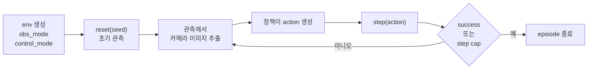
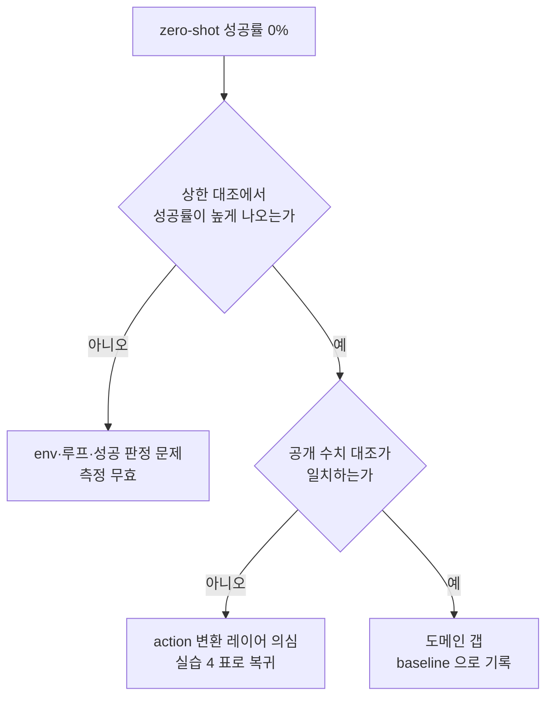

# Week 0 — sim 환경 구축 + 하네스 검증 + zero-shot baseline


> **이번 주 목표**: ManiSkill sim 을 구축하고, OpenVLA 를 그 루프에 연결해 zero-shot 성공률 baseline 을 측정한다. 단 측정보다 **하네스 검증**이 먼저다.
> **예상 시간**: 12-16시간
> **핵심 질문**: "성공률 0% 가 나왔을 때, 그것이 도메인 갭인지 내 통합 버그인지 어떻게 구분하는가?"
> **대응 Roadmap**: [`Roadmap/Phase 4.5.md`](../../../Roadmap/Phase%204.5.md) Section 0 전반. Section 0 후반 (Docker 컨테이너화 + RunPod 이관 + LoRA 1사이클 실측) 은 week3 (RunPod LoRA) 의 선행 조건이므로 그 week 자료에서 다룬다.


---


## 학습 순서


| 순서 | 단계 | 파일/자료 | 설명 |
|:----:|------|----------|------|
| 1 | sim 환경 신규 구축 | `PRACTICE.md` 1 | Vulkan 런타임, venv, ManiSkill 설치, 에셋, 내장 데모 검증 |
| 2 | 첫 환경 생성 | `PRACTICE.md` 2 | 관측 구조 확인 + 헤드리스 렌더 1장 |
| 3 | sim 단독 루프 | `PRACTICE.md` 3 | random action, action 공간, success 정의 확정 |
| 4 | action 변환 계약 확정 | `PRACTICE.md` 4 | 단위 / 범위 / 프레임 / gripper 부호 4항목 |
| 5 | 하네스 검증 | `PRACTICE.md` 5 | 성공률과 독립적으로 루프가 정상임을 입증 |
| 6 | zero-shot baseline 측정 | `PRACTICE.md` 6 | N=20, seed 고정, 부분 도달률 병기 |
| 7 | 퀴즈 | quiz_easy / quiz_medium | 변환 계약 / 검증 논리 |


---


## 시작하기 전에 — 환경 점검


```bash
nvidia-smi                  # RTX 4070 인식 + 여유 VRAM 확인
vulkaninfo --summary        # SAPIEN 은 Vulkan 으로 렌더한다. 여기서 GPU 가 안 잡히면 렌더 불가
ls /usr/share/vulkan/icd.d/ # nvidia ICD 파일이 있어야 GPU 렌더가 붙는다
python3 --version           # sapien 휠이 제공되는 버전인지 확인 (PRACTICE 1 에서 판정)
```


> **venv 를 분리한다.** Phase 4 의 공용 venv `.venv-vla` 는 `transformers==4.40.1` / `timm==0.9.16` 등 OpenVLA remote code 가 요구하는 고정 버전으로 묶여 있고 ([`../../Phase 4/week6/requirements.txt`](../../Phase%204/week6/requirements.txt)), 이 조합 위에서 Block 1-3 실측이 재현된다. ManiSkill 설치가 torch 를 갈아 버리면 그 재현성이 깨진다. 따라서 sim 검증은 별도 venv 에서 먼저 하고, OpenVLA 와의 통합 시점 (실습 6) 에 합칠지 판단한다 (PRACTICE 실습 1).


---


## 핵심 개념


### 1. 왜 하네스 검증이 측정보다 먼저인가


sim zero-shot 측정에서 나올 수 있는 결과는 사실상 "0/20" 하나다 (§7 참조). 문제는 그 숫자가 두 가지 완전히 다른 원인을 구분하지 못한다는 것이다.


| 원인 | 성격 | 대응 |
|---|---|---|
| 도메인 갭 — OpenVLA 가 이 sim 화면을 처음 본다 | **정상 결과**. baseline 으로 기록하고 진행 | Section 1 의 adaptation 대상이 된다 |
| 통합 버그 — action 변환·프레임·부호가 틀렸다 | **측정 무효**. 고치고 다시 재야 한다 | 원인을 찾아 수정 |


두 원인이 같은 숫자를 만들기 때문에, **숫자를 먼저 재면 그 숫자를 해석할 수 없다.** 반대로 "루프는 정상이다"를 성공률과 무관하게 먼저 입증해 두면, 0% 는 해석 가능한 결과가 된다.


이것이 Roadmap Section 0 의 순서 제약 — "하네스 검증이 zero-shot baseline 측정보다 앞이다" — 의 근거다.


### 2. 이 sim 의 역할은 학습 무대가 아니다


sim 을 쓰는 목적을 좁게 잡아야 판단이 흔들리지 않는다. 여기서 sim 은 **VLA 에 이미지를 공급하고 action 을 받아 실행하는 closed-loop 테스트 무대**다. 환경 제작도, 렌더링 품질 경쟁도 아니다.


그래서 평가 기준이 (1) embodiment/action 정합, (2) 이미지 획득 난이도, (3) 기성 task 제공, (4) GPU 부담, (5) 통합 노력이었고 그 결과 ManiSkill 이 선정됐다. 선정 근거와 비채택 후보 (SAPIEN 직접 구성 / MuJoCo / PyBullet / Isaac Sim) 는 [`Studies/Phase 4/notes.md`](../../Phase%204/notes.md) 순서 3 노트에 있다 — 이번 주에 다시 고르지 않는다.


**단 실행 환경은 0부터 만든다.** v1 에서 재사용할 수 있는 것은 위 선정 판단과 task 정의 문서뿐이고, 실제로 돌아가는 sim 은 없다. 따라서 Vulkan 런타임 확보, venv 구성, ManiSkill 설치, 에셋 확보, 내장 데모로 설치 검증까지가 이번 주 첫 실습이다 (PRACTICE 실습 1). 이 구축 기록은 그대로 Section 0 후반의 Docker 이미지 명세가 되므로, 겪은 증상과 대응을 남기는 것이 다음 단계의 입력이다.


### 3. ManiSkill 루프의 구조


ManiSkill 은 gymnasium 규약을 따른다. 한 episode 는 아래 흐름이다.





생성 시 지정하는 세 인자가 이번 주 작업의 거의 전부를 결정한다.


| 인자 | 역할 | 이번 주의 선택 |
|---|---|---|
| `obs_mode` | 관측에 무엇을 담을지 (상태값 / RGB / RGB-D 등) | 카메라 이미지가 필요하므로 RGB 계열 |
| `control_mode` | action 벡터를 로봇에게 어떻게 해석할지 | `pd_ee_delta_pose` (OpenVLA 의 EEF delta 출력과 대응) |
| `render_mode` | 화면 표시 방식 | 헤드리스 (GUI 없이 배열로 받는다) |


`env.step(action)` 은 `(obs, reward, terminated, truncated, info)` 를 돌려주고, task 성공 여부는 `info` 안에 실린다. **키 이름과 성공 판정의 정확한 정의는 설치된 버전에서 직접 확인한다** (실습 3) — 버전마다 다르므로 문서를 믿지 않는다.


### 4. action 변환 계약 — 이번 주의 성패를 가르는 지점


OpenVLA 는 7개 숫자를 내놓는다. ManiSkill 은 7개 숫자를 받는다. 개수가 같다는 것은 **아무것도 보장하지 않는다.** 아래 4가지가 전부 맞아야 팔이 의도한 대로 움직인다.


| # | 항목 | 안 맞으면 생기는 일 |
|---|---|---|
| 1 | **단위와 스케일** | 1cm 를 의도한 값이 1m 로 해석되어 팔이 튀거나, 반대로 거의 안 움직인다 |
| 2 | **값의 범위 규약** | 정규화된 값을 물리량으로, 또는 그 반대로 해석해 스케일이 통째로 어긋난다 |
| 3 | **기준 프레임과 회전 표현** | 방향이 엉뚱하게 돈다. 특히 회전은 표현이 다르면 조용히 틀린다 |
| 4 | **gripper 부호 규약** | 집어야 할 때 펴고, 펴야 할 때 집는다 |


이 4항목을 표로 확정하고 각 행에 출처를 붙이는 것이 실습 4 다. 이 표가 실습 5-6 의 입력이며, 나중에 자작 팔 (Phase 7) 로 갈 때도 같은 표를 다시 채우게 된다 — 즉 일회용 작업이 아니라 재사용되는 산출물이다.


### 5. 정규화와 `unnorm_key` (Phase 4 week6 의 연장)


Phase 4 week6 에서 다룬 내용의 요지는 이렇다. 로봇마다 한 스텝의 물리 스케일이 다르므로, 여러 로봇 데이터로 한 모델을 학습시키려면 각 로봇의 action 을 정규화해 통일한다. 그 결과 모델의 raw 출력도 정규화된 추상값이고, `unnorm_key` 는 "이 출력을 어느 로봇의 실제 단위로 되돌릴지" 고르는 스위치다.


이번 주에 새로 걸리는 문제는 여기서 시작한다.


- 되돌린 결과가 **어떤 물리 단위**인지 (미터? 센티미터? 라디안? 도?) 는 key 가 가리키는 통계에 달려 있다 — 확인해야 알 수 있다.
- 7개 차원이 **전부 같은 방식으로 정규화되지는 않는다.** 특히 gripper 차원은 연속량이 아니라 개폐 신호에 가까워, 다른 차원과 다르게 취급되는 경우가 있다. 통계에 차원별 적용 여부를 나타내는 마스크가 함께 담기는지 확인해야 한다.
- 선택한 key 의 로봇이 sim 의 로봇과 **다르다.** 스케일을 남의 팔 기준으로 되돌린 뒤 내 팔에 준다는 뜻이므로, 이 불일치 자체가 zero-shot 성공률을 떨어뜨리는 요인이 된다 (그리고 그것은 버그가 아니라 baseline 의 성질이다).


확인 위치는 모델의 action 통계 접근자와 모델 설정에 담긴 통계다 (실습 4).


### 6. 회전 표현과 기준 프레임


델타 회전을 표현하는 방식은 최소 두 가지가 흔하다.


| 표현 | 3개 숫자의 의미 | 특징 |
|---|---|---|
| 오일러각 (RPY) | 정해진 축 순서대로 각각 몇 라디안 돌릴지 | 순서 규약 (XYZ / ZYX 등) 이 다르면 결과가 달라진다 |
| 축-각 (회전 벡터) | 벡터의 방향이 회전축, 길이가 회전각 | 순서 규약이 없다. 크기가 작을 때 오일러각과 근사적으로 비슷해 **작은 델타에서는 틀려도 티가 안 난다** |


마지막 성질이 함정이다. 표현을 잘못 매핑해도 델타가 작으면 그럴싸하게 움직이므로, 코드가 도는 것만으로는 맞았다고 볼 수 없다.


기준 프레임도 같은 종류의 함정이다. 같은 `[0.01, 0, 0]` 이 base 프레임 기준이면 "로봇 기준 앞으로 1cm", end-effector 프레임 기준이면 "손이 향한 방향으로 1cm" 다. 손이 아래를 보고 있으면 두 해석의 결과는 완전히 다르다.


### 7. 성공률 0% 는 정상 범위다 — 그래서 지표를 하나 더 둔다


공개 벤치마크 (SimplerEnv, CoRL 2024) 가 보고하는 OpenVLA 의 sim zero-shot 성적은 환경에 따라 크게 갈린다.


| 환경 계열 | OpenVLA zero-shot |
|---|---|
| Google Robot 계열 (real2sim 정합 처리됨) | pick coke can 16.3% / move near 46.2% (visual matching) |
| WidowX + Bridge 계열 (정합 처리됨) | 0% 근처 |
| 정합 처리 없는 일반 sim task | 더 낮게 볼 것 |


ManiSkill 기본 task 는 마지막 줄에 해당한다. 즉 **최종 성공률만 재면 before 쪽이 0 에 붙어 before/after 비교가 성립하지 않는다.**


해법은 task 를 쉽게 만드는 것이 아니다 (OpenVLA 가 이 환경에서 잘하는 난이도대가 없다). **지표의 해상도를 올린다.** 최종 성공 하나로 접지 말고 진행 단계를 쪼개 도달률을 함께 기록한다.


| 단계 | 판정 아이디어 |
|---|---|
| reached | 그리퍼 끝이 대상 물체에 충분히 접근했는가 |
| grasped | 물체를 실제로 물었는가 |
| lifted | 물체가 바닥에서 떴는가 |
| placed | task 의 성공 판정을 통과했는가 (= 최종 성공률) |


최종 성공률이 0/20 이어도 reached 가 12/20 이면 신호가 살아 있다. adaptation 이 그 앞 단계를 밀어 올리면 before/after 가 움직인다. 임계값은 본인이 정해 기록한다 (실습 6) — 정하는 순간 baseline 의 정의가 되므로, 이후 fine-tuned 측정에서 같은 값을 써야 한다.


### 8. 하네스 검증의 두 수단은 서로 다른 용의자를 배제한다


이 구분을 놓치면 검증을 했는데도 아무것도 배제하지 못한다.


| 수단 | 하는 일 | 배제하는 용의자 | 배제하지 못하는 것 |
|---|---|---|---|
| (a) 상한 대조 | 기성 해법 (motion planning / scripted) 을 **같은 env·같은 step cap·같은 성공 판정**에 넣어 성공률 상한을 본다 | env 설정, 루프, 성공 판정, 카메라 | **action 변환 레이어** (기성 해법은 보통 변환을 우회한다) |
| (b) 공개 수치 대조 | 공개 수치가 있는 평가 환경에서 자체 결과를 그 수치와 맞춰 본다 | 변환 레이어까지 포함한 전체 경로 | 그 환경에 없는 조건 (내 task 고유 설정) |


(a) 가 싸고 (b) 가 강하다. 최소 1건이면 진행할 수 있지만, 둘을 다 하면 남는 미확인 영역이 거의 없다.


진단 순서는 이렇게 굳혀 둔다.





### 9. seed 를 고정해 기록하는 이유


PickCube 는 매 episode 마다 큐브 초기 위치와 목표를 무작위화한다. 그래서 성공률을 재려면 seed 를 바꿔 가며 N 회 돌려야 한다 (같은 조건 반복은 성공률이 아니다).


여기서 한 걸음 더 나아가야 한다. **어떤 seed 를 썼는지 목록으로 남긴다.** Section 3 의 fine-tuned 측정이 같은 seed 목록을 써야 before/after 의 변인이 모델 하나로 고정된다. 목록이 없으면 "동일 조건 N회" 라는 주장 자체를 할 수 없고, 그 주장이 Phase 4.5 의 성공 기준이다.


N 은 20 을 쓴다 (예산 절삭 시 하한 10). 한계도 같이 기록한다 — N=20 에서 성공률 신뢰구간은 50% 부근에서 약 ±22%p 로 매우 넓다. 이 수치는 통계적 추정이 아니라 baseline 이다.


---


## 자체 점검


아래 질문에 문서를 보지 않고 답한다. 막히면 해당 절로 돌아간다 — 답을 여기 적어 두지 않는 이유는, 다음 복습 때 답이 남아 있으면 읽고 넘어가게 되기 때문이다.


**Q1.** 성공률을 재기 전에 하네스를 검증해야 하는 이유를 한 문장으로. (§1)


**Q2.** 상한 대조 (a) 를 통과했는데도 여전히 남아 있는 용의자는 무엇인가. (§8)


**Q3.** 회전 표현을 잘못 매핑했는데도 팔이 그럴싸하게 움직일 수 있는 이유는. (§6)


**Q4.** 최종 성공률이 0/20 일 때 그것이 실패가 아니라 정상 결과일 수 있는 근거는. (§7)


**Q5.** seed 목록을 기록하지 않으면 Phase 4.5 의 어떤 주장이 성립하지 않는가. (§9)


**Q6.** `unnorm_key` 로 남의 로봇 통계를 쓰는 것이 버그가 아니라 baseline 의 성질인 이유는. (§5)


---


## 이번 주 실습 & 다음 주 준비


### 이번 주 실습 과제

1. sim 환경 신규 구축 (Vulkan / venv / ManiSkill / 에셋 / 내장 데모 완주) — `outputs/env_build.md`
2. `practice_env_check.py` — 관측 구조 확인 + 헤드리스 렌더 1장 저장
3. `practice_sim_loop.py` — random action episode + action 공간·success 정의 확정
4. action 변환 계약 표 작성 (출처 포함) — `outputs/action_contract.md`
5. `practice_upper_bound.py` — 상한 대조로 루프 검증
6. `practice_zeroshot_baseline.py` — N=20 baseline + 부분 도달률 + seed 목록
7. quiz_easy / quiz_medium 풀기


### 산출물의 착지점

측정 결과와 판단 기록은 `Studies/` 가 아니라 `Measurements/` 에 남긴다 ([`Measurements/README.md`](../../../Measurements/README.md) 보존 정책). 이번 주 결과는 `Measurements/openvla-maniskill-zeroshot/` 에 실험 디렉터리 표준 (`environment.md` / `methodology.md` / `raw/` / `findings.md`) 으로 정리하고, `Portfolio/evidence-index.md` 에 한 줄 추가한다.


### 다음 주 (week 1) 준비

- 실습 4 의 변환 계약 표와 실습 6 의 부분 도달률 정의가 week1 의 데이터 수집 규칙이 된다
- week1 의 task 확정 시 판단할 것: embodiment·카메라 규약은 정합시켜야 zero-shot 이 바닥을 벗어나고, task·물체·씬은 신규여야 adaptation 의 의미가 산다 — 두 요건이 상충하므로 함께 결정한다 (Roadmap Section 0)


---


## 이번 주 핵심 요약


1. **sim 은 신규 구축이다** — v1 에서 오는 것은 선정 판단 문서뿐이고, 실행 환경은 Vulkan 부터 0 에서 세운다. 구축 기록이 Docker 이미지 명세의 원본이 된다.
2. **검증이 측정보다 먼저다** — 0% 를 해석 가능하게 만드는 것이 이번 주의 실제 목표다.
3. **변환 계약 4항목** (단위 / 범위 / 프레임·회전 / gripper 부호) 을 출처와 함께 표로 확정한다.
4. **두 검증 수단은 배제하는 용의자가 다르다** — 상한 대조는 루프를, 공개 수치 대조는 변환까지 검증한다.
5. **지표를 두 층으로** — 최종 성공률 + 부분 도달률. 난이도를 낮춰 신호를 만드는 접근은 성립하지 않는다.
6. **seed 목록은 산출물이다** — "동일 조건 N회" 주장의 근거다.


---


다음: [Week 1 — sim task 정의 + adaptation 데이터 수집](../week1/README.md)
