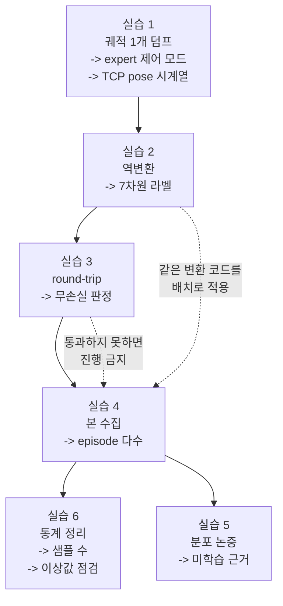

# Week 1 실습: expert 확보 -> 역변환 -> round-trip -> 데이터 수집


> **실습 목표**: expert 궤적을 OpenVLA 표현으로 무손실 변환해 학습 데이터셋 1벌을 만든다.
> **예상 시간**: 8-10시간
> **원칙**: 실습 4 (본 수집) 는 실습 3 (round-trip 검증) 을 통과한 뒤에만 한다. 변환이 틀린 채로 수집하면 라벨 전체에 계통 오차가 실린다.


### 이 문서를 읽는 법


- 각 실습은 **무엇을 하나 / 왜 하나 / 끝나면 손에 남는 것** 세 줄로 시작한다. 손을 대기 전에 이 세 줄만 먼저 읽고 지금 무슨 목적의 작업인지 잡는다.
- `README.md` 는 **개념**(왜 이런 구조인가), 이 문서는 **절차**(무엇을 타이핑하고 무엇을 확인하는가) 다. 개념이 흔들리면 각 절에 붙은 README § 번호로 돌아간다.
- 코드는 그대로 실행되는 완성본이다. 다만 **베껴 쓰기 전에 각 절의 "코드의 낯선 부분" 을 먼저 읽는다.** 이번 주 코드는 한 줄이 틀려도 에러 없이 그럴싸한 숫자를 내는 자리가 여러 곳이라, 무엇을 왜 그렇게 썼는지 모른 채 돌리면 틀린 데이터를 정상으로 착각한다.
- 두 모듈(`expert_policy.py`, `action_transform.py`)은 여러 실습이 함께 부른다. 각 실습마다 복사해 쓰면 한쪽만 고쳤을 때 데이터와 라벨이 어긋나므로, 한 곳에 두고 import 한다.


---


## 0. 이번 주 전체 그림


### 0.1 한 문장으로


> week0 에서 만든 sim 안에서 **정답을 아는 프로그램**에게 큐브 집기를 100번쯤 시키고, 매 스텝의 카메라 사진과 그때의 손 끝 움직임을 짝지어 저장한다. 단 손 끝 움직임을 **OpenVLA 가 쓰는 표현**(EEF delta + RPY + gripper, 원시 물리 단위) 으로 번역해서 저장한다.


이번 주의 어려움은 수집이 아니다. 수집 루프는 week0 실습 3 의 random action 루프와 거의 같다. 어려움은 **번역이 맞았는지 확인하는 것**이다. 번역이 틀려도 파일은 정상적으로 쌓이고, 다음 주 학습도 정상적으로 돌고, loss 도 내려간다. 결과만 조용히 틀린다. 실습 3 이 그것을 막는 유일한 관문이다.


### 0.2 6개 실습이 이어지는 방식


앞 실습의 출력이 뒤 실습의 입력이 된다. 특히 실습 1 -> 2 -> 3 은 한 궤적을 놓고 만들고 검증하는 한 묶음이고, 실습 4 에서야 규모를 만든다.





점선 하나가 이번 주의 핵심 제약이다. 실습 3 을 통과하기 전에 실습 4 를 하면, 틀린 라벨로 만든 데이터셋을 나중에 전량 버리게 된다.


### 0.3 자주 걸리는 용어 미리 풀기


| 용어 | 뜻 |
|---|---|
| **expert** | 정답 라벨을 만들어 주는 주체. 여기서는 week0 상한 대조에 쓴 기성 해법 |
| **motion planning** | 물체 좌표를 직접 읽어 경로를 계산하는 고전 방식. 카메라를 안 보고 푼다 |
| **궤적**(trajectory) | 한 episode 동안의 (관측, action, pose) 시계열 전체 |
| **덤프**(dump) | 메모리에 있는 데이터를 그대로 파일로 쏟아 저장하는 것 |
| **control_mode** | 내가 준 숫자를 로봇에게 어떻게 해석시킬지 정하는 설정. 관절 각도인지 손 끝 변화량인지 |
| **TCP**(tool center point) | 그리퍼 두 손가락 사이 기준점. 실질적으로 "손 끝 좌표" |
| **pose** | 위치(3) + 방향(회전) 을 합친 자세 |
| **쿼터니언**(quaternion) | 회전을 4개 숫자로 표현하는 방식. sim 내부가 주로 이 형식을 쓴다 |
| **RPY** | 회전을 축 순서대로 세 번 돌려 3개 숫자로 표현하는 오일러각 |
| **차분**(difference) | 연속한 두 값의 차이. `pose[t+1] - pose[t]` 가 그 스텝의 delta 다 |
| **역변환** | week0 의 "OpenVLA -> ManiSkill" 번역을 반대 방향으로 적용 |
| **정변환** | week0 에서 만든 원래 방향의 번역 |
| **round-trip** | 역변환 -> 정변환 -> 재생으로 원래 궤적이 복원되는지 보는 왕복 검사 |
| **계통 오차** | 모든 샘플에 같은 방향으로 실리는 편향. 평균해도 사라지지 않는다 |
| **npz** | numpy 배열 여러 개를 한 파일에 묶어 저장하는 형식 |
| **seed** | 무작위 초기 배치를 정하는 정수. seed 하나 = 문제 한 개 |
| **leakage** | 평가용 조건이 학습에 섞여 성적이 실력보다 좋게 나오는 오염 |
| **히스토그램** | 값의 분포를 구간별 개수로 그린 막대 그림. 이상값을 눈으로 잡는 데 쓴다 |


### 0.4 파일을 어디 두고 어디서 실행하나


스크립트는 `week1/` 바로 아래에 두고, 터미널의 현재 위치(cwd)도 `week1` 로 두고 실행한다. 이 문서의 모든 `outputs/...` 경로가 그 기준이다. `outputs/` 는 gitignore 대상이므로 **코드는 그 안에 두지 않는다.**


---


## 환경 설정


week0 의 sim venv 를 그대로 쓴다. 새로 만들지 않는다 (환경이 바뀌면 week0 데이터와 이번 주 데이터가 다른 환경 산출물이 된다 — 나중에 "같은 조건에서 모았다"는 주장을 할 수 없게 된다).


```bash
cd "/workspace/study/physical-ai-study/Studies/Phase 4.5"
source .venv-sim/bin/activate                  # week0 에서 만든 venv
mkdir -p week1/outputs/dataset                 # 수집 데이터 착지점 (outputs/ 는 gitignore)
cd week1
```


week0 산출물 4개가 있는지 먼저 확인한다 (README "시작하기 전에"). `action_contract.md` 가 비어 있으면 이번 주는 전부 추측이 되므로 week0 실습 4 로 돌아간다.


---


## 실습 1: expert 확보 + 궤적 1개 덤프


**무엇을 하나**: week0 실습 5 에서 쓴 기성 해법을 다시 불러, 큐브 집기 1회를 돌리면서 매 스텝의 카메라 이미지 / action / 손 끝 pose 를 파일로 남긴다.
**왜 하나**: 라벨 변환 규칙을 만들기 전에 **원재료가 어떤 형태로 나오는지** 알아야 한다. 특히 expert 가 관절 각도로 움직이는지 손 끝 변화량으로 움직이는지에 따라 실습 2 의 출발점이 달라진다.
**끝나면 손에 남는 것**: `outputs/expert_traj.npz` (궤적 1개) + `outputs/expert_facts.md` (expert 의 제어 모드와 action 의 의미) + `expert_policy.py` (실습 4 가 다시 부를 expert 호출부).


**파일명**: `practice_expert_dump.py`


week0 실습 5 에서 상한 대조에 쓴 기성 해법이 이번 주의 expert 다. 먼저 **그 해법이 어느 제어 모드로 동작하는지** 확인해야 한다 — 그것이 역변환의 출발점을 결정한다.


### 왜 세 가지를 함께 기록하나

한 스텝마다 **관측 이미지 / expert 의 action / TCP pose** 를 남긴다. 셋의 쓰임이 다르다.

| 기록 | 쓰임 |
|---|---|
| `frames` | 학습 입력. week2 가 이미지-라벨 쌍으로 묶는다 |
| `actions` | **라벨의 원재료.** expert 가 명령한 값이며 실습 2 가 물리 단위로 되돌린다 |
| `tcp_poses` | **검증 기준.** 실습 3 이 재생 궤적과 비교할 원본 궤적 |

`tcp_poses` 는 라벨을 만드는 데 쓰지 않는다. expert 가 관절 공간(`pd_joint_pos`) 으로 움직였다면 action 을 직접 못 쓰므로 pose 차분이 유일한 우회로였겠지만, 실측 결과 이 expert 는 EEF 공간(`pd_ee_delta_pose`) 이다. 그래서 action 을 그대로 되돌리는 길이 열려 있다 (실습 2, `outputs/roundtrip_check.md`).

그래도 pose 를 남기는 이유는 **비교 대상이 필요하기 때문**이다. 라벨이 맞는지 보려면 "원래 팔이 어디를 지나갔는가" 를 알아야 하고, 그것은 action 이 아니라 pose 다.


```python
"""
실습 1: expert 궤적 1개를 덤프하고 제어 모드를 확인
"""
import json                                    # 메타 저장
import numpy as np                             # 배열 저장
import gymnasium as gym
import mani_skill.envs
from PIL import Image                          # 관측 이미지 저장

from expert_policy import ScriptedExpert       # 실습 4 도 같은 것을 부른다


ENV_ID = "PickCube-v1"                         # <- week0 sim_facts.md 확정값
MAX_EPISODE_STEPS = 200                        # <- week0 harness_check.md 확정값. expert 는 이 예산에서 검증됨 (최대 49 step 소비)
STEP_CAP = 250                                 # 내 루프의 상한. 환경 상한(200)보다 크게 두어 truncation 의 출처를 구분 (week0 실습 3 원칙)
DUMP_SEED = 100                                # eval seed(0-19) 와 겹치지 않는 값으로 고른다


print("=" * 60)
print("실습 1: expert 궤적 덤프")
print("=" * 60)


# -- 1-1. expert 가 쓰는 제어 모드 확인 (역변환의 출발점) --
# week0 실습 5 의 해법 스크립트(`../week0/harness_check.py`)를 열어 세 가지를 확인한다:
#   (a) env 를 어떤 control_mode 로 생성하는가 (관절 공간인가 EEF 공간인가)
#   (b) action 을 어떤 형태로 만들어 step 에 넣는가
#   (c) 그 action 이 현재 상태만으로 정해지는가, 아니면 단계 상태를 기억해야 하는가
# 확인 결과를 outputs/expert_facts.md 에 적고, 아래 EXPERT_CONTROL_MODE 를 채운다.
EXPERT_CONTROL_MODE = "pd_ee_delta_pose"       # <- 실습 1-1 확정값 (scripted expert, outputs/expert_facts.md)


# -- 1-2. env 생성 (expert 의 제어 모드로) --
# 주의: 여기서는 expert 의 모드를 쓴다. week0 의 pd_ee_delta_pose 와 다를 수 있다.
# sim_backend="physx_cpu": 물리 시뮬레이션을 CPU 에서 돌린다. 궤적 1개 덤프에는
# GPU 병렬이 필요 없고, 상태값(tcp pose 등)이 CPU 텐서로 나와 numpy 변환이 단순해진다.
# max_episode_steps: 등록 기본값 50 대신 expert 가 검증된 예산 200 을 명시한다.
# sensor_configs: week0 baseline 과 같은 224 로 수집한다 -- 기본값 128 로 모으면
# 학습 이미지(128 업스케일)와 eval 입력(native 224)의 시각 도메인이 어긋난다.
env = gym.make(ENV_ID, obs_mode="rgb", control_mode=EXPERT_CONTROL_MODE,
               max_episode_steps=MAX_EPISODE_STEPS, sim_backend="physx_cpu",
               sensor_configs=dict(width=224, height=224))
obs, info = env.reset(seed=DUMP_SEED)          # 고정 seed 로 재현 가능하게
expert = ScriptedExpert(env)                   # 단계 상태를 들고 있으므로 env.reset 과 짝을 맞춘다
print("control mode:", env.unwrapped.control_mode)


# -- 1-3. 궤적 수집 (매 스텝의 관측·action·TCP pose 를 함께 남긴다) --
frames = []                                    # 관측 이미지
actions = []                                   # expert 가 낸 원본 action
tcp_poses = []                                 # 매 스텝의 end-effector pose
success = False


for step in range(STEP_CAP):
    # (a) 관측 이미지 추출 — 키 경로는 week0 sim_facts.md 의 확정값
    # 카메라 렌더링은 sim_backend 와 무관하게 GPU 에서 수행되므로, cuda 텐서를
    # .cpu() 로 host 메모리에 복사한 뒤 .numpy() 로 변환한다 (np.asarray 는 cuda 텐서에서 에러)
    frame = obs["sensor_data"]["base_camera"]["rgb"].cpu().numpy()
    if frame.ndim == 4:                        # 배치 차원이 있으면 첫 장만
        frame = frame[0]
    frames.append(frame.astype(np.uint8))

    # (b) 현재 TCP pose 기록 (접근 경로는 week0 sim_facts.md 의 상태 접근 경로)
    tcp_poses.append(np.asarray(env.unwrapped.agent.tcp.pose.raw_pose).reshape(-1))

    # (c) expert action 획득
    # expert 는 상태를 들고 있다 (above -> descend -> close -> lift -> hold). 즉 관측을 받아
    # 값을 내는 순수 함수가 아니라, episode 마다 초기화되는 단계 변수를 가진 객체다.
    action = expert.act()
    actions.append(np.asarray(action).reshape(-1))

    # (d) 실행
    obs, reward, terminated, truncated, info = env.step(action)
    if info.get("success", False):             # 성공하면 종료
        success = True
        break
    if terminated or truncated:
        break


env.close()
print(f"수집 스텝: {len(actions)}, success: {success}")


# -- 1-4. 데이터 자격 판정 (저장하기 전에) --
# expert 가 제대로 붙었다면 이 seed 는 성공한다 (week0 상한 대조 20/20).
# 실패한 채로 저장하면 실습 2 가 그 궤적을 라벨로 만들고, 실습 3 이 그 위에서
# 그럴싸한 숫자를 낸다. 파일이 생겼다는 사실은 데이터가 맞다는 증거가 아니다.
assert success, "expert 가 실패했다 -- 호출부이거나 env 조건이 week0 과 다르다"


# -- 1-5. 저장 (이미지는 png, 나머지는 npz + json) --
np.savez("outputs/expert_traj.npz",
         frames=np.stack(frames),              # (T, H, W, 3)
         actions=np.stack(actions),            # (T, action_dim)
         tcp_poses=np.stack(tcp_poses))        # (T, pose_dim)
Image.fromarray(frames[0]).save("outputs/expert_traj_first.png")   # 눈으로 장면 확인용
with open("outputs/expert_traj_meta.json", "w") as f:
    json.dump({"env_id": ENV_ID, "seed": DUMP_SEED, "steps": len(actions),
               "control_mode": EXPERT_CONTROL_MODE, "success": bool(success)}, f, indent=2)
print("저장 완료: outputs/expert_traj.npz")
```


코드에서 낯선 부분을 풀어 둔다.


- `.cpu().numpy()`: ManiSkill 은 관측을 numpy 가 아니라 **torch 텐서**로 준다. 특히 카메라 이미지는 GPU 렌더러가 만들어 `cuda:0` 에 있으므로, `np.asarray` 로 바로 바꾸면 "can't convert cuda:0 device type tensor to numpy" 에러가 난다. `.cpu()` 가 GPU 에서 host 메모리로 복사하는 단계, `.numpy()` 가 numpy 변환 단계다.
- `sim_backend="physx_cpu"` 를 줘도 위 에러는 사라지지 않는다: 이 옵션은 **물리 엔진**만 CPU 로 옮기고, 카메라 **렌더링**은 여전히 GPU 가 담당하기 때문이다. 다만 tcp pose 같은 상태값은 CPU 텐서가 되어 `np.asarray` 가 그대로 동작한다.
- `max_episode_steps=200`: `PickCube-v1` 의 등록 기본 상한은 50 이다 (week0 `sim_facts.md`). expert 가 20/20 으로 검증된 조건은 예산 200 이었고 최대 49 step 을 썼으므로, 기본값 50 을 그대로 쓰면 소비 step 이 상한 경계에 걸린다. 검증된 조건과 같은 200 으로 명시한다.
- `sensor_configs=dict(width=224, height=224)`: 관측 카메라의 등록 기본값은 128x128 이다 (week0 `sim_facts.md`). week0 baseline 측정과 week2 빌더 명세가 모두 224 이므로 수집도 224 로 맞춘다. 기본값으로 모으면 학습 이미지만 128 업스케일이 되어 eval 입력(native 224)과 시각 도메인이 어긋난다.
- `np.savez`: numpy 배열 여러 개를 한 파일(`.npz`)에 이름을 붙여 저장한다. 나중에 `np.load(path)["frames"]` 처럼 이름으로 꺼낸다.
- `np.stack(frames)`: 이미지 여러 장의 리스트를 `(T, H, W, 3)` 모양의 한 배열로 쌓는다. `T` 는 스텝 수다.
- `.reshape(-1)`: 배열을 1차원으로 펴는 것. ManiSkill 은 환경 개수 차원을 붙여 `(1, 7)` 로 주므로, 펴서 `(7,)` 로 만들어 저장을 단순하게 한다.
- `frame.ndim == 4`: 위와 같은 이유다. 환경이 1개여도 `(1, H, W, 3)` 으로 오므로 첫 장을 꺼낸다.
- `DUMP_SEED = 100`: eval 전용으로 예약된 `0-19` 를 피한 값이다. 여기서 실수로 eval seed 를 쓰면 이 궤적이 그대로 학습에 들어가 leakage 가 된다 (README §4).
- `expert.act()`: 이 정책은 함수가 아니라 객체다. 지금 어느 단계인지(`phase`)와 그리퍼를 몇 스텝째 닫고 있는지(`close_count`)를 기억해야 하기 때문이다. 그래서 `env.reset()` 을 할 때마다 `expert.reset()` 도 함께 불러야 한다 (실습 4 의 반복 루프에서 중요해진다).
- `assert success, "..."`: 조건이 거짓이면 그 자리에서 프로그램을 멈추고 뒤의 메시지를 띄운다. 이 한 줄이 없으면 실패한 궤적도 `expert_traj.npz` 라는 이름으로 정상 저장되고, 실습 2 와 3 이 그 위에서 조용히 돌아간다. **틀린 데이터는 에러를 내지 않는다 — 멈추는 코드를 따로 두지 않으면 아무도 알려주지 않는다.**


**기록할 것** (`outputs/expert_facts.md`)

| 항목 | 확정값 | 출처 |
|---|---|---|
| expert 종류 (motion planning / scripted / 데모 데이터) | | week0 실습 5 |
| expert 의 control_mode | | 1-1 확인 |
| action 차원과 의미 | | 1-1 + `env.action_space` |
| TCP pose 접근 경로 | | week0 `sim_facts.md` |
| expert 성공 여부 (이 seed) | | 1-3 출력 |


> expert 가 실패하면 데이터 생성기로 쓸 수 없다. 1-4 의 assert 가 걸리면 순서대로 의심한다. (1) 단계 상태를 episode 시작 시 초기화했는가. (2) 조건 (env id / control_mode / step cap) 이 week0 기록과 다른가 — 세 값을 한 줄씩 대조한다. (3) `expert.act()` 가 읽는 좌표 경로(`agent.tcp` / `cube` / `goal_site`) 가 이 태스크에 있는가.


### expert 정책 (`expert_policy.py`)

week0 실습 5 의 scripted 해법을 클래스로 옮긴 것이다. 실습 1 과 실습 4 가 **같은 정책**을 써야 하므로 여기 한 곳에 두고 양쪽에서 import 한다.

```python
"""
실습 1/4 가 공유하는 scripted expert
"""
import numpy as np


POS_LIMIT = 0.1        # pd_ee_delta_pose 의 위치 한계 (m). action 1.0 = 0.1 m (계약 표 1번)
MAX_STEP_M = 0.03      # 한 step 에 요청할 최대 이동량 (m). 크게 잡으면 PD 추종이 흔들린다
APPROACH_HEIGHT = 0.05 # 큐브 위 어느 높이에서 하강을 시작할지 (m)
CLOSE_STEPS = 8        # 그리퍼가 실제로 닫히기까지 기다리는 step 수
ABOVE_TOL = 0.008      # above 단계를 마칠 거리 기준 (m)
DESCEND_TOL = 0.006    # descend 단계를 마칠 거리 기준 (m)
GOAL_TOL = 0.02        # 큐브가 목표에 이만큼 붙으면 정지 단계로 (m). goal_thresh(0.025) 보다 보수적


def to_vec(pose_field):
    """배치 텐서로 오는 좌표를 (3,) numpy 벡터로 바꾼다."""
    return np.asarray(pose_field.cpu())[0]     # 텐서 -> CPU -> numpy, 배치 차원 제거


class ScriptedExpert:
    """PickCube-v1 을 푸는 상태 기반 scripted 정책."""

    def __init__(self, env):
        self.base = env.unwrapped              # 큐브·목표 좌표는 wrapper 를 벗겨야 보인다
        self.reset()

    def reset(self):
        """단계 상태를 처음으로 되돌린다. `env.reset()` 직후마다 함께 호출한다."""
        self.phase = "above"                   # above -> descend -> close -> lift -> hold
        self.close_count = 0                   # 그리퍼 닫기 명령을 몇 step 유지했는지

    def act(self):
        """현재 sim 상태를 읽어 이번 step 의 action (7,) 을 만든다."""
        tcp = to_vec(self.base.agent.tcp.pose.p)        # 그리퍼 끝 현재 위치
        cube = to_vec(self.base.cube.pose.p)            # 큐브 위치 (특권 정보 — 카메라를 안 본다)
        goal = to_vec(self.base.goal_site.pose.p)       # 목표 지점 위치
        grip = 1.0                                      # 기본은 열림 (+1 = 열림, 계약 표 5번)

        if self.phase == "above":                       # 1) 큐브 위쪽으로 이동
            target = cube + np.array([0.0, 0.0, APPROACH_HEIGHT])
            if np.linalg.norm(target - tcp) < ABOVE_TOL:
                self.phase = "descend"
        elif self.phase == "descend":                   # 2) 큐브 중심 높이까지 하강
            target = cube
            if np.linalg.norm(target - tcp) < DESCEND_TOL:
                self.phase = "close"
        elif self.phase == "close":                     # 3) 제자리에서 그리퍼 닫기
            target = tcp                                # 이동 없음 (델타 0)
            grip = -1.0                                 # -1 = 닫힘
            self.close_count += 1
            if self.close_count >= CLOSE_STEPS:         # 실제로 닫힐 시간을 준 뒤 다음 단계
                self.phase = "lift"
        elif self.phase == "lift":                      # 4) 큐브를 든 채 목표 지점으로
            target = goal
            grip = -1.0
            if np.linalg.norm(goal - cube) < GOAL_TOL:
                self.phase = "hold"
        else:                                           # 5) 정지 — success 는 정지 상태도 요구한다
            target = tcp
            grip = -1.0

        delta = np.clip(target - tcp, -MAX_STEP_M, MAX_STEP_M)   # step 당 이동량 제한
        action = np.concatenate([
            delta / POS_LIMIT,                          # 미터 -> [-1, 1] 정규화 (계약 표 1번)
            np.zeros(3),                                # 회전 델타 없음 (초기 자세가 이미 아래를 향한다)
            [grip],
        ])
        return action.astype(np.float32)
```

여기서 기억할 두 가지:

- **회전 델타가 전 단계에서 0 이다.** Panda 의 초기 자세가 이미 그리퍼를 아래로 향하고 있어 위치 제어만으로 큐브를 잡을 수 있다. 이 사실이 실습 3 의 검증 범위를 좁힌다 — 회전 규칙을 틀리게 써도 이 데이터로는 드러나지 않는다.
- **`MAX_STEP_M = 0.03` 은 명령의 상한이지 실제 이동량이 아니다.** PD 컨트롤러는 한 스텝에 명령의 일부만 따라간다. 이 차이가 실습 2 의 라벨 정의를 가르는 지점이 된다.


---


## 실습 2: action 표현 역변환


**무엇을 하나**: 실습 1 이 남긴 expert action 을 `[-1, 1]` 정규화값에서 원시 물리 단위(미터·라디안)로 되돌려, OpenVLA 표현의 7차원 라벨을 만든다.
**왜 하나**: 학습의 정답은 **모델이 낼 수 있는 형식**이어야 한다. expert 가 낸 정규화값을 그대로 쓰면 모델은 자기가 만들 수 없는 숫자를 정답으로 배운다 (README §2).
**끝나면 손에 남는 것**: `outputs/openvla_actions.npy` — `(T-1, 7)` 모양의 라벨 배열. 그리고 역변환 함수 자체 — 실습 3 의 정변환과 **같은 파일**에 두고 실습 4-6 이 다시 부른다.


**파일명**: `practice_inverse_transform.py` (변환 함수는 `action_transform.py`)


week0 계약 표를 반대 방향으로 읽는 작업이다. 계약 표는 "OpenVLA 물리량 -> ManiSkill 정규화값" 을 적고 있으니, 각 행의 나눗셈을 곱셈으로 뒤집으면 된다.


### 라벨은 "명령" 인가 "실제로 움직인 양" 인가

이 선택이 이번 주에서 가장 조용히 틀리는 지점이다. 두 값은 다르다.

| | 명령 | 실제 이동 |
|---|---|---|
| 무엇 | expert 가 컨트롤러에 넣은 목표 델타 | 그 스텝에 팔이 실제로 이동한 거리 |
| 어디서 | `actions` 를 역정규화 | `tcp_poses` 를 차분 |
| 이 궤적의 크기 | 평균 0.0336 m | 평균 0.0132 m |

PD 컨트롤러는 한 스텝에 목표를 다 따라가지 못한다. 실측 추종률이 **평균 0.424** 다. 즉 팔은 명령의 42% 만 움직인다.

**라벨은 명령이어야 한다.** 실제 이동량을 라벨로 적으면, 학습된 모델이 그 값을 내놓고 그것이 다시 명령이 되어 42% 가 한 번 더 곱해진다. 결과적으로 의도의 18% 만 움직인다. 실습 3 이 이것을 잡는다 (`outputs/roundtrip_check.md`).

부수 효과도 크다. 명령 대역은 ±0.030 m/step 으로 `bridge_orig` 의 `q01`-`q99`(±0.029-0.042) 와 거의 맞는데, 실제 이동 대역은 ±0.013 으로 1/2.4 다. 후자로 학습하면 모델이 **사전학습 시절보다 2.4배 작게 움직이는 출력**을 내도록 배운다.

원격조작 데이터셋(bridge 등)이 사람의 **명령**을 기록하는 것도 같은 이유다.

> 이 길이 열려 있는 것은 expert 가 EEF 공간(`pd_ee_delta_pose`)으로 움직이기 때문이다. 만약 expert 가 관절 공간이었다면 action 은 "1번 관절을 몇 라디안" 이라 직접 못 쓰고, `tcp_poses` 차분이 유일한 우회로였을 것이다. 그때는 위 42% 문제를 감수하거나 다른 expert 를 찾아야 한다. 실습 1-1 에서 제어 모드를 먼저 확인한 이유가 이것이다.


### 왜 라벨 개수가 스텝 수보다 1 적은가


라벨은 "t 화면을 보고 t+1 로 가려면 무엇을 명령해야 하는가" 다. 스텝이 `T` 개면 마지막 스텝의 명령에는 대응하는 다음 프레임이 없으므로, 짝지을 수 있는 라벨은 `T-1` 개다.


이 1의 차이가 다음 주 포맷 변환에서 자주 사고를 낸다. 이미지 `T` 장과 라벨 `T-1` 개를 그냥 짝지으면 **한 칸씩 밀린 라벨**이 되고, 모델은 "다음 화면에서 할 동작"을 "지금 화면의 정답"으로 배운다. 예외는 나지 않는다. week2 빌더에서 관측을 마지막 한 장 잘라 길이를 맞추는 이유가 이것이다.


변환 함수는 `action_transform.py` 에 둔다. 실습 3 의 정변환과 같은 파일이며, 이유는 실습 3-1 에 적어 두었다.

```python
"""
실습 2/3/4 가 공유하는 action 표현 변환 (action_transform.py)
"""
import numpy as np


POS_LIMIT = 0.1     # pd_ee_delta_pose 의 위치 한계 (m). action 1.0 = 0.1 m (계약 표 1번)
ROT_SCALE = -0.1    # 회전 스케일 (rad). 부호가 반전돼 있다 (계약 표 4번)


def to_maniskill_action(raw_action):
    """OpenVLA 표현의 action(7,) 을 ManiSkill pd_ee_delta_pose action(7,) 으로 바꾼다."""
    pos = raw_action[:3] / POS_LIMIT           # 미터 -> 정규화 (±0.1 m 가 ±1)
    rot = raw_action[3:6] / ROT_SCALE          # 라디안 -> 정규화, rot_lower 곱셈 때문에 부호 반전
    rot_norm = np.linalg.norm(rot)             # 회전은 축별이 아니라 3벡터 노름으로 제한된다
    if rot_norm > 1.0:                         # 노름이 1 을 넘으면 방향을 유지한 채 축소
        rot = rot / rot_norm
    grip = 2.0 * raw_action[6] - 1.0           # [0,1](0=닫힘) -> [-1,1](-1=닫힘)
    action = np.concatenate([np.clip(pos, -1, 1), rot, [np.clip(grip, -1, 1)]])
    return action.astype(np.float32)


def to_openvla_actions(expert_actions):
    """expert 가 낸 action 을 OpenVLA 표현의 학습 라벨로 바꾼다 (역변환).

    Args:
        expert_actions: (T, 7) — expert 가 낸 ManiSkill 정규화 action

    Returns:
        (T-1, 7) float32. [dx,dy,dz](m) + [drx,dry,drz](rad) + gripper [0,1]
    """
    # step t 의 라벨은 t -> t+1 을 만든 명령이다. 마지막 스텝의 명령은 대응하는 다음
    # 프레임이 없으므로 버린다. 그래서 라벨 개수가 관측보다 하나 적다
    commands = expert_actions[:-1]

    delta_position = commands[:, 0:3] * POS_LIMIT   # 정규화값 -> 미터 (계약 표 1번의 역)
    delta_rotation = commands[:, 3:6] * ROT_SCALE   # 정규화값 -> 라디안 (계약 표 4번의 역)
    gripper = (commands[:, 6:7] + 1.0) / 2.0        # [-1,1](-1=닫힘) -> [0,1](0=닫힘)

    labels = np.concatenate([delta_position, delta_rotation, gripper], axis=1)
    return labels.astype(np.float32)
```

이 함수를 부르는 쪽이 실습 2 의 스크립트다.

```python
"""
실습 2: expert action 을 OpenVLA 표현의 라벨로 되돌린다
"""
import numpy as np

from action_transform import to_openvla_actions


data = np.load("outputs/expert_traj.npz")      # 실습 1 산출물
expert_actions = data["actions"]               # (T, 7) — 라벨의 원재료
tcp_poses = data["tcp_poses"]                  # (T, 7) — 라벨에는 안 쓴다. 실습 3 의 비교 기준


print("=" * 60)
print("실습 2: 역변환")
print("=" * 60)
print("expert_actions shape:", expert_actions.shape)
print("tcp_poses shape:", tcp_poses.shape)
print("첫 pose:", tcp_poses[0])                # 위치 3 + 쿼터니언 4(wxyz) 인지 눈으로 확인


openvla_actions = to_openvla_actions(expert_actions)
print("openvla_actions shape:", openvla_actions.shape)   # (T-1, 7) 이어야 한다
print("차원별 범위:")
for dim in range(openvla_actions.shape[1]):     # 각 차원의 최소/최대를 본다
    column = openvla_actions[:, dim]
    print(f"   dim{dim}: min={column.min():+.4f} max={column.max():+.4f}")
print("gripper 고유값:", sorted(set(openvla_actions[:, 6].tolist())))


np.save("outputs/openvla_actions.npy", openvla_actions)
print("저장 완료: outputs/openvla_actions.npy")
```


코드의 낯선 부분:


- `commands = expert_actions[:-1]`: 마지막 하나를 버려 길이를 `T-1` 로 맞춘다. 위 "왜 라벨 개수가 스텝 수보다 1 적은가" 의 구현이다.
- `* POS_LIMIT` 이 나눗셈이 아니라 곱셈인 이유: 계약 표 1번은 `a = d / 0.1` 이다. 여기서는 그 **역**을 하므로 `d = a * 0.1` 이 된다. 방향을 헷갈려 나눠 버리면 라벨이 100배 커진다.
- `* ROT_SCALE` 의 부호: `ROT_SCALE` 이 `-0.1` 인 것은 오타가 아니다. ManiSkill 컨트롤러가 회전 벡터에 `rot_lower = -0.1` 을 곱하기 때문이다 (`pd_ee_pose.py:232`). 위치는 정상 사상인데 회전만 이 경로를 타므로, 모르고 부호를 맞추면 회전이 전부 반대로 간다.
- 회전 3차원의 의미는 **intrinsic XYZ 오일러각**이다. 컨트롤러가 이 값을 `euler_angles_to_matrix(delta, "XYZ")` 로 해석하기 때문이다 (`pd_ee_pose.py:242`). 이 함수가 `Rx @ Ry @ Rz` 로 합성하므로 intrinsic 이고, scipy 로 다룰 일이 생기면 대문자 `"XYZ"` 를 쓴다 (소문자는 extrinsic 이라 다른 값이 된다).
- 라벨을 정규화하지 않는 이유: 정규화는 week2 의 학습 파이프라인이 데이터셋 통계로 수행한다. 여기서 미리 `[-1, 1]` 로 맞추면 **이중 정규화**가 되어 라벨이 망가진다 (README §2).
- `tcp_poses` 를 읽어 두고 라벨에 안 쓰는 것이 낭비처럼 보이지만, 실습 3 이 "원래 팔이 어디를 지나갔는가" 를 알아야 검증할 수 있다. 라벨의 재료와 검증의 기준은 다른 배열이다.


**확인 포인트**

- 차원별 범위가 week0 실습 4 에서 본 OpenVLA 통계의 대역과 비슷한가. `bridge_orig` 의 위치 `q01`-`q99` 는 ±0.029-0.042 m 이고, 이 expert 의 명령 상한은 ±0.030 m 이므로 같은 자릿수여야 한다. 자릿수가 다르면 곱셈/나눗셈 방향이 뒤집힌 것이다
- gripper 차원의 고유값이 정확히 `{0.0, 1.0}` 인가. 중간값이 섞이면 성분을 잘못 뽑았거나 부호 변환이 틀렸다
- 회전 3차원이 전부 정확히 0 인가. 이 expert 는 회전 델타를 명령하지 않으므로 0 이 정상이다. **0 이 아닌 값이 나오면 pose 차분을 섞어 계산한 것이다** — 그 경우 실제로 나오는 것은 PD 추종 흔들림이지 의도된 회전이 아니다


---


## 실습 3: round-trip 검증


**무엇을 하나**: 실습 2 가 만든 라벨을 week0 의 정변환으로 되돌려 env 에 다시 넣고, 팔이 원래와 같은 궤적을 그리는지 숫자로 비교한다.
**왜 하나**: 라벨이 맞았는지 눈으로는 알 수 없다. 회전 표현이나 프레임이 틀려도 델타가 작으면 값이 그럴싸해 보인다 (week0 §6). 왕복 재생이 그것을 잡는 유일한 수단이다.
**끝나면 손에 남는 것**: `outputs/roundtrip_check.md` — 강한/약한 기준 판정과 그 허용 오차를 그 값으로 정한 근거.


**파일명**: `practice_roundtrip.py`


역변환한 action 을 week0 의 **정변환**으로 되돌려 env 에 재생하고, 원래 궤적과 비교한다. 이 검증을 통과하기 전에는 본 수집을 하지 않는다.


### 두 기준이 각각 무엇을 보는가


| 기준 | 보는 것 | 통과의 의미 |
|---|---|---|
| 강한 기준 | 스텝별 손 끝 위치가 원래 궤적과 얼마나 벌어지는가 | 번역이 정보를 잃지 않았다 |
| 약한 기준 | 재생한 episode 도 task 를 달성하는가 | 궤적이 조금 달라도 결과는 같다 |


강한 기준이 필요한 이유는, 약한 기준만 보면 "조금씩 다르게 적히는 라벨" 을 통과시키기 때문이다. task 가 쉬우면 라벨이 5% 틀려도 성공한다. 그 5% 는 모든 샘플에 같은 방향으로 실리는 **계통 오차**이고, 평균으로 사라지지 않는다.


```python
"""
실습 3: 역변환 -> 정변환 -> 재생. 원래 궤적과 일치하는지 판정
"""
import numpy as np
import gymnasium as gym
import mani_skill.envs

from action_transform import to_maniskill_action   # 실습 2 와 같은 파일의 반대 방향 함수


ENV_ID = "PickCube-v1"                          # <- 확정값
MAX_EPISODE_STEPS = 200                         # 실습 1 과 같은 예산 — 기본값 50 이면 재생이 50 step 에서 잘린다
DUMP_SEED = 100                                 # 실습 1 과 같은 seed
STRONG_TOL = 1e-3                               # 강한 기준: pose 차이 허용 오차 (m) — 근거를 적을 것


print("=" * 60)
print("실습 3: round-trip 검증")
print("=" * 60)


openvla_actions = np.load("outputs/openvla_actions.npy")   # 실습 2 산출물
original = np.load("outputs/expert_traj.npz")["tcp_poses"] # 실습 1 의 원래 궤적


# -- 3-1. 정변환 함수는 실습 2 와 같은 파일에 둔다 --
# week0 `practice_zeroshot_baseline.py` 를 그대로 import 할 수는 없다 -- 그 파일은
# 모듈 최상위에서 OpenVLA 7B 를 로드하므로 import 하는 순간 모델이 뜬다.
# 그래서 정변환과 역변환을 함께 담은 `action_transform.py` 를 두고 실습 2/3/4 가 같이 부른다.
# 두 방향을 다른 파일에 적으면, 한쪽만 고쳤을 때 round-trip 은 통과하는데 데이터는 틀린
# 상태가 만들어진다 -- 왕복 검사는 두 함수가 서로의 역인지만 보이지, 그 쌍이 바깥 규약과
# 맞는지는 보이지 않기 때문이다.


# -- 3-2. OpenVLA 표현으로 재생 (week0 과 같은 control_mode 를 쓴다) --
# sim_backend 는 실습 1 덤프와 동일하게 — 물리 백엔드가 다르면 수치가 달라져 round-trip 비교가 흐려진다
env = gym.make(ENV_ID, obs_mode="rgb", control_mode="pd_ee_delta_pose",
               max_episode_steps=MAX_EPISODE_STEPS, sim_backend="physx_cpu")
obs, info = env.reset(seed=DUMP_SEED)           # 같은 seed -> 같은 초기 배치
replay_poses = []                               # 재생 궤적의 TCP pose
success = False


for action_7d in openvla_actions:               # 역변환 결과를 순서대로
    replay_poses.append(np.asarray(env.unwrapped.agent.tcp.pose.raw_pose).reshape(-1))
    action = to_maniskill_action(action_7d)     # 원시 물리량 -> ManiSkill 정규화값 (정변환)
    obs, reward, terminated, truncated, info = env.step(action)
    if info.get("success", False):
        success = True
        break
    if terminated or truncated:
        break


env.close()
replay_poses = np.stack(replay_poses)


# -- 3-3. 강한 기준: 스텝별 pose 차이 --
compare_len = min(len(replay_poses), len(original))       # 길이가 다르면 짧은 쪽까지 비교
position_error = np.linalg.norm(
    replay_poses[:compare_len, 0:3] - original[:compare_len, 0:3], axis=1)
print(f"\n비교 스텝 수: {compare_len} (재생 {len(replay_poses)} / 원본 {len(original)})")
print(f"위치 오차 mean={position_error.mean():.6f} max={position_error.max():.6f} m")
print(f"강한 기준(max < {STRONG_TOL}): {'통과' if position_error.max() < STRONG_TOL else '실패'}")


# -- 3-4. 회전 오차 (진단용, 판정 기준 아님) --
# 위치 오차만 보면 회전 라벨이 틀려도 잡히지 않는다. 다만 이 expert 는 회전 델타를
# 명령하지 않으므로 이 값이 작다고 해서 회전 규칙이 맞다는 증거가 되지는 않는다
rotation_error = np.linalg.norm(
    replay_poses[:compare_len, 3:7] - original[:compare_len, 3:7], axis=1)
print(f"쿼터니언 오차 mean={rotation_error.mean():.6f} max={rotation_error.max():.6f}")


# -- 3-5. 약한 기준: 재생도 task 를 달성하는가 --
print(f"약한 기준(success): {'통과' if success else '실패'}")
```


코드의 낯선 부분:


- `np.linalg.norm(..., axis=1)`: 각 행(스텝) 의 3차원 차이 벡터의 길이를 구한다. 즉 스텝별 "몇 미터 벌어졌는가" 를 미터 단위 하나의 숫자로 만든다.
- `STRONG_TOL = 1e-3`: 1 mm 다. PickCube 의 성공 판정은 큐브가 목표 `goal_thresh = 0.025 m` 안에 들어오는 것이므로, 1 mm 는 그 1/25 다. **이 크기의 오차만으로는 성공 판정이 뒤집힐 수 없는 값**이라는 것이 이 기준의 근거다. 값을 바꾸겠다면 근거도 함께 바꿔 `outputs/roundtrip_check.md` 에 적는다.
- 재생 길이가 원본보다 짧아질 수 있다: 재생 중 환경이 먼저 끝나면 `break` 된다. 그래서 짧은 쪽까지만 비교한다. 또 라벨이 `T-1` 개이므로 재생은 원본보다 최소 한 스텝 짧다.
- **라벨이 명령이면 이 검사는 거의 항등이 된다.** 재생이 넣는 명령이 원본 명령과 같은 값이고 sim 이 결정론적이므로, 오차는 float32 정밀도 수준(1e-8)까지 떨어진다. 검사가 쉬워진 것이 아니라 **틀릴 여지가 있는 곳이 스케일·부호·gripper 변환으로 좁혀진 것**이다. 그 좁혀진 범위 밖은 이 검사가 못 본다 (`outputs/roundtrip_check.md` 의 한계 절).


**판정과 분기**

| 강한 기준 | 약한 기준 | 판정 | 다음 행동 |
|:---:|:---:|---|---|
| 통과 | 통과 | 변환 무손실 | 실습 4 로 진행 |
| 실패 | 통과 | **정보를 잃고 있다** | 실습 2 로 복귀. 스케일 계수의 곱셈/나눗셈 방향을 먼저 의심 |
| 실패 | 실패 | 라벨 또는 변환이 틀렸다 | 아래 진단 순서를 따른다 |
| 통과 | 실패 | 모순 — 비교 인덱스나 재생 조건이 잘못됐다 | 3-3 의 슬라이스와 seed 를 확인 |


마지막 줄이 왜 모순인지: 궤적이 mm 단위로 일치한다면 원본이 성공한 궤적이므로 재생도 성공해야 한다. 그런데 성공하지 않았다면 비교 대상이 잘못됐을 가능성이 높다 (예: 위치 인덱스를 잘못 잘라 실제로는 다른 값을 비교했거나, seed 가 달라 초기 배치가 다르다).


**실패/실패 일 때의 진단 순서**

오차의 **모양**이 원인을 가른다.

| 오차 모양 | 원인 | 확인 방법 |
|---|---|---|
| 스텝마다 조금씩 커져 누적된다 | **라벨이 명령이 아니라 실제 이동량이다.** 재생이 매 스텝 조금씩 덜 움직인다 | expert 명령(`actions * 0.1`)과 실제 이동(`diff(tcp_poses)`)의 비를 잰다. 0.4 근처면 이 경우다 |
| 첫 스텝부터 크게 벌어진다 | 스케일 계수가 뒤집혔다 (10배 또는 1/10) | 라벨의 대역을 `bridge_orig` 의 ±0.029-0.042 와 대조한다 |
| 팔이 반대 방향으로 간다 | 부호 규약 (회전의 `-0.1`, gripper 의 `[0,1]` vs `[-1,1]`) | week0 계약 표 근거4 의 실측표와 한 줄씩 대조한다 |

첫 행이 이번 주에 실제로 걸린 경우다. 진단과 결정 근거는 `outputs/roundtrip_check.md` 에 남겼다.


결과와 판정을 `outputs/roundtrip_check.md` 에 남긴다. `STRONG_TOL` 을 그 값으로 정한 근거도 함께 적는다. 이 파일은 week6 의 "배제된 후보" 표에서 **라벨 변환 손실을 배제하는 근거**로 인용된다.


---


## 실습 4: seed 분할 + 본 수집


**무엇을 하나**: eval 전용 seed 와 겹치지 않는 학습 seed 목록을 코드로 만들고, 그 seed 들로 expert 를 반복 실행해 episode 를 파일로 쌓는다.
**왜 하나**: 규모를 만드는 단계다. 그리고 이 단계에서 seed 가 겹치면 이후 모든 before/after 비교가 무효가 되므로, 겹침 검사를 사람 눈이 아니라 코드에 맡긴다. 같은 이유로 **expert 가 실제로 돌고 있는지도 코드가 판정한다** — 호출부가 끊긴 채로 100 episode 를 모아도 파일은 정상적으로 쌓이기 때문이다.
**끝나면 손에 남는 것**: `outputs/dataset/ep*.npz` + `outputs/dataset/collect_meta.json` (seed 목록, 규모, expert 성공률). 이어지는 4-6 에서 각 npz 에 `openvla_actions` 라벨이 붙는다.


**파일명**: `practice_collect.py`


eval seed 와의 겹침을 **코드로** 막은 뒤 수집한다.


```python
"""
실습 4: eval seed 를 배제하고 학습 데이터를 수집
"""
import glob
import json
import numpy as np
import gymnasium as gym
import mani_skill.envs

from expert_policy import ScriptedExpert        # 실습 1 과 같은 정책을 부른다


ENV_ID = "PickCube-v1"                          # <- 확정값
MAX_EPISODE_STEPS = 200                         # <- 실습 1 과 동일 (week0 harness_check.md 확정값)
STEP_CAP = 250                                  # 내 루프의 상한. 환경 상한(200)보다 크게 (실습 1 과 동일)
EXPERT_CONTROL_MODE = "pd_ee_delta_pose"        # <- 실습 1 확정값 (outputs/expert_facts.md)
N_EPISODES = 100                                # <- README §6 의 3방향 근거로 정한 값
SMOKE_EPISODES = 3                              # 앞 N episode 로 expert 호출부를 먼저 검사한다
SUCCESS_FLOOR = 0.8                             # 이 아래면 수집물을 신뢰하지 않는다 (week0 상한 20/20)


print("=" * 60)
print("실습 4: 데이터 수집")
print("=" * 60)


# -- 4-0. 이전 수집물 확인 (섞이면 실습 6 의 집계가 오염된다) --
# 실패한 수집을 지우지 않고 다시 돌리면, 새 파일이 앞 번호부터 덮어써서 옛 episode 가
# 뒤 번호에 남는다. 실습 6 은 ep*.npz 를 통째로 훑으므로 그 잔재까지 함께 센다.
stale = glob.glob("outputs/dataset/ep*.npz")
assert not stale, f"이전 수집물 {len(stale)}개가 남아 있다 -- rm outputs/dataset/ep*.npz 후 다시 실행"


# -- 4-1. eval seed 를 week0 산출물에서 읽는다 (손으로 옮겨 적지 않는다) --
with open("../week0/outputs/zeroshot_baseline.json") as f:
    eval_seeds = set(json.load(f)["seeds"])     # before/after 공용 -> 학습 금지
print(f"eval seed {len(eval_seeds)}개 예약됨: {sorted(eval_seeds)}")


# -- 4-2. 학습 seed 생성 + 겹침 검사 (사람이 범위를 관리하면 반드시 한 번 겹친다) --
train_seeds = [seed for seed in range(1000, 1000 + N_EPISODES * 2)
               if seed not in eval_seeds][:N_EPISODES]     # eval 을 제외하고 앞에서 N개
assert not (set(train_seeds) & eval_seeds), "학습 seed 에 eval seed 가 섞였다"
print(f"학습 seed {len(train_seeds)}개, 겹침 0 확인")


# -- 4-3. 수집 루프 --
env = gym.make(ENV_ID, obs_mode="rgb", control_mode=EXPERT_CONTROL_MODE,
               max_episode_steps=MAX_EPISODE_STEPS, sim_backend="physx_cpu",
               sensor_configs=dict(width=224, height=224))   # 실습 1 과 동일 (224 수집)
expert = ScriptedExpert(env)
episode_index = 0                               # 저장 파일 번호
success_count = 0                               # expert 성공률 통계용


for episode_ordinal, seed in enumerate(train_seeds):
    obs, info = env.reset(seed=seed)
    # 단계 상태를 되돌린다. 빼먹으면 앞 episode 의 마지막 단계(hold)를 물고 시작해
    # 팔이 멈춘 채로 끝나고, 그 episode 는 통째로 실패한다
    expert.reset()
    frames, actions, tcp_poses = [], [], []
    success = False
    for step in range(STEP_CAP):
        frame = obs["sensor_data"]["base_camera"]["rgb"].cpu().numpy()   # cuda 텐서 -> host 복사 (실습 1 과 동일)
        if frame.ndim == 4:
            frame = frame[0]
        frames.append(frame.astype(np.uint8))
        tcp_poses.append(np.asarray(env.unwrapped.agent.tcp.pose.raw_pose).reshape(-1))
        action = expert.act()
        actions.append(np.asarray(action).reshape(-1))
        obs, reward, terminated, truncated, info = env.step(action)
        if info.get("success", False):
            success = True
            break
        if terminated or truncated:
            break

    success_count += int(success)
    # 실패 episode 는 학습에 넣지 않되 통계에는 남긴다 (README §7)
    if success:
        np.savez(f"outputs/dataset/ep{episode_index:04d}.npz",
                 frames=np.stack(frames),
                 actions=np.stack(actions),
                 tcp_poses=np.stack(tcp_poses),
                 seed=seed)                     # seed 를 데이터에 박아 둔다 (재현·검증용)
        episode_index += 1
    print(f"   seed{seed}: success={success} steps={len(actions)}")

    # 조기 차단: 앞 SMOKE_EPISODES 개가 전부 성공하지 못하면 expert 가 제대로 붙지 않은 것이다.
    # 100 episode 를 다 돌린 뒤에 알아차리면 수집 시간을 통째로 버린다.
    if episode_ordinal + 1 == SMOKE_EPISODES:
        assert success_count == SMOKE_EPISODES, \
            f"앞 {SMOKE_EPISODES} episode 중 {success_count}개만 성공 -- expert 호출부를 확인한다"


env.close()


# -- 4-4. 수집 결과 판정 (메타를 쓰기 전에) --
# 성공률이 바닥을 밑돌면 데이터가 아니라 잡음을 모은 것이다. 메타를 먼저 쓰면
# 잘못된 수집이 정상 산출물처럼 남아, 나중에 파일만 보고는 구분할 수 없게 된다.
success_rate = success_count / len(train_seeds)
assert success_rate >= SUCCESS_FLOOR, \
    f"expert 성공률 {success_rate:.2f} < {SUCCESS_FLOOR} -- 데이터로 쓸 수 없다"


# -- 4-5. 수집 메타 저장 --
with open("outputs/dataset/collect_meta.json", "w") as f:
    json.dump({"env_id": ENV_ID, "control_mode": EXPERT_CONTROL_MODE,
               "max_episode_steps": MAX_EPISODE_STEPS,
               "step_cap": STEP_CAP, "train_seeds": train_seeds,
               "eval_seeds_excluded": sorted(eval_seeds),
               "episodes_saved": episode_index,
               "expert_success_rate": success_rate,
               "instruction": "pick up the cube"}, f, indent=2)
print(f"\n저장 episode: {episode_index} / expert 성공률: {success_count}/{len(train_seeds)}")
```


코드의 낯선 부분:


- `set(...) & eval_seeds`: 파이썬 집합의 교집합이다. 결과가 비어 있지 않으면 겹쳤다는 뜻이므로 `assert` 가 그 자리에서 프로그램을 멈춘다. **주석으로 "겹치지 않게 주의" 라고 적는 것과 assert 로 멈추는 것의 차이가 이번 주의 안전장치다.**
- `range(1000, 1000 + N_EPISODES * 2)`: 필요한 개수의 2배 범위를 훑어 eval seed 를 걸러낸 뒤 앞에서 N개만 쓴다. 여유를 두는 이유는 걸러내는 과정에서 개수가 부족해지지 않도록 하기 위해서다.
- `seed=seed` 를 npz 에 함께 저장: 파일 이름만으로는 어느 seed 였는지 나중에 알 수 없다. 데이터 안에 박아 두면 실습 6 의 오염 재검사와 재현이 가능해진다.
- `episode_index` 와 `seed` 가 다른 값인 이유: 실패한 episode 는 저장하지 않으므로 파일 번호가 seed 와 어긋난다. 두 값을 혼동하면 "몇 번 파일이 어느 문제였는지" 를 잃는다.
- `enumerate(train_seeds)`: 반복하면서 몇 번째인지(`episode_ordinal`) 를 함께 받는다. 저장 번호(`episode_index`)와 다른 값이다 — 실패해도 증가하므로 "지금까지 몇 개를 시도했는가" 를 센다.
- `SMOKE_EPISODES` assert 가 루프 **안**에 있는 이유: 이 검사의 목적은 판정이 아니라 **시간 절약**이다. expert 가 끊긴 채로 100 episode 를 돌리면 CPU sim 기준 수십 분이 그냥 날아간다. 앞 3개만 보면 호출부가 연결됐는지 알 수 있으므로 거기서 끊는다.
- `SUCCESS_FLOOR` assert 가 메타 저장 **앞**에 있는 이유: 이 검사의 목적은 **잘못된 산출물을 남기지 않는 것**이다. `collect_meta.json` 이 먼저 쓰이면 성공률 0.01 짜리 수집도 정상 수집과 똑같은 모양의 파일로 남는다. 며칠 뒤에는 그 파일이 유일한 근거가 되므로, 애초에 쓰이지 않게 막는다.
- 두 assert 의 기준값 `0.8` 과 `SMOKE_EPISODES = 3`: week0 상한 대조가 20/20 이었으므로 정상 동작이면 100개 중 90개 이상이 성공해야 한다. `0.8` 은 seed 분포 차이로 몇 개 떨어지는 것까지 허용한 여유값이다. 다른 값을 쓰겠다면 근거를 함께 적는다.


### 실습 4-6: 라벨을 배치로 붙인다

위 수집 루프는 **원재료만** 저장한다 (`frames` / `actions` / `tcp_poses` / `seed`). 라벨은 실습 3 의 round-trip 이 통과한 뒤에 만들어야 하므로 단계를 분리해 둔 것이다.

이 절을 건너뛰면 실습 6 이 `KeyError: openvla_actions is not a file in the archive` 로 멈춘다. 파일은 정상적으로 쌓여 있고 실습 4 도 성공으로 끝나므로, 그 시점에는 아무 신호가 없다.

**파일명**: `practice_label.py`

```python
"""
실습 4-6: 수집된 episode 에 OpenVLA 표현 라벨을 붙인다
"""
import glob
import numpy as np

from action_transform import to_openvla_actions   # 실습 2 와 같은 함수


files = sorted(glob.glob("outputs/dataset/ep*.npz"))
assert files, "수집된 episode 가 없다 -- 실습 4 를 먼저 실행한다"
print(f"episode 파일 {len(files)}개에 라벨을 붙인다")


for path in files:
    # npz 는 지연 로딩이라 파일을 닫기 전에 전부 읽어 둬야 한다.
    # 같은 경로에 다시 쓰는 중에 읽으면 아카이브가 깨진다
    with np.load(path) as data:
        arrays = {key: data[key] for key in data.files}
    # 매번 다시 계산한다 -- "이미 있으면 건너뛴다" 로 두면 실습 2 를 고쳐도 옛 라벨이 남는다
    arrays["openvla_actions"] = to_openvla_actions(arrays["actions"])
    np.savez(path, **arrays)                    # npz 는 키 추가가 안 되므로 파일을 통째로 다시 쓴다


# 붙인 결과를 전수 확인한다 (길이 관계가 여기서 한 번 더 걸러진다)
labels = [np.load(path)["openvla_actions"] for path in files]
lengths = [(len(np.load(path)["frames"]), len(label)) for path, label in zip(files, labels)]
assert all(frame_count == label_count + 1 for frame_count, label_count in lengths), \
    "frames(T) 와 라벨(T-1) 의 길이 관계가 깨졌다"
stacked = np.concatenate(labels)
print(f"라벨 총 {len(stacked)}개")
for dim in range(stacked.shape[1]):
    column = stacked[:, dim]
    print(f"   dim{dim}: min={column.min():+.4f} max={column.max():+.4f}")
```

코드의 낯선 부분:

- `with np.load(path) as data`: `np.load` 는 npz 안의 배열을 **필요할 때 읽는다**(지연 로딩). 파일 핸들이 열려 있는 상태에서 같은 경로에 쓰면 아카이브가 깨지므로, `with` 안에서 딕셔너리로 전부 꺼낸 뒤 밖에서 저장한다.
- `np.savez(path, **arrays)`: npz 는 **기존 파일에 키를 덧붙이지 못한다.** 한 키를 추가하려면 파일 전체를 다시 써야 한다. episode 당 수 MB 이므로 100개면 수백 MB 를 다시 쓴다. 중간에 끊기면 그 파일이 깨지므로, 끊겼다면 해당 episode 만 지우고 실습 4 를 다시 돌린다.
- 길이 assert 를 여기 두는 이유: 라벨은 `T-1`, `frames` 는 `T` 다. 이 관계가 깨지면 week2 에서 **한 칸 밀린 라벨**이 만들어지는데, 그때는 원인을 찾기 어렵다. 만드는 자리에서 확인한다.

> 라벨은 week2 포맷 변환의 입력이다. 반드시 실습 2 와 **같은 함수**를 부른다 — 복사해 고치면 검증한 것과 다른 코드로 라벨을 만드는 셈이 된다.


---


## 실습 5: 미학습 분포 3단 논증


**무엇을 하나**: OpenVLA 가 학습에 쓴 데이터셋 목록을 모델에서 직접 꺼내 보고, 내 데이터가 그와 어느 층에서 겹치고 어느 층에서 겹치지 않는지 판정해 문서로 적는다.
**왜 하나**: "모델이 모르는 것을 가르쳤다" 가 이 Phase 의 전제다. 그 전제를 근거 있게 진술하지 못하면 adaptation 의 의미 자체를 주장할 수 없다 (README §5).
**끝나면 손에 남는 것**: `outputs/distribution_check.md` — 3층 판정 + 각 층의 근거와 한계.


**산출물**: `outputs/distribution_check.md`


README §5 의 3층을 각각 판정해 적는다. 조사에 쓸 명령은 아래와 같고, **결론 문장은 본인이 쓴다.**


아래 코드는 OpenVLA 모델을 로드해 `norm_stats` 의 키 목록을 본다. `norm_stats` 는 "각 학습 데이터셋의 action 분포 통계" 이므로, **여기에 이름이 있는 데이터셋 = 학습에 쓰인 데이터셋**이다. 즉 모델 카드 문서를 읽는 대신 모델 자신에게 물어보는 방법이다.


```python
"""
실습 5: OpenVLA 사전학습 데이터셋 목록을 확인 (.venv-vla 에서 실행)
"""
import torch
from transformers import AutoModelForVision2Seq, BitsAndBytesConfig


bnb_config = BitsAndBytesConfig(load_in_4bit=True, bnb_4bit_quant_type="nf4",
                                bnb_4bit_use_double_quant=True,
                                bnb_4bit_compute_dtype=torch.float16)
vla = AutoModelForVision2Seq.from_pretrained("openvla/openvla-7b",
                                             attn_implementation="eager",
                                             torch_dtype=torch.float16,
                                             low_cpu_mem_usage=True,
                                             trust_remote_code=True,
                                             quantization_config=bnb_config)


# 학습에 쓰인 데이터셋 이름 목록 (통계가 있는 데이터셋 = 학습에 쓰인 데이터셋)
names = sorted(vla.norm_stats.keys())
print(f"\n데이터셋 {len(names)}개")
for name in names:
    print("  ", name)


# 이름에 sim / franka 가 들어가는 항목을 추려 본다 (이름만으로 단정하지 말고 단서로만)
print("\nsim 관련 후보:", [n for n in names if "sim" in n.lower()])
print("franka 관련 후보:", [n for n in names if "franka" in n.lower()])
```


마지막 두 줄에 "이름만으로 단정하지 말라" 는 주의가 붙은 이유: 데이터셋 이름에 로봇 종류가 들어가지 않는 경우가 흔하다. 이름 검색은 후보를 좁히는 단서일 뿐이고, 실제 판정은 각 데이터셋이 어떤 로봇·어떤 환경에서 수집됐는지를 확인해야 한다.


작성할 표 (`outputs/distribution_check.md`):


| 층 | 판정 | 근거 | 한계 |
|---|---|---|---|
| embodiment | | 위 목록 + 각 데이터셋의 로봇 확인 | |
| 시각 도메인 | | 렌더 이미지 vs 실사 영상 | |
| task·물체·지시문 | | 목록의 task 성격 | |
| (간접) zero-shot 성적 | | week0 baseline 결과 | **week0 하네스 검증 통과가 선행 조건** |


마지막 행의 한계를 반드시 적는다 — 검증 없이 낮은 성공률을 증거로 쓰면 변환 버그를 분포 차이로 오독하게 된다. 즉 "모델이 이 화면을 모른다" 고 적었는데 실제로는 "내가 action 을 잘못 번역했다" 였을 수 있다.


---


## 실습 6: 데이터 통계 정리


**무엇을 하나**: 쌓은 데이터의 총 샘플 수, expert 성공률, seed 오염 여부를 확인하고, action 7차원의 분포를 히스토그램으로 그려 이상값을 눈으로 잡는다.
**왜 하나**: 다음 주 포맷 변환에서 발견하는 이상값은 되돌리는 비용이 크다. 여기서 잡으면 실습 2 를 고쳐 다시 라벨링하면 끝난다.
**끝나면 손에 남는 것**: `outputs/action_hist.png` + 규모가 README §6 의 근거와 맞는지에 대한 판정.


**파일명**: `practice_dataset_stats.py`


```python
"""
실습 6: 수집 데이터의 분포와 메타를 확인
"""
import glob
import json
import numpy as np
import matplotlib.pyplot as plt


files = sorted(glob.glob("outputs/dataset/ep*.npz"))       # 저장된 episode 파일
print(f"episode 파일 {len(files)}개")


# -- 6-1. 샘플 수와 seed 겹침 재확인 --
with open("outputs/dataset/collect_meta.json") as f:
    meta = json.load(f)
seeds_in_files = [int(np.load(path)["seed"]) for path in files]     # 파일에 박아 둔 seed
assert not (set(seeds_in_files) & set(meta["eval_seeds_excluded"])), "eval seed 오염"
# 학습 샘플 수는 라벨 개수로 센다. frames 는 T 장이지만 라벨은 T-1 개이므로
# actions 로 세면 episode 수만큼(여기서는 100) 부풀려진다
total_steps = sum(len(np.load(path)["openvla_actions"]) for path in files)
print(f"총 스텝(학습 샘플) 수: {total_steps}")
print(f"episode 당 평균 스텝: {total_steps / max(len(files), 1):.1f}")
print(f"expert 성공률: {meta['expert_success_rate']:.2f}")


# -- 6-2. action 차원별 분포 (이상값 조기 발견) --
all_actions = np.concatenate([np.load(path)["openvla_actions"] for path in files])  # 실습 4-6 이 붙인 키
fig, axes = plt.subplots(1, 7, figsize=(20, 3))            # 7차원을 나란히
for dim in range(7):
    axes[dim].hist(all_actions[:, dim], bins=40)           # 차원별 히스토그램
    axes[dim].set_title(f"dim{dim}")
plt.tight_layout()
plt.savefig("outputs/action_hist.png")
print("저장 완료: outputs/action_hist.png")


# -- 6-3. episode 길이의 이상값 --
# 유난히 짧은 episode 는 "목표가 큐브 초기 위치 근처에 떨어져 공짜로 성공한" seed 일 수
# 있다 (week0 harness_check.md 하한 대조). 데이터에 남기면 "팔을 대충 움직여도 성공한다"
# 를 가르치게 되므로, 발견하면 그 seed 를 따로 확인한다
steps_per_episode = [len(np.load(path)["openvla_actions"]) for path in files]
print(f"episode 길이: 최소 {min(steps_per_episode)} / 최대 {max(steps_per_episode)}")
short = [(int(np.load(path)["seed"]), step_count)
         for path, step_count in zip(files, steps_per_episode) if step_count < 20]
print("20 step 미만 episode (seed, 길이):", short)
```


6-1 의 `assert` 가 두 번째 겹침 검사인 이유: 실습 4 에서 이미 확인했지만, 그 검사는 "생성한 목록" 을 봤고 이것은 **실제로 저장된 파일** 을 본다. 코드를 고치다가 다른 seed 로 돌린 파일이 폴더에 남아 있는 경우를 여기서 잡는다.


**확인 포인트**

- 위치 3차원의 분포가 0 근처에 몰려 있는가 (스텝당 이동은 작다). 한쪽으로 심하게 치우치면 프레임 규약을 다시 본다 — 예를 들어 z 축 델타가 전부 음수면 "항상 내려가기만 했다" 는 뜻이므로, 축 방향이나 부호가 뒤집혔을 수 있다
- gripper 차원이 두 값 근처에만 있는가
- 총 샘플 수가 README §6 에서 정한 목표와 맞는가. 부족하면 episode 를 더 모을지, 규모 근거를 수정할지 판단해 기록


---


## 마무리: 다음 주로 넘기는 것


| 산출물 | week2 에서의 용도 |
|---|---|
| `outputs/dataset/ep*.npz` (`openvla_actions` 포함) + `collect_meta.json` | 포맷 변환의 입력 |
| `outputs/roundtrip_check.md` | 라벨 신뢰도의 근거 |
| `outputs/distribution_check.md` | adaptation 의 의미를 주장하는 근거 |
| 변환 모듈 (정변환 + 역변환) | week2 에서 재사용 — 두 방향을 한 파일에 둔 채로 옮긴다 |


> 수집 데이터는 용량이 크고 `outputs/` 는 gitignore 대상이다. 커밋하지 않는다. 대신 `collect_meta.json` 의 내용 (seed 목록, 규모, expert 성공률) 을 `Measurements/openvla-maniskill-zeroshot/methodology.md` 에 요약해 남긴다 — 데이터는 재생성 가능하지만 조건은 기록되지 않으면 복구 불가다.
