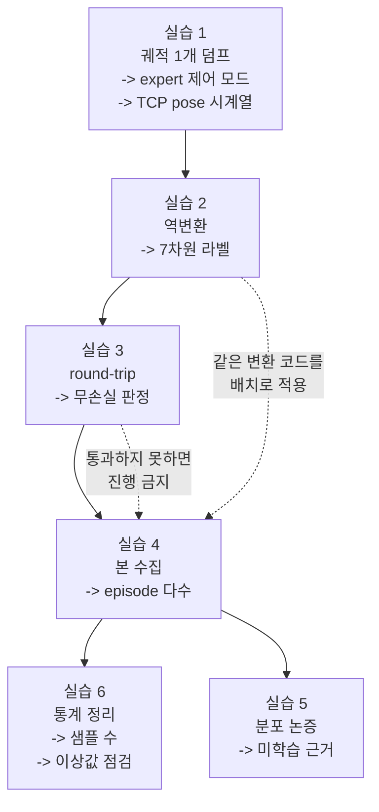

# Week 1 실습: expert 확보 -> 역변환 -> round-trip -> 데이터 수집


> **실습 목표**: expert 궤적을 OpenVLA 표현으로 무손실 변환해 학습 데이터셋 1벌을 만든다.
> **예상 시간**: 8-10시간
> **원칙**: 실습 4 (본 수집) 는 실습 3 (round-trip 검증) 을 통과한 뒤에만 한다. 변환이 틀린 채로 수집하면 라벨 전체에 계통 오차가 실린다.


### 이 문서를 읽는 법


- 각 실습은 **무엇을 하나 / 왜 하나 / 끝나면 손에 남는 것** 세 줄로 시작한다. 손을 대기 전에 이 세 줄만 먼저 읽고 지금 무슨 목적의 작업인지 잡는다.
- `README.md` 는 **개념**(왜 이런 구조인가), 이 문서는 **절차**(무엇을 타이핑하고 무엇을 확인하는가) 다. 개념이 흔들리면 각 절에 붙은 README § 번호로 돌아간다.
- 코드에 `<- 교체` 나 `<- 위 한 줄을 구현해 교체` 로 비워 둔 자리가 있다. 그 자리를 채우는 것이 이번 주의 이해 검증이므로, 채워진 코드를 기대하지 말고 직접 채운다.


---


## 0. 이번 주 전체 그림


### 0.1 한 문장으로


> week0 에서 만든 sim 안에서 **정답을 아는 프로그램**에게 큐브 집기를 100번쯤 시키고, 매 스텝의 카메라 사진과 그때의 손 끝 움직임을 짝지어 저장한다. 단 손 끝 움직임을 **OpenVLA 가 쓰는 표현**(EEF delta + RPY + gripper, 원시 물리 단위) 으로 번역해서 저장한다.


이번 주의 어려움은 수집이 아니다. 수집 루프는 week0 실습 3 의 random action 루프와 거의 같다. 어려움은 **번역이 맞았는지 확인하는 것**이다. 번역이 틀려도 파일은 정상적으로 쌓이고, 다음 주 학습도 정상적으로 돌고, loss 도 내려간다. 결과만 조용히 틀린다. 실습 3 이 그것을 막는 유일한 관문이다.


### 0.2 6개 실습이 이어지는 방식


앞 실습의 출력이 뒤 실습의 입력이 된다. 특히 실습 1 -> 2 -> 3 은 한 궤적을 놓고 만들고 검증하는 한 묶음이고, 실습 4 에서야 규모를 만든다.





점선 하나가 이번 주의 핵심 제약이다. 실습 3 을 통과하기 전에 실습 4 를 하면, 틀린 라벨로 만든 데이터셋을 나중에 전량 버리게 된다.


### 0.3 자주 걸리는 용어 미리 풀기


| 용어 | 뜻 |
|---|---|
| **expert** | 정답 라벨을 만들어 주는 주체. 여기서는 week0 상한 대조에 쓴 기성 해법 |
| **motion planning** | 물체 좌표를 직접 읽어 경로를 계산하는 고전 방식. 카메라를 안 보고 푼다 |
| **궤적**(trajectory) | 한 episode 동안의 (관측, action, pose) 시계열 전체 |
| **덤프**(dump) | 메모리에 있는 데이터를 그대로 파일로 쏟아 저장하는 것 |
| **control_mode** | 내가 준 숫자를 로봇에게 어떻게 해석시킬지 정하는 설정. 관절 각도인지 손 끝 변화량인지 |
| **TCP**(tool center point) | 그리퍼 두 손가락 사이 기준점. 실질적으로 "손 끝 좌표" |
| **pose** | 위치(3) + 방향(회전) 을 합친 자세 |
| **쿼터니언**(quaternion) | 회전을 4개 숫자로 표현하는 방식. sim 내부가 주로 이 형식을 쓴다 |
| **RPY** | 회전을 축 순서대로 세 번 돌려 3개 숫자로 표현하는 오일러각 |
| **차분**(difference) | 연속한 두 값의 차이. `pose[t+1] - pose[t]` 가 그 스텝의 delta 다 |
| **역변환** | week0 의 "OpenVLA -> ManiSkill" 번역을 반대 방향으로 적용 |
| **정변환** | week0 에서 만든 원래 방향의 번역 |
| **round-trip** | 역변환 -> 정변환 -> 재생으로 원래 궤적이 복원되는지 보는 왕복 검사 |
| **계통 오차** | 모든 샘플에 같은 방향으로 실리는 편향. 평균해도 사라지지 않는다 |
| **npz** | numpy 배열 여러 개를 한 파일에 묶어 저장하는 형식 |
| **seed** | 무작위 초기 배치를 정하는 정수. seed 하나 = 문제 한 개 |
| **leakage** | 평가용 조건이 학습에 섞여 성적이 실력보다 좋게 나오는 오염 |
| **히스토그램** | 값의 분포를 구간별 개수로 그린 막대 그림. 이상값을 눈으로 잡는 데 쓴다 |


### 0.4 파일을 어디 두고 어디서 실행하나


스크립트는 `week1/` 바로 아래에 두고, 터미널의 현재 위치(cwd)도 `week1` 로 두고 실행한다. 이 문서의 모든 `outputs/...` 경로가 그 기준이다. `outputs/` 는 gitignore 대상이므로 **코드는 그 안에 두지 않는다.**


---


## 환경 설정


week0 의 sim venv 를 그대로 쓴다. 새로 만들지 않는다 (환경이 바뀌면 week0 데이터와 이번 주 데이터가 다른 환경 산출물이 된다 — 나중에 "같은 조건에서 모았다"는 주장을 할 수 없게 된다).


```bash
cd "/workspace/study/physical-ai-study/Studies/Phase 4.5"
source .venv-sim/bin/activate                  # week0 에서 만든 venv
mkdir -p week1/outputs/dataset                 # 수집 데이터 착지점 (outputs/ 는 gitignore)
cd week1
```


week0 산출물 4개가 있는지 먼저 확인한다 (README "시작하기 전에"). `action_contract.md` 가 비어 있으면 이번 주는 전부 추측이 되므로 week0 실습 4 로 돌아간다.


---


## 실습 1: expert 확보 + 궤적 1개 덤프


**무엇을 하나**: week0 실습 5 에서 쓴 기성 해법을 다시 불러, 큐브 집기 1회를 돌리면서 매 스텝의 카메라 이미지 / action / 손 끝 pose 를 파일로 남긴다.
**왜 하나**: 라벨 변환 규칙을 만들기 전에 **원재료가 어떤 형태로 나오는지** 알아야 한다. 특히 expert 가 관절 각도로 움직이는지 손 끝 변화량으로 움직이는지에 따라 실습 2 의 출발점이 달라진다.
**끝나면 손에 남는 것**: `outputs/expert_traj.npz` (궤적 1개) + `outputs/expert_facts.md` (expert 의 제어 모드와 action 의 의미).


**파일명**: `practice_expert_dump.py`


week0 실습 5 에서 상한 대조에 쓴 기성 해법이 이번 주의 expert 다. 먼저 **그 해법이 어느 제어 모드로 동작하는지** 확인해야 한다 — 그것이 역변환의 출발점을 결정한다.


### 왜 TCP pose 를 따로 기록하나


expert 가 관절 공간(`pd_joint_pos`) 으로 움직이면, expert 가 낸 action 은 "1번 관절을 몇 라디안" 같은 값이다. 우리가 필요한 라벨은 "손 끝을 어느 방향으로 몇 미터" 이므로 그 값은 직접 쓸 수 없다.


우회로가 **TCP pose 기록**이다. 매 스텝의 손 끝 좌표를 남겨 두면, 연속한 두 좌표의 차이가 그 스텝의 EEF delta 가 된다. 관절을 어떻게 돌렸는지는 몰라도 손 끝이 어디서 어디로 갔는지는 알 수 있으므로, **expert 의 제어 모드와 무관하게 EEF 표현을 얻는다.**


```python
"""
실습 1: expert 궤적 1개를 덤프하고 제어 모드를 확인
"""
import json                                    # 메타 저장
import numpy as np                             # 배열 저장
import gymnasium as gym
import mani_skill.envs
from PIL import Image                          # 관측 이미지 저장


ENV_ID = "PickCube-v1"                         # <- week0 sim_facts.md 확정값
STEP_CAP = 100                                 # <- week0 sim_facts.md 확정값
DUMP_SEED = 100                                # eval seed(0-19) 와 겹치지 않는 값으로 고른다


print("=" * 60)
print("실습 1: expert 궤적 덤프")
print("=" * 60)


# -- 1-1. expert 가 쓰는 제어 모드 확인 (역변환의 출발점) --
# week0 실습 5 에서 찾은 해법 스크립트를 열어 아래 두 가지를 확인한다:
#   (a) env 를 어떤 control_mode 로 생성하는가 (관절 공간인가 EEF 공간인가)
#   (b) action 을 어떤 형태로 만들어 step 에 넣는가
# 확인 결과를 outputs/expert_facts.md 에 적고, 아래 EXPERT_CONTROL_MODE 를 채운다.
EXPERT_CONTROL_MODE = "pd_joint_pos"           # <- 실제 확인값으로 교체


# -- 1-2. env 생성 (expert 의 제어 모드로) --
# 주의: 여기서는 expert 의 모드를 쓴다. week0 의 pd_ee_delta_pose 와 다를 수 있다.
env = gym.make(ENV_ID, obs_mode="rgb", control_mode=EXPERT_CONTROL_MODE)
obs, info = env.reset(seed=DUMP_SEED)          # 고정 seed 로 재현 가능하게
print("control mode:", env.unwrapped.control_mode)


# -- 1-3. 궤적 수집 (매 스텝의 관측·action·TCP pose 를 함께 남긴다) --
# TCP pose 를 남기는 이유: expert 가 관절 공간으로 움직여도, 연속한 TCP pose 의 차이를
# 계산하면 EEF delta 를 얻을 수 있다. 즉 제어 모드가 무엇이든 EEF 표현으로 갈 수 있다.
frames = []                                    # 관측 이미지
actions = []                                   # expert 가 낸 원본 action
tcp_poses = []                                 # 매 스텝의 end-effector pose
success = False


for step in range(STEP_CAP):
    # (a) 관측 이미지 추출 — 키 경로는 week0 sim_facts.md 의 확정값
    frame = np.asarray(obs["sensor_data"]["base_camera"]["rgb"])   # <- 실제 경로로 교체
    if frame.ndim == 4:                        # 배치 차원이 있으면 첫 장만
        frame = frame[0]
    frames.append(frame.astype(np.uint8))

    # (b) 현재 TCP pose 기록 (접근 경로는 week0 sim_facts.md 의 상태 접근 경로)
    tcp_poses.append(np.asarray(env.unwrapped.agent.tcp.pose.raw_pose).reshape(-1))  # <- 교체

    # (c) expert action 획득 — week0 실습 5 해법의 호출 방식에 맞춘다
    # action = <expert 가 이 상태에서 낼 action>
    action = env.action_space.sample()         # <- 위 한 줄을 구현해 교체 (지금은 자리표시)
    actions.append(np.asarray(action).reshape(-1))

    # (d) 실행
    obs, reward, terminated, truncated, info = env.step(action)
    if info.get("success", False):             # 성공하면 종료
        success = True
        break
    if terminated or truncated:
        break


env.close()
print(f"수집 스텝: {len(actions)}, success: {success}")


# -- 1-4. 저장 (이미지는 png, 나머지는 npz + json) --
np.savez("outputs/expert_traj.npz",
         frames=np.stack(frames),              # (T, H, W, 3)
         actions=np.stack(actions),            # (T, action_dim)
         tcp_poses=np.stack(tcp_poses))        # (T, pose_dim)
Image.fromarray(frames[0]).save("outputs/expert_traj_first.png")   # 눈으로 장면 확인용
with open("outputs/expert_traj_meta.json", "w") as f:
    json.dump({"env_id": ENV_ID, "seed": DUMP_SEED, "steps": len(actions),
               "control_mode": EXPERT_CONTROL_MODE, "success": bool(success)}, f, indent=2)
print("저장 완료: outputs/expert_traj.npz")
```


코드에서 낯선 부분을 풀어 둔다.


- `np.savez`: numpy 배열 여러 개를 한 파일(`.npz`)에 이름을 붙여 저장한다. 나중에 `np.load(path)["frames"]` 처럼 이름으로 꺼낸다.
- `np.stack(frames)`: 이미지 여러 장의 리스트를 `(T, H, W, 3)` 모양의 한 배열로 쌓는다. `T` 는 스텝 수다.
- `.reshape(-1)`: 배열을 1차원으로 펴는 것. ManiSkill 은 환경 개수 차원을 붙여 `(1, 7)` 로 주므로, 펴서 `(7,)` 로 만들어 저장을 단순하게 한다.
- `frame.ndim == 4`: 위와 같은 이유다. 환경이 1개여도 `(1, H, W, 3)` 으로 오므로 첫 장을 꺼낸다.
- `DUMP_SEED = 100`: eval 전용으로 예약된 `0-19` 를 피한 값이다. 여기서 실수로 eval seed 를 쓰면 이 궤적이 그대로 학습에 들어가 leakage 가 된다 (README §4).


**기록할 것** (`outputs/expert_facts.md`)

| 항목 | 확정값 | 출처 |
|---|---|---|
| expert 종류 (motion planning / scripted / 데모 데이터) | | week0 실습 5 |
| expert 의 control_mode | | 1-1 확인 |
| action 차원과 의미 | | 1-1 + `env.action_space` |
| TCP pose 접근 경로 | | week0 `sim_facts.md` |
| expert 성공 여부 (이 seed) | | 1-3 출력 |


> expert 가 실패하면 데이터 생성기로 쓸 수 없다. week0 상한 대조에서 높은 성공률을 확인했는데 여기서 실패하면, 조건 (env id / control_mode / step cap) 이 그때와 달라진 것이다. 세 값을 week0 기록과 한 줄씩 대조한다.


---


## 실습 2: action 표현 역변환


**무엇을 하나**: 실습 1 이 남긴 TCP pose 시계열에서 "위치 변화 3개 + 회전 변화 3개 + gripper 1개" 를 계산해, OpenVLA 표현의 7차원 라벨을 만든다.
**왜 하나**: 학습의 정답은 **모델이 낼 수 있는 형식**이어야 한다. expert 가 낸 값을 그대로 쓰면 모델은 자기가 만들 수 없는 숫자를 정답으로 배운다 (README §2).
**끝나면 손에 남는 것**: `outputs/openvla_actions.npy` — `(T-1, 7)` 모양의 라벨 배열.


**파일명**: `practice_inverse_transform.py`


expert 의 action 을 **OpenVLA 가 내놓는 표현**으로 바꾼다. week0 계약 표를 반대 방향으로 읽는 작업이다.


핵심 아이디어: expert 의 원본 action 을 직접 변환하려 하지 말고, **연속한 TCP pose 의 차이**에서 EEF delta 를 만든다. 그러면 expert 의 제어 모드와 무관하게 EEF 표현을 얻는다.


### 왜 라벨 개수가 스텝 수보다 1 적은가


delta 는 "t 에서 t+1 로 가는 변화" 다. 스텝이 `T` 개면 변화는 `T-1` 개다. 마지막 프레임에는 대응하는 다음 프레임이 없으므로 라벨을 만들 수 없다.


이 1의 차이가 다음 주 포맷 변환에서 자주 사고를 낸다. 이미지 `T` 장과 라벨 `T-1` 개를 그냥 짝지으면 **한 칸씩 밀린 라벨**이 되고, 모델은 "다음 화면에서 할 동작"을 "지금 화면의 정답"으로 배운다. 예외는 나지 않는다. week2 빌더에서 관측을 마지막 한 장 잘라 길이를 맞추는 이유가 이것이다.


```python
"""
실습 2: TCP pose 궤적에서 OpenVLA 표현의 action 을 만든다
"""
import numpy as np


data = np.load("outputs/expert_traj.npz")      # 실습 1 산출물
tcp_poses = data["tcp_poses"]                  # (T, pose_dim) — 위치 + 회전
expert_actions = data["actions"]               # (T, action_dim) — gripper 성분 추출용


print("=" * 60)
print("실습 2: 역변환")
print("=" * 60)
print("tcp_poses shape:", tcp_poses.shape)     # pose 표현이 무엇인지 먼저 확인
print("첫 pose:", tcp_poses[0])                # 위치 3 + 쿼터니언 4 인지 등을 눈으로 확인


# -- 2-1. 위치 델타 (연속 pose 의 차분) --
# pose 배열에서 위치 3개가 어느 인덱스인지 위 출력으로 확인해 슬라이스를 맞춘다.
positions = tcp_poses[:, 0:3]                  # <- 실제 인덱스로 교체
delta_position = np.diff(positions, axis=0)    # (T-1, 3) — 스텝 t 의 action 은 t -> t+1 변화


# -- 2-2. 회전 델타 --
# 학습 라벨의 회전 표현은 오일러각(RPY)으로 고정돼 있다 -- OpenVLA 학습 파이프라인의
# action 인코딩이 "EEF delta XYZ(3) + RPY(3) + gripper(1)" 로 정의돼 있기 때문이다
# (week2 에서 확인한다). 즉 여기서 축-각을 쓰면 안 된다.
# 쿼터니언으로 들어오면: 상대 회전 = inverse(q_t) * q_{t+1} 을 구한 뒤 RPY 로 변환한다.
# delta_rotation = <상대 회전을 RPY 로 변환>
delta_rotation = np.zeros_like(delta_position)  # <- 위 한 줄을 구현해 교체


# -- 2-3. gripper 성분 --
# week0 계약 표 5번 행(부호 규약)대로 expert action 의 gripper 성분을
# OpenVLA 규약의 값으로 바꾼다. 부호가 반대일 수 있다.
# gripper = <계약 표 5번 행의 규칙대로 변환>
gripper = np.zeros((len(delta_position), 1))    # <- 위 한 줄을 구현해 교체


# -- 2-4. 단위 정합 (계약 표 1번 행) --
# 라벨은 정규화하지 않고 원시 물리 단위(미터·라디안)로 저장한다.
# 정규화는 week2 의 학습 파이프라인이 데이터셋 통계로 자동 수행하므로, 여기서 미리
# [-1, 1] 로 맞추면 이중 정규화가 되어 라벨이 망가진다.
# 아래 스케일은 '정규화' 가 아니라 '단위 환산' 용이다 (예: sim 이 mm 단위면 0.001).
SCALE_POSITION = 1.0                            # <- 단위가 이미 미터면 1.0 그대로
SCALE_ROTATION = 1.0                            # <- 단위가 이미 라디안이면 1.0 그대로


# -- 2-5. 7차원으로 합치기 --
openvla_actions = np.concatenate([
    delta_position * SCALE_POSITION,            # dx, dy, dz
    delta_rotation * SCALE_ROTATION,            # 회전 3차원
    gripper,                                    # gripper 1차원
], axis=1)
print("openvla_actions shape:", openvla_actions.shape)   # (T-1, 7) 이어야 한다
print("차원별 범위:")
for dim in range(openvla_actions.shape[1]):     # 각 차원의 최소/최대를 본다
    column = openvla_actions[:, dim]
    print(f"   dim{dim}: min={column.min():+.4f} max={column.max():+.4f}")


np.save("outputs/openvla_actions.npy", openvla_actions)
print("저장 완료: outputs/openvla_actions.npy")
```


코드의 낯선 부분:


- `np.diff(positions, axis=0)`: 행 방향으로 연속한 값의 차이를 구한다. 결과 길이가 하나 줄어드는 것이 위에서 설명한 `T-1` 이다.
- `inverse(q_t) * q_{t+1}`: 쿼터니언 곱은 "회전을 이어 붙이는" 연산이다. 앞 회전의 역을 곱하면 "t 에서 t+1 로 가는 데 필요한 회전만" 남는다. 이것이 상대 회전이고, 그것을 RPY 3개 숫자로 바꿔 저장한다.
- `np.concatenate([...], axis=1)`: 열 방향으로 이어 붙여 `(T-1, 3) + (T-1, 3) + (T-1, 1)` 을 `(T-1, 7)` 로 만든다.
- `SCALE_*` 이 `1.0` 인 이유: 이 값은 **정규화 계수가 아니라 단위 환산 계수**다. sim 이 이미 미터·라디안을 쓰면 곱할 것이 없다. 여기에 `1/0.1` 같은 정규화 계수를 넣으면 이중 정규화가 된다 (README §2).


**확인 포인트**

- 차원별 범위가 week0 실습 4 에서 본 OpenVLA 통계의 대역과 비슷한가. 자릿수가 다르면 스케일 정합이 틀렸다 (예: 통계가 ±0.04 대역인데 내 라벨이 ±4 면 100배 어긋난 것이다)
- gripper 차원이 0 과 1 (또는 계약 표가 정한 두 값) 근처에만 있는가. 중간값이 잔뜩 있으면 성분을 잘못 뽑았다 — gripper 는 열림/닫힘 두 상태에 가까운 신호이므로 연속적으로 퍼져 있으면 다른 차원을 집은 것이다
- 위치 3차원이 0 근처에 몰려 있는가. 한 스텝의 이동은 원래 작다 (수 mm - 수 cm). 값이 크면 차분이 아니라 절대 좌표를 저장한 것이다


---


## 실습 3: round-trip 검증


**무엇을 하나**: 실습 2 가 만든 라벨을 week0 의 정변환으로 되돌려 env 에 다시 넣고, 팔이 원래와 같은 궤적을 그리는지 숫자로 비교한다.
**왜 하나**: 라벨이 맞았는지 눈으로는 알 수 없다. 회전 표현이나 프레임이 틀려도 델타가 작으면 값이 그럴싸해 보인다 (week0 §6). 왕복 재생이 그것을 잡는 유일한 수단이다.
**끝나면 손에 남는 것**: `outputs/roundtrip_check.md` — 강한/약한 기준 판정과 그 허용 오차를 그 값으로 정한 근거.


**파일명**: `practice_roundtrip.py`


역변환한 action 을 week0 의 **정변환**으로 되돌려 env 에 재생하고, 원래 궤적과 비교한다. 이 검증을 통과하기 전에는 본 수집을 하지 않는다.


### 두 기준이 각각 무엇을 보는가


| 기준 | 보는 것 | 통과의 의미 |
|---|---|---|
| 강한 기준 | 스텝별 손 끝 위치가 원래 궤적과 얼마나 벌어지는가 | 번역이 정보를 잃지 않았다 |
| 약한 기준 | 재생한 episode 도 task 를 달성하는가 | 궤적이 조금 달라도 결과는 같다 |


강한 기준이 필요한 이유는, 약한 기준만 보면 "조금씩 다르게 적히는 라벨" 을 통과시키기 때문이다. task 가 쉬우면 라벨이 5% 틀려도 성공한다. 그 5% 는 모든 샘플에 같은 방향으로 실리는 **계통 오차**이고, 평균으로 사라지지 않는다.


```python
"""
실습 3: 역변환 -> 정변환 -> 재생. 원래 궤적과 일치하는지 판정
"""
import numpy as np
import gymnasium as gym
import mani_skill.envs


ENV_ID = "PickCube-v1"                          # <- 확정값
DUMP_SEED = 100                                 # 실습 1 과 같은 seed
STRONG_TOL = 1e-3                               # 강한 기준: pose 차이 허용 오차 (m) — 근거를 적을 것


print("=" * 60)
print("실습 3: round-trip 검증")
print("=" * 60)


openvla_actions = np.load("outputs/openvla_actions.npy")   # 실습 2 산출물
original = np.load("outputs/expert_traj.npz")["tcp_poses"] # 실습 1 의 원래 궤적


# -- 3-1. 정변환 함수는 week0 것을 그대로 쓴다 --
# week0 실습 6 의 (c) 단계 변환 코드를 import 하거나 같은 규칙으로 옮겨 온다.
# 두 곳에 따로 쓰면 반드시 어긋난다 -- 한 곳에 두고 양쪽에서 부른다.
# def to_maniskill(action_7d): ... (week0 코드)


# -- 3-2. OpenVLA 표현으로 재생 (week0 과 같은 control_mode 를 쓴다) --
env = gym.make(ENV_ID, obs_mode="rgb", control_mode="pd_ee_delta_pose")
obs, info = env.reset(seed=DUMP_SEED)           # 같은 seed -> 같은 초기 배치
replay_poses = []                               # 재생 궤적의 TCP pose
success = False


for action_7d in openvla_actions:               # 역변환 결과를 순서대로
    replay_poses.append(np.asarray(env.unwrapped.agent.tcp.pose.raw_pose).reshape(-1))  # <- 교체
    # action = to_maniskill(action_7d)          # <- 3-1 의 정변환 적용
    action = action_7d                          # <- 위 한 줄로 교체
    obs, reward, terminated, truncated, info = env.step(action)
    if info.get("success", False):
        success = True
        break
    if terminated or truncated:
        break


env.close()
replay_poses = np.stack(replay_poses)


# -- 3-3. 강한 기준: 스텝별 pose 차이 --
compare_len = min(len(replay_poses), len(original))       # 길이가 다르면 짧은 쪽까지 비교
position_error = np.linalg.norm(
    replay_poses[:compare_len, 0:3] - original[:compare_len, 0:3], axis=1)   # <- 위치 인덱스 교체
print(f"\n비교 스텝 수: {compare_len} (재생 {len(replay_poses)} / 원본 {len(original)})")
print(f"위치 오차 mean={position_error.mean():.6f} max={position_error.max():.6f} m")
print(f"강한 기준(max < {STRONG_TOL}): {'통과' if position_error.max() < STRONG_TOL else '실패'}")


# -- 3-4. 약한 기준: 재생도 task 를 달성하는가 --
print(f"약한 기준(success): {'통과' if success else '실패'}")
```


코드의 낯선 부분:


- `np.linalg.norm(..., axis=1)`: 각 행(스텝) 의 3차원 차이 벡터의 길이를 구한다. 즉 스텝별 "몇 미터 벌어졌는가" 를 미터 단위 하나의 숫자로 만든다.
- `STRONG_TOL = 1e-3`: 1mm 다. 이 값을 얼마로 둘지는 판단이므로 **근거를 함께 적는다** — sim 의 수치 정밀도, 컨트롤러가 목표를 추종하는 오차, 큐브 크기 대비 허용 오차 중 무엇을 기준으로 삼았는지.
- 재생 길이가 원본보다 짧아질 수 있다: 재생 중 환경이 먼저 끝나면 `break` 된다. 그래서 짧은 쪽까지만 비교한다.


**판정과 분기**

| 강한 기준 | 약한 기준 | 판정 | 다음 행동 |
|:---:|:---:|---|---|
| 통과 | 통과 | 변환 무손실 | 실습 4 로 진행 |
| 실패 | 통과 | **정보를 잃고 있다** | 실습 2 로 복귀. 회전 표현·프레임을 먼저 의심 |
| 실패 | 실패 | 변환이 틀렸다 | week0 계약 표(실습 4)로 복귀 |
| 통과 | 실패 | 모순 — 비교 인덱스나 재생 조건이 잘못됐다 | 3-3 의 슬라이스와 seed 를 확인 |


마지막 줄이 왜 모순인지: 궤적이 mm 단위로 일치한다면 원본이 성공한 궤적이므로 재생도 성공해야 한다. 그런데 성공하지 않았다면 비교 대상이 잘못됐을 가능성이 높다 (예: 위치 인덱스를 잘못 잘라 실제로는 다른 값을 비교했거나, seed 가 달라 초기 배치가 다르다).


결과와 판정을 `outputs/roundtrip_check.md` 에 남긴다. `STRONG_TOL` 을 그 값으로 정한 근거도 함께 적는다. 이 파일은 week6 의 "배제된 후보" 표에서 **라벨 변환 손실을 배제하는 근거**로 인용된다.


---


## 실습 4: seed 분할 + 본 수집


**무엇을 하나**: eval 전용 seed 와 겹치지 않는 학습 seed 목록을 코드로 만들고, 그 seed 들로 expert 를 반복 실행해 episode 를 파일로 쌓는다.
**왜 하나**: 규모를 만드는 단계다. 그리고 이 단계에서 seed 가 겹치면 이후 모든 before/after 비교가 무효가 되므로, 겹침 검사를 사람 눈이 아니라 코드에 맡긴다.
**끝나면 손에 남는 것**: `outputs/dataset/ep*.npz` + `outputs/dataset/collect_meta.json` (seed 목록, 규모, expert 성공률).


**파일명**: `practice_collect.py`


eval seed 와의 겹침을 **코드로** 막은 뒤 수집한다.


```python
"""
실습 4: eval seed 를 배제하고 학습 데이터를 수집
"""
import json
import numpy as np
import gymnasium as gym
import mani_skill.envs


ENV_ID = "PickCube-v1"                          # <- 확정값
STEP_CAP = 100                                  # <- 확정값
EXPERT_CONTROL_MODE = "pd_joint_pos"            # <- 실습 1 확정값
N_EPISODES = 100                                # <- README §6 의 3방향 근거로 정한 값


print("=" * 60)
print("실습 4: 데이터 수집")
print("=" * 60)


# -- 4-1. eval seed 를 week0 산출물에서 읽는다 (손으로 옮겨 적지 않는다) --
with open("../week0/outputs/zeroshot_baseline.json") as f:
    eval_seeds = set(json.load(f)["seeds"])     # before/after 공용 -> 학습 금지
print(f"eval seed {len(eval_seeds)}개 예약됨: {sorted(eval_seeds)}")


# -- 4-2. 학습 seed 생성 + 겹침 검사 (사람이 범위를 관리하면 반드시 한 번 겹친다) --
train_seeds = [seed for seed in range(1000, 1000 + N_EPISODES * 2)
               if seed not in eval_seeds][:N_EPISODES]     # eval 을 제외하고 앞에서 N개
assert not (set(train_seeds) & eval_seeds), "학습 seed 에 eval seed 가 섞였다"
print(f"학습 seed {len(train_seeds)}개, 겹침 0 확인")


# -- 4-3. 수집 루프 --
env = gym.make(ENV_ID, obs_mode="rgb", control_mode=EXPERT_CONTROL_MODE)
episode_index = 0                               # 저장 파일 번호
success_count = 0                               # expert 성공률 통계용


for seed in train_seeds:
    obs, info = env.reset(seed=seed)
    frames, actions, tcp_poses = [], [], []
    success = False
    for step in range(STEP_CAP):
        frame = np.asarray(obs["sensor_data"]["base_camera"]["rgb"])   # <- 실제 경로로 교체
        if frame.ndim == 4:
            frame = frame[0]
        frames.append(frame.astype(np.uint8))
        tcp_poses.append(np.asarray(env.unwrapped.agent.tcp.pose.raw_pose).reshape(-1))  # <- 교체
        # action = <실습 1 의 expert 호출>
        action = env.action_space.sample()      # <- 위 한 줄을 구현해 교체
        actions.append(np.asarray(action).reshape(-1))
        obs, reward, terminated, truncated, info = env.step(action)
        if info.get("success", False):
            success = True
            break
        if terminated or truncated:
            break

    success_count += int(success)
    # 실패 episode 는 학습에 넣지 않되 통계에는 남긴다 (README §7)
    if success:
        np.savez(f"outputs/dataset/ep{episode_index:04d}.npz",
                 frames=np.stack(frames),
                 actions=np.stack(actions),
                 tcp_poses=np.stack(tcp_poses),
                 seed=seed)                     # seed 를 데이터에 박아 둔다 (재현·검증용)
        episode_index += 1
    print(f"   seed{seed}: success={success} steps={len(actions)}")


env.close()


# -- 4-4. 수집 메타 저장 --
with open("outputs/dataset/collect_meta.json", "w") as f:
    json.dump({"env_id": ENV_ID, "control_mode": EXPERT_CONTROL_MODE,
               "step_cap": STEP_CAP, "train_seeds": train_seeds,
               "eval_seeds_excluded": sorted(eval_seeds),
               "episodes_saved": episode_index,
               "expert_success_rate": success_count / len(train_seeds),
               "instruction": "pick up the cube"}, f, indent=2)
print(f"\n저장 episode: {episode_index} / expert 성공률: {success_count}/{len(train_seeds)}")
```


코드의 낯선 부분:


- `set(...) & eval_seeds`: 파이썬 집합의 교집합이다. 결과가 비어 있지 않으면 겹쳤다는 뜻이므로 `assert` 가 그 자리에서 프로그램을 멈춘다. **주석으로 "겹치지 않게 주의" 라고 적는 것과 assert 로 멈추는 것의 차이가 이번 주의 안전장치다.**
- `range(1000, 1000 + N_EPISODES * 2)`: 필요한 개수의 2배 범위를 훑어 eval seed 를 걸러낸 뒤 앞에서 N개만 쓴다. 여유를 두는 이유는 걸러내는 과정에서 개수가 부족해지지 않도록 하기 위해서다.
- `seed=seed` 를 npz 에 함께 저장: 파일 이름만으로는 어느 seed 였는지 나중에 알 수 없다. 데이터 안에 박아 두면 실습 6 의 오염 재검사와 재현이 가능해진다.
- `episode_index` 와 `seed` 가 다른 값인 이유: 실패한 episode 는 저장하지 않으므로 파일 번호가 seed 와 어긋난다. 두 값을 혼동하면 "몇 번 파일이 어느 문제였는지" 를 잃는다.


> 수집이 끝나면 **역변환을 배치로 적용**해 OpenVLA 표현 action 을 각 episode 에 붙인다 (실습 2 코드를 episode 루프로 감싼다). 라벨은 week2 포맷 변환의 입력이다. 이때 실습 2 와 **같은 함수**를 부른다 — 복사해 고치면 검증한 것과 다른 코드로 라벨을 만드는 셈이 된다.


---


## 실습 5: 미학습 분포 3단 논증


**무엇을 하나**: OpenVLA 가 학습에 쓴 데이터셋 목록을 모델에서 직접 꺼내 보고, 내 데이터가 그와 어느 층에서 겹치고 어느 층에서 겹치지 않는지 판정해 문서로 적는다.
**왜 하나**: "모델이 모르는 것을 가르쳤다" 가 이 Phase 의 전제다. 그 전제를 근거 있게 진술하지 못하면 adaptation 의 의미 자체를 주장할 수 없다 (README §5).
**끝나면 손에 남는 것**: `outputs/distribution_check.md` — 3층 판정 + 각 층의 근거와 한계.


**산출물**: `outputs/distribution_check.md`


README §5 의 3층을 각각 판정해 적는다. 조사에 쓸 명령은 아래와 같고, **결론 문장은 본인이 쓴다.**


아래 코드는 OpenVLA 모델을 로드해 `norm_stats` 의 키 목록을 본다. `norm_stats` 는 "각 학습 데이터셋의 action 분포 통계" 이므로, **여기에 이름이 있는 데이터셋 = 학습에 쓰인 데이터셋**이다. 즉 모델 카드 문서를 읽는 대신 모델 자신에게 물어보는 방법이다.


```python
"""
실습 5: OpenVLA 사전학습 데이터셋 목록을 확인 (.venv-vla 에서 실행)
"""
import torch
from transformers import AutoModelForVision2Seq, BitsAndBytesConfig


bnb_config = BitsAndBytesConfig(load_in_4bit=True, bnb_4bit_quant_type="nf4",
                                bnb_4bit_use_double_quant=True,
                                bnb_4bit_compute_dtype=torch.float16)
vla = AutoModelForVision2Seq.from_pretrained("openvla/openvla-7b",
                                             attn_implementation="eager",
                                             torch_dtype=torch.float16,
                                             low_cpu_mem_usage=True,
                                             trust_remote_code=True,
                                             quantization_config=bnb_config)


# 학습에 쓰인 데이터셋 이름 목록 (통계가 있는 데이터셋 = 학습에 쓰인 데이터셋)
names = sorted(vla.norm_stats.keys())
print(f"\n데이터셋 {len(names)}개")
for name in names:
    print("  ", name)


# 이름에 sim / franka 가 들어가는 항목을 추려 본다 (이름만으로 단정하지 말고 단서로만)
print("\nsim 관련 후보:", [n for n in names if "sim" in n.lower()])
print("franka 관련 후보:", [n for n in names if "franka" in n.lower()])
```


마지막 두 줄에 "이름만으로 단정하지 말라" 는 주의가 붙은 이유: 데이터셋 이름에 로봇 종류가 들어가지 않는 경우가 흔하다. 이름 검색은 후보를 좁히는 단서일 뿐이고, 실제 판정은 각 데이터셋이 어떤 로봇·어떤 환경에서 수집됐는지를 확인해야 한다.


작성할 표 (`outputs/distribution_check.md`):


| 층 | 판정 | 근거 | 한계 |
|---|---|---|---|
| embodiment | | 위 목록 + 각 데이터셋의 로봇 확인 | |
| 시각 도메인 | | 렌더 이미지 vs 실사 영상 | |
| task·물체·지시문 | | 목록의 task 성격 | |
| (간접) zero-shot 성적 | | week0 baseline 결과 | **week0 하네스 검증 통과가 선행 조건** |


마지막 행의 한계를 반드시 적는다 — 검증 없이 낮은 성공률을 증거로 쓰면 변환 버그를 분포 차이로 오독하게 된다. 즉 "모델이 이 화면을 모른다" 고 적었는데 실제로는 "내가 action 을 잘못 번역했다" 였을 수 있다.


---


## 실습 6: 데이터 통계 정리


**무엇을 하나**: 쌓은 데이터의 총 샘플 수, expert 성공률, seed 오염 여부를 확인하고, action 7차원의 분포를 히스토그램으로 그려 이상값을 눈으로 잡는다.
**왜 하나**: 다음 주 포맷 변환에서 발견하는 이상값은 되돌리는 비용이 크다. 여기서 잡으면 실습 2 를 고쳐 다시 라벨링하면 끝난다.
**끝나면 손에 남는 것**: `outputs/action_hist.png` + 규모가 README §6 의 근거와 맞는지에 대한 판정.


**파일명**: `practice_dataset_stats.py`


```python
"""
실습 6: 수집 데이터의 분포와 메타를 확인
"""
import glob
import json
import numpy as np
import matplotlib.pyplot as plt


files = sorted(glob.glob("outputs/dataset/ep*.npz"))       # 저장된 episode 파일
print(f"episode 파일 {len(files)}개")


# -- 6-1. 샘플 수와 seed 겹침 재확인 --
with open("outputs/dataset/collect_meta.json") as f:
    meta = json.load(f)
seeds_in_files = [int(np.load(path)["seed"]) for path in files]     # 파일에 박아 둔 seed
assert not (set(seeds_in_files) & set(meta["eval_seeds_excluded"])), "eval seed 오염"
total_steps = sum(len(np.load(path)["actions"]) for path in files)  # 학습 샘플 수
print(f"총 스텝(학습 샘플) 수: {total_steps}")
print(f"episode 당 평균 스텝: {total_steps / max(len(files), 1):.1f}")
print(f"expert 성공률: {meta['expert_success_rate']:.2f}")


# -- 6-2. action 차원별 분포 (이상값 조기 발견) --
all_actions = np.concatenate([np.load(path)["openvla_actions"] for path in files])  # <- 키 확인
fig, axes = plt.subplots(1, 7, figsize=(20, 3))            # 7차원을 나란히
for dim in range(7):
    axes[dim].hist(all_actions[:, dim], bins=40)           # 차원별 히스토그램
    axes[dim].set_title(f"dim{dim}")
plt.tight_layout()
plt.savefig("outputs/action_hist.png")
print("저장 완료: outputs/action_hist.png")
```


6-1 의 `assert` 가 두 번째 겹침 검사인 이유: 실습 4 에서 이미 확인했지만, 그 검사는 "생성한 목록" 을 봤고 이것은 **실제로 저장된 파일** 을 본다. 코드를 고치다가 다른 seed 로 돌린 파일이 폴더에 남아 있는 경우를 여기서 잡는다.


**확인 포인트**

- 위치 3차원의 분포가 0 근처에 몰려 있는가 (스텝당 이동은 작다). 한쪽으로 심하게 치우치면 프레임 규약을 다시 본다 — 예를 들어 z 축 델타가 전부 음수면 "항상 내려가기만 했다" 는 뜻이므로, 축 방향이나 부호가 뒤집혔을 수 있다
- gripper 차원이 두 값 근처에만 있는가
- 총 샘플 수가 README §6 에서 정한 목표와 맞는가. 부족하면 episode 를 더 모을지, 규모 근거를 수정할지 판단해 기록


---


## 마무리: 다음 주로 넘기는 것


| 산출물 | week2 에서의 용도 |
|---|---|
| `outputs/dataset/ep*.npz` + `collect_meta.json` | 포맷 변환의 입력 |
| `outputs/roundtrip_check.md` | 라벨 신뢰도의 근거 |
| `outputs/distribution_check.md` | adaptation 의 의미를 주장하는 근거 |
| 역변환 코드 | week2 에서 재사용 — 한 곳에 모아 둔다 |


> 수집 데이터는 용량이 크고 `outputs/` 는 gitignore 대상이다. 커밋하지 않는다. 대신 `collect_meta.json` 의 내용 (seed 목록, 규모, expert 성공률) 을 `Measurements/openvla-maniskill-zeroshot/methodology.md` 에 요약해 남긴다 — 데이터는 재생성 가능하지만 조건은 기록되지 않으면 복구 불가다.
