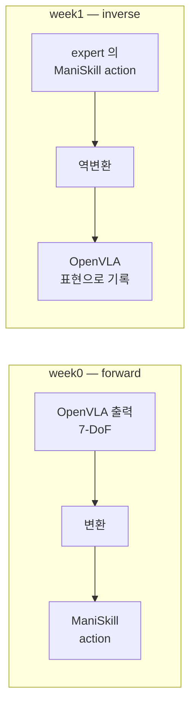
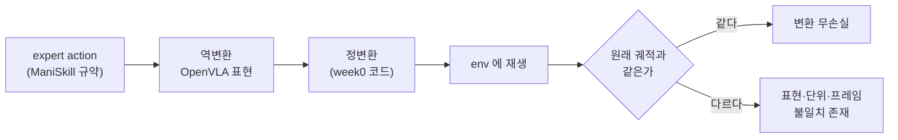

# Week 1 — sim task 정의 + adaptation 데이터 수집


> **이번 주 목표**: week0 에서 세운 sim 루프로 LoRA adaptation 용 (관측, action) 데이터를 수집한다. 핵심은 수집량이 아니라 **action 표현이 OpenVLA 의 출력 표현과 같은지**와 **eval seed 가 학습에 섞이지 않는지**다.
> **예상 시간**: 8-10시간
> **핵심 질문**: "정답 action 은 누가 만드는가? 그리고 그 action 이 OpenVLA 가 내놓는 것과 같은 표현이라는 것을 어떻게 보이는가?"
> **선행**: [week0](../week0/README.md) 완료 — 특히 실습 4 의 action 변환 계약 표, 실습 5 의 기성 해법, 실습 6 의 seed 목록
> **대응 Roadmap**: [`Roadmap/Phase 4.5.md`](../../../Roadmap/Phase%204.5.md) Section 1 주차 1


---


## 이 문서를 읽는 법


- 이 문서는 **개념**(왜 이렇게 하는가), [`PRACTICE.md`](PRACTICE.md) 는 **절차**(무엇을 타이핑하고 무엇을 확인하는가) 다. 실습 중 "왜 이걸 하지?" 가 생기면 각 절에 붙은 § 번호로 돌아온다.
- 처음 나오는 용어는 그 자리에서 한 줄로 풀어 둔다. 그래도 막히면 아래 "미리 풀어 두는 용어" 표로 돌아온다.
- 자체 점검의 답은 문서에 적어 두지 않는다. 답이 적혀 있으면 다음 복습 때 읽고 넘어가게 되고, 그러면 이해했는지 확인할 수단이 사라진다.


## 이번 주를 한 문장으로


> week0 에서 만든 가상 세계 안에서, **정답을 아는 다른 프로그램**(motion planning 같은 고전 해법) 에게 큐브 집기를 여러 번 시키고, 그 장면 사진과 그때 팔이 실제로 한 동작을 짝지어 파일로 쌓는다. 단 그 동작을 **OpenVLA 가 말하는 방식으로 번역해서** 저장한다.


왜 번역이 필요한가를 미리 한 줄로: 다음 주부터 이 파일들로 OpenVLA 를 학습시킨다. 학습이란 "모델이 낸 답"과 "정답"의 차이를 줄이는 것인데, 정답이 모델이 쓸 수 없는 형식으로 적혀 있으면 차이를 계산하는 것 자체가 무의미해진다 (§2).


이번 주의 함정은 수집량이 아니다. **틀린 라벨로 100개를 모으는 것**이다. 라벨이 일관되게 틀려 있으면 학습은 정상적으로 돌고 loss 도 잘 내려간다 — 다만 결과가 조용히 틀린다. 그래서 실습 3 (round-trip 검증) 을 통과하기 전에는 본 수집을 시작하지 않는다.


---


## 학습 순서


| 순서 | 단계 | 파일/자료 | 설명 |
|:----:|------|----------|------|
| 1 | expert 확보 | `PRACTICE.md` 1 | 정답 action 을 만드는 주체를 정하고 궤적 1개를 덤프 |
| 2 | action 표현 역변환 | `PRACTICE.md` 2 | week0 계약 표를 반대 방향으로 적용 |
| 3 | round-trip 검증 | `PRACTICE.md` 3 | 변환이 무손실인지 재생으로 확인 |
| 4 | seed 분할 + 수집 | `PRACTICE.md` 4 | eval seed 예약 후 본 수집 |
| 5 | 미학습 분포 점검 | `PRACTICE.md` 5 | 3단 논증으로 기록 |
| 6 | 데이터 통계 정리 | `PRACTICE.md` 6 | action 분포 + 성공률 + 메타 확인 |
| 7 | 퀴즈 | quiz_easy / quiz_medium | leakage / 표현 정합 / 분포 논증 |


---


## 미리 풀어 두는 용어


아래 절들에서 처음 나오는 자리에 다시 설명하지만, 모르는 단어가 나올 때 돌아올 지점으로 먼저 둔다.


| 용어 | 뜻 |
|---|---|
| **지도학습**(supervised learning) | 입력과 정답을 짝지어 주고, 모델의 답이 정답에 가까워지도록 가중치를 고치는 학습 방식 |
| **라벨**(label) | 학습에서 쓰는 정답. 여기서는 "이 화면에서 팔이 해야 하는 7개 숫자" |
| **expert** | 정답 라벨을 만들어 주는 주체. 사람일 수도, 다른 프로그램일 수도 있다 |
| **motion planning** | 물체 위치를 좌표로 직접 읽어 충돌 없는 경로를 계산해 움직이는 고전 방식. 카메라를 안 보고 정답을 아는 상태로 푼다 |
| **scripted policy** | "내려가서 집고 올린다"를 사람이 손으로 순서대로 코딩한 정책 |
| **teleop**(teleoperation) | 사람이 조작기로 로봇을 직접 원격 조종해 데이터를 만드는 방식 |
| **궤적**(trajectory) | 한 episode 동안의 (상태, action) 시계열 전체 |
| **TCP**(tool center point) | 그리퍼 두 손가락 사이 기준점. 실질적으로 "손 끝의 좌표" |
| **pose** | 위치(3개 숫자) + 방향(회전) 을 합친 자세 정보 |
| **쿼터니언**(quaternion) | 회전을 4개 숫자로 나타내는 표현. 짐벌락이 없어 시뮬레이터 내부에서 자주 쓴다 |
| **RPY**(roll-pitch-yaw) | 회전을 정해진 축 순서대로 세 번 돌려 나타내는 오일러각 표현 |
| **축-각**(axis-angle) | 회전축 방향 벡터에 회전각 크기를 실어 3개 숫자로 나타내는 표현 |
| **delta / 델타** | 절대 목표가 아니라 "지금 상태에서 얼마나 더" 를 뜻하는 변화량 |
| **역변환**(inverse transform) | week0 에서 만든 "OpenVLA -> ManiSkill" 번역을 반대 방향으로 적용하는 것 |
| **round-trip** | 역변환한 값을 다시 정변환해 원래대로 돌아오는지 보는 왕복 검사 |
| **정규화**(normalize) | 값의 범위를 `[-1, 1]` 같은 공통 구간으로 맞추는 것 |
| **이중 정규화** | 이미 정규화된 값에 정규화를 한 번 더 적용해 버리는 실수. 라벨이 조용히 망가진다 |
| **leakage**(누출) | 평가에 쓸 조건이 학습 데이터에 섞여 들어가, 성적이 실력보다 좋게 나오는 오염 |
| **embodiment** | 정책이 조작하는 로봇 몸체의 종류 (팔 모양, 관절 수, 그리퍼 형태) |
| **사전학습 분포** | 모델이 학습 때 본 데이터의 성질. 화면 모양, 로봇 종류, task 종류를 모두 포함 |
| **샘플**(sample) | 학습 1회 갱신에 쓰이는 단위. 여기서는 **한 스텝**(프레임 1장 + action 1개) 이 1샘플 |


---


## 시작하기 전에 — week0 산출물 확인


sim 환경은 week0 에서 구축한 것을 그대로 쓴다. 새로 만들지 않는다. 환경을 다시 만들면 패키지 버전이 미묘하게 달라질 수 있고, 그러면 week0 baseline 과 이번 주 데이터가 **다른 환경의 산출물**이 되어 나중에 비교의 근거가 흔들린다.


```bash
cd "/workspace/study/physical-ai-study/Studies/Phase 4.5"
source .venv-sim/bin/activate                       # week0 에서 만든 sim venv
ls week0/action_contract.md week0/outputs/          # 아래 4개가 있어야 이번 주가 성립한다
```


| week0 산출물 | 위치 | 이번 주에서의 용도 |
|---|---|---|
| `env_build.md` | `week0/outputs/` | 같은 환경에서 수집한다는 근거 (버전이 바뀌면 데이터가 섞인다) |
| `sim_facts.md` | `week0/outputs/` | 환경 id, action 공간, step cap, 상태 접근 경로 |
| `action_contract.md` | `week0/` | **역방향 변환의 기준** (§2) |
| `zeroshot_baseline.json` | `week0/outputs/` | 사용한 eval seed 목록 (§4) + 미학습 분포 논증의 입력 (§5) |

계약 표만 `outputs/` 밖에 있는 이유는 그것이 실행 결과가 아니라 이후 주차가 계속 참조하는 기준 문서여서 레포에 커밋되어야 하기 때문이다 (`outputs/` 는 gitignore 대상).


없는 항목이 있으면 week1 을 시작하지 않는다 — 특히 `action_contract.md` 가 비어 있으면 이번 주 작업이 전부 추측이 된다. 계약 표가 없는 상태에서 라벨을 만들면, 단위·부호가 맞는지 확인할 기준 자체가 없기 때문이다.


---


## 핵심 개념


### 1. 데이터가 없다 — 정답 action 은 누가 만드는가


LoRA adaptation 은 **지도학습**이다. 지도학습은 "입력을 주고, 정답을 주고, 모델의 답이 정답에 가까워지도록 가중치를 고치는" 방식이다. 그러니까 (관측, 정답 action) 페어가 있어야 시작할 수 있다.


문제는 sim 이 관측(카메라 이미지)만 준다는 것이다. 시뮬레이터는 "이 화면에서 팔이 무엇을 해야 하는가"를 알려주지 않는다. 그러니 **정답 action 을 만드는 주체**를 우리가 따로 정해야 한다. 그 주체를 **expert** 라고 부른다.


후보와 판정:


| 후보 | 채택 | 사유 |
|---|---|---|
| zero-shot OpenVLA 의 출력 | 안 됨 | week0 에서 성공률이 바닥이라는 것을 이미 측정했다. 실패하는 정책의 출력을 정답으로 쓰면 실패를 학습한다 |
| 사람이 sim 에서 teleop | 안 씀 | 키보드·마우스 조작은 느리고 품질 편차가 크다. 규모를 만들기 어렵다 |
| RL 로 정책을 학습해 expert 로 | 안 씀 | 학습을 하나 더 붙이는 것이라 Phase 4.5 범위를 넘는다 |
| **기성 해법 (motion planning / scripted)** | **채택** | week0 실습 5 에서 이미 찾아 상한 대조에 썼다. 성공률이 높다는 것도 그때 확인했다 |
| 패키지가 제공하는 데모 궤적 | 보조 | 있으면 규모 확보에 유리하다. 단 action 표현이 무엇인지 확인이 필요하다 (§2) |


첫 줄이 왜 안 되는지가 초심자에게 가장 헷갈리는 지점이다. "모델의 출력을 모델에게 정답으로 준다"는 것은 **자기가 틀린 답을 정답이라고 외우게 하는 것**이다. 성공률이 0에 가까운 정책의 출력을 라벨로 쓰면, 학습은 그 실패 동작을 더 확실하게 재현하는 방향으로 진행된다.


반대로 채택안이 성립하는 이유는 motion planning 이 **카메라를 보지 않아도 되는 반칙**을 쓰기 때문이다. sim 안에서는 큐브의 정확한 좌표를 코드로 직접 읽을 수 있으므로, 시각 인식 없이 경로를 계산해 거의 항상 성공한다. 우리가 원하는 것은 "카메라를 보고 푸는 정책"이지만, **정답 라벨을 만드는 단계에서는 반칙을 써도 된다.** 라벨의 출처가 무엇이든, 학습된 모델은 결국 카메라만 보고 그 동작을 재현하도록 훈련된다.


**week0 의 상한 대조 해법이 곧 week1 의 expert 다.** 이것이 week0 과 week1 의 실제 의존 관계다 — 상한 대조는 하네스를 검증하려고 한 일이지만, 그 부산물이 데이터 생성기다.


### 2. 이번 주의 변환은 week0 과 방향이 반대다


week0 과 week1 은 같은 계약 표를 양방향으로 쓴다. 이 대칭을 놓치면 표를 두 번 만들게 되고, 두 표는 반드시 어긋난다.





왜 역변환이 필요한가. 학습 데이터의 action 은 **모델이 내놓아야 하는 값**이다. 모델은 OpenVLA 규약으로 출력하므로, 정답도 같은 규약으로 적혀 있어야 한다. expert 가 만든 값을 그대로 저장하면 모델은 "자기가 낼 수 없는 형식"을 정답으로 배우게 된다.


구체적으로 어떤 일이 벌어지는지 예를 들면 이렇다. ManiSkill 은 `[-1, 1]` 로 정규화된 값을 받는다 (week0 실습 3 에서 확인한 `Box(-1.0, 1.0, (7,), float32)`). 그런데 OpenVLA 는 역정규화된 물리량(미터·라디안)을 내놓는다. expert 가 낸 `0.3` (정규화값, "축 한계의 30%") 을 그대로 라벨로 저장하면, 모델은 "0.3 미터 움직여라"를 정답으로 배운다. 실제 의도는 3cm 였는데 30cm 를 배우는 셈이다.


여기서 문제가 하나 더 생긴다. **기성 해법은 EEF delta 로 움직이지 않을 수 있다.** motion planning 은 각 관절을 몇 도로 돌릴지(관절 공간 궤적)를 내놓는 경우가 흔하다. 그러면 "손 끝을 어느 방향으로 몇 cm" 라는 EEF delta 표현으로 다시 계산해야 한다. 실습 1 에서 expert 가 실제로 어느 제어 모드로 동작하는지 확인하는 것이 그래서 첫 단계다.


다행히 우회로가 있다. 제어 모드가 무엇이든 **매 스텝의 TCP pose 를 기록해 두면**, 연속한 두 pose 의 차이가 곧 그 스텝의 EEF delta 가 된다. 관절을 어떻게 돌렸는지는 몰라도, 손 끝이 어디서 어디로 갔는지는 알 수 있다는 뜻이다 (실습 2).


라벨의 두 가지 규약은 학습 파이프라인이 이미 정해 놓았으므로 협상 대상이 아니다 (근거는 week2 에서 확인한다).


| 규약 | 값 | 함의 |
|---|---|---|
| 회전 표현 | 오일러각 (RPY) | 축-각으로 저장하면 학습 라벨이 틀린다 |
| 단위 | 원시 물리 단위 (미터·라디안), 정규화 안 함 | 정규화는 학습 파이프라인이 데이터셋 통계로 자동 수행한다. 여기서 미리 `[-1, 1]` 로 맞추면 **이중 정규화**가 된다 |


두 번째 줄의 "이중 정규화" 를 숫자로 풀면 이렇다. 라벨을 미터 단위 `0.03` 으로 저장하면, 학습 파이프라인이 데이터 전체를 훑어 "이 데이터셋의 위치 델타는 대략 ±0.04 범위" 라는 통계를 만들고 그 기준으로 `0.03` 을 `0.75` 정도로 정규화한다. 그런데 내가 미리 `0.75` 로 저장해 두면, 파이프라인은 그 값을 다시 자기 통계로 나눠 버린다. 결과는 스케일이 통째로 어긋난 라벨이고, **예외는 나지 않는다.**


### 3. round-trip 검증 — 변환이 무손실인지 보는 방법


역변환이 맞았는지 어떻게 아는가. 눈으로 숫자를 보는 것으로는 모른다. week0 §6 에서 본 함정이 여기서도 그대로 작동한다 — 회전 표현을 잘못 매핑해도 델타가 작으면 값이 그럴싸해 보인다.


검증 방법은 **왕복**이다. 역변환한 결과를 week0 의 정변환으로 되돌려 env 에 다시 넣어 보고, 팔이 원래와 같은 궤적을 그리는지 본다. 번역기의 품질을 "한국어 -> 영어 -> 한국어" 로 돌려 원문이 복원되는지 보는 것과 같은 발상이다.





판정 기준은 두 층으로 둔다.


| 층 | 기준 | 의미 |
|---|---|---|
| 강한 기준 | 스텝별 EEF pose 차이가 수치 오차 수준 | 변환이 정보를 잃지 않았다 |
| 약한 기준 | 재생 episode 도 success 를 통과 | 궤적이 조금 달라도 task 는 달성한다 |


두 기준을 나눠 두는 이유는, 약한 기준만 보면 놓치는 것이 있기 때문이다. 강한 기준이 깨지고 약한 기준만 통과하면 **정보를 잃고 있다**는 뜻이다. 즉 라벨이 원래 동작과 조금씩 다르게 적히고 있는데, task 가 쉬워서 그래도 성공하는 상태다. 그 상태로 수집하면 라벨에 계통 오차(모든 샘플에 같은 방향으로 실리는 편향)가 섞이고, 나중에 "LoRA 를 했는데 성공률이 안 올랐다"의 원인 후보가 하나 늘어난다. 여기서 잡는 것이 훨씬 싸다.


### 4. seed 분할 — eval seed 를 학습에 넣지 않는다


용어부터. **seed** 는 무작위 초기 배치를 정하는 정수다. 같은 seed 를 주면 큐브가 같은 자리에 놓인다 — 즉 seed 하나가 "문제 한 개" 에 대응한다.


week0 실습 6 은 `seed 0-19` 로 baseline 을 측정했다. Section 3 의 fine-tuned 측정도 **같은 seed 목록**을 써야 before/after 의 변인이 모델 하나로 고정된다. 다른 문제로 시험을 치면 점수 차이가 실력 차이인지 문제 난이도 차이인지 알 수 없다.


따라서 그 20개 seed 는 **eval 전용으로 예약된 상태**다. 학습 데이터를 그 seed 로 수집하면, fine-tuned 모델은 자기가 학습한 초기 배치에서 평가받는다. 시험 문제를 미리 풀어 보고 답을 외운 뒤 같은 문제로 시험을 치는 것과 같다. 성공률이 올라가도 그것이 adaptation 의 효과인지 암기의 효과인지 구분할 수 없다. 이 오염을 **leakage**(누출) 라고 부른다.


분할 규칙을 이번 주에 확정해 기록한다.


| 용도 | seed 범위 | 비고 |
|---|---|---|
| eval (before/after 공용) | week0 이 쓴 목록 | 절대 학습에 쓰지 않는다 |
| 학습 | 그와 겹치지 않는 범위 | 규모는 §6 |
| (선택) 학습 중 검증 | 학습 범위에서 일부 분리 | 과적합 관찰용 |


> 겹침 검사는 눈으로 하지 않고 코드로 한다 (실습 4). 사람이 범위를 관리하면 반드시 한 번 겹친다. 그리고 겹쳤다는 사실은 **결과가 좋게 나왔을 때 가장 발견하기 어렵다** — 의심할 이유가 없어지기 때문이다.


### 5. "미학습 분포" 를 어떻게 보이는가


Roadmap 은 "생성 데이터가 OpenVLA 사전학습 분포와 겹치지 않는지 점검" 을 요구한다. 이 요구가 왜 있는지부터 짚는다. 모델이 이미 잘 아는 데이터로 추가 학습을 하면 성능이 거의 안 변한다. 그러면 before/after 를 비교해도 볼 것이 없고, adaptation 을 했다는 주장의 근거가 사라진다. 즉 **"모델이 모르는 것을 가르쳤다"가 이 Phase 의 전제**다.


그런데 이것을 "겹치지 않는다" 한 문장으로 뭉뚱그리면 안 된다. **부분적으로는 겹치기 때문**이다.


3층으로 나눠 각각 판정한다.


| 층 | 질문 | 예상되는 답의 성격 |
|---|---|---|
| embodiment | 이 로봇 팔이 사전학습 데이터에 있는가 | 있을 수 있다 (Franka 계열은 공개 데이터에 흔하다) |
| 시각 도메인 | 이 렌더 화면·씬·조명이 사전학습 데이터에 있는가 | 없다 (사전학습은 실로봇 영상 중심) |
| task·물체 | 이 물체와 지시문 조합을 본 적 있는가 | 판정 필요 |


즉 정확한 진술은 "겹치지 않는다" 가 아니라 **"embodiment 는 겹칠 수 있으나 시각 도메인과 씬은 미학습이다"** 다. 이 정밀도가 필요한 이유는, 나중에 "그럼 왜 adaptation 이 의미가 있나" 라는 질문에 답할 때 근거가 이 층 구분이기 때문이다. 층을 섞어 말하면 "팔은 아는 거잖아요" 한 마디에 논거가 무너진다.


그리고 **week0 의 결과가 간접 증거로 쓰인다.** zero-shot 성공률이 바닥이라는 것은 모델이 이 분포를 잘 모른다는 신호다. 단 그 신호를 증거로 쓸 수 있는 조건이 있다 — week0 의 하네스 검증이 통과했어야 한다. 검증 없이 낮은 성공률을 "미학습 분포의 증거" 로 쓰면, 실제로는 변환 버그였을 수 있다. 즉 "모델이 못 한다" 가 아니라 "내가 명령을 잘못 번역했다" 였을 가능성이 남는다. 이 의존 관계를 논증에 명시한다.


### 6. 규모를 정하는 근거


"LoRA 가 돌 최소선" 은 숫자가 아니라 판단이다. 세 방향에서 조여 들어간다.


| 방향 | 계산 | 결정에 주는 것 |
|---|---|---|
| 학습 샘플 단위 | LoRA 는 스텝(프레임) 단위 샘플로 학습한다. episode 수 x 평균 스텝 수 = 샘플 수 | 목표 샘플 수에서 episode 수를 역산 |
| 컴퓨트 예산 | RunPod 1 사이클 시간·비용 (Section 0 후반에서 실측) | 상한 |
| 수집 시간 | expert 1 episode 소요 시간 x episode 수 | 이번 주 안에 끝나는지 |


첫 줄의 계산 감각을 잡아 둔다. episode 하나가 40 스텝이면 episode 100개는 4천 샘플이다. "episode 100개" 는 적어 보이지만 학습 관점에서는 4천 개의 (이미지, action) 페어다. 반대로 "샘플 1만 개가 필요하다" 고 정하면 episode 250개가 필요하고, 그러면 수집 시간과 컴퓨트 예산이 그것을 허용하는지 확인해야 한다. 세 방향이 서로를 제약하는 구조다.


기록해야 하는 것은 최종 숫자가 아니라 **그 숫자를 고른 근거**다. 나중에 "데이터가 부족해서 안 올랐나" 를 따질 때, 근거가 없으면 그 질문에 답할 수 없다 (week6 의 "배제되지 않은 후보" 표에 이 항목이 들어간다).


### 7. 성공한 episode 만 넣는 것의 대가


expert 궤적만 모으면 데이터는 깨끗하지만 **상태 분포가 좁아진다.** 모델은 "expert 가 지나간 상태" 만 보고 배우므로, 추론 중 한 번 궤도에서 벗어나면 학습에서 본 적 없는 상태에 놓이고 회복하지 못한다.


구체적인 실패 모습은 이렇다. expert 는 항상 큐브 바로 위로 정확히 접근하므로, 학습 데이터에는 "큐브에서 5cm 옆으로 벗어난 상태" 가 없다. 학습된 모델이 추론 중 조금 옆으로 치우치면, 그 화면은 데이터에 없던 것이고 모델은 무엇을 해야 하는지 모른다. 그리고 한 번 벗어나면 다음 스텝은 더 벗어난 상태가 되므로 오차가 누적된다.


이 문제 자체를 이번 Phase 에서 해결하지는 않는다 (해법은 학습 중 정책이 실제로 만든 실수 상태를 다시 expert 로 라벨링해 데이터에 추가하는 계열의 방법이고, 그것은 별도 과제다). 대신 두 가지를 한다.


- 실패 episode 도 **통계로는 기록**한다 (학습에는 안 넣되, expert 성공률을 남긴다)
- 이 한계를 미리 적어 둔다. before/after 결과 해석에서 후보 원인으로 쓰인다


### 8. 무엇을 저장해야 하는가


이미지와 action 만 저장하면 나중에 반드시 다시 수집한다. 재수집은 하루가 아니라 며칠 단위로 돌아가는 손실이므로, 지금 항목을 다 넣는 것이 싸다.


| 항목 | 왜 필요한가 |
|---|---|
| 관측 이미지 | 학습 입력 |
| instruction 문자열 | week0 과 동일 문구로 고정 (변하면 변인이 늘어난다) |
| action (OpenVLA 표현) | 학습 라벨 |
| episode id / step index | episode 경계 복원. week2 포맷 변환에서 필요 |
| seed | 학습·eval 겹침 검사와 재현 |
| success 여부 | 학습 대상 선별 + expert 성공률 통계 |
| 수집 시점 환경 정보 | week0 `env_build.md` 참조로 갈음 |


"episode 경계 복원" 이 왜 필요한지 덧붙인다. 여러 episode 의 스텝을 한 폴더에 쏟아 두면, 나중에 어디서 한 판이 끝나고 다음 판이 시작하는지 알 수 없다. RLDS 변환(week2)은 episode 단위로 데이터를 묶으므로, 경계가 없으면 서로 다른 시도의 프레임이 한 궤적으로 이어 붙는다.


---


## 자체 점검


문서를 보지 않고 답한다. 막히면 해당 절로 돌아간다.


**Q1.** zero-shot OpenVLA 의 출력을 정답 action 으로 쓰면 안 되는 이유를 week0 결과와 연결해 설명하라. (§1)


**Q2.** week0 과 week1 의 변환 방향이 반대인 이유는 무엇인가. (§2)


**Q3.** round-trip 에서 강한 기준은 깨지고 약한 기준만 통과했다. 무엇을 의미하며 왜 그대로 수집하면 안 되는가. (§3)


**Q4.** week0 이 쓴 seed 로 학습 데이터를 모으면 무엇을 구분할 수 없게 되는가. (§4)


**Q5.** "미학습 분포다" 를 3층으로 나눠 진술해야 하는 이유는. (§5)


**Q6.** zero-shot 성공률이 낮다는 사실을 미학습 분포의 증거로 쓰려면 어떤 선행 조건이 필요한가. (§5)


**Q7.** expert 궤적만 학습하면 생기는 구조적 한계는 무엇인가. (§7)


---


## 이번 주 실습 & 다음 주 준비


### 이번 주 실습 과제

1. `practice_expert_dump.py` — expert 확보 + 궤적 1개 덤프 + 제어 모드 확인
2. `practice_inverse_transform.py` — expert action 을 OpenVLA 표현으로 역변환
3. `practice_roundtrip.py` — 왕복 재생으로 무손실 검증 (강한/약한 기준 판정)
4. `practice_collect.py` — seed 분할 검사 후 본 수집
5. 미학습 분포 3단 논증 작성 — `outputs/distribution_check.md`
6. `practice_dataset_stats.py` — action 분포 히스토그램 + expert 성공률 + 메타 검증


### 이번 주 산출 (must / nice)

- must: 데이터셋 1벌 + seed 분할 기록 + round-trip 검증 결과 + 미학습 분포 3단 논증
- nice: action 차원별 분포 히스토그램 (week2 포맷 변환에서 이상값 조기 발견용)


### 다음 주 (week 2) 준비

- week2 는 이 데이터를 OpenVLA 학습 포맷으로 변환한다. 이번 주 저장 스키마(§8)가 그 입력이다
- 역변환 코드는 week2 에서 다시 쓴다 — 스크립트에 흩뿌리지 말고 한 곳에 모아 둔다 (실행 보드 `#5` 의 adapter 와 같은 자리). 같은 변환을 두 곳에 적어 두면 한쪽만 고치는 사고가 반드시 일어난다


---


## 이번 주 핵심 요약


1. **expert 는 week0 의 상한 대조 해법이다** — 새로 만들지 않는다.
2. **변환 방향이 반대다** — week0 은 정변환, week1 은 역변환. 계약 표는 하나다.
3. **round-trip 으로 검증한다** — 숫자를 눈으로 보는 것으로는 표현 불일치를 못 잡는다.
4. **eval seed 는 예약돼 있다** — 학습에 섞으면 before/after 가 암기와 구분되지 않는다.
5. **미학습 분포는 3층으로 진술한다** — embodiment 는 겹칠 수 있고, 시각 도메인은 아니다.
6. **규모의 근거를 남긴다** — 숫자보다 근거가 나중에 쓰인다.


---


이전: [Week 0 — sim 환경 구축 + 하네스 검증 + zero-shot baseline](../week0/README.md)


다음: [Week 2 — OpenVLA 학습 포맷으로 데이터 변환](../week2/README.md)
