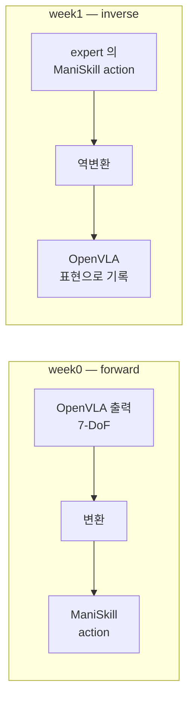
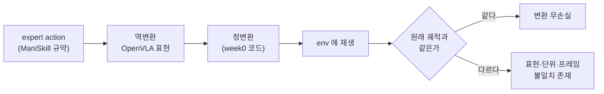

# Week 1 — sim task 정의 + adaptation 데이터 수집


> **이번 주 목표**: week0 에서 세운 sim 루프로 LoRA adaptation 용 (관측, action) 데이터를 수집한다. 핵심은 수집량이 아니라 **action 표현이 OpenVLA 의 출력 표현과 같은지**와 **eval seed 가 학습에 섞이지 않는지**다.
> **예상 시간**: 8-10시간
> **핵심 질문**: "정답 action 은 누가 만드는가? 그리고 그 action 이 OpenVLA 가 내놓는 것과 같은 표현이라는 것을 어떻게 보이는가?"
> **선행**: [week0](../week0/README.md) 완료 — 특히 실습 4 의 action 변환 계약 표, 실습 5 의 기성 해법, 실습 6 의 seed 목록
> **대응 Roadmap**: [`Roadmap/Phase 4.5.md`](../../../Roadmap/Phase%204.5.md) Section 1 주차 1


---


## 학습 순서


| 순서 | 단계 | 파일/자료 | 설명 |
|:----:|------|----------|------|
| 1 | expert 확보 | `PRACTICE.md` 1 | 정답 action 을 만드는 주체를 정하고 궤적 1개를 덤프 |
| 2 | action 표현 역변환 | `PRACTICE.md` 2 | week0 계약 표를 반대 방향으로 적용 |
| 3 | round-trip 검증 | `PRACTICE.md` 3 | 변환이 무손실인지 재생으로 확인 |
| 4 | seed 분할 + 수집 | `PRACTICE.md` 4 | eval seed 예약 후 본 수집 |
| 5 | 미학습 분포 점검 | `PRACTICE.md` 5 | 3단 논증으로 기록 |
| 6 | 데이터 통계 정리 | `PRACTICE.md` 6 | action 분포 + 성공률 + 메타 확인 |
| 7 | 퀴즈 | quiz_easy / quiz_medium | leakage / 표현 정합 / 분포 논증 |


---


## 시작하기 전에 — week0 산출물 확인


sim 환경은 week0 에서 구축한 것을 그대로 쓴다. 새로 만들지 않는다.


```bash
cd "/workspace/study/physical-ai-study/Studies/Phase 4.5"
source .venv-sim/bin/activate                       # week0 에서 만든 sim venv
ls week0/outputs/                                   # 아래 4개가 있어야 이번 주가 성립한다
```


| week0 산출물 | 이번 주에서의 용도 |
|---|---|
| `env_build.md` | 같은 환경에서 수집한다는 근거 (버전이 바뀌면 데이터가 섞인다) |
| `sim_facts.md` | 환경 id, action 공간, step cap, 상태 접근 경로 |
| `action_contract.md` | **역방향 변환의 기준** (§2) |
| `zeroshot_baseline.json` | 사용한 eval seed 목록 (§4) + 미학습 분포 논증의 입력 (§5) |


없는 항목이 있으면 week1 을 시작하지 않는다 — 특히 `action_contract.md` 가 비어 있으면 이번 주 작업이 전부 추측이 된다.


---


## 핵심 개념


### 1. 데이터가 없다 — 정답 action 은 누가 만드는가


LoRA adaptation 은 지도학습이다. (관측, 정답 action) 페어가 필요한데, sim 은 관측만 준다. **정답 action 을 만드는 주체**를 정해야 한다.


후보와 판정:


| 후보 | 채택 | 사유 |
|---|---|---|
| zero-shot OpenVLA 의 출력 | 안 됨 | week0 에서 성공률이 바닥이라는 것을 이미 측정했다. 실패하는 정책의 출력을 정답으로 쓰면 실패를 학습한다 |
| 사람이 sim 에서 teleop | 안 씀 | 키보드·마우스 조작은 느리고 품질 편차가 크다. 규모를 만들기 어렵다 |
| RL 로 정책을 학습해 expert 로 | 안 씀 | 학습을 하나 더 붙이는 것이라 Phase 4.5 범위를 넘는다 |
| **기성 해법 (motion planning / scripted)** | **채택** | week0 실습 5 에서 이미 찾아 상한 대조에 썼다. 성공률이 높다는 것도 그때 확인했다 |
| 패키지가 제공하는 데모 궤적 | 보조 | 있으면 규모 확보에 유리하다. 단 action 표현이 무엇인지 확인이 필요하다 (§2) |


**week0 의 상한 대조 해법이 곧 week1 의 expert 다.** 이것이 week0 과 week1 의 실제 의존 관계다 — 상한 대조는 하네스를 검증하려고 한 일이지만, 그 부산물이 데이터 생성기다.


### 2. 이번 주의 변환은 week0 과 방향이 반대다


week0 과 week1 은 같은 계약 표를 양방향으로 쓴다. 이 대칭을 놓치면 표를 두 번 만들게 된다.





왜 역변환이 필요한가. 학습 데이터의 action 은 **모델이 내놓아야 하는 값**이다. 모델은 OpenVLA 규약으로 출력하므로, 정답도 같은 규약으로 적혀 있어야 한다. expert 가 만든 값을 그대로 저장하면 모델은 "자기가 낼 수 없는 형식"을 정답으로 배우게 된다.


여기서 문제가 하나 더 생긴다. **기성 해법은 EEF delta 로 움직이지 않을 수 있다.** motion planning 은 관절 공간 궤적을 내놓는 경우가 흔하고, 그러면 EEF delta 로 다시 표현해야 한다. 실습 1 에서 expert 가 실제로 어느 제어 모드로 동작하는지 확인하는 것이 그래서 첫 단계다.


라벨의 두 가지 규약은 학습 파이프라인이 이미 정해 놓았으므로 협상 대상이 아니다 (근거는 week2 에서 확인한다).


| 규약 | 값 | 함의 |
|---|---|---|
| 회전 표현 | 오일러각 (RPY) | 축-각으로 저장하면 학습 라벨이 틀린다 |
| 단위 | 원시 물리 단위 (미터·라디안), 정규화 안 함 | 정규화는 학습 파이프라인이 데이터셋 통계로 자동 수행한다. 여기서 미리 `[-1, 1]` 로 맞추면 **이중 정규화**가 된다 |


### 3. round-trip 검증 — 변환이 무손실인지 보는 방법


역변환이 맞았는지 어떻게 아는가. 눈으로 숫자를 보는 것으로는 모른다 (week0 §6 의 "작은 델타에서는 틀려도 티가 안 난다" 와 같은 함정).


검증 방법은 **왕복**이다.





판정 기준은 두 층으로 둔다.


| 층 | 기준 | 의미 |
|---|---|---|
| 강한 기준 | 스텝별 EEF pose 차이가 수치 오차 수준 | 변환이 정보를 잃지 않았다 |
| 약한 기준 | 재생 episode 도 success 를 통과 | 궤적이 조금 달라도 task 는 달성한다 |

강한 기준이 깨지고 약한 기준만 통과하면 **정보를 잃고 있다**는 뜻이다. 그 상태로 수집하면 라벨에 계통 오차가 섞이고, 나중에 "LoRA 를 했는데 성공률이 안 올랐다"의 원인 후보가 하나 늘어난다. 여기서 잡는 것이 훨씬 싸다.


### 4. seed 분할 — eval seed 를 학습에 넣지 않는다


week0 실습 6 은 `seed 0-19` 로 baseline 을 측정했다. Section 3 의 fine-tuned 측정도 **같은 seed 목록**을 써야 before/after 의 변인이 모델 하나로 고정된다.


따라서 그 20개 seed 는 **eval 전용으로 예약된 상태**다. 학습 데이터를 그 seed 로 수집하면, fine-tuned 모델은 자기가 학습한 초기 배치에서 평가받는다. 성공률이 올라가도 그것이 adaptation 의 효과인지 암기의 효과인지 구분할 수 없다.


분할 규칙을 이번 주에 확정해 기록한다.


| 용도 | seed 범위 | 비고 |
|---|---|---|
| eval (before/after 공용) | week0 이 쓴 목록 | 절대 학습에 쓰지 않는다 |
| 학습 | 그와 겹치지 않는 범위 | 규모는 §6 |
| (선택) 학습 중 검증 | 학습 범위에서 일부 분리 | 과적합 관찰용 |


> 겹침 검사는 눈으로 하지 않고 코드로 한다 (실습 4). 사람이 범위를 관리하면 반드시 한 번 겹친다.


### 5. "미학습 분포" 를 어떻게 보이는가


Roadmap 은 "생성 데이터가 OpenVLA 사전학습 분포와 겹치지 않는지 점검" 을 요구한다. 이것을 뭉뚱그리면 안 되는 이유는, **부분적으로는 겹치기 때문**이다.


3단으로 나눠 각각 판정한다.


| 층 | 질문 | 예상되는 답의 성격 |
|---|---|---|
| embodiment | 이 로봇 팔이 사전학습 데이터에 있는가 | 있을 수 있다 (Franka 계열은 공개 데이터에 흔하다) |
| 시각 도메인 | 이 렌더 화면·씬·조명이 사전학습 데이터에 있는가 | 없다 (사전학습은 실로봇 영상 중심) |
| task·물체 | 이 물체와 지시문 조합을 본 적 있는가 | 판정 필요 |


즉 정확한 진술은 "겹치지 않는다" 가 아니라 **"embodiment 는 겹칠 수 있으나 시각 도메인과 씬은 미학습이다"** 다. 이 정밀도가 필요한 이유는, 나중에 "그럼 왜 adaptation 이 의미가 있나" 라는 질문에 답할 때 근거가 이 층 구분이기 때문이다.


그리고 **week0 의 결과가 간접 증거로 쓰인다.** zero-shot 성공률이 바닥이라는 것은 모델이 이 분포를 잘 모른다는 신호다. 단 그 신호를 증거로 쓸 수 있는 조건이 있다 — week0 의 하네스 검증이 통과했어야 한다. 검증 없이 낮은 성공률을 "미학습 분포의 증거" 로 쓰면, 실제로는 변환 버그였을 수 있다. 이 의존 관계를 논증에 명시한다.


### 6. 규모를 정하는 근거


"LoRA 가 돌 최소선" 은 숫자가 아니라 판단이다. 세 방향에서 조여 들어간다.


| 방향 | 계산 | 결정에 주는 것 |
|---|---|---|
| 학습 샘플 단위 | LoRA 는 스텝(프레임) 단위 샘플로 학습한다. episode 수 x 평균 스텝 수 = 샘플 수 | 목표 샘플 수에서 episode 수를 역산 |
| 컴퓨트 예산 | RunPod 1 사이클 시간·비용 (Section 0 후반에서 실측) | 상한 |
| 수집 시간 | expert 1 episode 소요 시간 x episode 수 | 이번 주 안에 끝나는지 |


기록해야 하는 것은 최종 숫자가 아니라 **그 숫자를 고른 근거**다. 나중에 "데이터가 부족해서 안 올랐나" 를 따질 때, 근거가 없으면 그 질문에 답할 수 없다.


### 7. 성공한 episode 만 넣는 것의 대가


expert 궤적만 모으면 데이터는 깨끗하지만 **상태 분포가 좁아진다.** 모델은 "expert 가 지나간 상태" 만 보고 배우므로, 추론 중 한 번 궤도에서 벗어나면 학습에서 본 적 없는 상태에 놓이고 회복하지 못한다.


이 문제 자체를 이번 Phase 에서 해결하지는 않는다 (해법은 학습 중 정책의 실수 상태를 다시 라벨링하는 계열의 방법이고, 그것은 별도 과제다). 대신 두 가지를 한다.


- 실패 episode 도 **통계로는 기록**한다 (학습에는 안 넣되, expert 성공률을 남긴다)
- 이 한계를 미리 적어 둔다. before/after 결과 해석에서 후보 원인으로 쓰인다


### 8. 무엇을 저장해야 하는가


이미지와 action 만 저장하면 나중에 반드시 다시 수집한다. 최소 항목:


| 항목 | 왜 필요한가 |
|---|---|
| 관측 이미지 | 학습 입력 |
| instruction 문자열 | week0 과 동일 문구로 고정 (변하면 변인이 늘어난다) |
| action (OpenVLA 표현) | 학습 라벨 |
| episode id / step index | episode 경계 복원. week2 포맷 변환에서 필요 |
| seed | 학습·eval 겹침 검사와 재현 |
| success 여부 | 학습 대상 선별 + expert 성공률 통계 |
| 수집 시점 환경 정보 | week0 `env_build.md` 참조로 갈음 |


---


## 자체 점검


문서를 보지 않고 답한다. 막히면 해당 절로 돌아간다.


**Q1.** zero-shot OpenVLA 의 출력을 정답 action 으로 쓰면 안 되는 이유를 week0 결과와 연결해 설명하라. (§1)


**Q2.** week0 과 week1 의 변환 방향이 반대인 이유는 무엇인가. (§2)


**Q3.** round-trip 에서 강한 기준은 깨지고 약한 기준만 통과했다. 무엇을 의미하며 왜 그대로 수집하면 안 되는가. (§3)


**Q4.** week0 이 쓴 seed 로 학습 데이터를 모으면 무엇을 구분할 수 없게 되는가. (§4)


**Q5.** "미학습 분포다" 를 3층으로 나눠 진술해야 하는 이유는. (§5)


**Q6.** zero-shot 성공률이 낮다는 사실을 미학습 분포의 증거로 쓰려면 어떤 선행 조건이 필요한가. (§5)


**Q7.** expert 궤적만 학습하면 생기는 구조적 한계는 무엇인가. (§7)


---


## 이번 주 실습 & 다음 주 준비


### 이번 주 실습 과제

1. `practice_expert_dump.py` — expert 확보 + 궤적 1개 덤프 + 제어 모드 확인
2. `practice_inverse_transform.py` — expert action 을 OpenVLA 표현으로 역변환
3. `practice_roundtrip.py` — 왕복 재생으로 무손실 검증 (강한/약한 기준 판정)
4. `practice_collect.py` — seed 분할 검사 후 본 수집
5. 미학습 분포 3단 논증 작성 — `outputs/distribution_check.md`
6. `practice_dataset_stats.py` — action 분포 히스토그램 + expert 성공률 + 메타 검증


### 이번 주 산출 (must / nice)

- must: 데이터셋 1벌 + seed 분할 기록 + round-trip 검증 결과 + 미학습 분포 3단 논증
- nice: action 차원별 분포 히스토그램 (week2 포맷 변환에서 이상값 조기 발견용)


### 다음 주 (week 2) 준비

- week2 는 이 데이터를 OpenVLA 학습 포맷으로 변환한다. 이번 주 저장 스키마(§8)가 그 입력이다
- 역변환 코드는 week2 에서 다시 쓴다 — 스크립트에 흩뿌리지 말고 한 곳에 모아 둔다 (실행 보드 `#5` 의 adapter 와 같은 자리)


---


## 이번 주 핵심 요약


1. **expert 는 week0 의 상한 대조 해법이다** — 새로 만들지 않는다.
2. **변환 방향이 반대다** — week0 은 정변환, week1 은 역변환. 계약 표는 하나다.
3. **round-trip 으로 검증한다** — 숫자를 눈으로 보는 것으로는 표현 불일치를 못 잡는다.
4. **eval seed 는 예약돼 있다** — 학습에 섞으면 before/after 가 암기와 구분되지 않는다.
5. **미학습 분포는 3층으로 진술한다** — embodiment 는 겹칠 수 있고, 시각 도메인은 아니다.
6. **규모의 근거를 남긴다** — 숫자보다 근거가 나중에 쓰인다.


---


이전: [Week 0 — sim 환경 구축 + 하네스 검증 + zero-shot baseline](../week0/README.md)


다음: [Week 2 — OpenVLA 학습 포맷으로 데이터 변환](../week2/README.md)
