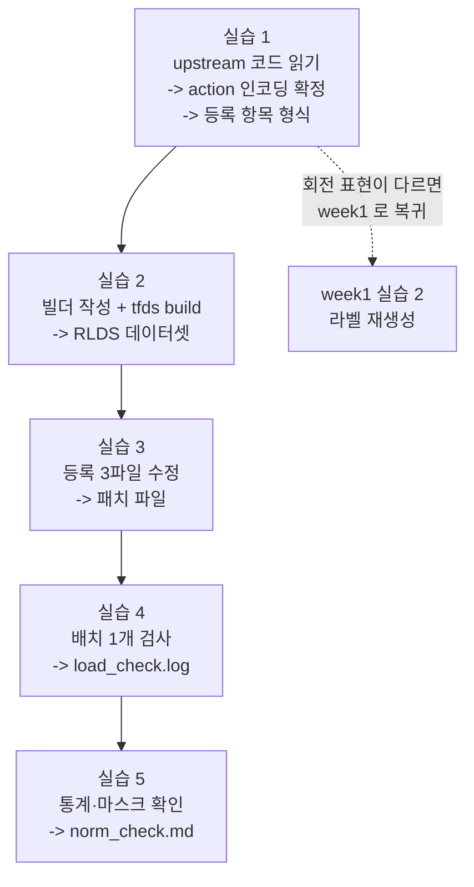

# Week 2 실습: RLDS 변환 -> 등록 -> 로드 검증


> **실습 목표**: week1 데이터를 RLDS 로 바꾸고 OpenVLA 데이터로더에 등록해, 배치 1개를 실제로 꺼내 검사한다.
> **예상 시간**: 8-10시간
> **원칙**: 이번 주의 실패는 예외를 내지 않는다. 실습 4-5 의 검사를 통과하기 전에는 "변환이 끝났다" 고 보지 않는다.


### 이 문서를 읽는 법


- 각 실습은 **무엇을 하나 / 왜 하나 / 끝나면 손에 남는 것** 세 줄로 시작한다.
- `README.md` 는 개념, 이 문서는 절차다. 낯선 이름(RLDS, mixture, transform) 이 나오면 README 의 용어 표로 돌아간다.
- 이번 주는 **셸 명령으로 남의 코드를 읽는 시간**이 절반이다. `grep` 으로 원본 코드를 확인하는 습관이 이번 주의 실질적 기술이다 — 문서가 아니라 설치된 코드가 사실이다.


---


## 0. 이번 주 전체 그림


### 0.1 한 문장으로


> week1 의 `.npz` 더미를 **RLDS 데이터셋**으로 굽고, OpenVLA 리포의 파일 3곳에 "이런 데이터셋이 있다" 고 등록한 뒤, 학습은 돌리지 않고 **배치 하나만 꺼내 내용이 맞는지 검사**한다.


### 0.2 5개 실습이 이어지는 방식





점선을 먼저 확인하는 것이 이번 주의 순서 전략이다. 실습 1 에서 action 인코딩을 확인하면 **회전 표현이 확정된다.** week1 라벨이 그 표현이 아니면 빌드·등록을 하기 전에 라벨부터 고쳐야 한다 — 나중에 발견하면 빌드·등록·통계 캐시를 전부 다시 해야 한다.


### 0.3 자주 걸리는 용어 미리 풀기


| 용어 | 뜻 |
|---|---|
| **RLDS** | 로봇 데이터를 "episode 안에 step 들" 구조로 저장하는 공통 형식 |
| **TFDS** | 데이터셋을 정의·빌드하는 라이브러리. `tfds build` 로 굽는다 |
| **빌더** | "원본을 읽어 이런 데이터셋으로 만들어라" 를 적은 파이썬 클래스 |
| **feature 명세** | 각 항목의 shape/dtype 을 미리 선언한 것. 실제 데이터와 다르면 빌드가 막힌다 |
| **`_generate_examples`** | 빌더가 원본 파일 하나를 episode 하나로 바꿔 내놓는 함수 |
| **`yield`** | 함수가 값을 하나씩 내놓으며 진행하는 파이썬 문법. 전체를 메모리에 담지 않는다 |
| **레지스트리** | "이름 -> 설정/함수" 딕셔너리. 이름이 없으면 로더가 데이터셋을 못 찾는다 |
| **mixture** | 학습에 쓸 데이터셋 조합과 비율. 단일 데이터셋도 조합으로 등록한다 |
| **`grep`** | 파일에서 문자열을 찾는 셸 명령. `-n` 은 줄 번호, `-A/-B` 는 앞뒤 줄 함께 출력 |
| **editable 설치** | `pip install -e` 로 넣는 방식. 패키지를 복사하지 않고 원본 폴더를 가리키는 링크만 만든다. 원본을 고치면 즉시 반영된다 |
| **`--no-deps`** | pip 옵션. 그 패키지가 요구하는 다른 패키지들을 함께 설치하지 않는다 |
| **`--dry-run`** | pip 옵션. 설치했다면 어떻게 됐을지만 알려 주고 아무것도 바꾸지 않는다 |
| **import 체인** | `import A` 를 만나면 A 가 import 하는 B 를, B 가 import 하는 C 를 줄줄이 따라가는 사슬 |
| **자리표시자** | 스켈레톤 코드에서 "여기는 네가 채워라" 를 표시하려고 넣어 둔 가짜 값. `dataset = None` 이 그것 |
| **로더** | 디스크의 데이터셋을 열어 학습에 쓸 형태로 꺼내 주는 코드 뭉치. 여기서는 `RLDSDataset` |
| **배치** | 로더가 한 번에 내놓는 데이터 한 덩어리 |
| **patch / diff** | 코드 변경 내용만 뽑아낸 텍스트. 다른 곳에서 같은 변경을 재현하는 데 쓴다 |
| **기준 커밋** | 내가 수정을 얹은 원본 코드의 버전 식별자. 패치는 이 버전 위에서만 정확히 적용된다 |
| **정규화 마스크** | 차원별로 정규화 적용 여부를 적은 True/False 배열 |
| **통계 캐시** | 계산한 통계를 저장해 둔 파일. 남아 있으면 다시 계산하지 않는다 |


### 0.4 파일을 어디 두고 어디서 실행하나


헷갈리기 쉬운 지점이라 미리 정리한다. 이번 주는 **세 군데**를 오간다.


| 위치 | 무엇을 하는 곳 |
|---|---|
| `week2/` (이 폴더) | 검증 스크립트와 기록(`outputs/`) |
| `~/rlds_dataset_builder/maniskill_pickcube/` | 빌더 정의 + `tfds build` 실행 |
| `~/openvla/` | 등록 3파일 수정 대상 (upstream 리포) |


그리고 빌드 결과 데이터셋은 기본적으로 `~/tensorflow_datasets/` 아래에 떨어진다. 실습 5 가 그 경로를 뒤진다.


---


## 환경 설정


변환 도구는 TensorFlow 계열이라 sim venv 와 섞지 않는다. 섞으면 의존성 해결 과정에서 torch 버전이 갈릴 수 있고, 그러면 week0-1 환경이 깨진다.


### 1단계: venv 와 리포


```bash
cd "/workspace/study/physical-ai-study/Studies/Phase 4.5"
python3 -m venv .venv-rlds                                     # 변환·등록·로드 검증용
source .venv-rlds/bin/activate
pip install --upgrade pip
pip install -r week2/requirements.txt
mkdir -p week2/outputs
git clone https://github.com/openvla/openvla ~/openvla          # 등록 대상
git clone https://github.com/kpertsch/rlds_dataset_builder ~/rlds_dataset_builder
cd week2
```


`week2/requirements.txt` 는 **openvla 를 설치하지 않는다.** 파일 안의 주석이 그렇게 적어 뒀다 — openvla 본체는 리포 자신의 지침을 따라야 하기 때문이다. 이 명령만 돌리고 `import prismatic` 을 시도하면 `ModuleNotFoundError` 가 난다. 정상이다. 2단계가 남아 있다.


### 2단계: openvla 설치 — 리포 지침이 통하는지 먼저 확인


openvla 리포는 **editable 설치**로 넣는다. 패키지를 복사하지 않고 원본 폴더를 가리키는 링크만 만드는 방식이라, `~/openvla` 의 파일을 고치면 즉시 반영된다. 실습 3 에서 등록 3파일을 고칠 것이므로 이 방식이어야 한다.


설치하기 전에 **리포가 요구하는 버전 핀을 현재 python 으로 설치할 수 있는지** 확인한다. 리포 README 는 특정 python 버전을 전제로 쓰여 있는데, 내 환경이 그것과 다르면 핀이 통째로 안 맞을 수 있다.


```bash
python -V                                        # 내 python 버전
sed -n '/^dependencies/,/^]/p' ~/openvla/pyproject.toml   # 리포가 요구하는 핀 목록

# 의심스러운 핀을 하나씩 시험 설치해 본다 (--dry-run 은 실제로 설치하지 않는다)
pip install --dry-run --no-deps "tensorflow==2.15.0"
```


`--dry-run` 은 "설치했다면 어떻게 됐을지" 만 알려 주고 아무것도 바꾸지 않는다. 여기서 `No matching distribution found` 가 나오면 **그 핀은 내 python 버전에 휠이 없다**는 뜻이다.


| 확인 결과 | 다음 행동 |
|---|---|
| 모든 핀이 설치 가능 | 리포 README 절차를 그대로 따른다 (`pip install -e ~/openvla`) |
| 일부 핀이 설치 불가 | 아래 3단계로 간다 |


### 3단계: 핀이 안 맞을 때 — 본체만 얹고 의존성을 직접 채운다


```bash
pip install -e ~/openvla --no-deps
```


`--no-deps` 는 pyproject 의 의존성 해석을 통째로 건너뛴다. 설치 불가한 핀에서 막히지 않고 `prismatic` 패키지만 import 경로에 올릴 수 있다.


대신 필요한 패키지가 하나도 안 깔린 상태가 되므로, **import 에러가 지목하는 대로 하나씩 채운다.**


```bash
python -c "from prismatic.vla.datasets import RLDSDataset; print('ok')"
```


`ModuleNotFoundError: No module named 'X'` 가 나오면 X 를 설치하고 같은 명령을 다시 돌린다. `ok` 가 나올 때까지 반복한다.


**목록을 미리 받아 한 번에 설치하지 마라.** 하나씩 밟아야 "데이터로더가 실제로 요구하는 것" 과 "모델 학습에만 필요한 것" 의 경계가 손에 남는다. 그 경계가 Section 0 후반 Docker 이미지를 얇게 만드는 근거다.


경로 분류는 트레이스백의 **마지막에서 두 번째 줄**이 알려 준다 — 그 모듈을 요구한 파일이 거기 찍힌다.


| 요구한 파일 | 분류 |
|---|---|
| `prismatic/models/...` | 모델 경로. import 통과용인 경우가 많다 |
| `prismatic/vla/datasets/rlds/...` | 데이터 경로. 실제로 데이터를 읽는 코드가 쓴다 |


`prismatic/__init__.py:1` 이 `from .models import ...` 로 시작하므로 **데이터로더만 쓰더라도 모델 쪽 import 의존은 전부 채워야 한다.** 위 분류는 그 안에서 무엇이 실행에 관여하는지를 나누기 위한 것이다.


반복 중에 판단이 필요한 지점이 셋 나온다.


| 지점 | 판단 기준 |
|---|---|
| 버전 핀을 지킬까 | pyproject 에 핀이 없으면 최신. 핀이 있으면 일단 지킨다. 단 **그 패키지가 데이터 파이프라인 코드 경로에 있는가**를 함께 본다 |
| pip 이 다른 패키지를 내리려 할 때 | 핀 걸린 패키지가 상한을 요구하면 그쪽이 이긴다. 정상이므로 막지 말고, 내려간 버전을 기록만 한다 |
| numpy 와 얽힐 때 | 여기서 실제로 값을 판정하는 도구는 numpy 다. 정작 쓰지 않는 패키지의 핀 때문에 numpy 를 흔들어야 한다면, 그 핀을 버리는 쪽이 낫지 않은지 따져 본다 |


설치할 때마다 pip 이 아래 블록을 낸다. **실패가 아니다.**


```
ERROR: pip's dependency resolver does not currently take into account all the packages
       that are installed. ...
openvla 0.0.3 requires torch==2.2.0, which is not installed.
```


`--no-deps` 로 얹었으니 pyproject 의 요구가 미충족 상태이고, pip 은 그것을 매번 재보고할 뿐이다. **같은 출력에 `Successfully installed ...` 가 있으면 그 설치는 성공한 것이다.** 목록은 한 라운드마다 줄어든다.


### 통과 기준


```bash
python -c "from prismatic.vla.datasets import RLDSDataset; print('ok')"
pip freeze > outputs/pip_freeze_rlds.txt
```


> 설치 중 겪은 문제를 `outputs/env_rlds.md` 에 남긴다. 최소한 이 넷을 적는다 — (1) 못 지킨 핀과 그 pip 에러 원문, (2) `--no-deps` 를 택했다면 그 대가로 upstream 과 달라진 항목, (3) 실제로 설치한 패키지와 데이터/모델 경로 분류, (4) 버전을 고를 때 내린 판단과 그 근거. 이 환경이 Section 0 후반 Docker 이미지의 학습 측 명세가 된다 — 그때 "무엇을 어떤 순서로 설치했더니 됐다" 를 다시 떠올릴 필요가 없게 된다.


---


## 실습 1: 포맷 요건 확정


**무엇을 하나**: 코드를 쓰기 전에 openvla 리포를 `grep` 으로 읽어, 등록 3파일의 위치·형식과 action 인코딩 종류를 사실로 확정한다.
**왜 하나**: 이 확인이 **회전 표현을 확정**한다. week1 라벨이 그 표현이 아니면 지금 알아야 한다. 그리고 등록 항목의 키 이름은 버전마다 다르므로 문서가 아니라 설치된 코드를 봐야 한다.
**끝나면 손에 남는 것**: `outputs/format_spec.md` — 등록 3파일의 역할, 채택할 action 인코딩, 설정 항목 키 목록, 마스크의 출처.


**산출물**: `outputs/format_spec.md`


코드를 쓰기 전에 요건을 upstream 코드에서 사실로 확정한다. 문서가 아니라 코드를 본다. 이유는 단순하다 — README 는 갱신이 늦고, 우리가 실행하는 것은 문서가 아니라 코드다.


```bash
cd ~/openvla/prismatic/vla/datasets/rlds/oxe


# 1-1. 등록 대상 3개의 위치와 형태 확인
grep -n "OXE_DATASET_CONFIGS" configs.py | head -3          # 설정 딕셔너리 시작 지점
grep -n "OXE_STANDARDIZATION_TRANSFORMS" transforms.py | tail -3   # 변환 함수 레지스트리
grep -n "OXE_NAMED_MIXTURES" mixtures.py | head -3          # mixture 딕셔너리


# 1-2. action 인코딩 종류와 각 벡터 구성 확인 (회전 표현이 여기서 정해진다)
grep -n -A 12 "class ActionEncoding" ../../../../../prismatic/vla/datasets/rlds/oxe/configs.py \
  2>/dev/null || grep -rn -A 12 "class ActionEncoding" ~/openvla/prismatic


# 1-3. 이미 등록된 데이터셋 하나를 골라 설정 항목을 그대로 읽는다 (내 것의 본보기)
grep -n -A 8 '"bridge_oxe"' configs.py


# 1-4. 가장 단순한 변환 함수 하나를 읽는다 (내 변환 함수의 본보기)
grep -n -B 2 -A 14 "def toto_dataset_transform" transforms.py


# 1-5. 정규화 마스크가 어디서 만들어지는지 확인 (수동인가 자동인가)
grep -rn "action_normalization_mask" ~/openvla/prismatic | head
```


각 명령이 무엇을 확인하는지 풀어 둔다.


| 명령 | 알아내는 것 |
|---|---|
| 1-1 | 세 레지스트리가 실제로 어느 파일 어느 줄에 있는가 (내가 줄을 추가할 자리) |
| 1-2 | 선택 가능한 action 인코딩 종류와 각각의 벡터 구성 — **회전 표현이 여기서 닫힌다** |
| 1-3 | 남이 등록한 항목의 키 이름과 값 형식. 내 항목을 그 형식대로 쓴다 |
| 1-4 | 변환 함수의 입력·출력 규약. 어떤 키를 읽어 어떤 키로 내놓는가 |
| 1-5 | 정규화 마스크를 내가 적어야 하는지, 인코딩에서 자동으로 나오는지 |


`grep` 옵션도 한 줄로: `-n` 은 줄 번호 표시, `-A 12` 는 찾은 줄 뒤 12줄까지 함께 출력, `-B 2` 는 앞 2줄, `-r` 은 디렉터리 전체를 재귀 탐색이다. `head` / `tail` 은 출력이 길 때 앞/뒤 몇 줄만 본다.


**기록할 것** (`outputs/format_spec.md`)

| 항목 | 확정 내용 | 출처 (파일:줄) |
|---|---|---|
| 데이터 형식 | | upstream README |
| 등록 파일 3개와 각 역할 | | 1-1 |
| 채택할 action 인코딩 + 벡터 구성 | | 1-2 |
| 설정 항목 키 목록 (관측·state·action) | | 1-3 |
| 변환 함수가 읽는 키 / 쓰는 키 | | 1-4 |
| 정규화 마스크의 출처 (자동 파생인지) | | 1-5 |


> 1-2 의 결과로 **회전 표현이 확정된다.** week1 라벨이 그 표현이 아니면 여기서 멈추고 week1 실습 2 로 돌아가 라벨을 재생성한다 — 뒤로 갈수록 되돌리는 비용이 커진다 (라벨 -> 빌드 -> 등록 -> 통계 캐시가 사슬로 묶여 있다).


---


## 실습 2: RLDS 빌더 작성 + 변환


**무엇을 하나**: 공개 템플릿을 복사해 두 메서드만 고쳐, week1 의 `.npz` 를 RLDS 데이터셋으로 굽는다.
**왜 하나**: OpenVLA 학습 스크립트가 읽는 형식이 RLDS 하나다. 그리고 이 변환 과정에서 **관측과 라벨의 길이를 맞추는 규칙**(1 차이) 을 코드로 고정한다.
**끝나면 손에 남는 것**: `~/tensorflow_datasets/maniskill_pickcube/` 아래의 RLDS 데이터셋 + 빌더 파일.


**파일명**: `practice_build_rlds.py` (빌더 정의) + `tfds build` 실행


템플릿을 복사해 필요한 곳만 고친다. 처음부터 쓰지 않는다 — 템플릿에는 파일명·클래스명·설정 파일의 규칙이 이미 맞춰져 있고, 그 규칙을 처음부터 맞추는 것은 배우는 것 없이 시간만 쓰는 일이다.


```bash
cp -r ~/rlds_dataset_builder/example_dataset ~/rlds_dataset_builder/maniskill_pickcube
cd ~/rlds_dataset_builder/maniskill_pickcube
ls                                     # 빌더 .py 와 설정 파일 구성을 먼저 본다
```


빌더 파일에서 고칠 곳은 두 군데다 — **feature 명세**와 **샘플 생성기**.


| 고칠 곳 | 하는 일 |
|---|---|
| `_info()` | 각 항목의 shape/dtype 을 선언한다. 이미지 해상도, action 차원 수가 여기 박힌다 |
| `_generate_examples()` | 내 `.npz` 하나를 읽어 episode 하나로 바꿔 내놓는다 |


```python
"""
실습 2: week1 npz 를 RLDS 로 변환하는 빌더

템플릿의 example_dataset 빌더를 복사해 아래 두 메서드만 바꾼다.
클래스 이름과 파일 이름은 템플릿 규칙(디렉터리명과 일치)을 따른다.
"""
import glob                                    # week1 npz 파일 목록
import numpy as np
import tensorflow_datasets as tfds


WEEK1_DATASET = "/workspace/study/physical-ai-study/Studies/Phase 4.5/week1/outputs/dataset"
INSTRUCTION = "pick up the cube"               # week0-1 과 같은 문구 (변하면 변인이 늘어난다)


class ManiskillPickcube(tfds.core.GeneratorBasedBuilder):
    """week1 수집 데이터를 RLDS 로 변환하는 빌더."""

    VERSION = tfds.core.Version("1.0.0")       # 데이터를 바꾸면 올린다 (캐시 혼동 방지)
    RELEASE_NOTES = {"1.0.0": "initial"}

    def _info(self) -> tfds.core.DatasetInfo:
        """관측·action·instruction 의 형상과 dtype 을 선언한다."""
        # 아래 형상은 week0 sim_facts.md 의 카메라 해상도와 맞춰야 한다.
        return self.dataset_info_from_configs(
            features=tfds.features.FeaturesDict({
                "steps": tfds.features.Dataset({
                    "observation": tfds.features.FeaturesDict({
                        "image": tfds.features.Image(       # 관측 이미지
                            shape=(224, 224, 3),            # week0-1 확정 해상도 (관측 카메라 224x224)
                            dtype=np.uint8,
                            encoding_format="png",
                        ),
                    }),
                    "action": tfds.features.Tensor(         # 7차원 라벨 (원시 물리 단위)
                        shape=(7,), dtype=np.float32,
                    ),
                    "discount": tfds.features.Scalar(dtype=np.float32),
                    "reward": tfds.features.Scalar(dtype=np.float32),
                    "is_first": tfds.features.Scalar(dtype=np.bool_),   # episode 첫 스텝
                    "is_last": tfds.features.Scalar(dtype=np.bool_),    # episode 마지막 스텝
                    "is_terminal": tfds.features.Scalar(dtype=np.bool_),
                    "language_instruction": tfds.features.Text(),
                }),
                "episode_metadata": tfds.features.FeaturesDict({
                    "file_path": tfds.features.Text(),      # 어느 npz 에서 왔는지
                    "seed": tfds.features.Scalar(dtype=np.int32),   # week1 seed 를 보존
                }),
            })
        )
        # 템플릿에 language_embedding 항목이 있으면 필요 여부를 확인한다.
        # OpenVLA 는 instruction 문자열을 직접 토크나이즈하므로 없어도 되는지 1-4 에서 판단.

    def _split_generators(self, dl_manager):
        """학습 split 하나만 만든다 (eval 은 sim 에서 직접 돌린다)."""
        return {"train": self._generate_examples(sorted(glob.glob(f"{WEEK1_DATASET}/ep*.npz")))}

    def _generate_examples(self, paths):
        """npz 하나를 episode 하나로 변환해 내놓는다."""
        for path in paths:
            data = np.load(path)                            # week1 산출물
            frames = data["frames"]                         # (T, H, W, 3)
            actions = data["openvla_actions"]               # (T-1, 7) — week1 실습 2 결과
            seed = int(data["seed"])                        # 재현·오염 검사용

            steps = []
            # action 은 t -> t+1 변화이므로 관측도 마지막 프레임을 뺀 길이에 맞춘다.
            for index in range(len(actions)):
                steps.append({
                    "observation": {"image": frames[index]},
                    "action": actions[index].astype(np.float32),   # 정규화하지 않은 원값
                    "discount": 1.0,
                    "reward": float(index == len(actions) - 1),     # 마지막 스텝에만 1
                    "is_first": index == 0,
                    "is_last": index == len(actions) - 1,
                    "is_terminal": index == len(actions) - 1,
                    "language_instruction": INSTRUCTION,
                })

            yield path, {"steps": steps,
                         "episode_metadata": {"file_path": path, "seed": seed}}
```


코드에서 낯선 부분을 풀어 둔다.


- `is_first` / `is_last` / `is_terminal`: RLDS 가 episode 경계를 표시하는 방식이다. 이 플래그가 있어야 데이터로더가 "여기서 한 판이 끝났다" 를 알고 서로 다른 시도를 섞지 않는다 (README §7 의 마지막 검사 항목).
- `discount` / `reward`: 강화학습 데이터 형식이라 규격상 자리가 있다. 우리 학습은 지도학습이라 실제로 쓰이지 않지만, 형식이 요구하므로 채운다.
- `range(len(actions))`: 라벨 개수만큼만 돈다. 이미지가 한 장 더 많으므로 마지막 프레임은 버려진다 — **이것이 week1 §2 에서 말한 "1 차이" 를 맞추는 자리다.** 여기서 `len(frames)` 로 쓰면 라벨이 한 칸 밀린다.
- `yield path, {...}`: `(키, 데이터)` 쌍을 하나씩 내놓는다. 전체를 메모리에 담지 않으므로 데이터가 커도 돈다. 키로 파일 경로를 쓰면 나중에 어느 원본에서 왔는지 추적할 수 있다.
- `VERSION`: 데이터를 바꿨을 때 이 번호를 올리면 새 디렉터리에 굽는다. 옛 데이터·옛 통계와 섞이는 사고를 막는 장치다 (README §6).


변환 실행:


```bash
cd ~/rlds_dataset_builder/maniskill_pickcube
tfds build                                     # RLDS 데이터셋 생성 (기본 출력은 ~/tensorflow_datasets)
ls ~/tensorflow_datasets/maniskill_pickcube/   # 생성 결과 + 버전 디렉터리 확인
```


**확인 포인트**

- episode 수가 week1 `collect_meta.json` 의 `episodes_saved` 와 같은가. 적으면 일부 파일이 조용히 걸러진 것이다
- action 배열의 값이 원시 물리 단위 대역인가 (미리 정규화하지 않았는지 눈으로 재확인)
- 관측 수와 action 수가 1 차이 규칙대로 맞는가


---


## 실습 3: 데이터로더 등록 (3파일)


**무엇을 하나**: openvla 리포의 세 파일에 내 데이터셋의 설정·변환 함수·조합 이름을 추가하고, 그 변경을 패치 파일로 뽑아 둔다.
**왜 하나**: RLDS 로 구워 놓기만 하면 학습 스크립트는 그 데이터셋의 존재를 모른다. 그리고 이 변경은 **내 컴퓨터의 리포에만 있는 수정**이므로, 다음 주 클라우드에서 같은 코드를 띄우려면 재현 수단이 필요하다.
**끝나면 손에 남는 것**: 수정된 3파일 + `outputs/openvla_registration.patch` + `outputs/openvla_base_commit.txt` + `outputs/registration.md`.


**산출물**: `outputs/registration.md`


upstream 리포를 수정하는 작업이다. **무엇을 어떻게 바꿨는지 정확히 남긴다** — week3 컨테이너화에서 이 변경을 재현해야 한다.


### 3-1. `configs.py` — 관측·action 공간 명세


실습 1 의 1-3 에서 읽은 기존 항목을 본보기로 내 항목을 추가한다.


```python
# ~/openvla/prismatic/vla/datasets/rlds/oxe/configs.py 의 OXE_DATASET_CONFIGS 안에 추가
"maniskill_pickcube": {
    "image_obs_keys": {"primary": "image", "secondary": None, "wrist": None},   # 빌더의 키 이름
    "depth_obs_keys": {"primary": None, "secondary": None, "wrist": None},      # 깊이 없음
    "state_obs_keys": [None, None, None],        # proprio 를 안 넣었으면 비운다 (형식은 1-3 확인)
    "state_encoding": StateEncoding.NONE,        # <- 1-2 에서 본 실제 이름으로
    "action_encoding": ActionEncoding.EEF_POS,   # <- 7차원 = XYZ delta + RPY + gripper
},
```


키 이름의 뜻을 한 줄씩:


| 키 | 뜻 |
|---|---|
| `image_obs_keys.primary` | 정책 입력으로 쓸 주 카메라. 빌더에서 `"image"` 로 저장했으므로 그 이름을 쓴다 |
| `depth_obs_keys` | 깊이 이미지 키. 우리는 RGB 만 쓰므로 전부 비운다 |
| `state_obs_keys` | 관절 각도 같은 로봇 자체 상태(proprioception). 저장하지 않았으면 비운다 |
| `action_encoding` | action 벡터의 구성 규약. **여기서 정규화 마스크가 파생된다** |


> `action_encoding` 이 정규화 마스크까지 결정한다 (README §5). 여기가 틀리면 gripper 가 정규화된다 — 그리고 그 실패는 조용하다.


### 3-2. `transforms.py` — 표준화 변환 함수


빌더가 이미 표준 형태로 저장했다면 변환 함수는 거의 통과다. 그래도 **함수는 반드시 있어야 한다** — 로더가 레지스트리를 맨손으로 인덱싱하므로 이름이 없으면 `KeyError` 로 막힌다. 즉 하는 일이 없어도 "이 데이터셋을 처리할 함수가 등록돼 있다" 는 사실 자체가 필요하다.


```python
# ~/openvla/prismatic/vla/datasets/rlds/oxe/transforms.py 하단에 추가
def maniskill_pickcube_transform(trajectory: Dict[str, Any]) -> Dict[str, Any]:
    """RLDS 원시 궤적을 표준 형태로 옮긴다 (7차원 action + instruction)."""
    # action 이 이미 7차원이면 재조립 없이 그대로 둔다.
    # 3개 조각으로 나눠 저장했다면 여기서 tf.concat 으로 합친다 (1-4 의 예시 형태).
    trajectory["language_instruction"] = trajectory["observation"]["language_instruction"] \
        if "language_instruction" in trajectory["observation"] else trajectory["language_instruction"]
    return trajectory


# 같은 파일 하단의 레지스트리에 등록
OXE_STANDARDIZATION_TRANSFORMS["maniskill_pickcube"] = maniskill_pickcube_transform
```


### 3-3. `mixtures.py` — 학습에 쓸 조합


학습 스크립트는 "데이터셋 이름" 이 아니라 "조합 이름" 을 인자로 받는다. 다만 조합 목록에 없는 이름을 넘기면 로더가 그것을 데이터셋 이름으로 간주해 하나짜리 조합을 즉석에서 만들므로, **이 등록은 3파일 중 유일하게 없어도 돌아간다** (README §2.4). 그래도 등록하는 이유는 조합을 이름 하나로 고정해 재현하기 위해서다 — week3 에서 같은 학습 명령을 컨테이너에서 다시 실행해야 한다.


```python
# ~/openvla/prismatic/vla/datasets/rlds/oxe/mixtures.py 의 OXE_NAMED_MIXTURES 안에 추가
"maniskill_pickcube_only": [
    ("maniskill_pickcube", 1.0),     # (데이터셋 이름, 샘플링 가중치)
],
```


가중치는 여러 데이터셋을 섞을 때 비율을 조절하는 자리다. 그것도 적은 값이 그대로 쓰이지 않고 데이터셋의 프레임 수로 보정된다 (README §2.4). 단일 데이터셋에서는 어떤 값을 적어도 결과가 같다.


### 3-4. 변경 기록


```bash
cd ~/openvla
git diff > "/workspace/study/physical-ai-study/Studies/Phase 4.5/week2/outputs/openvla_registration.patch"
git log -1 --format="%H" > "/workspace/study/physical-ai-study/Studies/Phase 4.5/week2/outputs/openvla_base_commit.txt"
```


두 파일이 왜 둘 다 필요한가. `git diff` 는 **무엇을 바꿨는지**만 담고, 그 변경이 어느 버전 위에 얹힌 것인지는 담지 않는다. 기준 커밋 해시가 없으면 다음 주 컨테이너에서 최신 코드를 받아 패치를 적용하려다 충돌한다. **패치 + 기준 커밋이 한 쌍**이다.


`outputs/registration.md` 에 적을 것: 3파일에 각각 무엇을 넣었는지, 기준 커밋 해시, 그리고 **week3 에서 이 변경을 어떻게 재현할지의 잠정 방안** (패치 적용 / fork 사용).


---


## 실습 4: 로드 검증


**무엇을 하나**: OpenVLA 데이터로더로 배치 하나를 실제로 꺼내, 이미지 형상 / action 차원 / 정규화 후 범위 / gripper / instruction / episode 경계를 항목별로 검사한다.
**왜 하나**: 이번 주의 실패는 예외를 내지 않는다. "학습이 돌았다" 는 통과 기준이 될 수 없으므로, 학습 전에 데이터가 제대로 들어오는지 직접 보는 것이 유일한 관문이다.
**끝나면 손에 남는 것**: `outputs/load_check.log` — week6 에서 "데이터가 학습에 안 들어감" 후보를 배제하는 근거.


**파일명**: `practice_load_check.py`


학습을 돌리지 않고 배치 하나를 꺼내 검사한다. 이번 주의 실질적 게이트다.


코드에 데이터셋 생성 부분이 비어 있는 것은 의도적이다. 정확한 클래스명과 인자는 버전마다 다르므로, **학습 스크립트가 실제로 쓰는 방식을 그대로 베끼는 것**이 맞다. 그래야 "학습이 읽는 것과 같은 경로로 읽었다" 가 보장된다.


```python
"""
실습 4: OpenVLA 데이터로더로 배치 1개를 꺼내 스키마·범위를 검사
"""
import numpy as np


print("=" * 60)
print("실습 4: 로드 검증")
print("=" * 60)


# -- 4-1. 데이터셋 생성 --
# openvla 의 RLDS 데이터셋 클래스를 사용한다. 정확한 클래스명·인자는 finetune.py 에서
# 데이터셋을 만드는 부분을 그대로 베껴 온다 (아래 셸 명령으로 위치를 찾는다):
#   grep -n "RLDSDataset\|make_dataset" ~/openvla/vla-scripts/finetune.py
#
# dataset = <finetune.py 와 같은 방식으로 데이터셋 생성>
#   data_root_dir = ~/tensorflow_datasets
#   data_mix      = "maniskill_pickcube_only"
dataset = None                                  # <- 위 한 줄을 구현해 교체


# -- 4-2. 배치 1개 꺼내기 --
batch = next(iter(dataset))                     # 첫 샘플
print("\n[4-2] 배치 키:", list(batch.keys()))    # 어떤 필드가 들어오는지 먼저 본다


# -- 4-3. 항목별 검사 (README §7 의 표) --
print("\n[4-3] 검사")


# (a) 이미지: 형상과 dtype
image = np.asarray(batch["pixel_values"])       # <- 4-2 출력의 실제 키로 교체
print(f"   image shape={image.shape} dtype={image.dtype}")


# (b) action: 차원 수
action = np.asarray(batch["actions"])           # <- 실제 키로 교체
print(f"   action shape={action.shape}")
assert action.shape[-1] == 7, "action 이 7차원이 아니다"


# (c) 정규화 후 범위: 앞 6차원은 대략 [-1, 1] 대역이어야 한다
flat = action.reshape(-1, 7)
for dim in range(6):
    column = flat[:, dim]
    print(f"   dim{dim}: min={column.min():+.3f} max={column.max():+.3f}")
# 자릿수가 크게 벗어나면 이중 정규화(week1 에서 미리 정규화) 또는 통계 오류다


# (d) gripper 차원: 정규화를 거치지 않아 원값 두 갈래로 남아야 한다
gripper = flat[:, 6]
print(f"   dim6(gripper): unique 근사값 {np.unique(np.round(gripper, 2))[:6]}")


# (e) instruction 문자열: week0-1 과 같은 문구인가
print("   instruction:", batch.get("language_instruction", "<키 확인 필요>"))


# (f) episode 경계: 한 배치에 여러 episode 가 섞이는 구조인지 확인
# finetune.py 가 스텝 단위로 샘플링하는지 궤적 단위인지에 따라 다르다 -- 4-2 출력으로 판단해 기록
```


### 4-1 을 채우는 법


`~/openvla/vla-scripts/finetune.py` 에서 데이터셋을 만드는 부분을 찾는다.


```bash
grep -n "RLDSDataset\|make_dataset" ~/openvla/vla-scripts/finetune.py
```


나온 호출을 그대로 베낄 수는 없다. 거기 쓰인 `cfg` 와 `vla` 는 학습 스크립트 안에만 존재하기 때문이다.


| 이름 | 정체 | 검증 스크립트에 없는 이유 |
|---|---|---|
| `cfg` | `FinetuneConfig` 설정 묶음 | 학습 실행 시 명령줄 인자로 만들어진다 |
| `vla` | 이미 GPU 에 올라간 7B 모델 | 모델을 안 띄우므로 `vla.module.config.image_sizes` 를 읽을 수 없다 |


**호출의 모양은 베끼되, 이 둘에서 나오는 값은 직접 정해 넣는다.** 진짜 정의는 `prismatic/vla/datasets/datasets.py` 의 `RLDSDataset.__init__` 이다. 인자가 8개인데 앞의 4개는 기본값이 없어 반드시 줘야 하고, 뒤의 4개는 기본값이 있다.


**우선 앞의 4개만 채우고 나머지는 건드리지 않는다.** 한 번에 하나씩 확인하기 위해서다. 뒤의 4개까지 같이 바꾸면 문제가 생겼을 때 어느 것 때문인지 못 가린다.


| 인자 | 무슨 뜻인가 | 정할 때 답할 것 |
|---|---|---|
| `data_root_dir` | 데이터셋들이 들어 있는 **상위 폴더**. 특정 데이터셋 폴더가 아니다 | `tfds build` 결과가 어디 떨어졌나? 거기서 `<데이터셋명>/<버전>/` 을 뺀 윗단이 답이다. 문자열로 줄지 `Path` 로 줄지는 `oxe/materialize.py` 가 이 값을 어떻게 쓰는지 보고 판단 |
| 2번째 위치 인자 | 받는 쪽 파라미터 이름은 `data_mix` 다 | 아래 "2번째 인자의 함정" |
| `batch_transform` | 로더가 배치를 내놓기 직전에 통과시키는 함수 | 아래 "batch_transform 판단". 이 실습에서 가장 중요한 결정 |
| `resize_resolution` | 이미지를 몇 픽셀로 맞출지. `(가로, 세로)` 튜플 | 데이터를 몇 픽셀로 구웠는지 `features.json` 에서 확인한 값. 리사이즈가 아무 일도 안 하게 두는 것이 목적이다 — 검사 대상을 건드리지 않기 위해 |


**2번째 인자의 함정**


`finetune.py` 가 넘기는 변수 이름은 `dataset_name` 인데 받는 쪽 이름은 `data_mix` 다. 왜 어긋나는지는 `datasets.py` 의 `__init__` 안 분기가 알려 준다.


```python
if self.data_mix in OXE_NAMED_MIXTURES:
    mixture_spec = OXE_NAMED_MIXTURES[self.data_mix]
else:
    # mixture 가 아니면 데이터셋 하나로 간주해 비율 1.0 짜리 조합을 만든다
    mixture_spec = [(self.data_mix, 1.0)]
```


실습 3 에서 두 이름을 다 등록했다 — `mixtures.py` 의 mixture 이름과 `configs.py` 의 데이터셋 이름. **둘 중 아무거나 넣어도 돌아가지만 다른 분기를 탄다.** 어느 쪽을 넣을지, 그 선택이 무엇을 검증하고 무엇을 검증 안 된 채 남기는지 답하라. 힌트: week6 에서 학습을 돌릴 때 `--data_mix` 에 넣을 이름은 어느 쪽인가.


**batch_transform 판단**


이 자리에 무엇을 넣느냐가 실습 전체의 성패를 가른다. 세 가지를 순서대로 확인한다.


첫째, **로더가 이 자리의 물건에게 요구하는 것.** `RLDSDataset.__iter__` 를 읽으면 원본 배치를 꺼내 `self.batch_transform(...)` 에 넣고 그 결과를 내놓는 것이 전부다. 즉 "배치를 받아 무언가를 돌려주는 호출 가능 객체" 면 만족한다. 파라미터에 타입이 `RLDSBatchTransform` 이라 적혀 있어도 파이썬은 검사하지 않는다.


둘째, **`RLDSBatchTransform` 이 실제로 하는 일.** `datasets.py` 의 `RLDSBatchTransform.__call__` 을 읽어 보면 배치를 모델이 먹을 형태로 가공한 뒤 `pixel_values`, `input_ids`, `labels`, `dataset_name` 넷만 돌려준다. **`action` 이 없다.** 중간에 `action_tokenizer` 로 action 숫자를 토큰으로 바꿔 `labels` 안에 섞었기 때문이다.


셋째, **그래서 4-3 이 성립하는가.**


| 검사 항목 | 필요한 것 | 가공 후 남아 있나 |
|---|---|---|
| (b) action 7차원 | 원본 action 배열 | 없다 |
| (c) 앞 6차원 범위 | 원본 action 값 | 없다 |
| (d) gripper 원값 | 원본 action 마지막 차원 | 없다 |
| (e) instruction 문자열 | 문자열 그대로 | 없다 (토큰으로 바뀜) |


넷 다 불가능해진다. 게다가 이 함수를 만들려면 7B 모델을 받아야 한다. 그러니 이 자리에는 **받은 것을 그대로 돌려주는 것**을 넣어 파이프라인을 다 태운 원본 배치를 손에 넣는다.


**이 선택의 대가를 반드시 인식하고 넘어가라.** 이렇게 하면 검증 범위가 "가공 직전까지" 로 제한된다. 학습 때 실제로 모델에 들어가는 데이터는 가공을 한 번 더 거치므로, 그 구간은 검증되지 않은 채 남는다. 잘못이 아니라 의도된 범위 제한이다 — 그 구간은 모델이 필요해 week6 에서 다룬다. **다만 이 사실을 `load_check.log` 에 한 줄로 적어 둬야** week6 에서 용의자 목록을 정확히 좁힐 수 있다.


**4-1 통과 기준**


객체 생성 직후 `len(dataset)` 과 `dataset.dataset_statistics` 를 찍어 예외 없이 나오는지 본다. **첫 실행은 오래 걸린다** — 통계 캐시가 없어 로더가 데이터셋 전체를 훑으며 차원별 통계를 계산하기 때문이다. 멈춘 것이 아니니 기다린다.


```bash
ls ~/tensorflow_datasets/<데이터셋명>/<버전>/dataset_statistics_*.json
```


이 파일이 생겨야 한다. 없으면 `~/.cache/orca/` 도 본다 (쓰기 실패 시 폴백 경로). **이 파일이 실습 5 의 실측 재료다.**


**막히면**: 여기서 나는 에러는 대개 실습 3 등록 내용과 실제 데이터의 불일치다. 에러에 나온 키 이름을 셋과 대조한다 — `configs.py` 의 내 등록 항목, 빌드 결과의 `features.json`, 빌더 소스. 셋이 일치해야 하고 어긋난 곳이 범인이다.


### 4-2 를 채우는 법


`next(iter(dataset))` 은 "반복을 시작해 첫 번째 것 하나만 꺼내라" 는 뜻이다. 학습처럼 전부 돌리지 않고 하나만 본다.


스켈레톤의 `pixel_values`, `actions` 는 **자리표시자이므로 대부분 틀린 이름이다.** 실제 이름의 근거는 `RLDSBatchTransform.__call__` 의 첫 세 줄이다 — 그 함수가 원본 배치에서 값을 꺼낼 때 쓰는 키가 진짜 이름이다.


```python
dataset_name, action = rlds_batch["dataset_name"], rlds_batch["action"][0]
img = Image.fromarray(rlds_batch["observation"]["image_primary"][0])
lang = rlds_batch["task"]["language_instruction"].decode().lower()
```


출력과 대조하며 답할 것.


1. 이미지는 최상위인가 `observation` 안 중첩인가?
2. 이미지 키가 빌더에 쓴 이름이 아니라 `image_primary` 인 이유는? (`configs.py` 에서 `"primary"` 슬롯에 매핑한 것과 연결된다)
3. instruction 이 `task` 라는 하위 묶음에 있는 이유는? `.decode()` 가 붙은 것은 그 값이 무슨 타입이라는 뜻인가?


### 4-3 의 shape 판정


검사 코드를 채우기 전에 `action.shape` 을 찍어 본다. `(7,)` 이 아니면 앞에 축이 하나 더 붙어 있다는 뜻이다. 근거는 위 세 줄에서 **action 과 이미지 양쪽에 똑같이 `[0]` 이 붙는다**는 사실이다 — 두 항목에 같은 축이 붙어 있고 학습 코드는 첫 번째만 쓴다.


그 축의 정체는 로더 설정에 있다.


```bash
grep -n "window_size\|future_action_window_size" ~/openvla/prismatic/vla/datasets/datasets.py
```


| 이름 | 뜻 |
|---|---|
| **window** | 과거 몇 프레임을 함께 볼 것인가 |
| **future action window** | 미래 몇 스텝의 action 을 함께 예측할 것인가 |


둘은 의미가 완전히 다르다. 답할 것.


1. 붙어 있는 축은 둘 중 어느 쪽인가?
2. `reshape(-1, 7)` 은 그 축을 눌러 **서로 다른 시점의 action 을 한 통에 섞는다.** (c) 는 차원별 값 범위를 보는 검사인데, 시점이 섞이면 판정이 망가지는가 무해한가?
3. (f) 의 "한 배치에 여러 episode 가 섞이는가" 를 이 shape 만으로 답할 수 있는가, 다른 근거가 필요한가?


2번의 답에 따라 `reshape` 을 그대로 둘지 바꿀지가 정해진다.


### gripper 만 규칙이 다른 이유


검사 코드를 채우기 전에 이것을 이해하고 넘어간다. action 인코딩을 `EEF_POS` 로 등록하면 로더가 `oxe/materialize.py` 에서 `action_normalization_mask = [True]*6 + [False]` 를 자동으로 만든다. 마지막 `False` 가 "7번째 차원은 정규화하지 마라" 는 뜻이다.


이유는 물리적이다. 앞 6개는 **상대값**(얼마나 움직여라)이라 크기를 조정해도 뜻이 유지되지만, gripper 는 **절대값**(열어라 / 닫아라)이라 정규화하면 의미가 깨진다.


즉 실습 3 에서 인코딩 한 줄을 적은 것이 파이프라인 전체의 정규화 동작을 정했다. (d) 검사는 그 한 줄이 의도대로 작동했는지를 보는 것이다.


검사 코드의 판정 논리를 풀어 둔다.


- `(c)` 가 이중 정규화를 잡는 방식: 정규화가 한 번 걸리면 값이 `[-1, 1]` 근처로 퍼진다. 두 번 걸리면 `[-0.05, 0.05]` 처럼 자릿수가 하나 이상 좁아진다. **범위의 자릿수만 봐도 판정된다.**
- `(d)` 의 `np.unique(np.round(gripper, 2))`: 값을 소수 둘째 자리로 반올림한 뒤 서로 다른 값만 모은다. gripper 가 absolute 로 통과했으면 두 값 근처만 나와야 한다. 값이 여러 개로 퍼져 있으면 정규화가 걸린 것이다.
- `assert` 를 쓰는 이유: 출력을 눈으로 훑으면 놓친다. 조건을 코드로 적어 두면 틀린 순간 그 자리에서 멈춘다.


**통과 판정**

| 검사 | 실패 시 |
|---|---|
| action 7차원 | `configs.py` 의 action 인코딩 확인 (실습 3-1) |
| 앞 6차원이 `[-1, 1]` 대역 | week1 에서 미리 정규화했는지 확인 -> 라벨 재생성 |
| gripper 가 두 갈래 원값 | action 인코딩 오등록 확인 |
| instruction 일치 | 빌더의 `INSTRUCTION` 상수 확인 |


검사 출력을 `outputs/load_check.log` 로 저장한다.


```bash
python practice_load_check.py 2>&1 | tee outputs/load_check.log
```


`2>&1` 은 에러 출력도 같은 곳으로 보내라는 뜻이고, `tee` 는 화면에 보여 주면서 동시에 파일에도 쓰라는 뜻이다.


이 로그가 "학습 전에 데이터 연결을 확인했다" 의 증거다. week6 의 배제 표에서 파일 경로째로 인용된다. **로그 안에 검증 범위를 한 줄로 적어 둔다** — `batch_transform` 을 원본 통과로 두었으므로 이 로그가 증명하는 것은 가공 직전까지이고, 가공 구간은 week6 의 몫이다.


**완료 게이트**


로그가 나온 것으로 끝내지 않는다. 다음 세 질문에 문서를 안 보고 답할 수 있어야 이 실습이 닫힌다.


1. gripper 차원만 정규화를 안 받는다. 그 결정을 내린 코드는 어느 파일 몇 번째 줄이고, 내가 실습 3 에서 무엇을 적었기 때문에 그렇게 됐는가?
2. 내가 `batch_transform` 자리에 넣은 것과 `finetune.py` 가 넣는 것은 다르다. 그래서 학습 때는 이 로그가 본 것과 다른 데이터가 모델에 들어간다. 그 차이는 정확히 무엇이고, 그 구간은 무엇으로 검증할 것인가?
3. 통계 캐시 파일 이름의 해시는 무엇으로부터 계산되는가? 실습 3 의 변환 함수를 한 글자 고치면 그 파일은 어떻게 되는가?


2번이 이번 주에서 가장 값어치 있다. 검증의 **경계**를 아는 것이 검증 자체보다 중요하다 — 경계를 모르면 week6 에서 이 로그를 근거로 잘못된 배제를 하게 된다.


---


## 실습 5: 정규화 계약 확인


**무엇을 하나**: 파이프라인이 만든 통계 캐시 파일을 찾아 열어, 어떤 통계량이 들어 있는지 / 정규화 마스크가 gripper 를 제외하는지 / 캐시가 최신 데이터로 계산된 것인지 확인한다.
**왜 하나**: 통계는 학습 중 정규화의 기준이면서 추론 시 역정규화의 기준이다. 이 파일이 낡았거나 마스크가 틀렸으면 학습 자체는 정상으로 보이지만 결과가 어긋난다.
**끝나면 손에 남는 것**: `outputs/norm_check.md` — 통계 경로, 마스크 판정, 캐시 신선도, gripper 부호 최종 점검.


**파일명**: `practice_norm_check.py`


통계가 실제로 무엇으로 계산됐는지, 그리고 그것이 낡지 않았는지 본다.


```python
"""
실습 5: 데이터셋 통계 캐시와 정규화 마스크를 확인
"""
import glob
import json
import os


print("=" * 60)
print("실습 5: 정규화 계약")
print("=" * 60)


# -- 5-1. 통계 캐시 파일 찾기 (빌더 데이터 디렉터리에 저장된다) --
candidates = glob.glob(os.path.expanduser("~/tensorflow_datasets/maniskill_pickcube/**/*.json"),
                       recursive=True)
for path in candidates:                         # 후보를 모두 출력해 어느 것이 통계인지 확인
    print("  ", path)


STATS_PATH = candidates[0]                      # <- 실제 통계 파일 경로로 교체
with open(STATS_PATH) as f:
    stats = json.load(f)


# -- 5-2. 통계 내용 확인 --
print("\n[5-2] 통계 키:", list(stats.keys()))
action_stats = stats["action"]                  # <- 실제 구조에 맞게 교체
for name, value in action_stats.items():
    print(f"   {name}: {value}")


# -- 5-3. 마스크 확인: 앞 6개는 정규화 대상, 마지막(gripper)은 제외여야 한다 --
mask = action_stats.get("mask")                 # 키 이름은 5-2 출력으로 확인
print("\n[5-3] 정규화 마스크:", mask)
# 기대: 앞 6개가 True 계열, 마지막 1개가 False 계열


# -- 5-4. 캐시 신선도 확인 --
# 데이터를 재생성했다면 통계도 다시 계산돼야 한다. 파일 수정 시각을 데이터와 비교한다.
print("\n[5-4] 시각 비교")
print("   통계 파일:", os.path.getmtime(STATS_PATH))
data_files = glob.glob(os.path.expanduser("~/tensorflow_datasets/maniskill_pickcube/**/*.tfrecord*"),
                       recursive=True)
if data_files:
    print("   데이터 파일:", max(os.path.getmtime(p) for p in data_files))
# 데이터가 통계보다 새로우면 캐시를 지우고 다시 만든다
```


코드의 낯선 부분:


- `glob.glob(..., recursive=True)` 와 `**`: 하위 디렉터리 전체를 훑어 패턴에 맞는 파일을 찾는다. 통계 파일의 정확한 위치를 모르므로 후보를 다 출력해 눈으로 고른다.
- `os.path.getmtime(path)`: 파일이 마지막으로 수정된 시각을 숫자(초)로 준다. **데이터 파일이 통계보다 새로우면 통계가 낡았다** — 이 한 줄이 README §6 의 함정을 잡는 장치다.
- `.tfrecord`: TFDS 가 데이터를 굽는 파일 형식이다. 즉 실제 데이터 본체다.
- 통계량 이름 (`q01`, `q99`, `mean`, `std`, `mask`) 의 뜻은 week0 실습 4-1 에서 정리한 것과 같다. `q01`/`q99` 는 하위 1% / 상위 1% 지점이고, 최소·최대 대신 이것을 쓰면 이상치 하나에 스케일이 휘둘리지 않는다.


**기록할 것** (`outputs/norm_check.md`)

- 통계 파일 경로와 계산 기준 (어떤 통계량인가)
- 마스크 값과 그것이 gripper 를 제외하는지
- 캐시 신선도 판정
- **week1 gripper 부호 규약이 그대로 학습된다는 확인** — 정규화가 보정하지 않으므로, 부호가 맞는지 여기서 마지막으로 점검한다. 이 뒤로는 학습이 끝난 다음에야 증상이 보인다


---


## 마무리: 다음 주로 넘기는 것


| 산출물 | week3 에서의 용도 |
|---|---|
| RLDS 데이터셋 (`~/tensorflow_datasets/...`) | 학습 입력 |
| `outputs/openvla_registration.patch` + `openvla_base_commit.txt` | 컨테이너에서 등록 재현 |
| `outputs/load_check.log` | 학습 전 검증 통과 증거 |
| `outputs/norm_check.md` | 학습 통계 = 추론 `unnorm_key` 의 근거 |
| `outputs/env_rlds.md` | Docker 이미지 학습 측 명세의 원본 |


> RLDS 데이터셋 본체는 커밋하지 않는다 (용량). 대신 재생성 절차 (빌더 파일 + week1 데이터 + `tfds build`) 가 기록돼 있으면 복구 가능하다. 반면 등록 패치와 기준 커밋은 **기록되지 않으면 복구 불가**이므로 반드시 남긴다 — 손으로 고친 세 파일의 내용을 기억으로 되살릴 수는 없다.
