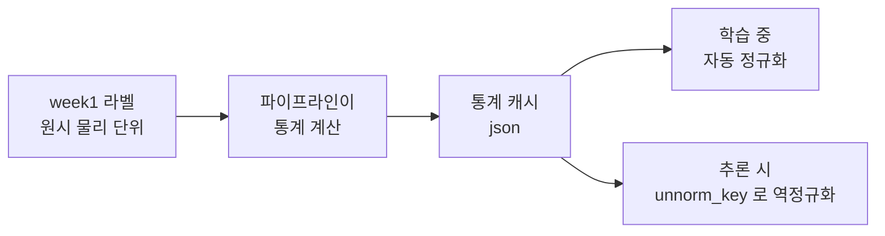

# Week 2 — OpenVLA 학습 포맷으로 데이터 변환


> **이번 주 목표**: week1 데이터셋을 RLDS 로 변환하고, OpenVLA 데이터로더에 등록해 배치가 실제로 꺼내지는 것까지 확인한다.
> **예상 시간**: 8-10시간
> **핵심 질문**: "학습 스크립트가 내 데이터를 읽었다는 것을, 학습을 돌리지 않고 어떻게 확인하는가?"
> **선행**: [week1](../week1/README.md) 완료 — `outputs/dataset/ep*.npz`, `collect_meta.json`, round-trip 검증 통과
> **대응 Roadmap**: [`Roadmap/Phase 4.5.md`](../../../Roadmap/Phase%204.5.md) Section 1 주차 2


---


## 이 문서를 읽는 법


- 이 문서는 **개념**(왜 이렇게 하는가), [`PRACTICE.md`](PRACTICE.md) 는 **절차**(무엇을 타이핑하고 무엇을 확인하는가) 다.
- 이번 주는 새 지식보다 **낯선 도구 이름**이 많다 (RLDS, TFDS, mixture, transform). 이름 자체가 어려운 것이 아니므로, 아래 용어 표에서 "이게 무슨 역할을 하는 물건인가" 만 잡고 진행한다.
- 자체 점검의 답은 문서에 적어 두지 않는다.


## 이번 주를 한 문장으로


> week1 이 만든 `.npz` 파일 더미를 **OpenVLA 학습 스크립트가 읽을 수 있는 형식**으로 바꾸고, "이런 데이터셋이 있다" 고 학습 코드 세 곳에 등록한 뒤, 학습을 돌리지 않고 **배치 하나만 꺼내 내용이 맞는지 검사**한다.


이번 주가 왜 한 주를 다 쓰는지 미리 짚는다. 데이터를 옮기는 작업은 단순하지만, **이번 주의 실패는 예외를 내지 않는다.** 라벨을 미리 정규화하거나 회전 표현을 잘못 저장해도 파일은 정상적으로 만들어지고, 다음 주 학습은 정상적으로 돌고 loss 도 예쁘게 내려간다. 그래서 "돌아간다" 를 통과 기준으로 쓸 수 없고, 대신 **배치를 꺼내 항목별로 검사하는 것**이 이번 주의 실질적 산출물이다 (§7-8).


---


## 학습 순서


| 순서 | 단계 | 파일/자료 | 설명 |
|:----:|------|----------|------|
| 1 | 포맷 요건 확정 | `PRACTICE.md` 1 | RLDS + 등록 3파일의 역할을 upstream 코드에서 확인 |
| 2 | RLDS 빌더 작성 | `PRACTICE.md` 2 | week1 npz -> RLDS 변환 |
| 3 | 데이터로더 등록 | `PRACTICE.md` 3 | configs / transforms / mixtures 3곳 |
| 4 | 로드 검증 | `PRACTICE.md` 4 | 배치 1개를 꺼내 스키마·범위 검사 |
| 5 | 정규화 계약 확인 | `PRACTICE.md` 5 | 통계 캐시 + gripper absolute 확인 |
| 6 | 퀴즈 | quiz_easy / quiz_medium | 스키마 / 정규화 / 등록 |


---


## 미리 풀어 두는 용어


| 용어 | 뜻 |
|---|---|
| **RLDS**(Reinforcement Learning Datasets) | 로봇·강화학습 데이터를 "episode 안에 step 들이 들어 있는" 구조로 저장하는 공통 형식 |
| **TFDS**(TensorFlow Datasets) | 데이터셋을 정의하고 빌드하는 라이브러리. RLDS 데이터는 보통 이 도구로 만든다 |
| **빌더**(builder) | "내 원본 파일을 읽어 이런 모양의 데이터셋으로 만들어라" 를 적은 파이썬 클래스 |
| **feature 명세** | 각 항목의 모양(shape)과 자료형(dtype)을 미리 선언한 것. 선언과 실제 데이터가 다르면 빌드가 막힌다 |
| **`tfds build`** | 빌더 정의를 실제 데이터 파일로 굽는 명령 |
| **데이터로더**(dataloader) | 저장된 데이터셋에서 학습용 묶음(배치)을 꺼내 주는 코드 |
| **배치**(batch) | 한 번의 학습 갱신에 함께 넣는 샘플 묶음 |
| **스키마**(schema) | 데이터의 항목 이름·모양·자료형 구조 |
| **upstream** | 내가 고쳐 쓰는 원본 공개 리포지토리. 여기서는 openvla 리포 |
| **레지스트리**(registry) | "이름 -> 함수/설정" 을 적어 두는 딕셔너리. 이름이 없으면 로더가 그 데이터셋을 못 찾는다 |
| **mixture** | 학습에 쓸 데이터셋 조합과 그 비율. 데이터셋 1개여도 조합으로 지정해야 한다 |
| **transform 함수** | 내 원시 필드를 파이프라인이 기대하는 표준 필드로 옮기는 함수 |
| **action 인코딩** | action 벡터의 구성 규약. 예: "위치 delta 3 + RPY 3 + gripper 1 = 7" |
| **정규화 통계** | 데이터셋 전체의 action 분포 요약(분위수 등). 정규화·역정규화의 기준이 된다 |
| **정규화 마스크** | 차원별로 정규화를 적용할지 여부를 적은 True/False 배열 |
| **absolute** | 정규화를 거치지 않고 원래 값 그대로 통과하는 차원. gripper 가 그렇다 |
| **`unnorm_key`** | 추론 시 "어느 데이터셋 통계로 역정규화할지" 고르는 스위치 |
| **캐시**(cache) | 한 번 계산한 결과를 파일로 저장해 두고 다음에는 재사용하는 것 |
| **조용한 실패**(silent failure) | 예외도 경고도 없이 결과만 틀리는 실패. 이번 주 실패의 대부분이 이 형태다 |


---


## 시작하기 전에


변환은 TensorFlow 계열 도구를 쓴다. week0-1 의 sim venv 는 ManiSkill 과 torch 조합으로 묶여 있으므로, 여기에 TensorFlow 계열을 얹으면 의존성이 충돌해 앞의 환경이 깨질 수 있다. 그래서 **별도 venv 를 만든다.** 이 환경이 그대로 **Section 0 후반 Docker 이미지의 학습 측 명세**가 된다 — 여기서 겪는 설치 문제를 기록해 두면 그 작업이 짧아진다.


```bash
cd "/workspace/study/physical-ai-study/Studies/Phase 4.5"
python3 -m venv .venv-rlds                          # 변환·등록·로드 검증용
source .venv-rlds/bin/activate
pip install -r week2/requirements.txt
mkdir -p week2/outputs
git clone https://github.com/openvla/openvla ~/openvla         # 등록할 대상 코드
git clone https://github.com/kpertsch/rlds_dataset_builder ~/rlds_dataset_builder
```


두 리포를 받는 이유가 다르다. `openvla` 는 **내가 고쳐야 하는 대상**(등록 3파일이 그 안에 있다) 이고, `rlds_dataset_builder` 는 **베껴 쓰는 본보기**(빌더 템플릿) 다.


---


## 핵심 개념


### 1. RLDS 가 요구 사항인 이유


OpenVLA 의 파인튜닝 스크립트는 **RLDS** 형식의 데이터셋을 읽는다. RLDS 는 로봇 데이터를 "episode 하나 안에 step 여러 개가 순서대로 들어 있고, 각 step 에 관측·action·지시문이 붙어 있는" 구조로 저장하는 공통 형식이다. 사전학습과 논문의 파인튜닝 실험이 모두 이 경로로 돌았기 때문에, 검증된 길이 이것 하나다.


직접 로더를 쓰는 대안도 있다. week1 의 `.npz` 를 읽는 파이썬 코드를 짜서 학습 스크립트에 꽂는 것이 기술적으로 더 쉬워 보일 수 있다. 그런데 이번 Phase 에서는 택하지 않는다. 목적이 "adaptation 파이프라인을 설계-실행하고 정량 분석" 인데, 로더를 자작하면 나중에 결과가 안 나올 때 **원인 후보에 '내 로더' 가 추가**된다. week6 의 "배제된 후보" 표에 한 줄을 더 남겨 두는 셈이고, 그 한 줄을 배제하려면 또 검증을 해야 한다. 검증된 경로를 쓰고 변인을 줄이는 것이 싸다.


변환은 직접 만들지 않고 공개된 빌더 템플릿(`rlds_dataset_builder`)을 쓴다 — upstream README 가 그것을 안내한다.


### 2. 등록 3파일 — 무엇을 어디에 적는가


데이터를 RLDS 로 바꿔 놓는 것만으로는 학습 스크립트가 그것을 찾지 못한다. 학습 코드는 "이름으로 데이터셋을 찾는" 구조이므로, upstream 코드 3곳에 이름과 설정을 등록해야 한다. 각 파일의 역할이 다르므로 하나라도 빠지면 다른 방식으로 실패한다.


| 파일 | 등록 대상 | 적는 내용 |
|---|---|---|
| `prismatic/vla/datasets/rlds/oxe/configs.py` | `OXE_DATASET_CONFIGS` | 관측·action 공간의 명세 (어느 카메라 키가 primary 인가, state·action 인코딩이 무엇인가) |
| `prismatic/vla/datasets/rlds/oxe/transforms.py` | `OXE_STANDARDIZATION_TRANSFORMS` | 내 원시 필드를 표준 형태로 옮기는 변환 함수 |
| `prismatic/vla/datasets/rlds/oxe/mixtures.py` | `OXE_NAMED_MIXTURES` | 학습에 쓸 데이터셋 조합의 이름 (단일 데이터셋도 mixture 로 지정한다) |


역할을 한 줄로 구분하면 — **configs 는 "무엇이 어디 있는가", transforms 는 "그것을 표준 형태로 어떻게 옮기는가", mixtures 는 "무엇을 학습에 쓸 것인가"** 다.


비유로 정리하면 configs 는 창고의 물품 목록표, transforms 는 물품을 표준 규격 상자에 옮겨 담는 작업 지시서, mixtures 는 이번 주문에 어느 창고를 쓸지 적은 주문서다. 목록표만 있고 주문서가 없으면 학습 스크립트는 그 데이터셋의 존재를 알면서도 쓰지 않는다.


### 3. action 인코딩이 회전 표현을 이미 결정해 놓았다


`configs.py` 에 적는 action 인코딩에는 정해진 종류가 있고, 각각이 action 벡터의 의미를 확정한다.


| 인코딩 | 벡터 구성 |
|---|---|
| EEF 위치 | EEF delta XYZ (3) + **RPY (3)** + gripper (1) = 7 |
| 관절 위치 | 관절 delta (7) + gripper (1) = 8 |
| EEF R6 | EEF delta XYZ (3) + R6 회전 표현 (6) + gripper (1) = 10 |


우리가 쓰는 것은 첫 줄(7차원)이다. 즉 **회전은 오일러각(RPY)으로 고정**이다 — week0 계약 표의 "회전 표현" 행에서 열어 두었던 선택지가 여기서 닫힌다. 축-각으로 라벨을 만들었다면 지금 고쳐야 한다.


"지금 고쳐야 한다" 가 뜻하는 비용을 분명히 해 둔다. 라벨을 고치려면 week1 실습 2 로 돌아가 회전 델타 계산을 바꾸고, 라벨을 전량 재생성하고, round-trip 검증을 다시 통과시키고, 이번 주 빌드를 다시 해야 한다. 그리고 통계 캐시도 버려야 한다 (§6). **뒤로 갈수록 이 사슬이 길어지므로 여기서 확인하는 것이 가장 싸다.**


이것이 week0 -> week1 -> week2 를 관통하는 계약의 마지막 조각이다. 세 주차가 같은 표를 채워 왔다.


### 4. 정규화는 파이프라인이 한다 — 저장은 원시 단위


학습 파이프라인은 데이터셋 전체를 한 번 훑어 **action 통계를 자동으로 계산하고 파일로 캐시한 뒤, 학습 중 그 통계로 action 을 정규화**한다.


왜 정규화를 하는가부터. 위치 델타는 0.01 대의 값이고 회전 델타는 0.1 대일 수 있다. 이렇게 차원마다 크기가 다르면 학습이 큰 값 쪽 차원에만 끌려간다. 그래서 각 차원을 자기 분포 기준으로 `[-1, 1]` 대역에 맞춰 균형을 맞춘다.


따라서 라벨은 **원시 물리 단위(미터·라디안)로 저장해야 한다.** 미리 `[-1, 1]` 로 맞춰 저장하면 정규화가 두 번 걸려 라벨이 망가진다. 이 오류는 예외를 내지 않는다 — 학습은 정상적으로 돌고 loss 도 내려간다. 결과만 조용히 틀린다.





오른쪽 갈래가 Section 2-3 으로 이어진다. 학습에 쓰인 통계가 모델과 함께 저장되고, 추론 때 `unnorm_key` 로 그 통계를 지정해 역정규화한다. 즉 **fine-tuned 모델의 `unnorm_key` 는 내 데이터셋 이름**이 된다. week0 에서 남의 로봇 통계(`bridge_orig`)를 빌려 쓴 것이 여기서 자기 통계로 바뀐다.


이 갈래를 지금 이해해 두면 week3-4 가 쉬워진다. 학습이 끝났을 때 회수해야 하는 것이 가중치만이 아니라 **이 통계 파일까지**라는 사실이 여기서 나온다 (week3 §6).


### 5. gripper 는 absolute 다 — 그 보장은 등록에서 나온다


파이프라인에는 명시된 계약이 있다. **EEF 위치 인코딩에서는 마지막 차원(gripper)만 absolute** 다. 즉 앞 6차원만 정규화되고 gripper 는 원값으로 통과한다.


왜 gripper 만 다른가. 앞 6차원은 "몇 미터 / 몇 라디안" 이라는 연속량이라 분포 기준으로 스케일을 맞추는 것이 자연스럽다. 반면 gripper 는 사실상 열림/닫힘 두 상태를 가리키는 신호다. 이것을 분포 기준으로 늘리고 줄이면 "반쯤 닫힘" 같은 무의미한 중간값이 만들어진다. 그래서 손대지 않고 통과시킨다.


중요한 것은 이 마스크를 손으로 넣지 않는다는 점이다. **`configs.py` 에 적은 action 인코딩에서 자동으로 파생된다** — EEF 위치 인코딩으로 등록하면 "앞 6개만 정규화" 마스크가 따라온다. 지원 목록 밖 인코딩을 적으면 파이프라인이 오류로 막는다 (이번 주 항목 중 드물게 조용하지 않은 실패다).


따라서 gripper 보호의 실질적 장치는 "마스크를 잊지 않는 것" 이 아니라 **인코딩을 정확히 등록하는 것**이다. week0 실습 4 에서 사전학습 통계의 차원별 마스크를 확인한 것이 이 지점의 예습이었다.


여기서 따라오는 함의가 하나 있고, 그게 더 중요하다. gripper 는 정규화를 거치지 않으므로 **week1 에서 저장한 값이 그대로 학습된다.** 부호 규약이 틀렸다면 정규화가 그것을 보정해 주지 않는다 — week1 계약 표 5번 행이 여기서 되돌릴 수 없게 굳는다. 부호가 뒤집힌 채 학습하면 모델은 "집어야 할 때 펴는" 동작을 정확하게 배운다.


### 6. 통계 캐시는 낡을 수 있다


통계는 계산 후 파일로 캐시된다. 캐시가 있으면 다시 계산하지 않는다 — 즉 **데이터를 바꿨는데 캐시가 남아 있으면 옛 통계로 정규화된다.**


데이터를 다시 만들었다면 캐시를 지웠는지 확인하는 것이 절차에 들어가야 한다. 이 함정은 라벨을 고친 직후에 정확히 발생한다 (예: 회전 표현을 RPY 로 고쳐 재생성한 다음). 즉 **문제를 하나 고친 직후가 가장 위험한 순간**이다 — 방금 고쳤으니 맞을 것이라고 생각하게 되기 때문이다.


### 7. 로드 검증이 학습 전 마지막 게이트


학습을 돌리기 전에 **배치 하나를 실제로 꺼내 본다.** 여기서 잡히는 것과 학습 3시간 뒤에 잡히는 것의 비용 차이가 크다. 더 정확히는, 학습 3시간 뒤에는 **잡히지도 않는다** — loss 가 내려갔으므로 정상으로 보인다. 발견은 week5 의 eval 에서, 원인 추적은 week6 에서 하게 된다.


검사 항목:


| 항목 | 기대 |
|---|---|
| 이미지 텐서 | 형상과 dtype 이 모델 입력 규격과 맞는가 |
| action 차원 | 7 인가 |
| action 범위 (정규화 후) | 대략 `[-1, 1]` 대역인가. 자릿수가 다르면 이중 정규화 또는 통계 오류 |
| gripper 차원 | 정규화를 거치지 않고 원값 두 갈래로 남아 있는가 |
| instruction 문자열 | week0-1 과 **같은 문구**인가 (변하면 변인이 늘어난다) |
| episode 경계 | 스텝이 다른 episode 와 섞이지 않는가 |


세 번째 줄이 이중 정규화를 잡는 방식을 풀어 두면 이렇다. 정규화가 한 번만 걸렸으면 값이 `[-1, 1]` 근처에 퍼진다. 두 번 걸렸으면 이미 작아진 값을 또 나누므로 `[-0.05, 0.05]` 처럼 비정상적으로 좁은 대역이 된다. 즉 **범위의 자릿수 하나로 이중 정규화를 판정할 수 있다.**


### 8. "포맷팅이 adaptation 의 절반" 의 실제 의미


이 말은 작업량이 절반이라는 뜻이 아니다. **실패의 절반이 여기서 나오고, 그 실패가 조용하다**는 뜻이다.


이번 주에 조용히 틀릴 수 있는 것들:


- 라벨을 미리 정규화 (§4)
- 회전 표현 불일치 (§3)
- gripper 부호가 틀린 채 저장 (§5) — 정규화가 보정해 주지 않는다
- 낡은 통계 캐시 (§6)
- 라벨 인덱스가 한 스텝 밀림 (week1 실습 2)


다섯 개 모두 예외를 내지 않고 loss 도 내려간다. 그래서 §7 의 로드 검증이 이번 주의 실질적 산출물이다. 그리고 이 검사 로그가 week6 에서 "데이터가 학습에 안 들어갔다" 와 "라벨 이중 정규화" 두 후보를 배제하는 근거로 인용된다.


---


## 자체 점검


문서를 보지 않고 답한다. 막히면 해당 절로 돌아간다.


**Q1.** 데이터로더를 자작하지 않고 검증된 경로를 쓰는 이유를 Phase 4.5 의 성공 기준과 연결해 설명하라. (§1)


**Q2.** 등록 3파일의 역할을 각각 한 줄로 구분하라. (§2)


**Q3.** 회전 표현이 RPY 로 확정되는 근거는 어디에 있는가. (§3)


**Q4.** 라벨을 미리 `[-1, 1]` 로 정규화해 저장하면 어떤 증상이 나타나는가. 왜 발견하기 어려운가. (§4)


**Q5.** gripper 차원은 정규화에서 어떻게 다뤄지며 그 보장은 어디서 나오는가. 그 때문에 week1 의 무엇이 되돌릴 수 없게 굳는가. (§5)


**Q6.** 라벨을 고쳐 데이터를 재생성한 직후에 특히 주의할 것은 무엇인가. (§6)


**Q7.** 학습을 돌리지 않고 데이터 연결을 확인하는 방법과, 그때 검사할 항목 4개 이상. (§7)


---


## 이번 주 실습 & 다음 주 준비


### 이번 주 실습 과제

1. 포맷 요건 확정 — `outputs/format_spec.md` (등록 3파일의 역할 + action 인코딩 확정)
2. `practice_build_rlds.py` — week1 npz -> RLDS 변환 (빌더 템플릿 사용)
3. 등록 3파일 수정 — 변경 내용을 `outputs/registration.md` 에 diff 로 기록
4. `practice_load_check.py` — 배치 1개 꺼내 7항목 검사
5. `practice_norm_check.py` — 통계 json 확인 + gripper 마스크 검증


### 이번 주 산출 (must / nice)

- must: RLDS 데이터셋 1벌 + 등록 3파일 수정 기록 + 로드 검증 통과 로그
- nice: 변환 중 겪은 조용한 실패 사례 메모 (블로그 소재 — §8 의 5개 중 실제로 밟은 것)


### 다음 주 (week 3) 준비

- week3 은 RunPod 에서 LoRA 를 돌린다. 이번 주의 `.venv-rlds` 구성이 그 환경의 원본이다
- week3 진입 전에 Section 0 후반 (Docker 컨테이너화 + RunPod 이관 + LoRA 1사이클 실측) 이 선행 조건이다 — week3 자료에서 다룬다
- 등록 3파일 수정은 upstream 리포에 대한 로컬 변경이다. 즉 **내 컴퓨터의 리포에만 있는 변경**이므로, 클라우드에서 같은 코드를 띄우려면 그 변경을 재현할 방법이 필요하다. 어떻게 재현할지(패치 파일 / fork) 를 week3 컨테이너화에서 결정해야 하므로 `outputs/registration.md` 를 정확히 남긴다


---


## 이번 주 핵심 요약


1. **RLDS + 등록 3파일** — 변환만으로는 학습 스크립트가 데이터를 못 찾는다.
2. **action 인코딩이 회전 표현을 확정한다** — 7차원 = XYZ delta + RPY + gripper.
3. **정규화는 파이프라인 몫** — 라벨은 원시 물리 단위로 저장한다. 미리 정규화하면 이중 정규화다.
4. **gripper 는 absolute** — 인코딩 등록에서 마스크가 파생된다. 정규화가 부호 오류를 보정해 주지 않는다.
5. **통계 캐시를 의심한다** — 데이터를 고쳤으면 캐시도 버린다.
6. **로드 검증이 이번 주의 산출물이다** — 이번 주의 실패는 전부 조용하다.


---


이전: [Week 1 — sim task 정의 + adaptation 데이터 수집](../week1/README.md)


다음: [Week 3 — RunPod LoRA 파인튜닝](../week3/README.md)
