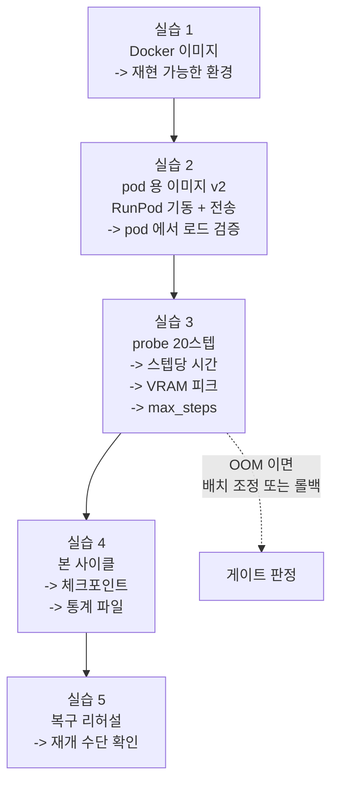

# Week 3 실습: 이미지 빌드 -> RunPod 이관 -> probe 실측 -> 본 사이클


> **실습 목표**: 학습 환경을 컨테이너로 고정해 RunPod 에서 재현하고, probe 로 예산을 확정한 뒤 LoRA 1사이클을 완주한다.
> **예상 시간**: 10-12시간
> **원칙**: 실습 4 (본 사이클) 는 실습 3 (probe 실측) 뒤에만 한다. 스텝당 비용을 모르는 상태로 긴 학습을 걸면 예산을 초과하거나 중간에 끊긴다.


### 이 문서를 읽는 법


- 각 실습은 **무엇을 하나 / 왜 하나 / 끝나면 손에 남는 것** 세 줄로 시작한다.
- `README.md` 는 개념(메모리 산수, 회수 대비의 이유), 이 문서는 절차다.
- **셸 스크립트를 pod 으로 옮길 때는 편집기에 붙여넣지 말고 히어독(`cat > 파일 << 'EOF'`)으로 쓴다.** 인자 줄 끝의 백슬래시 뒤에 주석이나 공백이 한 칸이라도 들어가면 줄 연속이 끊겨, 지정한 인자가 전달되지 않은 채 **기본값으로 실행된다.** `max_steps` 가 그렇게 무시되면 20만 스텝짜리 학습이 시작된다 (실습 4 참고).
- 이번 주는 **돈이 시간당으로 나가는 주차**다. 명령을 실행하기 전에 그 명령이 몇 분 걸릴 일인지 먼저 생각하는 습관이 실질적 절약이 된다.


---


## 0. 이번 주 전체 그림


### 0.1 한 문장으로


> week2 의 환경과 코드 수정을 **Docker 이미지 한 덩어리로 굳혀** 클라우드 GPU 에 올리고, 20스텝만 시험 실행해 "스텝당 몇 초 / VRAM 몇 GB / 시간당 얼마" 를 재고, 그 숫자로 총 스텝 수를 정해 본 학습을 끝까지 돌린 뒤 결과물 4가지를 챙겨 내려온다.


### 0.2 5개 실습이 이어지는 방식





점선이 Section 0 의 게이트다. probe 에서 최소 배치로도 OOM 이 나면 이 계획 자체를 축소해야 하므로, **본 학습보다 먼저 판정한다.**


### 0.3 자주 걸리는 용어 미리 풀기


| 용어 | 뜻 |
|---|---|
| **Dockerfile** | 환경을 어떻게 만들지 적은 조리법 파일. `docker build` 가 이것을 읽어 이미지를 굽는다 |
| **이미지 / 컨테이너** | 이미지는 굳어 있는 스냅샷, 컨테이너는 그것을 실행한 상태 |
| **`FROM`** | 베이스 이미지 지정. 여기서는 CUDA·python·torch 가 이미 들어 있는 이미지를 쓴다 |
| **`ARG` / `COPY` / `RUN`** | 빌드 인자 / 파일 복사 / 명령 실행. Dockerfile 의 기본 명령들 |
| **patch 적용** | week2 에서 뽑은 코드 변경을 다른 환경에서 같은 모양으로 다시 적용하는 것 |
| **핀**(pin) | 패키지 버전을 `==` 로 못 박는 것. 리포의 `pyproject.toml` 이 정해 둔다 |
| **전이 의존성** | 내가 설치한 패키지가 다시 끌고 오는 패키지. 핀이 없으면 설치 시점의 최신이 들어온다 |
| **protobuf** | 구글의 데이터 직렬화 라이브러리. TensorFlow 계열이 내부적으로 쓰며, 버전이 어긋나면 import 단계에서 깨진다 |
| **flash-attn** | 어텐션 연산을 메모리·속도 면에서 최적화한 구현. 학습 스크립트가 기본으로 켜 두므로 없으면 모델 로드에서 막힌다 |
| **레이어**(layer) | Dockerfile 의 `RUN`/`COPY` 한 줄이 만드는 이미지 조각. 덧쌓기라서 뒤에서 지워도 앞 조각의 용량은 남는다 |
| **pod** | RunPod 에서 빌린 GPU 인스턴스 1대 |
| **network volume** | pod 와 분리된 저장소. pod 를 지워도 남는다 |
| **레지스트리**(registry) | 이미지를 올려 두고 다른 곳에서 받아 쓰는 창고. Docker Hub 가 대표적이다 |
| **`sshd`** | SSH 접속을 받아 주는 서버 프로그램. 이것이 켜져 있어야 다른 곳에서 붙거나 파일을 보낼 수 있다 |
| **프록시 SSH** | RunPod 이 중계해 주는 접속(`ssh.runpod.io`). 터미널은 열리지만 원격 명령 실행이 안 되어 파일 전송 도구가 못 돈다 |
| **직접 TCP** | pod 에 붙은 public IP 와 포트로 바로 접속하는 방식. 파일 전송은 이쪽이어야 한다 |
| **`rsync`** | 파일 동기화 도구. `-P` 를 주면 끊긴 지점부터 이어받는다 |
| **`runpodctl`** | RunPod CLI. 일회용 코드로 파일을 주고받는 기능이 있어 SSH 가 막힐 때 쓴다. 재개는 안 된다 |
| **`nvidia-smi`** | GPU 상태·메모리 사용량을 보는 명령 |
| **VRAM 피크** | 실행 중 GPU 메모리 사용량의 최댓값. 이 값이 GPU 용량을 넘으면 OOM |
| **probe** | 본 실행 전 아주 짧게 돌려 시간·메모리를 재는 예비 실행 |
| **`torchrun`** | 분산 학습 실행기. GPU 1개여도 upstream 스크립트가 이 방식으로 실행된다 |
| **`tmux`** | SSH 가 끊겨도 프로세스가 계속 돌게 하는 터미널 세션 관리자 |
| **`tee`** | 출력을 화면에 보여주면서 동시에 파일로도 저장하는 명령 |
| **`set -e`** | 스크립트 중간에 명령이 실패하면 즉시 중단하는 셸 옵션 |
| **`save_steps`** | 몇 스텝마다 체크포인트를 저장할지 |
| **유휴 과금** | 아무 작업도 하지 않지만 pod 가 켜져 있어 붙는 요금 |


### 0.4 어디서 실행하나


| 위치 | 하는 일 |
|---|---|
| 호스트 셸의 `week3/` | Dockerfile 작성, 이미지 빌드, 레지스트리 push, 전송 명령 실행, 기록(`outputs/`) |
| pod 안 `/opt/openvla` | probe / 본 학습 실행 (코드가 있는 곳) |
| pod 의 `/workspace/` | 데이터·체크포인트·로그 착지점. **network volume 이 통째로 여기에 마운트된다** |

pod 의 두 경로가 갈라진 이유는 실습 2 의 2-0 에서 다룬다. 요약하면 volume 이 `/workspace` 를 덮으므로 코드는 그 밖(`/opt`)에 두어야 한다.

**"호스트 셸" 을 강조하는 이유**: 이 레포를 편집하는 VS Code 세션은 그 자체가 컨테이너 안이다. 컨테이너 안에는 docker 명령이 없고 docker 데몬 소켓도 붙어 있지 않아 `docker build` 가 아예 되지 않는다. `docker` 를 설치해도 소용없다 — 명령을 받아 줄 데몬이 컨테이너 밖에 있기 때문이다. 이미지 빌드는 컨테이너를 띄운 **호스트 머신의 셸**에서 한다. 레포는 호스트 디렉터리를 그대로 붙인 것이라 파일을 옮길 필요는 없고, 경로만 호스트 기준으로 바꾸면 된다.


---


## 실습 1: 학습 측 Docker 이미지


**무엇을 하나**: week2 의 환경 구성과 등록 패치를 Dockerfile 로 적어 이미지를 굽고, 등록이 실제로 들어갔는지 컨테이너 안에서 확인한다.
**왜 하나**: 클라우드에서 같은 환경을 다시 만들어야 하는데, 손으로 설치하면 어딘가 달라진다. 그리고 로컬 PC 에 문제가 생겨도 학습을 계속할 수 있는 상태를 남기는 것이 두 번째 목적이다.
**끝나면 손에 남는 것**: `openvla-train:v1` 이미지 + `outputs/image_build.md` (베이스 태그, 기준 커밋, 핀을 깬 패키지와 사유, 버전 목록, 이미지 크기, 겪은 문제).


**파일명**: `Dockerfile`


week2 의 `.venv-rlds` 구성과 등록 패치를 이미지로 고정한다. 목적은 두 가지다 — RunPod 에서 같은 환경을 띄우는 것, 그리고 로컬 장애와 무관하게 재현 가능한 상태를 남기는 것.


```dockerfile
# 학습 측 이미지. sim 은 넣지 않는다 (Vulkan 요구로 난이도가 다르고, eval 은 로컬에서 돈다)
# 베이스의 python 은 openvla 핀에 휠이 있는 버전이어야 한다.
# week2 outputs/env_rlds.md 가 기록했듯 tensorflow==2.15.0 은 python 3.12 용 휠이 없다 -- 3.11 이면 핀이 그대로 선다
FROM pytorch/pytorch:2.4.0-cuda12.1-cudnn9-devel

# 시스템 의존성 (git 은 리포 클론과 패치 적용에 필요)
RUN apt-get update && apt-get install -y --no-install-recommends \
        git rsync && \
    rm -rf /var/lib/apt/lists/*

WORKDIR /workspace

# OpenVLA 본체. 기준 커밋을 고정한다 -- week2 outputs/openvla_base_commit.txt 에 기록한 해시
ARG OPENVLA_COMMIT=c8f03f48af692657d3060c19588038c7220e9af9
RUN git clone https://github.com/openvla/openvla.git && \
    cd openvla && git checkout ${OPENVLA_COMMIT}

# week2 의 등록 변경(3파일)을 패치로 적용. 손으로 다시 고치지 않는다
COPY openvla_registration.patch /tmp/
RUN cd openvla && git apply /tmp/openvla_registration.patch

# 의존성 설치 + 데이터 경로 패키지를 week2 가 검증한 조합으로 덮어쓰기.
# 덮어쓰는 이유: openvla 의 tensorflow==2.15.0 핀이 protobuf 를 4.x 로 묶는데,
#   핀이 없는 전이 의존성 tensorflow-metadata 는 최신이 들어와 protobuf 5.27+ 를 요구한다.
#   그대로 두면 빌드는 성공하고 import 에서 깨진다. 값의 출처는 week2 outputs/pip_freeze_rlds.txt.
# 한 RUN 으로 묶는 이유: 레이어를 나누면 버려질 TF 2.15 가 앞 레이어에 그대로 남아 이미지가 커진다
RUN cd openvla && pip install --no-cache-dir -e . && \
    pip install --no-cache-dir \
        "tensorflow==2.21.0" \
        "tensorflow-datasets==4.9.10" \
        "tensorflow-metadata==1.21.0" \
        "protobuf==6.33.6" && \
    pip uninstall -y tensorflow-addons tensorflow-estimator

# flash-attn. pyproject 45행에 주석으로만 적혀 있어 `pip install -e .` 로는 들어오지 않는다.
# 소스 빌드라 30-90분 걸린다 -- pod 가 아니라 여기서 굽는다 (베이스가 -devel 이라 nvcc 가 있다)
RUN pip install --no-cache-dir packaging ninja && \
    pip install --no-cache-dir "flash-attn==2.5.5" --no-build-isolation

# 데이터셋과 체크포인트는 이미지에 넣지 않는다 -- 실행 시 volume 으로 붙인다
```


Dockerfile 의 각 결정이 왜 그렇게 되어 있는지 풀어 둔다.


| 줄 | 이유 |
|---|---|
| `FROM pytorch/pytorch:...-devel` | CUDA·python·torch 를 직접 설치하는 것은 실패 지점이 많다. 이미 맞춰진 이미지에서 시작한다 |
| `rm -rf /var/lib/apt/lists/*` | apt 캐시를 지워 이미지 크기를 줄인다 (관용적 패턴) |
| `ARG OPENVLA_COMMIT` + `git checkout` | 커밋을 고정하지 않으면 빌드 시점마다 다른 코드가 들어온다. 그러면 패치가 충돌하거나 동작이 달라진다 |
| `COPY` + `git apply` | week2 의 수정을 손으로 다시 하지 않는다. 손으로 하면 컨테이너와 로컬이 미묘하게 달라진다 |
| `pip install -e .` | 리포를 편집 가능한 상태로 설치한다. 컨테이너 안에서 코드를 확인·수정할 수 있다 |
| `--no-cache-dir` | pip 이 받은 휠을 캐시로 남기지 않는다. torch 나 TF 는 휠 하나가 수백 MB - 수 GB 라 캐시가 그대로 이미지 용량이 된다 |
| TF 계열 덮어쓰기 | 커밋을 고정해도 전이 의존성은 빌드 시점의 최신이 들어온다. 리포가 2024년 것이라 그 격차가 protobuf 에서 터진다 |
| `pip uninstall tensorflow-addons` | openvla 가 직접 요구하는 게 아니라 `tensorflow-graphics` 가 끌고 온 것이고, TF 2.16 이상과 맞지 않는다. week2 환경에도 없으며 없는 상태로 `tensorflow_graphics` import 가 통과했다 |
| flash-attn 별도 설치 | 리포의 `pyproject.toml` 이 주석 처리해 두고 "editable install 뒤에 따로 깔라" 고 지시한다. 자동으로 안 들어오는데 학습 경로는 이것을 기본으로 켜 둔다 |
| 데이터를 이미지에 넣지 않음 | 데이터는 수 GB 이고 자주 바뀐다. 이미지는 환경만 담고 데이터는 실행 시 붙인다 |


덮어쓰는 범위를 **데이터 경로 패키지로만** 한정하는 것이 이 Dockerfile 의 판단이다. week2 의 freeze 에는 torch 2.13.0 / timm 1.0.28 도 적혀 있지만 그쪽으로는 따라가지 않는다.

week2 가 통과시킨 검사는 RLDS 로드 검증 하나이고, 그것이 지나는 길은 tfds - tensorflow-metadata - protobuf 로 이어지는 데이터 경로다. torch 와 timm 은 그 검사가 건드리지 않았고, week2 의 값은 핀을 풀었더니 pip 가 끌어온 최신일 뿐 무언가를 통과한 값이 아니다. 반대로 openvla 가 박아 둔 `torch==2.2.0` 은 upstream 이 실제로 학습을 돌려 본 조합이다. 검증되지 않은 쪽으로 모델 경로까지 옮길 이유가 없다.

이 구분은 week2 `outputs/env_rlds.md` 가 세운 "데이터 경로 / 모델 경로" 분류를 그대로 쓴 것이다.

빌드 중에 `openvla 0.0.3 requires tensorflow==2.15.0, but you have tensorflow 2.21.0` 경고가 지나간다. 핀을 의도적으로 깨는 것이므로 정상이고, 에러가 아니라 경고다. week2 도 torch 쪽에서 같은 형태의 메시지를 봤다.


### flash-attn 을 왜 이미지에 굽나


`pyproject.toml` 을 열어 보면 `flash_attn==2.5.5` 가 주석으로 처리되어 있고 "editable install 뒤에 따로 설치하라" 는 안내가 붙어 있다. 즉 `pip install -e .` 만으로는 절대 들어오지 않는다. 그런데 `prismatic/models/backbones/llm/llama2.py` 는 `use_flash_attention_2` 의 기본값을 `True` 로 둔다.


이걸 지금 로컬에서 굽는 이유는 **비용이 아니라 시간의 위치** 때문이다. flash-attn 은 미리 만들어 둔 휠이 아니라 소스에서 컴파일하는 경우가 많고, 그럴 때 30-90분이 걸린다. pod 에 올라가서 이게 없다는 걸 알게 되면 그 컴파일 시간을 시간당 요금을 내며 기다린다. 로컬에서는 전기값만 든다.


반대로 `bitsandbytes` 는 **넣지 않는다.** `vla-scripts/finetune.py` 의 `use_quantization` 기본값이 `False` 이고, §3 에서 4-bit 학습 경로를 쓰지 않기로 했기 때문이다. 스크립트 맨 위의 `BitsAndBytesConfig` import 는 transformers 가 제공하는 것이라 bitsandbytes 없이도 통과한다.


### 이미지 크기


이 이미지는 20GB 를 훌쩍 넘는다. 실습 2 에서 레지스트리에 push 해야 하므로, 크기가 그대로 업로드 시간이 된다. 도커 레이어는 덧쌓기라서 **뒤 레이어에서 지워도 앞 레이어의 용량은 남는다.** 중복이 생기는 자리는 셋이다.


| 중복이 생기는 곳 | 왜 |
|---|---|
| pip 캐시 | 받은 휠을 캐시에 그대로 둔다. `--no-cache-dir` 로 막는다 |
| TF 두 벌 | `-e .` 가 TF 2.15 를 깔고 뒤에서 2.21 로 갈아 끼운다. 한 `RUN` 으로 묶으면 최종 상태만 남는다 |
| torch 두 벌 | 베이스의 torch 와 openvla 핀의 `torch==2.2.0` 이 다르면 두 벌이 쌓인다 |


앞의 둘은 위 Dockerfile 이 이미 처리한다. 세 번째는 베이스 태그를 openvla 핀과 같은 torch 버전으로 고르면 사라지는데, 베이스를 바꾸면 python 버전도 함께 바뀐다는 점을 기억해야 한다. 바꾸기로 했다면 **빌드 전에** 후보 태그의 python 버전을 확인하고, 그 python 에서 위에 적은 TF 버전들이 설치되는지부터 본다. 베이스만 갈아 끼우고 나머지가 따라올 거라고 가정하면 안 된다.


```bash
docker run --rm <후보 태그> python -V
```


빌드와 검증:


빌드는 **호스트 셸**에서 한다 (§0.4). 그리고 `Dockerfile` 과 패치가 같은 디렉터리에 있어야 하므로 `week3/` 에서 실행한다 — `outputs/` 는 기록물 자리이고, 거기서 실행하면 빌드 컨텍스트에 패치가 없어 `COPY` 단계에서 멈춘다.


```bash
cd "<호스트에서 레포가 있는 경로>/Studies/Phase 4.5/week3"
ls Dockerfile                                           # 여기 있어야 한다. outputs/ 가 아니다
cp ../week2/outputs/openvla_registration.patch .        # 이미지 빌드 컨텍스트로 복사
docker build -t openvla-train:v1 .                      # 빌드
```


`docker build` 가 성공했다는 것은 "명령들이 오류 없이 끝났다" 는 뜻일 뿐, **내 등록이 코드에 들어갔다는 뜻이 아니다.** 패치가 빈 파일이거나 경로가 어긋나도 빌드는 성공할 수 있다. 그래서 아래 네 가지를 컨테이너 안에서 직접 확인한다. 넷 다 통과해야 실습 1 이 닫힌다.


#### 검사 1: mixture 가 등록됐나


```bash
docker run --rm openvla-train:v1 python -c \
  "from prismatic.vla.datasets.rlds.oxe.mixtures import OXE_NAMED_MIXTURES; \
   print([k for k in OXE_NAMED_MIXTURES if 'maniskill' in k])"
```


`['maniskill_pickcube_only']` 가 나와야 한다. 이 한 줄은 생각보다 넓게 덮는다 — `prismatic.vla.datasets...` 를 부르면 `prismatic/__init__.py` 부터 dlimp - tfds - tensorflow-metadata - protobuf 까지 데이터 경로 전체가 딸려 온다. 그래서 등록 확인과 의존성 정합성 확인이 한 번에 닫힌다.


| 나오는 것 | 뜻 |
|---|---|
| `['maniskill_pickcube_only']` | 통과 |
| 빈 목록 `[]` | 패치가 적용되지 않았거나 파일 경로가 어긋났다 |
| `ImportError` / `ModuleNotFoundError` | 등록 이전 단계의 문제다. 의존성 버전을 먼저 맞춰야 한다 |


#### 검사 2: 세 등록이 서로 맞물리나


```bash
docker run --rm openvla-train:v1 python -c "
from prismatic.vla.datasets.rlds.oxe.mixtures import OXE_NAMED_MIXTURES
from prismatic.vla.datasets.rlds.oxe.configs import OXE_DATASET_CONFIGS
from prismatic.vla.datasets.rlds.oxe.transforms import OXE_STANDARDIZATION_TRANSFORMS
for name, w in OXE_NAMED_MIXTURES['maniskill_pickcube_only']:
    print(name, w, name in OXE_DATASET_CONFIGS, name in OXE_STANDARDIZATION_TRANSFORMS)
"
```


`maniskill_pickcube 1.0 True True` 가 나와야 한다. mixture 이름은 `maniskill_pickcube_only` 인데 출력에 찍히는 데이터셋 이름은 `maniskill_pickcube` 로 다르다 — mixture 는 "데이터셋 여러 개를 비율로 묶은 이름" 이고 그 안의 원소가 데이터셋 이름이기 때문이다. 여기서는 데이터셋이 하나뿐이라 한 줄만 나온다.


검사 1 이 왜 부족한지가 여기 있다. week2 패치는 파일 셋을 건드리는데 검사 1 은 그중 `mixtures.py` 만 본다. `git apply` 는 all-or-nothing 이라 셋 다 적용된 것은 맞지만, **mixture 가 가리키는 데이터셋 이름과 나머지 두 곳의 키가 같은지는 별개 문제**다. 한 글자만 어긋나도 패치는 깔끔히 적용되고 학습 시작 시 `KeyError` 로 죽는다. `False` 가 하나라도 보이면 패치의 키 이름을 맞춰 다시 굽는다.


#### 검사 3: 컨테이너에서 GPU 가 보이나


```bash
docker run --rm --gpus all openvla-train:v1 python -c \
  "import torch; print(torch.__version__, torch.cuda.is_available(), torch.cuda.get_device_name(0))"
```


`True` 와 GPU 이름이 나와야 한다. `--gpus all` 을 빼면 `cuInit` 실패와 드라이버 미검출 경고가 뜨는데, 검사 1-2 에서는 GPU 를 쓰지 않으니 그 경고는 무시해도 된다. 여기서만 확인하면 된다.


#### 검사 4: 버전이 의도대로 갈렸나


```bash
docker run --rm openvla-train:v1 pip list | \
  grep -iE "^torch|^timm|^transformers|^tensorflow|^protobuf|^peft|^flash"
docker images openvla-train:v1
```


데이터 경로는 week2 값, 모델 경로는 openvla 핀 — 이렇게 갈려 있어야 한다. 눈으로 확인할 것:


| 항목 | 기대 |
|---|---|
| tensorflow / tfds / tf-metadata / protobuf | week2 `pip_freeze_rlds.txt` 의 값과 일치 |
| torch / torchvision / timm | openvla `pyproject.toml` 의 핀과 일치 |
| tensorflow-addons, tensorflow-estimator | 목록에 없어야 한다 |
| flash-attn | 목록에 있어야 한다 |


`docker images` 의 크기는 다음 주 push 시간을 가늠하는 값이므로 그대로 기록에 옮긴다.


**통과 판정**: 검사 1-4 를 모두 통과한다. 하나라도 걸리면 고쳐서 다시 굽는다 — 여기서 넘어간 문제는 다음 주에 요금을 내며 만난다.


**기록할 것** (`outputs/image_build.md`): 베이스 이미지 태그, 기준 커밋, **핀을 깬 패키지와 그 사유**, 검사 4 의 버전 목록, 이미지 크기, 빌드 중 겪은 문제. 이 기록은 week4 의 버전 호환성 대조에서 학습 측 버전 목록으로 인용되므로, 리포의 `pyproject.toml` 과 다른 값이 들어간 항목은 빠짐없이 적는다.


---


## 실습 2: RunPod 기동 + 이관


**무엇을 하나**: 실습 1 의 이미지를 pod 에서 뜨는 형태로 고쳐 레지스트리에 올리고, 24GB GPU pod 를 만들어 network volume 을 붙이고, RLDS 데이터셋을 전송한 뒤 **pod 안에서 week2 의 로드 검증을 다시 돌린다.**
**왜 하나**: "클라우드에서 같은 환경이 재현된다" 를 확인하는 것이 Section 0 의 항목이다. 로컬에서 통과한 검사가 pod 에서도 통과해야 그 항목이 닫힌다.
**끝나면 손에 남는 것**: 레지스트리에 올라간 `openvla-train:v2` + 돌아가는 pod + `outputs/runpod_setup.md` (GPU 종류, 요금, volume 경로, 전송 시간, 검증 통과 여부).


**산출물**: `outputs/runpod_setup.md`


절차의 정본은 [`Studies/Phase 4/SETUP.md`](../../Phase%204/SETUP.md) §5 다. 여기서는 이번 학습에 필요한 항목만 확인한다. **요금은 셋업 시점에 직접 확인한다** — 변동하므로 자료에 수치를 박아 두지 않는다.


### 2-0. v1 을 pod 용으로 고친다 (v2)


실습 1 의 이미지는 로컬에서만 검증됐다. pod 에 그대로 올리면 두 곳에서 막히는데, 둘 다 **pod 를 띄운 뒤에 = 요금을 내며** 발견되는 종류다.


| 막히는 곳 | 이유 |
|---|---|
| `import prismatic` 이 실패한다 | network volume 은 pod 의 `/workspace` 에 마운트되어 **이미지 안의 `/workspace/openvla` 를 통째로 가린다.** v1 은 거기에 코드를 두고 editable install 을 걸었으므로, 파이썬이 따라가는 링크가 빈 경로를 가리키게 된다 |
| SSH 로 붙을 수도, rsync 를 쓸 수도 없다 | RunPod 은 `PUBLIC_KEY` 환경변수로 공개키를 넣어 줄 뿐이고 **sshd 는 이미지가 갖춰야 한다.** 공식 템플릿에는 들어 있지만 베이스인 `pytorch/pytorch` 에는 없다 |


두 번째 줄은 2-3 의 전제이기도 하다. RunPod 의 프록시 접속(`ssh.runpod.io`) 은 원격 명령 실행을 거부해 rsync 가 그 위에서 돌지 않는다. **직접 TCP 로 노출된 sshd** 가 있어야 rsync 가 성립한다.


고치는 방법은 v1 을 다시 굽는 것이 아니라 그 위에 얇은 한 겹을 얹는 것이다. flash-attn 레이어를 건드리지 않으므로 재컴파일이 없다 (수 분).


**파일명**: `Dockerfile.pod`


```dockerfile
# pod 배포용 한 겹. 실습 1 의 이미지를 베이스로 삼는다
FROM openvla-train:v1

# RunPod 커스텀 이미지는 sshd 를 스스로 갖춰야 한다.
# rsync 도 이 sshd 위에서 돈다.
# 호스트 키를 지우는 이유: openssh-server 설치 과정이 빌드 시점에 키를 만들어
#   이미지에 구워 넣는다. 그대로 두고 public repository 에 올리면 그 개인키를
#   누구나 받을 수 있어 중간자 공격을 탐지하지 못한다.
#   시작 스크립트의 ssh-keygen -A 가 컨테이너마다 새로 만든다
RUN apt-get update && apt-get install -y --no-install-recommends openssh-server && \
    mkdir -p /var/run/sshd && \
    rm -f /etc/ssh/ssh_host_* && \
    rm -rf /var/lib/apt/lists/*

# network volume 이 /workspace 를 덮으므로 코드를 볼륨 밖으로 옮긴다.
# --no-deps: 의존성 재해석을 막는다 (pyproject 의 tensorflow==2.15.0 핀이
#   week2 조합을 되돌리는 것을 차단 -- 실습 1 이 겪은 문제 §1 과 같은 뿌리)
RUN cp -a /workspace/openvla /opt/openvla && \
    pip install --no-cache-dir --no-deps -e /opt/openvla

# 컨테이너 시작 스크립트
COPY runpod_start.sh /usr/local/bin/runpod_start.sh
RUN chmod +x /usr/local/bin/runpod_start.sh

WORKDIR /opt/openvla
CMD ["/usr/local/bin/runpod_start.sh"]
```


**파일명**: `runpod_start.sh`


```bash
#!/bin/bash
# pod 컨테이너가 뜰 때 실행되는 스크립트
set -e

# SSH 로 들어온 셸은 Docker 의 환경변수를 물려받지 않는다. 파일로 남겨야 보인다.
#   PATH 가 빠지면 conda 의 python 을 못 찾아 `python: command not found` 가 나고,
#   LD_LIBRARY_PATH / CUDA_HOME 이 빠지면 학습에서 CUDA 라이브러리를 못 찾으며,
#   HF_HOME 이 빠지면 15GB 짜리 모델이 volume 이 아니라 pod 기본 디스크로 떨어진다
# `|| true` 가 필요한 이유: grep 은 매치가 하나도 없으면 실패를 반환하고,
#   set -e 가 그것을 보고 스크립트를 여기서 끝내 버린다. 그러면 sshd 가 뜨지 않는다
env | grep -E '^(PATH|LD_LIBRARY_PATH|CUDA_HOME|HF_HOME|HF_TOKEN|HUGGINGFACE)=' \
    >> /etc/environment || true

# RunPod 이 주입한 공개키를 등록해야 내 키로 접속할 수 있다
mkdir -p /root/.ssh
echo "${PUBLIC_KEY}" >> /root/.ssh/authorized_keys
chmod 700 /root/.ssh && chmod 600 /root/.ssh/authorized_keys

# 호스트 키 생성 후 sshd 기동
ssh-keygen -A
/usr/sbin/sshd

# 마지막 줄이 컨테이너를 살려 둔다.
# sshd 는 백그라운드로 빠지므로 이 줄이 없으면 시작 명령이 끝나고 pod 가 죽는다
sleep infinity
```


빌드와 검증은 실습 1 과 같은 이유로 **호스트 셸**에서 한다 (§0.4).


```bash
# 2-0-1. 빌드
docker build -f Dockerfile.pod -t openvla-train:v2 .


# 2-0-2. 볼륨이 /workspace 를 덮은 상태에서 코드가 살아 있나
#   pod 의 network volume 은 이미지의 /workspace 를 그냥 "가린다".
#   tmpfs 로 덮는 것이 그 재현이다.
#   도커의 named volume(-v vol:/workspace) 을 쓰면 안 된다 -- 비어 있는 볼륨은
#   첫 마운트 때 이미지의 해당 경로 내용을 볼륨 안으로 복사해 넣기 때문에
#   가려지지 않고, 검사가 통과해 버린다 (재현 실패)
docker run --rm --mount type=tmpfs,destination=/workspace openvla-train:v2 \
    python -c "import prismatic; print('ok')"


# 2-0-2 대조. 같은 조건에서 v1 은 실패해야 한다.
#   통과와 실패가 갈려야 "v2 가 고쳤다" 가 확인된다.
#   둘 다 통과하면 애초에 가려짐 문제가 없었다는 뜻이므로 그 사실을 기록한다
docker run --rm --mount type=tmpfs,destination=/workspace openvla-train:v1 \
    python -c "import prismatic; print('ok')"


# 2-0-3. SSH 가 실제로 붙나 (pod 에서 처음 확인하면 그 시간이 요금이다)
docker run -d --name sshtest -p 2222:22 \
    -e PUBLIC_KEY="$(cat ~/.ssh/id_ed25519.pub)" openvla-train:v2
sleep 5                              # sshd 가 뜰 시간을 준다
docker ps --filter name=sshtest      # STATUS 가 Up 이어야 한다. 행이 없으면 죽은 것
docker logs sshtest                  # 죽었으면 여기에 이유가 남는다
ssh -p 2222 root@localhost 'python -c "import prismatic; print(\"ok\")"'
docker rm -f sshtest


# 2-0-4. 레지스트리에 올린다. pod 는 여기서 받아 간다
docker login -u <docker-id>                      # 비밀번호 대신 Access Token 을 쓴다
docker tag openvla-train:v2 <docker-id>/openvla-train:v2
time docker push <docker-id>/openvla-train:v2    # 시간을 재서 기록한다
```


**통과 판정**


| 검사 | 통과 모습 |
|---|---|
| 2-0-2 (v2) | 마지막 줄에 `ok`. 앞의 CUDA 드라이버 경고와 `cuInit ... (303)` 은 GPU 를 붙이지 않았으니 정상이다 |
| 2-0-2 대조 (v1) | `ModuleNotFoundError`. **v2 와 결과가 갈려야** 이 변경이 무언가를 고쳤다는 근거가 된다 |
| 2-0-3 | `docker ps` 에 STATUS `Up`, 그리고 ssh 로 실행한 명령이 `ok` 를 낸다 |


검사가 통과하는 것만큼 **대조가 실패하는 것도 확인해야 한다.** 통과만 보면 원래부터 되던 것과 구분되지 않는다 — week2 §8 의 "조용한 실패" 와 같은 구조다.


2-0-3 이 `Connection refused` 나 `Connection reset` 으로 실패하면 컨테이너가 죽은 것이다. **ssh 를 다시 시도하지 말고 `docker logs` 부터 본다.** 시작 스크립트가 어디서 끝났는지가 거기 남는다. `docker rm -f` 를 먼저 치면 로그도 함께 사라지므로 순서를 지킨다.


접속은 되는데 `python: command not found` 가 나오면 컨테이너가 아니라 **환경변수 전달**이 문제다. 위 시작 스크립트의 `/etc/environment` 줄이 그것을 다룬다.


호스트 키는 컨테이너가 새로 뜰 때마다 새로 생성된다. 같은 주소로 다시 접속하면 ssh 가 "호스트 키가 바뀌었다" 며 거부하므로, 그때는 이전 항목을 지운다 (`ssh-keygen -R "[localhost]:2222"`). pod 를 재기동하는 실습 5 에서도 같은 일이 일어난다.


### 2-1. pod 생성


| 설정 | 값 | 이유 |
|---|---|---|
| GPU | 24GB 급 (RTX 4090) | VRAM 이 27GB 하한에 가까워 배치 조정이 필요하다 (README §1) |
| network volume | 먼저 만들어서 붙인다 | pod 를 멈춰도 남는다. **볼륨이 있는 데이터센터의 GPU 만 고를 수 있으므로 4090 재고를 먼저 확인하고 볼륨을 만든다** |
| 컨테이너 이미지 | `<docker-id>/openvla-train:v2` | 2-0 에서 올린 것 |
| 시작 명령 | 비워 둔다 | 이미지의 `CMD` 를 쓴다 |
| 노출 포트 | TCP 22 + public IP | 2-0 표의 두 번째 줄. 없으면 rsync 가 안 된다 |
| container disk | 이미지가 풀릴 자리 + 여유 | 23GB 급 이미지라 기본값으로는 부족하다 |
| 환경변수 | `HF_HOME=/workspace/hf`, `HF_TOKEN=<토큰>` | base 가중치 15GB 를 volume 에 받아 pod 재생성 시 다시 받지 않게 한다 |


### 2-2. 접속 직후 확인 (요금이 흐르기 시작한다)


pod 이 떴으면 먼저 환경을 확인한다. 여기서 걸리면 뒤 작업이 전부 무의미하므로 순서를 앞에 둔다.


```bash
# pod 에서
python -c "import prismatic; print('ok')"                       # 코드와 패치
python -c "import flash_attn; print(flash_attn.__version__)"    # GPU 아키텍처가 다르면 여기서 걸린다
python -c "import torch; print(torch.__version__, torch.cuda.is_available(), torch.cuda.get_device_name(0))"
nvidia-smi                                                       # GPU 와 VRAM 용량
df -h /workspace                                                 # network volume 이 붙었나
echo $HF_HOME                                                    # 환경변수가 SSH 세션에 넘어왔나
```


`flash_attn` 을 두 번째에 두는 이유: 이미지의 flash-attn 은 로컬 GPU 환경에서 컴파일된 바이너리다. pod 의 GPU 세대가 다르면 여기서 실패하고, 그러면 GPU 선택을 바꿔 pod 를 다시 만들어야 한다.


TensorFlow 가 `Failed to determine cuDNN version` / `Skipping registering GPU devices` 를 내는 것은 정상이다. TF 는 데이터 로딩만 담당하고 그것은 CPU 작업이다. **오히려 TF 가 GPU 를 잡으면 VRAM 을 선점해 학습을 방해한다.** 학습을 수행하는 것은 torch 이므로 위 세 번째 줄의 `True` 가 판정 기준이다.


### 2-3. 데이터 전송


두 가지 경로가 있고, 어느 쪽이 되는지는 **pod 가 직접 TCP 접속을 제공하는지**에 달렸다. pod 상세의 Connect 를 열어 확인한다.


| Connect 에 있는 항목 | rsync | 쓸 방법 |
|---|---|---|
| `ssh root@<IP> -p <포트>` (SSH over exposed TCP) | 된다 | rsync |
| `ssh <id>@ssh.runpod.io` (프록시) 만 있다 | **안 된다** | `runpodctl` |


프록시로 rsync 가 안 되는 이유: 프록시는 대화형 셸만 열어 주고 **원격 명령 실행을 거부한다**(`Error: Your SSH client doesn't support PTY`). rsync 는 원격에서 rsync 를 실행해 파이프로 통신하는 구조라 그 위에서 돌 수 없고, `tar | ssh ... 'tar -x'` 같은 우회도 같은 이유로 막힌다.


전송 전에 준비가 하나 있다. **데이터셋이 VS Code 컨테이너 안에만 있다** — 호스트에는 없으므로 호스트 셸에서 경로를 찾지 못한다. `/workspace` 가 호스트 마운트라는 점을 이용해 꺼낸다. 검증 스크립트도 함께 보낸다 (pod 에는 없다).


```bash
# VS Code 컨테이너에서 -- 호스트가 보는 경로로 꺼낸다 (레포 밖에 둔다)
mkdir -p /workspace/xfer
cp -a /root/tensorflow_datasets/maniskill_pickcube /workspace/xfer/
cp "<레포>/Studies/Phase 4.5/week2/practice_load_check.py" /workspace/xfer/
```


**경로 A — 직접 TCP 가 있을 때**


```bash
# 호스트 셸에서. 포트와 IP 는 Connect 의 SSH over exposed TCP 항목에서 읽는다
ssh -p <포트> root@<public-ip> 'mkdir -p /workspace/data'
cd <호스트의 xfer 경로>
rsync -avP -e "ssh -p <포트>" maniskill_pickcube practice_load_check.py \
    root@<public-ip>:/workspace/data/
```


**경로 B — 프록시만 있을 때 (`runpodctl`)**


```bash
# 양쪽에 설치 (우리 이미지에는 없다)
wget -qO- cli.runpod.net | bash          # pod. 호스트에서는 | sudo bash

# 호스트에서 보내기 -- 코드가 출력되고, 이 터미널은 전송이 끝날 때까지 열어 둔다
cd <호스트의 xfer 경로>
tar czf pickcube.tar.gz maniskill_pickcube practice_load_check.py
runpodctl send pickcube.tar.gz

# pod 에서 받기
mkdir -p /workspace/data && cd /workspace/data
runpodctl receive <출력된 코드>
tar xzf pickcube.tar.gz && rm pickcube.tar.gz
```


`runpodctl` 은 일회용 코드로 P2P 전송을 한다. SSH 도 API 키도 쓰지 않아 프록시 제약을 우회하지만 **재개 기능이 없다.** 데이터셋은 250MB 급이라 문제가 없지만, 실습 4 에서 체크포인트 15GB 를 내릴 때는 재개가 되는 rsync 가 필요하다 — 그래서 직접 TCP 유무를 **지금** 확인해 두어야 한다.


### 2-4. 전송 대조 (조용한 손실을 막는다)


양쪽에서 같은 두 숫자를 뽑아 비교한다. 전송이 중간에 끊겨도 파일이 일부 남아 성공한 것처럼 보이기 때문이다.


```bash
# 로컬(컨테이너)에서는 ~/tensorflow_datasets/maniskill_pickcube,
# pod 에서는 /workspace/data/maniskill_pickcube 를 대상으로 각각 실행
find <경로> -type f | wc -l
find <경로> -type f -printf '%s\n' | awk '{s+=$1} END {print s}'
```


두 번째 명령이 파일 바이트의 합이다. `du -sb` 대신 이것을 쓰는 이유는 **디렉터리 엔트리 크기가 파일시스템마다 달라** pod 의 network volume 과 로컬 값이 어긋나기 때문이다. 파일 바이트만 더하면 그 차이가 사라진다.


### 2-5. pod 안에서 로드 검증


week2 실습 4 와 **같은 스크립트**를 돌린다. 스크립트를 고치는 대신 링크로 경로를 맞춘다 — 그래야 "같은 코드가 통과했다" 가 성립한다.


```bash
# pod 에서
ln -s /workspace/data /root/tensorflow_datasets
cd /opt/openvla && python /workspace/data/practice_load_check.py
```


`ln -s A B` 는 B 라는 이름으로 A 를 가리키는 바로가기를 만든다. 데이터는 volume 에 두고 스크립트가 기대하는 경로만 맞추는 것이다.


**판정 기준** — 로컬 출력과 대조할 항목은 이 셋이다.


| 항목 | 기준 |
|---|---|
| 구조 | 배치 키 목록, `image_primary` shape, `action` shape/dtype, instruction 문자열이 로컬과 같다 |
| **통계 파일 해시** | 로그에 `Loading existing dataset statistics from ...dataset_statistics_<해시>.json` 이 뜨고 그 해시가 week2 것과 같다 |
| 값의 범위 | 정규화된 차원이 -1 - 1 안에 있다 |


두 번째 줄이 가장 중요하다. `Loading existing` 이 아니라 새로 계산했다면 통계 파일이 전송에서 빠진 것이고, **그러면 정규화 기준이 달라져 추론의 `unnorm_key` 가 어긋난다** (README §6).


반대로 **dim 별 min/max 값 자체는 로컬과 달라도 정상**이다. 로더에 `shuffle_buffer_size` 가 걸려 있어 실행마다 다른 샘플이 나온다. 배치에 샘플이 하나뿐이라 `min` 과 `max` 가 같게 보이는 것도 정상이다.


**기록할 것** (`outputs/runpod_setup.md`)

| 항목 | 값 |
|---|---|
| GPU 종류 / VRAM | |
| 시간당 요금 (확인 시점 명기) | |
| 데이터센터 / 선택 이유 | |
| network volume 크기 / 마운트 경로 | |
| 이미지 push 소요 시간 / 레지스트리 | |
| v2 에서 바꾼 것과 그 이유 | |
| SSH 접속 방식 (프록시 / 직접 TCP) | |
| 데이터 전송 시간 / 용량 | |
| pod 에서 로드 검증 통과 여부 (출력 전문) | |


> 2-5 가 Section 0 의 "RunPod 에서 컨테이너 기동 + 재현 확인" 항목을 닫는다. 통과 로그를 남긴다.


---


## 실습 3: probe 실측 + 게이트 판정


**무엇을 하나**: 스텝 수를 20 정도로 아주 짧게 잡아 학습을 실행하고, 스텝당 시간과 VRAM 피크를 재서 본 학습의 총 스텝 수·예상 비용을 역산한다.
**왜 하나**: 기본 설정으로 본 학습을 걸면 끝나지 않는다 (README §4). 그리고 24GB 에서 OOM 없이 도는 배치 조합을 여기서 찾아야 한다 — 본 학습 3시간째에 OOM 으로 죽으면 그 시간과 비용이 그대로 손실이다.
**끝나면 손에 남는 것**: `outputs/probe_measure.md` (실측치 + 확정한 `max_steps`) + Section 0 게이트 판정.


**파일명**: `practice_probe_run.sh`


짧게 돌려 **스텝당 시간과 VRAM 피크**를 재고, 그 값으로 본 사이클을 설계한다.


```bash
#!/bin/bash
# 실습 3: 짧은 probe 로 스텝당 시간·VRAM 을 실측
set -e                                          # 실패 시 즉시 중단


cd /opt/openvla


# 3-1. 인자 이름과 기본값을 먼저 확인한다 (버전에 따라 다를 수 있다)
grep -n "batch_size\|grad_accumulation_steps\|max_steps\|save_steps\|lora_rank\|dataset_name\|data_root_dir\|run_root_dir\|adapter_tmp_dir" \
    vla-scripts/finetune.py | head -20


# 3-2. wandb 가 대화형 질문을 띄우지 않게 한다.
#   본 사이클은 몇 시간을 무인으로 돌리므로 프롬프트에서 멈추면 그 시간이 요금이다
export WANDB_MODE=offline


# 3-3. VRAM 을 백그라운드로 기록 (피크를 놓치지 않기 위해)
nvidia-smi --query-gpu=memory.used --format=csv -l 2 > /workspace/probe_vram.csv &
SMI_PID=$!
trap 'kill $SMI_PID 2>/dev/null' EXIT           # 학습이 실패로 중단돼도 기록 프로세스를 정리


# 3-4. probe 실행 -- 스텝 수를 아주 작게 둔다
#   배치 조합은 24GB 에 맞춰 찾는다: batch_size 를 낮추고 grad_accumulation_steps 를 올려
#   유효 배치를 유지한다 (README §2). 아래는 시작점이며 OOM 이면 batch 를 더 낮춘다.
time torchrun --standalone --nnodes 1 --nproc-per-node 1 vla-scripts/finetune.py \
  --vla_path "openvla/openvla-7b" \
  --data_root_dir /workspace/data \
  --dataset_name maniskill_pickcube_only \
  --run_root_dir /workspace/runs \
  --adapter_tmp_dir /workspace/adapter-tmp \
  --lora_rank 32 \
  --batch_size 1 \
  --grad_accumulation_steps 16 \
  --max_steps 20 \
  --save_steps 1000


kill $SMI_PID                                   # VRAM 기록 종료
sort -t, -k1 -n /workspace/probe_vram.csv | tail -1   # 피크 값 확인
du -sh /workspace/hf /workspace/runs /workspace/data  # volume 사용량 (df 로는 안 보인다)
```


스크립트의 낯선 부분:


- 3-1 을 먼저 하는 이유: 인자 이름이 버전마다 다르다. 이름을 확인하지 않고 실행하면 "인식되지 않은 인자" 로 죽거나, 더 나쁘게는 **조용히 기본값이 쓰인다.** `max_steps` 가 무시되면 20만 스텝짜리 학습이 시작된다.
- `--adapter_tmp_dir /workspace/adapter-tmp`: **기본값이 상대 경로(`adapter-tmp`)라 컨테이너 안에 떨어진다.** 그 경로는 pod 를 멈추면 지워지므로 LoRA 어댑터 원본이 사라진다. 머지된 가중치는 `run_root_dir` 에 남으니 학습 결과 자체를 잃는 것은 아니지만, rank 를 바꿔 비교하거나 머지를 다시 하려면 어댑터가 필요하다 (README §7). volume 경로를 명시해 둔다.
- `--save_steps 1000` 을 `max_steps` 보다 크게 두는 이유: **probe 는 스텝당 시간을 재는 것이 목적이고, 저장은 그 측정을 오염시킨다.** 저장 한 번에 base 를 다시 읽어 머지하고 15GB 를 쓰므로 스텝 시간보다 훨씬 오래 걸린다. 게다가 저장 조건이 배치 루프 안에 있어 **grad accumulation 횟수만큼 같은 스텝이 중복 저장된다** — 20스텝 probe 가 10분을 넘길 수 있다. 저장 동작 자체의 검증은 실습 4 에서 한다.
- `-l 2` (2초 간격): 20스텝이 1분 안쪽이라 5초 간격이면 표본이 10개 남짓이다. 피크를 놓칠 수 있어 간격을 줄인다.
- `du -sh` 를 쓰는 이유: network volume 이 공유 파일시스템이라 **`df` 가 쿼터가 아니라 클러스터 전체 용량(수 PB) 을 보여준다.** 볼륨이 얼마나 찼는지는 `du` 로 직접 재야 한다.
- `nvidia-smi ... -l 2 &`: 2초마다 GPU 메모리 사용량을 파일에 적는다. 끝의 `&` 는 백그라운드 실행이다. 학습이 끝난 뒤에 `nvidia-smi` 를 한 번 찍으면 **피크는 이미 지나가 있으므로** 계속 기록해야 한다.
- `SMI_PID=$!`: 방금 백그라운드로 띄운 프로세스의 번호를 저장한다. 나중에 `kill $SMI_PID` 로 그 기록만 정확히 끝낸다.
- `trap '...' EXIT`: 스크립트가 어느 지점에서 끝나든(오류 포함) 지정한 명령을 실행한다. `set -e` 로 학습이 중간에 죽어도 백그라운드 `nvidia-smi` 가 고아로 남지 않게 한다.
- `time`: 뒤따르는 명령의 소요 시간을 재서 마지막에 출력한다. 이 값에서 모델 로딩 시간을 분리해야 스텝당 시간이 나온다 (로딩은 수 분 걸리고 스텝 수에 비례하지 않는다).
- `--run_root_dir /workspace/runs`: 결과가 **volume 에 떨어지도록** 지정한다. pod 기본 디스크에 저장하면 회수 시 사라진다 (README §5).
- `sort -t, -k1 -n ... | tail -1`: csv 를 숫자로 정렬해 마지막 줄, 즉 최댓값을 본다.


### 3-5. 배치를 올릴 여지가 있는지 확인


VRAM 피크가 용량보다 한참 낮으면 `batch_size` 를 올리고 `grad_accumulation_steps` 를 같은 비율로 낮출 수 있다. **유효 배치는 그대로 유지되면서 gradient step 하나에 필요한 micro-batch 횟수가 줄어들어 시간이 준다.** micro-batch 하나의 시간이 배치 크기에 정비례하지는 않기 때문이다 (배치가 작으면 GPU 가 놀고 있다).


```bash
# 유효 배치 16 을 유지하면서 batch 를 2 로: 2 x 8 = 16
# 위 3-4 와 같은 명령에서 두 줄만 바꿔 다시 돌린다 (20스텝이라 몇 분)
  --batch_size 2 \
  --grad_accumulation_steps 8 \
```


| 결과 | 조치 |
|---|---|
| VRAM 이 용량의 90% 미만이고 스텝당 시간이 줄었다 | 본 사이클을 이 조합으로 |
| OOM 또는 VRAM 이 90% 이상 | 이전 조합 유지 |


90% 를 경계로 두는 이유: 몇 시간짜리 학습에서 여유 없는 조합은 위험하다. 배치 안의 시퀀스 길이가 흔들리면 피크가 조금씩 올라가고, 3시간째에 OOM 으로 죽으면 그 시간과 비용이 그대로 손실이다.


**계산해 기록할 것** (`outputs/probe_measure.md`)

| 항목 | 값 | 계산 |
|---|---|---|
| gradient step 당 시간 | | **tqdm 이 보고한 `s/it` 를 그대로 쓴다.** 총 시간을 스텝 수로 나누면 로딩 시간이 섞여 과대평가된다 |
| VRAM 피크 / 용량 | | 3-4 의 `sort ... tail -1` 출력 |
| OOM 없이 성립한 배치 조합 | | batch x grad accumulation = 유효 배치 |
| 1 epoch 에 필요한 스텝 | | 데이터셋 프레임 수 / 유효 배치 |
| 저장 이벤트 1회 소요 | | 저장이 걸린 실행의 총 시간 - 학습 구간 시간 |
| 확정한 `max_steps` / `save_steps` | | 아래 규칙 |
| 1사이클 예상 시간 / 비용 | | (스텝 x 스텝당 시간) + (저장 횟수 x 저장 1회) + 로딩, x 시간당 요금 |


`max_steps` 를 정하는 규칙은 둘이다.


- **epoch 으로 먼저 감을 잡는다.** 데이터가 작으면 적은 스텝으로도 여러 epoch 을 돈다. 소규모 데이터 LoRA 는 수 epoch 규모가 통상 범위이고, 무작정 크게 잡으면 과적합과 비용만 늘어난다
- **`save_steps` 의 배수로 맞춘다.** 저장 조건(`finetune.py:321`)이 `gradient_step_idx % save_steps == 0` 이고 종료 조건(`367`)이 그 뒤에 평가되므로, 배수가 아니면 **마지막 학습 상태가 저장되지 않고 끝난다**


그리고 예산 상한을 꽉 채우지 않는다. 스텝당 시간은 데이터 로딩 상황에 따라 흔들리고, 저장 시간이 학습 시간의 10-30% 를 차지한다.


**게이트 판정** (Roadmap Section 0)

| 판정 | 조건 | 다음 |
|---|---|---|
| 통과 | OOM 없이 돌고, 예산 안에서 의미 있는 스텝 수가 가능 | 실습 4 |
| 조건부 | 배치를 최소로 해도 아슬아슬하거나 시간이 예산을 넘김 | 데이터 규모 축소 또는 스텝 수 하향 후 재판정 |
| 실패 | 최소 배치에서도 OOM | 롤백 옵션 B — 경량 adaptation 으로 축소 (Roadmap §컴퓨트) |


> `max_steps` 를 지정하지 않으면 기본값이 사전학습급이라 끝나지 않는다 (README §4). probe 의 목적이 이 값을 정하는 것이다.


---


## 실습 4: 본 LoRA 1사이클


**무엇을 하나**: probe 에서 확정한 값으로 본 학습을 끝까지 돌리고, 학습이 남긴 결과물 4가지가 실제로 있는지 목록으로 확인한다.
**왜 하나**: Section 0 의 "LoRA 1사이클이 RTX 4090 에서 가능한지" 를 추정이 아니라 완주로 확정하는 단계다. 그리고 다음 주가 쓸 재료를 만드는 단계다.
**끝나면 손에 남는 것**: 머지 체크포인트 + LoRA 어댑터 + **통계 파일** + 학습 설정 + `outputs/train_log.md`.


**파일명**: `practice_train_cycle.sh`


먼저 tmux 세션을 만들고 **그 안에서** 스크립트를 실행한다. 스크립트가 tmux 를 대신 만들어 주지는 않는다.


```bash
# 이미지에 tmux 가 들어 있지 않다 (v1 Dockerfile 은 git, rsync 만 설치했다).
# 다음 이미지 개정에 넣을 항목이며 지금은 pod 에서 직접 깐다
apt-get update && apt-get install -y --no-install-recommends tmux

tmux new -s train        # 세션 생성. 이미 있으면 tmux attach -t train
```


세션에서 빠져나올 때는 `Ctrl+b` 를 누른 뒤 `d`, 다시 붙을 때는 `tmux attach -t train` 이다.


```bash
#!/bin/bash
# 실습 4: 본 LoRA 사이클. 체크포인트는 network volume 에 남긴다
# pipefail 이 없으면 파이프의 마지막 명령(tee) 이 성공을 반환해
#   학습이 OOM 으로 죽어도 스크립트가 성공으로 끝난다
set -eo pipefail


cd /opt/openvla


# 4-1. 실행. 값의 근거는 outputs/probe_measure.md §4
#   batch 1 x accumulation 16 = 유효 배치 16. 3-5 가 통과하면 2 x 8 로 바꾼다
#   max_steps 2000 = 8.5 epoch (3760 프레임 / 유효배치 16 = 235 step per epoch)
#   save_steps 1000 -> 저장 2회. max_steps 가 이 값의 배수여야 마지막 상태가 저장된다
#   인자 줄 끝의 백슬래시 뒤에는 주석을 붙이지 않는다 -- 줄 연속이 깨져 실행되지 않는다
export WANDB_MODE=offline                # 대화형 프롬프트에서 멈추지 않게

torchrun --standalone --nnodes 1 --nproc-per-node 1 vla-scripts/finetune.py \
  --vla_path "openvla/openvla-7b" \
  --data_root_dir /workspace/data \
  --dataset_name maniskill_pickcube_only \
  --run_root_dir /workspace/runs \
  --adapter_tmp_dir /workspace/adapter-tmp \
  --lora_rank 32 \
  --batch_size 1 \
  --grad_accumulation_steps 16 \
  --max_steps 2000 \
  --save_steps 1000 \
  2>&1 | tee /workspace/train.log  # 로그를 volume 에 남긴다 (pod 회수 대비)
```


**이 파일을 pod 에 만드는 방법** — 편집기에 붙여넣지 말고 히어독으로 쓴다. `vi` 로 붙여넣으면 인자 줄 끝의 백슬래시 뒤에 주석이나 공백이 남기 쉽고, 그러면 **거기서 줄 연속이 끊겨 뒤쪽 인자가 통째로 전달되지 않는다.**


```bash
cat > practice_train_cycle.sh << 'EOF'
#!/bin/bash
set -eo pipefail

cd /opt/openvla
export WANDB_MODE=offline

torchrun --standalone --nnodes 1 --nproc-per-node 1 vla-scripts/finetune.py \
  --vla_path "openvla/openvla-7b" \
  --data_root_dir /workspace/data \
  --dataset_name maniskill_pickcube_only \
  --run_root_dir /workspace/runs \
  --adapter_tmp_dir /workspace/adapter-tmp \
  --lora_rank 32 \
  --batch_size 1 \
  --grad_accumulation_steps 16 \
  --max_steps 2000 \
  --save_steps 1000 \
  2>&1 | tee /workspace/train.log
EOF
chmod +x practice_train_cycle.sh


# 검증: 백슬래시로 끝나는 줄이 10개 나와야 한다 (torchrun 줄 + 인자 9줄)
grep -c '\\$' practice_train_cycle.sh

# 끊긴 줄을 찾을 때: 백슬래시 뒤에 무엇이 붙었는지 본다
cat -A practice_train_cycle.sh | grep -n '\\'
```


`<< 'EOF'` 의 따옴표가 중요하다. 없으면 `$` 와 백슬래시가 셸에 먼저 해석되어 내용이 변형된다.


`grep -c` 가 10 보다 작으면 어딘가에서 줄 연속이 끊긴 것이다. `cat -A` 는 줄 끝을 `$` 로 표시하므로, 정상인 줄은 `\$` 로 끝나고 문제가 있는 줄은 `\ $` 나 `\ #...$` 로 보인다.


실행 실패 시 증상도 미리 알아 둔다. `finetune.py: error: unrecognized arguments:` 뒤에 **이름 없이 공백만** 나오면 이 문제다. 백슬래시가 공백을 이스케이프해 리터럴 공백 하나가 인자로 넘어간 것이고, 동시에 그 뒤 인자들은 전달되지 않았다.


실행 방식의 낯선 부분:


- **tmux 안에서 돌리는 이유**: 그냥 실행하면 SSH 연결이 끊길 때 학습 프로세스도 함께 죽는다. 몇 시간짜리 학습에서 노트북을 닫거나 네트워크가 흔들리는 일은 반드시 일어난다. 세션을 만들고 그 안에서 실행하면 연결이 끊겨도 세션은 살아 있고 `tmux attach -t train` 으로 다시 붙을 수 있다. 지금 tmux 안에 있는지는 `tmux ls` 와 `echo $TMUX` 로 확인한다.
- `set -eo pipefail`: `set -e` 만으로는 부족하다. `명령 | tee` 형태에서 셸이 보는 종료 상태는 **마지막 명령(`tee`) 의 것**이라 학습이 죽어도 0 이 반환된다. `pipefail` 은 파이프 중 하나라도 실패하면 전체를 실패로 만든다.
- `2>&1`: 오류 출력(stderr) 을 표준 출력(stdout) 으로 합친다. 이것이 없으면 오류 메시지가 로그 파일에 안 남는다 — 정작 필요한 순간에 없다.
- `| tee <경로>`: 화면에 보여주면서 파일로도 남긴다. 경로를 volume 으로 둔 이유는 pod 가 회수되어도 로그가 남게 하기 위해서다.
- `--save_steps` 를 정하는 법: 회수 시 잃는 진행을 제한하려면 자주 저장해야 하지만, **저장 한 번의 비용이 크다.** base 를 다시 읽어 머지하고 15GB 를 쓰며, 저장 조건이 배치 루프 안에 있어 **grad accumulation 횟수만큼 같은 스텝이 중복 저장된다.** grad accumulation 16 이면 한 번의 저장이 16회로 늘어난다. 총 스텝의 1/5 이 출발점이지만, 실습 3 에서 잰 저장 1회 소요 시간을 곱해 보고 학습 시간의 10-20% 를 넘지 않는 값으로 올린다.
- `--adapter_tmp_dir /workspace/adapter-tmp`: 기본값은 컨테이너 안이라 pod 를 멈추면 어댑터가 사라진다 (실습 3 해설).
- **volume 용량이 실질 제약이다.** base 캐시 15GB + 머지 체크포인트 15GB 로 50GB 볼륨의 60% 가 이미 찬다. 같은 경로에 덮어쓰는 방식이라 체크포인트는 하나만 유지되며, **시점별 보관은 이 용량으로 불가능하다.** 학습 중 `du -sh /workspace/*` 로 한 번 확인한다.


학습이 끝나면 **회수 목록**을 확인한다. 하나라도 빠지면 다음 주가 막힌다.


```bash
# 4-2. 회수 대상 확인
ls -la /workspace/runs/*/                 # 머지 가중치 + 통계 + processor 설정
ls -la /workspace/adapter-tmp/*/          # LoRA 어댑터 원본 (경로가 다르다)
du -sh /workspace/*                       # volume 잔량 판단
#   확인할 것:
#     - 머지된 가중치 model-0000N-of-0000M.safetensors (합계 약 15GB -- README §7)
#     - LoRA 어댑터 원본 (rank 비교나 재머지에 필요. run 디렉터리가 아니라 adapter-tmp 에 있다)
#     - 데이터셋 통계 파일 dataset_statistics.json (수 KB. 없으면 추론에서 unnorm_key 를 쓸 수 없다 -- README §6)
#     - processor / tokenizer 설정 (추론에 필요한 세트)
#     - 학습 로그


# 4-3. loss 추이 추출
grep -i "loss" /workspace/train.log | tail -40
```


### 4-4. 로컬로 회수


**15GB 머지 가중치는 가져오지 않는다.** 머지 가중치는 base + 어댑터이고 base 15GB 는 이미 로컬 HuggingFace 캐시에 있다. 어댑터만 있으면 로컬에서 다시 합칠 수 있으므로, 실제 전송량은 수백 MB 로 줄어든다. 프록시 SSH 로 15GB 를 옮기는 문제 자체가 사라진다.


| 대상 | 크기 | 회수 | 이유 |
|---|---|---|---|
| `/workspace/adapter-tmp/` (LoRA 어댑터) | 수백 MB | **가져온다** | 학습 결과의 본체. week4 가 로컬 base 와 머지한다 |
| `dataset_statistics.json` | 수 KB | **가져온다** | 추론의 `unnorm_key` 근거. 없으면 fine-tuned 모델을 쓸 수 없다 (README §6) |
| `config.json` / tokenizer / `preprocessor_config.json` | 수 MB | 가져온다 | 추론에 필요한 세트 |
| `train.log` | 수 MB | 가져온다 | loss 추이의 원본. `Measurements/.../raw/` 에 보존 |
| `model-0000N-of-0000M.safetensors` | 약 15GB | **안 가져온다** | 어댑터로 재머지 가능. 재머지가 확인될 때까지 volume 에 보존한다 |


```bash
# pod 에서 묶는다. 15GB 가중치만 제외
cd /workspace
tar czf recover.tar.gz adapter-tmp train.log
tar czf recover_run.tar.gz --exclude='model-0*.safetensors' runs
ls -lh recover*.tar.gz          # 합쳐 수백 MB 여야 한다


# 전송: 직접 TCP 가 있으면 rsync (재개 가능), 없으면 runpodctl
runpodctl send recover.tar.gz
runpodctl send recover_run.tar.gz
```


```bash
# 로컬(호스트) 에서 각 코드로 받아 outputs/ 아래에 푼다
runpodctl receive <코드>
mkdir -p "<레포>/Studies/Phase 4.5/week3/outputs/recovered"
tar xzf recover.tar.gz -C "<레포>/Studies/Phase 4.5/week3/outputs/recovered"
tar xzf recover_run.tar.gz -C "<레포>/Studies/Phase 4.5/week3/outputs/recovered"
```


`--exclude` 패턴을 `model-0*` 로 좁힌 이유: 어댑터 파일명이 `adapter_model.safetensors` 일 수 있어 `*.safetensors` 로 제외하면 **정작 필요한 어댑터가 함께 빠진다.**


`outputs/` 아래에 푸는 이유는 `.gitignore` 가 그 디렉터리를 제외하기 때문이다. `*.safetensors` 는 gitignore 목록에 없으므로 다른 위치에 두면 커밋 후보로 잡힌다.


**회수 검증** — 두 파일이 실체가 있는지 확인한다. 없으면 week4 가 막힌다.


```bash
ls -la <풀어놓은 경로>/adapter-tmp/*/
cat <풀어놓은 경로>/adapter-tmp/*/adapter_config.json
find <풀어놓은 경로> -name "dataset_statistics.json"
```


`adapter_config.json` 에서 `r`(rank), `target_modules`, `base_model_name_or_path` 를 확인한다. 마지막 항목이 로컬 base 와 같아야 재머지가 성립한다.


**volume 을 지우는 순서** — 되돌릴 수 없으므로 순서를 지킨다.


1. 위 회수와 검증
2. week4 에서 로컬 재머지 성공 확인
3. **그 확인 후에** volume 삭제


2번이 실패하면(peft 버전 차이, base 리비전 불일치 등) 15GB 를 가져와야 한다. 그때는 직접 TCP 를 제공하는 pod 를 새로 만들거나 volume 의 S3 호환 API 를 쓴다. 볼륨을 먼저 지우면 그 선택지가 사라지고 학습을 다시 돌려야 한다.


4-2 에서 **통계 파일을 눈으로 훑지 말고 이름으로 확인**한다. 15GB 가중치 파일 옆에 수십 KB json 이 있으면 시선이 가지 않는다. `find . -name "*.json"` 으로 목록을 뽑아 확인하는 것이 안전하다.


**기록할 것** (`outputs/train_log.md`)

- 최종 스텝 수 / 총 소요 시간 / 실제 비용 / VRAM 피크
- loss 추이 (시작·중간·최종 값)
- 회수 목록 4항목의 존재 확인 (특히 통계 파일)
- 학습 설정 전체 (스텝·배치·grad accumulation·rank·학습률)


마지막 줄이 왜 중요한가: week6 에서 "학습 스텝·하이퍼파라미터" 는 **배제되지 않은 후보**로 남는다. 그때 "무슨 값으로 돌렸는지" 를 적어 두지 않으면, 남은 후보를 다음 실험으로 가르는 것조차 불가능해진다.


> **loss 가 내려간 것은 통과 기준이 아니다** (README §8). 통과는 완주 + 실측 + 복구(실습 5) + 회수 목록이다.


---


## 실습 5: 중단 복구 리허설


**무엇을 하나**: probe 규모의 짧은 학습을 일부러 중단시키고, 체크포인트에서 이어서 돌 수 있는지 실제로 확인한다. pod 를 멈췄다 켜서 volume 이 남는지도 확인한다.
**왜 하나**: 회수는 예고 없이 일어난다. 그때 처음 방법을 찾으면 이미 진행분이 사라진 상태다. **리허설은 실패해도 잃을 것이 없을 때 해야 의미가 있다.**
**끝나면 손에 남는 것**: `outputs/recovery_check.md` — 저장 방식 선택과 근거, 재개 수단, 재개의 한계, volume 잔존 확인.


**산출물**: `outputs/recovery_check.md`


인스턴스가 회수됐을 때 이어서 돌 수 있는지 **실제로 확인한다.** 회수된 다음에 처음 시도하면 그때는 방법을 찾을 시간이 없다.


```bash
# 5-1. 의도적 중단 -- 학습을 짧게 걸고 중간에 죽인다
#   (본 사이클을 끊지 말고, probe 규모로 별도 실행해서 리허설한다)


# 5-2. 체크포인트가 volume 에 남아 있는지 확인
ls -la /workspace/runs/*/


# 5-3. 이어서 재개
#   finetune.py 가 체크포인트에서 재개하는 인자를 제공하는지 먼저 확인한다:
grep -n "resume\|checkpoint" /opt/openvla/vla-scripts/finetune.py | head
#   - 인자가 있으면 그것을 쓴다
#   - 없으면 저장된 머지 가중치를 --vla_path 로 지정해 이어서 학습하는 방식이 대안이다
#     (이 경우 학습률 스케줄이 초기화되는 등 완전한 재개가 아니므로 그 한계를 기록한다)


# 5-4. pod 중지 -> 재기동 후 volume 이 살아 있는지 확인 (유휴 과금 차단 절차도 함께 검증)
```


5-3 의 "완전한 재개가 아니다" 를 풀어 둔다. 학습에는 가중치 외에도 상태가 있다 — 옵티마이저의 모멘텀, 학습률 스케줄의 현재 위치, 데이터 순서. 가중치만 불러와 다시 시작하면 이 상태들이 초기값으로 돌아간다. 학습이 완전히 망가지는 것은 아니지만 **"끊긴 지점에서 매끄럽게 이어진 것" 과는 다르므로**, 그 사실을 기록해 두어야 나중에 결과를 해석할 때 혼동이 없다.


5-4 를 함께 하는 이유: volume 이 남는다는 것은 문서상 사실이지만, **내가 마운트를 제대로 설정했는지는 확인해야 안다.** pod 를 멈췄다 켜서 파일이 그대로 있는 것을 눈으로 보는 것이 그 확인이다. 그리고 이 절차가 곧 유휴 과금을 끊는 절차이기도 하다.


**기록할 것**

| 항목 | 결과 |
|---|---|
| 저장 방식 (최신만 덮어쓰기 / 시점별 보관) 과 선택 근거 | |
| 재개 수단 (전용 인자 / 가중치 지정 우회) | |
| 재개의 한계 (학습률 스케줄, 옵티마이저 상태 손실 여부) | |
| pod 중지 후 volume 잔존 확인 | |


---


## 마무리: Section 0 닫기 + 다음 주로 넘기는 것


이번 주로 Roadmap Section 0 의 남은 항목이 닫힌다. 실측 결과를 `Measurements/` 에 남긴다.


```bash
mkdir -p "/workspace/study/physical-ai-study/Measurements/openvla-lora-runpod/raw"
```


| 산출물 | 착지점 |
|---|---|
| `outputs/probe_measure.md`, `outputs/train_log.md` | `Measurements/openvla-lora-runpod/findings.md` + `methodology.md` |
| `outputs/image_build.md`, `outputs/runpod_setup.md` | `Measurements/openvla-lora-runpod/environment.md` |
| `Dockerfile`, `Dockerfile.pod`, `runpod_start.sh` + 등록 패치 | `Measurements/openvla-lora-runpod/scripts/` |
| VRAM 기록 csv, 학습 로그 | `raw/` |


week4 로 넘기는 것: LoRA 어댑터 / **통계 파일** / 학습 설정, 그리고 volume 에 남긴 머지 가중치의 위치. 어댑터와 가중치 본체는 커밋하지 않는다 — `.gitignore` 가 제외하는 것은 `outputs/` 디렉터리이고 `*.safetensors` 확장자는 목록에 없으므로, **`outputs/` 밖에 두지 않는 것**으로 지킨다.


> `Portfolio/evidence-index.md` 에 한 줄 추가한다 — "클라우드 GPU 에서 LoRA 1사이클을 실측하고 재현 가능한 이미지로 고정" 은 배포 역량의 증거로 쓰인다.
