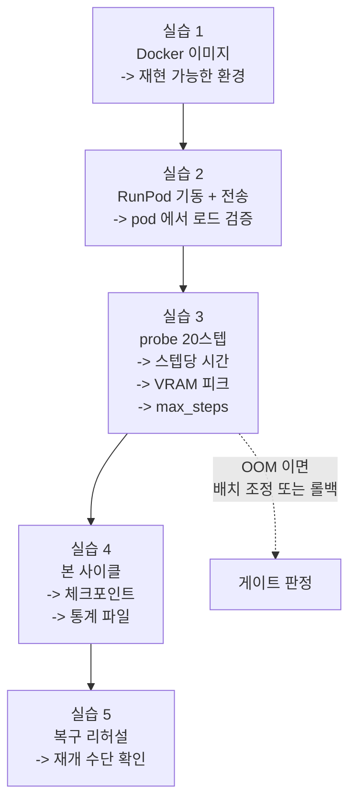

# Week 3 실습: 이미지 빌드 -> RunPod 이관 -> probe 실측 -> 본 사이클


> **실습 목표**: 학습 환경을 컨테이너로 고정해 RunPod 에서 재현하고, probe 로 예산을 확정한 뒤 LoRA 1사이클을 완주한다.
> **예상 시간**: 10-12시간
> **원칙**: 실습 4 (본 사이클) 는 실습 3 (probe 실측) 뒤에만 한다. 스텝당 비용을 모르는 상태로 긴 학습을 걸면 예산을 초과하거나 중간에 끊긴다.


### 이 문서를 읽는 법


- 각 실습은 **무엇을 하나 / 왜 하나 / 끝나면 손에 남는 것** 세 줄로 시작한다.
- `README.md` 는 개념(메모리 산수, 회수 대비의 이유), 이 문서는 절차다.
- 이번 주는 **돈이 시간당으로 나가는 주차**다. 명령을 실행하기 전에 그 명령이 몇 분 걸릴 일인지 먼저 생각하는 습관이 실질적 절약이 된다.


---


## 0. 이번 주 전체 그림


### 0.1 한 문장으로


> week2 의 환경과 코드 수정을 **Docker 이미지 한 덩어리로 굳혀** 클라우드 GPU 에 올리고, 20스텝만 시험 실행해 "스텝당 몇 초 / VRAM 몇 GB / 시간당 얼마" 를 재고, 그 숫자로 총 스텝 수를 정해 본 학습을 끝까지 돌린 뒤 결과물 4가지를 챙겨 내려온다.


### 0.2 5개 실습이 이어지는 방식





점선이 Section 0 의 게이트다. probe 에서 최소 배치로도 OOM 이 나면 이 계획 자체를 축소해야 하므로, **본 학습보다 먼저 판정한다.**


### 0.3 자주 걸리는 용어 미리 풀기


| 용어 | 뜻 |
|---|---|
| **Dockerfile** | 환경을 어떻게 만들지 적은 조리법 파일. `docker build` 가 이것을 읽어 이미지를 굽는다 |
| **이미지 / 컨테이너** | 이미지는 굳어 있는 스냅샷, 컨테이너는 그것을 실행한 상태 |
| **`FROM`** | 베이스 이미지 지정. 여기서는 CUDA·python·torch 가 이미 들어 있는 이미지를 쓴다 |
| **`ARG` / `COPY` / `RUN`** | 빌드 인자 / 파일 복사 / 명령 실행. Dockerfile 의 기본 명령들 |
| **patch 적용** | week2 에서 뽑은 코드 변경을 다른 환경에서 같은 모양으로 다시 적용하는 것 |
| **핀**(pin) | 패키지 버전을 `==` 로 못 박는 것. 리포의 `pyproject.toml` 이 정해 둔다 |
| **전이 의존성** | 내가 설치한 패키지가 다시 끌고 오는 패키지. 핀이 없으면 설치 시점의 최신이 들어온다 |
| **protobuf** | 구글의 데이터 직렬화 라이브러리. TensorFlow 계열이 내부적으로 쓰며, 버전이 어긋나면 import 단계에서 깨진다 |
| **flash-attn** | 어텐션 연산을 메모리·속도 면에서 최적화한 구현. 학습 스크립트가 기본으로 켜 두므로 없으면 모델 로드에서 막힌다 |
| **레이어**(layer) | Dockerfile 의 `RUN`/`COPY` 한 줄이 만드는 이미지 조각. 덧쌓기라서 뒤에서 지워도 앞 조각의 용량은 남는다 |
| **pod** | RunPod 에서 빌린 GPU 인스턴스 1대 |
| **network volume** | pod 와 분리된 저장소. pod 를 지워도 남는다 |
| **`rsync`** | 파일 동기화 도구. `-P` 를 주면 끊긴 지점부터 이어받는다 |
| **`nvidia-smi`** | GPU 상태·메모리 사용량을 보는 명령 |
| **VRAM 피크** | 실행 중 GPU 메모리 사용량의 최댓값. 이 값이 GPU 용량을 넘으면 OOM |
| **probe** | 본 실행 전 아주 짧게 돌려 시간·메모리를 재는 예비 실행 |
| **`torchrun`** | 분산 학습 실행기. GPU 1개여도 upstream 스크립트가 이 방식으로 실행된다 |
| **`tmux`** | SSH 가 끊겨도 프로세스가 계속 돌게 하는 터미널 세션 관리자 |
| **`tee`** | 출력을 화면에 보여주면서 동시에 파일로도 저장하는 명령 |
| **`set -e`** | 스크립트 중간에 명령이 실패하면 즉시 중단하는 셸 옵션 |
| **`save_steps`** | 몇 스텝마다 체크포인트를 저장할지 |
| **유휴 과금** | 아무 작업도 하지 않지만 pod 가 켜져 있어 붙는 요금 |


### 0.4 어디서 실행하나


| 위치 | 하는 일 |
|---|---|
| 호스트 셸의 `week3/` | Dockerfile 작성, 이미지 빌드, 전송 명령 실행, 기록(`outputs/`) |
| pod 안 `/workspace/openvla` | probe / 본 학습 실행 |
| pod 의 `/workspace/volume/` | 체크포인트·로그 착지점 (network volume 마운트 경로) |

**"호스트 셸" 을 강조하는 이유**: 이 레포를 편집하는 VS Code 세션은 그 자체가 컨테이너 안이다. 컨테이너 안에는 docker 명령이 없고 docker 데몬 소켓도 붙어 있지 않아 `docker build` 가 아예 되지 않는다. `docker` 를 설치해도 소용없다 — 명령을 받아 줄 데몬이 컨테이너 밖에 있기 때문이다. 이미지 빌드는 컨테이너를 띄운 **호스트 머신의 셸**에서 한다. 레포는 호스트 디렉터리를 그대로 붙인 것이라 파일을 옮길 필요는 없고, 경로만 호스트 기준으로 바꾸면 된다.


---


## 실습 1: 학습 측 Docker 이미지


**무엇을 하나**: week2 의 환경 구성과 등록 패치를 Dockerfile 로 적어 이미지를 굽고, 등록이 실제로 들어갔는지 컨테이너 안에서 확인한다.
**왜 하나**: 클라우드에서 같은 환경을 다시 만들어야 하는데, 손으로 설치하면 어딘가 달라진다. 그리고 로컬 PC 에 문제가 생겨도 학습을 계속할 수 있는 상태를 남기는 것이 두 번째 목적이다.
**끝나면 손에 남는 것**: `openvla-train:v1` 이미지 + `outputs/image_build.md` (베이스 태그, 기준 커밋, 핀을 깬 패키지와 사유, 버전 목록, 이미지 크기, 겪은 문제).


**파일명**: `Dockerfile`


week2 의 `.venv-rlds` 구성과 등록 패치를 이미지로 고정한다. 목적은 두 가지다 — RunPod 에서 같은 환경을 띄우는 것, 그리고 로컬 장애와 무관하게 재현 가능한 상태를 남기는 것.


```dockerfile
# 학습 측 이미지. sim 은 넣지 않는다 (Vulkan 요구로 난이도가 다르고, eval 은 로컬에서 돈다)
# 베이스의 python 은 openvla 핀에 휠이 있는 버전이어야 한다.
# week2 outputs/env_rlds.md 가 기록했듯 tensorflow==2.15.0 은 python 3.12 용 휠이 없다 -- 3.11 이면 핀이 그대로 선다
FROM pytorch/pytorch:2.4.0-cuda12.1-cudnn9-devel

# 시스템 의존성 (git 은 리포 클론과 패치 적용에 필요)
RUN apt-get update && apt-get install -y --no-install-recommends \
        git rsync && \
    rm -rf /var/lib/apt/lists/*

WORKDIR /workspace

# OpenVLA 본체. 기준 커밋을 고정한다 -- week2 outputs/openvla_base_commit.txt 에 기록한 해시
ARG OPENVLA_COMMIT=c8f03f48af692657d3060c19588038c7220e9af9
RUN git clone https://github.com/openvla/openvla.git && \
    cd openvla && git checkout ${OPENVLA_COMMIT}

# week2 의 등록 변경(3파일)을 패치로 적용. 손으로 다시 고치지 않는다
COPY openvla_registration.patch /tmp/
RUN cd openvla && git apply /tmp/openvla_registration.patch

# 의존성 설치 + 데이터 경로 패키지를 week2 가 검증한 조합으로 덮어쓰기.
# 덮어쓰는 이유: openvla 의 tensorflow==2.15.0 핀이 protobuf 를 4.x 로 묶는데,
#   핀이 없는 전이 의존성 tensorflow-metadata 는 최신이 들어와 protobuf 5.27+ 를 요구한다.
#   그대로 두면 빌드는 성공하고 import 에서 깨진다. 값의 출처는 week2 outputs/pip_freeze_rlds.txt.
# 한 RUN 으로 묶는 이유: 레이어를 나누면 버려질 TF 2.15 가 앞 레이어에 그대로 남아 이미지가 커진다
RUN cd openvla && pip install --no-cache-dir -e . && \
    pip install --no-cache-dir \
        "tensorflow==2.21.0" \
        "tensorflow-datasets==4.9.10" \
        "tensorflow-metadata==1.21.0" \
        "protobuf==6.33.6" && \
    pip uninstall -y tensorflow-addons tensorflow-estimator

# flash-attn. pyproject 45행에 주석으로만 적혀 있어 `pip install -e .` 로는 들어오지 않는다.
# 소스 빌드라 30-90분 걸린다 -- pod 가 아니라 여기서 굽는다 (베이스가 -devel 이라 nvcc 가 있다)
RUN pip install --no-cache-dir packaging ninja && \
    pip install --no-cache-dir "flash-attn==2.5.5" --no-build-isolation

# 데이터셋과 체크포인트는 이미지에 넣지 않는다 -- 실행 시 volume 으로 붙인다
```


Dockerfile 의 각 결정이 왜 그렇게 되어 있는지 풀어 둔다.


| 줄 | 이유 |
|---|---|
| `FROM pytorch/pytorch:...-devel` | CUDA·python·torch 를 직접 설치하는 것은 실패 지점이 많다. 이미 맞춰진 이미지에서 시작한다 |
| `rm -rf /var/lib/apt/lists/*` | apt 캐시를 지워 이미지 크기를 줄인다 (관용적 패턴) |
| `ARG OPENVLA_COMMIT` + `git checkout` | 커밋을 고정하지 않으면 빌드 시점마다 다른 코드가 들어온다. 그러면 패치가 충돌하거나 동작이 달라진다 |
| `COPY` + `git apply` | week2 의 수정을 손으로 다시 하지 않는다. 손으로 하면 컨테이너와 로컬이 미묘하게 달라진다 |
| `pip install -e .` | 리포를 편집 가능한 상태로 설치한다. 컨테이너 안에서 코드를 확인·수정할 수 있다 |
| `--no-cache-dir` | pip 이 받은 휠을 캐시로 남기지 않는다. torch 나 TF 는 휠 하나가 수백 MB - 수 GB 라 캐시가 그대로 이미지 용량이 된다 |
| TF 계열 덮어쓰기 | 커밋을 고정해도 전이 의존성은 빌드 시점의 최신이 들어온다. 리포가 2024년 것이라 그 격차가 protobuf 에서 터진다 |
| `pip uninstall tensorflow-addons` | openvla 가 직접 요구하는 게 아니라 `tensorflow-graphics` 가 끌고 온 것이고, TF 2.16 이상과 맞지 않는다. week2 환경에도 없으며 없는 상태로 `tensorflow_graphics` import 가 통과했다 |
| flash-attn 별도 설치 | 리포의 `pyproject.toml` 이 주석 처리해 두고 "editable install 뒤에 따로 깔라" 고 지시한다. 자동으로 안 들어오는데 학습 경로는 이것을 기본으로 켜 둔다 |
| 데이터를 이미지에 넣지 않음 | 데이터는 수 GB 이고 자주 바뀐다. 이미지는 환경만 담고 데이터는 실행 시 붙인다 |


덮어쓰는 범위를 **데이터 경로 패키지로만** 한정하는 것이 이 Dockerfile 의 판단이다. week2 의 freeze 에는 torch 2.13.0 / timm 1.0.28 도 적혀 있지만 그쪽으로는 따라가지 않는다.

week2 가 통과시킨 검사는 RLDS 로드 검증 하나이고, 그것이 지나는 길은 tfds - tensorflow-metadata - protobuf 로 이어지는 데이터 경로다. torch 와 timm 은 그 검사가 건드리지 않았고, week2 의 값은 핀을 풀었더니 pip 가 끌어온 최신일 뿐 무언가를 통과한 값이 아니다. 반대로 openvla 가 박아 둔 `torch==2.2.0` 은 upstream 이 실제로 학습을 돌려 본 조합이다. 검증되지 않은 쪽으로 모델 경로까지 옮길 이유가 없다.

이 구분은 week2 `outputs/env_rlds.md` 가 세운 "데이터 경로 / 모델 경로" 분류를 그대로 쓴 것이다.

빌드 중에 `openvla 0.0.3 requires tensorflow==2.15.0, but you have tensorflow 2.21.0` 경고가 지나간다. 핀을 의도적으로 깨는 것이므로 정상이고, 에러가 아니라 경고다. week2 도 torch 쪽에서 같은 형태의 메시지를 봤다.


### flash-attn 을 왜 이미지에 굽나


`pyproject.toml` 을 열어 보면 `flash_attn==2.5.5` 가 주석으로 처리되어 있고 "editable install 뒤에 따로 설치하라" 는 안내가 붙어 있다. 즉 `pip install -e .` 만으로는 절대 들어오지 않는다. 그런데 `prismatic/models/backbones/llm/llama2.py` 는 `use_flash_attention_2` 의 기본값을 `True` 로 둔다.


이걸 지금 로컬에서 굽는 이유는 **비용이 아니라 시간의 위치** 때문이다. flash-attn 은 미리 만들어 둔 휠이 아니라 소스에서 컴파일하는 경우가 많고, 그럴 때 30-90분이 걸린다. pod 에 올라가서 이게 없다는 걸 알게 되면 그 컴파일 시간을 시간당 요금을 내며 기다린다. 로컬에서는 전기값만 든다.


반대로 `bitsandbytes` 는 **넣지 않는다.** `vla-scripts/finetune.py` 의 `use_quantization` 기본값이 `False` 이고, §3 에서 4-bit 학습 경로를 쓰지 않기로 했기 때문이다. 스크립트 맨 위의 `BitsAndBytesConfig` import 는 transformers 가 제공하는 것이라 bitsandbytes 없이도 통과한다.


### 이미지 크기


이 이미지는 20GB 를 훌쩍 넘는다. 다음 주에 RunPod 으로 올릴 때 레지스트리에 push 해야 하므로, 크기가 그대로 업로드 시간이 된다. 도커 레이어는 덧쌓기라서 **뒤 레이어에서 지워도 앞 레이어의 용량은 남는다.** 중복이 생기는 자리는 셋이다.


| 중복이 생기는 곳 | 왜 |
|---|---|
| pip 캐시 | 받은 휠을 캐시에 그대로 둔다. `--no-cache-dir` 로 막는다 |
| TF 두 벌 | `-e .` 가 TF 2.15 를 깔고 뒤에서 2.21 로 갈아 끼운다. 한 `RUN` 으로 묶으면 최종 상태만 남는다 |
| torch 두 벌 | 베이스의 torch 와 openvla 핀의 `torch==2.2.0` 이 다르면 두 벌이 쌓인다 |


앞의 둘은 위 Dockerfile 이 이미 처리한다. 세 번째는 베이스 태그를 openvla 핀과 같은 torch 버전으로 고르면 사라지는데, 베이스를 바꾸면 python 버전도 함께 바뀐다는 점을 기억해야 한다. 바꾸기로 했다면 **빌드 전에** 후보 태그의 python 버전을 확인하고, 그 python 에서 위에 적은 TF 버전들이 설치되는지부터 본다. 베이스만 갈아 끼우고 나머지가 따라올 거라고 가정하면 안 된다.


```bash
docker run --rm <후보 태그> python -V
```


빌드와 검증:


빌드는 **호스트 셸**에서 한다 (§0.4). 그리고 `Dockerfile` 과 패치가 같은 디렉터리에 있어야 하므로 `week3/` 에서 실행한다 — `outputs/` 는 기록물 자리이고, 거기서 실행하면 빌드 컨텍스트에 패치가 없어 `COPY` 단계에서 멈춘다.


```bash
cd "<호스트에서 레포가 있는 경로>/Studies/Phase 4.5/week3"
ls Dockerfile                                           # 여기 있어야 한다. outputs/ 가 아니다
cp ../week2/outputs/openvla_registration.patch .        # 이미지 빌드 컨텍스트로 복사
docker build -t openvla-train:v1 .                      # 빌드
```


`docker build` 가 성공했다는 것은 "명령들이 오류 없이 끝났다" 는 뜻일 뿐, **내 등록이 코드에 들어갔다는 뜻이 아니다.** 패치가 빈 파일이거나 경로가 어긋나도 빌드는 성공할 수 있다. 그래서 아래 네 가지를 컨테이너 안에서 직접 확인한다. 넷 다 통과해야 실습 1 이 닫힌다.


#### 검사 1: mixture 가 등록됐나


```bash
docker run --rm openvla-train:v1 python -c \
  "from prismatic.vla.datasets.rlds.oxe.mixtures import OXE_NAMED_MIXTURES; \
   print([k for k in OXE_NAMED_MIXTURES if 'maniskill' in k])"
```


`['maniskill_pickcube_only']` 가 나와야 한다. 이 한 줄은 생각보다 넓게 덮는다 — `prismatic.vla.datasets...` 를 부르면 `prismatic/__init__.py` 부터 dlimp - tfds - tensorflow-metadata - protobuf 까지 데이터 경로 전체가 딸려 온다. 그래서 등록 확인과 의존성 정합성 확인이 한 번에 닫힌다.


| 나오는 것 | 뜻 |
|---|---|
| `['maniskill_pickcube_only']` | 통과 |
| 빈 목록 `[]` | 패치가 적용되지 않았거나 파일 경로가 어긋났다 |
| `ImportError` / `ModuleNotFoundError` | 등록 이전 단계의 문제다. 의존성 버전을 먼저 맞춰야 한다 |


#### 검사 2: 세 등록이 서로 맞물리나


```bash
docker run --rm openvla-train:v1 python -c "
from prismatic.vla.datasets.rlds.oxe.mixtures import OXE_NAMED_MIXTURES
from prismatic.vla.datasets.rlds.oxe.configs import OXE_DATASET_CONFIGS
from prismatic.vla.datasets.rlds.oxe.transforms import OXE_STANDARDIZATION_TRANSFORMS
for name, w in OXE_NAMED_MIXTURES['maniskill_pickcube_only']:
    print(name, w, name in OXE_DATASET_CONFIGS, name in OXE_STANDARDIZATION_TRANSFORMS)
"
```


`maniskill_pickcube 1.0 True True` 가 나와야 한다. mixture 이름은 `maniskill_pickcube_only` 인데 출력에 찍히는 데이터셋 이름은 `maniskill_pickcube` 로 다르다 — mixture 는 "데이터셋 여러 개를 비율로 묶은 이름" 이고 그 안의 원소가 데이터셋 이름이기 때문이다. 여기서는 데이터셋이 하나뿐이라 한 줄만 나온다.


검사 1 이 왜 부족한지가 여기 있다. week2 패치는 파일 셋을 건드리는데 검사 1 은 그중 `mixtures.py` 만 본다. `git apply` 는 all-or-nothing 이라 셋 다 적용된 것은 맞지만, **mixture 가 가리키는 데이터셋 이름과 나머지 두 곳의 키가 같은지는 별개 문제**다. 한 글자만 어긋나도 패치는 깔끔히 적용되고 학습 시작 시 `KeyError` 로 죽는다. `False` 가 하나라도 보이면 패치의 키 이름을 맞춰 다시 굽는다.


#### 검사 3: 컨테이너에서 GPU 가 보이나


```bash
docker run --rm --gpus all openvla-train:v1 python -c \
  "import torch; print(torch.__version__, torch.cuda.is_available(), torch.cuda.get_device_name(0))"
```


`True` 와 GPU 이름이 나와야 한다. `--gpus all` 을 빼면 `cuInit` 실패와 드라이버 미검출 경고가 뜨는데, 검사 1-2 에서는 GPU 를 쓰지 않으니 그 경고는 무시해도 된다. 여기서만 확인하면 된다.


#### 검사 4: 버전이 의도대로 갈렸나


```bash
docker run --rm openvla-train:v1 pip list | \
  grep -iE "^torch|^timm|^transformers|^tensorflow|^protobuf|^peft|^flash"
docker images openvla-train:v1
```


데이터 경로는 week2 값, 모델 경로는 openvla 핀 — 이렇게 갈려 있어야 한다. 눈으로 확인할 것:


| 항목 | 기대 |
|---|---|
| tensorflow / tfds / tf-metadata / protobuf | week2 `pip_freeze_rlds.txt` 의 값과 일치 |
| torch / torchvision / timm | openvla `pyproject.toml` 의 핀과 일치 |
| tensorflow-addons, tensorflow-estimator | 목록에 없어야 한다 |
| flash-attn | 목록에 있어야 한다 |


`docker images` 의 크기는 다음 주 push 시간을 가늠하는 값이므로 그대로 기록에 옮긴다.


**통과 판정**: 검사 1-4 를 모두 통과한다. 하나라도 걸리면 고쳐서 다시 굽는다 — 여기서 넘어간 문제는 다음 주에 요금을 내며 만난다.


**기록할 것** (`outputs/image_build.md`): 베이스 이미지 태그, 기준 커밋, **핀을 깬 패키지와 그 사유**, 검사 4 의 버전 목록, 이미지 크기, 빌드 중 겪은 문제. 이 기록은 week4 의 버전 호환성 대조에서 학습 측 버전 목록으로 인용되므로, 리포의 `pyproject.toml` 과 다른 값이 들어간 항목은 빠짐없이 적는다.


---


## 실습 2: RunPod 기동 + 이관


**무엇을 하나**: 24GB GPU pod 를 만들고 network volume 을 붙이고, RLDS 데이터셋을 전송한 뒤 **pod 안에서 week2 의 로드 검증을 다시 돌린다.**
**왜 하나**: "클라우드에서 같은 환경이 재현된다" 를 확인하는 것이 Section 0 의 항목이다. 로컬에서 통과한 검사가 pod 에서도 통과해야 그 항목이 닫힌다.
**끝나면 손에 남는 것**: 돌아가는 pod + `outputs/runpod_setup.md` (GPU 종류, 요금, volume 경로, 전송 시간, 검증 통과 여부).


**산출물**: `outputs/runpod_setup.md`


절차의 정본은 [`Studies/Phase 4/SETUP.md`](../../Phase%204/SETUP.md) §5 다. 여기서는 이번 학습에 필요한 항목만 확인한다. **요금은 셋업 시점에 직접 확인한다** — 변동하므로 자료에 수치를 박아 두지 않는다.


```bash
# 2-1. pod 생성 전 확인
#   - GPU: 24GB 급 (RTX 4090). VRAM 이 27GB 하한에 가까우므로 배치 조정이 필요하다 (README §1)
#   - network volume 을 만들어 붙인다 (pod 를 멈춰도 남는다)
#   - 컨테이너 이미지: 실습 1 의 이미지를 레지스트리에 올려 지정하거나, pod 에서 직접 빌드


# 2-2. 코드·데이터 전송 (RLDS 데이터셋은 용량이 크다 -- rsync 로 재개 가능하게)
rsync -avP ~/tensorflow_datasets/maniskill_pickcube \
    <pod-ssh>:/workspace/data/                       # <- pod 접속 주소로 교체


# 2-3. 전송 검증 (조용한 손실을 막는다)
#   양쪽에서 파일 수와 총 바이트를 비교한다
find ~/tensorflow_datasets/maniskill_pickcube -type f | wc -l
du -sb ~/tensorflow_datasets/maniskill_pickcube


# 2-4. pod 안에서 로드 검증 재실행 (week2 실습 4 와 같은 검사)
#   로컬에서 통과한 검사가 pod 에서도 통과해야 "이관 재현" 이 확인된다
```


명령의 낯선 부분:


- `rsync -avP`: `-a` 는 속성 보존, `-v` 는 진행 표시, `-P` 는 **중단된 전송을 이어받기 + 진행률 표시**다. 수 GB 전송에서 `-P` 가 없으면 끊길 때마다 처음부터 다시 받는다.
- `find ... | wc -l`: 파일 개수를 센다. `du -sb` 는 총 바이트를 센다. 두 값을 양쪽에서 비교하는 이유는 **전송이 중간에 끊겨도 파일이 일부 남아 성공한 것처럼 보이기 때문**이다.
- 2-4 가 왜 필요한가: 로컬에서 통과한 검사가 pod 에서 실패하는 경우가 실제로 있다 (경로 차이, 데이터 일부 누락, 이미지에 패치 미적용). pod 에서 한 번 더 돌리는 것이 그 전부를 한꺼번에 잡는다.


**기록할 것** (`outputs/runpod_setup.md`)

| 항목 | 값 |
|---|---|
| GPU 종류 / VRAM | |
| 시간당 요금 (확인 시점 명기) | |
| network volume 크기 / 마운트 경로 | |
| 데이터 전송 시간 / 용량 | |
| pod 에서 로드 검증 통과 여부 | |


> 2-4 가 Section 0 의 "RunPod 에서 컨테이너 기동 + 재현 확인" 항목을 닫는다. 통과 로그를 남긴다.


---


## 실습 3: probe 실측 + 게이트 판정


**무엇을 하나**: 스텝 수를 20 정도로 아주 짧게 잡아 학습을 실행하고, 스텝당 시간과 VRAM 피크를 재서 본 학습의 총 스텝 수·예상 비용을 역산한다.
**왜 하나**: 기본 설정으로 본 학습을 걸면 끝나지 않는다 (README §4). 그리고 24GB 에서 OOM 없이 도는 배치 조합을 여기서 찾아야 한다 — 본 학습 3시간째에 OOM 으로 죽으면 그 시간과 비용이 그대로 손실이다.
**끝나면 손에 남는 것**: `outputs/probe_measure.md` (실측치 + 확정한 `max_steps`) + Section 0 게이트 판정.


**파일명**: `practice_probe_run.sh`


짧게 돌려 **스텝당 시간과 VRAM 피크**를 재고, 그 값으로 본 사이클을 설계한다.


```bash
#!/bin/bash
# 실습 3: 짧은 probe 로 스텝당 시간·VRAM 을 실측
set -e                                          # 실패 시 즉시 중단


cd /workspace/openvla


# 3-1. 인자 이름을 먼저 확인한다 (버전에 따라 다를 수 있다)
grep -n "batch_size\|grad_accumulation_steps\|max_steps\|save_steps\|lora_rank\|dataset_name\|data_root_dir\|run_root_dir" \
    vla-scripts/finetune.py | head -20


# 3-2. VRAM 을 백그라운드로 기록 (피크를 놓치지 않기 위해)
nvidia-smi --query-gpu=memory.used --format=csv -l 5 > /workspace/probe_vram.csv &
SMI_PID=$!
trap 'kill $SMI_PID 2>/dev/null' EXIT           # 학습이 실패로 중단돼도 기록 프로세스를 정리


# 3-3. probe 실행 -- 스텝 수를 아주 작게 둔다
#   배치 조합은 24GB 에 맞춰 찾는다: batch_size 를 낮추고 grad_accumulation_steps 를 올려
#   유효 배치를 유지한다 (README §2). 아래는 시작점이며 OOM 이면 batch 를 더 낮춘다.
time torchrun --standalone --nnodes 1 --nproc-per-node 1 vla-scripts/finetune.py \
  --vla_path "openvla/openvla-7b" \
  --data_root_dir /workspace/data \
  --dataset_name maniskill_pickcube_only \
  --run_root_dir /workspace/volume/runs \
  --lora_rank 32 \
  --batch_size 1 \
  --grad_accumulation_steps 16 \
  --max_steps 20 \
  --save_steps 10


kill $SMI_PID                                   # VRAM 기록 종료
sort -t, -k1 -n /workspace/probe_vram.csv | tail -1   # 피크 값 확인
```


스크립트의 낯선 부분:


- 3-1 을 먼저 하는 이유: 인자 이름이 버전마다 다르다. 이름을 확인하지 않고 실행하면 "인식되지 않은 인자" 로 죽거나, 더 나쁘게는 **조용히 기본값이 쓰인다.** `max_steps` 가 무시되면 20만 스텝짜리 학습이 시작된다.
- `nvidia-smi ... -l 5 &`: 5초마다 GPU 메모리 사용량을 파일에 적는다. 끝의 `&` 는 백그라운드 실행이다. 학습이 끝난 뒤에 `nvidia-smi` 를 한 번 찍으면 **피크는 이미 지나가 있으므로** 계속 기록해야 한다.
- `SMI_PID=$!`: 방금 백그라운드로 띄운 프로세스의 번호를 저장한다. 나중에 `kill $SMI_PID` 로 그 기록만 정확히 끝낸다.
- `trap '...' EXIT`: 스크립트가 어느 지점에서 끝나든(오류 포함) 지정한 명령을 실행한다. `set -e` 로 학습이 중간에 죽어도 백그라운드 `nvidia-smi` 가 고아로 남지 않게 한다.
- `time`: 뒤따르는 명령의 소요 시간을 재서 마지막에 출력한다. 이 값에서 모델 로딩 시간을 분리해야 스텝당 시간이 나온다 (로딩은 수 분 걸리고 스텝 수에 비례하지 않는다).
- `--run_root_dir /workspace/volume/runs`: 결과가 **volume 에 떨어지도록** 지정한다. pod 기본 디스크에 저장하면 회수 시 사라진다 (README §5).
- `sort -t, -k1 -n ... | tail -1`: csv 를 숫자로 정렬해 마지막 줄, 즉 최댓값을 본다.


**계산해 기록할 것** (`outputs/probe_measure.md`)

| 항목 | 값 | 계산 |
|---|---|---|
| 스텝당 시간 | | probe 총 시간 / 스텝 수 (초기 로딩 시간은 분리) |
| VRAM 피크 | | 3-3 의 마지막 출력 |
| OOM 없이 성립한 배치 조합 | | batch / grad accumulation |
| 1시간에 가능한 스텝 수 | | 3600 / 스텝당 시간 |
| 예산 안에서 가능한 총 스텝 | | 허용 시간 x 위 값 |
| 확정한 `max_steps` | | 위 값에서 여유를 뺀 값 |
| 1사이클 예상 비용 | | 예상 시간 x 시간당 요금 |


마지막에서 두 번째 줄의 "여유" 를 두는 이유: 스텝당 시간은 데이터 로딩 상황에 따라 흔들리고, 체크포인트 저장에도 시간이 든다. 상한을 꽉 채워 잡으면 예산 초과나 중간 중단으로 이어진다.


**게이트 판정** (Roadmap Section 0)

| 판정 | 조건 | 다음 |
|---|---|---|
| 통과 | OOM 없이 돌고, 예산 안에서 의미 있는 스텝 수가 가능 | 실습 4 |
| 조건부 | 배치를 최소로 해도 아슬아슬하거나 시간이 예산을 넘김 | 데이터 규모 축소 또는 스텝 수 하향 후 재판정 |
| 실패 | 최소 배치에서도 OOM | 롤백 옵션 B — 경량 adaptation 으로 축소 (Roadmap §컴퓨트) |


> `max_steps` 를 지정하지 않으면 기본값이 사전학습급이라 끝나지 않는다 (README §4). probe 의 목적이 이 값을 정하는 것이다.


---


## 실습 4: 본 LoRA 1사이클


**무엇을 하나**: probe 에서 확정한 값으로 본 학습을 끝까지 돌리고, 학습이 남긴 결과물 4가지가 실제로 있는지 목록으로 확인한다.
**왜 하나**: Section 0 의 "LoRA 1사이클이 RTX 4090 에서 가능한지" 를 추정이 아니라 완주로 확정하는 단계다. 그리고 다음 주가 쓸 재료를 만드는 단계다.
**끝나면 손에 남는 것**: 머지 체크포인트 + LoRA 어댑터 + **통계 파일** + 학습 설정 + `outputs/train_log.md`.


**파일명**: `practice_train_cycle.sh`


```bash
#!/bin/bash
# 실습 4: 본 LoRA 사이클. 체크포인트는 network volume 에 남긴다
set -e


cd /workspace/openvla


# 4-1. 실행 -- tmux 안에서 돌린다 (SSH 가 끊겨도 학습이 계속되도록)
#   실습 3 에서 확정한 값으로 채운다
torchrun --standalone --nnodes 1 --nproc-per-node 1 vla-scripts/finetune.py \
  --vla_path "openvla/openvla-7b" \
  --data_root_dir /workspace/data \
  --dataset_name maniskill_pickcube_only \
  --run_root_dir /workspace/volume/runs \
  --lora_rank 32 \
  --batch_size <실습 3 확정값> \
  --grad_accumulation_steps <실습 3 확정값> \
  --max_steps <실습 3 확정값> \
  --save_steps <총 스텝의 1/5 정도> \
  2>&1 | tee /workspace/volume/train.log        # 로그를 volume 에 남긴다 (pod 회수 대비)
```


실행 방식의 낯선 부분:


- **tmux 안에서 돌리는 이유**: 그냥 실행하면 SSH 연결이 끊길 때 학습 프로세스도 함께 죽는다. 몇 시간짜리 학습에서 노트북을 닫거나 네트워크가 흔들리는 일은 반드시 일어난다. `tmux new -s train` 으로 세션을 만들고 그 안에서 실행하면, 연결이 끊겨도 세션은 살아 있고 `tmux attach -t train` 으로 다시 붙을 수 있다.
- `2>&1`: 오류 출력(stderr) 을 표준 출력(stdout) 으로 합친다. 이것이 없으면 오류 메시지가 로그 파일에 안 남는다 — 정작 필요한 순간에 없다.
- `| tee <경로>`: 화면에 보여주면서 파일로도 남긴다. 경로를 volume 으로 둔 이유는 pod 가 회수되어도 로그가 남게 하기 위해서다.
- `--save_steps` 를 총 스텝의 1/5 정도로: 회수 시 잃는 진행을 20% 이하로 제한한다. 너무 자주 저장하면 저장 시간이 학습 시간을 잡아먹고 volume 용량도 찬다.


학습이 끝나면 **회수 목록**을 확인한다. 하나라도 빠지면 다음 주가 막힌다.


```bash
# 4-2. 회수 대상 확인
ls -la /workspace/volume/runs/*/                 # 실행 디렉터리 내용
#   확인할 것:
#     - 머지된 가중치 (체크포인트 저장 시 어댑터가 머지된다 -- README §7)
#     - LoRA 어댑터 원본 (rank 비교나 재머지에 필요)
#     - 데이터셋 통계 파일 (없으면 추론에서 unnorm_key 를 쓸 수 없다 -- README §6)
#     - processor 설정
#     - 학습 로그


# 4-3. loss 추이 추출
grep -i "loss" /workspace/volume/train.log | tail -40
```


4-2 에서 **통계 파일을 눈으로 훑지 말고 이름으로 확인**한다. 15GB 가중치 파일 옆에 수십 KB json 이 있으면 시선이 가지 않는다. `find . -name "*.json"` 으로 목록을 뽑아 확인하는 것이 안전하다.


**기록할 것** (`outputs/train_log.md`)

- 최종 스텝 수 / 총 소요 시간 / 실제 비용 / VRAM 피크
- loss 추이 (시작·중간·최종 값)
- 회수 목록 4항목의 존재 확인 (특히 통계 파일)
- 학습 설정 전체 (스텝·배치·grad accumulation·rank·학습률)


마지막 줄이 왜 중요한가: week6 에서 "학습 스텝·하이퍼파라미터" 는 **배제되지 않은 후보**로 남는다. 그때 "무슨 값으로 돌렸는지" 를 적어 두지 않으면, 남은 후보를 다음 실험으로 가르는 것조차 불가능해진다.


> **loss 가 내려간 것은 통과 기준이 아니다** (README §8). 통과는 완주 + 실측 + 복구(실습 5) + 회수 목록이다.


---


## 실습 5: 중단 복구 리허설


**무엇을 하나**: probe 규모의 짧은 학습을 일부러 중단시키고, 체크포인트에서 이어서 돌 수 있는지 실제로 확인한다. pod 를 멈췄다 켜서 volume 이 남는지도 확인한다.
**왜 하나**: 회수는 예고 없이 일어난다. 그때 처음 방법을 찾으면 이미 진행분이 사라진 상태다. **리허설은 실패해도 잃을 것이 없을 때 해야 의미가 있다.**
**끝나면 손에 남는 것**: `outputs/recovery_check.md` — 저장 방식 선택과 근거, 재개 수단, 재개의 한계, volume 잔존 확인.


**산출물**: `outputs/recovery_check.md`


인스턴스가 회수됐을 때 이어서 돌 수 있는지 **실제로 확인한다.** 회수된 다음에 처음 시도하면 그때는 방법을 찾을 시간이 없다.


```bash
# 5-1. 의도적 중단 -- 학습을 짧게 걸고 중간에 죽인다
#   (본 사이클을 끊지 말고, probe 규모로 별도 실행해서 리허설한다)


# 5-2. 체크포인트가 volume 에 남아 있는지 확인
ls -la /workspace/volume/runs/*/


# 5-3. 이어서 재개
#   finetune.py 가 체크포인트에서 재개하는 인자를 제공하는지 먼저 확인한다:
grep -n "resume\|checkpoint" /workspace/openvla/vla-scripts/finetune.py | head
#   - 인자가 있으면 그것을 쓴다
#   - 없으면 저장된 머지 가중치를 --vla_path 로 지정해 이어서 학습하는 방식이 대안이다
#     (이 경우 학습률 스케줄이 초기화되는 등 완전한 재개가 아니므로 그 한계를 기록한다)


# 5-4. pod 중지 -> 재기동 후 volume 이 살아 있는지 확인 (유휴 과금 차단 절차도 함께 검증)
```


5-3 의 "완전한 재개가 아니다" 를 풀어 둔다. 학습에는 가중치 외에도 상태가 있다 — 옵티마이저의 모멘텀, 학습률 스케줄의 현재 위치, 데이터 순서. 가중치만 불러와 다시 시작하면 이 상태들이 초기값으로 돌아간다. 학습이 완전히 망가지는 것은 아니지만 **"끊긴 지점에서 매끄럽게 이어진 것" 과는 다르므로**, 그 사실을 기록해 두어야 나중에 결과를 해석할 때 혼동이 없다.


5-4 를 함께 하는 이유: volume 이 남는다는 것은 문서상 사실이지만, **내가 마운트를 제대로 설정했는지는 확인해야 안다.** pod 를 멈췄다 켜서 파일이 그대로 있는 것을 눈으로 보는 것이 그 확인이다. 그리고 이 절차가 곧 유휴 과금을 끊는 절차이기도 하다.


**기록할 것**

| 항목 | 결과 |
|---|---|
| 저장 방식 (최신만 덮어쓰기 / 시점별 보관) 과 선택 근거 | |
| 재개 수단 (전용 인자 / 가중치 지정 우회) | |
| 재개의 한계 (학습률 스케줄, 옵티마이저 상태 손실 여부) | |
| pod 중지 후 volume 잔존 확인 | |


---


## 마무리: Section 0 닫기 + 다음 주로 넘기는 것


이번 주로 Roadmap Section 0 의 남은 항목이 닫힌다. 실측 결과를 `Measurements/` 에 남긴다.


```bash
mkdir -p "/workspace/study/physical-ai-study/Measurements/openvla-lora-runpod/raw"
```


| 산출물 | 착지점 |
|---|---|
| `outputs/probe_measure.md`, `outputs/train_log.md` | `Measurements/openvla-lora-runpod/findings.md` + `methodology.md` |
| `outputs/image_build.md`, `outputs/runpod_setup.md` | `Measurements/openvla-lora-runpod/environment.md` |
| `Dockerfile` + 등록 패치 | `Measurements/openvla-lora-runpod/scripts/` |
| VRAM 기록 csv, 학습 로그 | `raw/` |


week4 로 넘기는 것: 머지 가중치 / LoRA 어댑터 / **통계 파일** / 학습 설정. 가중치 본체는 커밋하지 않고 (`*.safetensors` 는 gitignore 대상), 위치와 재현 절차만 기록한다.


> `Portfolio/evidence-index.md` 에 한 줄 추가한다 — "클라우드 GPU 에서 LoRA 1사이클을 실측하고 재현 가능한 이미지로 고정" 은 배포 역량의 증거로 쓰인다.
