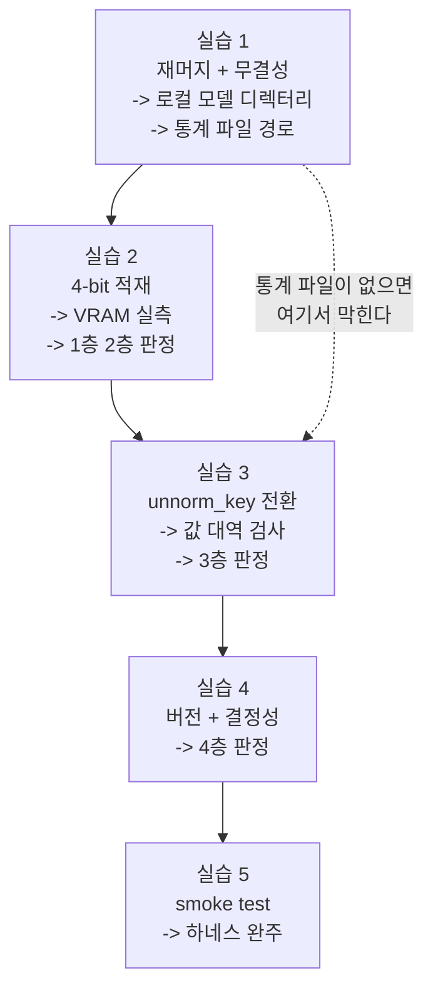

# Week 4 실습: 재머지 -> 4-bit 적재 -> 통계 전환 -> 검증


> **실습 목표**: fine-tuned 모델을 로컬 4070 에 4-bit 로 올리고, 4층 검증을 통과시켜 week0 하네스에 꽂는다.
> **예상 시간**: 6-8시간
> **원칙**: "로드됐다" 에서 멈추지 않는다. 실습 3 의 값 대역 검사를 통과해야 모델이 쓸 수 있는 상태다.


### 이 문서를 읽는 법


- 각 실습은 **무엇을 하나 / 왜 하나 / 끝나면 손에 남는 것** 세 줄로 시작한다.
- `README.md` 는 개념(4층 검증이 각각 무엇을 배제하는지), 이 문서는 절차다.
- 실습 2-5 는 **같은 파이썬 세션에서 이어 실행하는 것을 전제**로 쓰여 있다. 모델 로드에 수 분 걸리므로 매번 다시 올리지 않는다. 대화형 세션(`python -i` 또는 IPython) 에서 순서대로 실행하는 것이 편하다.


---


## 0. 이번 주 전체 그림


### 0.1 한 문장으로


> week3 이 회수한 LoRA 어댑터를 로컬 base 와 재머지해 15GB 머지 가중치를 되살리고, week0 과 **똑같은 4-bit 설정**으로 GPU 에 올리고, 역정규화 기준을 **내 데이터셋 통계로 바꾸고**, 그 모델이 week0 sim 루프에서 1 episode 도는 것까지 확인한다.


### 0.2 5개 실습이 이어지는 방식





점선이 이번 주에 가장 흔한 사고다. 통계 파일은 수십 KB 라 15GB 가중치 옆에서 눈에 띄지 않는다. 실습 1 에서 머지 디렉터리로 복사하고 목록으로 확인하지 않으면 실습 3 에서 멈춘다.


### 0.3 자주 걸리는 용어 미리 풀기


| 용어 | 뜻 |
|---|---|
| **`merge_and_unload`** | LoRA 수정분을 base 가중치에 더해 어댑터 없는 일반 모델로 되돌리는 peft 함수 |
| **무결성 검증** | 파일이 원본과 같은지 확인. 파일 수 / 총 바이트 / 체크섬 순으로 강해진다 |
| **`du -sb`** | 디렉터리의 총 바이트를 센다 |
| **safetensors** | 모델 가중치 저장 형식. 7B 는 여러 조각으로 나뉜다 |
| **색인**(index) | `model.safetensors.index.json`. 조각난 가중치의 "텐서 이름 -> 조각 파일" 매핑(`weight_map`)과 총 바이트(`total_size`)를 담는다 |
| **`BitsAndBytesConfig`** | 양자화 방식을 지정하는 설정 객체 |
| **nf4** | 4-bit 양자화 방식의 한 종류 |
| **double quant** | 양자화 보조 상수까지 양자화해 메모리를 더 줄이는 옵션 |
| **compute dtype** | 실제 계산에 쓰는 자료형. 저장은 4-bit, 연산은 fp16 |
| **`trust_remote_code`** | 체크포인트가 들고 있는 자체 모델 코드를 실행하도록 허용 |
| **`memory_allocated`** | 현재 GPU 에 잡혀 있는 메모리 양 |
| **`max_memory_allocated`** | 실행 중 기록된 최댓값(피크) |
| **`norm_stats`** | 모델이 들고 있는 "데이터셋 이름 -> action 통계" 딕셔너리 |
| **`predict_action`** | 이미지와 프롬프트를 받아 7차원 action 을 내놓는 OpenVLA 메서드 |
| **`do_sample=False`** | 확률적 샘플링을 끄고 항상 최고 확률 토큰을 고른다 (결정적 출력) |
| **`torch.no_grad()`** | 그래디언트 계산을 끈다. 추론에서 메모리와 시간을 아낀다 |
| **결정성** | 같은 입력에 항상 같은 출력이 나오는 성질 |
| **smoke test** | 세부 성능은 보지 않고 전체가 도는지만 보는 최소 확인 |


### 0.4 어디서 실행하나


추론은 Phase 4 의 공용 venv (`.venv-vla`) 에서 한다. 스크립트는 `week4/` 아래에 두고 cwd 도 `week4` 로 둔다. 모델 가중치는 레포 밖의 `/workspace/models/` 아래에 둔다 — 15GB 를 레포 안에 두면 실수로 커밋 대상에 들어갈 위험이 있다. 컨테이너 홈(`/root/models`) 은 쓰지 않는다 — 호스트 마운트가 없어 호스트에서 만든 재머지 산출물이 그 경로로 도착하지 못한다.

예외는 실습 1 의 재머지(1-0, 1-1)다 — docker 가 있는 **호스트 셸**에서 실행한다 (개발 컨테이너 안에는 docker 가 없다). 1-2 부터는 개발 컨테이너로 돌아온다.


---


## 환경 설정


추론은 Phase 4 의 공용 venv 를 그대로 쓴다. **버전을 바꾸지 않는다** — 이 조합 위에서 Block 1-3 실측이 재현되고, week0 baseline 도 이 환경에서 측정됐다. 여기서 라이브러리를 올리면 이미 끝낸 측정의 근거가 흔들린다 (README §6).


```bash
source "/workspace/study/physical-ai-study/Studies/Phase 4/.venv-vla/bin/activate"
cd "/workspace/study/physical-ai-study/Studies/Phase 4.5/week4"
mkdir -p outputs
pip list | grep -iE "transformers|tokenizers|timm|accelerate|bitsandbytes|torch " > outputs/local_versions.txt
cat outputs/local_versions.txt      # 실습 4 의 대조 기준
```


마지막 두 줄이 하는 일: 현재 환경의 라이브러리 버전을 파일로 떠 둔다. 실습 4 에서 week3 컨테이너의 버전과 표로 대조할 때 이 파일이 기준이 된다. **지금 떠 두는 이유는, 나중에 무언가를 설치하면 그 시점의 값을 알 수 없기 때문이다.**


---


## 실습 1: 재머지 + 무결성 검증


**무엇을 하나**: week3 이 회수한 LoRA 어댑터를 로컬 base 와 다시 합쳐 15GB 머지 가중치를 만들고, 통계·processor 파일을 채워 `/workspace/models/openvla-maniskill-ft/` 를 완성한 뒤, 회수해 둔 색인과 대조해 pod 에 있던 머지 가중치와 같은 구조인지 확인한다.
**왜 하나**: week3 은 15GB 머지 가중치를 내리지 않았다 — 머지 가중치 = base + 어댑터이고 base 15GB 는 로컬 캐시에 있으므로, 재머지가 전송을 대체한다 (week3 `outputs/train_log.md` §4.3). 다만 **재머지는 아직 한 번도 검증된 적이 없다** (같은 문서 §6) — 색인 대조가 그 검증이다. 그리고 **통계 파일을 머지 디렉터리에 채우지 않으면 실습 3 에서 막힌다.**
**끝나면 손에 남는 것**: `/workspace/models/openvla-maniskill-ft/` + `outputs/remerge_check.md` (재머지 환경, 색인 대조 결과, 4항목 존재 확인, 통계 파일 경로).


**산출물**: `outputs/remerge_check.md`


재머지는 **학습과 같은 버전 조합**(`openvla-train:v2` — torch 2.2.0 / transformers 4.40.1 / peft 0.11.1)에서 한다. `.venv-vla` 는 torch 2.12 조합이라 쓰지 않는다. GPU 는 필요 없다 — bf16 가중치에 수정분을 더하는 CPU 작업이고, 4070 12GB 에는 15GB 가 올라가지도 않는다.


```bash
# 1-0. 전제 확인 (docker 가 있는 호스트 셸에서)
ls ~/.cache/huggingface/hub/models--openvla--openvla-7b/snapshots/
#   -> 47a0ec7fc4ec123775a391911046cf33cf9ed83f
#      어댑터가 기록한 base 리비전(recovered/.../adapter_config.json)과 같아야 한다.
#      다르면 재머지 결과가 학습 때의 머지와 다른 모델이 된다.

docker images openvla-train:v2      # 학습에 쓴 이미지가 있는지
free -g                             # 가용 RAM 18GB 이상인지 (bf16 15GB 를 CPU 에 올린다)
```


**파일명**: `practice_remerge.py` (`week4/` 에 두고 컨테이너에 마운트해 실행한다)


```python
"""
실습 1: LoRA 어댑터를 base 에 재머지해 pod 의 머지 가중치를 로컬에서 재구성
openvla-train:v2 컨테이너 안에서 실행한다 (학습과 같은 torch 2.2.0 / peft 0.11.1).
학습 스크립트가 체크포인트 저장 때 하던 것과 같은 절차다: bf16 base 에 어댑터를 합쳐 저장.
"""
import torch
from peft import PeftModel
from transformers import AutoModelForVision2Seq


# 컨테이너 안 경로 -- 아래 docker run 의 -v 마운트와 짝이 맞아야 한다
ADAPTER_PATH = (
    "/recover/adapter-tmp/"
    "openvla-7b+maniskill_pickcube_only+b16+lr-0.0005+lora-r32+dropout-0.0--image_aug"
)
OUT_PATH = "/out/openvla-maniskill-ft"             # 개발 컨테이너의 /workspace/models/ 에 대응


# -- base 적재: 학습 때와 같은 bf16 (HF_HUB_OFFLINE=1 이라 로컬 캐시만 읽는다) --
base = AutoModelForVision2Seq.from_pretrained(
    "openvla/openvla-7b",                          # 캐시의 스냅샷 (1-0 에서 확인한 리비전)
    torch_dtype=torch.bfloat16,                    # 학습 저장과 같은 dtype
    low_cpu_mem_usage=True,                        # 15GB 를 RAM 에 한 번만 올린다
    trust_remote_code=True,                        # openvla 자체 모델 코드 허용
)

# -- 머지: 어댑터를 얹고 수정분을 가중치에 더해 일반 모델로 되돌린다 --
merged = PeftModel.from_pretrained(base, ADAPTER_PATH).merge_and_unload()

# -- 저장: 조각난 safetensors + config + 색인이 생긴다 --
merged.save_pretrained(OUT_PATH)
print("저장 완료:", OUT_PATH)
```


```bash
# 1-1. 재머지 실행 (호스트 셸에서)
REPO="<physical-ai-study 레포의 호스트 경로>"                          # <- 교체
MODELS="<개발 컨테이너의 /workspace/models 에 해당하는 호스트 경로>"   # <- 교체
mkdir -p "$MODELS"

docker run --rm \
    -e HF_HUB_OFFLINE=1 \
    -v ~/.cache/huggingface:/root/.cache/huggingface \
    -v "$REPO/Studies/Phase 4.5/week3/outputs/recovered:/recover:ro" \
    -v "$REPO/Studies/Phase 4.5/week4:/week4:ro" \
    -v "$MODELS":/out \
    openvla-train:v2 \
    python /week4/practice_remerge.py
```


여기부터는 개발 컨테이너로 돌아온다 — 산출물을 `/workspace/models` 로 받았으므로 양쪽에서 같은 파일이 보인다.


```bash
# 1-2. sidecar 채우기 -- save_pretrained 는 가중치와 config 만 쓴다.
#      processor·tokenizer 설정과 통계 파일은 pod 머지 디렉터리에서 회수한 것을 복사한다.
EXP="openvla-7b+maniskill_pickcube_only+b16+lr-0.0005+lora-r32+dropout-0.0--image_aug"
REC="/workspace/study/physical-ai-study/Studies/Phase 4.5/week3/outputs/recovered/runs/$EXP"
DST=/workspace/models/openvla-maniskill-ft

for f in dataset_statistics.json preprocessor_config.json \
         tokenizer.json tokenizer.model tokenizer_config.json \
         added_tokens.json special_tokens_map.json; do
    cp "$REC/$f" "$DST/"
done
# 복사하지 않는 것: model.safetensors.index.json (회수본).
#   조각 분할이 재머지와 다를 수 있으므로 save_pretrained 가 만든 색인을 쓰고,
#   회수본은 1-3 의 대조 기준으로만 쓴다.
```


다음이 이 실습의 판정이다. pod 가 없으므로 원격·로컬 바이트 비교는 불가능하지만, pod 의 머지 가중치가 남긴 색인은 회수돼 있다. 재머지가 같은 물건을 만들었다면 **총 바이트와 텐서 이름 목록이 같아야 한다.**


```python
"""1-3. 색인 대조 -- json 만 읽으므로 개발 컨테이너의 아무 python 에서나 돈다"""
import json

# pod 머지가 남긴 색인 (회수물) 과 재머지가 만든 색인의 경로
REC = (
    "/workspace/study/physical-ai-study/Studies/Phase 4.5/week3/outputs/recovered/runs/"
    "openvla-7b+maniskill_pickcube_only+b16+lr-0.0005+lora-r32+dropout-0.0--image_aug"
)
DST = "/workspace/models/openvla-maniskill-ft"

old = json.load(open(f"{REC}/model.safetensors.index.json"))   # pod 머지가 남긴 색인
new = json.load(open(f"{DST}/model.safetensors.index.json"))   # 재머지가 만든 색인

# 총 바이트: dtype 이나 텐서 크기가 하나라도 다르면 어긋난다
print("total_size:", old["metadata"]["total_size"], new["metadata"]["total_size"])
print("total_size 일치:", old["metadata"]["total_size"] == new["metadata"]["total_size"])

# 텐서 이름 집합: 어댑터가 덜 합쳐졌으면 이름이 남거나 빠진다
old_keys, new_keys = set(old["weight_map"]), set(new["weight_map"])
print("텐서 이름 집합 일치:", old_keys == new_keys)
print("한쪽에만 있는 이름 수:", len(old_keys ^ new_keys))
```


**판정**

| 관측 | 해석 |
|---|---|
| 총 바이트·텐서 집합 모두 일치 | 재머지가 pod 머지와 같은 구조를 만들었다. train_log.md §6 의 "재머지 미검증" 항목이 닫힌다 |
| 텐서 집합이 다르다 | 어댑터가 덜 합쳐졌거나(peft 버전 확인) base 리비전이 다르다 (1-0 재확인) |
| 총 바이트만 다르다 | dtype 불일치 -- bf16 로 읽었는지 확인 |


값 수준의 동일성(체크섬)은 pod 사본이 없으므로 확인할 수 없다. 그 몫은 실습 2 의 VRAM 대조와 실습 3 의 값 대역 검사가 기능적으로 대신한다.


```bash
# 1-4. 4항목 존재 확인 (눈으로 훑지 말고 목록으로)
find /workspace/models/openvla-maniskill-ft -type f | wc -l                  # 파일 개수
du -sb /workspace/models/openvla-maniskill-ft                                # 15GB 급인지
find /workspace/models/openvla-maniskill-ft -name "*.json" | xargs ls -la    # 통계·config 확인
ls -la "/workspace/study/physical-ai-study/Studies/Phase 4.5/week3/outputs/recovered/adapter-tmp/$EXP/"   # 어댑터 원본
```


명령의 낯선 부분:


- `HF_HUB_OFFLINE=1`: 허브 접속을 끊는다. 캐시에 없는 파일을 조용히 새 리비전으로 받아오는 사고를 차단하고, 캐시가 모자라면 그 자리에서 실패한다.
- `-v ...:ro`: 읽기 전용 마운트. 회수물과 레포는 이 작업의 입력이지 출력이 아니므로 실수로 덮어쓸 길을 막는다. 캐시 마운트는 ro 로 두지 않는다 — `from_pretrained` 가 락 파일을 만들 수 있다.
- `find ... -type f | wc -l`: 파일 개수만 센다 (디렉터리는 제외).
- `du -sb`: 총 바이트를 센다. `-s` 는 합계만, `-b` 는 바이트 단위.
- `find ... -name "*.json" | xargs ls -la`: json 파일만 골라 크기와 함께 나열한다. **통계 파일을 이름으로 찾는 것이 이 명령의 목적**이다. `ls` 로 디렉터리를 훑으면 큰 파일들 사이에서 수십 KB 파일을 놓친다.


4항목의 최종 소재:

| 항목 | 소재 |
|---|---|
| (a) 머지된 가중치 (15GB 급) | `/workspace/models/openvla-maniskill-ft/` (재머지 산출) |
| (b) LoRA 어댑터 원본 | `week3/outputs/recovered/adapter-tmp/` (그대로 보존 -- 재머지의 입력) |
| (c) 데이터셋 통계 파일 | `/workspace/models/openvla-maniskill-ft/dataset_statistics.json` (1-2 에서 복사) |
| (d) processor / config + 학습 로그 | 설정은 (a) 디렉터리 안, 로그는 `week3/outputs/recovered/` |


**기록할 것**

| 항목 | 값 |
|---|---|
| 재머지 환경 (이미지 / torch / peft) | |
| base 리비전 (캐시 스냅샷 = adapter_config) | |
| 색인 대조 (total_size / 텐서 집합) | |
| 파일 수 / 총 바이트 | |
| 4항목 존재 확인 | |
| 통계 파일 경로 | (실습 3 에서 쓴다) |


---


## 실습 2: 4-bit 적재 + VRAM 실측


**무엇을 하나**: 로컬 디렉터리에서 모델을 4-bit 로 올리고, 적재 후 GPU 메모리를 재서 week0 baseline(약 4.4GB) 과 대조한다.
**왜 하나**: 적재 메모리는 **양자화가 실제로 걸렸는지 판정하는 지표**다. 설정을 빠뜨리면 로드가 되면서도 메모리를 3배 이상 쓰거나 CPU 로 새는데, 그 실패는 오류를 내지 않는다.
**끝나면 손에 남는 것**: 세션에 올라간 `processor` / `vla` 객체 + VRAM 실측치 (4층 검증의 1-2층 판정).


**파일명**: `practice_load_4bit.py`


절차는 Phase 4 week6 과 같고 **모델 경로만 다르다.** 적재 메모리를 baseline 과 대조하는 것이 이 실습의 판정이다.


```python
"""
실습 2: fine-tuned 머지 가중치를 4-bit 로 적재하고 VRAM 을 실측
"""
import torch
from transformers import AutoModelForVision2Seq, AutoProcessor, BitsAndBytesConfig


MODEL_PATH = "/workspace/models/openvla-maniskill-ft"   # <- 실습 1 의 로컬 경로
BASELINE_GB = 4.38                                 # week0/Block 1 실측 (4-bit OpenVLA 7B)


print("=" * 60)
print("실습 2: 4-bit 적재 + VRAM 실측")
print("=" * 60)


# -- 2-1. week0 과 동일한 양자화 설정 (변인 통제 -- README §5) --
bnb_config = BitsAndBytesConfig(
    load_in_4bit=True,                             # 4-bit 적재
    bnb_4bit_quant_type="nf4",                     # week0 과 같은 양자화 종류
    bnb_4bit_use_double_quant=True,                # week0 과 같은 double quant 여부
    bnb_4bit_compute_dtype=torch.float16,          # week0 과 같은 연산 dtype
)


# -- 2-2. 적재 전 메모리 기록 (증분을 보기 위해) --
torch.cuda.reset_peak_memory_stats()               # 피크 카운터 초기화
before_gb = torch.cuda.memory_allocated() / 1e9
print(f"\n[2-2] 적재 전: {before_gb:.2f} GB")


# -- 2-3. 로컬 경로에서 적재 --
processor = AutoProcessor.from_pretrained(MODEL_PATH, trust_remote_code=True)
vla = AutoModelForVision2Seq.from_pretrained(
    MODEL_PATH,                                    # 허브 이름이 아니라 로컬 디렉터리
    attn_implementation="eager",                   # week0 과 같은 attention 구현
    torch_dtype=torch.float16,
    low_cpu_mem_usage=True,
    trust_remote_code=True,                        # 자체 모델 코드 실행 허용
    quantization_config=bnb_config,
)
after_gb = torch.cuda.memory_allocated() / 1e9
peak_gb = torch.cuda.max_memory_allocated() / 1e9
print(f"[2-3] 적재 후: {after_gb:.2f} GB (피크 {peak_gb:.2f} GB)")


# -- 2-4. baseline 대조 (양자화가 실제로 걸렸는지 판정 -- README §3) --
diff = after_gb - BASELINE_GB
print(f"\n[2-4] baseline({BASELINE_GB} GB) 대비 차이: {diff:+.2f} GB")
if abs(diff) < 0.5:
    print("   판정: 근사 일치 -- 양자화 적용됨")
else:
    print("   판정: 벗어남 -- 양자화 설정 또는 적재 범위 확인 필요")
```


코드의 낯선 부분:


- `BitsAndBytesConfig` 의 네 인자는 **week0 과 한 글자도 다르면 안 된다.** 이것이 변인 통제의 실체다. 특히 `bnb_4bit_use_double_quant` 와 `bnb_4bit_compute_dtype` 은 빠뜨려도 기본값으로 동작하므로, 명시적으로 적어 두는 것이 두 측정의 조건 일치를 보장하는 방법이다.
- `attn_implementation="eager"`: attention 계산을 어떤 구현으로 할지 고르는 인자다. 구현에 따라 수치가 미세하게 달라질 수 있으므로 week0 과 같은 값을 쓴다.
- `torch.cuda.reset_peak_memory_stats()`: 피크 기록을 0 으로 되돌린다. 이 줄이 없으면 이전 작업의 피크가 섞인다.
- `memory_allocated` vs `max_memory_allocated`: 앞은 "지금 잡고 있는 양", 뒤는 "이번 실행에서 최대로 잡았던 양" 이다. 로드 중 일시적으로 더 쓸 수 있으므로 둘을 함께 본다.
- `/ 1e9`: 바이트를 GB 로 바꾼다.
- `abs(diff) < 0.5` 의 0.5GB: 판정 여유값이다. 구현 차이·측정 시점 차이로 수백 MB 는 흔들릴 수 있고, 양자화가 아예 안 걸린 경우는 GB 단위로 벗어나므로 이 폭으로 충분히 갈린다.


**확인 포인트**

- `trust_remote_code` 로드가 실패하면 체크포인트에 자체 모델 코드로 가는 연결이 보존됐는지 확인한다 (README §2)
- 차이가 크게 양수면 양자화 설정이 안 걸린 것, 크게 음수면 모델 일부만 로드된 것을 의심한다


---


## 실습 3: `unnorm_key` 전환 + 값 대역 검사


**무엇을 하나**: 모델이 아는 통계 키 목록을 확인하고, 없으면 학습이 남긴 통계 파일을 주입한 뒤, **같은 이미지에 키만 바꿔 추론해** 출력 대역이 달라지는지 본다.
**왜 하나**: 이번 주의 기술 과제다. 키가 옛 값으로 남아 있으면 오류 없이 남의 로봇 스케일로 역정규화되고, 그 상태로 week5 를 돌리면 "adaptation 이 효과 없었다" 는 잘못된 결론이 나온다.
**끝나면 손에 남는 것**: 내 데이터셋 키로 정상 출력하는 모델 + 4층 검증 3층 판정.


**파일명**: `practice_unnorm_switch.py`


이번 주의 기술 과제다. 남의 통계에서 내 통계로 바꾸고, **바뀌었다는 것을 값으로 확인**한다.


### 검증 아이디어: 같은 입력에 키만 바꿔 본다


역정규화 기준이 바뀌면 같은 raw 출력에서 나오는 물리량이 달라진다. 그래서 **입력을 고정하고 키만 두 값으로 바꿔 두 결과를 비교**하면, 키가 실제로 적용됐는지 알 수 있다.


| 관측 | 뜻 |
|---|---|
| 두 결과가 다르다 | 키가 실제로 반영됐다 |
| 두 결과가 같다 | **키가 적용되지 않았다** — 주입 위치나 구조가 틀렸다 |


두 번째 줄이 이번 주에 가장 위험한 상태다. 오류가 없으므로 통과로 착각한다.


```python
"""
실습 3: 학습 통계를 모델에 연결하고 출력 대역으로 검증
"""
import json
import numpy as np
import torch
from PIL import Image


# 실습 2 의 processor / vla 가 로드된 상태를 전제한다 (같은 세션에서 이어 실행)


STATS_PATH = "/workspace/models/openvla-maniskill-ft/dataset_statistics.json"   # <- 실습 1 확인 경로
DATASET_KEY = "maniskill_pickcube"                 # week2 에서 등록한 이름
INSTRUCTION = "pick up the cube"                   # week0-1 과 같은 문구


print("=" * 60)
print("실습 3: unnorm_key 전환")
print("=" * 60)


# -- 3-1. 모델이 현재 아는 키 목록 확인 --
print("\n[3-1] 현재 norm_stats 키:", list(vla.norm_stats.keys()))
# 내 데이터셋 이름이 여기 있으면 그대로 쓴다.
# 없으면 3-2 로 주입한다.


# -- 3-2. 통계 주입 (키가 없을 때만) --
with open(STATS_PATH) as f:
    stats = json.load(f)                           # week3 학습이 저장한 통계
print("\n[3-2] 통계 파일 키:", list(stats.keys()))
# 구조가 모델의 norm_stats 형식과 같은지 비교한 뒤 주입한다.
# vla.norm_stats[DATASET_KEY] = stats[DATASET_KEY]   # <- 실제 구조에 맞게 교체
print("주입 후 키:", list(vla.norm_stats.keys()))


# -- 3-3. 두 키로 각각 추론해 대역을 비교 (전환이 실제로 효과가 있는지) --
image = Image.fromarray(                           # 고정 입력 (같은 입력에 두 키만 바꾼다)
    (np.random.RandomState(0).rand(224, 224, 3) * 255).astype(np.uint8)
)
prompt = f"In: What action should the robot take to {INSTRUCTION}?\nOut:"
inputs = processor(prompt, image).to("cuda:0", dtype=torch.float16)


for key in ["bridge_orig", DATASET_KEY]:           # 남의 통계 vs 내 통계
    with torch.no_grad():
        action = vla.predict_action(
            input_ids=inputs["input_ids"],
            pixel_values=inputs["pixel_values"],
            unnorm_key=key,
            do_sample=False,                       # 결정적 출력
        )
    print(f"\n[3-3] unnorm_key={key}")
    print("   action:", np.round(action, 4))
    print("   위치 3차원 크기:", np.round(np.abs(action[:3]), 4))


# -- 3-4. 학습 데이터 통계 대역과 대조 (README §7 의 3층) --
# 통계 파일의 분위수를 꺼내 위 출력이 그 범위 안에 있는지 본다.
# week1 실습 6 의 히스토그램 범위와도 비교한다.
action_stats = stats[DATASET_KEY]["action"]         # <- 실제 구조에 맞게 교체
for name, value in action_stats.items():
    print(f"   {name}: {np.round(np.asarray(value), 4)}")
```


코드의 낯선 부분:


- `np.random.RandomState(0).rand(...)`: 고정 seed 로 만든 무작위 이미지다. 실제 sim 장면이 아니어도 되는 이유는, 이 실습이 보는 것이 **"키에 따라 출력 스케일이 달라지는가"** 이지 동작의 옳음이 아니기 때문이다. seed 를 고정하는 이유는 두 키 비교에서 입력이 완전히 같아야 하기 때문이다.
- `prompt` 형식 (`In: ... \nOut:`): OpenVLA 가 학습 때 쓴 프롬프트 틀이다. 틀이 다르면 모델이 다르게 반응한다. week0-1 과 같은 문구를 쓰는 이유도 같다.
- `.to("cuda:0", dtype=torch.float16)`: 전처리 결과를 GPU 로 올리고 자료형을 맞춘다. 모델이 fp16 으로 계산하므로 입력도 맞춰 준다.
- `with torch.no_grad()`: 추론이므로 그래디언트가 필요 없다. 메모리와 시간을 아낀다.
- `do_sample=False`: 확률적 샘플링을 끈다. 같은 입력에 항상 같은 출력이 나오게 하는 설정이고, 실습 4 의 결정성 검사가 이 값에 의존한다.


**판정**

| 관측 | 해석 |
|---|---|
| 두 키의 출력 대역이 뚜렷이 다르고, 내 키 쪽이 학습 통계 범위 안 | 전환 성공 |
| 두 키의 출력이 같다 | 키가 실제로 적용되지 않았다 (주입 위치·구조 확인) |
| 내 키 출력이 학습 통계 범위를 크게 벗어난다 | 통계 구조 매핑 오류 |
| 내 키에서 예외 발생 | 키 이름 또는 통계 형식 불일치 |


> 두 번째 줄이 가장 위험하다 — 오류 없이 옛 키로 역정규화되면 **남의 로봇 스케일로 조용히 틀린다** (README §4). 네 번째 줄(예외) 은 오히려 안전하다. 그 자리에서 알려 주기 때문이다.


---


## 실습 4: 버전 호환성 + 결정성 검증


**무엇을 하나**: 현재 추론 환경의 라이브러리 버전을 출력해 week3 컨테이너의 목록과 대조하고, 같은 입력을 3번 넣어 출력이 완전히 같은지 확인한다.
**왜 하나**: 두 환경의 조합이 다르면 체크포인트가 안 열리거나 다르게 동작한다. 그리고 출력이 매번 흔들리면 week5 의 "동일 조건 N회" 라는 주장이 성립하지 않는다.
**끝나면 손에 남는 것**: `outputs/compat_check.md` — 버전 대조 표, 로드 경고 전문, 결정성 판정.


**파일명**: `practice_compat_check.py`


```python
"""
실습 4: 학습 환경과 추론 환경의 조합을 대조하고 결정성을 확인
"""
import accelerate
import bitsandbytes
import numpy as np
import timm
import tokenizers
import torch
import transformers


print("=" * 60)
print("실습 4: 호환성 + 결정성")
print("=" * 60)


# -- 4-1. 현재 추론 환경 버전 출력 (Phase 4 SETUP §7 매트릭스와 대조) --
print("\n[4-1] 추론 환경")
for module in [torch, transformers, tokenizers, timm, accelerate, bitsandbytes]:
    print(f"   {module.__name__}: {module.__version__}")
# week3 컨테이너의 버전(outputs/image_build.md 기록)과 표로 대조한다.
# 다른 항목이 있어도 그 자체가 문제는 아니다 -- 로드와 출력이 정상이면 통과다.


# -- 4-2. 결정성 확인: 같은 입력에 같은 출력인가 --
# 실습 3 의 inputs 를 재사용한다 (같은 세션)
outputs = []
for trial in range(3):                             # 3회 반복
    with torch.no_grad():
        action = vla.predict_action(
            input_ids=inputs["input_ids"],
            pixel_values=inputs["pixel_values"],
            unnorm_key=DATASET_KEY,
            do_sample=False,                       # greedy -- 항상 같은 출력이어야 한다
        )
    outputs.append(np.asarray(action))
    print(f"   trial{trial}: {np.round(action, 5)}")


max_diff = max(np.abs(outputs[0] - other).max() for other in outputs[1:])
print(f"\n[4-2] 최대 편차: {max_diff:.2e}")
print("   판정:", "결정적" if max_diff < 1e-6 else "비결정 -- do_sample / dropout 설정 확인")
```


코드의 낯선 부분:


- 4-1 의 주석 "다른 항목이 있어도 그 자체가 문제는 아니다": 버전이 완전히 같아야 하는 것이 목적이 아니다. **목적은 "이 조합에서 체크포인트가 열리고 정상 출력한다" 를 확인하는 것**이다. 그래서 대조 표는 판정이 아니라 기록이고, 판정은 로드 성공과 출력 대역이 한다.
- `max_diff` 계산: 첫 시행과 나머지 시행의 차이 중 최댓값을 본다. `1e-6` 미만이면 부동소수점 오차 수준이므로 결정적으로 본다.
- `1e-2` 같은 큰 편차가 나오면: `do_sample` 이 켜져 있거나, 모델에 dropout 같은 학습 모드 동작이 남아 있을 수 있다.


**기록할 것** (`outputs/compat_check.md`)

- 학습 환경 vs 추론 환경 버전 대조 표
- 로드 성공 여부와 경고 메시지 전문
- 결정성 판정
- **안 열렸을 경우**: 어느 선택지를 골랐는지와 그 대가 (README §6)


경고 메시지 전문을 남기라는 이유: transformers 는 "일부 가중치를 초기화했다" 같은 경고를 내면서도 로드를 성공시킨다. 그 경고가 **모델 일부가 학습된 값 대신 랜덤값으로 채워졌다는 뜻일 수 있다.** 나중에 결과가 이상할 때 이 로그가 첫 단서가 된다.


---


## 실습 5: 하네스 smoke test (1 episode)


**무엇을 하나**: week0 실습 6 의 측정 코드를 가져와 모델 경로와 `unnorm_key` 만 바꾸고, 1 episode 를 예외 없이 완주시킨다.
**왜 하나**: 모델과 sim 루프가 실제로 맞물리는지 확인하는 마지막 관문이다. 그리고 여기서 만든 코드가 week5 하네스의 원형이 된다.
**끝나면 손에 남는 것**: 예외 없이 도는 통합 루프 + 4층 검증 전체 통과 기록. **성공/실패 판정은 하지 않는다.**


**파일명**: `practice_smoke_test.py`


week0 실습 6 의 코드를 가져와 **모델 경로와 `unnorm_key` 만 바꾼다.** 다른 것을 바꾸면 week5 의 before/after 가 성립하지 않는다.


```python
"""
실습 5: week0 하네스에 fine-tuned 모델을 꽂아 1 episode 돌린다 (성공률 판정 안 함)
"""
import numpy as np
import torch
import gymnasium as gym
import mani_skill.envs
from PIL import Image


# week0 실습 6 에서 고정한 값 -- 그대로 쓴다
ENV_ID = "PickCube-v1"                             # <- week0 확정값
MAX_EPISODE_STEPS = 200                            # <- week0 실습 4-3 확정값 (env step 예산)
ACTION_REPEAT = 4                                  # <- week0 실습 4-3 확정값 (실효 5 Hz)
POLICY_STEPS = MAX_EPISODE_STEPS // ACTION_REPEAT  # 정책 결정 횟수 = 50
SMOKE_SEED = 500                                   # eval seed(week0 목록)와 겹치지 않는 값
INSTRUCTION = "pick up the cube"                   # 같은 문구


# 바뀌는 것은 이 두 개뿐이다
MODEL_PATH = "/workspace/models/openvla-maniskill-ft"   # zero-shot 은 "openvla/openvla-7b" 였다
UNNORM_KEY = "maniskill_pickcube"                  # zero-shot 은 "bridge_orig" 였다


print("=" * 60)
print("실습 5: smoke test (1 episode)")
print("=" * 60)


# 모델 로드는 실습 2 와 동일 (같은 세션이면 재사용)
# 환경 생성 인자도 week0 실습 6 과 동일해야 한다 -- 하나라도 다르면 그것이 변인이다
env = gym.make(
    ENV_ID,
    obs_mode="rgb",
    control_mode="pd_ee_delta_pose",
    render_mode="rgb_array",
    sensor_configs=dict(width=224, height=224),    # week0 과 동일 (관측 카메라 native 224)
    max_episode_steps=MAX_EPISODE_STEPS,
)
obs, info = env.reset(seed=SMOKE_SEED)
prompt = f"In: What action should the robot take to {INSTRUCTION}?\nOut:"


done = False
for policy_step in range(POLICY_STEPS):
    # 카메라 텐서는 cuda 에 있으므로 host 로 복사한 뒤 numpy 로 변환한다 (week0 확정 경로)
    frame = obs["sensor_data"]["base_camera"]["rgb"].cpu().numpy()
    if frame.ndim == 4:
        frame = frame[0]
    image = Image.fromarray(frame.astype(np.uint8)).resize((224, 224))
    model_inputs = processor(prompt, image).to("cuda:0", dtype=torch.float16)
    with torch.no_grad():
        raw_action = vla.predict_action(
            input_ids=model_inputs["input_ids"],
            pixel_values=model_inputs["pixel_values"],
            unnorm_key=UNNORM_KEY,
            do_sample=False,
        )
    # 변환은 week0 계약 표의 정변환을 그대로 쓴다 (한 곳에 둔 코드를 부른다)
    action = raw_action                            # <- week0 정변환 적용으로 교체
    for _ in range(ACTION_REPEAT):                 # 같은 action 을 4 step (week0 과 동일한 실효 주기)
        obs, reward, terminated, truncated, info = env.step(action)
        if terminated or truncated or bool(info["success"].item()):
            done = True
            break
    if done:
        break


env.close()
print(f"\n루프 완주: 정책 결정 {policy_step + 1}회. 예외 없음")
print("성공/실패는 판정하지 않는다 -- week5 의 N회 측정에서 다룬다")
```


코드에서 주의할 지점:


- `SMOKE_SEED = 500`: eval 전용 목록과 겹치지 않는 값이다. smoke test 를 eval seed 로 돌리면, 그 결과를 본 인상이 week5 해석에 섞인다. **본 측정에 쓸 문제를 미리 들여다보지 않는다.**
- `resize((224, 224))`: 모델 입력 크기로 맞춘다. week0 에서 `sensor_configs` 로 이미 224 로 받고 있으면 이 줄은 사실상 무연산이지만, 두 코드의 전처리를 완전히 같게 유지하기 위해 week0 코드 그대로 둔다. **전처리 한 줄이 다르면 그것도 변인이다** (week5 §1).
- `action = raw_action` 자리: week0 계약 표의 정변환을 적용해야 한다. 여기를 그대로 두면 물리량을 정규화 없이 env 에 넣는 셈이 되어 팔이 엉뚱하게 움직인다.


**통과 판정** (README §7 의 4층)

| 층 | 확인 |
|---|---|
| 1 | OOM 없이 적재 (실습 2) |
| 2 | VRAM 이 baseline 과 근사 일치 (실습 2) |
| 3 | 출력 대역이 학습 통계 범위 안 (실습 3) |
| 4 | 같은 입력에 같은 출력 (실습 4) |
| + | 하네스에서 예외 없이 1 episode 완주 (실습 5) |


> 여기서 성공했는지 궁금하더라도 판정하지 않는다. 표본 1개의 인상이 week5 해석을 오염시킨다 (README §8).


---


## 마무리: week5 로 넘기는 것


| 고정해 넘기는 것 | 출처 |
|---|---|
| seed 목록 (eval 전용) | week0 `zeroshot_baseline.json` |
| step cap / 카메라 키 경로 / instruction | week0 `sim_facts.md` |
| 4-bit 설정 (nf4 / double quant / compute dtype) | 이번 주 실습 2 |
| 부분 도달률 판정식 | week0 실습 6 |
| 정변환 코드 | week0 계약 표 구현체 |
| **바뀌는 것: 모델 경로 + `unnorm_key`** | 이번 주 실습 5 |


이 표가 곧 week5 하네스의 상수 블록이 된다. 표의 왼쪽 항목이 하나라도 week5 에서 달라지면 before/after 비교가 성립하지 않으므로, **표를 그대로 코드 상수로 옮기고 값을 출처와 대조**하는 것이 다음 주 첫 작업이다.


검증 로그는 `Measurements/` 에 남긴다.


| 산출물 | 착지점 |
|---|---|
| `outputs/remerge_check.md`, `outputs/compat_check.md` | `Measurements/openvla-lora-runpod/environment.md` |
| VRAM 실측 + 4층 검증 결과 | 같은 디렉터리 `findings.md` |
| `practice_*.py` | 같은 디렉터리 `scripts/` |


> 모델 가중치는 커밋하지 않는다 (`*.safetensors` 는 gitignore 대상). 위치와 재현 절차만 남긴다.
