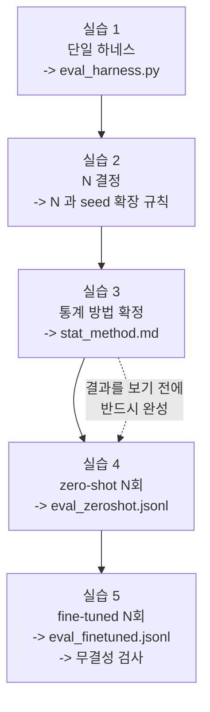

# Week 5 실습: 하네스 통합 -> N 결정 -> 방법 확정 -> 두 측정


> **실습 목표**: 하나의 스크립트로 두 모델을 각각 N회 돌려 seed 단위 원시 결과를 남긴다.
> **예상 시간**: 6-8시간 (대부분 실행 대기)
> **원칙**: 실습 3 (통계 방법 확정) 을 실습 4-5 (실행) 보다 먼저 한다. 결과를 본 뒤에 방법을 고르면 방법이 결과에 맞춰진다.


### 이 문서를 읽는 법


- 각 실습은 **무엇을 하나 / 왜 하나 / 끝나면 손에 남는 것** 세 줄로 시작한다.
- `README.md` 는 개념(왜 통제가 어려운지, 왜 0/N 이 문제인지), 이 문서는 절차다.
- 실습 3 은 **코드를 쓰는 실습이 아니라 문서를 쓰는 실습**이다. 그리고 이 문서에는 어느 통계 방법을 쓰라고 적어 두지 않는다 — 후보를 조사해 고르고 근거를 적는 것이 이 실습의 내용이다.


---


## 0. 이번 주 전체 그림


### 0.1 한 문장으로


> 모델 경로와 `unnorm_key` **두 개만 인자로 받는 스크립트 하나**를 만들고, 그것을 zero-shot 으로 한 번 fine-tuned 로 한 번 돌려 seed 별 결과를 `jsonl` 두 개로 남긴다. 그 전에 어떤 통계 방법으로 판정할지 문서로 확정한다.


### 0.2 5개 실습이 이어지는 방식





점선이 이 주차의 순서 제약이다. 실습 3 을 나중에 하면 방법이 결과에 맞춰진다 (README §7).


### 0.3 자주 걸리는 용어 미리 풀기


| 용어 | 뜻 |
|---|---|
| **하네스** | 평가를 돌리는 장치 전체. 환경 생성 + 루프 + 판정 + 기록 코드의 묶음 |
| **`argparse`** | 명령줄 인자를 받는 파이썬 표준 모듈. `--model` 같은 옵션을 정의한다 |
| **상수 블록** | 스크립트 상단에 고정값을 모아 둔 부분. 여기 값이 곧 측정 조건이다 |
| **`jsonl`** | 한 줄에 json 하나. 실행 중에도 한 줄씩 이어 붙일 수 있다 |
| **`_meta`** | 결과 파일 첫 줄에 넣는 조건 기록. 나중에 두 파일의 조건을 코드로 대조하는 근거 |
| **`flush()`** | 버퍼에 있는 내용을 즉시 파일에 쓴다. 중단 대비 |
| **`assert`** | 조건이 거짓이면 그 자리에서 프로그램을 멈춘다 |
| **`tee`** | 화면 출력과 파일 저장을 동시에 한다 |
| **latency** | 추론 1회 소요 시간 |
| **overhead** | 추론 외에 드는 시간 (sim step, 이미지 변환 등) |
| **신뢰구간** | 참값이 있을 만한 범위. N 이 작으면 넓다 |
| **정규 근사(Wald)** | 성공률 불확실성을 정규분포로 어림하는 계산. 0/N 에서 폭이 0 이 된다 |
| **불일치 쌍** | 두 모델의 결과가 갈린 seed. 개선/악화 방향으로 나뉜다 |
| **2x2 표** | 두 조건의 성패 조합을 네 칸으로 정리한 표 |
| **유의 수준** | 판정 기준값. 보통 0.05 |
| **단측 / 양측** | "개선만" 을 보는지 "차이 자체" 를 보는지. 미리 정해야 한다 |


### 0.4 어디서 실행하나


week4 와 같은 venv(`.venv-vla`) 에서, `week5/scripts/` 를 cwd 로 두고 실행한다. 결과는 `week5/outputs/` (스크립트 기준 `../outputs/`) 에 떨어진다.


---


## 환경 설정


week4 와 같은 환경이다. **버전을 바꾸지 않는다.** 여기서 라이브러리를 올리면 week0 baseline 과 week4 검증이 다른 환경의 결과가 되고, before/after 의 근거가 흔들린다.


```bash
source "/workspace/study/physical-ai-study/Studies/Phase 4/.venv-vla/bin/activate"
cd "/workspace/study/physical-ai-study/Studies/Phase 4.5/week5/scripts"
mkdir -p ../outputs
```


sim 패키지가 이 venv 에 없으면 week0 실습 1-6 의 판단(합칠지 두 프로세스로 나눌지)을 그대로 따른다 — `week0/outputs/env_decision.md` 에 기록해 둔 결정이다. 여기서 새로 판단하지 않는다.


---


## 실습 1: 하네스 통합


**무엇을 하나**: week0 sim 루프와 week4 모델 적재를 하나의 스크립트로 합치고, 모델 경로와 `unnorm_key` 만 명령줄 인자로 받게 만든다.
**왜 하나**: 두 측정이 같은 코드에서 나오는 것이 변인 통제의 유일한 보장이다. 스크립트가 두 개면 한쪽만 고치는 사고가 반드시 일어난다.
**끝나면 손에 남는 것**: `eval_harness.py` — 이후 fine-tuned 측정과 (필요하면) 재현 측정까지 같은 파일로 돌린다.


**파일명**: `eval_harness.py`


**스크립트를 복사해 두 개 만들지 않는다.** 모델을 인자로 받아 하나로 돌린다 — 그것이 변인 통제의 유일한 보장이다.


### 이 스크립트의 구조


| 블록 | 하는 일 | 바뀌면 안 되는가 |
|---|---|---|
| 고정 상수 | 환경 id, step 예산, action repeat, instruction, 카메라 키, 이미지 크기, N | **절대 고정** |
| 인자 | 모델 경로, `unnorm_key`, 출력 경로 | 이 셋만 바뀐다 |
| 모델 적재 | week4 와 동일한 4-bit 설정 | 고정 |
| 통계 주입 | 체크포인트 옆 dataset_statistics.json 을 norm_stats 에 병합 | 고정 (파일이 있을 때만 동작) |
| seed 목록 | week0 산출물에서 읽고 규칙으로 확장 | 두 측정에서 동일 |
| 실행 메타 | 조건을 결과 파일 첫 줄에 기록 | — |
| episode 루프 | 결과를 seed 단위로 즉시 기록 | — |


```python
"""
실습 1: zero-shot / fine-tuned 를 같은 조건으로 N회 평가하는 단일 하네스

실행:
  python eval_harness.py --model openvla/openvla-7b --unnorm-key bridge_orig \
      --out ../outputs/eval_zeroshot.jsonl
  python eval_harness.py --model /workspace/models/openvla-maniskill-ft --unnorm-key maniskill_pickcube \
      --out ../outputs/eval_finetuned.jsonl
"""
import argparse                                    # 모델만 인자로 받기 위해
import json
import os                                          # dataset_statistics.json 경로 조합/존재 확인용
import subprocess                                  # 스크립트 커밋 해시 기록용
import numpy as np
import torch
import gymnasium as gym
import mani_skill.envs
from PIL import Image
from transformers import AutoModelForVision2Seq, AutoProcessor, BitsAndBytesConfig


# ===== 고정 상수: 두 측정에서 절대 바뀌지 않는다 (week0/week4 확정값) =====
ENV_ID = "PickCube-v1"                             # week0 sim_facts.md
MAX_EPISODE_STEPS = 200                            # week0 실습 4-3 확정값 (env step 예산)
ACTION_REPEAT = 4                                  # week0 실습 4-3 확정값 (실효 5 Hz)
POLICY_STEPS = MAX_EPISODE_STEPS // ACTION_REPEAT  # 정책 결정 횟수 = 50
INSTRUCTION = "pick up the cube"                   # week0-1 동일 문구
CAMERA_KEY = ("sensor_data", "base_camera", "rgb")  # week0 확정 경로
IMAGE_SIZE = 224                                   # OpenVLA 입력 크기 (관측 카메라도 224 native)
N_EPISODES = 100                                   # 실습 2 에서 확정한 값
POS_LIMIT = 0.1                                    # pd_ee_delta_pose 위치 한계 (m). action 1.0 = 0.1 m (계약 표 1번)
ROT_SCALE = -0.1                                   # 회전 스케일 (rad). rot_lower 곱셈 때문에 부호 반전 (계약 표 4번)
REACH_DIST = 0.05                                  # reached 임계값 (m). week0 실습 6 확정값
LIFT_Z = 0.04                                      # lifted 임계값 (m). week0 실습 6 확정값


# ===== 변환/판정 함수: week0 실습 6 과 동일한 규칙 =====
def to_maniskill_action(raw_action):
    """OpenVLA 물리량 출력(7,)을 ManiSkill pd_ee_delta_pose 정규화 action(7,)으로 바꾼다.

    규칙의 근거는 week0 action_contract.md 계약 표. 두 모델 모두 물리량(m, rad,
    gripper 0-1)을 내므로 같은 정변환을 쓴다 -- week1 이 학습 라벨을 역변환으로
    같은 물리량 규약에 맞춰 저장했기 때문이다.

    Args:
        raw_action: vla.predict_action() 출력 numpy 배열 (7,)

    Returns:
        ManiSkill action (7,) float32. 전 차원 [-1, 1] 정규화값
    """
    pos = raw_action[:3] / POS_LIMIT               # 미터 -> 정규화 (±0.1 m 가 ±1)
    rot = raw_action[3:6] / ROT_SCALE              # 라디안 -> 정규화, 부호 반전
    rot_norm = np.linalg.norm(rot)                 # 회전은 축별이 아니라 3벡터 노름으로 제한된다
    if rot_norm > 1.0:                             # 노름이 1 을 넘으면 방향을 유지한 채 축소
        rot = rot / rot_norm
    grip = 2.0 * raw_action[6] - 1.0               # [0,1](0=닫힘) -> [-1,1](-1=닫힘)
    action = np.concatenate([np.clip(pos, -1, 1), rot, [np.clip(grip, -1, 1)]])
    return action.astype(np.float32)               # env.step 이 받는 dtype 으로 맞춘다


def to_vec(pose_field):
    """(1, 3) 형태 GPU 텐서 좌표를 (3,) numpy 벡터로 바꾼다.

    Args:
        pose_field: pose.p 같은 배치 텐서

    Returns:
        (3,) float numpy 배열
    """
    return np.asarray(pose_field.cpu())[0]         # GPU -> CPU -> numpy, 배치 차원 제거


# ===== 인자: 이 두 개만 바뀐다 =====
parser = argparse.ArgumentParser()
parser.add_argument("--model", required=True)      # 모델 경로 또는 허브 이름
parser.add_argument("--unnorm-key", required=True)  # 역정규화에 쓸 통계 키
parser.add_argument("--out", required=True)        # 결과 jsonl 경로
args = parser.parse_args()


# ===== 모델 적재: week4 실습 2 와 동일 설정 =====
bnb_config = BitsAndBytesConfig(
    load_in_4bit=True,                             # 두 모델 모두 4-bit (변인 통제)
    bnb_4bit_quant_type="nf4",
    bnb_4bit_use_double_quant=True,
    bnb_4bit_compute_dtype=torch.float16,
)
processor = AutoProcessor.from_pretrained(args.model, trust_remote_code=True)
vla = AutoModelForVision2Seq.from_pretrained(
    args.model,
    attn_implementation="eager",
    torch_dtype=torch.float16,
    low_cpu_mem_usage=True,
    trust_remote_code=True,
    quantization_config=bnb_config,
)


# ===== 통계 주입: 파인튜닝 체크포인트의 dataset_statistics.json (week4 실습 3 과 같은 주입) =====
# 파인튜닝이 만든 새 데이터셋 통계는 config.json 의 norm_stats 에 병합되지 않고
# 체크포인트 옆 dataset_statistics.json 별도 파일로만 저장된다.
# 주입하지 않으면 predict_action 이 unnorm_key 를 찾지 못해 assert 로 죽는다.
stats_path = os.path.join(args.model, "dataset_statistics.json")
if os.path.exists(stats_path):                     # zero-shot(허브 이름)에는 이 파일이 없다
    with open(stats_path) as f:
        vla.norm_stats.update(json.load(f))        # 기존 키를 유지한 채 새 키만 추가


prompt = f"In: What action should the robot take to {INSTRUCTION}?\nOut:"


# ===== eval seed 목록: week0 산출물에서 읽는다 (손으로 옮겨 적지 않는다) =====
with open("../../week0/outputs/zeroshot_baseline.json") as f:
    base_seeds = json.load(f)["seeds"]             # week0 이 쓴 목록
# N 을 늘렸으므로 목록을 확장한다. 규칙을 코드로 고정해 두 측정이 같은 목록을 쓰게 한다.
# 주의: week1 개발에 쓴 seed (DUMP_SEED=100 등) 는 확장 목록에 넣지 않는다 -- 미리 들여다본 문제다
eval_seeds = list(range(N_EPISODES))               # <- 실습 2 에서 정한 확장 규칙으로 교체
assert set(base_seeds) <= set(eval_seeds), "week0 목록이 새 목록에 포함되어야 한다"
# 학습 seed 와의 겹침 검사 (week1 collect_meta.json 의 train_seeds)
with open("../../week1/outputs/dataset/collect_meta.json") as f:
    train_seeds = set(json.load(f)["train_seeds"])
assert not (set(eval_seeds) & train_seeds), "eval seed 에 학습 seed 가 섞였다"


# ===== 실행 메타 (결과 파일에 조건을 박아 둔다) =====
commit = subprocess.run(["git", "rev-parse", "--short", "HEAD"],
                        capture_output=True, text=True).stdout.strip()
meta = {"model": args.model, "unnorm_key": args.unnorm_key, "env_id": ENV_ID,
        "max_episode_steps": MAX_EPISODE_STEPS, "action_repeat": ACTION_REPEAT,
        "instruction": INSTRUCTION, "n_episodes": N_EPISODES,
        "quant": "nf4+dq+fp16", "reach_dist": REACH_DIST, "lift_z": LIFT_Z,
        "commit": commit}


# 환경 생성 인자는 week0 실습 6 과 동일 -- 하나라도 다르면 before/after 가 성립하지 않는다
env = gym.make(
    ENV_ID,
    obs_mode="rgb",
    control_mode="pd_ee_delta_pose",
    render_mode="rgb_array",
    sensor_configs=dict(width=224, height=224),    # week0 과 동일 (관측 카메라 native 224)
    max_episode_steps=MAX_EPISODE_STEPS,
)
base = env.unwrapped                               # 큐브·TCP 좌표는 wrapper 를 벗겨야 보인다


# ===== episode 루프: 결과를 seed 단위로 즉시 append (중단 대비 + 짝지은 비교) =====
with open(args.out, "w") as out_file:
    out_file.write(json.dumps({"_meta": meta}) + "\n")   # 첫 줄에 조건 기록
    for seed in eval_seeds:
        obs, info = env.reset(seed=seed)
        stages = {"reached": False, "grasped": False, "lifted": False, "placed": False}
        reason = "step_cap"                        # 종료 사유 기본값
        done = False
        for policy_step in range(POLICY_STEPS):
            # 카메라 텐서는 cuda 에 있으므로 host 로 복사한 뒤 numpy 로 변환한다
            frame = obs[CAMERA_KEY[0]][CAMERA_KEY[1]][CAMERA_KEY[2]].cpu().numpy()
            if frame.ndim == 4:                    # 배치 차원 제거
                frame = frame[0]
            image = Image.fromarray(frame.astype(np.uint8)).resize((IMAGE_SIZE, IMAGE_SIZE))
            model_inputs = processor(prompt, image).to("cuda:0", dtype=torch.float16)
            with torch.no_grad():
                raw_action = vla.predict_action(
                    input_ids=model_inputs["input_ids"],
                    pixel_values=model_inputs["pixel_values"],
                    unnorm_key=args.unnorm_key,    # 인자로 받은 키
                    do_sample=False,               # 결정적 출력
                )
            action = to_maniskill_action(raw_action)   # week0 정변환 (안 거치면 위치가 1/10, 회전이 반대)
            for _ in range(ACTION_REPEAT):         # 같은 action 을 4 step (week0 과 동일한 실효 주기)
                obs, reward, terminated, truncated, info = env.step(action)

                # 부분 도달률: week0 실습 6 의 판정식과 임계값 그대로
                tcp = to_vec(base.agent.tcp.pose.p)               # 그리퍼 끝 현재 위치
                cube = to_vec(base.cube.pose.p)                   # 큐브 현재 위치
                stages["reached"] |= bool(np.linalg.norm(tcp - cube) < REACH_DIST)
                stages["grasped"] |= bool(info["is_grasped"].item())
                stages["lifted"] |= bool(cube[2] > LIFT_Z)
                stages["placed"] |= bool(info["success"].item())

                if stages["placed"]:
                    reason = "success"
                    done = True
                    break
                if terminated or truncated:
                    reason = "env_end"
                    done = True
                    break
            if done:
                break

        # steps 는 정책 결정 횟수다 (env step 은 이 값 x ACTION_REPEAT 이하) -- week6 실습 2 가 이 키를 읽는다
        record = {"seed": seed, "steps": policy_step + 1, "reason": reason, **stages}
        out_file.write(json.dumps(record) + "\n")  # 즉시 기록 (버퍼에 쌓아 두지 않는다)
        out_file.flush()
        print(f"   seed{seed:03d}: {record}")


env.close()
print(f"\n완료: {args.out}")
```


코드에서 낯선 부분을 풀어 둔다.


- `argparse`: `--model` 같은 옵션을 정의하면 `args.model` 로 값을 받을 수 있다. **인자로 받는 것과 코드를 고치는 것의 차이**가 이번 주의 핵심이다. 인자는 결과 파일에 기록되므로 사후 검증이 되고, 코드 수정은 기록되지 않는다.
- `AutoModelForVision2Seq`: 특정 모델 클래스가 아니라 디스패처다. 체크포인트의 `config.json` 을 읽고 이 모델이 OpenVLA 임을 판단해, 알맞은 실제 클래스를 대신 골라 인스턴스화한다.
- `from_pretrained(...)` 의 인자들 — "어떤 코드로, 어떤 정밀도로, 어떤 attention 구현으로, 어떤 로딩 방식으로 GPU 에 올릴지" 를 지정한다:
  - `args.model` (첫 위치 인자): 로드할 모델의 위치. 허브 이름(`openvla/openvla-7b`)이면 HuggingFace Hub 에서 내려받고, 로컬 경로면 그 디렉터리의 체크포인트를 읽는다. 두 측정 간에 바뀌는 유일한 모델 변수다.
  - `attn_implementation="eager"`: attention 연산을 어떤 구현으로 돌릴지 고른다. `eager` 는 attention 수식을 PyTorch 기본 연산으로 그대로 계산한다 — 가장 느리지만 추가 패키지(flash-attn) 없이 어디서든 돌아간다. 구현이 달라도 수학적 결과는 같고 속도만 다르다. week4 와 같은 값을 쓰는 것 자체가 변인 통제다.
  - `torch_dtype=torch.float16`: 가중치를 올릴 때의 부동소수점 정밀도. 지정하지 않으면 fp32(32비트)로 올라가 메모리를 2배로 먹는다. 4-bit 양자화와 함께 쓰이면 역할이 좁아져서, 양자화되지 않는 부분(LayerNorm 등)과 중간 연산의 정밀도만 정한다. `bnb_4bit_compute_dtype=torch.float16` 과 짝을 맞춘 값이다.
  - `low_cpu_mem_usage=True`: 로딩 중 CPU RAM 피크를 줄인다. 기본 로딩은 "랜덤 초기화 모델을 먼저 만들고 체크포인트를 읽어 덮어쓰기" 순서라 한순간 모델 2벌 분량의 RAM 이 필요한데, 이 옵션은 빈 껍데기(meta device)에 체크포인트 텐서를 바로 채워 넣어 1벌 분량만 쓴다.
  - `trust_remote_code=True`: OpenVLA 는 transformers 내장 아키텍처가 아니다. 모델 클래스 정의가 허브 레포 안의 파이썬 파일로 들어 있고, 이 플래그가 있어야 그 코드를 내려받아 실행한다. 임의 코드 실행에 동의하는 옵션이므로 신뢰하는 레포에만 쓴다. `AutoProcessor.from_pretrained` 에 붙은 것도 같은 이유다.
  - `quantization_config=bnb_config`: 위에서 만든 4-bit 설정을 적용한다. Linear 층 가중치를 NF4 4비트로 압축해 GPU 에 올리므로 7B 모델이 fp16 약 14GB 에서 약 4GB 수준으로 줄어든다. 연산 시에는 4비트 값을 fp16 으로 풀어서(dequantize) 계산한다 — 그 계산 정밀도가 `bnb_4bit_compute_dtype` 이다. 두 모델에 같은 양자화를 걸어야 성능 차이가 fine-tuning 효과인지 양자화 손실인지 구분할 수 있다.
- `vla.norm_stats.update(...)`: `predict_action` 은 `unnorm_key` 로 `norm_stats` 딕셔너리를 찾아 action 을 역정규화한다 (week4 실습 3). 허브의 zero-shot 모델은 사전학습에 쓴 데이터셋들의 통계를 `config.json` 에 들고 있지만, 파인튜닝 체크포인트는 새 데이터셋(`maniskill_pickcube`) 통계를 `config.json` 에 병합하지 않고 `dataset_statistics.json` 별도 파일로만 저장한다. 그래서 로드 직후 이 파일이 있으면 읽어 합친다. `os.path.exists` 분기 하나로 zero-shot(파일 없음)과 fine-tuned(파일 있음)를 같은 코드가 처리하므로, 스크립트를 나누지 않는다는 원칙이 유지된다.
- `subprocess.run(["git", "rev-parse", "--short", "HEAD"])`: 현재 커밋 해시를 읽어 메타에 넣는다. "이 결과가 어느 버전의 코드에서 나왔나" 를 결과 파일이 스스로 답하게 만드는 장치다.
- `stages` 딕셔너리와 `|=`: `|=` 는 "한 번이라도 True 였으면 True 로 유지" 다. 도달 단계는 episode 중 한 번 달성하면 그 뒤에 상태가 바뀌어도 도달한 것으로 센다.
- `assert set(base_seeds) <= set(eval_seeds)`: `<=` 는 부분집합 검사다. week0 목록이 새 목록에 포함돼야 week0 결과와의 대조(실습 4) 가 가능하다.
- 두 번째 `assert`: eval seed 에 학습 seed 가 섞이지 않았는지 본다. week1 에서 이미 확인했지만, N 을 늘려 목록을 확장했으므로 **확장 과정에서 새로 들어온 seed 가 학습 범위와 겹칠 수 있다.** 그래서 여기서 다시 검사한다.
- `out_file.flush()`: 파이썬은 효율을 위해 출력을 버퍼에 모아 두고 나중에 쓴다. `flush()` 는 지금 바로 쓰게 한다. 이 한 줄이 중단 시 결과 보존의 실체다.
- `{"_meta": meta}` 를 첫 줄에: 결과 파일이 조건을 스스로 들고 있게 한다. 실습 5 의 조건 대조가 이 줄을 읽는다.
- `ACTION_REPEAT` 루프: week0 실습 6 과 같은 실효 주기(5 Hz)를 만든다. 이것이 빠지면 정책이 학습 주기보다 4배 빠르게 명령을 내는 셈이 되어, 측정 조건이 week0 과 달라지고 실습 4 의 week0 재현 검사도 통과할 수 없다.
- `to_maniskill_action`: week0 정변환이다. OpenVLA 는 물리량(m, rad)을 내고 env 는 [-1, 1] 정규화값을 받으므로, 이 함수를 거치지 않으면 위치 명령이 의도의 1/10 로 줄고 회전이 반대로 돈다. fine-tuned 모델에도 같은 함수를 쓴다 — week1 이 학습 라벨을 역변환(`to_openvla_actions`)으로 같은 물리량 규약에 맞춰 저장했기 때문이다.
- 단계 판정식: reached(tcp-큐브 거리 < 0.05 m) / grasped(`info["is_grasped"]`) / lifted(큐브 z > 0.04 m) / placed(`info["success"]`) 모두 week0 실습 6 의 판정 경로와 임계값 그대로다. 좌표는 `env.unwrapped` 로 wrapper 를 벗겨야 읽을 수 있다.


**확인 포인트**

- 상수 블록의 값이 week0/week4 기록과 하나도 다르지 않은가 (표로 대조한다 — week4 마무리의 "고정해 넘기는 것" 표가 그 대조표다)
- fine-tuned 경로로 실행했을 때 `unnorm_key` assert 없이 첫 추론이 지나가는가 (통계 주입이 동작한다는 뜻)
- `_meta` 첫 줄에 조건이 다 들어갔는가
- 결과 파일이 실행 중에도 계속 자라는가 (즉시 기록 확인 — 다른 터미널에서 `wc -l` 로 줄 수가 늘어나는지 본다)


---


## 실습 2: N 결정 + 비용 산정


**무엇을 하나**: 추론 latency 실측치로 episode 당 시간과 후보 N 별 총 실행 시간을 계산해, 쓸 N 을 정하고 seed 목록 확장 규칙을 정한다.
**왜 하나**: N 은 판단의 해상도를 결정한다. 감으로 정하면 나중에 "왜 100인가" 에 답할 수 없고, 실행 시간을 모르면 하루를 통째로 대기에 쓰게 된다.
**끝나면 손에 남는 것**: `outputs/eval_plan.md` — 확정 N, 근거, zero-shot 재측정 필요 여부, seed 확장 규칙.


**산출물**: `outputs/eval_plan.md`


실측치로 계산해 N 을 정한다. 감으로 정하지 않는다.


```python
"""
실습 2: 실행 시간을 계산해 N 을 결정 (계산만 -- 실행 없음)
"""
LATENCY_MS = 300          # Measurements/openvla-rtx4070-int4 Block 1 실측 (본인 수치로 교체)
POLICY_STEPS = 50         # week0 확정값 (env step 200 / action repeat 4) -- 추론은 episode 당 최대 50회
OVERHEAD_MS = 20          # sim step 4회 + 이미지 변환 몫 (probe 로 확인해 교체)


per_step_s = (LATENCY_MS + OVERHEAD_MS) / 1000       # 정책 결정 1회 소요
per_episode_s = per_step_s * POLICY_STEPS            # 최악(조기 종료 없음) 기준
print(f"스텝당 {per_step_s:.3f}s / episode 최대 {per_episode_s:.1f}s")


for n in [20, 50, 100, 200]:                         # 후보 N 별 시간
    one_model_min = per_episode_s * n / 60
    print(f"  N={n:3d}: 모델당 약 {one_model_min:.0f}분, 두 모델 약 {one_model_min * 2:.0f}분")
```


계산의 전제를 확인해 둔다.


- `per_episode_s` 는 **최악 기준**이다. 성공하면 조기 종료하므로 실제 시간은 이보다 짧다. 우리 상황에서는 성공률이 낮아 대부분 step cap 까지 가므로 최악에 가깝다고 보는 것이 안전하다.
- `OVERHEAD_MS = 20` 은 가정값이다. 실제로는 sim step 과 이미지 변환에 드는 시간을 짧게 재서 채운다 (예: 10 episode 만 돌려 총 시간 / 총 스텝 수).
- 두 모델을 곱하는 이유: N 을 바꾸면 zero-shot 도 다시 재야 한다 (README §2). 즉 총 비용은 항상 2배다.


**결정에 쓸 근거**

| 항목 | 값 |
|---|---|
| 스텝당 실측 시간 | |
| episode 최대 시간 | |
| 후보 N 별 총 실행 시간 | |
| 확정 N | |
| 확정 근거 | (구간 폭 vs 실행 시간의 절충) |
| **zero-shot 재측정 필요 여부** | N 을 바꿨으면 필요 |
| seed 목록 확장 규칙 | week0 목록을 포함하도록 |


> N 을 올리면 week0 의 20회 결과를 그대로 쓸 수 없다. 같은 N·같은 목록이어야 짝지은 비교가 성립한다. 확장 규칙은 **week0 목록을 부분집합으로 포함**하도록 정하면 옛 결과와의 대조도 가능해진다 — 겹치는 seed 의 결과가 일치하면 week0 재현이 확인된다.


---


## 실습 3: 통계 방법 확정 (실행 전에 작성)


**무엇을 하나**: 성공률에 붙일 구간 추정 방법과 짝지은 비교 방법, 유의 수준, 보고 문장 틀을 **결과를 보기 전에** 정해 문서로 남긴다.
**왜 하나**: 결과를 본 뒤에 방법을 고르면 방법이 결과에 맞춰진다. 그것은 분석이 아니라 사후 정당화이고, 나중에 그 사실을 지적당하면 나머지 서술의 신뢰도까지 떨어진다.
**끝나면 손에 남는 것**: `outputs/stat_method.md` — 고른 방법과 근거, 표본이 작을 때의 대응, 보고 문장 틀.


**산출물**: `outputs/stat_method.md`


**실습 4-5 를 시작하기 전에 이 문서를 완성한다.** 결과를 본 뒤에 방법을 고르면 방법이 결과에 맞춰진다.


### 3-1. 구간 추정 방법 고르기


경계(0/N, N/N)에서 성립하는 방법이 필요하다. 후보를 조사해 하나를 고르고 근거를 적는다.


먼저 왜 필요한지를 코드로 직접 본다. 아래는 **정규 근사가 경계에서 무너지는 것을 눈으로 확인하는** 계산이다.


```python
"""
실습 3-1: 정규 근사가 경계에서 무너지는 것을 직접 확인
"""
import math


N = 100
for success in [0, 1, 5, 25, 50]:                    # 관측값을 바꿔 본다
    p = success / N
    wald_half = 1.96 * math.sqrt(p * (1 - p) / N)     # 정규 근사 반폭
    print(f"  {success:3d}/{N}: p={p:.2f}, 정규 근사 반폭={wald_half:.4f}")
# 0/100 에서 반폭이 0 이 되는 것을 확인한다 -- 이 값을 보고할 수 없다.
```


코드의 항목을 풀어 둔다.


- `p` : 관측된 성공률 (성공 수 / N).
- `1.96` : 95% 구간에 대응하는 정규분포 계수. "95% 구간" 은 관습적인 기본값이다.
- `math.sqrt(p * (1 - p) / N)` : 정규 근사에서 쓰는 표준오차다. **`p` 가 0 이면 `p * (1 - p)` 도 0** 이므로 폭이 0 이 된다. 이것이 README §3 에서 말한 구조적 문제다.
- 반폭(half-width): 구간의 절반 폭. `p ± 반폭` 이 구간이 된다.


고를 것: 경계에서 폭이 0 이 되지 않는 이항 비율 구간 추정 방법. 근사를 보정하는 계열과 근사를 쓰지 않는 계열이 있다. **어느 것을 왜 골랐는지**를 적고, 계산에 쓸 함수(직접 구현 또는 라이브러리)를 확정한다.


적을 때 다룰 질문: 그 방법이 0/N 에서 어떤 값을 주는가 / 구간이 대칭인가 비대칭인가 / 보수적인가(넓게 잡는가) / 우리 N 규모에서 계산 비용이 문제 되지 않는가.


### 3-2. 짝지은 비교 방법 고르기


같은 seed 목록을 쓰므로 관측이 짝지어져 있다 (README §4). 판단의 기반은 **불일치 쌍**이다.


```
        fine-tuned 성공   fine-tuned 실패
zero  성공      a                b
zero  실패      c                d
```


- `a`, `d` 는 두 모델이 같은 결과를 낸 seed — 차이에 대한 정보가 없다
- `b`, `c` 가 불일치 쌍 — **`c` 가 `b` 보다 뚜렷이 많으면 개선의 근거**가 된다


왜 `a`, `d` 가 정보를 주지 않는가. 두 모델이 똑같이 성공한 문제는 어느 쪽이 나은지 말해 주지 않고, 똑같이 실패한 문제도 마찬가지다. 판단은 "같은 문제에서 한쪽만 성공한 경우가 어느 방향으로 몇 건인가" 에서 나온다. 그래서 N=100 이어도 **실제로 판정에 쓰이는 관측은 불일치 쌍의 개수**이고, 그 수가 적으면 판정이 흔들린다.


적을 것: 이 2x2 표를 어떤 방법으로 판정할지, 표본이 작을 때(불일치 쌍이 몇 개뿐일 때)의 대응, 그리고 유의 수준. 단측(개선만 보는가) 과 양측(차이 자체를 보는가) 중 어느 쪽을 쓸지도 **여기서** 정한다 — 결과를 보고 정하면 그것이 사후 정당화다.


### 3-3. 보고 문장의 형태를 미리 정하기


결과를 어떤 문장으로 쓸지 틀을 먼저 만든다. 숫자만 나중에 채운다.


```
zero-shot   {성공}/{N} (95% 구간 {하한}-{상한}%)
fine-tuned  {성공}/{N} (95% 구간 {하한}-{상한}%)
불일치 쌍   개선 {c}건 / 악화 {b}건 -> 판정 {...}
단계별      reached {..} -> {..} / grasped {..} -> {..} / lifted {..} -> {..}
결론        {구간 겹침 여부와 짝지은 판정에 근거한 한 문장}
```


> 이 틀을 미리 만드는 것이 §7 의 "방법을 결과보다 먼저" 를 실행하는 방법이다. 틀이 있으면 결과가 어느 쪽으로 나와도 같은 형식으로 보고하게 되고, 유리한 지표만 골라 쓰는 일이 구조적으로 어려워진다.


---


## 실습 4: zero-shot N회


**무엇을 하나**: 하네스를 zero-shot 모델(`openvla/openvla-7b` + `bridge_orig`) 로 N회 실행한다.
**왜 하나**: N 을 올렸으므로 before 쪽을 새 N·새 seed 목록으로 다시 재야 짝지은 비교가 성립한다. 그리고 week0 과 겹치는 seed 의 결과를 대조하면 **week0 재현 검사**를 겸한다.
**끝나면 손에 남는 것**: `outputs/eval_zeroshot.jsonl` + `outputs/eval_zeroshot.log`.


**실행**


```bash
cd "/workspace/study/physical-ai-study/Studies/Phase 4.5/week5/scripts"
python eval_harness.py \
  --model openvla/openvla-7b \
  --unnorm-key bridge_orig \
  --out ../outputs/eval_zeroshot.jsonl \
  2>&1 | tee ../outputs/eval_zeroshot.log
```


`2>&1 | tee <경로>` 는 화면에 보여주면서 파일로도 남긴다. 한 시간짜리 실행에서 중간 경고를 놓치지 않기 위한 장치다.


**확인 포인트**

- `_meta` 의 `unnorm_key` 가 `bridge_orig` 인가 (week0 과 같은 조건)
- 결과 줄 수가 N+1 (메타 1줄 + episode N줄) 인가
- week0 의 20개 seed 에 해당하는 줄만 뽑아 week0 결과와 비교해 본다 — 크게 다르면 조건이 어긋난 것이다


> 마지막 확인이 유용하다. **week0 재현 검사**를 겸한다 — 같은 seed·같은 조건이면 결과도 같아야 한다 (결정적 추론이므로). 다르다면 그 자리에서 원인을 찾는 것이, fine-tuned 측정까지 마친 뒤 발견하는 것보다 훨씬 싸다.


---


## 실습 5: fine-tuned N회


**무엇을 하나**: 같은 스크립트에 모델 경로와 `unnorm_key` 두 인자만 바꿔 실행한 뒤, 두 결과 파일의 조건이 실제로 같았는지 코드로 검사한다.
**왜 하나**: "두 인자만 바꿨다" 는 주장을 결과 파일로 증명하는 단계다. 그리고 seed 목록이 정확히 같은지 확인해야 짝지은 비교가 성립한다.
**끝나면 손에 남는 것**: `outputs/eval_finetuned.jsonl` + 무결성 검사 통과 기록. **집계와 해석은 하지 않는다.**


**실행** — 바뀌는 것은 두 인자뿐이다.


```bash
python eval_harness.py \
  --model /workspace/models/openvla-maniskill-ft \
  --unnorm-key maniskill_pickcube \
  --out ../outputs/eval_finetuned.jsonl \
  2>&1 | tee ../outputs/eval_finetuned.log
```


**실행 후 무결성 검사** (집계는 하지 않는다)


```python
"""
실습 5: 두 결과 파일의 조건 일치와 짝지음 성립만 확인 (해석 없음)
"""
import json


def load(path):
    """jsonl 을 읽어 메타와 레코드로 나눈다."""
    with open(path) as f:
        lines = [json.loads(line) for line in f]
    return lines[0]["_meta"], lines[1:]


zero_meta, zero_records = load("../outputs/eval_zeroshot.jsonl")
ft_meta, ft_records = load("../outputs/eval_finetuned.jsonl")


# 5-1. 조건 일치 검사: model/unnorm_key 만 달라야 한다
print("\n[5-1] 메타 차이")
for key in set(zero_meta) | set(ft_meta):
    if zero_meta.get(key) != ft_meta.get(key):
        print(f"   {key}: {zero_meta.get(key)} -> {ft_meta.get(key)}")
# 위 출력에 model, unnorm_key 외의 항목이 있으면 변인이 샜다


# 5-2. 짝지음 성립 검사: seed 목록이 정확히 같아야 한다
zero_seeds = [r["seed"] for r in zero_records]
ft_seeds = [r["seed"] for r in ft_records]
print(f"\n[5-2] seed 수: {len(zero_seeds)} / {len(ft_seeds)}")
print("   목록 동일:", zero_seeds == ft_seeds)


# 5-3. 결측 검사
print(f"\n[5-3] 종료 사유 분포")
for records, name in [(zero_records, "zero"), (ft_records, "ft")]:
    reasons = {}
    for record in records:
        reasons[record["reason"]] = reasons.get(record["reason"], 0) + 1
    print(f"   {name}: {reasons}")
# 여기까지가 이번 주다. 성공률 집계와 구간 계산은 week6.
```


검사 코드의 논리를 풀어 둔다.


- 5-1 의 `set(zero_meta) | set(ft_meta)`: 두 메타의 키를 합집합으로 훑는다. 한쪽에만 있는 키도 잡기 위해서다. **"model 과 unnorm_key 만 다르다" 를 눈으로 확인하는 것이 아니라 코드가 출력한 목록으로 확인**하는 것이 이 검사의 요점이다.
- 5-2 의 `zero_seeds == ft_seeds`: 리스트 비교이므로 **순서까지 같은지** 본다. 집합이 같아도 순서가 다르면 나중에 `zip` 으로 짝지을 때 어긋난다 (week6 실습 2 가 `zip` 을 쓴다).
- 5-3 의 종료 사유 분포: `success` / `step_cap` / `env_end` 가 각각 몇 건인지 센다. 이것은 성공률 집계가 아니라 **결측·이상 확인**이다. 예를 들어 `env_end` 가 대부분이면 환경이 예상보다 일찍 끝나고 있다는 뜻이므로 조건을 다시 봐야 한다.


**통과 판정**

| 검사 | 기대 |
|---|---|
| 메타 차이 | `model`, `unnorm_key` 두 항목만 |
| seed 목록 | 두 파일이 정확히 같은 순서·같은 값 |
| 레코드 수 | 양쪽 모두 N |
| week0 재현 (실습 4) | 겹치는 seed 의 결과가 일치 |


---


## 마무리: week6 로 넘기는 것


| 산출물 | week6 에서의 용도 |
|---|---|
| `outputs/eval_zeroshot.jsonl` | before 원시 결과 |
| `outputs/eval_finetuned.jsonl` | after 원시 결과 |
| `outputs/stat_method.md` | 적용할 방법 (미리 확정된 것) |
| `outputs/eval_plan.md` | N 과 그 근거 |


원시 결과와 방법 문서는 `Measurements/` 로 옮긴다.


```bash
mkdir -p "/workspace/study/physical-ai-study/Measurements/openvla-lora-eval/raw"
```


| 옮길 것 | 착지점 |
|---|---|
| 두 `jsonl` + 로그 | `raw/` |
| `stat_method.md`, `eval_plan.md` | `methodology.md` |
| `eval_harness.py` | `scripts/` |


> 집계 수치와 해석은 week6 이 `findings.md` 에 쓴다. 이번 주는 **결과를 보지 않고 넘긴다** — 그것이 방법을 지키는 방식이다. 실행 로그에 seed 별 결과가 흘러가는 것은 어쩔 수 없지만, 성공 횟수를 세어 보는 것은 참는다.
