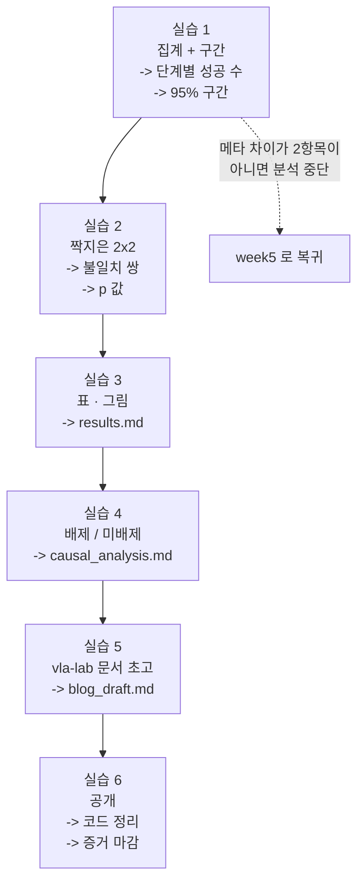

# Week 6 실습: 집계 -> 짝지은 비교 -> 배제 분석 -> 공개


> **실습 목표**: week5 원시 결과에 미리 정한 방법을 적용해 결론을 내고, 배제/미배제 표와 vla-lab 문서 초고를 만들어 v1.5 를 공개한다.
> **예상 시간**: 8-10시간
> **원칙**: 실습 1 을 시작하기 전에 `week5/outputs/stat_method.md` 를 다시 읽는다. 여기서 방법을 새로 고르지 않는다.


### 이 문서를 읽는 법


- 각 실습은 **무엇을 하나 / 왜 하나 / 끝나면 손에 남는 것** 세 줄로 시작한다.
- `README.md` 는 개념(무엇을 주장할 수 있는가), 이 문서는 절차다.
- 실습 4-6 은 코드가 아니라 **문서를 쓰는 실습**이다. 표의 빈칸을 채우는 것이 이 Phase 의 최종 산출물이므로, 여기에 채워진 예시를 적어 두지 않는다.


---


## 0. 이번 주 전체 그림


### 0.1 한 문장으로


> week5 의 두 `jsonl` 을 읽어 단계별 성공 수와 구간을 계산하고, 같은 seed 끼리 짝지어 2x2 표로 비교하고, **앞의 여섯 주가 무엇을 원인 후보에서 배제했는지**를 근거와 함께 표로 정리해, 그 표를 중심으로 글을 쓰고 코드·기록을 공개한다.


### 0.2 6개 실습이 이어지는 방식





점선을 먼저 확인한다. 두 결과 파일의 조건이 다르면 그 뒤 계산은 전부 무의미하므로, 실습 1 의 첫 검사가 관문이다.


### 0.3 자주 걸리는 용어 미리 풀기


| 용어 | 뜻 |
|---|---|
| **집계** | 개별 관측을 합쳐 요약값으로 만드는 것 |
| **신뢰구간** | 참값이 있을 만한 범위. `[하한, 상한]` 으로 적는다 |
| **구간 상한** | 0/N 을 관측했을 때 실제로 보고할 값. "이보다 높을 가능성은 낮다" 를 뜻한다 |
| **짝지은 비교** | 같은 seed 의 두 결과를 나란히 놓고 비교 |
| **불일치 쌍** | 두 모델의 결과가 갈린 seed 의 수 |
| **p 값** | "차이가 없는데도 이런 관측이 우연히 나올" 정도를 나타내는 값. 작으면 우연으로 보기 어렵다 |
| **부호검정** | 불일치 쌍의 방향만 세어 판정하는 방식 |
| **`zip`** | 두 리스트를 같은 위치끼리 짝지어 순회하는 파이썬 함수 |
| **`assert`** | 조건이 거짓이면 즉시 멈춘다. 잘못된 전제로 계산이 진행되는 것을 막는다 |
| **중앙값**(median) | 값들을 정렬해 가운데 있는 값. 이상치에 덜 흔들린다 |
| **배제** | "이것은 원인이 아니다" 를 근거와 함께 확정 |
| **잔여 후보** | 배제하지 못해 남은 원인 후보 |
| **evidence-index** | 포트폴리오의 증거 목록 파일 |
| **vla-lab** | 이 프로젝트가 쓰는 공개 산출물 repo (GitHub — 발행 채널, 2026-08-30 확정) |


### 0.4 어디서 실행하나


분석은 GPU 가 필요 없다. `week6/` 를 cwd 로 두고 실행하며, week5 결과는 상대 경로(`../week5/outputs/...`) 로 읽는다.


---


## 환경 설정


분석은 GPU 가 필요 없다. numpy / scipy / matplotlib 만 있으면 되므로 가벼운 venv 하나로 충분하다.


```bash
cd "/workspace/study/physical-ai-study/Studies/Phase 4.5/week6"
mkdir -p outputs/plots
source "../.venv-sim/bin/activate"          # 또는 numpy/scipy/matplotlib 가 있는 아무 venv
pip install -r requirements.txt
cat ../week5/outputs/stat_method.md         # 적용할 방법을 먼저 다시 읽는다
```


마지막 줄이 절차의 일부다. **방법 문서를 읽고 시작하는 것과, 계산하다가 막혀서 찾아보는 것은 다르다.** 후자는 결과를 이미 본 상태에서 방법을 확인하는 것이므로 §1 의 원칙이 흔들린다.


---


## 실습 1: 집계 + 구간


**무엇을 하나**: 두 `jsonl` 을 읽어 조건이 같았는지 다시 확인하고, 4단계별 성공 수와 신뢰구간을 계산한다.
**왜 하나**: 성공률 하나만 보고하면 N 과 불확실성이 사라진다. 그리고 0/N 인 단계의 **구간 상한**이 이 Phase 에서 실제로 보고할 값이다 (week5 §3).
**끝나면 손에 남는 것**: 단계별 성공 수 + 구간이 담긴 `summary` + 조건 재확인 통과.


**파일명**: `analyze_results.py`


```python
"""
실습 1-2: week5 원시 결과를 집계하고 구간·짝지은 비교를 계산
"""
import json
import matplotlib.pyplot as plt                  # 실습 3 의 그림 저장용
import numpy as np
from scipy import stats                          # 이항 구간·검정용


STAGES = ["reached", "grasped", "lifted", "placed"]   # week0 에서 정한 단계
ALPHA = 0.05                                     # <- week5 stat_method.md 에 적은 값


def load(path):
    """jsonl 을 읽어 메타와 seed 별 레코드로 나눈다."""
    with open(path) as f:
        lines = [json.loads(line) for line in f]
    return lines[0]["_meta"], lines[1:]


zero_meta, zero_records = load("../week5/outputs/eval_zeroshot.jsonl")
ft_meta, ft_records = load("../week5/outputs/eval_finetuned.jsonl")


# -- 1-1. 조건 재확인 (week5 무결성 검사를 한 번 더 -- 분석 직전 마지막 관문) --
print("=" * 60)
print("[1-1] 메타 차이")
for key in set(zero_meta) | set(ft_meta):
    if zero_meta.get(key) != ft_meta.get(key):
        print(f"   {key}: {zero_meta.get(key)} -> {ft_meta.get(key)}")
assert [r["seed"] for r in zero_records] == [r["seed"] for r in ft_records], "seed 목록 불일치"
n = len(zero_records)
print(f"   N = {n}")


# -- 1-2. 단계별 집계 + 구간 --
# 구간 추정 방법은 week5 stat_method.md 에서 확정한 것을 쓴다.
# 경계(0/N)에서 폭이 0 이 되지 않는 방법이어야 한다.
print("\n[1-2] 단계별 성공 수와 구간")
summary = {}
for stage in STAGES:
    zero_hits = sum(r[stage] for r in zero_records)
    ft_hits = sum(r[stage] for r in ft_records)
    # 이항 비율 구간 (경계에서도 성립하는 방법)
    zero_ci = stats.binomtest(zero_hits, n).proportion_ci(confidence_level=1 - ALPHA)
    ft_ci = stats.binomtest(ft_hits, n).proportion_ci(confidence_level=1 - ALPHA)
    summary[stage] = {"zero": (zero_hits, zero_ci), "ft": (ft_hits, ft_ci)}
    print(f"   {stage:8s} zero {zero_hits:3d}/{n} "
          f"[{zero_ci.low:.3f}, {zero_ci.high:.3f}]  |  "
          f"ft {ft_hits:3d}/{n} [{ft_ci.low:.3f}, {ft_ci.high:.3f}]")
# 0/N 에서 low=0 이지만 high 는 0 이 아닌 것을 확인한다 -- 이 상한이 보고할 값이다
```


코드에서 낯선 부분을 풀어 둔다.


- `lines[0]["_meta"]` / `lines[1:]`: week5 하네스가 첫 줄에 조건을, 그 뒤로 seed 별 결과를 적었다. 그 구조를 그대로 되읽는다.
- 1-1 을 **week5 에서 이미 했는데 또 하는 이유**: 그 사이에 파일을 옮기거나 다시 실행했을 수 있다. 분석 직전에 한 번 더 보는 것이 잘못된 전제로 표를 만드는 것보다 싸다.
- `assert [...] == [...]`: seed 목록이 순서까지 같은지 본다. 아래 실습 2 가 `zip` 으로 짝지으므로, 순서가 어긋나면 **다른 문제의 결과끼리 비교**하게 된다. 그 오류는 값이 그럴싸해서 눈으로 잡히지 않는다.
- `sum(r[stage] for r in records)`: `True`/`False` 는 파이썬에서 1/0 으로 더해진다. 그래서 이 한 줄이 "그 단계에 도달한 episode 수" 가 된다.
- `stats.binomtest(hits, n).proportion_ci(...)`: 이항 비율의 구간을 구한다. **week5 에서 고른 방법이 이것과 다르면 그 방법으로 교체한다** — 이 줄은 예시이고, 정본은 `stat_method.md` 다.
- `confidence_level=1 - ALPHA`: `ALPHA=0.05` 면 95% 구간이다.


**확인 포인트**

- 0/N 인 단계의 구간 상한이 0 이 아닌가 (0 이면 방법이 잘못 적용됐다 — week5 §3 의 정규 근사 문제가 그대로 남은 상태다)
- 메타 차이가 `model`, `unnorm_key` 두 항목뿐인가 — 아니면 분석을 중단하고 week5 로 복귀


---


## 실습 2: 짝지은 비교


**무엇을 하나**: 같은 seed 의 두 결과를 짝지어 단계별 2x2 표를 만들고, 불일치 쌍의 개수와 방향으로 판정한다. 성공한 episode 의 소요 스텝도 비교한다.
**왜 하나**: 성공 횟수 두 개만 비교하면 문제 난이도 편차가 잡음으로 들어간다. 같은 seed 끼리 비교하면 그 편차가 상쇄되어 같은 N 에서 더 예민하게 차이를 잡는다 (week5 §4).
**끝나면 손에 남는 것**: 단계별 2x2 표 + 불일치 쌍 수 + p 값. 그리고 효율 비교(중앙값 스텝 수).


같은 스크립트에 이어 쓴다.


```python
# -- 2-1. 단계별 2x2 표 (짝지음의 본체) --
print("\n[2-1] 짝지은 비교")
for stage in STAGES:
    both = only_zero = only_ft = neither = 0
    for zero_record, ft_record in zip(zero_records, ft_records):   # 같은 seed 끼리
        z, f = zero_record[stage], ft_record[stage]
        both += z and f                          # 둘 다 도달
        only_zero += z and not f                 # zero 만 (악화 방향)
        only_ft += f and not z                   # ft 만 (개선 방향)
        neither += not z and not f               # 둘 다 미도달
    discordant = only_zero + only_ft             # 정보를 주는 관측 수
    print(f"\n   {stage}")
    print(f"      둘 다 {both} / zero만 {only_zero} / ft만 {only_ft} / 둘 다 아님 {neither}")
    print(f"      불일치 쌍 {discordant}개 (개선 {only_ft} / 악화 {only_zero})")
    if discordant > 0:
        # 불일치 쌍만 대상으로 한 부호검정 (week5 stat_method.md 의 단측/양측 규칙을 따른다)
        test = stats.binomtest(only_ft, discordant, p=0.5, alternative="two-sided")
        print(f"      p = {test.pvalue:.4f} (유의수준 {ALPHA})")
    else:
        print("      불일치 쌍 없음 -- 차이에 대한 정보가 없다")


# -- 2-2. 효율 비교: 성공한 episode 의 소요 스텝 --
print("\n[2-2] 성공 episode 의 스텝 수")
for records, name in [(zero_records, "zero"), (ft_records, "ft")]:
    steps = [r["steps"] for r in records if r["placed"]]      # 성공한 것만
    if steps:
        print(f"   {name}: n={len(steps)} median={np.median(steps):.0f} "
              f"min={min(steps)} max={max(steps)}")
    else:
        print(f"   {name}: 성공 episode 없음")
```


코드의 논리를 풀어 둔다.


- `zip(zero_records, ft_records)`: 두 리스트를 같은 위치끼리 묶는다. 실습 1 의 `assert` 가 통과했으므로 같은 위치 = 같은 seed 다.
- `both += z and f`: 파이썬에서 `True and True` 는 `True`(=1) 이므로 그대로 더해진다. 네 칸을 한 번의 순회로 센다.
- `discordant`: 판정에 실제로 쓰이는 관측 수다. N=100 이어도 이 값이 4 라면, **판정은 사실상 4개의 관측에 기대고 있다.** 그래서 이 숫자를 결과와 함께 반드시 보고한다.
- `stats.binomtest(only_ft, discordant, p=0.5, ...)`: "불일치 쌍이 두 방향으로 반반씩 나올 것" 이라는 가정 아래, 관측된 치우침이 우연일 확률을 계산한다. 동전을 `discordant` 번 던져 앞면이 `only_ft` 번 나온 것이 이상한지 보는 것과 같다.
- `alternative="two-sided"`: 양측이다. **week5 `stat_method.md` 에서 단측으로 정했다면 그 값으로 바꾼다** — 결과를 보고 바꾸는 것이 §1 이 금지하는 일이다.
- 2-2 에서 중앙값을 쓰는 이유: 성공 episode 수가 적을 때 평균은 한 건에 크게 흔들린다. 중앙값이 더 안정적이다.


**해석의 경계**

- 불일치 쌍이 0 이면 "차이 없음" 이 아니라 **"이 N 으로는 차이에 대한 정보가 없음"** 이다
- 불일치 쌍이 한 자리 수면 p 값이 크게 흔들린다. 그 사실을 결과와 함께 적는다 — 예를 들어 3/3 이 개선 방향이어도 관측 3건은 근거가 얇다


---


## 실습 3: 결과 표·그림


**무엇을 하나**: week5 실습 3-3 에서 만든 보고 틀에 숫자를 채워 `outputs/results.md` 를 완성하고, 단계별 성공 수 막대 그림을 저장한다.
**왜 하나**: 표와 그림이 vla-lab 문서와 `Measurements/findings.md` 에 그대로 들어간다. 그리고 **틀을 미리 만들어 둔 덕에 유리한 지표만 골라 쓰는 일이 어려워진다.**
**끝나면 손에 남는 것**: `outputs/results.md` + `outputs/plots/stage_counts.png` + 한 문장 결론.


**산출물**: `outputs/results.md`, `outputs/plots/`


보고 형식은 week5 실습 3-3 에서 만든 틀을 쓴다. 숫자만 채운다.


```python
# -- 3-1. 단계별 성공 수 막대 (짧게, inline) --
x = np.arange(len(STAGES))                       # 단계 위치
zero_values = [summary[s]["zero"][0] for s in STAGES]
ft_values = [summary[s]["ft"][0] for s in STAGES]
plt.figure(figsize=(7, 4))
plt.bar(x - 0.2, zero_values, width=0.4, label="zero-shot")
plt.bar(x + 0.2, ft_values, width=0.4, label="fine-tuned")
plt.xticks(x, STAGES)
plt.ylabel(f"count (N={n})")
plt.legend()
plt.tight_layout()
plt.savefig("outputs/plots/stage_counts.png")
print("저장: outputs/plots/stage_counts.png")
```


그림 코드의 낯선 부분:


- `x - 0.2` / `x + 0.2` 와 `width=0.4`: 같은 단계 위치에 두 막대를 나란히 놓는 관용적 방법이다. 폭 0.4 짜리 막대를 중심에서 0.2 씩 좌우로 밀면 서로 겹치지 않는다.
- `plt.ylabel(f"count (N={n})")`: 축 이름에 N 을 박아 둔다. 그림만 떼어 봐도 분모를 알 수 있어야 한다 — 퍼센트만 있는 그림은 오해를 만든다.
- `tight_layout()`: 라벨이 잘리지 않게 여백을 조정한다.


`outputs/results.md` 에 채울 표:


| 단계 | zero-shot | 95% 구간 | fine-tuned | 95% 구간 | 불일치 쌍 (개선/악화) | p |
|---|---|---|---|---|---|---|
| reached | | | | | | |
| grasped | | | | | | |
| lifted | | | | | | |
| placed | | | | | | |


그리고 한 문장 결론. **README §4 의 과잉 주장 목록에 걸리는지 확인한 뒤** 확정한다. 특히 구간이 겹치는데 "향상" 이라고 쓰지 않았는지, 부분 도달률 개선을 성공률 개선으로 말하지 않았는지 두 항목을 마지막에 다시 본다.


---


## 실습 4: 배제/미배제 분석


**무엇을 하나**: 앞의 여섯 주가 남긴 검증 기록을 근거로 "원인이 아닌 것" 목록을 채우고, 채울 수 없는 행은 "남은 후보" 표로 옮긴다.
**왜 하나**: 이번 주의 핵심 산출물이다. "무엇이 원인인지 모른다" 와 "무엇이 원인이 아닌지는 안다" 는 완전히 다른 진술이고, 후자가 엔지니어링 증거다 (README §3).
**끝나면 손에 남는 것**: `outputs/causal_analysis.md` — 두 개의 표. Phase 7 에서 다시 쓰이는 문서다.


**산출물**: `outputs/causal_analysis.md`


이번 주의 핵심이다. 원인을 나열하지 않고, **앞의 주차들이 실제로 배제한 것**을 근거와 함께 적는다.


### 4-1. 배제된 후보 표 채우기


각 행의 "근거" 칸에 **파일 경로와 판정 결과**를 적는다. "검증했다" 로 끝내지 않는다. 파일 경로가 있으면 읽는 사람이 확인할 수 있고, 판정 수치가 있으면 그 검증이 실제로 통과했는지 알 수 있다.


| 배제된 후보 | 근거 (파일 + 판정) |
|---|---|
| 통합 버그 (변환·프레임·부호) | week0 `harness_check.md` — 상한 성공률 __/__ |
| 라벨 변환 손실 | week1 `roundtrip_check.md` — 위치 오차 max __ m, 강한 기준 통과 |
| 데이터가 학습에 안 들어감 | week2 `load_check.log` — 배치 스키마·범위 통과 |
| 라벨 이중 정규화 | week2 `norm_check.md` — 정규화 후 대역 __ |
| 학습이 안 돌았음 | week3 `train_log.md` — __스텝 완주, loss __ -> __ |
| `unnorm_key` 오연결 | week4 `compat_check.md` — 두 키 대역 차이 확인 |
| 양자화 조건 차이 | week4 실습 2 — 양쪽 nf4 동일 설정 |
| 측정 조건 누출 | week5 실습 5-1 — 메타 차이 2항목 |


> 근거를 못 채우는 행이 있으면 **그 후보는 배제되지 않았다.** 아래 표로 옮긴다. 이것이 이 분석의 정직성을 지키는 규칙이다. 기억에 의존해 "했던 것 같다" 로 채우면, 표 전체가 검증 불가능한 주장이 된다.


### 4-2. 남은 후보 표 채우기


| 남은 후보 | 왜 남는가 | 확인하려면 무엇이 필요한가 |
|---|---|---|
| 데이터 규모 | 최소선으로 정하고 그 이상 시도 안 함 | 규모를 늘린 2차 학습 |
| 상태 분포 협소 (expert-only) | week1 §7 구조적 한계 | 이탈 상태 라벨링 계열 방법 |
| 도메인 갭 | 이번 Phase 의 전제 | 도메인 정합을 높인 환경 |
| 학습 스텝·하이퍼파라미터 | 예산에서 역산, 탐색 안 함 | 탐색 실험 |
| task 난이도 | 단일 task 고정 | 다른 task |
| 학습의 무작위성 | 학습 1회, seed 반복 없음 | 같은 설정 반복 학습 |


세 번째 칸이 있는 이유: **다음에 무엇을 하면 이 후보가 갈리는지**를 적어 두면 이 표가 Phase 6-7 의 입력이 된다. 즉 이 문서는 결론이 아니라 다음 계획의 재료다.


---


## 실습 5: vla-lab 문서 초고


**무엇을 하나**: README §6 의 6절 구조로 글 한 편을 쓴다. 분량의 절반이 "무엇을 검증했는가" 와 "무엇이 배제되고 무엇이 남았는가" 에 간다.
**왜 하나**: 이 Phase 의 산출물이 성공률 숫자가 아니라 서사이기 때문이다. 그리고 배제를 축으로 쓰면 결과가 어느 쪽이어도 같은 구조로 쓸 수 있다.
**끝나면 손에 남는 것**: `outputs/blog_draft.md`.


**산출물**: `outputs/blog_draft.md`


README §6 의 6절 구조를 그대로 쓴다. 분량의 절반이 "실행: 무엇을 검증했는가" 와 "분석: 무엇이 배제되고 무엇이 남았는가" 에 간다.


```markdown
# (제목)

## 1. 문제
sim 에서 VLA 를 특정 task 에 adaptation 할 수 있는가. 왜 sim 인가(미학습 분포 + 타이밍),
그리고 그 선택의 한계.

## 2. 설계 — 무엇을 통제했는가
- 변인은 모델 하나. 고정한 항목 목록
- 지표를 두 층으로 (최종 성공률 + 부분 도달률) 둔 이유
- N 과 통계 방법을 결과 전에 정한 이유

## 3. 실행 — 각 단계에서 무엇을 검증했는가
- 하네스 검증 (상한 대조 / 공개 수치 대조)
- 라벨 round-trip
- 로드 검증 / 정규화 계약
- 4층 모델 검증
- 측정 조건 무결성

## 4. 결과
실습 3 의 표와 그림. 구간과 불일치 쌍을 함께.

## 5. 분석 — 배제와 잔여
실습 4 의 두 표. 여기가 이 글의 중심이다.

## 6. 한계와 다음
sim 증거의 한계, real 확장(Phase 7), 남은 후보를 가르려면 무엇이 필요한지.
```


**작성 규칙**

- 수치는 반드시 분자/분모 + 구간으로. 퍼센트 단독 금지 — "25%" 는 4/16 인지 25/100 인지 알 수 없고, 두 값의 신뢰도는 전혀 다르다
- README §4 목록에 걸리는 문장은 고친다
- "검증했다" 를 쓸 때마다 어떤 판정으로 통과했는지 한 줄 덧붙인다. 검증의 신뢰도는 "했다" 가 아니라 "무엇을 봤다" 에서 나온다
- 실패·되돌린 지점을 적는다 (예: 라벨을 재생성한 이유). 매끄러운 서사보다 신뢰를 얻는다 — 아무것도 틀리지 않은 기록은 읽는 사람에게 "안 적은 것" 으로 읽힌다


---


## 실습 6: v1.5 공개


**무엇을 하나**: 흩어진 코드를 정리하고 재현 절차를 README 로 쓰고, `Measurements/` 세 디렉터리를 마감하고, 증거 목록과 vla-lab 문서를 공개한 뒤 Roadmap 체크리스트를 대조한다.
**왜 하나**: 이 Phase 의 결과가 남에게 검증 가능한 형태로 남아야 포트폴리오 증거가 된다. 그리고 닫히지 않은 항목을 정직하게 표시하는 것이 다음 Phase 계획의 전제가 된다.
**끝나면 손에 남는 것**: 정리된 코드 + README + 마감된 `Measurements/` + `Portfolio/evidence-index.md` 한 줄 + 발행된 글.


### 6-1. 코드 정리


| 대상 | 위치 |
|---|---|
| eval harness | week5 `eval_harness.py` |
| action 변환 (정/역) | 한 곳에 모은 구현체 |
| RLDS 빌더 | week2 |
| 등록 패치 + 기준 커밋 | week2 `outputs/` |
| Dockerfile | week3 |
| 분석 스크립트 | 이번 주 `analyze_results.py` |


README 에 적을 것: 재현 절차(순서대로), 각 단계의 검증 방법, 그리고 **재생성 불가한 것과 가능한 것의 구분**. 마지막 항목이 실질적으로 중요하다 — 데이터셋과 가중치는 절차만 있으면 다시 만들 수 있지만, 등록 패치·기준 커밋·판단 근거는 기록이 사라지면 복구되지 않는다.


### 6-2. 증거 마감


```bash
cd /workspace/study/physical-ai-study
ls Measurements/openvla-maniskill-zeroshot/    # week0
ls Measurements/openvla-lora-runpod/           # week3-4
ls Measurements/openvla-lora-eval/             # week5-6
```


각 디렉터리에 `environment.md` / `methodology.md` / `raw/` / `findings.md` 가 채워져 있는지 확인한다. 네 파일의 역할이 다르다 — `environment.md` 는 어떤 환경에서, `methodology.md` 는 어떤 방법으로, `raw/` 는 원시 관측, `findings.md` 는 결론이다. 이번 주 산출물의 착지점:


| 산출물 | 착지점 |
|---|---|
| `outputs/results.md` | `Measurements/openvla-lora-eval/findings.md` |
| `outputs/causal_analysis.md` | 같은 파일의 분석 절 |
| `outputs/plots/` | 같은 디렉터리 `plots/` |
| `analyze_results.py` | 같은 디렉터리 `scripts/` |


### 6-3. 공개


- `Portfolio/evidence-index.md` 에 행 추가 — 증거 / 날짜 / 위치 / 입증 역량
- vla-lab 문서 발행. LinkedIn 공유는 probe 2단 일정에 맞춘다
- 루트 `README.md` 의 실측 결과 절에 v1.5 행 추가 여부 판단 — **구간을 함께 적을 수 있을 때만** 추가한다. 성공률만 단독으로 올리면 README 가 과잉 주장을 하는 자리가 된다


### 6-4. Roadmap 완료 체크리스트 대조


[`Roadmap/Phase 4.5.md`](../../../Roadmap/Phase%204.5.md) 의 완료 체크리스트를 열어 항목별로 닫힌 위치를 확인한다 (README §8 의 대조 표). 닫히지 않은 항목이 있으면 **체크하지 않고 사유를 적는다** — 미완을 완료로 표시하면 그 문서가 계획의 진실 공급원 역할을 못 하게 되고, Phase 6-7 계획이 잘못된 전제 위에 세워진다.


---


## 마무리


Phase 4.5 가 여기서 닫힌다. 남기는 것은 세 가지다.


| 산출물 | 다음에서의 용도 |
|---|---|
| 배제/미배제 표 | Phase 7 에서 real 로 옮기면 배제 목록이 리셋된다 — 무엇을 다시 검증해야 하는지의 목록 |
| eval harness + 변환 코드 | Phase 7 의 real 데이터 파이프라인이 재사용 |
| 한계 서술 | 2026.11 분기 재평가의 입력 (sim 증거가 둘째 층으로 읽히는지) |
