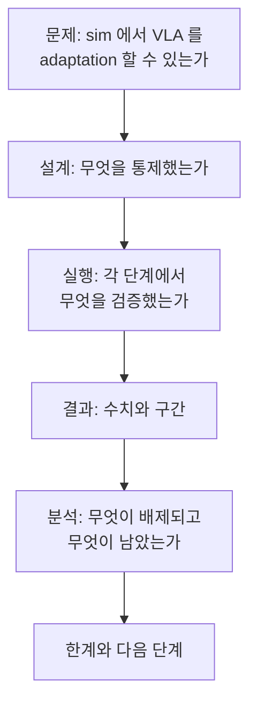

# Week 6 — before/after 분석 + 블로그 + v1.5 공개

> **이번 주 목표**: week5 원시 결과에 미리 정한 방법을 적용해 결론을 내고, **무엇을 배제했는지**를 축으로 블로그 1편을 써서 v1.5 를 공개한다.
> **예상 시간**: 8-10시간
> **핵심 질문**: "성공률이 오르지 않았을 때, 그 결과로 무엇을 주장할 수 있는가?"
> **선행**: [week5](../week5/README.md) 완료 — 두 `jsonl` + `stat_method.md` + `eval_plan.md`
> **대응 Roadmap**: [`Roadmap/Phase 4.5.md`](../../../Roadmap/Phase%204.5.md) Section 3 주차 6 + 완료 체크리스트

---

## 학습 순서

| 순서 | 단계 | 파일/자료 | 설명 |
|:----:|------|----------|------|
| 1 | 집계 + 구간 | `PRACTICE.md` 1 | week5 방법을 적용 (새로 고르지 않는다) |
| 2 | 짝지은 비교 | `PRACTICE.md` 2 | 2x2 표 + 단계별 |
| 3 | 결과 표·그림 | `PRACTICE.md` 3 | 보고 형식 완성 |
| 4 | 배제/미배제 분석 | `PRACTICE.md` 4 | 이번 주의 핵심 산출물 |
| 5 | 블로그 초고 | `PRACTICE.md` 5 | 배제를 축으로 |
| 6 | v1.5 공개 | `PRACTICE.md` 6 | 코드 정리 + 증거 마감 |
| 7 | 퀴즈 | quiz_easy / quiz_medium | 주장 범위 / 원인 분석 |

---

## 핵심 개념

### 1. 이번 주는 방법을 고르지 않는다

구간 추정 방법, 단측/양측, 유의 수준은 week5 실습 3 에서 **결과를 보기 전에** 정해 `stat_method.md` 에 적어 뒀다. 이번 주는 그것을 적용한다.

결과가 아쉬울 때 방법을 다시 만지고 싶어지는데, 그 순간 분석이 아니라 사후 정당화가 된다. 방법을 바꾸고 싶으면 **바꾼 사실과 이유를 결과와 함께 적는다** — 감추는 것보다 낫다.

### 2. 네 가지 결과 시나리오와 각각 말할 수 있는 것

결과는 네 갈래다. 어느 쪽이 나와도 서사가 성립하도록 미리 정리해 둔다.

| 시나리오 | 관측 | 말할 수 있는 것 | 말할 수 없는 것 |
|---|---|---|---|
| A. 상승 + 구간 분리 | 성공률이 오르고 구간이 겹치지 않음 | 이 sim task 에서 소규모 LoRA 가 측정 가능한 개선을 만들었다 | 다른 task·다른 embodiment·real 로의 일반화 |
| B. 상승 + 구간 겹침 | 올랐지만 노이즈 범위 | 방향은 개선이나 이 N 으로는 판정 불가. 필요한 N 을 역산해 제시할 수 있다 | "개선됐다" 는 단정 |
| C. 변화 없음 | 최종 성공률이 양쪽 모두 바닥 | 부분 도달률에서 어느 단계가 움직였는지 (또는 아무 단계도 안 움직였는지) | adaptation 이 원리적으로 무효라는 주장 |
| D. 악화 | fine-tuned 가 더 낮음 | 소규모 데이터 적응이 기존 능력을 훼손했을 가능성과 그 후보 원인 | 어느 원인인지 확정 (반복 실험 없이는) |

C 와 D 가 흔한 결과다. 그리고 **C·D 에서도 산출물은 성립한다** — Roadmap 의 성공 기준이 "성공률 상승" 이 아니라 "설계-실행-정량 분석" 이기 때문이다.

### 3. 원인 분석은 나열이 아니라 배제다

"데이터가 적어서 / 분포가 달라서 / 학습 설정 때문에" 를 나열하는 것은 분석이 아니다. 누구나 쓸 수 있고 아무것도 좁히지 못한다.

이 프로젝트가 할 수 있는 것은 다르다. **week0-5 의 검증 기록이 원인 후보를 실제로 배제한다.**

| 배제된 후보 | 근거 |
|---|---|
| 통합 버그 (action 변환·프레임·부호) | week0 하네스 검증 — 상한 대조 / 공개 수치 대조 |
| 라벨 변환 손실 | week1 round-trip 검증 (강한 기준 통과) |
| 데이터가 학습에 안 들어감 | week2 로드 검증 (배치 스키마·범위 검사) |
| 라벨 이중 정규화 | week2 정규화 계약 확인 |
| 학습이 안 돌았음 | week3 완주 기록 + loss 추이 |
| `unnorm_key` 오연결 | week4 값 대역 검사 |
| 양자화 조건 차이 | week4 4-bit 설정 일치 확인 |
| 측정 조건 누출 | week5 무결성 검사 (메타 차이 2항목) |

| 배제되지 않은 후보 | 왜 남는가 |
|---|---|
| 데이터 규모 | 최소선으로 정했고 그 이상을 시도하지 않았다 |
| 상태 분포 협소 (expert-only) | week1 §7 의 구조적 한계. 이탈 상태의 정답이 데이터에 없다 |
| 도메인 갭 자체 | sim 렌더와 사전학습 분포의 거리. 이번 Phase 의 전제였다 |
| 학습 스텝 수·하이퍼파라미터 | 예산에서 역산한 값이고 탐색하지 않았다 |
| task 난이도 | PickCube 단일 task 로 고정했다 |
| 학습 실행의 무작위성 | 학습을 1회만 돌렸다 — seed 를 바꾼 반복이 없다 |

**이 두 표가 이번 주의 핵심 산출물이다.** "무엇이 원인인지 모른다" 와 "무엇이 원인이 아닌지는 안다" 는 완전히 다른 진술이고, 후자가 엔지니어링 증거다.

### 4. 과잉 주장의 목록을 미리 만들어 둔다

결론을 쓸 때 넘기 쉬운 선을 미리 적어 둔다.

| 넘지 말 것 | 이유 |
|---|---|
| sim 결과를 실로봇 성능으로 말하기 | 도메인이 다르다. real 확장은 Phase 7 |
| 단일 task 결과를 일반화 | PickCube 하나다 |
| 단일 embodiment 결과를 cross-embodiment 로 | 같은 팔 하나다 |
| 학습 1회 결과를 "LoRA 는 ~하다" 로 | 학습 seed 반복이 없다 |
| 구간이 겹치는데 "향상" 이라고 쓰기 | 판정 불가와 개선은 다르다 |
| 부분 도달률 개선을 성공률 개선으로 말하기 | 다른 지표다 |

마지막 두 줄이 특히 미끄럽다. 쓰고 싶은 문장이 이 목록에 걸리면, 문장을 고치는 것이 맞다 — 근거를 늘리는 것이 아니라.

### 5. sim 증거의 한계는 본문에 적는다

sim 기반 adaptation 은 real 데이터 adaptation 과 설득력이 다르다. 이 사실을 숨기면 읽는 사람이 먼저 발견하고, 그 순간 나머지 서술의 신뢰도까지 떨어진다.

적을 것: sim 이라는 선택의 **이유**(OpenVLA 미학습 분포 확보 + 타이밍), 그로 인한 한계, 그리고 real 로의 확장 계획(Phase 7). 한계를 먼저 적고 그 다음에 그 안에서 무엇을 했는지 쓰는 순서가 방어에 유리하다.

### 6. 블로그의 논지는 결과가 아니라 배제다

성공률 숫자를 중심에 두면 결과에 따라 글이 흔들린다. 배제를 중심에 두면 어느 결과에서도 같은 구조로 쓸 수 있다.

이 구조에서 결과(D)는 6개 절 중 하나다. C 와 E 가 분량의 절반을 차지하는 것이 이 글의 성격이다.

### 7. v1.5 공개의 범위

공개하는 것과 하지 않는 것을 구분한다.

| 공개 | 비공개 |
|---|---|
| eval harness / 변환 코드 / 빌더 / Dockerfile | 모델 가중치 (용량) |
| 결과 표·그림·원시 집계 | 수집 데이터셋 원본 (용량 — 재생성 절차로 대체) |
| 방법 문서 (`stat_method.md` 등) | 학습 seed 목록 전체 (필요하면 규칙만) |
| 한계와 배제 표 | |

판정 기준은 `Measurements/README.md` 의 보존 정책과 같다 — **재생성 가능한 것은 절차만, 손으로 한 판단은 기록으로.**

### 8. Roadmap 완료 체크리스트와 대조한다

이번 주 끝에 Phase 4.5 가 닫히는지 항목별로 확인한다.

| Roadmap 항목 | 어디서 닫히는가 |
|---|---|
| sim 생성 데이터가 미학습 분포임을 확인 | week1 실습 5 |
| LoRA 1 사이클 완료 + 체크포인트 | week3 실습 4 |
| 로컬 4-bit + 호환성 검증 통과 | week4 4층 검증 |
| before/after 신호가 성립하는 지표를 썼는지 | week5 (부분 도달률 병기) |
| 동일 조건 N회 측정 (N 명시) | week5 실습 4-5 |
| 성공률 차이를 분산과 함께 보고 | 이번 주 실습 1-3 |
| 차이가 노이즈면 원인 분석을 산출물로 | 이번 주 실습 4 |
| 코드 정리 + README | 이번 주 실습 6 |
| 블로그 1편 + 공개 | 이번 주 실습 5-6 |

---

## 자체 점검

문서를 보지 않고 답한다. 막히면 해당 절로 돌아간다.

**Q1.** 결과가 아쉬울 때 통계 방법을 바꾸면 안 되는 이유는. 바꿔야 한다면 어떻게 하는가. (§1)

**Q2.** 최종 성공률이 양쪽 모두 0 인 시나리오에서 말할 수 있는 것과 말할 수 없는 것을 각각 하나씩. (§2)

**Q3.** "데이터가 적어서 안 올랐다" 가 분석이 아닌 이유는. 이 프로젝트가 대신 할 수 있는 진술은 무엇인가. (§3)

**Q4.** week0 하네스 검증이 이번 주의 원인 분석에서 하는 역할은. (§3)

**Q5.** 배제되지 않은 후보 3개를 들고, 각각 왜 남는지 말하라. (§3)

**Q6.** 부분 도달률이 개선됐을 때 쓰면 안 되는 문장 형태는. (§4)

**Q7.** 블로그를 배제 중심으로 구성하면 결과에 따라 글이 흔들리지 않는 이유는. (§6)

---

## 이번 주 실습 & 다음 주 준비

### 이번 주 실습 과제

1. `analyze_results.py` — 집계 + 구간 (week5 방법 적용)
2. 짝지은 2x2 + 단계별 비교 — 같은 스크립트에 이어서
3. 결과 표·그림 — `outputs/results.md`, `outputs/plots/`
4. 배제/미배제 분석 표 — `outputs/causal_analysis.md`
5. 블로그 초고 — `outputs/blog_draft.md`
6. v1.5 공개 — 코드 정리 + `Measurements/` 마감 + `Portfolio/evidence-index.md`

### 이번 주 산출 (must / nice)

- must: 결과 표(N·구간·짝지은 판정) + 배제/미배제 표 + 블로그 초고 + 정리된 코드/README
- nice: "consumer GPU 로 VLA adaptation" 각도의 글감 분리 (검색 유입용 별도 글)

### Phase 4.5 이후

- **2026.11 분기 재평가**: sim adaptation 이 둘째 층 증거로 읽히는지 점검 (sim 증거의 설득력 한계)
- **Phase 6 (v2)**: sim-to-real gap 에 집중
- **Phase 7 (v3)**: 이번 파이프라인을 자작 팔 teleop(real) 데이터로 확장. 이번 주에 정리한 **배제/미배제 표가 그때 다시 쓰인다** — real 로 옮기면 배제 목록이 리셋되므로, 무엇을 다시 검증해야 하는지의 목록이 된다

---

## 이번 주 핵심 요약

1. **방법은 이미 정해져 있다** — 적용만 한다. 바꾸려면 바꾼 사실을 함께 적는다.
2. **네 시나리오 모두에서 산출물이 성립한다** — 성공 기준이 상승이 아니라 분석이다.
3. **원인 분석은 배제다** — "무엇이 원인이 아닌지 안다" 가 엔지니어링 증거다.
4. **과잉 주장 목록을 먼저 만든다** — 문장이 걸리면 문장을 고친다.
5. **sim 의 한계를 먼저 쓴다** — 숨기면 신뢰도가 더 깎인다.
6. **블로그는 배제를 축으로** — 결과가 어느 쪽이어도 같은 구조로 쓰인다.

---

이전: [Week 5 — eval harness: zero-shot vs fine-tuned](../week5/README.md)

Phase 4.5 종료. 다음: [`Roadmap/Phase 6.md`](../../../Roadmap/Phase%206.md)
