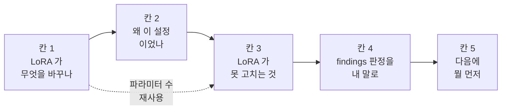

# LoRA 이해 검증 가이드 — v1.5 실험을 내 말로 설명하기

> 작성일: 2026-09-13
> 목적: "LoRA 를 해봤다" 에서 "왜 이 설정이었고, 무엇을 고칠 수 없고, 결과가 무엇을 뜻하는지 말할 수 있다" 로 올린다. 면접에서 v1.5 를 방어하는 데 필요한 최소 이해가 기준이다.
> 방식: **질문 사다리.** 이 문서에는 답이 없다. 각 칸의 "답" 란을 **원문을 덮고** 채운 뒤 원문을 열어 대조한다.
> 완료 게이트: 칸별 답을 Claude 에 보내면 가이드에 없던 후속 질문 2-3개로 검증한다. 즉답하면 그 칸을 닫는다.
> 예상 시간: 칸당 1-2시간, 총 5-8시간. 하루 한 칸.

---

## 0. 왜 이 문서인가

실습을 끝냈는데 핵심을 모른 채 넘어간 느낌이 드는 이유는 세 가지다.

- **읽기만 하고 덮고 쓴 적이 없다.** 문서를 읽으면 안 것 같은 느낌이 들지만, 그것은 문서의 이해이지 본인의 이해가 아니다. 검토 보고서 v1.4 가 지적한 "남의 문서 요약 수준" 이 이 상태다.
- **실습이 "돌리기" 였고 "계산하기" 가 없었다.** LoRA 는 산수 서너 개로 요약되는 개념이다. 파라미터 수, 메모리, 학습률 배수를 직접 계산해 본 적이 없으면 LoRA 는 계속 남의 말로 남는다.
- **질문이 너무 컸다.** "LoRA 를 이해한다" 는 답할 수 없는 질문이다. 칸당 계산 하나, 판정 하나로 쪼개야 한다.

이 문서는 그 셋을 뒤집는다. 계산은 식까지 쓰고, 원문은 덮고 쓰고, 칸은 작게 자른다.

---

## 1. 사용 규칙

1. **하루 한 칸, 순서대로.** 칸 3 은 칸 1 의 계산을 재사용하고, 칸 5 는 칸 4 의 판정 위에 선다. 건너뛰면 뒤 칸의 답이 빈다.
2. **원문을 덮고 먼저 쓴다.** 각 칸의 "답" 란을 원문 없이 채운 뒤에 "원문" 표의 파일을 열어 대조한다. 틀린 곳만 고치고, 고친 자리에 `(대조 후 수정)` 을 남긴다. 원문을 열어 놓고 쓰면 이 문서는 무의미하다.
3. **계산 질문은 식까지 쓴다.** 결과 숫자만 적힌 답은 게이트에서 통과시키지 않는다.
4. **모르면 모른다고 쓴다.** 빈 칸은 "원문의 어느 절을 다시 볼지" 를 적는 자리가 된다. 그럴듯하게 메우면 게이트에서 걸린다.
5. **게이트를 통과한 칸만 §3 보드에 체크한다.** 답을 썼다는 것과 이해했다는 것은 다른 상태다.

칸 사이의 의존 관계:

---

## 2. 용어 풀이

정의만 적는다. 메커니즘과 수치는 칸의 질문이 묻는다. 정의가 답을 대신하지 않도록 일부러 짧게 둔다.

| 용어 | 뜻 |
|---|---|
| **LoRA**(Low-Rank Adaptation) | 사전학습된 가중치 행렬 W 를 얼려 두고, 그 옆에 작은 행렬 두 개 B, A 를 붙여 그 둘만 학습하는 방식 |
| **rank r** | B 와 A 가 공유하는 작은 차원. B 는 (d x r), A 는 (r x k) |
| **alpha** | r 과 함께 LoRA 항의 크기를 정하는 계수. 정확히 어디에 곱해지는지는 칸 1 질문 3 |
| **target_modules** | 모델 안의 어느 선형층에 LoRA 를 붙일지의 목록. `all-linear` 는 모든 선형층 |
| **merge / 재머지** | 학습이 끝난 B, A 를 W 에 더해 하나의 행렬로 합치는 것. v1.5 에서는 week4 에서 다시 수행했다 |
| **full FT**(full fine-tuning) | LoRA 없이 모델의 모든 파라미터를 학습하는 방식 |
| **유효 배치** | 한 번의 가중치 갱신에 실제로 반영되는 샘플 수. batch_size 와 grad_accumulation_steps 의 곱 |
| **regime** | 어떤 조건 안에서는 A 가 성립하고 밖에서는 B 가 성립할 때, 그 조건의 범위를 부르는 말 |
| **intruder dimensions** | LoRA 로 학습한 가중치를 특이값 분해했을 때 나타나는, full FT 에는 없는 새로운 큰 특이벡터를 부르는 이름. 무엇을 뜻하는지는 칸 3 질문 3 |
| **짝지은 비교** | 같은 seed 로 두 모델을 돌려 결과를 쌍으로 묶어 비교하는 것. 독립 표본 비교와 다르다 |
| **불일치 쌍** | 짝지은 비교에서 두 모델의 결과가 서로 다른 쌍 |
| **Wilson 구간** | 성공 횟수가 0 에 가까울 때도 쓸 수 있는 이항 비율의 신뢰구간 |
| **배제된 후보 / 남은 후보** | findings §3 의 구분. 기록이 실제로 부정한 원인과, 부정하지 못한 원인 |

---

## 3. 진행 보드

| 칸 | 답 작성 | 게이트 통과 | 닫은 날짜 |
|---|---|---|---|
| 1. LoRA 가 무엇을 바꾸나 | [ ] | [ ] | |
| 2. 왜 이 설정이었나 | [ ] | [ ] | |
| 3. LoRA 가 못 고치는 것 | [ ] | [ ] | |
| 4. findings 판정을 내 말로 | [ ] | [ ] | |
| 5. 다음에 뭘 먼저 | [ ] | [ ] | |

---

## 4. 사다리

### 칸 1. LoRA 가 무엇을 바꾸나

**이 칸의 목적.** LoRA 를 "메모리를 아끼는 기법" 이라는 한 줄로만 알고 있으면 칸 2 이후의 질문에 답할 수 없다. 이 칸은 LoRA 가 가중치의 어디를, 얼마나, 어떤 식으로 바꾸는지를 산수로 확인한다. 네 질문 모두 계산이거나 계산에 근거한 구분이다.

**원문.**

| 원문 | 볼 곳 |
|---|---|
| [Phase 4 week5 README](../../Phase%204/week5/README.md) | §5 LoRA Config 상세, §6 GPU 메모리 예상 |
| [adapter_config.json](../../../Measurements/openvla-lora-runpod/raw/adapter_config.json) | `r`, `lora_alpha`, `target_modules` |
| [LoRA Without Regret](https://thinkingmachines.ai/blog/lora/) | "LoRA rank", "Optimal learning rate and rank" 절 |

**미시 질문.**

1. 4096 x 4096 가중치 하나에 r=32 LoRA 를 붙이면 학습되는 파라미터는 몇 개인가. 원래 행렬의 몇 % 인가. 계산식을 쓴다.
2. 학습 중 동결된 W 와 학습되는 B, A 는 forward 에서 둘 다 쓰이는가. 추론 전에 merge 하면 무엇이 달라지고 무엇은 같은가. v1.5 에서 week4 에 재머지를 왜 했는지와 연결한다.
3. alpha/r 라는 scaling 은 무엇에 곱해지는가. r 을 두 배로 늘려도 학습 초반의 곡선이 같은 이유는 무엇인가.
4. week5 README §6 메모리 표의 6개 항목을 "LoRA 덕분에 줄어든 것" 과 "LoRA 와 무관한 것" 으로 나눈다. 각 항목에 한 줄 근거.

**답.** (원문을 덮고 쓴다)

1.

2.

3.

4.

**게이트 기록.** (Claude 의 후속 질문과 결과를 여기 적는다)

-

---

### 칸 2. 왜 이 설정이었나

**이 칸의 목적.** v1.5 의 LoRA 설정은 대부분 upstream 스크립트 기본값이다. 기본값을 쓴 것 자체는 문제가 아니지만, "기본값을 그냥 썼다" 와 "기본값이 무엇이고 왜 그대로 둬도 됐는지 확인하고 썼다" 는 면접에서 다른 답이다. 이 칸은 실제 설정 파일과 교재의 예시가 어디서 다른지, 그리고 full FT 가 애초에 선택지였는지를 숫자로 확인한다.

**원문.**

| 원문 | 볼 곳 |
|---|---|
| [adapter_config.json](../../../Measurements/openvla-lora-runpod/raw/adapter_config.json) | 전체 |
| [Phase 4 week5 README](../../Phase%204/week5/README.md) | §4 Fine-tuning 흐름 (lr, warmup), §5 예시 config |
| [runpod methodology](../../../Measurements/openvla-lora-runpod/methodology.md) | §3 본 사이클 실행 조건 |
| [week3 train_log](../week3/outputs/train_log.md) | §1 실행 조건 |
| [OpenVLA finetune.py](https://github.com/openvla/openvla/blob/main/vla-scripts/finetune.py) | `FinetuneConfig` 의 기본값, `LoraConfig(...)` 생성부 |
| [OpenVLA 논문](https://arxiv.org/abs/2406.09246) | fine-tuning 실험 설정 (full FT 의 학습률) |

**미시 질문.**

1. week5 README §5 의 예시 config 와 실제 adapter_config.json 은 어디가 다른가. alpha, target_modules 의 개수, vision encoder 포함 여부, lm_head 포함 여부를 항목별로 적는다. 어느 쪽이 upstream 기본값인가. finetune.py 에서 그 줄을 찾아 인용한다.
2. v1.5 의 학습률 5e-4 는 OpenVLA 논문의 full FT 학습률의 몇 배인가. LoRA Without Regret 이 말하는 LoRA 대 full FT 의 학습률 배수와 비교하면 높은가 낮은가.
3. 7B 모델을 full FT 하면 파라미터, 그래디언트, Adam 상태만으로 몇 GB 인가. fp16 또는 bf16 기준으로 식을 쓴다. RTX 4090 24GB 에 들어가는가. 이 계산이 "왜 LoRA 였나" 의 답이 되는가.
4. batch_size 1 에 grad_accumulation_steps 16 이면 유효 배치는 얼마인가. LoRA Without Regret 의 "Batch size effects" 절이 경고하는 범위에 드는가.

**답.** (원문을 덮고 쓴다)

1.

2.

3.

4.

**게이트 기록.**

-

---

### 칸 3. LoRA 가 못 고치는 것

**이 칸의 목적.** "LoRA 라서 성능이 안 나온 것 아닌가" 는 면접에서 반드시 나오는 질문이다. 이 칸은 LoRA 의 한계가 어디에 있는지를 원문에서 찾고, 그 한계가 v1.5 의 실패에 해당하는지를 칸 1 의 계산으로 따진다. 마지막 질문은 v2.5 의 SmolVLA 에서 LoRA 를 쓸지 말지를 같은 계산으로 결정한다.

**원문.**

| 원문 | 볼 곳 |
|---|---|
| [LoRA Without Regret](https://thinkingmachines.ai/blog/lora/) | "How much capacity is needed by supervised and reinforcement learning?", "Layers Where LoRA Is Applied", "Reinforcement learning" 절 |
| [LoRA vs Full Fine-tuning: An Illusion of Equivalence](https://openreview.net/forum?id=xp7B8rkh7L) | 초록과 Figure 1 |
| [findings](../../../Measurements/openvla-lora-eval/findings.md) | §3.2 남은 후보 (데이터 규모 행에 에피소드 수, transition 수) |
| [SmolVLA 모델 카드](https://huggingface.co/lerobot/smolvla_base) | 파라미터 수, 학습 명령 |
| [LeRobot PEFT 문서](https://huggingface.co/docs/lerobot/peft_training) | SmolVLA 에 LoRA 를 붙이는 옵션 |

**미시 질문.**

1. 칸 1 에서 계산한 방식으로 v1.5 어댑터 전체의 파라미터 수를 어림한다. 그 수와 데이터셋 3,760 transition 의 대략적 토큰 수를 "토큰당 약 1 bit" 기준으로 비교하면, v1.5 는 LoRA 용량이 부족한 regime 인가 여유 있는 regime 인가.
2. 그러면 v1.5 의 실패를 "LoRA 용량 부족" 으로 설명할 수 있는가. findings §3.2 의 남은 후보 7개 중, LoRA 를 full FT 로 바꿔도 사라지지 않는 후보는 몇 개인가. 후보별로 표시한다.
3. intruder dimensions 가 뜻하는 것을 한 문장으로 쓴다. v1.5 의 산출물로 그것을 관측할 수 있는가. 없다면 무엇이 없어서인가.
4. SmolVLA 450M 을 RTX 4070 12GB 에서 full FT 할 수 있는지 칸 2 질문 3 과 같은 식으로 계산한다. 그 결과 v2.5 에서 LoRA 를 쓸 이유가 남는가, 남는다면 어떤 조건에서인가.

**답.** (원문을 덮고 쓴다)

1.

2.

3.

4.

**게이트 기록.**

-

---

### 칸 4. findings 판정을 내 말로

**이 칸의 목적.** findings.md 는 판정을 보류하는 문서다. 면접관은 그 보류를 존중하지 않고 "그래서 됐다는 거냐 안 됐다는 거냐" 를 묻는다. 이 칸은 문서의 숫자 하나하나가 무엇을 뜻하고 무엇을 뜻하지 않는지를 통계 용어를 빌리지 않고 자기 문장으로 말하게 한다. 지표 이름 없이 "개선됐다" 고 말하는 순간 문서와 모순된다는 것을 스스로 확인하는 칸이다.

**원문.**

| 원문 | 볼 곳 |
|---|---|
| [eval methodology](../../../Measurements/openvla-lora-eval/methodology.md) | §1.2 지표, §1.3 N=100, §1.4 무행동 하한 seed, §1.5 통계 방법, §3.1-§3.2 집계 |
| [findings](../../../Measurements/openvla-lora-eval/findings.md) | §1 결과 요약, §2 말할 수 있는 것과 없는 것 |
| [week5 stat_method](../week5/outputs/stat_method.md) | 결과를 보기 전에 고정한 통계 방법 |

**미시 질문.**

1. "판정 불가" 와 "효과 없음" 의 차이를 불일치 쌍이라는 말을 써서 설명한다. 왜 두 모델을 독립 표본으로 비교하지 않고 짝지은 2x2 를 썼는가.
2. "95% Wilson 상한 3.8%" 는 무엇을 뜻하는가. "성공률이 3.8% 이하다" 인가, "3.8% 이하일 확률이 95% 다" 인가, 둘 다 아닌가. 정확한 문장을 쓴다.
3. reached 92/98, grasped 75/98 을 왜 "개선" 이라는 단어로 쓰지 못하는가. findings §2 표의 근거를 자기 문장으로 다시 쓴다.
4. seed 2개를 제외한 이유는 무엇이고, 왜 그것이 결과를 유리하게 고른 것이 아닌가. 제외를 결과 측정 전에 정했다는 것이 왜 중요한가.

**답.** (원문을 덮고 쓴다)

1.

2.

3.

4.

**게이트 기록.**

-

---

### 칸 5. 다음에 뭘 먼저

**이 칸의 목적.** findings.md 는 남은 후보 7개의 우선순위를 정하지 않는다. 문서로서는 옳은 태도지만, 면접관은 "2주 준다면 뭘 먼저 보겠냐" 를 묻고 "우선순위를 정할 수 없다" 는 답을 받아주지 않는다. 이 칸은 관측된 실패 형태를 후보 하나하나에 대 보고, 본인의 선택 기준을 먼저 정한 뒤 가설을 하나 고르게 한다. 가설이지 판정이 아니라는 것을 답 안에 명시한다.

**원문.**

| 원문 | 볼 곳 |
|---|---|
| [findings](../../../Measurements/openvla-lora-eval/findings.md) | §3.1 배제된 후보, §3.2 남은 후보, §4 확정하지 못한 것 |
| [causal_analysis](outputs/causal_analysis.md) | §2 남은 후보, §3 관측이 주는 힌트와 그 한계 |
| [Roadmap Phase 4.5](../../../Roadmap/Phase%204.5.md) | v2.5 로의 인계 조건 |

**미시 질문.**

1. grasped 75건 중 lifted 1건이라는 실패 형태는 남은 후보 7개 각각과 양립하는가. 후보별로 O 또는 X 와 한 줄 근거를 쓴다.
2. 2주와 RunPod 예산이 있다면 무엇을 먼저 하나. 답하기 전에 선택 기준을 정한다. "가장 싸게 가장 많이 가르는 것" 인가, "가장 그럴듯한 것" 인가. 기준을 먼저 쓰고, 그 기준으로 하나를 고르고, 왜 나머지가 아닌지를 쓴다.
3. 다음 실험에서 반드시 남길 로그 3개. findings §4 가 인정한 결점에서 출발한다. 각 로그가 남은 후보 중 무엇을 가르는지 붙인다.
4. 실기 v2.5 로 옮기면 §3.1 배제 목록 10개 중 리셋되는 것은 무엇인가. 리셋되는 이유를 한 줄씩.

**답.** (원문을 덮고 쓴다)

1.

2.

3.

4.

**게이트 기록.**

-

---

## 5. 완료 게이트 절차

1. 한 칸의 "답" 란을 다 채운 뒤 원문과 대조하고 `(대조 후 수정)` 표시를 남긴다.
2. 그 칸의 답을 Claude 에 보낸다. 칸 번호를 밝힌다.
3. Claude 는 답을 반박하고, 이 문서에 없는 후속 질문 2-3개를 낸다. 면접 시뮬레이션이다.
4. 후속 질문에 원문 없이 즉답하면 §3 보드의 "게이트 통과" 를 체크하고 날짜를 적는다.
5. 즉답하지 못하면 빈 지점만 원문으로 돌아간다. 답 전체를 다시 쓰지 않는다.
6. 다섯 칸이 모두 닫히면 마지막으로 한 번, 다섯 칸을 합쳐 "v1.5 에서 무엇을 했고 무엇을 알았는가" 를 원문 없이 10문장 안으로 쓴다. 이 문장이 면접 답변의 원본이 된다. 이 문단은 이 문서가 아니라 [blog_draft](outputs/blog_draft.md) 의 서두와 대조한다.

---

## 6. 외부 원문

| 원문 | 링크 | 이 문서에서 쓰는 칸 |
|---|---|---|
| LoRA Without Regret (Thinking Machines, 2025-09) | https://thinkingmachines.ai/blog/lora/ | 1, 2, 3 |
| 같은 글의 TRL 문서판 (실험 재현 코드 포함) | https://huggingface.co/docs/trl/en/lora_without_regret | 1, 2 |
| LoRA vs Full Fine-tuning: An Illusion of Equivalence | https://openreview.net/forum?id=xp7B8rkh7L | 3 |
| OpenVLA finetune.py | https://github.com/openvla/openvla/blob/main/vla-scripts/finetune.py | 2 |
| OpenVLA 논문 | https://arxiv.org/abs/2406.09246 | 2 |
| SmolVLA 모델 카드 | https://huggingface.co/lerobot/smolvla_base | 3 |
| LeRobot PEFT 문서 | https://huggingface.co/docs/lerobot/peft_training | 3 |
