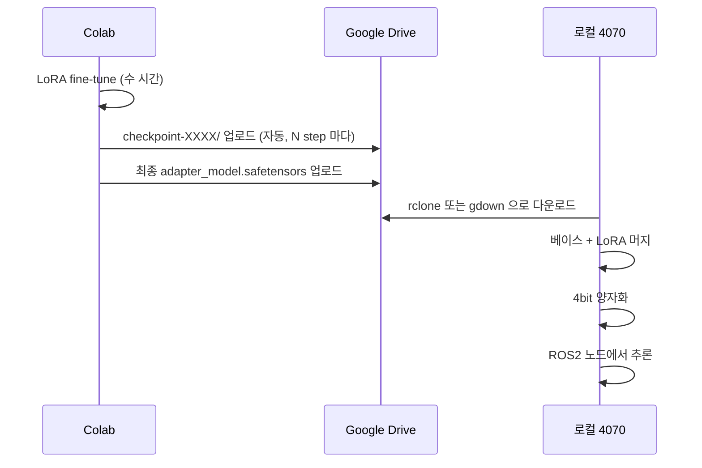

# Phase 4 진입 전 개발 환경 구축

> Phase 4 의 모든 week (1-16) 을 시작하기 *전에* 1회 수행하는 환경 구축 가이드 + 컴퓨트 전략의 단일 진실 공급원.

---

## 0. 한 줄 요약

OpenVLA 7B 는 RTX 4070 12GB 로 **학습이 불가능**하다. 따라서 무거운 LoRA 파인튜닝은 Colab (A100/L4) 에서, 가벼운 추론은 로컬 4070 + ROS2 환경에서 4bit 양자화로 돌린다. 환경 구축은 두 갈래로 진행된다.

**적용 산출물**: 산출물 v1 (RT-2/OpenVLA 블로그 2편 + ROS2 minimal demo).

**핵심 원칙 연결**:
- 결과물 없는 학습 금지 — 학습 자체가 아니라 *블로그 + ROS2 데모* 가 목표
- 관심 != 공부 — 4070 에 7B 모델을 욱여넣는 데 시간을 태우지 않는다

---

## 1. 왜 분업이 필요한가

### 1.1 OpenVLA 권장 사양 vs 보유 환경

| 작업 | 권장 사양 | 보유 (RTX 4070 12GB) | 판정 |
|------|-----------|----------------------|------|
| 추론 (BF16 풀 정밀도) | 16GB+ (가중치만 14-15GB) | 12GB | 양자화 필수 |
| LoRA 파인튜닝 | 24GB+ (단일 GPU) | 12GB | 사실상 불가 |
| 풀 파인튜닝 | 80GB+ 멀티 GPU | 12GB | 불가 |
| 추론 (4bit 양자화) | 약 7GB (논문 실측) | 12GB | 가능 |

결론: **학습은 로컬에서 못 돌린다. 추론은 양자화하면 된다.** 이 비대칭이 분업의 근거다.

### 1.2 학습과 추론의 성격이 정반대

| 항목 | 학습 (LoRA 파인튜닝) | 추론 (ROS2 데모) |
|------|----------------------|------------------|
| VRAM | 무겁다 (24GB+) | 가볍다 (int4 양자화 시 약 7GB) |
| 시간 | 일회성, 몇 시간 점유 | 상시, 실시간 루프 |
| 환경 | 오프라인, ROS2 불필요 | ROS2 노드 통합 필수 |
| 카메라/센서 | 불필요 | ELP 스테레오 입력 필요 |
| 세션 끊김 | 체크포인트로 복구 가능 | 끊기면 데모 자체가 안 됨 |
| 적합 환경 | **Colab (클라우드 GPU)** | **로컬 4070 + ROS2** |

- Colab 의 단점 (세션 끊김 / ROS2 미지원 / 카메라 미연결) 이 **학습에는 거의 다 무력화**된다.
- 추론의 요구 (실시간 / ROS2 / 센서) 는 **로컬이어야만** 충족된다.

이 분업은 실무 표준 패턴이기도 하다: **무거운 학습은 클라우드, 가벼운 추론은 엣지.** Phase 6-7 에서 자작 팔 + Jetson 배포로 갈 때도 동일한 구조가 재사용된다.

### 1.3 OpenVLA 공개 실측치와 4070 외삽 (컴퓨트 수치의 단일 진실 공급원)

| 항목 | 수치 | 출처 |
|---|---|---|
| int4 VRAM | 7.0 GB | OpenVLA 논문 Table 2 |
| int4 Bridge 성공률 | 71.9 ± 4.7% (bf16 71.3% 와 동등) | OpenVLA 논문 Table 2 |
| int8 Bridge 성공률 | 58.1 ± 5.1% (유의한 하락) | OpenVLA 논문 Table 2 |
| int8 추론 속도 | 1.2 Hz (A5000) — 속도 하락이 시스템 동역학을 바꿔 성공률 하락으로 이어짐 | OpenVLA 논문 §5.4 |
| int4 추론 속도 | 약 3 Hz (A5000, Ampere 768 GB/s) | OpenVLA 논문 |
| bf16 추론 속도 | 약 6 Hz (RTX 4090, 1008 GB/s, 최적화 트릭 없이) | OpenVLA 논문 |
| int4 추론 속도 (4070 실측) | **3.33 Hz** (mean 300.3 ms / median 301.3 ms / std 3.8 ms / p95 304.8 ms, n=100) | week6 실측 (`week6/openvla_latency_4070_int4.npy`) |

- **4070 실측 (2026-06, week6)**: bitsandbytes nf4 + HF transformers + eager attention 스택에서 step당 mean 300.3 ms (**3.33 Hz**). 사전 외삽(메모리 대역폭 기준 약 2-3 Hz, step당 330-500 ms — 4070 의 504 GB/s 가 A5000 의 768 GB/s 보다 낮은 점과 Ada Lovelace 의 int4 처리량 이점을 종합)의 ±50% 허용 범위 안이며, 포인트 범위보다 약 9% 빠르다. std 3.8 ms 로 분포가 매우 안정적. 단, 이 수치는 `predict_action` 호출만 측정한 것으로 이미지 전처리(processor)와 ROS2 오버헤드는 제외 — 제어 루프 전체 주기는 week11 dry-run 에서 별도 확인.
- **VRAM**: int4 7 GB + ROS2/sim 오버헤드를 더해도 12 GB 안착 — 사실상 확정.
- **int8 경로는 실험에서 배제**: 성공률(58.1%)과 속도(1.2 Hz) 모두 열위. 코드 경로는 비교 실험 대비로만 보존한다 (week8 config 참고).
- **제어 주기 적합성**: v1 범위(sim 단일 task, quasi-static pick-and-place)에는 실측 3.3 Hz 로 충분 추정 — OpenVLA 원 실험 자체가 유사 속도 대역에서 blocking control 로 실로봇을 구동했다. 판정용 제어 주기 수치는 task 선정 후 확정한다.
- 컴퓨트 수치의 본체는 이 표다. 루트 README 의 컴퓨트 인용구는 이 표의 요약만 유지한다.

---

## 2. 사전 점검 체크리스트

Phase 4 진입 (2026.06 예정) 직전에 한 번 더 점검한다.

### 2.1 계정/구독
- [x] Google 계정 (Colab + Drive 동일 계정)
- [ ] (선택) Colab Pro 구독 — v2 LoRA 파인튜닝 트랙 진입 시에만 필요 (A100/L4). v1 필수 트랙은 무료 T4 + 로컬 4070 으로 충분하므로 Pro 불필요
- [x] Google Drive 잔여 용량 — LoRA 가중치 + 체크포인트 약 10-30GB 예상
- [x] HuggingFace 계정 + Access Token (OpenVLA 가중치 다운로드)

### 2.2 로컬 (Ubuntu PC + RTX 4070 12GB)
- [x] NVIDIA 드라이버 (`nvidia-smi`) — CUDA 12.x 지원 확인
- [x] 로컬 디스크 50GB 이상 여유 (베이스 14-15GB + LoRA + 양자화 캐시)
- [x] ROS2 Humble (또는 Jazzy) 설치 — Phase 3 에서 사용 중
- [x] ELP 스테레오 카메라 USB 연결 + `/dev/video*` 인식

### 2.3 공통 도구
- [x] `git`, `python3.10+`, `pip`
- [x] Rerun viewer 0.23+ (양자화 추론 시각화; ENVIRONMENT.md §4 참고)
- [x] 블로그 플랫폼 결정 (**Velog** / Medium / 본 레포 `Studies/Phase 4/blog/`)

---

## 3. 분업 워크플로우 도식 + 단계별 상세

### 3.1 전체 흐름

```mermaid
flowchart LR
    subgraph Colab["Colab (A100 / L4) - 학습"]
        direction TB
        C1[베이스 OpenVLA 7B 로드 BF16]
        C2[LoRA 어댑터 파인튜닝]
        C3[체크포인트 주기 저장]
        C4[최종 LoRA 가중치 추출]
        C1 --> C2 --> C3 --> C4
    end

    subgraph Drive["Google Drive (가중치 전송)"]
        D1[LoRA weights<br/>수백 MB - 수 GB]
    end

    subgraph Local["로컬 4070 + ROS2 - 추론"]
        direction TB
        L1[베이스 + LoRA 머지]
        L2[4bit 양자화 약 7GB]
        L3[ROS2 lifecycle 노드 래핑]
        L4[ELP 스테레오 카메라 입력]
        L5[Rerun 시각화 + 1분 영상]
        L1 --> L2 --> L3 --> L4 --> L5
    end

    C4 -->|업로드| D1
    D1 -->|다운로드| L1
```



### 3.2 Colab 측 (학습)

1. conda/pip 환경 세팅 — **버전 고정** (§7 참고)
2. 베이스 OpenVLA 7B 로드 (BF16)
3. LoRA 어댑터로 파인튜닝 (DDP 불필요, 단일 A100 이면 충분)
4. 학습 중 체크포인트 주기적 저장 (세션 끊김 대비, §5.3)
5. 최종 LoRA 가중치를 Google Drive 에 저장

### 3.3 로컬 측 (추론)

6. Drive 에서 LoRA 가중치 다운로드 (rclone 권장; §8)
7. 베이스 모델에 LoRA 머지
8. 4bit 양자화 (bitsandbytes) 로 약 7GB 로 축소 → 12GB 에 안착
9. ROS2 lifecycle 노드로 래핑 (기존 ROS2 미들웨어 경험 활용)
10. ELP 스테레오 카메라 입력 → 추론 → action 출력
11. Rerun 으로 시각화, 1분 데모 영상 녹화

---

## 4. 주차별 환경 요구도

각 week 에서 어떤 환경이 필요한지 미리 파악해 두면 출장 일정 등을 잡을 때 도움이 된다.

| Week | 작업 | Colab 필요 | 로컬 GPU 필요 | ROS2 필요 |
|------|------|-----------|--------------|-----------|
| 1-3  | RT-2 정독 + 블로그 1 | X | X | X |
| 4-5  | OpenVLA 정독 | X | X | X |
| 6    | OpenVLA HuggingFace 모델 카드 + 환경 셋업 | 조건부 (T4 무료) | 선택 | X |
| 7    | OpenVLA 블로그 1 | X | X | X |
| 8    | HuggingFace inference + 양자화 | X | O | X |
| 9    | I/O spec + cv_bridge | X | O | O |
| 10   | vla_node 패키지 골격 | X | X | O |
| 11   | ROS2 dry-run (subscribe → inference → publish) | X | O | O |
| 12   | Rerun 시각화 + 1분 영상 | X | O | O |
| 13-16| 블로그 마무리 + 패키징 | X | O (영상 보강 시) | O |
| 병행 (선택) | LoRA 파인튜닝 | **O (A100 권장)** | X | X |

> LoRA 파인튜닝은 본 Phase 의 *필수* 트랙이 아니다. 시간/예산 제약 시 베이스 OpenVLA + 양자화 추론만으로도 minimal demo 산출 가능. Week 6-7 사이에 병행으로 시도하는 것을 권장.

---

## 5. Colab 측 환경 세팅

### 5.1 GPU 선택 가이드

| GPU | VRAM | 티어 | Phase 4 용도 |
|-----|------|------|-------------|
| T4  | 15GB | 무료 | 추론 검증 (7B 는 양자화 필요), 가벼운 실험 (week 6) |
| L4  | 22.5GB | Pro | 추론 여유 + LoRA 양자화 학습 가능 |
| A100 | 40/80GB | Pro / Pay-as-you-go | LoRA 파인튜닝 권장 사양 충족 |

- 컴퓨트 유닛 1개 약 0.1 달러. A100 은 유닛 소모가 빠름.
- 유료 플랜에서도 GPU 할당은 가용성에 따라 변동 — A100 이 항상 잡히지는 않음.
- 무료 티어: 최대 12시간 세션 + idle 타임아웃 → **체크포인트 저장 필수**.

권장 진행: 추론 검증은 **무료 T4 → 부족하면 Pro L4 → LoRA 파인튜닝은 A100** 으로 단계적으로 올린다.

### 5.2 Colab 노트북 표준 셋업 셀

학습 노트북 최상단에 두는 표준 셀:

```python
# 1) GPU 확인
!nvidia-smi

# 2) Drive 마운트 (체크포인트 + LoRA 저장 경로)
from google.colab import drive
drive.mount('/content/drive')

# 3) 작업 디렉토리
import os
WORK_DIR = '/content/drive/MyDrive/phase4_openvla'
os.makedirs(WORK_DIR, exist_ok=True)
os.chdir(WORK_DIR)

# 4) 의존성 설치 (버전 고정; §7 참고)
!pip install -r requirements_colab.txt

# 5) HuggingFace 캐시를 Drive 로 (선택; 세션 끊겨도 재다운로드 회피)
os.environ['HF_HOME'] = f'{WORK_DIR}/.hf_cache'
```

### 5.3 세션 끊김 대비

- 체크포인트 주기: **N step 마다 1회** (학습 스크립트의 `save_steps` 인자 명시)
- 저장 위치: Drive (`/content/drive/MyDrive/phase4_openvla/checkpoints/`)
- 저장 항목: LoRA adapter + optimizer state + step count
- 재시작 시: 최신 step adapter 로드 + optimizer state 복원

---

## 6. 로컬 측 환경 세팅 (RTX 4070 12GB)

### 6.1 디렉토리 구조

```
/workspace/phase4_workspace/
  openvla/          # 베이스 가중치 (약 15GB)
  lora/             # Drive 에서 다운로드한 LoRA
  merged/           # 베이스 + LoRA 머지 결과
  quantized/        # 4bit 양자화 결과 (약 7GB)
  ros2_ws/          # ROS2 워크스페이스 (vla_node 패키지)
  notes/            # week 별 reading note
```

### 6.2 venv 분리 원칙

Phase 3 패턴 (`.venv-weekN`) 을 그대로 따른다. 각 week 디렉토리의 `pip_install.sh` 실행 시 해당 week 디렉토리 안에 `.venv-weekN` 이 생성된다.

다만 **양자화 추론 주차 (week 6, 8-12)** 는 무거운 의존성 (torch + transformers + bitsandbytes + accelerate) 이 공통이므로, week 별 venv 대신 **`Studies/Phase 4/.venv-vla` 공용 venv** 를 만들어 공유한다 — week 별 .venv 가 각 8-10GB 씩 누적되는 것을 막기 위함. 생성 명령은 `week8/PRACTICE.md` "환경 설정" 절에 있으며 로드맵 순서 1 Step 0 (week 6 실측 직전) 에서 1회 생성한다.

### 6.3 ROS2 환경

- Phase 3 의 ROS2 배포판 (Humble 또는 Jazzy) 재사용.
- `vla_node` 패키지는 lifecycle node 로 작성 — 모델 로딩/언로딩을 명시적으로 관리 (week 10 에서 다룸).
- ROS2 와 Python venv 의 상호작용 주의: `source /opt/ros/<distro>/setup.bash` → `source .venv-vla/bin/activate` 순.

---

## 7. 버전 매칭 (리스크 1: 가장 흔한 함정)

Colab 환경 (CUDA, PyTorch, transformers) 과 로컬 환경의 버전이 다르면, 학습된 가중치를 로컬에서 **로딩 못 하는** 사태가 발생한다. 학습 시작 *전에* 양쪽 핵심 라이브러리 버전을 맞춰둔다.

> 이 작업이 흔히 말하는 "환경 세팅 2주" 의 실체 중 하나. 미리 맞추면 며칠 아낀다.

### 7.1 고정 대상 매트릭스

| 항목 | Colab (학습, v1.5 진입 시 맞춤) | 로컬 (추론, `.venv-vla` 실설치 2026-06) | 비고 |
|------|-------------|------------|------|
| CUDA | 로컬과 major 일치 목표 | 13.0 (driver 580.159.03) | 드라이버는 더 높아도 OK |
| Python | 동일 minor (3.12) | 3.12.3 | |
| PyTorch | major.minor 일치 | 2.12.0 | |
| transformers | 4.40.1 | 4.40.1 (고정) | OpenVLA remote code 요구 — 4.40.1 외 regression 경고, 5.x 는 동작 불가 |
| tokenizers | 0.19.1 | 0.19.1 (고정) | transformers 4.40.1 페어 |
| timm | 0.9.16 | 0.9.16 (고정) | 0.9.10/0.9.11/0.9.12/0.9.16 외 NotImplementedError |
| accelerate | 1.0.1 | 1.0.1 (고정) | 1.2.0+ 는 4-bit 모델 `.to()` 충돌 |
| bitsandbytes | 0.49.x | 0.49.2 | 양자화 포맷 호환성 |
| peft | v1.5 진입 시 양쪽 동시 추가 | 미설치 | LoRA adapter 포맷 호환성 |

> 고정 버전의 본체와 근거 주석은 `week8/requirements.txt` (§7.2). 로컬 열은 `.venv-vla` 실설치 기준이며, Colab 열은 v1.5 LoRA 트랙 진입 시 로컬에 맞춰 작성한다 (`requirements_colab.txt`).

### 7.2 공유 requirements 파일

- 로컬 추론용 버전 고정의 단일 진실 공급원은 [`week8/requirements.txt`](week8/requirements.txt) — `.venv-vla` 공용 venv 생성 시 사용한다 (§6.2). OpenVLA remote code 가 요구하는 고정 버전 (transformers 4.40.1 / tokenizers 0.19.1 / timm 0.9.16 / accelerate 1.0.1 이하) 의 근거 주석 포함. 별도 `requirements_local.txt` 는 두지 않는다.
- `requirements_colab.txt` (학습용; peft, accelerate, wandb 포함) 는 v1.5 LoRA 트랙 진입 시 본 디렉토리에 작성한다.

두 파일의 공통 라이브러리는 **버전 문자열까지 동일**해야 한다. 변경 시 양쪽 동시 업데이트.

### 7.3 호환성 검증 절차

LoRA 가중치를 Drive 에 올린 *직후*, 로컬에서 다음을 1회 실행:

```python
from peft import PeftModel
from transformers import AutoModelForVision2Seq

base = AutoModelForVision2Seq.from_pretrained("openvla/openvla-7b", torch_dtype="bfloat16")
model = PeftModel.from_pretrained(base, "./lora/checkpoint-XXXX")
print("LoRA load OK")
```

오류가 나면 양쪽 버전을 다시 비교한다. **학습을 더 진행하기 전에 잡는 게 핵심** — 학습이 끝난 뒤 발견하면 재학습 비용 발생.

---

## 8. 가중치 / 데이터 전송 워크플로우

### 8.1 Colab → Drive → 로컬 흐름



### 8.2 다운로드 도구

- **rclone**: Drive 와 로컬 디스크 동기화. 큰 파일에 안정적. 처음 1회만 설정.
- **gdown**: 단일 파일/폴더 빠른 다운로드. 간편하지만 큰 파일에서 가끔 실패.

rclone 설정 후엔 `rclone copy drive:phase4_openvla/lora/ ~/phase4_workspace/lora/` 한 줄로 동기화.

---

## 9. 그 외 리스크 (요약)

### 9.1 리스크 2: 양자화 품질 저하

4bit 로 떨구면 메모리는 줄지만 action 정확도가 떨어질 수 있다.

- Phase 4 목표는 **"돌아가는 걸 보여주는 minimal demo"** — 품질 저하 허용 범위.
- "성능이 좋다" 가 목표가 아님. 양자화 전후 비교 자체를 블로그 소재로 활용 (§10 참고).

### 9.2 리스크 3: Colab 세션 불안정

- 학습: 체크포인트 저장으로 복구 → 영향 적음.
- 가용성 변동으로 A100 못 잡히면 L4 + gradient accumulation 으로 우회 (시간만 더 걸림).

### 9.3 리스크 4: 4070 에서 추론도 빠듯할 가능성

양자화해도 카메라 입력 + KV 캐시 + ROS2 오버헤드가 겹치면 12GB 가 빠듯할 수 있다.

- action chunk 크기 축소, batch 1 고정으로 대응.
- 정 안 되면 경량 VLA (SmolVLA 등) 로 우회하는 플랜 B 유지.

---

## 10. 블로그 소재로의 활용 (산출물 v1 연결)

이 분업 자체가 좋은 콘텐츠다. 같은 처지 (consumer GPU 보유자) 가 많아 검색 트래픽이 나온다.

- **글감 1**: "Consumer GPU 로 VLA 배포하기 — 학습은 Colab, 추론은 로컬 양자화"
  - 권장 작성 시점: week 7 (OpenVLA 블로그) 의 부가 코너 또는 week 13-14 (블로그 마무리)
- **글감 2**: "OpenVLA 4bit 양자화 추론 + ROS2 노드 통합 후기" (양자화 전후 성능/메모리 비교 표 포함)
  - 권장 작성 시점: week 12 (영상 마감) 직후 또는 week 13-14

검색 태그 예: `OpenVLA`, `VLA fine-tuning Colab`, `4bit quantization ROS2`, `RTX 4070 LLM`.

velog 작성 + LinkedIn 공유까지가 한 사이클.

---

## 11. Phase 4 마일스톤 체크리스트

본 SETUP 의 진행 상태 + Phase 4 전체에서 컴퓨트 전략이 정상 가동되는지 추적용. (Roadmap Phase 4 의 완료 체크리스트와 별개; 환경 관점 단일 보드.)

### 11.1 진입 전
- [x] §2 사전 점검 체크리스트 전부 통과 — 잔여 미체크는 "(선택) Colab Pro" 뿐이며 v1 필수 트랙에 불필요
- [x] 로컬 추론 라이브러리 버전 확인 — `week8/requirements.txt` 로 고정 (§7.2)

### 11.2 학습 측 (v1.5 / Phase 4.5 병행 트랙, 선택)
- [ ] Colab Pro 구독 + 컴퓨트 유닛 확보 (이 트랙 진입 시에만)
- [ ] Colab / 로컬 라이브러리 버전 매칭 (`requirements_colab.txt` + `week8/requirements.txt`; §7)
- [ ] Colab 에서 베이스 OpenVLA 로드 검증 (추론 한 번 굴려보기)
- [ ] LoRA 파인튜닝 스크립트 작성 + 체크포인트 저장 설정
- [ ] 학습 완료 → LoRA 가중치 Drive 저장
- [ ] §7.3 호환성 검증 통과

### 11.3 추론 측 (week 8-12)
- [x] 4070 에서 베이스 모델 4bit 양자화 추론 동작 확인 — week6 실측: OOM 없이 로드, mean 300.3 ms (3.33 Hz, n=100), VRAM 기록 (§1.3)
- [ ] (v1.5) Drive 에서 LoRA 가중치 다운로드 + 베이스에 머지 + 4bit 재양자화
- [ ] ROS2 노드 래핑 + ELP 카메라 연동
- [ ] Rerun 시각화 + 1분 데모 영상

### 11.4 산출물 (week 13-16)
- [ ] 블로그 2편 작성 + LinkedIn 공유
- [ ] 양자화 전후 비교 표 (§10 글감 2)

---

## 12. 다음 단계

환경 구축이 끝나면:

1. **week 1 진입**: [`week1/README.md`](week1/README.md) — RT-2 1회독 시작
2. week 1-7 은 로컬 GPU 가 거의 필요 없음 — 환경 점검만 해두고 논문 정독에 집중
3. week 8 진입 시점에 본 SETUP.md 의 §5, §6, §7 을 다시 점검
4. (선택) LoRA 파인튜닝 시도하려면 week 6-7 사이에 병행 트랙 시작

---

## 참고 문서

- [`Roadmap/Phase 4.md`](../../Roadmap/Phase%204.md) — Phase 4 전체 학습 계획
- [`ENVIRONMENT.md`](../../ENVIRONMENT.md) — 프로젝트 공용 환경 가이드 (장비, 원격 접속, 시각화, 데이터셋)
- OpenVLA 공식 리포 (진입 시점에 URL 확인) — 의존성 버전의 최종 출처
