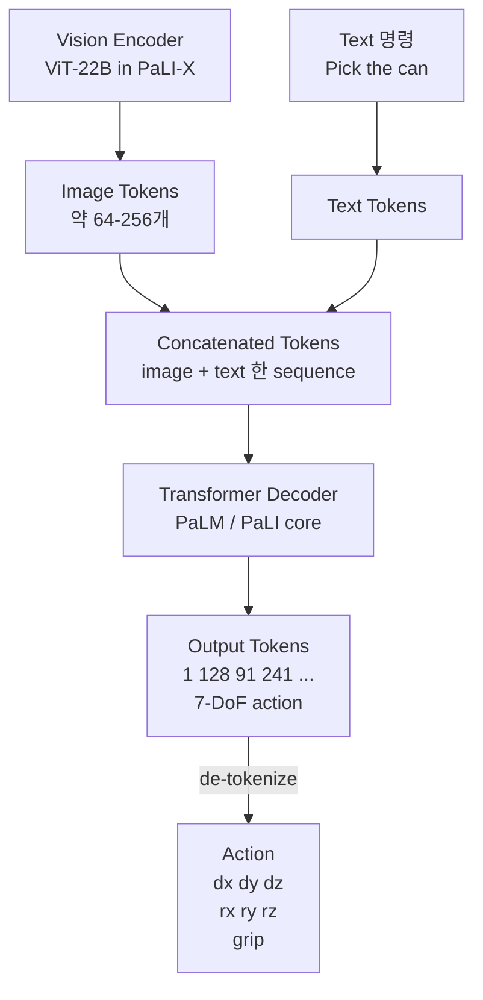

# Week 1: RT-2 1회독 + Architecture Diagram 정독


> **이번 주 목표**: RT-2 논문을 처음부터 끝까지 1회독하고, Architecture Diagram을 분해해서 "Vision-Language Model이 어떻게 로봇 행동을 생성하는가" 를 한 페이지로 설명할 수 있는 수준에 도달한다.
> **예상 시간**: 10-12시간 (논문 정독 6h + 다이어그램 분해 2h + 노트 정리 2-4h)
> **핵심 질문**: "VLM은 text token을 출력한다. Robot은 7-DoF continuous action을 받는다. 둘은 어떻게 연결되는가?"


---


## 학습 순서


| 순서 | 단계 | 파일/자료 | 설명 |
|:----:|------|----------|------|
| 0 | Phase 4 환경 1회 구축 | [`../SETUP.md`](../SETUP.md) | Colab/로컬 분업, 버전 매칭 등 (week 1 진입 전 1회) |
| 1 | 환경 준비 | `requirements.txt` | `bash pip_install.sh` (논문 reading note 도구만) |
| 2 | 사전 지식 점검 | `README.md` 2장 | Transformer / VLM / RT-1 의 큰 그림 |
| 3 | 논문 1회독 (Sec 1-3) | RT-2 PDF | Introduction + Related Work + Approach |
| 4 | 논문 1회독 (Sec 4-6) | RT-2 PDF | Experiments + Emergent Capability + Conclusion |
| 5 | Architecture Diagram 분해 | `PRACTICE.md` 1-3 | 그림 1, 2, 3 을 손으로 다시 그려서 설명 |
| 6 | 퀴즈 (개념) | `quiz_easy.py` | RT-2 핵심 용어 / 다이어그램 이해 |
| 7 | 퀴즈 (코드/계산) | `quiz_medium.py` | Action tokenization 계산 / VLM 토큰 분포 추정 |
| 8 | 1주 reading note 정리 | `PRACTICE.md` 4 | "한 페이지 RT-2 다이어그램" 노트 산출 |


---


## 시작하기 전에 — Phase 4 의 큰 그림


Phase 4는 **VLA (Vision-Language-Action) 의 논문 이해 + ROS2 통합 첫 사이클** 이다. 4개월 (16주) 동안:


- **week 1-3**: RT-2 정독 + vla-lab 문서 1편 (이번 주는 1주)
- **week 4-7**: OpenVLA 정독 + vla-lab 문서 1편
- **week 8-12**: OpenVLA HuggingFace inference → ROS2 토픽 minimal demo (산출물 v1)
- **week 13-16**: vla-lab 문서 2편 마무리 + 산출물 v1 패키징


본 phase의 최종 산출물 v1 (2026 하반기 공개):
- RT-2 + OpenVLA vla-lab 문서 2편
- OpenVLA inference → ROS2 토픽 `vla_action` publish 하는 minimal demo + 1분 영상


> Phase 4 의 ROS2 demo 는 Phase 7 의 **Real-to-Sim-to-Real (산출물 v3 결정타)** 의 토대다. 여기서 익힌 inference 파이프라인이 Phase 7 에서 자작 6DOF 팔 + Isaac Sim 과 결합된다.


### 왜 RT-2 부터 시작하는가


RT-2 는 "VLM (Vision-Language Model) 에 web-scale 데이터로 학습된 지식이 로봇 제어 능력으로 transfer 된다" 는 것을 처음으로 대규모로 보여준 논문이다. 이 한 줄이 VLA 라는 분야의 시작점이다. OpenVLA (week 4-7) 는 이 아이디어의 open-source 버전이며, RT-2 를 이해하지 않고 OpenVLA 만 보면 "왜 이런 구조인가" 가 흐릿하다.


| Phase 4 학습 순서 | 이유 |
|---|---|
| RT-2 먼저 (closed, Google) | VLA 의 아이디어/구조 표준 정립 |
| OpenVLA 다음 (open, Stanford) | RT-2 를 open-source 로 재현 + 개선 |
| ROS2 demo 마지막 | open-source 이므로 실제 inference 가능 |


---


## 핵심 개념 자세히 알아보기


### 1. RT-2 의 한 줄 요약


> *"Vision-Language Model (PaLI-X / PaLM-E) 을 robot action token 까지 출력하도록 co-fine-tune 한 모델."*


이 한 줄 안에 세 가지 핵심 결정이 들어있다:


1. **무엇을 backbone 으로 쓸 것인가**: large-scale VLM (PaLI-X 또는 PaLM-E)
2. **Action 을 어떻게 표현할 것인가**: continuous action 을 **text token** 으로 discretize
3. **어떻게 학습할 것인가**: web data + robot data 를 섞어서 **co-fine-tune**


이 세 가지가 RT-2 의 architecture 와 학습 흐름 전체를 결정한다.


### 2. 사전 지식: VLM (Vision-Language Model) 의 큰 그림


VLM 은 "이미지 + 텍스트" 를 입력받아 "텍스트" 를 출력하는 large model 이다.


```
입력 : <image> + "What is on the table?"
       (vision) (language instruction)


내부 : Vision Encoder → image tokens
       Text Tokenizer → text tokens
       두 종류 token 을 합쳐 Transformer Decoder 에 통과


출력 : "A red apple" (text tokens)
```


대표 VLM 계보 (RT-2 시점, 2023):


| 모델 | 출시 | 특징 | RT-2 와의 관계 |
|---|---|---|---|
| CLIP (2021) | OpenAI | image-text contrastive | RT-2 backbone 아님 (참고용) |
| Flamingo (2022) | DeepMind | few-shot VLM | RT-2 의 선조 |
| **PaLM-E (2023)** | Google | embodied multimodal | **RT-2 backbone 옵션** |
| **PaLI-X (2023)** | Google | 55B parameter VLM | **RT-2 backbone 옵션** |


RT-2 논문은 둘 다 시도한다 (RT-2-PaLI-X 와 RT-2-PaLM-E). 본 phase 에서는 PaLI-X 기반을 중심으로 본다 (open VLM 의 표준 형태에 더 가깝다).


### 3. 사전 지식: RT-1 → RT-2 의 차이


RT-1 (Robotics Transformer 1, Google 2022) 은 RT-2 의 직전 모델이다. 동일한 데이터셋 (Google 의 RT-1 robot data, 130k episodes) 을 쓴다. 차이는 **backbone**:


| 항목 | RT-1 | RT-2 |
|---|---|---|
| Backbone | 35M parameter transformer (from scratch) | 5B/55B VLM (pre-trained) |
| 학습 데이터 | robot data only | robot data + web data co-fine-tune |
| Action 표현 | discretized bins (FiLM-conditioned) | text token (VLM vocab 의 일부) |
| Emergent capability | 약함 | 강함 (semantic generalization) |
| Inference latency | 빠름 (~50ms) | 느림 (~200ms~) |


**핵심**: RT-2 는 "Big VLM 의 web knowledge 가 robot 으로 transfer 된다" 를 증명. 이게 VLA 라는 분야의 출발점.


### 4. 사전 지식: Transformer / Tokenization 의 정확한 정의


Token 은 모델 입력의 **최소 단위**다. Text 의 경우 BPE / WordPiece / SentencePiece 등 sub-word 단위. VLM 의 경우:


```
이미지 → ViT (Vision Transformer) → patch token (16x16 patch -> 1 token)
                                      ex) 224x224 image → 196 image token


텍스트 → SentencePiece / BPE → text token
        "pick up the can" → ["pick", "up", "the", "can"] → token id 4 개


[이미지 토큰 196 개] + [텍스트 토큰 N 개] → Transformer Decoder → 텍스트 토큰 출력
```


**RT-2 의 핵심 아이디어**: 출력 텍스트 토큰의 vocabulary 중 **256 개를 action 으로 재해석**한다. 즉:


```
VLM vocabulary 의 마지막 256 개 token ID:
  token_id [V-256 ... V-1]
  → 이들을 "action discrete bin" 으로 재사용
```


이 부분이 week 2 의 핵심 (action tokenization). 이번 주에는 "그렇게 한다" 만 이해하면 된다.


### 5. RT-2 의 Architecture Diagram (논문 Figure 1)





이번 주 핵심 정리 포인트:
- Vision Encoder 와 Text Tokenizer 가 **독립적으로** token 을 만든다
- 두 종류 token 이 **concat** 되어 한 sequence 로 Decoder 에 들어간다
- 출력 token sequence 의 **앞부분 7-11 개** 가 action 으로 해석된다
- 출력 token sequence 의 **그 뒤** 가 일반적인 text (예: "<terminate>") 이면 episode 종료


### 6. Co-fine-tuning 이란 (week 2 의 예고편)


RT-2 의 학습은 **세 종류 데이터를 섞어서** 한다:


```
Mini-batch 한 개:
  +-------------------------------+
  | 50%: Web image-caption pair | (VLM 의 일반적 학습 데이터)
  | 30%: Web VQA |
  | 20%: Robot trajectory + label | (RT-1 dataset, 130k episodes)
  +-------------------------------+
```


이 비율로 매 step 학습 → VLM 이 web knowledge 를 잃지 않으면서 robot action 도 학습.


**왜 중요한가**: robot data 만으로 fine-tune 하면 catastrophic forgetting 발생 (VLM 이 일반 visual reasoning 능력을 잃음). 이걸 막는 게 co-fine-tuning.


### 7. Emergent Capability (논문 Sec 5 의 가장 중요한 부분)


RT-2 의 가장 인상적인 결과는 robot data 에 명시적으로 없는 **새로운 명령** 을 수행할 수 있다는 것:


| 사례 | 학습 데이터에 있나 | RT-2 의 행동 |
|---|---|---|
| "pick up the can" | O | O 학습된 그대로 |
| "pick up the **red** can" | X (색상 명시 없음) | O 색상 인식 후 집음 |
| "pick up the **almost-empty** can" | X | O VQA 지식 활용 |
| "pick up the **animal**" | X (구체 명사만) | O 봉제 인형 집음 |
| "**move close to** the dirty table" | X | O 의미 추론 |


이게 가능한 이유: VLM 의 web knowledge (이미지 + 자연어 추론) 가 사라지지 않고 action 생성에 transfer 됨.


> 이번 주 reading note 에 "emergent capability 의 4가지 사례" 를 꼭 한 줄씩 적어둘 것. week 3 vla-lab 문서의 핵심 장면이 된다.


### 8. 한계 및 비판 (RT-2 의 정직한 결점)


vla-lab 문서를 쓸 때 반드시 들어가야 할 부분:


1. **속도**: 5B/55B 모델은 inference latency 가 ~200ms 이상. 실시간 30Hz 제어 어려움.
2. **closed source**: weight 공개 안 됨. 재현 불가능 → OpenVLA 의 동기.
3. **데이터 의존**: RT-1 dataset 의 분포에 강하게 의존. domain gap 시 성능 급락.
4. **action discretization**: 256 bin 으로 양자화 → fine motion 어려움.
5. **single-arm 위주**: bimanual / mobile manipulation 부족.


> 이 5가지 한계는 OpenVLA / π0 / Helix 등 후속 연구의 동기다. week 4 OpenVLA 정독 시 다시 비교한다.


---


## 이번 주 학습 자료 위치


### 필수
- 논문 PDF: https://arxiv.org/abs/2307.15818 (RT-2 paper)
- 프로젝트 페이지: https://robotics-transformer2.github.io/
- Architecture diagram 원본: 논문 Figure 1 (page 2)


### 보조 (선택)
- RT-1 paper (배경): https://arxiv.org/abs/2212.06817
- PaLI-X paper (backbone): https://arxiv.org/abs/2305.18565
- PaLM-E paper (backbone): https://arxiv.org/abs/2303.03378
- DeepMind blog: https://www.deepmind.com/blog/rt-2-new-model-translates-vision-and-language-into-action


> PaLI-X / PaLM-E 논문은 부분 정독 권장 (Section 1, 3 만). RT-2 정독이 우선.


---


## 꼭 이해해야 할 핵심 개념 (한 페이지 요약)


### 1. RT-2 의 핵심 3가지


| 결정 | 내용 | 왜 중요한가 |
|---|---|---|
| Backbone | 5B/55B VLM (PaLI-X / PaLM-E) | web knowledge transfer 의 출발점 |
| Action 표현 | text token (vocab 중 256 개 재사용) | LM 의 표준 generation 으로 action 도 출력 |
| 학습 방식 | web data + robot data co-fine-tune | catastrophic forgetting 방지 |


### 2. RT-2 의 입출력 인터페이스


```
입력 : RGB image (1장) + text instruction (예: "pick up the can")
출력 : 7-DoF action [dx, dy, dz, rx, ry, rz, gripper] + <terminate?>
주기 : 약 5Hz (200ms latency)
```


### 3. RT-2 다이어그램의 6 가지 부품


1. Vision Encoder (ViT-22B in PaLI-X)
2. Text Tokenizer (SentencePiece)
3. Token concat 모듈
4. Transformer Decoder (PaLM / PaLI core)
5. Action de-tokenization 모듈
6. 안전/종료 토큰 핸들러


### 4. 데이터 흐름의 핵심 관문 3 가지


```
관문 1: image -> patch tokens (ViT가 담당)
관문 2: text -> token id sequence (SentencePiece)
관문 3: action <- token id sequence (RT-2 의 유일한 RT-specific 부분)
```


관문 1 과 2 는 표준 VLM 그대로. **관문 3 만이 RT-2 의 핵심 contribution.**


---


## 자체 점검 - 이해했는지 확인


**Q1. RT-2 가 RT-1 과 다른 가장 본질적인 차이 한 가지는?**
> RT-1 은 small transformer 를 robot data 만으로 학습. RT-2 는 web-scale pre-trained VLM 을 robot data 와 web data **co-fine-tune**. 결과적으로 RT-2 만 emergent capability (학습되지 않은 명령 수행) 가 발현된다.


**Q2. RT-2 의 "Action 도 token 이다" 가 정확히 무슨 의미인가?**
> VLM 의 vocabulary 중 마지막 256 개 token 을 action discrete bin 으로 재해석. 즉 LM 의 표준 next-token-prediction 으로 action 도 생성 가능. 별도의 action head 가 필요 없다.


**Q3. RT-2 의 emergent capability 사례 3 가지를 들어보라.**
> (1) "red can" 처럼 색상이 명시된 명령 수행 (학습 데이터엔 색상 명시 없음), (2) "almost-empty can" 같은 VQA 적 표현 이해, (3) "move close to the dirty table" 같은 의미 추론, (4) "pick up the animal" 같은 추상 명사 처리.


**Q4. RT-2 의 한계 중 양산 SW 엔지니어에게 가장 치명적인 것은?**
> Inference latency (~200ms+). 5Hz 정도라 실시간 30Hz 제어 어려움. Phase 7 의 산출물 v3 에서 이 latency 를 측정해 "양산 시점 비용" 으로 증거화하는 것이 본 로드맵의 핵심 차별화 포인트.


**Q5. Co-fine-tuning 의 비율 (Web : Robot) 이 8:2 인 이유는?**
> Robot data 만으로 fine-tune 하면 VLM 이 일반 visual/language 능력을 잃는 (catastrophic forgetting) 것을 방지. Web data 가 다수여야 일반 지식이 보존되며, robot data 가 적정 비율이어야 action 학습도 가능.


---


## 이번 주 실습 & 다음 주 준비


### 이번 주 실습 과제
1. RT-2 논문을 처음부터 끝까지 1회독 (대략 12 페이지, 한 번에 다 안 봐도 됨)
2. Figure 1 (Architecture) 을 손으로 다시 그리기 - `PRACTICE.md` 실습 1
3. Section 5 (Emergent Capability) 의 사례 표를 노트에 정리
4. quiz_easy.py / quiz_medium.py 풀고 solutions 확인
5. "한 페이지 RT-2" reading note 산출 (PRACTICE.md 실습 4)


### 다음 주 (week 2) 준비
- RT-2 Section 3.2 "Action Tokenization" 부분 다시 1회 읽어보기
- "256 bin 으로 7-DoF action 을 표현하면 quantization error 는 얼마인가" 에 대해 한 번 생각해보기 (week 2 의 시작 질문)
- (선택) Andrej Karpathy 의 SentencePiece / BPE 강의 1편: https://www.youtube.com/@AndrejKarpathy (Tokenizer 의 직관)


---


## 이번 주 핵심 요약


1. **RT-2 는 VLA 의 출발점**: web-scale VLM 의 지식이 robot 으로 transfer 된다는 첫 대규모 증명.
2. **Architecture 의 본질**: vision token + text token → Transformer Decoder → text token (그 중 일부가 action).
3. **Co-fine-tuning**: web data + robot data 8:2 비율로 섞어 학습 → catastrophic forgetting 방지.
4. **Emergent capability**: 학습되지 않은 명령도 수행 가능 → VLM 의 web knowledge transfer 의 증거.
5. **한계 5가지**: latency / closed / 데이터 의존 / quantization / single-arm.


---


- 이전: [Phase 3 - Detection + Depth → PC TensorRT + ROS2 노드](../../../Roadmap/Phase%203.md)


다음: [Week 2 - Co-fine-tuning + Action tokenization](../week2/README.md)
