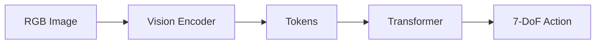

# Week 13 실습: 블로그 2편 퇴고 + 다이어그램 통일


> **실습 목표**: week 3 + week 7 의 두 블로그를 면접관 진입점 수준으로 다듬는다.
> **예상 시간**: 5-7시간


---


## 실습 1: 다이어그램 통일


두 블로그의 Mermaid 다이어그램이 일관된 톤이어야 한다.


### 1-1. 통일 표준





- theme: default (또는 forest)
- direction: LR (좌→우)
- 노드 모양: rectangle 기본 + ellipse 는 입출력만
- 강조: stroke 또는 fill 1-2개


### 1-2. 일관된 약어


| 약어 | 표준 |
|---|---|
| VLA | Vision-Language-Action (대문자) |
| LLM | Llama 같은 LM (대문자) |
| 7-DoF | 7-DoF (하이픈, DoF 대소문자) |
| latency | latency (영어 그대로) |


---


## 실습 2: 본문 퇴고 체크


**파일명**: `~/phase4_notes/week13/proofread_checklist.md`


### RT-2 블로그 (week 3 발행본)


```markdown
- [ ] 모든 'ms' 단위 통일 ('밀리초' / 'ms' 혼용 X)
- [ ] '200ms' 식 vs '200 ms' (공백) 통일
- [ ] 표의 column 순서 일관
- [ ] 외부 link 점검 (arXiv URL, project page URL)
- [ ] 다이어그램 caption (Figure 1, Figure 2 등) 일관
- [ ] 한국어 / 영어 단어 선택 일관 (tokenization vs '토큰화')
```


### OpenVLA 블로그 (week 7 발행본)


```markdown
- [ ] latency 통계 표의 mean / p95 / p99 정확
- [ ] '4-bit nf4' / '4-bit nf4 (bitsandbytes)' 표기 일관
- [ ] RT-2 블로그와의 비교 표 양식 동일
- [ ] 자작 팔 / Phase 7 언급의 일관성
```


---


## 실습 3: SEO 메타 정비


각 블로그의 metadata:


### RT-2 블로그


```
제목: RT-2 정독 노트: VLM 이 어떻게 로봇 행동을 생성하는가
URL slug: rt2-vla-deep-dive
설명 (description, 검색 결과 노출):
  Robotics Transformer 2 (RT-2) 의 architecture, action tokenization,
  co-fine-tuning, emergent capability 를 양산 SW 엔지니어 관점에서 정리.
태그: VLA, RT-2, OpenVLA, Foundation Model, Robot Manipulation,
      Vision-Language Model, PaLI-X, PaLM-E
```


### OpenVLA 블로그


```
제목: OpenVLA 정독 + RTX 4070 실측: 5Hz 가 양산에서 의미하는 것
URL slug: openvla-rtx4070-latency
설명:
  OpenVLA 7B 를 RTX 4070 12GB 에서 4-bit nf4 로 inference.
  mean latency 165ms, throughput 6Hz 의 양산 의미.
태그: VLA, OpenVLA, Llama 2, latency, RTX 4070, 4-bit quantization, 양산
```


---


## 실습 4: cross-link 추가


### RT-2 블로그 끝부분 (Section 8: 다음)


```markdown
## 8. 다음


이 글에서는 RT-2 의 학술적 흐름과 한계를 정리했습니다. 다음 글에서는
RT-2 의 open-source 버전인 **OpenVLA** 를 실제 RTX 4070 에서 직접
inference 해 latency 를 측정한 결과를 다룹니다.


[다음 글: OpenVLA 정독 + RTX 4070 실측 - 5Hz 가 양산에서 의미하는 것](link)
```


### OpenVLA 블로그 시작부분 (Section 2: 배경)


```markdown
## 2. 배경


이전 글에서 [RT-2 의 학술적 흐름과 한계](link)를 정리했습니다.
RT-2 의 가장 큰 한계는 **closed-source** 라는 것. 본 글에서는 RT-2 의
open-source 버전 OpenVLA 를 직접 돌려본 결과를 다룹니다.
```


---


## 실습 체크리스트


- [ ] 두 블로그 다이어그램 톤 통일
- [ ] 본문 퇴고 체크리스트 모두 - [ ] SEO 메타 (제목 / 태그 / 설명) 업데이트
- [ ] cross-link 양쪽에 추가
- [ ] Velog 의 두 글 모두 업데이트 + 재발행
- [ ] 본 레포 사본 (`Studies/Phase 4/blog/`) 도 sync + commit
- [ ] quiz_easy / quiz_medium
