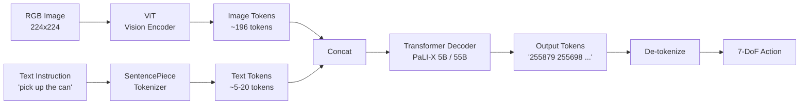
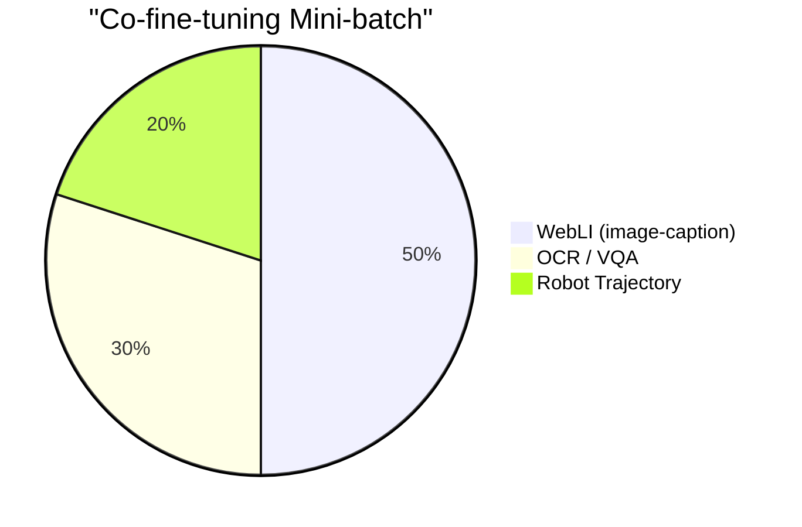
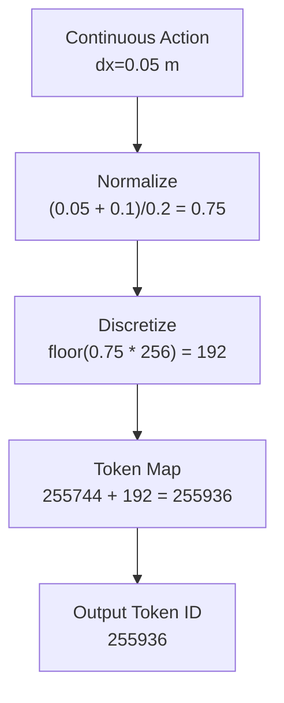

# Week 3 실습: RT-2 블로그 1편 작성 + 발행

> [goal] **실습 목표**: 공개 가능한 RT-2 블로그 1편을 마감하고, 본 레포 `Studies/Phase 4/blog/rt2.md` 에 사본 보관.
> [time] **예상 시간**: 8~10시간

---

## [tool] 환경 설정

이번 주는 거의 코드 없음. 블로그 작성 + Mermaid 다이어그램 도구만 필요.

```bash
# Mermaid CLI (선택, Markdown 미리보기)
npm install -g @mermaid-js/mermaid-cli

# 또는 Mermaid live editor 사용 (브라우저)
# https://mermaid.live/

# 본 레포 blog 디렉토리 준비
mkdir -p "$(git rev-parse --show-toplevel)/Studies/Phase 4/blog"
```

---

## [note] 실습 1: 블로그 플랫폼 결정

### 1-1. 후보 비교

| 플랫폼 | 장점 | 단점 |
|---|---|---|
| Velog | 한국어 검색 노출 우수, 무료, 마크다운 지원 | 글로벌 노출 부족 |
| Medium | 글로벌 노출, 디자인 깔끔 | 한국어 검색 약함, paywall 가능 |
| Notion (Public) | 빠른 설정, 멀티미디어 | 검색 노출 약함 |
| 본 레포 `Studies/Phase 4/blog/` | version control | 검색 노출 거의 없음 |

### 1-2. 추천 조합 (본 로드맵)

**Velog + 본 레포 사본**:
- 메인 발행: Velog (한국어 면접관이 가장 자주 검색)
- 사본 보관: `Studies/Phase 4/blog/rt2.md` (version control + 면접 시 직접 링크)

### 1-3. Velog 계정 준비 (했다면 skip)

```
1. https://velog.io 에서 GitHub 로그인
2. 프로필 설정: bio, github, linkedin 링크
3. 첫 글 (이게 RT-2 블로그) 작성 준비
```

---

## [note] 실습 2: 블로그 outline 잡기

**파일명**: `rt2_blog_outline.md` (먼저 outline 만 작성)

```markdown
# RT-2 정독 노트: VLM 이 어떻게 로봇 행동을 생성하는가

## Section 1: 한 줄 요약
- (작성 예정: 50자)

## Section 2: 배경
- VLA 분야의 등장 배경
- RT-1 의 한계
- web-scale VLM 의 등장
- (300자)

## Section 3: 한 페이지 요약
- Architecture diagram (Mermaid)
- 입출력 인터페이스
- 핵심 3가지 설계 결정
- (600자)

## Section 4: 자세한 동작
- 4-1. VLM 의 standard 흐름
- 4-2. Action Tokenization 수식
- 4-3. Co-fine-tuning mixture
- 4-4. Training loss 의 일관성
- (1000자)

## Section 5: 결과 / 사례
- Real-world setup
- baseline 대비 성공률
- Emergent capability 4 사례
- (600자)

## Section 6: 한계 5가지
- latency
- closed-source
- quantization
- single-arm
- VRAM
- (600자)

## Section 7: 양산 SW 엔지니어의 관점
- latency 의 실무 의미
- 안전 인터록의 필요성
- 양산 비용
- 본 로드맵의 다음 단계
- (400자)

## Section 8: 다음 학습 + Reference
- OpenVLA / π0 / Helix
- 참고 자료 5~10개
- (150자)
```

> [tip] outline 을 본문 작성 전에 먼저 마감하면 작성 시간이 절반으로 줄어든다.

---

## [note] 실습 3: 다이어그램 작성

### 3-1. Mermaid 다이어그램 1: RT-2 Architecture



### 3-2. Mermaid 다이어그램 2: Co-fine-tuning Data Mixture



### 3-3. Mermaid 다이어그램 3 (선택): Action Token 의 흐름



> [tip] 본문에는 다이어그램 1 (Architecture) 은 필수, 2~3 은 선택.

---

## [note] 실습 4: 본문 작성 가이드 (Section 4 의 예시)

가장 큰 비중인 Section 4 (자세한 동작) 의 예시:

````markdown
## 4. RT-2 의 자세한 동작

### 4-1. VLM 의 standard 흐름 복습

VLM (Vision-Language Model) 은 이미지와 텍스트를 입력 받아 텍스트를 출력하는
large model 이다. 입력의 단위는 모두 **token**:

- 이미지 → Vision Transformer (ViT) → patch token 196개 (224x224 이미지 기준)
- 텍스트 → SentencePiece tokenizer → sub-word token

두 종류 토큰이 concat 되어 Transformer Decoder 의 입력이 된다. 출력은 다시
token sequence. 일반적인 VLM 은 이 출력 token 을 caption 이나 답변 텍스트로
변환해 사용한다.

### 4-2. Action Tokenization: "Action 도 token"

RT-2 의 가장 영리한 아이디어는 robot action 도 동일하게 token 으로 표현하는 것.
구체적으로, VLM 의 vocabulary 의 마지막 256 개 token 을 "action discrete bin"
으로 재해석한다.

수식 3 개:

1. Discretize:   `b = min(floor((a - a_min) / (a_max - a_min) * 256), 255)`
2. Token map:    `t = ACTION_TOKEN_START + b`
3. De-tokenize:  `a = a_min + (b + 0.5) / 256 * (a_max - a_min)`

여기서 `ACTION_TOKEN_START` 는 vocab size 에서 256 을 뺀 값. 예를 들어 PaLI-X
의 vocab size 가 256000 이라면 ACTION_TOKEN_START = 255744.

이 방식의 quantization step 을 계산해 보면:

| 차원 | 범위 | step |
|---|---|---|
| dx, dy, dz | [-0.1, +0.1] m | 0.78 mm |
| rx, ry, rz | [-pi, +pi] rad | 1.40 deg |
| gripper | [0, 1] | 0.004 |

0.78 mm 의 정밀도는 cm 단위 manipulation (잡기 / 놓기) 에는 충분하지만, sub-mm
정밀 조립 (자동차 부품 / 반도체) 에는 한계가 있다. **이 수치가 RT-2 의 실무적
한계를 정량적으로 보여주는 첫 번째 지표**.

### 4-3. Co-fine-tuning mixture

(작성)

### 4-4. Training loss 의 일관성

(작성)
````

> [tip] 본 예시처럼 "수치 → 의미 → 한계" 순서로 작성하면 자연스럽게 깊이가 드러난다.

---

## [note] 실습 5: 본문 작성 (전체)

본 실습이 본 주의 핵심. 위 outline + 다이어그램을 가지고 전체 본문을 작성한다.

### 5-1. 작성 순서 권장

1. Section 1 (한 줄 요약) → 매우 짧게 마감
2. Section 3 (한 페이지 요약) → 다이어그램 먼저
3. Section 4 (자세한 동작) → 가장 큰 분량, 가장 정성 들임
4. Section 5 (결과)
5. Section 6 (한계)
6. Section 7 (양산 SW 엔지니어의 관점) → 본인 차별화 메시지
7. Section 2 (배경) → 마지막에 작성 (전체 보고 도입 설계)
8. Section 8 (다음 + Reference)

### 5-2. 본문 작성 위치

```bash
# 본 레포에 사본 보관 (version control)
$EDITOR "$(git rev-parse --show-toplevel)/Studies/Phase 4/blog/rt2.md"

# Velog 에 발행 (사본을 그대로 복사하여 plate)
```

---

## [note] 실습 6: Self-review 체크리스트

**파일명**: `~/phase4_notes/week3/self_review.md` (자기 글을 다시 읽으면서 체크)

```markdown
# RT-2 블로그 self-review

## 구조
- [ ] 8 section 모두 있음
- [ ] Section 1 (한 줄 요약) 이 50자 이하로 명확
- [ ] Section 3 에 다이어그램 1 ~ 2 개
- [ ] Section 4 가 가장 큰 분량 (대략 1000자)
- [ ] Section 6 의 한계가 5 가지

## 내용
- [ ] 모든 정량 표현에 수치 + 단위
- [ ] 본인 해석 한 줄이 단락마다 있음
- [ ] 표 1 ~ 2 개로 비교가 깔끔함
- [ ] 코드 / 수식 / diagram 의 균형
- [ ] 다른 모델 (RT-1, OpenVLA 등) 과 비교

## 톤
- [ ] "혁신적" / "획기적" 같은 과장 없음
- [ ] 한계 5가지를 정직하게
- [ ] 어조가 일관됨 (전부 일관된 격식)

## SEO / 검색
- [ ] 제목이 검색 가능한 키워드 포함 (RT-2, VLA, ...)
- [ ] 첫 단락에 핵심 정보 포함 (검색 노출용)
- [ ] 태그 5 개 이상

## 분량
- [ ] 한국어 3000 ~ 4000 자 범위
- [ ] 표 / 다이어그램 제외하고 본문이 너무 짧지 않음
```

---

## [note] 실습 7: 발행 + 기록

### 7-1. Velog 발행

1. https://velog.io 에 마크다운 그대로 paste
2. 제목 / 태그 설정
3. 첨부 이미지 (다이어그램) 업로드
4. Publish

### 7-2. 본 레포 사본 commit

```bash
cd "$(git rev-parse --show-toplevel)"
git add "Studies/Phase 4/blog/rt2.md"
git commit -m "phase4 w3: rt-2 blog post draft (velog 발행)"
```

### 7-3. URL 기록

`~/phase4_notes/week3/published_urls.md`:

```markdown
# 발행 기록

- RT-2 블로그: https://velog.io/@<your-id>/rt-2-vla-deep-dive
- 발행 날짜: 2026-09-XX
- 본 레포 사본: Studies/Phase 4/blog/rt2.md
- 글자 수: 약 ____자
- 다이어그램: ____개
```

### 7-4. LinkedIn / Twitter 공유 (선택)

```
형식 예시:

VLA 분야 정독 노트 첫 번째 글: RT-2.
VLM 의 web knowledge 가 어떻게 robot 행동으로 transfer 되는가를 정리했습니다.
양산 SW 엔지니어 관점에서 latency / quantization 의 의미도 함께 적었습니다.
[link]
```

---

## [O] 실습 체크리스트

- [ ] 블로그 플랫폼 결정 (Velog 권장)
- [ ] outline 작성 완료 (`rt2_blog_outline.md`)
- [ ] Mermaid 다이어그램 1 ~ 2 개 작성
- [ ] 본문 작성 완료 (한국어 3000 ~ 4000 자)
- [ ] self-review 체크리스트 통과
- [ ] Velog 발행
- [ ] 본 레포 `Studies/Phase 4/blog/rt2.md` 에 사본 commit
- [ ] URL 기록
- [ ] (선택) LinkedIn 공유
- [ ] quiz_easy / quiz_medium 풀기

---

## [link] 참고 자료

### 블로그 작성 기법
- [좋은 기술 글쓰기 가이드 (Tech Writing Course)](https://developers.google.com/tech-writing)
- [Velog 사용 가이드](https://velog.io/about)

### Mermaid
- [Mermaid 공식 문서](https://mermaid.js.org/)
- [Mermaid Live Editor](https://mermaid.live/)

### RT-2 (블로그에서 인용할 source)
- [RT-2 paper](https://arxiv.org/abs/2307.15818)
- [RT-2 project page](https://robotics-transformer2.github.io/)
- [DeepMind RT-2 blog](https://www.deepmind.com/blog/rt-2-new-model-translates-vision-and-language-into-action)

---

## [tip] 트러블슈팅

| 증상 | 해결 |
|---|---|
| 본문이 안 써짐 | outline 부터 다시. outline 이 안 되면 본문도 안 된다 |
| 분량이 너무 길어짐 | Section 4 외에는 압축. 표/다이어그램으로 본문 대체 |
| 한계가 안 떠오름 | week 1 README 의 한계 5가지 그대로 인용 |
| 다이어그램이 너무 복잡 | 핵심 6 노드만. 나머지는 본문 텍스트로 |
| Velog 가 안 됨 | tistory / Medium / 본 레포 README 으로 대체 가능 |
