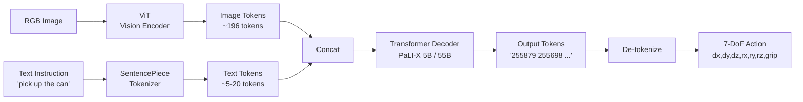

# Week 3: RT-2 블로그 1편 작성


> **이번 주 목표**: week 1-2 의 reading note 와 한 페이지 노트를 합쳐서 **공개 가능한 RT-2 블로그 1편** 의 초고를 마감한다. 산출물 #2 의 절반 (블로그 2편 중 1편).
> **예상 시간**: 10-12시간 (블로그 본문 6h + 다이어그램 2h + 퇴고 2-4h)
> **핵심 질문**: "내 블로그 글을 처음 보는 사람이 30분 안에 RT-2 의 본질과 한계를 이해할 수 있는가?"


---


## 학습 순서


| 순서 | 단계 | 파일/자료 | 설명 |
|:----:|------|----------|------|
| 1 | 블로그 플랫폼 결정 | `PRACTICE.md` 1 | Velog / Medium / 본 레포 `blog/` 중 선택 |
| 2 | 글 구조 잡기 | `PRACTICE.md` 2 | 표준 8-section 구조로 outline |
| 3 | 다이어그램 작성 | `PRACTICE.md` 3 | Mermaid 또는 손그림 사진 |
| 4 | 본문 작성 | 블로그 플랫폼 | 약 3000-4000 자 한국어 |
| 5 | 퀴즈 (블로그 평가) | `quiz_easy.py` | "이 블로그가 좋은 글인가" 자가 체크 |
| 6 | 퀴즈 (서술/논리) | `quiz_medium.py` | 핵심 단락 글쓰기 |
| 7 | 퇴고 + 발행 | `PRACTICE.md` 4 | 동료 1명 review 또는 self-review |


---


## 시작하기 전에 — 블로그가 왜 산출물인가


본 로드맵에서 블로그는 단순한 "공부 노트" 가 아니다. **면접관의 진입점** 이다.


| 면접관이 블로그를 보는 이유 | 어떤 평가를 하는가 |
|---|---|
| 후보자의 deep understanding 측정 | 논문을 흉내내는가, 자기 언어로 재구성하는가 |
| 글쓰기 능력 측정 | 기술 문서를 잘 쓰는가 (실무에서 매일 쓰는 능력) |
| 의지 / 일관성 측정 | 꾸준히 산출물 만드는가 |
| 분야 적합도 측정 | VLA 의 본질을 이해하는가, 표면만 보는가 |


좋은 블로그 1편 = 좋은 이력서 1줄과 같은 무게.


> 본 phase 의 산출물 #2 는 "블로그 2편 + ROS2 demo" 다. 블로그 1편이 못 나오면 산출물 자체가 흔들린다. 이번 주가 본 phase 의 첫 결정타.


---


## 블로그 작성 가이드


### 1. 좋은 기술 블로그의 표준 구조


본 로드맵에서 권장하는 8-section 표준 구조:


```
1. 한 줄 요약 (Hook)
   - 글 전체를 한 문장으로 표현
   - 독자가 "더 읽을 가치 있는가" 판단


2. 배경 / 문제 의식
   - 왜 이 논문을 읽었는가
   - 어떤 질문에 답하려 하는가


3. 핵심 아이디어 한 페이지 요약
   - 글 전체를 끝까지 안 읽어도 핵심 파악 가능
   - 다이어그램 1 ~ 2 개


4. 자세한 동작 / 수식 / 코드
   - week 1~2 의 reading note 의 압축본
   - 정확하고 검증 가능한 수치


5. 실험 결과 / 사례
   - 논문에서 가장 인상적인 결과 3 ~ 5 개
   - 자기만의 해석


6. 한계 / 비판
   - 5 가지 정도
   - 단순 나열이 아닌 "이게 왜 한계인가"


7. 본 로드맵 / 실무 관점에서의 시사점
   - "이 모델이 양산 SW 엔지니어에게 어떤 의미인가"
   - 차별화 메시지


8. 다음 학습 방향 / Reference
   - 자기가 다음으로 무엇을 할지 (예: OpenVLA, ROS2 integration)
   - 참고 자료 5 ~ 10 개
```


### 2. 블로그 톤 가이드


| 좋은 톤 | 나쁜 톤 |
|---|---|
| 정직 — 모르는 건 모른다고 적기 | 과장 — "혁신적" / "획기적" 남발 |
| 정량 — 수치로 말하기 | 정성 — "매우 빠르다", "엄청 정확하다" |
| 비교 — 다른 모델과의 차이 | 단독 — RT-2 만 칭찬 |
| 한계 명시 — 직접 비판 | 한계 회피 — 장점만 나열 |
| 본인 해석 — 자기 의견 | 논문 복붙 — abstract 의 직역 |


### 3. RT-2 블로그의 8-section 권장 내용


각 section 에 무엇을 쓸지 미리 정해놓고 본문을 채우면 시간 절약:


#### Section 1: 한 줄 요약 (예시)
> "RT-2 는 web 데이터로 사전학습된 VLM 을 robot action 토큰까지 출력하도록 co-fine-tune 한 모델. VLM 의 web knowledge 가 robot 으로 transfer 되는 첫 대규모 증명."


#### Section 2: 배경 (예시 주제)
- VLA 라는 분야의 등장
- RT-1 의 한계 (small transformer, robot data only)
- web-scale VLM 의 등장 (PaLI-X, PaLM-E)


#### Section 3: 한 페이지 요약 (예시 구성)
- Architecture diagram (Mermaid 또는 손그림)
- 입출력 인터페이스 (image + text -> action)
- 핵심 3 가지 설계 결정 (backbone / action token / co-fine-tuning)


#### Section 4: 자세한 동작 (예시 구성)
- VLM 의 standard 흐름 복습 (3 단락)
- Action Tokenization (week 2 의 수식 3개)
- Co-fine-tuning mixture (web 80 : robot 20)
- Training loss 의 일관성


#### Section 5: 결과 / 사례 (예시)
- Real-world 평가 setup
- RT-1 / BC-Z baseline 대비 성공률
- Emergent capability 4 사례 (각 한 줄)


#### Section 6: 한계 5가지
- Inference latency (~200ms)
- closed-source weight
- Quantization step (실측 수치)
- Single embodiment
- VRAM 요구사항 (5B/55B)


#### Section 7: 본 로드맵 관점 (예시)
- 양산 SW 엔지니어가 이 모델을 보면:
  - latency 의 의미 (실시간 30Hz 어려움)
  - 안전 인터록의 필요성 (action 의 noisy quantization)
  - 양산 비용 (GPU VRAM / 메모리)
- Phase 7 산출물 #4 에서 이 한계들을 직접 측정할 예정


#### Section 8: 다음 학습 + Reference
- OpenVLA (open-source 버전) - week 4-7
- HuggingFace inference 시도 - week 8~
- π0 / Helix 등 후속 모델
- 참고 자료 5-10 개


### 4. 분량 가이드


- 한국어 기준 **3000 ~ 4000 자** (대략 5-7 페이지)
- 너무 길면 (5000+ 자): 면접관이 다 안 읽음
- 너무 짧으면 (2000 자 미만): 깊이 없음


각 section 별 권장 분량:
- Section 1: 50자
- Section 2: 300자
- Section 3: 600자 (다이어그램 포함)
- Section 4: 1000자 (가장 큰 비중)
- Section 5: 600자
- Section 6: 600자
- Section 7: 400자
- Section 8: 150자


### 5. 다이어그램 작성 도구


| 도구 | 장점 | 단점 |
|---|---|---|
| Mermaid | 마크다운에 inline, version control | 복잡한 다이어그램 한계 |
| Graphviz | 정밀한 그래프 | 학습 곡선 |
| draw.io | GUI, 표준 노트 도구 | 외부 도구 |
| 손그림 (사진) | 빠름 | 검색/편집 불가 |
| Excalidraw | 손그림 톤 + 디지털 | 외부 도구 |


> 본 phase 권장: **Mermaid** 우선 (블로그에 inline 가능). 복잡한 경우 Excalidraw.


### 6. RT-2 Architecture 의 Mermaid 예시


````markdown

````


### 7. 흔히 빠지는 함정


| 함정 | 어떻게 피하나 |
|---|---|
| 논문 abstract 의 거의 직역 | 자기 언어로 다시 쓰기. 한 단락마다 "내 해석" 한 줄 추가 |
| 수치 누락 ("매우 빠르다") | 모든 정량 표현은 수치 + 단위 |
| 다이어그램이 논문과 똑같음 | 자기 강조점에 맞게 단순화 (모든 디테일 안 그림) |
| 한계 section 이 너무 짧음 | 5가지 한계를 각 2-3문장으로 |
| Reference 가 1-2개 | 최소 5개 (논문, 블로그, 코드, 강의) |


### 8. 블로그 SEO + 검색 가능성


| 요소 | 가이드 |
|---|---|
| 제목 | "RT-2 가 무엇인가" 가 아니라 "RT-2 정독 노트: VLM 이 어떻게 로봇 행동을 생성하는가" |
| URL slug | "rt2-vla-deep-dive" 같은 영어 short |
| 태그 | VLA, RT-2, OpenVLA, Robot Manipulation, Foundation Model |
| 첫 단락 | 검색 결과에 노출되는 부분, 한 줄 요약 포함 |
| 외부 링크 | RT-2 공식 페이지, arXiv 링크 명시 |


---


## 본 로드맵의 블로그 활용 전략


1. **블로그 1편 = 산출물 #2 의 1/3** (총: 블로그 2편 + ROS2 demo)
2. **블로그 2편이 모이면 LinkedIn 컨택 시 첫 명함**
3. **면접 시 "내 블로그 봤어요?" 가 가장 좋은 첫 마디**
4. **블로그 → Velog 또는 Medium 둘 다 발행 권장** (검색 노출 다양화)
5. **본 레포 `Studies/Phase 4/blog/rt2.md` 에도 사본 보관** (version control)


> 본인의 블로그가 검색에서 노출되려면 최소 2-3편의 같은 분야 글이 누적되어야 한다. 본 phase 끝에 블로그 2편이 있으면 검색 노출 시작.


---


## 자체 점검


**Q1. 블로그의 8-section 구조에서 가장 분량이 큰 section 은?**
> Section 4 (자세한 동작 / 수식 / 코드). 권장 1000자. 글의 깊이를 결정.


**Q2. 면접관이 블로그를 보고 가장 빠르게 평가하는 부분은?**
> Section 1 (한 줄 요약) 과 Section 3 (한 페이지 요약). 30초 안에 글의 가치 판단.


**Q3. 좋은 블로그와 나쁜 블로그의 가장 큰 차이는?**
> "한계 / 비판" 의 유무. 좋은 블로그는 모델의 단점을 정직하게 5가지 언급. 나쁜 블로그는 장점만 나열.


**Q4. 본 로드맵의 블로그 1편의 분량 권장 범위는?**
> 한국어 3000 ~ 4000 자. 너무 길면 다 안 읽힘, 너무 짧으면 깊이 부족.


**Q5. RT-2 블로그에서 자기 차별화 메시지는 무엇에 쓸 수 있나?**
> Section 7 (본 로드맵 관점). "양산 SW 엔지니어로서 이 모델의 latency / quantization 의 의미" 같은 본인 강점이 드러나는 해석. 박사/연구자 블로그와 가장 큰 차이.


---


## 이번 주 실습 & 다음 주 준비


### 이번 주 실습 과제
1. 블로그 플랫폼 결정 (Velog 권장 - 한국어 / 검색 노출 / 무료)
2. 8-section 구조로 outline 먼저 작성 (1 시간)
3. Section 별 본문 작성 (5 ~ 6 시간)
4. Mermaid diagram 1 ~ 2 개 제작 (1 시간)
5. Self-review + 퇴고 (2 시간)
6. 발행 + URL 을 `~/phase4_notes/` 에 기록
7. quiz_easy / quiz_medium 풀기


### 다음 주 (week 4) 준비
- OpenVLA 논문 다운로드 (https://arxiv.org/abs/2406.09246)
- OpenVLA HuggingFace 모델 카드 한 번 훑어보기 (https://huggingface.co/openvla)
- RT-2 블로그 발행 직후의 피드백 모니터링 (LinkedIn / Twitter 등)


---


## 이번 주 핵심 요약


1. **블로그는 면접관의 진입점**: 단순 노트가 아닌 산출물.
2. **8-section 표준 구조**: 한 줄 / 배경 / 한 페이지 / 자세한 동작 / 결과 / 한계 / 시사점 / 다음.
3. **분량 3000-4000자**: 너무 길면 안 읽히고, 너무 짧으면 깊이 부족.
4. **한계 5가지를 정직하게**: latency / closed / quantization / single-arm / VRAM.
5. **본인 차별화 메시지 1개는 반드시 포함**: 양산 SW 엔지니어의 관점.


---


- 이전: [Week 2 - Co-fine-tuning + Action Tokenization](../week2/README.md)


다음: [Week 4 - OpenVLA 1회독 + Architecture](../week4/README.md)
