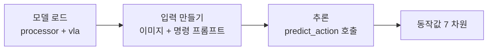

# Week 6: OpenVLA HuggingFace 모델 카드 + 환경 셋업


> **이번 주 목표**: OpenVLA 의 HuggingFace 모델 카드를 정독하고, RTX 4070 12GB 환경에서 4-bit quantization 으로 inference 실행까지 가져간다. (week 7 vla-lab 문서 + week 8~ ROS2 demo 의 사전 준비)
> **예상 시간**: 8-10시간
> **핵심 질문**: "OpenVLA inference 가 내 환경에서 동작하는가? 한 frame 의 latency 는 몇 ms 인가?"


---


## 학습 순서


| 순서 | 단계 | 파일/자료 | 설명 |
|:----:|------|----------|------|
| 1 | 환경 | `requirements.txt` | bitsandbytes, accelerate 추가 |
| 2 | HuggingFace 모델 카드 정독 | https://huggingface.co/openvla/openvla-7b | usage / VRAM / license |
| 3 | 4-bit quantization 셋업 | `PRACTICE.md` 1 | bitsandbytes nf4 |
| 4 | 첫 inference 실행 | `PRACTICE.md` 2 | mock image + instruction |
| 5 | latency 측정 | `PRACTICE.md` 3 | 첫 latency 데이터 (이게 산출물 v3 의 기초) |
| 6 | 퀴즈 | quiz_easy / quiz_medium | quantization / inference 흐름 |


---


## 시작하기 전에 — 환경 점검


```bash
# 사전 확인
nvidia-smi # RTX 4070, VRAM 11~12 GB available 확인
nvcc --version # CUDA 11.8 이상
python --version # 3.10+
```


```bash
# 공용 venv .venv-vla 사용 (PRACTICE.md 환경 설정 참고; bitsandbytes, accelerate 포함)
source "/workspace/study/physical-ai-study/Studies/Phase 4/.venv-vla/bin/activate"
```


---


## 핵심 개념


### 1. HuggingFace 모델 카드의 핵심 정보


OpenVLA 의 HuggingFace 페이지에서 반드시 확인할 5 가지:


| 항목 | OpenVLA 의 값 | 본 로드맵에서의 의미 |
|---|---|---|
| Model size | 7B parameter | RTX 4070 4-bit 가능 |
| License | MIT (코드) / Llama 2 (weights) | 상업적 사용 시 Llama 2 라이선스 확인 |
| Required VRAM | fp16 ~ 14GB, int4 ~ 5GB | 4070 12GB → 4-bit 필수 |
| Inference latency | ~ 100ms (RTX 4090 fp16) | 4070 + 4-bit 시 ~ 150ms |
| Usage 예시 | `transformers.AutoModelForVision2Seq` | inference 코드의 진입점 |


### 2. 4-bit Quantization (bitsandbytes nf4)


```
fp16 weight -> int4 (4-bit normalized float, nf4)
4 byte 가중치 -> 0.5 byte 가중치
                    ↓
                메모리 1/8
                속도 ~ 1.5~2x 빠름
                정확도 ~ 1~2%p 손실
```


핵심 사용 코드:


```python
from transformers import BitsAndBytesConfig


bnb_config = BitsAndBytesConfig(
    load_in_4bit=True,
    bnb_4bit_quant_type='nf4',
    bnb_4bit_use_double_quant=True,
    bnb_4bit_compute_dtype=torch.float16,
)


model = AutoModelForVision2Seq.from_pretrained(
    'openvla/openvla-7b',
    quantization_config=bnb_config,
    device_map='auto',
    torch_dtype=torch.float16,
)
```


### 3. inference 흐름


```
1. Image preprocess (PIL → tensor, normalize, resize)
2. Text instruction tokenize
3. processor 가 image + text 를 model 입력 형식으로 결합
4. model.predict_action() 호출 (OpenVLA 의 wrapper)
5. action ndarray 반환 [dx, dy, dz, rx, ry, rz, gripper]
```


`predict_action()` 은 OpenVLA 의 custom method. 내부적으로:
- vision encoder forward
- LM decoder generate (greedy or sampled)
- action token de-tokenize


### 4. Latency 측정의 중요성


본 로드맵의 **산출물 v3 결정타** 의 핵심 측정 지표가 latency 다. 이번 주에 첫 데이터를 확보:


```
1 frame inference 의 component:
  - image preprocess : ~ 10~30 ms (CPU)
  - vision encoder forward : ~ 20~40 ms
  - LM decoder generate : ~ 60~120 ms (가장 큼)
  - action de-tokenize : ~ 1 ms
  -----------------------------------------
  total : ~ 100~200 ms
```


> LM decoder 의 시간이 압도적. 이게 줄어들면 (speculative decoding 등) latency 전체가 좋아짐.


### 5. unnorm_key 의 의미


OpenVLA `predict_action()` 호출 시 `unnorm_key` 인자가 있다:


```python
action = vla.predict_action(
    input_ids=inputs["input_ids"],
    pixel_values=inputs["pixel_values"],
    unnorm_key="bridge_orig", # <- 이게 핵심
    do_sample=False,
)
```


이 key 는 OpenX-Embodiment 의 어떤 dataset 의 action normalization 통계로 de-normalize 할지 지정. 자작 팔의 경우 가까운 embodiment (예: "bridge_orig") 를 사용하거나, fine-tune 후 자체 통계 사용.


| key 예시 | 의미 |
|---|---|
| `bridge_orig` | WidowX (Bridge dataset) 의 normalization |
| `fractal20220817_data` | Google RT-1 의 normalization |
| `dlr_sara_pour_converted_externally_to_rlds` | DLR pour task |
| (custom) | LoRA fine-tune 후 본인 통계 사용 |


### 6. inference 시 자주 발생하는 에러


| 에러 | 원인 | 해결 |
|---|---|---|
| OOM (Out of Memory) | 4-bit 안 쓰거나 batch 큼 | bitsandbytes 적용 / batch=1 |
| missing flash_attn | flash attention 미설치 | `pip install flash-attn` (선택) |
| Image input shape mismatch | preprocess 누락 | processor 사용 권장 |
| TypeError on predict_action | OpenVLA 의 custom method | repo 의 inference 스크립트 참고 |


### 7. inference 코드의 표준 형태


```python
import torch
from PIL import Image
from transformers import AutoModelForVision2Seq, AutoProcessor


# 모델 로드 (4-bit)
processor = AutoProcessor.from_pretrained("openvla/openvla-7b", trust_remote_code=True)
vla = AutoModelForVision2Seq.from_pretrained(
    "openvla/openvla-7b",
    attn_implementation="eager", # flash_attn 없을 때
    torch_dtype=torch.float16,
    low_cpu_mem_usage=True,
    trust_remote_code=True,
    quantization_config=bnb_config,
)


# 입력
image = Image.open("test.jpg")
instruction = "pick up the can"
prompt = f"In: What action should the robot take to {instruction}?\nOut:"


# 추론 -- attention_mask 는 넘기지 않는다 (predict_action 이 빈 토큰을 input_ids 에만
# 덧붙여 mask 와 길이가 1 어긋나 eager attention 에서 크래시)
inputs = processor(prompt, image).to("cuda:0", dtype=torch.float16)
action = vla.predict_action(
    input_ids=inputs["input_ids"],
    pixel_values=inputs["pixel_values"],
    unnorm_key="bridge_orig",
    do_sample=False,
)
```


### 8. inference 코드 한 줄씩 풀어 읽기


섹션 7 의 표준 코드를 흐름 순서로 다시 읽는다. 전체 그림은 단순하다 — **사진 1 장 + 자연어 명령**을 넣으면 **로봇 팔이 다음에 취할 동작값** 7 개(이동 dx/dy/dz + 회전 rx/ry/rz + 그리퍼)가 나온다. 단계는 셋뿐이다.





**1단계 — 모델 로드.** `processor` 는 사람이 주는 입력(이미지 파일, 텍스트 문장)을 모델이 먹는 숫자 텐서로 바꾸는 통역사. `vla` 는 실제 추론을 하는 모델 본체. 로드 옵션의 의미:


| 옵션 | 의미 |
|---|---|
| `quantization_config=bnb_config` | 가중치를 4-bit 로 압축해 올림. 7B 를 fp16 으로 올리면 14GB 넘는데 4-bit 면 약 1/4. `bnb_config` 는 섹션 2 에서 미리 만든 설정 |
| `attn_implementation="eager"` | attention 을 표준 PyTorch 방식으로. `flash_attn` 이 깔려 있으면 더 빠른 구현을 쓰지만 없을 때의 안전한 fallback |
| `low_cpu_mem_usage=True` | 로딩 중 RAM 피크를 낮춤 |
| `trust_remote_code=True` | OpenVLA 는 표준 transformers 에 없는 자체 모델 코드를 HuggingFace 에서 같이 받아 실행. 이를 허용하는 플래그 |


**2단계 — 입력 만들기.** OpenVLA 는 학습 때 **항상 같은 문장 틀**로 명령을 받았다. 그래서 추론도 같은 틀에 명령을 끼워야 학습 때와 같은 방식으로 반응한다. 틀을 바꾸면 성능이 떨어진다.


```python
prompt = f"In: What action should the robot take to {instruction}?\nOut:"
```


`processor(prompt, image)` 가 텍스트는 토큰 ID(`input_ids`)로, 이미지는 픽셀 텐서(`pixel_values`)로 변환하고, `.to("cuda:0")` 로 GPU 에 올린다.


**3단계 — 추론.** `do_sample=False` 는 같은 입력에 항상 같은 출력이 나오게 한다(가장 확률 높은 동작을 그대로 선택). 로봇 제어는 무작위성이 없는 편이 안전하다. `attention_mask` 를 안 넘기는 이유는 섹션 7 의 주석대로 — `predict_action` 이 빈 동작 토큰을 `input_ids` 에만 덧붙여서 mask 와 길이가 1 어긋나고, eager attention 이 그 불일치에서 크래시 나기 때문이다.


**`unnorm_key` 가 핵심인 이유 (정규화 되돌리기).** 섹션 5 의 key 표를 "왜" 의 사슬로 풀면:


1. 로봇마다 물리 스케일이 다르다. 한 스텝에 1cm 움직이는 팔도, 5cm 움직이는 팔도 있다.
2. 여러 로봇 데이터로 한 모델을 학습시키려면 이 차이를 없애야 한다. 그래서 학습 전에 각 로봇의 동작값을 **정규화**(평균 0, 일정 범위)해 통일한다.
3. 따라서 모델이 내뱉는 raw 출력도 **정규화된 추상값**(예: -1 - +1)이다. 실제 로봇에 그대로 주면 안 된다.
4. `unnorm_key` 는 "이 출력을 어느 로봇의 실제 단위로 되돌릴지" 고르는 스위치다. `"bridge_orig"` 를 주면 WidowX 팔(Bridge) 의 통계로 역정규화해 실제 이동량/회전량으로 환산한다.


key 를 잘못 고르면 모델은 멀쩡히 동작값을 내는데 스케일이 틀려서 로봇이 엉뚱한 거리로 움직인다. 자작 팔은 처음엔 가까운 팔(`bridge_orig`)을 빌려 쓰다가, fine-tune 후 본인 통계 key 로 바꾸는 게 정석이다.


### 9. 본 로드맵의 다음 5주 흐름 (week 8-12)


이번 주의 inference 셋업이 끝나면:


- **week 7**: OpenVLA vla-lab 문서 1편 작성
- **week 8**: HuggingFace inference 셋업 (이번 주 결과 + 안정화)
- **week 9**: inference 입출력 인터페이스 정리
- **week 10**: ROS2 패키지 골격
- **week 11**: image subscribe → inference → action publish
- **week 12**: Rerun 시각화 + 1분 영상


---


## 자체 점검


**Q1. OpenVLA 를 RTX 4070 12GB 에서 띄우려면 어떤 quantization?**
> 4-bit nf4 (bitsandbytes). 7B fp16 은 14GB, int4 는 ~ 5GB.


**Q2. `predict_action()` 의 `unnorm_key` 의 역할은?**
> OpenX-Embodiment 의 어떤 dataset 의 action normalization 통계로 de-normalize 할지 지정. 자작 팔에는 "bridge_orig" (WidowX) 가 가장 가까움.


**Q3. inference 의 가장 큰 latency component 는?**
> LM decoder generate (~60-120ms). 다음이 vision encoder (~20-40ms). preprocess / de-tokenize 는 미미.


**Q4. 첫 inference 가 두번째 inference 보다 느린 이유는?**
> Warm-up. CUDA kernel JIT, KV cache 초기화, model weights GPU 로드 등. 첫 1-2번 inference 는 측정에서 제외하고 평균.


**Q5. OpenVLA inference 시 do_sample=False 의 의미?**
> Greedy decoding 사용 (deterministic action). robot 제어에서는 일관성이 중요하므로 보통 greedy. do_sample=True 는 다양성 필요 시.


---


## 이번 주 실습 & 다음 주 준비


### 이번 주 실습 과제
1. OpenVLA HuggingFace 모델 카드 정독 + 5가지 항목 확인
2. `practice_first_inference.py` - 첫 inference 실행 (4-bit)
3. `practice_latency_measure.py` - 100 회 inference latency 통계
4. 발생 에러 + 해결 기록 (`~/phase4_notes/week6/errors_log.md`)
5. quiz_easy / quiz_medium 풀기


### 다음 주 (week 7) 준비
- week 6 의 latency 측정 결과 + RT-2 vla-lab 문서 (week 3) 와 비교
- OpenVLA vla-lab 문서 outline 작성 시작


---


## 이번 주 핵심 요약


1. **4-bit quantization (bitsandbytes nf4) 필수** RTX 4070 12GB 환경.
2. **`predict_action()` + `unnorm_key`**: OpenVLA 의 custom inference API.
3. **Latency ~ 100-200ms**: LM decoder 가 대부분.
4. **첫 데이터 확보**: 산출물 v3 의 latency 측정의 baseline.
5. **다음 주부터 vla-lab 문서 + ROS2 demo**: 본격적 통합 시작.


---


- 이전: [Week 5 - OpenX-Embodiment + Fine-tuning](../week5/README.md)


다음: [Week 7 - OpenVLA vla-lab 문서 1편 작성](../week7/README.md)
