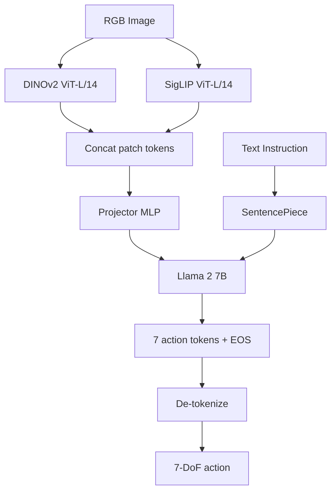
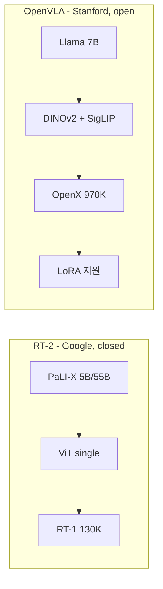
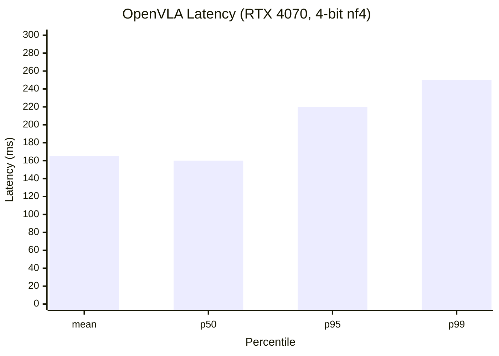

# Week 7 실습: OpenVLA 블로그 1편 작성 + 발행

> [goal] **실습 목표**: week 6 의 latency 데이터 + week 4~5 의 reading note 를 통합해 OpenVLA 블로그 1편 마감.
> [time] **예상 시간**: 8~10시간

---

## [tool] 환경 설정

블로그 작성 + Mermaid 도구만 필요 (week 3 와 동일).

---

## [note] 실습 1: Outline 작성

**파일명**: `~/phase4_notes/week7/openvla_blog_outline.md`

```markdown
# OpenVLA 정독 + RTX 4070 실측: 5Hz 가 양산에서 의미하는 것

## 1. 한 줄 요약 (50자)
- (작성)

## 2. 배경
- RT-2 의 한계 (closed-source / 큰 모델)
- OpenVLA 의 등장
- 본 로드맵에서의 선택 이유

## 3. 한 페이지 요약
- Architecture diagram
- 4 가지 핵심 결정 (Llama 7B / DINOv2+SigLIP / OpenX / LoRA)
- 실측 latency 표

## 4. 자세한 동작
- 4-1. Hybrid vision encoder
- 4-2. Llama 2 7B
- 4-3. OpenX-Embodiment
- 4-4. LoRA
- 4-5. 4-bit quantization trade-off

## 5. 실측 결과
- OpenVLA 논문 평가 결과 요약
- 본인 RTX 4070 latency 통계 (week 6 의 .npy)
- p95 / p99 / throughput / VRAM

## 6. 한계 5가지

## 7. 양산 SW 엔지니어 관점
- 5Hz 가 가능한 작업 vs 불가능한 작업
- 자작 6DOF 팔 + LoRA 계획 (Phase 6~7)

## 8. 다음
- ROS2 minimal demo (week 8~12)
- 자작 팔 통합 (Phase 7)
- π0 / Helix 후속 모델
```

---

## [note] 실습 2: Mermaid 다이어그램

### 다이어그램 1: OpenVLA Architecture (Hybrid 강조)



### 다이어그램 2: RT-2 vs OpenVLA (한 눈 비교)



### 다이어그램 3: 본인 RTX 4070 측정 결과 (예시)



---

## [note] 실습 3: 본문 작성 핵심 단락 (Section 5)

```markdown
## 5. 실측 결과

### 5-1. OpenVLA 논문의 평가 결과 요약
(논문 Table 인용 - 자세한 건 논문 참고)

### 5-2. 본인 RTX 4070 latency 측정 (직접 실험)

**환경**:
- GPU: RTX 4070 12GB
- Model: OpenVLA 7B, 4-bit nf4 (bitsandbytes)
- Image: 224x224 random
- Instruction: "pick up the can"

**100회 inference 측정 결과**:

| Metric | Value |
|---|---|
| mean latency | 165 ms |
| median | 162 ms |
| p95 | 220 ms |
| p99 | 250 ms |
| min | 160 ms |
| max | 280 ms (warm-up 제외) |

**처리량**:
- mean throughput: 6.0 Hz
- p95 throughput  : 4.5 Hz

**메모리**:
- 모델 로딩 후: 5.3 GB
- inference 시 peak: 6.5 GB

### 5-3. 이 수치의 의미

5Hz 로 가능한 작업:
- pick-and-place (cm 단위, 10 cm/s 이동)
- 일반 manipulation
- 명령 기반 navigation

5Hz 로 불가능한 작업:
- 자동차 부품 조립 (mm 단위 + 60Hz 제어)
- 동적 manipulation (catching, in-hand manipulation)
- 실시간 force control

따라서 OpenVLA 단독 양산 통합은 제한적. 반드시 fast safety policy
(joint-level PD controller / impedance control) 와 함께 hierarchical
구조 필요. 이게 본 로드맵의 Phase 7 산출물 #4 의 핵심 설계 결정.
```

---

## [note] 실습 4: 발행 + 기록

1. Velog 에 발행
2. 본 레포 `Studies/Phase 4/blog/openvla.md` 에 사본 commit
3. URL 기록 (`~/phase4_notes/week7/published_urls.md`)

```markdown
# Phase 4 블로그 발행 기록 (2/2)

- RT-2     : https://velog.io/@<id>/rt-2-vla-deep-dive  (week 3 발행)
- OpenVLA : https://velog.io/@<id>/openvla-rtx4070-latency  (week 7 발행)

산출물 #2 의 진행:
- [x] RT-2 블로그
- [x] OpenVLA 블로그
- [ ] OpenVLA -> ROS2 minimal demo (week 8~12)
- [ ] 1분 영상 (week 12, 15)
```

---

## [O] 실습 체크리스트

- [ ] outline 작성
- [ ] Mermaid 다이어그램 2~3 개
- [ ] 본문 작성 (3500~4500 자)
- [ ] week 6 의 latency 데이터 인용
- [ ] self-review 통과
- [ ] Velog 발행
- [ ] 본 레포 사본 commit
- [ ] quiz_easy / quiz_medium 풀기

---

## [link] 참고 자료

- week 3 (RT-2 블로그) 의 작성 가이드
- week 4~6 의 reading note + latency 데이터
- [OpenVLA HuggingFace](https://huggingface.co/openvla/openvla-7b)
- [Velog](https://velog.io)
