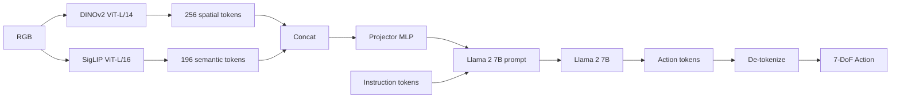

# Week 9: OpenVLA Vision Backbone 종합 분석


> **이번 주 목표**: DINOv2 + SigLIP 가 OpenVLA 의 vision backbone 으로 어떻게 동작하는지 종합 분석. Phase 4 week 4 의 architecture 다이어그램을 component level 까지 갱신.
> **예상 시간**: 6시간


---


## 학습 순서


| 순서 | 단계 | 파일 | 설명 |
|:----:|------|------|------|
| 1 | OpenVLA backbone 재정리 | `PRACTICE.md` 1 | DINOv2 + SigLIP fusion |
| 2 | Projector (MLP) 의 역할 | `PRACTICE.md` 2 | dim 변환 + 학습 |
| 3 | Phase 4 architecture 갱신 | `PRACTICE.md` 3 | 손그림 (또는 mermaid) |
| 4 | 노트 + 퀴즈 | one-pager | |


---


## 핵심 개념


### 1. OpenVLA Vision Backbone 의 전체 구조


```
RGB Image (예: 224)
   |
   +-> DINOv2 ViT-L/14 -> 256 patch tokens (1024 dim each)
   | (spatial)
   |
   +-> SigLIP ViT-L/16 -> 196 patch tokens (1024 dim each)
           (semantic)


DINOv2 tokens: (256, 1024)
SigLIP tokens: (196, 1024)
        |
        +-- sequence concat -> (452, 1024)
        +-- 또는 channel concat (위치 정렬 필요)
        |
        v
Projector (MLP):
   (452, 1024) -> linear -> (452, 4096) # Llama dim
        |
        v
Llama 2 7B input
```


### 2. Projector 의 정확한 역할


```python
# 의사 코드
projector = nn.Sequential(
    nn.Linear(1024, 4096), # vision dim -> Llama dim
    nn.GELU(),
    nn.Linear(4096, 4096),
)
```


학습:
- DINOv2 / SigLIP 의 weights 는 **frozen** (pre-trained 그대로)
- Projector 의 weights 는 OpenVLA fine-tune 시 학습
- Llama 의 weights 도 학습


이 patterns 가 LLaVA / OpenVLA 의 표준.


### 3. Spatial 정보 + Semantic 정보의 결합


```
DINOv2 의 256 tokens : 어디 (16x16 grid 의 spatial 위치)
SigLIP 의 196 tokens : 무엇 (14x14 grid 의 semantic class)


Llama 는 이 두 종류 정보를 함께 받아:
  "red can at position (3, 4) and (3, 5)"
  를 자연스럽게 추론 가능
```


### 4. Vision tokens 의 LLM 처리


```
prompt 구조:
  [BOS] <image_tokens> "What action..." [response]
       ^^^^^^^^^^^^^^^^
       452 vision tokens 가 prompt 의 앞부분


Llama 의 attention:
  - 이후 text token 들이 vision tokens 에 attention 가능
  - context length 가 452 + 50 ~ 500 token
```


### 5. Architecture 갱신 (Phase 4 week 4 의 다이어그램)





### 6. LoRA fine-tune 시 무엇이 학습되는가


| Component | Phase 7 LoRA 학습 |
|---|---|
| DINOv2 | frozen (학습 안 함) |
| SigLIP | frozen |
| Projector | 학습 가능 (선택, 보통 학습) |
| Llama (LoRA) | rank 32 LoRA 학습 |


projector 학습 비중 작으므로 메모리 큰 비용 없음.


### 7. OpenVLA 의 image resolution 결정


```
224 (저해상도) : seq ~ 452, latency 짧음, 일반 task OK
384 (중해상도) : seq ~ 1150, latency 길음, fine task 강화
```


OpenVLA 기본 224. 384 도 옵션.


### 8. Phase 5 학습의 총 정리


본 주가 Phase 5 의 사실상 종합. week 10-12 는 SigLIP + Phase 4 demo 보강.


이번 주의 결과물:
- OpenVLA architecture 종합 다이어그램 (Phase 4 week 4 의 진화 버전)
- 각 component 의 weights / training / role 정리
- LoRA fine-tune 시 학습되는 부분 명확


---


## 자체 점검


**Q1. DINOv2 vs SigLIP 의 fusion 방식?**
> Sequence concat (가장 단순). 또는 channel concat (위치 정렬 필요). OpenVLA 는 sequence concat 표준.


**Q2. Projector 의 입출력 dim?**
> 1024 (vision) -> 4096 (Llama 의 hidden). 보통 2-layer MLP.


**Q3. LoRA fine-tune 시 학습 components?**
> Projector + Llama (LoRA). DINOv2 / SigLIP 은 frozen.


**Q4. Llama 의 vision token 개수?**
> 452 (224 image) 또는 1150 (384 image). context 의 큰 비중.


**Q5. 224 vs 384 의 trade-off?**
> 224: 빠름 / 일반 OK. 384: 느림 (~6배 attention FLOPS) / fine task 정확도 향상.


---


## 실습 + 다음 주


### 이번 주
- OpenVLA architecture 손그림 갱신
- Projector 분석
- one-pager 완성


### 다음 주 (week 10)
- SigLIP 논문 정독


---


## 핵심 요약


1. **DINOv2 + SigLIP -> concat -> projector -> Llama**
2. **Projector MLP** 가 vision dim -> Llama dim 변환
3. **Vision encoders frozen**, projector + LoRA 학습
4. **vision tokens ~ 450 개** 가 prompt 의 큰 비중
5. **224 vs 384** trade-off


- 이전: [Week 8](../week8/README.md) | 다음: [Week 10 - SigLIP](../week10/README.md)
