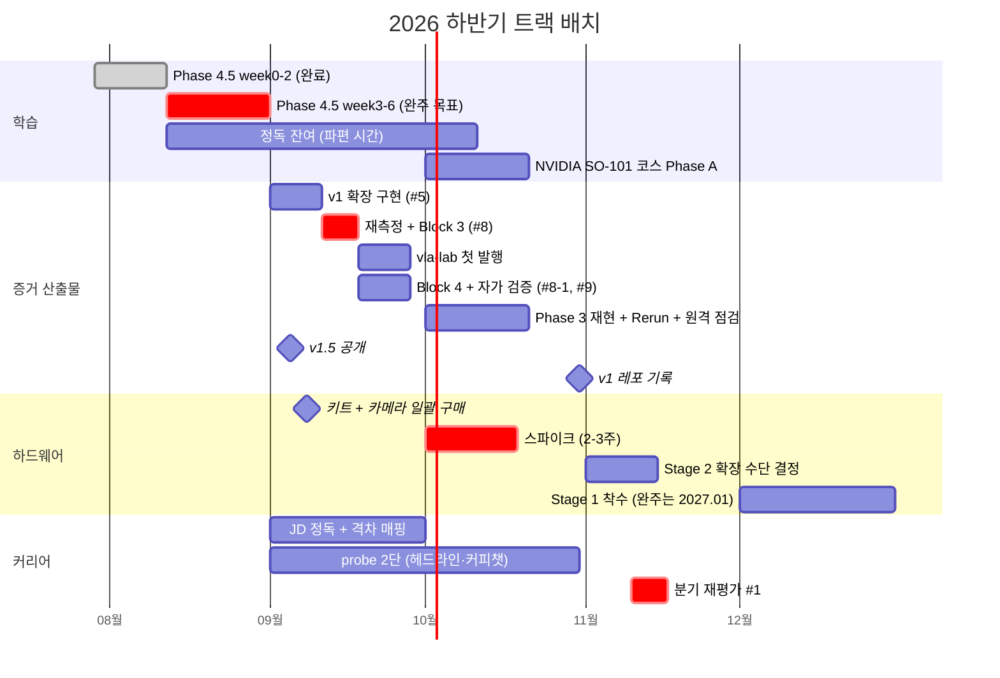

# 2026 하반기 실행 가이드 (8월 - 12월)

> 작성일: 2026-07-28 (최종 갱신: 2026-08-12)
> 대상: 2026.08-12 의 4개 트랙 배치 — 학습 (Phase 4 잔여 / Phase 4.5) / 증거·산출물 (Measurements, vla-lab) / 하드웨어 (스파이크, SO-101 구매) / 커리어 probe
> 사유: 실행 항목이 4개 문서에 흩어져 있어 월 단위 총부하와 트랙 충돌이 보이지 않는다. 시간축으로 한 번 펼쳐 병목·결정 지점·마감을 드러낸다
> 성격: **개관 문서 (체크박스 없음)**. 일상 체크는 [remediation plan](2026-07-07-repo-review-remediation.md) §실행 보드에서만 한다
> 후속: 2027 배치는 [2027 실행 가이드](2026-08-12-year-2027-execution-guide.md)

## 0. 이 문서의 지위

remediation plan §실행 보드가 유일한 일상 체크 보드다 (2026-07-09 지정). 이 문서는 그 보드를 대체하지 않고, 보드에 없는 것 — **월별 총부하, 트랙 간 충돌, 결정 지점의 선후 관계** — 만 보여주는 읽기 전용 지도다. 항목의 정의·통과 기준·체크는 아래 원본에 있다.

| 원본 | 담당 범위 |
|---|---|
| [remediation plan](2026-07-07-repo-review-remediation.md) §실행 보드 | 항목 #1-#15 의 순서와 체크 (단일 보드) |
| [career-review-sync plan](2026-07-20-career-review-sync.md) | JD 정독 타깃, dry-run 수치 기록, vla-lab 발행, 레포 밖 실행 항목 |
| [Roadmap/Phase 4.md](../../../Roadmap/Phase%204.md) | v1 완료 체크리스트 (adapter, schema validation, 재현 스크립트) |
| [Roadmap/Phase 4.5.md](../../../Roadmap/Phase%204.5.md) | Section 0-3 의 내용과 완료 기준 |
| [Roadmap/Hardware-Arm.md](../../../Roadmap/Hardware-Arm.md) | 스파이크·SO-101 구매·카메라 구성·Stage 1 |
| [Studies/Phase 4/notes.md](../../../Studies/Phase%204/notes.md) | 8월 체크포인트 결론, 정독 잔여, 예산 재산정 근거 |
| [README.md](../../../README.md) 부록 D | 2026.11 분기 재평가 #1 안건 원본 |

## 1. 결론 먼저

1. **8월은 Phase 4.5 단일 트랙이다.** Section 0 (week0, 8/3) 과 Section 1 (week1-2, 8/11) 이 닫혔고 week3-6 완주가 8월의 유일한 목표다. 체인이라 끊었다 붙이는 비용이 크고, 증거·인프라 항목과는 스택도 다르다 (v1 int4 vs RLDS·학습).
2. **8월 예산은 이미 소진됐다.** 8/11 시점 추정 25-35h 로 월 예산 30-35h 를 채웠다. 8월에 다른 항목을 끼워 넣을 자리는 없다 (§3.2).
3. **9월은 가장 약한 달로 잡는다.** 휴직 적응기 + 자택 이전이 겹친다. 하드웨어는 **구매만** 하고 조립·검증은 넣지 않는다 (§3.3).
4. **10월이 최대 부하 구간이다.** 스파이크 2-3주 + 9월 이월분이 한 달에 겹친다. 9월에 #5·#8 라인을 끝내는 것이 이 배치의 성립 조건이다 (§3.4).
5. **12월은 Hardware-Arm Stage 1 착수다.** 정독이 파편 시간으로 옮겨 가며 비었던 슬롯을 본 빌드 전진으로 채웠다 — 휴직 구간이 연속 블록을 잡을 수 있는 마지막 기회이고, 2027.01-02 의 과밀이 풀린다 (§3.6, §6.2).

## 2. 전제와 제약

| 항목 | 값 | 출처 |
|---|---|---|
| 가용 시간 | 평일 저녁 약 2h x 4-5일 = 주 8-10h, 월 30-35h (출장·피로 변수로 보수적) | notes.md 8-12월 예산 재산정 |
| 재직 구간 | 2026.06-08 | 결정 #4 |
| 육아휴직 | 2026.09-2027.02 (2026-07-01 신청, **2026-07-28 승인 확정**. 복직 2027.03) | 결정 #4 |
| GPU | RTX 4070 12GB / RAM 31GB / **하드웨어 변경 불가** (증설 대신 RunPod 이관으로 대응). **2026.09 자택 이전 확정**으로 휴직 중에도 물리 접근이 유지된다 (§6.1-A) | 결정 #5 |
| 학습 트랙 | 본격 실지원 (2027.03) 전까지 한 구간 메인 1트랙 | README 전체 로드맵 |
| 휴직 중 원칙 | 구직 지원 없음, 학습·산출물 집중. probe 는 가시성 기준 저강도 | README 전체 로드맵 |

승인 확정으로 확정된 것 2건:

- **9월 개시가 고정됐다** — probe 2단 (LinkedIn 헤드라인 교체·커피챗) 의 선행 조건이 해소돼 9월 1주 집행이 확실해졌다.
- **GPU 물리 접근에 마감이 없다** — 2026.09 자택 이전이 확정돼 휴직 기간 내내 4070 을 직접 만질 수 있다. 배치는 물리 접근이 아니라 가용 시간과 선후 의존으로만 정한다.

**월 30-35h 가정은 신뢰도가 낮다.** 7/29-8/11 2주에 week0-2 를 완주했는데, 이는 그 예산으로 설명되지 않는다. 추정치(Section 0 전반 20-30h)가 부풀려졌거나 실가용이 가정보다 크거나 둘 중 하나이고, 어느 쪽인지 정하지 않으면 9-12월 배치가 전부 틀린 기준 위에 선다. 동시에 반대 방향의 주의도 유효하다 — 휴직은 가용 시간 증가가 아니다 (육아가 주 업무이고 9월은 적응기다). **9월 한 달 실적을 사후 집계해 재산정하는 것이 재평가 #1 의 입력이다.**

## 3. 월별 진행

### 3.1 7월 (완료)

Block 1 (int4 메모리 산수) 과 Block 2 (int8 열위 메커니즘) 를 닫았다. Block 2 의 Step 5·판정 표는 본인 작성이 아니므로 통과 판정은 #9 자가 검증 10문항으로 이관돼 있다.

### 3.2 8월 (Phase 4.5 단일 트랙)

| 구간 | 내용 | 상태 |
|---|---|---|
| 7/29-8/3 | week0 — sim 구축 + 하네스 검증 + zero-shot baseline (실행 보드 #4) | 완료. 산출물 `Measurements/openvla-maniskill-zeroshot/` |
| 8/5-8/6 | week1 — expert 데이터 수집 + action 변환 왕복 검증 | 완료 |
| 8/10-8/11 | week2 — RLDS 변환 + 로더 등록 + 정규화 점검 | 완료 |
| 8/12 | 8월 체크포인트 (결론 3건 — §6.1) | 완료 |
| 8월 잔여 | week3 (Docker + RunPod + LoRA) -> week4 (머지·양자화·4-bit 안착) -> week5 (eval N회) -> week6 (before/after + vla-lab 문서) | 진행 |

week3 과 week4 안에서 실행 보드 #6 (Section 0 후반) 이 닫힌다 — 별도 작업이 아니다.

**8월에 다른 것을 넣지 않는 이유**: 예산이 이미 소진됐고 (§1.2), #8 을 8월로 당겨 얻는 것은 vla-lab 발행이 9월 초냐 중순이냐의 차이뿐이다. 반면 대가는 실재한다 — v1 int4 스택과 RLDS·학습 스택을 오가는 컨텍스트 전환이다.

**파편 시간의 용도**: week3 의 LoRA 본 학습과 week5 의 eval N회는 대부분이 실행 대기다. 그 자리에 정독 잔여 (`Studies/Phase 4/week2`·`week4`·`week5`·`week6`) 를 넣는다.

**조기 경보**: 8월 3주차까지 week3 의 20스텝 probe 가 안 돌면 8월 완주 전제를 그 자리에서 버리고 9-11월 배치를 다시 짠다. week3 은 이 계획에서 유일하게 외부 인프라(RunPod 가용성·비용)에 의존하고 해 본 적 없는 작업이다.

### 3.3 9월 (휴직 개시 — 가장 약한 달로 잡는다)

| 트랙 | 항목 |
|---|---|
| probe | **2단 개시 (1주)** — LinkedIn 헤드라인 교체 ("AMR ROS Engineer" -> "AMR ROS Production SW + Physical AI Integration"), 현직자 커피챗 1-2건. 승인 확정으로 선행 조건 해소 |
| 커리어 | JD 5-10개 정독 + 격차 매핑 1페이지 (실행 보드 #3) — 재평가 #1 입력이라 10월까지는 닫는다 |
| 증거 | #5 v1 확장 구현 -> #8 재측정 + Block 3 -> **vla-lab 첫 발행** -> #8-1 Block 4 -> #9 자가 검증 10문항. 이 순서는 고정이다 (§4 아래 의존 설명) |
| 하드웨어 | **구매만** — 판매자 확인 4항목 문의 -> SO-101 키트 + 손목 카메라 + 작업대 자재 일괄 발주 (약 56-58만원, 리드타임 3일). 조립·검증은 10월 이후 |

9월에 하드웨어 블록을 넣지 않는 이유는 자택 이전과 휴직 적응기가 겹치기 때문이다. 리드타임이 3일이라 구매를 앞당겨도 스파이크 일정에 이득이 없고, 반대로 도착만 시켜 두면 10월 착수가 즉시 가능하다.

판단 포인트는 하나다 — **9월 실적을 사후 집계할 것.** §2 의 예산 가정이 재산정되는 유일한 기회이고, 그 값이 10-12월과 2027 배치의 기준이 된다.

### 3.4 10월 (최대 부하)

| 트랙 | 항목 |
|---|---|
| 하드웨어 | **스파이크 (2-3주)** — 조립 전 드라이버 선검증. Feetech 버스 -> `feetech_ros2_driver` -> ros2_control -> 최소 URDF RViz 확인 |
| 증거 | #10 Phase 3 재현 확인, #11 Rerun 1장, #12 원격 운용 점검 + Jetson CUDA 확인 |
| 산출물 | **v1 레포 기록 마일스톤** — README + latency/throughput 표 (외부 공개는 v2 로 이관) |
| 학습 | #7-1 NVIDIA SO-101 코스 Phase A (10-16h, RunPod headless) — 부하가 넘치면 12월로 |

스파이크가 이 달의 최우선이다. 결과가 재평가 #1 의 입력이고, 1단계에서 막히면 Stage 1 의 ROS2 드라이버 계획을 2026 년 안에 재산정해야 한다. **9월 라인이 밀려 10월로 넘어오면 이 달이 먼저 터진다** — 9월 완주가 배치의 성립 조건인 이유다.

### 3.5 11월

| 트랙 | 항목 |
|---|---|
| 재평가 | **6개월 분기 재평가 #1 (1주)** — 안건은 README 부록 D. 입력: 스파이크 결과 / v1·v1.5 결과 / probe 반응 / 콘텐츠 반응 / OpenVLA 후속 모델 / 둘째 층 증거 점검 / cross-embodiment 좌표 / 검토 보고서 v1.4 이행 점검 / 동역학 라잇 트랙 편입 여부 / DDS·C++ 스택 gap 트랙 편입 여부 / 본격 실지원 개시 시점 재확인 |
| 하드웨어 | **Stage 2 확장 수단 결정** (SO-101 이 이미 6DOF 이므로 과제는 관절 수가 아니라 페이로드·강성) |
| 신규 안건 | **Stage 1 12월 착수의 되돌림 조건 확인** (§6.2) + **9월 실적 기반 예산 재산정** |

안건이 10건을 넘어 1주에 들어가지 않는다. 10월 말부터 입력 자료 (v1·v1.5 결과 요약, probe 반응 로그, 이행 점검 체크, 9월 실적 집계) 를 모아 두는 편이 낫다.

### 3.6 12월 (Hardware-Arm Stage 1 착수)

| 트랙 | 항목 |
|---|---|
| 하드웨어 | **Stage 1 본 빌드 착수** — 키트 조립 (리더 + 팔로워 6DOF) + 손목 카메라 장착 + URDF 작성 + ROS2 드라이버 셋업. 완주는 2027.01 |
| 정리 | 재평가 #1 결론의 문서 반영 |

착수 전 준비는 11월 말에 끝낸다 — `Studies/Hardware-Arm/` Stage 1 가이드 재확인, 작업 공간 정리. 부품은 9월 단일 구매에 손목 카메라와 작업대 자재까지 포함돼 있어 12월에 조달 대기가 없다.

**선행 조건은 10월 스파이크의 3단계 통과다.** 1단계(드라이버 위치 명령)에서 막히면 ROS2 통합 경로를 먼저 재산정해야 하므로 착수가 밀린다 — 그 경우 12월은 아래 §6.2 의 기본값(버퍼)으로 되돌아간다.

**대가**: 8-11월 이월분의 흡수처가 사라진다. 9-11월 잔여 추정 57-87h 가 예산 90-105h 안에서 여유가 얇아 이월 확률이 낮지 않다. 11월 재평가에서 이월 잔량을 확인하고, 크면 Stage 1 착수를 1월로 되돌린다.

## 4. 트랙 뷰

9월 증거 라인의 순서가 고정인 이유는 세 가지 의존 때문이다.

- **#5 -> #8**: 구간 분해 계측이 `inference.py` 를 건드리므로, 리팩터를 나중에 하면 재측정 수치의 유효성을 다시 확인해야 한다. #5 의 벤치마크 재현 스크립트와 #8 의 methodology §3 잔여 2항목 (notebook -> `.py`, `summary.csv`) 은 같은 산출물이라 한 번에 만든다
- **#8 -> vla-lab 발행**: Block 3 완료가 발행 트리거다 (career-sync Task 6)
- **#8 -> #8-1 -> #9**: Block 4 의 입력이 Block 3 의 구간 분해 결과이고, 자가 검증 10문항 중 "병목 구간"·"Jetson 이식 예측" 은 Block 3, "task 경계" 는 Block 4 산출물이다

## 5. 연말 도달 상태 (이 계획이 성립했을 때)

| 산출물 | 상태 | 외부 가시성 |
|---|---|---|
| v1 (OpenVLA zero-shot + ROS2 dry-run) | 레포 기록 완료 (10월) | 비공개 레포 — 외부 공개는 v2 |
| v1.5 (LoRA adaptation + eval) | 완주 (8월 말) | vla-lab 공개 문서 1편 (채널 변경 2026-08-30 — 구 velog). LinkedIn 게시는 probe 2단 개시 (9월) 이후 |
| openvla-rtx4070-int4 실측 | 4블록 + 재측정 완료, vla-lab 발행 (9월) | **공개** (vla-lab) |
| Phase 3 perception | 재현 확인 완료 (supporting) | 레포 내 기록 |
| 자작 팔 | 키트·카메라 확보 (9월) + 드라이버 경로 검증 (10월) + **Stage 1 조립 착수 (12월)**. 완주는 2027.01 | — |
| 커리어 probe | JD 격차 매핑 1페이지 + 헤드라인 교체 + 커피챗 1-2건 | LinkedIn |

즉 연말 기준 외부에서 보이는 것은 **vla-lab 실측 write-up 과 v1.5 공개 2건**이다. 나머지는 전부 비공개 레포 안의 기록이다. 이 비대칭을 인지하고 있어야 11월 재평가의 "콘텐츠 반응" 항목이 의미를 갖는다 — 공개한 게 2건뿐이면 반응 데이터도 2건치다.

## 6. 결정 지점

### 6.1 8월 체크포인트 (2026-08-12, 종료)

결론 3건. 원본은 [notes.md](../../../Studies/Phase%204/notes.md) "8월 체크포인트 결론".

| 안건 | 결론 |
|---|---|
| git author 재작성 (filter-repo) | **실행 안 함.** 이 레포는 비공개 유지, 공개는 vla-lab 분리라 재작성 사유가 없다. 대체 조치로 두 레포의 커밋 신원을 `tylee-yeonge <tylee.yeonge@gmail.com>` 으로 통일 (레포 로컬 설정). 작업 컨테이너의 전역 `.gitconfig` 는 읽기 전용이라 회사 이메일이 남아 있으므로, 새 레포마다 `git config user.email` 을 1회 건다 |
| 정독 잠정치 | **20-30h 유지 + `week2` 실측으로 확정.** 실적 기록이 없어 지금 숫자를 바꿀 근거가 없다. 배치는 파편 시간 (Phase 4.5 실행 대기) |
| 하드웨어 스파이크 시기 | **2026.09 구매 / 2026.10 실행.** 9월은 적응기·이전이 겹쳐 2-3주 블록에 부적합하고, Phase 4.5 를 8월에 완주하면 10월의 트랙 충돌이 사라진다. 10월 실행이면 재평가 #1 입력 타이밍도 맞는다 |

### 6.1-A 확정된 것 — 4070 PC 자택 이전 (2026.09)

파급 4건:

| 항목 | 결과 |
|---|---|
| GPU 종속 항목 (#8·#10·#11) 의 8월 마감 | **해제.** 휴직 중에도 직접 만질 수 있다 |
| 배치 기준 | 희소 자원이 물리 접근이 아니므로 **선후 의존과 소요 시간**으로 정한다 |
| Stage 1 실행 머신 | 팔·카메라·학습·Sim 이 4070 PC 한 대에 모인다. 분리 구성과 Jetson 대체 경로는 불필요 |
| #12 원격 운용 점검 / Tailscale 원격 GUI 검증 | 보험으로 격하. 출장지 원격 사용이 필요해질 때 수행 |

**Stage 1 의 Isaac Sim 항목에 남은 위험은 접근성이 아니라 사양이다.** Isaac Sim 5.x 최소 사양이 VRAM 16GB / RAM 32GB 인데 본 PC 는 12GB / 31GB 이고 증설이 불가하다 (Hardware-Arm.md 실행 머신 절). 로컬에서 감당하지 못하는 것으로 드러나면 **"Isaac Sim URDF 임포트 + Joint State 매칭" 1개 항목만 Phase 6 (2027.05-07) 로 이월**한다 — 손실은 Sim 임포트 영상이 2027.02 마감을 넘기는 정도다. RunPod 은 대안이 되지 못한다 (UDP 미지원으로 GUI 스트리밍 불가).

### 6.2 12월 슬롯 배정 — Hardware-Arm Stage 1 전진 (2026-08-12 결정)

**Stage 1 본 빌드를 2026.12-2027.01 로 배치한다.** 근거 셋:

- **휴직 구간(-2027.02)이 연속 블록을 잡을 수 있는 마지막 기회**다. 조립·디버깅은 파편 시간으로 안 되는 작업이고, 복직 후에는 확보가 불가능하다
- "첫 하드웨어는 계획의 2-3배 걸린다" 가 이 레포 자신의 전제다. 35-55h 추정이 낙관일 가능성이 높으므로, must 마감(2027.02 말, 서류가 소비하는 실물 증거) 앞에 한 달 버퍼를 두는 편이 방어적이다
- 2027.01-02 의 과밀이 풀린다 — 초기 패키징(2-3주)이 2027.02 단독 구간을 갖고, Stage 1 의 nice 2건(Isaac Sim 임포트, ACT 1회)을 실제로 시도할 여지가 생긴다

비채택 후보와 사유:

| 후보 | 비채택 사유 |
|---|---|
| 스택 gap (C++ 코어 / DDS 서사화) 전진 | career positioning spec §6.2 가 2027.02 말-03 병합 배치로 결론냈고, 그 근거 (실질 마감은 코딩테스트, 면접 직전일수록 신선) 는 12월 전진으로 바뀌지 않는다 |
| Phase 5 (FM 기초) 전진 | "밀려도 손실이 가장 작은 항목" 을 앞당기는 우선순위 역전 |
| 버퍼로 비워 둔다 | 슬롯을 소비하지 않는다. 되돌림 경로로만 유지 (아래) |

**되돌림 조건 2개.** 하나라도 깨지면 Stage 1 을 원안(2027.01-02)으로 되돌리고 12월은 버퍼로 쓴다 — 재평가 #1 에서 확인한다.

- 10월 스파이크가 3단계까지 통과할 것
- 11월 말 시점 8-11월 이월 잔량이 12월 예산의 절반(약 15h) 이하일 것

**한계**: 이 전진이 2027.01 조기 지원 옵션을 살려주지는 않는다. 조기 지원을 택하면 패키징이 1월에 필요한데 Stage 1 이 1월까지 이어지므로 충돌이 남는다 — 완화될 뿐이다.

이 결정은 career positioning spec §6.2 의 전제 ("2026.09-12 는 만재라 새 트랙이 들어갈 자리가 없다" / "2027.01-02 도 만재") 를 함께 흔든다. 스택 gap 배치의 재검토는 재평가 #1 에서 같은 자리에서 한다.

### 6.3 11월 분기 재평가 #1

이 문서 범위에서 유일하게 "계획을 바꾸는" 지점이다. 원안 고수도 정당한 결론이다. 하드웨어 발주가 더 이상 이 결론에 게이트돼 있지 않으므로 (SO-101 리드타임 3일, 9월 구매 확정), 재평가가 밀려도 하드웨어 일정은 영향을 받지 않는다.

이 자리의 신규 안건 3건: Stage 2 확장 수단 결정 / **Stage 1 12월 착수의 되돌림 조건 확인** (§6.2) / 9월 실적 기반 예산 재산정 (§2).

## 7. 리스크

**week3 의 외부 의존** — 이 계획에서 유일하게 해 본 적 없는 작업이고 RunPod 의 가용성·비용에 걸려 있다. 8월 완주가 깨지면 9-11월 전체가 한 달씩 밀리고, 흡수처인 12월 버퍼까지 소진된다. 완화는 §3.2 의 조기 경보 (8월 3주차 20스텝 probe).

**9월 라인의 이월** — #5·#8 라인이 9월을 넘기면 10월에 스파이크와 정면으로 겹친다. 10월은 이 배치에서 가장 빡빡한 달이라 흡수 여력이 없다.

**예산 가정의 미검증** — §2. 실적이 가정을 초과했다는 신호와 휴직 후 감소 가능성이 동시에 있어 어느 쪽으로도 확정하지 못한 상태다. 9월 실적을 집계하지 않으면 10-12월과 2027 배치가 근거 없는 수치 위에 선다.

**외부 가시성의 편중** — 연말 기준 공개물이 2건뿐이다 (§5). 재평가 #1 의 "콘텐츠 반응" 입력이 얇아지는 것은 계획의 구조적 결과이지 실행 실패가 아니다 — 그 사실을 알고 해석해야 한다.

**12월 버퍼의 소멸** — Stage 1 을 12월에 착수하면 8-11월 이월분의 흡수처가 없어진다. 이월이 발생하면 Stage 1 착수가 밀리고, 그 지연은 must 마감(2027.02 말) 앞의 한 달 버퍼를 먹는다. 완화는 §6.2 의 되돌림 조건.

**정독의 착지 실패** — 파편 시간 배치는 흡수처가 유연한 대신 마감이 없다. 이 항목은 Phase 4 완료 체크리스트의 "RT-2 / OpenVLA 아키텍처를 막힘없이 설명 가능" 을 닫는 것이라, 밀려도 안전한 것은 일정이지 v1 의 완결성이 아니다.

## 부록: 항목 - 원본 매핑

| 이 문서의 항목 | 원본 위치 |
|---|---|
| 실행 보드 #1-#15 (+#8-1) | remediation plan §실행 보드 |
| Block 1-4 통과 기준 | remediation plan Task 2-1·2-2 + findings.md §4 각 블록 골격 |
| 자가 검증 10문항 | remediation plan Task 2-3 (문항 원본은 `.private/reviews/` 검토 보고서 §2.6) |
| JD 정독 타깃 목록 | career-sync plan Task 2 |
| vla-lab 발행 조건 | career-sync plan Task 6 |
| dry-run 전체 루프 수치 | career-sync plan Task 5 |
| Section 0-3 상세 | Roadmap/Phase 4.5.md |
| v1 완료 체크리스트 | Roadmap/Phase 4.md |
| 스파이크·SO-101 구매·카메라 구성·Stage 1-2 | Roadmap/Hardware-Arm.md |
| 8월 체크포인트 결론 | Studies/Phase 4/notes.md 진행 원칙 + 8-12월 예산·배치 결론 |
| 재평가 #1 안건 | README.md 부록 D |
