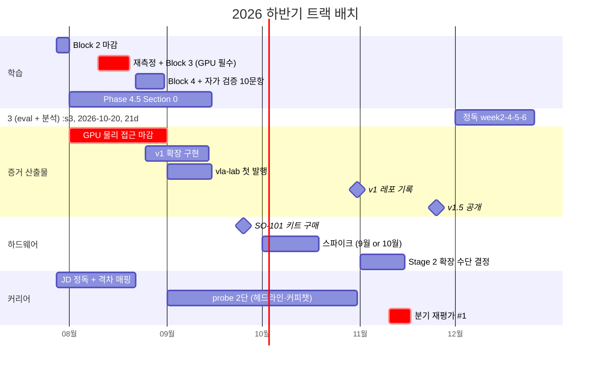

# 2026 하반기 실행 가이드 (7월 말 - 12월)

> 작성일: 2026-07-28
> 대상: 2026.08-12 의 4개 트랙 배치 — 학습 (Phase 4 잔여 / Phase 4.5) / 증거·산출물 (Measurements, vla-lab) / 하드웨어 (스파이크, SO-101 구매) / 커리어 probe
> 사유: 실행 항목이 4개 문서에 흩어져 있어 월 단위 총부하와 트랙 충돌이 보이지 않는다. 시간축으로 한 번 펼쳐 병목·결정 지점·마감을 드러낸다
> 성격: **개관 문서 (체크박스 없음)**. 일상 체크는 [remediation plan](2026-07-07-repo-review-remediation.md) §실행 보드에서만 한다

## 0. 이 문서의 지위

remediation plan §실행 보드가 유일한 일상 체크 보드다 (2026-07-09 지정). 이 문서는 그 보드를 대체하지 않고, 보드에 없는 것 — **월별 총부하, 트랙 간 충돌, 결정 지점의 선후 관계** — 만 보여주는 읽기 전용 지도다. 항목의 정의·통과 기준·체크는 아래 원본에 있다.

| 원본 | 담당 범위 |
|---|---|
| [remediation plan](2026-07-07-repo-review-remediation.md) §실행 보드 | 항목 #1-#15 의 순서와 체크 (단일 보드) |
| [career-review-sync plan](2026-07-20-career-review-sync.md) | JD 정독 타깃, dry-run 수치 기록, vla-lab 발행, 레포 밖 실행 항목 |
| [Roadmap/Phase 4.md](../../../Roadmap/Phase%204.md) | v1 완료 체크리스트 (adapter, schema validation, 재현 스크립트) |
| [Roadmap/Phase 4.5.md](../../../Roadmap/Phase%204.5.md) | Section 0-3 의 내용과 완료 기준 |
| [Roadmap/Hardware-Arm.md](../../../Roadmap/Hardware-Arm.md) | 스파이크·SO-101 구매·카메라 구성·Stage 1 |
| [Studies/Phase 4/notes.md](../../../Studies/Phase%204/notes.md) | 8월 초 체크포인트 안건, 정독 잔여분, 예산 재산정 근거 |
| [README.md](../../../README.md) 부록 D | 2026.11 분기 재평가 #1 안건 원본 |

## 1. 결론 먼저

1. **8월은 예산의 약 2배가 잡혀 있다** — 배정 항목 추정 합 55-70h vs 월 예산 30-35h (§3.2). 절삭은 선택이 아니라 전제다.
2. **절삭 기준은 선후 의존과 소요 시간이다** — 자택 이전 확정(2026.09)으로 4070 물리 접근은 더 이상 희소 자원이 아니다. 따라서 8월에는 **뒤 항목의 선행 조건이 되는 일**(Section 0 의 sim·baseline, #8 재측정)을 앞에 두고, 독립적인 일은 9월 이후로 미룬다.
3. **인프라를 8월 초로 당긴다** — 실행 보드에서 #12 (원격 운용 전환 점검) 는 8월 마지막에 있는데, 나머지 GPU 작업 전부의 보험이므로 **먼저** 해야 순서가 맞는다. 다만 Section 0 의 Docker 화 (학습 측만 — 결정 #5) 는 그 검증인 LoRA 1사이클 실측의 입력이 sim 데이터라 sim 구축에 의존한다 — 앞당길 수 있는 것은 추론 전용 이미지의 RunPod 재현까지다 (§3.2).
4. **10월에 트랙이 겹친다** — Phase 4.5 Section 2-3 과 하드웨어 스파이크가 같은 달이다. "한 구간 1트랙" 원칙과 충돌하며, 8월 초 체크포인트에서 스파이크를 9월로 당겨도 충돌 위치만 이동한다 (§6.2).
5. **하드웨어 조달에 날짜 제약이 없다** — SO-101 은 국내 조달 리드타임이 3일이라 구매 시점을 스파이크 시기에만 맞추면 된다. 12월 발주 마감 같은 고정점이 없다 (§3.6).

## 2. 전제와 제약

| 항목 | 값 | 출처 |
|---|---|---|
| 가용 시간 | 평일 저녁 약 2h x 4-5일 = 주 8-10h, 월 30-35h (출장·피로 변수로 보수적) | notes.md 8-12월 예산 재산정 |
| 재직 구간 | 2026.06-08 | 결정 #4 |
| 육아휴직 | 2026.09-2027.02 (2026-07-01 신청, **2026-07-28 승인 확정**. 복직 2027.03) | 결정 #4 |
| GPU | RTX 4070 12GB / RAM 31GB / **하드웨어 변경 불가** (증설 대신 RunPod 이관으로 대응). **2026.09 자택 이전 확정**으로 휴직 중에도 물리 접근이 유지된다 (§6.1) | 결정 #5 |
| 학습 트랙 | 본격 실지원 (2027.03) 전까지 한 구간 메인 1트랙 | README 전체 로드맵 |
| 휴직 중 원칙 | 구직 지원 없음, 학습·산출물 집중. probe 는 가시성 기준 저강도 | README 전체 로드맵 |

승인 확정으로 확정된 것 2건:

- **9월 개시가 고정됐다** — probe 2단 (LinkedIn 헤드라인 교체·커피챗) 의 선행 조건이 해소돼 9월 실행이 확실해졌다. 8월 말에 헤드라인 문안을 미리 준비해 두면 9월 1주에 바로 집행할 수 있다.
- **GPU 물리 접근에 마감이 없다** — 2026.09 자택 이전이 확정돼 휴직 기간 내내 4070 을 직접 만질 수 있다. 8월 배치는 물리 접근이 아니라 가용 시간과 선후 의존으로만 정한다.

남은 주의 1건: 월 30-35h 가정은 **재직 구간 기준**으로 산정된 값이다. 휴직 = 가용 시간 증가가 아니다 (육아가 주 업무이고, 9월은 적응기라 오히려 줄 수 있다). 9월 실적으로 재산정할 대상이며, 늘어난다고 전제하고 배치하면 안 된다.

## 3. 월별 진행

### 3.1 7월 잔여 (7/28-7/31, 약 6-8h)

| 항목 | 내용 | 추정 |
|---|---|---|
| Block 2 — **완료** (커밋 `5caaf77`) | findings §4.2 5개 Step + 완료 판정 표 전부 닫힘, Task 2-1 완료. 통과 판정은 #9 자가 검증에서 한다 (Step 5·판정 표가 `(by claude)` 작성) | — |
| JD 정독 착수 | 실행 보드 #3. 타깃 목록은 career-sync Task 2 갱신본 (제조사 본사 2개 공고 자격요건 vs v1/v1.5/v2.5 일대일 매핑 우선) | 4-6h (8월 이월 가능) |
| 7월 실적 집계 | 8월 초 체크포인트의 입력 — 7월 실가용 시간을 사후 집계 | 0.5h |

Phase 4.5 Section 0 (실행 보드 #4) 은 "7월 후반 조기 착수" 로 배치돼 있었으나 착수하지 못했다. 8월로 이월 확정 — 이것이 §3.2 과밀의 직접 원인이다.

7월 잔여 3-4일에 Section 0 을 착수하지 않은 이유: Section 0 은 추정 30-40h 라 6-8h 로는 5분의 1도 진행되지 않고 중단된다. 반면 Block 2 는 5분의 4가 완료된 상태라 중단 후 재진입 비용이 가장 컸고 남은 분량이 잔여 기간에 맞았다 — 그래서 Block 2 를 먼저 닫았다. Section 0 의 실제 마감은 8월 말이 아니라 **Section 1 착수 (9월 중순) 전에 zero-shot baseline 확보**이므로 (§3.2 3층), 8월 2주차 착수로도 일정이 성립한다.

### 3.2 8월 (30-35h 예산, 최대 과밀 구간)

배정된 것을 전부 적으면 다음과 같다. "추정" 은 원본에 시간이 명시되지 않아 이 문서에서 붙인 값이다.

| # | 항목 | GPU 물리 접근 | 추정 |
|---|---|---|---|
| — | 8월 초 체크포인트 (안건 6건) | 불요 | 1-2h |
| 5 | v1 확장 구현 — `RobotPolicy` adapter + action schema validation + 벤치마크 재현 스크립트 | 불요 (RunPod 대체 가능) | 8-12h 추정 |
| 6 | Section 0 전반 — sim 구축 + zero-shot baseline | 불요 (RunPod 가능) | 20-30h 추정 |
| 6 | Section 0 후반 — Docker 화 + RunPod 재현 + LoRA 1사이클 실측 | 불요 | 8-12h 추정 |
| 6 | fine-tuned 4-bit 의 4070 안착 확인 | **필요** | 1-2h |
| 8 | 재측정 + **Block 3** (구간 분해 + methodology §3 잔여 + 수치 갱신) | **필요** | 4-6h |
| 8-1 | **Block 4** (3.33 Hz 조건부 판정) — 새 측정 없음 | 불요 | 2-3h |
| 9 | 자가 검증 10문항 | 불요 | 1-2h 추정 |
| 10 | Phase 3 재현 확인 (TensorRT 재빌드 + week8 노드) | **필요** | 3-4h 추정 |
| 11 | Rerun 스크린샷/gif 1장 | **필요** | 1-2h 추정 |
| 12 | 4070 원격 운용 전환 점검 + GPU 잔여 0건 확인 | **필요** | 2-3h 추정 |
| — | dry-run 전체 루프 수치 기록 위치 확인 (career-sync Task 5) | 조건부 | 1-3h |
| — | vla-lab 첫 산출물 발행 (Block 3 완료가 트리거) | 불요 | 4-6h 추정 |

합계 추정 **55-70h**. 예산 30-35h 의 약 2배다. 그대로 밀면 8월 말에 절반이 미완으로 남고, 하필 미완으로 남기 쉬운 것이 뒤에 배치된 GPU 항목 (#10-#12) 이다.

권장 배치 — 자원 종류로 3층 분리:

**1층 (8월 1-2주, 인프라 — 나머지 전부의 보험)**

- #12 의 원격 운용 전환 점검을 **먼저** 한다: BIOS 전원 복구 자동 부팅, 접속 경로 이중화 (SSH + 오버레이 VPN), `kernel.panic` sysctl. 선행 의존이 없어 즉시 착수 가능하다. 이게 되면 9월 이후에도 4070 을 원격으로 쓸 수 있어, 2층 항목이 8월에 밀렸을 때의 유일한 회수 경로가 된다
- **추론 전용 이미지의 RunPod 재현**: v1 자산 (OpenVLA 4-bit 추론) 만으로 만들 수 있어 sim 구축을 기다리지 않는다. 하드웨어 장애는 원격 접속으로 못 푸는 계층이라 이쪽이 그 보험이다. Section 0 의 학습 측 컨테이너 (eval 은 로컬 유지 — 결정 #5) 는 그 검증인 LoRA 1사이클 실측이 sim 데이터에 의존하므로 3층으로 간다
- 8월 초 체크포인트 (안건 6건) 를 이 구간에 끼운다

**2층 (8월 2-3주, 물리 접근이 필요한 실측)**

- **#8 재측정 + Block 3** → 구간 분해 + methodology §3 잔여 4항목 + SETUP §1.3 · README Evidence 수치 갱신. **이 층에서 가장 큰 덩어리이자 vla-lab 첫 발행의 트리거**다
- #10 Phase 3 재현 확인 (TensorRT 엔진은 GPU 아키텍처 종속 — 재빌드는 여기서만 가능)
- #11 Rerun 시각 자료

**3층 (8월 4주 이후 — 9월 이월 허용)**

- **#8-1 Block 4** + **#9 자가 검증 10문항** (한 묶음). Block 4 는 새 측정이 없어 GPU 가 필요 없고, #9 는 Block 4 산출물("task 경계" 문항)에 의존하므로 순서가 고정이다. 9월로 밀려도 손실이 없다 — 자택 이전 확정으로 막히는 문항이 나왔을 때 언제든 재측정할 수 있다
- Section 0 의 sim 구축 + zero-shot baseline (RunPod 로 가능 → 휴직 중에도 안전). 실제 마감은 8월 말이 아니라 Section 1 착수 (9월 중순) 전
- Section 0 의 학습 측 Docker 화 + RunPod 재현 (검증 입력인 학습 데이터가 sim 구축에 의존 — 1층으로 당길 수 없다)
- #5 v1 확장 구현 (코드 작업 — GPU 무관)
- vla-lab 첫 산출물 발행 (Block 3 완료가 트리거이므로 2층 직후 착수 가능)

즉 8월에 반드시 끝내야 하는 것은 1층 + 2층 (추정 13-20h) 이고, 이건 예산 안에 들어간다. 3층을 8월에 우겨넣으려는 시도가 계획을 깨뜨린다.

**Block 3·4 시점 요약** (findings.md 와 실행 보드의 정합 결과): Block 3 은 vla-lab 첫 발행의 트리거라 **8월 2-3주 고정**, Block 4 는 새 측정이 없어 **8월 4주 권장 / 9월 이월 허용**이다. 둘을 한 항목으로 묶어 두면 소요가 큰 쪽이 작은 쪽을 붙잡아 8월 부하가 과대 계상된다.

### 3.3 9월 (휴직 개시 — 확정)

| 트랙 | 항목 |
|---|---|
| 학습 | Phase 4.5 Section 1 — sim 데이터 생성 + 포맷팅 (1-2주). Section 2 착수 — LoRA 학습 + 로컬 이식 (2-3주, 9-10월) |
| 증거 | 8월 3층 이월분 흡수. vla-lab 첫 산출물 발행 (늦어도 9월) |
| probe | **2단 개시** — LinkedIn 헤드라인 교체 ("AMR ROS Engineer" → "AMR ROS Production SW + Physical AI Integration"), 현직자 커피챗 1-2건. 승인 확정으로 선행 조건 해소 — 9월 1주 집행 |
| 하드웨어 | 8월 초 체크포인트에서 스파이크를 "9월 절충안" 으로 확정했다면 여기서 2-3주 |

9월의 판단 포인트: probe 2단은 11월 재평가 전에 약 2개월의 신호 수집 기간을 확보하려고 9월에 두는 것이다. 승인이 확정돼 시점 리스크는 사라졌으므로, 남은 변수는 본인이 9월 1주에 실제로 집행하는지뿐이다 — 밀리는 만큼 재평가 #1 의 "probe 반응" 입력이 얇아진다.

### 3.4 10월

| 트랙 | 항목 |
|---|---|
| 학습 | Section 2 마무리 + Section 3 착수 (eval harness + before/after 분석, 2-3주, 10-11월) |
| 산출물 | **v1 레포 기록 마일스톤** — README + latency/throughput 표 (외부 공개는 v2 로 이관) |
| 하드웨어 | 스파이크 원안 시점 (2-3주) — 9월로 당겼으면 제외 |

여기가 §1.4 의 충돌 지점이다. 상세는 §6.2.

### 3.5 11월

| 트랙 | 항목 |
|---|---|
| 학습 | Section 3 마무리 → **v1.5 공개 마일스톤** (LoRA adaptation, 블로그 1편 + velog/LinkedIn) |
| 재평가 | **6개월 분기 재평가 #1 (1주)** — 입력: 스파이크 결과 / v1 결과 / probe 반응 / 콘텐츠 반응 / OpenVLA 후속 모델 / 둘째 층 증거 점검 / cross-embodiment 좌표 / 검토 보고서 v1.4 이행 점검 / 동역학 라잇 트랙 편입 여부 / 본격 실지원 개시 시점 재확인 |
| 하드웨어 | **Stage 2 확장 수단 결정** (SO-101 이 이미 6DOF 이므로 과제는 관절 수가 아니라 페이로드·강성 — 2026.11 안건) |

재평가 #1 은 이 문서 범위에서 가장 무게가 큰 이벤트다. 안건 10건이 1주에 들어가지 않으므로, 10월 말부터 입력 자료 (v1 결과 요약, probe 반응 로그, 이행 점검 체크) 를 미리 모아 두는 편이 낫다.

### 3.6 12월

| 트랙 | 항목 |
|---|---|
| 하드웨어 | 12월 말 Studies/Hardware-Arm/ Stage 1 가이드 재확인 (팔은 9-10월에 이미 도착) |
| 학습 | 정독 week2·4·5·6 (20-30h, GPU 무관 — 이월 안전 항목의 착지점) |
| 정리 | 11월 재평가 결론의 문서 반영. 2027.01 지원 개시 여부는 재평가 결론에 따름 |

12월에는 하드웨어 부하가 없다 — 리드타임 3일이라 구매가 스파이크 시기 (9-10월) 에 끝나므로 발주·도착이 12월에 걸리지 않는다. 정독 소화와 재평가 결론 반영에 쓰는 달이다.

## 4. 트랙 뷰

## 5. 연말 도달 상태 (이 계획이 성립했을 때)

| 산출물 | 상태 | 외부 가시성 |
|---|---|---|
| v1 (OpenVLA zero-shot + ROS2 dry-run) | 레포 기록 완료 (10월) | 비공개 레포 — 외부 공개는 v2 |
| v1.5 (LoRA adaptation + eval) | 공개 (11월) | 블로그 1편 + velog/LinkedIn |
| openvla-rtx4070-int4 실측 | 4블록 + 재측정 완료, vla-lab 발행 | **공개** (vla-lab) |
| Phase 3 perception | 재현 확인 완료 (supporting) | 레포 내 기록 |
| v2.5 (자작 데이터셋) | 팔 확보만 — 수집·학습은 2027.03 v2.5 착수 구간 (Stage 1 must 완료 후, 실지원 병행) | — |
| 커리어 probe | JD 격차 매핑 1페이지 + 헤드라인 교체 + 커피챗 1-2건 | LinkedIn |

즉 연말 기준 외부에서 보이는 것은 **vla-lab 실측 write-up 과 v1.5 공개 2건**이다. 나머지는 전부 비공개 레포 안의 기록이다. 이 비대칭을 인지하고 있어야 11월 재평가의 "콘텐츠 반응" 항목이 의미를 갖는다 — 공개한 게 2건뿐이면 반응 데이터도 2건치다.

## 6. 결정 지점

### 6.1 8월 초 체크포인트 (안건 4건 등재 + 이 문서 제안 1건)

notes.md 진행 보드가 안건 목록의 원본이다. 등재된 4건:

1. 조기 결론 재확인 — Section 0 은 2026.08 / Sections 1-3 은 2026.09-11 유지 여부
2. 하드웨어 스파이크 실행 시기 — 9월 절충안 vs 원안 10월. SO-101 키트 구매 시점이 여기에 연동된다 (리드타임 3일). 판매자 확인 4항목 (리더암 기어비 등, Hardware-Arm.md) 은 구매 전 처리
3. 정독 잔여 (week2·4·5·6) 잠정치 20-30h 갱신
4. git filter-repo 실행 여부 확정 — 레포 비공개 유지 + 산출물 repo 분리로 불요 예상, vla-lab 신원 설정 확인으로 대체

이 문서가 추가로 올리는 안건 1건:

**(5) §3.2 의 3층 분리를 채택할지.** 채택하면 8월 미완 항목이 "이월 예정" 으로 명시되고, 채택하지 않으면 8월 말에 무엇이 미완인지가 우연히 결정된다.

### 6.1-A 확정된 것 — 4070 PC 자택 이전 (2026.09)

파급 4건:

| 항목 | 결과 |
|---|---|
| GPU 종속 항목 (#8·#10·#11) 의 8월 마감 | **해제.** 휴직 중에도 직접 만질 수 있다 |
| §3.2 의 절삭 기준 | 희소 자원이 물리 접근이 아니므로 **선후 의존과 소요 시간**으로 재작성됨 |
| Stage 1 실행 머신 | 팔·카메라·학습·Sim 이 4070 PC 한 대에 모인다. 분리 구성과 Jetson 대체 경로는 불필요 |
| #12 원격 운용 점검 / Tailscale 원격 GUI 검증 | 보험으로 격하. 출장지 원격 사용이 필요해질 때 수행 |

**Stage 1 의 Isaac Sim 항목에 남은 위험은 접근성이 아니라 사양이다.** Isaac Sim 5.x 최소 사양이 VRAM 16GB / RAM 32GB 인데 본 PC 는 12GB / 31GB 이고 증설이 불가하다 (Hardware-Arm.md 실행 머신 절). 로컬에서 감당하지 못하는 것으로 드러나면 **"Isaac Sim URDF 임포트 + Joint State 매칭" 1개 항목만 Phase 6 (2027.05-07) 로 이월**한다 — 복직이 2027.03 이라 Phase 6 와 자연스럽게 붙고, 손실은 Sim 임포트 영상이 2027.02 마감을 넘기는 정도다. RunPod 은 대안이 되지 못한다 (UDP 미지원으로 GUI 스트리밍 불가).

### 6.2 10월 트랙 충돌 (미해결 — 재평가 안건)

Phase 4.5 Sections 1-3 (2026.09-11) 과 하드웨어 스파이크 (2-3주) 가 겹친다. remediation plan §0.1 에 "한 구간 1트랙 원칙과 충돌 — 8월 체크포인트 / 2026.11 재평가 안건" 으로 이미 등재된 문제다. 선택지는 셋이고, 어느 것도 공짜가 아니다:

| 선택 | 대가 |
|---|---|
| 스파이크를 9월로 | Section 1-2 착수가 3주 밀림 → v1.5 공개 (11월) 압박 |
| 스파이크를 10월 유지 | Section 2-3 과 병행 → 주 8-10h 예산에서 양쪽 다 느려짐 |
| 스파이크를 12월 이후로 | 재평가 #1 의 입력에서 "스파이크 결과" 가 빠짐 — 재평가 항목 하나가 무효화됨 |

세 번째가 가장 손해가 크다 (재평가 설계 자체를 훼손). 1-2 중 선택이며, v1.5 공개 시점을 11월에 고정할지 12월까지 허용할지가 실질 판단이다.

### 6.3 11월 분기 재평가 #1

이 문서 범위에서 유일하게 "계획을 바꾸는" 지점이다. 원안 고수도 정당한 결론이다. 하드웨어 발주가 더 이상 이 결론에 게이트돼 있지 않으므로 (SO-101 리드타임 3일), 재평가가 밀려도 하드웨어 일정은 영향을 받지 않는다. 대신 Stage 2 확장 수단 결정이 이 자리의 신규 안건이다.

## 7. 리스크

**8월 과밀** — §3.2. 완화는 3층 분리. 완화하지 않으면 뒤 항목의 선행 조건(Section 0 의 sim·baseline)이 미완으로 남아 9월 착수가 밀린다.

**GPU 는 9월 이후에도 로컬 자산** — 자택 이전 확정으로 물리 접근이 유지되므로, 8월 미완 항목은 9월 이후에 그대로 이어서 할 수 있다. 남는 리스크는 시점이 아니라 **선후 의존**이다 — Section 0 이 밀리면 Sections 1-3 전체가 밀린다.

**Section 0 의 불확실성** — sim 구축은 이 계획에서 유일하게 "해 본 적 없는" 작업이고 추정 20-30h 도 근거가 약하다. 실제로 2배가 걸리면 9-10월 Sections 1-3 이 연쇄로 밀리고 v1.5 공개 (11월) 가 12월로 간다. 조기 경보 지표: 8월 말까지 zero-shot baseline 측정이 안 나오면 v1.5 일정을 재평가 #1 이 아니라 그 시점에 조정한다.

**정독 잔여 20-30h 의 착지 실패** — week2·4·5·6 정독은 계속 뒤로 밀려 12월에 몰려 있다. GPU 무관이라 휴직 중으로 넘겨도 안전하다는 판단이 붙어 있지만, 이건 Phase 4 완료 체크리스트의 "RT-2 / OpenVLA 아키텍처를 막힘없이 설명 가능" 을 닫는 항목이다. 즉 밀려도 안전한 것은 일정이지 v1 의 완결성이 아니다.

**월 30-35h 가정의 휴직 후 유효성** — §2 주의. 9월 한 달 실적으로 재산정하지 않으면 10-12월 배치가 전부 낙관 편향 위에 서게 된다.

## 부록: 항목 - 원본 매핑

| 이 문서의 항목 | 원본 위치 |
|---|---|
| 실행 보드 #1-#15 (+#8-1) | remediation plan §실행 보드 |
| Block 1-4 통과 기준 | remediation plan Task 2-1·2-2 + findings.md §4 각 블록 골격 |
| 자가 검증 10문항 | remediation plan Task 2-3 (문항 원본은 `.private/reviews/` 검토 보고서 §2.6) |
| JD 정독 타깃 목록 | career-sync plan Task 2 |
| vla-lab 발행 조건 | career-sync plan Task 6 |
| dry-run 전체 루프 수치 | career-sync plan Task 5 |
| Section 0-3 상세 | Roadmap/Phase 4.5.md |
| v1 완료 체크리스트 | Roadmap/Phase 4.md |
| 스파이크·SO-101 구매·카메라 구성·Stage 1-2 | Roadmap/Hardware-Arm.md |
| 8월 초 체크포인트 안건 | Studies/Phase 4/notes.md 진행 원칙 + 조기 수행 노트 |
| 재평가 #1 안건 | README.md 부록 D |
